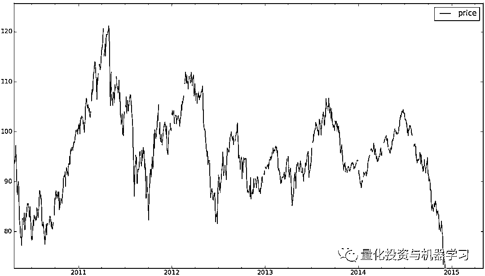
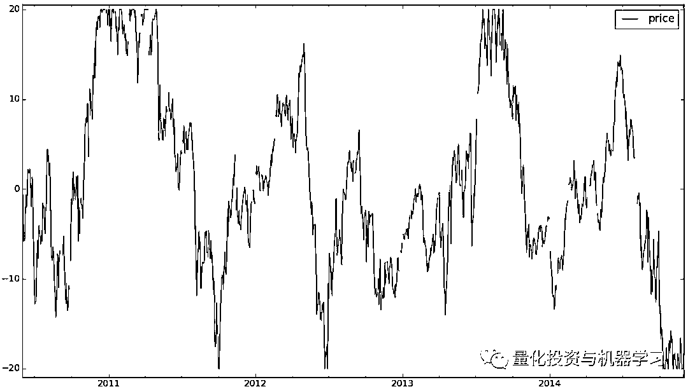
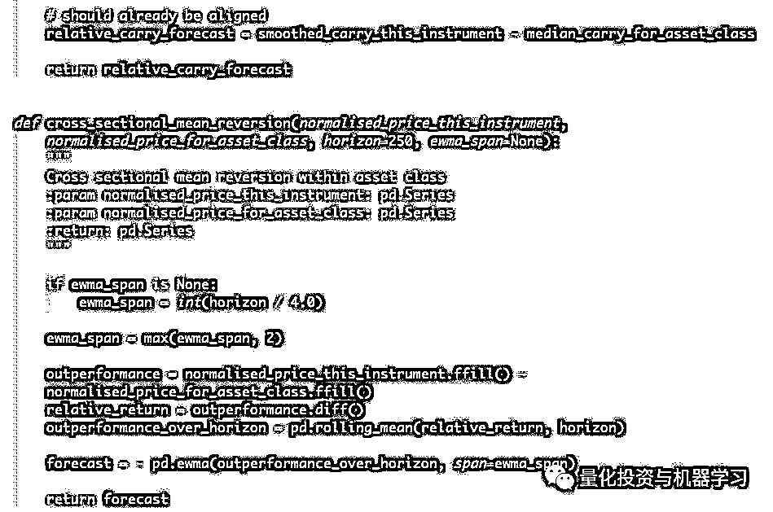

# 一个赚钱的突破交易规则！

> 原文：[`mp.weixin.qq.com/s?__biz=MzAxNTc0Mjg0Mg==&mid=2653293466&idx=1&sn=cfbf8de0f423d0f20d32e268ee9303c3&chksm=802dc98fb75a4099b64ff5a4c441da336935f1c38b508ca1745e89c8c4cb43b7e36bc81c1f89&scene=27#wechat_redirect`](http://mp.weixin.qq.com/s?__biz=MzAxNTc0Mjg0Mg==&mid=2653293466&idx=1&sn=cfbf8de0f423d0f20d32e268ee9303c3&chksm=802dc98fb75a4099b64ff5a4c441da336935f1c38b508ca1745e89c8c4cb43b7e36bc81c1f89&scene=27#wechat_redirect)

**标星★公众号     **爱你们♥

来自：Robert

编译：bzyde | 公众号翻译部

**近期原创文章：**

## ♥ [5 种机器学习算法在预测股价的应用（代码+数据）](https://mp.weixin.qq.com/s?__biz=MzAxNTc0Mjg0Mg==&mid=2653290588&idx=1&sn=1d0409ad212ea8627e5d5cedf61953ac&chksm=802dc249b75a4b5fa245433320a4cc9da1a2cceb22df6fb1a28e5b94ff038319ae4e7ec6941f&token=1298662931&lang=zh_CN&scene=21#wechat_redirect)

## ♥ [Two Sigma 用新闻来预测股价走势，带你吊打 Kaggle](https://mp.weixin.qq.com/s?__biz=MzAxNTc0Mjg0Mg==&mid=2653290456&idx=1&sn=b8d2d8febc599742e43ea48e3c249323&chksm=802e3dcdb759b4db9279c689202101b6b154fb118a1c1be12b52e522e1a1d7944858dbd6637e&token=1330520237&lang=zh_CN&scene=21#wechat_redirect)

## ♥ 2 万字干货：[利用深度学习最新前沿预测股价走势](https://mp.weixin.qq.com/s?__biz=MzAxNTc0Mjg0Mg==&mid=2653290080&idx=1&sn=06c50cefe78a7b24c64c4fdb9739c7f3&chksm=802e3c75b759b563c01495d16a638a56ac7305fc324ee4917fd76c648f670b7f7276826bdaa8&token=770078636&lang=zh_CN&scene=21#wechat_redirect)

## ♥ [机器学习在量化金融领域的误用！](http://mp.weixin.qq.com/s?__biz=MzAxNTc0Mjg0Mg==&mid=2653292984&idx=1&sn=3e7efe9fe9452c4a5492d2175b4159ef&chksm=802dcbadb75a42bbdce895c49070c3f552dc8c983afce5eeac5d7c25974b7753e670a0162c89&scene=21#wechat_redirect)

## ♥ [基于 RNN 和 LSTM 的股市预测方法](https://mp.weixin.qq.com/s?__biz=MzAxNTc0Mjg0Mg==&mid=2653290481&idx=1&sn=f7360ea8554cc4f86fcc71315176b093&chksm=802e3de4b759b4f2235a0aeabb6e76b3e101ff09b9a2aa6fa67e6e824fc4274f68f4ae51af95&token=1865137106&lang=zh_CN&scene=21#wechat_redirect)

## ♥ [如何鉴别那些用深度学习预测股价的花哨模型？](https://mp.weixin.qq.com/s?__biz=MzAxNTc0Mjg0Mg==&mid=2653290132&idx=1&sn=cbf1e2a4526e6e9305a6110c17063f46&chksm=802e3c81b759b597d3dd94b8008e150c90087567904a29c0c4b58d7be220a9ece2008956d5db&token=1266110554&lang=zh_CN&scene=21#wechat_redirect)

## ♥ [优化强化学习 Q-learning 算法进行股市](https://mp.weixin.qq.com/s?__biz=MzAxNTc0Mjg0Mg==&mid=2653290286&idx=1&sn=882d39a18018733b93c8c8eac385b515&chksm=802e3d3bb759b42d1fc849f96bf02ae87edf2eab01b0beecd9340112c7fb06b95cb2246d2429&token=1330520237&lang=zh_CN&scene=21#wechat_redirect)

## ♥ [WorldQuant 101 Alpha、国泰君安 191 Alpha](https://mp.weixin.qq.com/s?__biz=MzAxNTc0Mjg0Mg==&mid=2653290927&idx=1&sn=ecca60811da74967f33a00329a1fe66a&chksm=802dc3bab75a4aac2bb4ccff7010063cc08ef51d0bf3d2f71621cdd6adece11f28133a242a15&token=48775331&lang=zh_CN&scene=21#wechat_redirect)

## ♥ [基于回声状态网络预测股票价格（附代码）](https://mp.weixin.qq.com/s?__biz=MzAxNTc0Mjg0Mg==&mid=2653291171&idx=1&sn=485a35e564b45046ff5a07c42bba1743&chksm=802dc0b6b75a49a07e5b91c512c8575104f777b39d0e1d71cf11881502209dc399fd6f641fb1&token=48775331&lang=zh_CN&scene=21#wechat_redirect)

## ♥ [计量经济学应用投资失败的 7 个原因](https://mp.weixin.qq.com/s?__biz=MzAxNTc0Mjg0Mg==&mid=2653292186&idx=1&sn=87501434ae16f29afffec19a6884ee8d&chksm=802dc48fb75a4d99e0172bf484cdbf6aee86e36a95037847fd9f070cbe7144b4617c2d1b0644&token=48775331&lang=zh_CN&scene=21#wechat_redirect)

## ♥ [配对交易千千万，强化学习最 NB！（文档+代码）](http://mp.weixin.qq.com/s?__biz=MzAxNTc0Mjg0Mg==&mid=2653292915&idx=1&sn=13f4ddebcd209b082697a75544852608&chksm=802dcb66b75a4270ceb19fac90eb2a70dc05f5b6daa295a7d31401aaa8697bbb53f5ff7c05af&scene=21#wechat_redirect)

## ♥ [关于高盛在 Github 开源背后的真相！](https://mp.weixin.qq.com/s?__biz=MzAxNTc0Mjg0Mg==&mid=2653291594&idx=1&sn=7703403c5c537061994396e7e49e7ce5&chksm=802dc65fb75a4f49019cec951ac25d30ec7783738e9640ec108be95335597361c427258f5d5f&token=48775331&lang=zh_CN&scene=21#wechat_redirect)

## ♥ [新一代量化带货王诞生！Oh My God！](https://mp.weixin.qq.com/s?__biz=MzAxNTc0Mjg0Mg==&mid=2653291789&idx=1&sn=e31778d1b9372bc7aa6e57b82a69ec6e&chksm=802dc718b75a4e0ea4c022e70ea53f51c48d102ebf7e54993261619c36f24f3f9a5b63437e9e&token=48775331&lang=zh_CN&scene=21#wechat_redirect)

## ♥ [独家！关于定量/交易求职分享（附真实试题）](https://mp.weixin.qq.com/s?__biz=MzAxNTc0Mjg0Mg==&mid=2653291844&idx=1&sn=3fd8b57d32a0ebd43b17fa68ae954471&chksm=802dc751b75a4e4755fcbb0aa228355cebbbb6d34b292aa25b4f3fbd51013fcf7b17b91ddb71&token=48775331&lang=zh_CN&scene=21#wechat_redirect)

## ♥ [Quant 们的身份危机！](https://mp.weixin.qq.com/s?__biz=MzAxNTc0Mjg0Mg==&mid=2653291856&idx=1&sn=729b657ede2cb50c96e92193ab16102d&chksm=802dc745b75a4e53c5018cc1385214233ec4657a3479cd7193c95aaf65642f5f45fa0e465694&token=48775331&lang=zh_CN&scene=21#wechat_redirect)

## ♥ [拿起 Python，防御特朗普的 Twitter](https://mp.weixin.qq.com/s?__biz=MzAxNTc0Mjg0Mg==&mid=2653291977&idx=1&sn=01f146e9a88bf130ca1b479573e6d158&chksm=802dc7dcb75a4ecadfdbdace877ed948f56b72bc160952fd1e4bcde27260f823c999a65a0d6d&token=48775331&lang=zh_CN&scene=21#wechat_redirect)

## ♥ [AQR 最新研究 | 机器能“学习”金融吗？](http://mp.weixin.qq.com/s?__biz=MzAxNTc0Mjg0Mg==&mid=2653292710&idx=1&sn=e5e852de00159a96d5dcc92f349f5b58&chksm=802dcab3b75a43a5492bc98874684081eb5c5666aff32a36a0cdc144d74de0200cc0d997894f&scene=21#wechat_redirect)

**前言**

在本篇推文中，我们将讨论一个关注突破的交易规则。带大家了解在一般的情况下，我们是如何设计并测试交易规则的。**如果你在做此方面的策略、研究、交易，本篇文章将不会让你失望！**

虽然这个规则绝对不是让你走上致富之路的灵丹妙药，但是它确实**为那些移动平均和交叉技术的趋势系统提供了一些多样性的思考。**

**初始化**

在我们初始化阶段，我们设计并且获得想要的策略表现。这个过程并不涉及检验策略历史表现的回测，并且**如果想要避免隐式过拟合，无需进行回测**。

**突破**

## 突破的理念十分简单，可以看下面这张图：

这个是原油从 2010 至 2015 年的数据。注意到价格大致运行在 80 到 120 的区间之内，突然间在 2015 年末价格向下突破了这个区间。在大多数人看来，这是一个价格继续下行的信号。我们找出了在接下来的行情中，如下所示发生了：

这个看空的时点，是过去 18 个月中最佳的交易机会之一。

**简单可行的突破策略**

## **为了构建突破策略，我们首选需要定义一个交易区间**。有三个指标方法：布林带、STARC 和 CCI。

令我们震惊的是，**最简单的定义交易区间的方法，即是使用滚动的最大值和最小值**，这在 python 的 pandas 库中已经有现成的方法了。下面是使用滚动的最高值（绿色线）和最低值（红色线）标注后的原油走势图，其中的极值时间窗口为 250 个交易日，接近一年。

从中可以看出自 2011 年后构建出了一个区间，价格持续运行在区间之中。当有大幅度的价格变化而突破区间边界时，区间会出现“台阶”的形状。在 2014 年末，价格逐步突破区间的边界。

**为什么使用滚动的时间窗口呢？**

第一，关于突破的市场概念是**关注价格在最近期间内的表现**，在此我们定义最近是“近几年”的时间范围。第

第二，我们可以使用不同的时间窗口，这可以**为系统提供更多的选择性，让整体更加稳健。**

第三，从技术层面上，我们在策略中使用了**back adjusted**期货价格的规则。**这样做的好处是当合约月份切换时，价格不会出现突然的变动**。在这之前的市场价格数据与我们调整后的价格会很不一样，而将窗口聚焦在近期可以减少这种影响。

让编辑部啦告诉你，什么是**back adjusted**：

**对于期货合约，我们可以在每一个合约交割期采用相同的比例反向回调。****你可以用新合约的价格除以旧合约的价格来确定调整比率。****这确保了在整个交易历史中，任何价格之间都存在一个恒定的相对关系（按百分比计算）。**

上襦显示：3 月份的合约已交割，加入没有缺口的新合同。这是通过将该合同的整个价格系列乘以 6% = 1850/1750（转期之前/之后的价格）来实现的。这将保持相对价格差异：高亮显示的 25%的移动将保持 25%的移动。你可以看到，结点价格与之前的图表相同，但是中间用红色圈起来的较低价格连同整个系列一起已经提高，以保持现有的价格比率。

我们喜欢连续的交易，**不单单只是做空或者做多，而是在对市场有信心时增加仓位，在不够自信时减少仓位**。**所以在我们使用移动平均交叉信号来交易时，并不是在快速 MA 线上穿慢速 MA 线时做多，而是观察移动平均线之间的距离，距离变大时，进而增加仓位。当真正的交叉发生时，我们的仓位是空的。**

我们的突破策略的公式是：

**forecast = ( price - roll_mean  ) / (roll_max - roll_min)**

**roll_mean = (roll_max + roll_min) / 2**

我们的策略可以通过缩放比例来展示。这个缩放包括两部分，第一是预测应当是 unit less 的，用不同手段测量应当是不变的。其次，预测值的平均绝对值应当为 10，少数情况绝对值为 20 左右。

因为我们用价格的价差除以预测值的价差。**注意，原始预测区间是-0.5 至+0.5。****我们可以通过乘以 40 的方法，将缩放比例调整为-20 至+20：**

**forecast = 40.0 * ( price - roll_mean  ) / (roll_max - roll_min) **

如果价格的分布属性和区间的关系是正确的，那么预测的绝对值应当在 10 左右。

相关时间的预测结果如下所示。虽然只是一个试例，看起来绝对值大约在 10 左右。注意在 2014 年末的大跌中，这个阶段我们仍然关注**策略预测是否和市场价格保持同步，而不是策略是否盈利。**

严格来说我们的策略还并不是一个突破策略。一个突破是价格超过区间的极限，但是大多数时间这并不会发生，我们却依然有持仓。所以这是另一种判断趋势的方法。如果价格高于近期的区间，那么大概率情况下它将继续走高，相反的情况同理。

但是，突破策略在表现上和移动平均线交叉有所不同，我们可以画出诡异的价格走势，导致这两种策略的结果大相径庭。

我们应当心无旁骛的重新定义突破策略！

**突破策略另一个名字是随机**

## 当有突破策略的想法时，我们认为“这个太简单了，之前一定有人尝试过了”。

后来证明我们的想法时对的，并且发现我们的突破策略与 Dr Lane 的 Stochastic Oscillator （随机摆动指标）策略很类似。Stochastic 策略将比例缩放为 0%至 100%，其余都没有区别。

Stochastic Oscillator 指标在中国又名 KDJ 指标 ，是由 George Lane 首创的，最早用于期货市场。Stochastic Oscillator 指标在图表上采用％K 和％D 两条线，在设计中综合了动量 观念、强弱指标与移动平均线的优点，在计算过程中主要研究高低价位与收市价的关系，反映价格走势的强弱和超买超卖现象。它的主要理论依据是：当价格上涨时，收市价倾向于接近当日价格区间的上端；相反，在下降趋势中收市价趋向于接近当日价格区间的下端。在股市和期市中，因为市场趋势上升而未转向前，每日多数都会偏向于高价位收市，而下跌时收市价就常会偏于低位。随机指数在设计中充分考虑价格波动的随机振幅与中短期波动的测算，使其短期测市功能比移动平均线更加准确有效，在市场短期超买超卖的预测方面又比强弱指数敏感，因此，这一指标被投资者广泛采用。

Stochastic Oscillator 指标对比给定的一段时期里，价格的范围同价格收市价（Close）的相关情况。该振荡指标以双线来显示。主线被称为%K 线。第二根线被称为%D 线，它的数值是主线%K 的移动平均线。%K 通常显示为一条实心的曲线，而%D 线则显示为点状曲线。

但是 stochastic 的应用方式完全不同，**它用来发现拐点。****在 0%附近你应该做多（超卖状态），在 100%附近应该做空（超买状态）。****但必须指出，在多数的市场中，尤其是在几百年中一直存在趋势的市场中，这种做法是错误的**。

像众多的技术指标，事情不会如此简单。Wiki 的文章提到：

“当％D 线位于极值区域时，并且与价格的走势出现背离时，将会出现预警。实际的信号在较快的％K 线交叉％D 线时发生。背离-收敛表明市场正在减弱，可能出现反转。下图说明了一个随机指标与价格发散偏离时，预测走势逆转的例子。价格突破并且延续走势时会发生一种称为“stochastic pop”的情形。如果当前的当前的仓位和走势相同，则被认为是加仓的信号，如果相反，则要清仓。”

上面的表述，似乎表明一个非线性的响应关系——极值意味着价格将反转，真实的突破意味着价格将延续趋势。在这中间没有人知道发生了什么。

有人说这个规则类似于一种被称为“Donchian channel”（唐奇安通道指标）的策略，这是一种比 stochastic 更创新的策略。显然基本的 Donchian channel 分析等待发现证券价格突破上限或下限，指引交易者做多或做空。

**放慢节奏**

## 之前图中重要的一点是，价格曲线是上下变动的。这是一个有着很高交易频率的策略。**我们通过过去 250 日的数据来定义区间，区间的变化是很慢的，但是交易是时刻发生的。****实际上这个策略“继承”了每天的价格变化所引起波动，只有很少一部分是由于区间极值的变化引起的。**  

**from syscore.pdutils import turnover**

**print(turnover(output, 10.0))**

每年有 28.8 次的多空交易，每次持仓的时间少于一周。

**system.accounts.get_SR_cost("CRUDE_W")**

**0.0020994048257535129**

运行策略将会消耗 0.06SR。虽然小于我们的最大承受能力，但消耗依然很大。这种频率似乎说明**我们使用一年的时间来定义区间是不明智的。****一个解决方法是将策略平滑化**。平滑的过程类似快速平均线在均线交叉策略中的角色，所以我们使用了**指数加权的方式进行平滑操作**。

Python 代码：

 

我们使用了 63 天（约为 250 天的四分之一）作为加权参数，得到的预测结果如下：

平滑处理减少了交易频率（每年 3.6 次；持仓时间超过 3 个月）。不太明显的是，当信号不是极值时，会被消弱，减少信号的数量，以牺牲响应率为代价，减少突破的“误报”。

在代码中我们已经默认了一个平滑窗口，时长为 250 天的四分之一。很明显，对于更长距离识别窗口来说，平滑应该更加缓慢，但是 4 是如何产生的呢？为什么不是 2 或 10？我本可以用更繁琐的方法，使用样本来不断优化，找到最佳数字。或者我可以使用像 bootstrapping 这样的方法进行样本外优化。

事实上我们是凭空选择了 4，同时我们也用 4 作为移动交叉策略中移动平均长度之间的倍数。这证实 4 是基本可行的，所以我们坚持选择了它。**凭空选择这些参数需要一定的经验和判断力**。如果你对此感到不适应，你可以忽视这一段，继续往下阅读。

我们使用了样本优化的方法，通过一定时间的测试后，发现最优的数字是 3.97765，这是四舍五入之后的数值，当然也使用了一些机器学等方法。 

dilbert.com

下一个问题是，**我们应该选择什么样的窗口大小？**是否较短的窗口很可能产生较高的交易频率？相近的时间窗口，会产生难以解释的高相关性。使用过多的时间窗口，又会在让系统变得复杂的同时，也让我们的回测速度变慢。

在原油交易中使用 4 天的时间窗口，会导致一年中有 193 次的交易，几乎是日内交易的水平，伴随着很高的 0.4SR。

一个 10 天的时间窗口带来一年 100 次的交易，对于原油交易来说依旧很高。但是对于像纳斯达克这种市场还是可以接受的（0.057%SR）。一个 500 天的时间窗口，包含了几年的时间，会有 1.7 次每年的交易频率，太低了。

我们通过经验得知，**通过成倍寻找移动区间窗口时间的方式，可以找到相关性合理的参数，既不会太高，也不会太低**。

**10 天是一个不错的起点，相当于两周的交易时间。我们持续的加倍，遍历了 10、20、40、80、160、320 天的回测，直到一个交易频率慢到不可接受为止。**同样我们也是凭空选择了这种方式，或者你可以假装认为我们使用了神经网络的思考方式。6 个变量的测试基本就足够了，我们自己的 ewmac 策略最多也就包含了这么多可选参数。

通过分析之间的相关性，我们得到相关性矩阵：

注意，相邻回滚的相关性始终在 0.80 左右。**如果我们用了更多参数选择集会导致相关性上升，那么只看到预期效果的边际改善（六个以上的变量将会画蛇添足）**，样本外的实际表可能并不会因为你使用的数据越多而表现越好。

如果我们使用一个比较粗糙的方案，可能会失去多样性。所以凭空想象的这些参数对，基本上足够覆盖预测可能使用的参数范围了。

注意：我们实际上可以使用随机数据进行此训练，实际的结果其实是非常相似的。

同样注意：**你可能更喜欢人们觉得有意义的日期**（人们习惯绘制有一些在心理上意义的时间周期的图表，在固定的时期内看是否有突破）。如果你愿意，你可以使用 10（2 周），21（约一个月），42（约 2 个月），85（约 3 个月），128（约 6 个月）和 256（一年左右）。或者真正使用一周、一个月等，这将需要一些编程工作。提示：**它对最终结果没有影响。**

这是最终的设计过程，我们没有指定要分配的预测权重，但会让回测引擎来优化。

**一个关键点是我们还没有完全进行回测，我们使用真实数据的目的是：检查策略的行为，而不是盈利能力。通过单一市场来判断（比如原油）。这是**用于拟合交易系统**一个众所周知的技巧，保留横截面中的样本数据而不是时间序列中的。**

我们有足够的信心，策略在其他市场也同样有效，之后我们会继续检查。还可以通过观察原油与其他品种的表现来检查拟合偏差市场。如果回测不理想，那么我们可能已经做了一些隐含的过拟合。

**回测**

## **关键的过程是遵从系统中的交易流程，在每个环节检查是否有异常发生。异常是指突然的跳空、或者逆势持仓。对于简单的策略，这些情况比较少见，但有些时候，新的规则隐藏着 bug，或者策略与价格的相互影响造成边缘效应（edge effect）。**  

## **▍监控策略运行**

第一步是将策略表现图像化，并监控预测结果。

**system.rules.get_raw_forecast("CRUDE_W", "breakout160").plot()**

## **▍****预测 scaling 和 capping**

我们尝试将策略进行自然的缩放，这样平均的绝对值在 10 左右。然而，让我们看看实际表现怎么样。这里有一些预测的生成值。基于样本外的数据产生的，并且是最终的值[system.forecastScaleCap.get_forecast_scalar(instrument,rule_name).tail(1)]。每对数据的第一行，显示了策略的名称，最小值和最大值。第二行给出了一些统计数据。

对此做一些说明：

**1、我们测试了数据库中的 37 中品种，确保不会出现意外情况。**

**2、数值都小于 1，初始的缩放是基本可行的。**

**3、更慢的窗口导致相对较高的值，但是并不像移动均线交叉策略那样明显。**

**4、对于较快的窗口，值都比较集中。**

我们为预测标量使用集合估计，出于兴趣，给出了以下值。这些与上面的横截面平均值不同，因为历史越久的工具在估计中获得的权重越大。

**预测交易频率**

## 在此之前，我们已经考虑了交易频率，现在让我们检查数据是否会敏感的随着不同的参数而变动。预测的交易频率同样包括了 volatility 变化的影响。下面是统计的结果，包含最大值、最小值和均值，覆盖了 37 个品种。

## 同样这里也没有什么疑问，时间窗口越长，交易频率越低，并且也没有出现异常值。对于非常慢的时间窗口，有一个相似的反馈，当市场上数据较少，持续有上升趋势时，交易频率会变低。

**预测权重**

## 我们将使用成本来估算预测权重。这里至关重要的是，任何过于昂贵的品种都将从加权计划中删除。即便如此，突破值设定为 10 也会造成很高的成本。对于最昂贵的市场，V2X 欧洲波动率，从突破阈值 10 到突破阈值 40 都是禁区，我们只留下 3 个最不敏感的慢值。这与我们在 ewmac 策略中看到的模式类似。

除此之外，预测权重相当沉闷，无论我们是使用收缩还是自举来推导它们，它们的权重大致相等。

## **与其他策略的互动**

现在让我们在 EWMAC 策略和趋势策略中添加突破的策略，预测的相关矩阵如下：

有趣的是：

1、将 ewmac 策略（参数为 2_8 和 4_16）与突破策略（参数是 10 和 20）结合，相关性分别在 0.88 和 0.8。

2、策略的平均相关性为 0.49，与 ewmac 的相关性是 0.55。

3、在突破策略内部，有略微的多样性影响。

4、尽管在相关性上占据了最大值和最小值，突破策略和趋势策略有更多的相关性。

5、ewmac 策略和突破策略，如果选定特定参数进行回测，相关性达到 0.93，并且还有其他的参数对可以实现这种效果。

6、突破策略和 ewmac 策略平均互相关值为 0.58。

**策略表现**

## **我们现在要通过账户曲线和表现来看看策略是否能赚钱。**

**这确实意味着我们必须实施“无变化”策略。如果现在对交易规则做出任何改变，那将意味着隐含的过度拟合；**而我们的回测表现，即使经过努力的检测，也会被夸大。如果完全抛弃规则，理论上至少同样适用，当然，执行一项我们知道是一个会赔钱的规则是不对的；尽管如此，我们不会在过去的数据中知道这一点。

此图表使用一些代码来分解交易规则的表现：

这些汇总在我们交易的所有部分，并标准化为具有相同的标准差。实际上，由于成本高，我们没有使用 breakout10。请记住，代码是通过使用在回测期开始时已知的信息优化的，而不是在查看此图片后由我们知道的。

**最后的思考**

 传统上，研究人员会直接跳到最后的回测中，然后提出一个规则来判断它是否有效。然后他们可能会试验看哪个突破的变化最好。而这是导致过度拟合的捷径。

在这里，**我们甚至对最终的回测都不感兴趣，我们知道规则的行为（习性）和期望的一样，这才是最重要的**。如果它没有赚钱，我们会感到惊讶。考虑到它的设计初衷是紧跟趋势，并通过它与 ewmac 的相关性结果表现非常好。我们不知道是否存在一个设置使策略发生突破性的变化，或者有另一个平滑的组合的表现更好。

**最后，该规则是否会在未来赚钱，主要取决于市场是否存在 ****趋势！**

**总结**

## 我们喜欢突破规则，即使事实证明它是前人已经（或部分）创造出来的。通过添加类似的交易规则来实现多样化永远不会成为多样化交易系统的最佳方式。做一些完全不同的事情，比如策略上的短暂波动，或者在你的投资组合中添加工具，都会更好。前者确实涉及大量的工作，后者涉及一部分工作，而且除非你有一个 1 亿美元的账户，否则也可能有问题。

但作为一个完全自动化的交易者的一个优点是：增加变化几乎是免费的；如果你像我们一样以线性方式组合你的投资组合，并不干扰你可以解释系统正在做什么。

**我们宁愿拥有一大堆简单的交易规则，即使它们都非常相似，也不愿有一套更复杂的规则，因为它们可能会导致过拟合，直至走向死亡！**

*—End—*

量化投资与机器学习微信公众号，是业内垂直于**Quant**、**MFE**、**CST、AI**等专业的**主****流量化自媒体**。公众号拥有来自**公募、私募、券商、银行、海外**等众多圈内**10W+**关注者。每日发布行业前沿研究成果和最新量化资讯。

