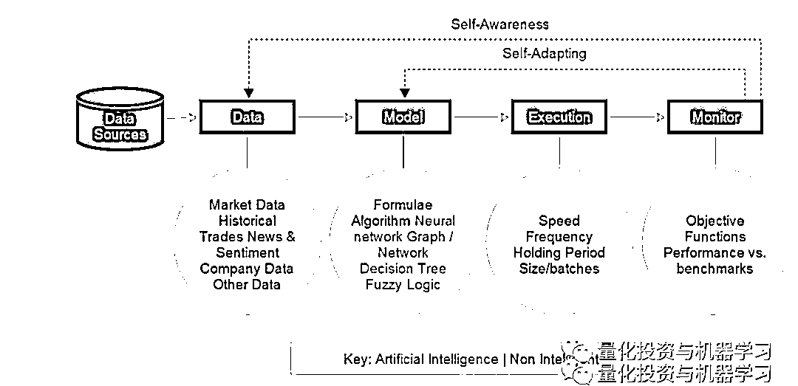
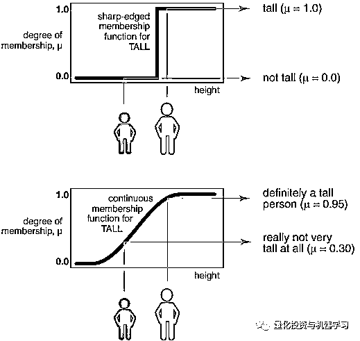
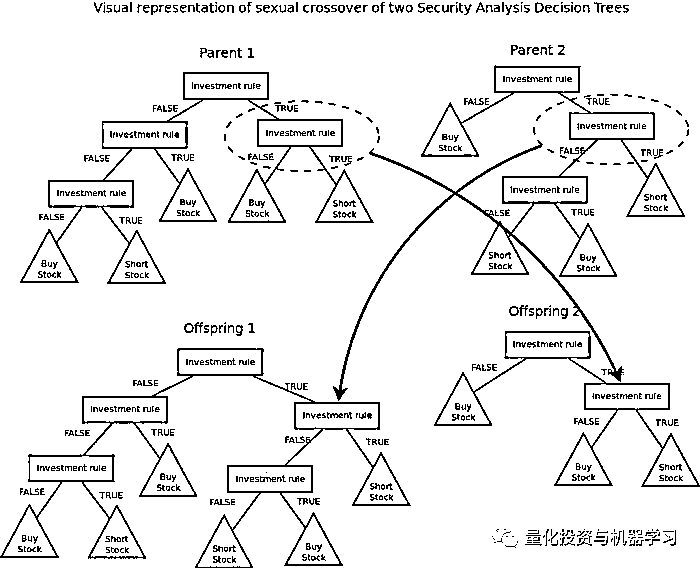
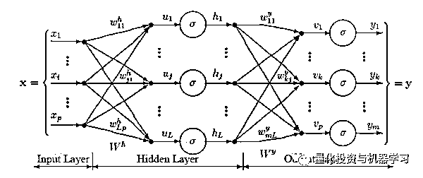
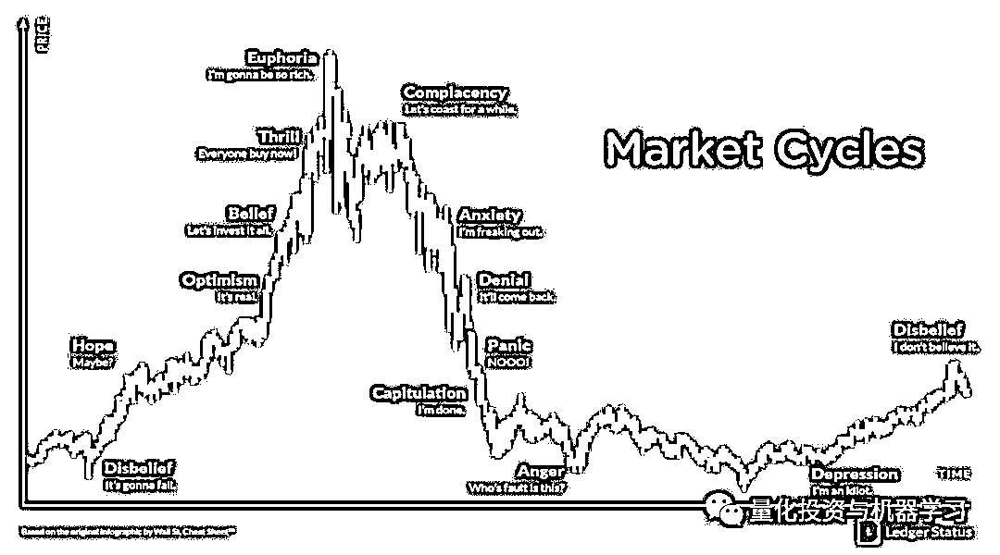
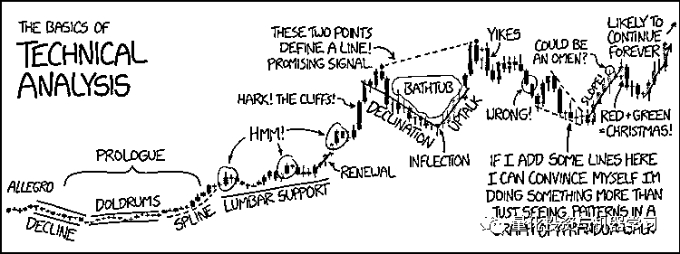

# 算法交易，此篇足矣！

> 原文：[`mp.weixin.qq.com/s?__biz=MzAxNTc0Mjg0Mg==&mid=2653293436&idx=1&sn=10a9de897ee9e6d0b6712ce31b8fffe5&chksm=802dc969b75a407f1877708aa4d743941f6b63b19c97b76a45f571d8287fc5fd848bfe9f0e50&scene=27#wechat_redirect`](http://mp.weixin.qq.com/s?__biz=MzAxNTc0Mjg0Mg==&mid=2653293436&idx=1&sn=10a9de897ee9e6d0b6712ce31b8fffe5&chksm=802dc969b75a407f1877708aa4d743941f6b63b19c97b76a45f571d8287fc5fd848bfe9f0e50&scene=27#wechat_redirect)

**标星★公众号     **爱你们♥

来自：Sangeet Moy 

编译：张晶晶 | 公众号翻译部

**近期原创文章：**

## ♥ [5 种机器学习算法在预测股价的应用（代码+数据）](https://mp.weixin.qq.com/s?__biz=MzAxNTc0Mjg0Mg==&mid=2653290588&idx=1&sn=1d0409ad212ea8627e5d5cedf61953ac&chksm=802dc249b75a4b5fa245433320a4cc9da1a2cceb22df6fb1a28e5b94ff038319ae4e7ec6941f&token=1298662931&lang=zh_CN&scene=21#wechat_redirect)

## ♥ [Two Sigma 用新闻来预测股价走势，带你吊打 Kaggle](https://mp.weixin.qq.com/s?__biz=MzAxNTc0Mjg0Mg==&mid=2653290456&idx=1&sn=b8d2d8febc599742e43ea48e3c249323&chksm=802e3dcdb759b4db9279c689202101b6b154fb118a1c1be12b52e522e1a1d7944858dbd6637e&token=1330520237&lang=zh_CN&scene=21#wechat_redirect)

## ♥ 2 万字干货：[利用深度学习最新前沿预测股价走势](https://mp.weixin.qq.com/s?__biz=MzAxNTc0Mjg0Mg==&mid=2653290080&idx=1&sn=06c50cefe78a7b24c64c4fdb9739c7f3&chksm=802e3c75b759b563c01495d16a638a56ac7305fc324ee4917fd76c648f670b7f7276826bdaa8&token=770078636&lang=zh_CN&scene=21#wechat_redirect)

## ♥ [机器学习在量化金融领域的误用！](http://mp.weixin.qq.com/s?__biz=MzAxNTc0Mjg0Mg==&mid=2653292984&idx=1&sn=3e7efe9fe9452c4a5492d2175b4159ef&chksm=802dcbadb75a42bbdce895c49070c3f552dc8c983afce5eeac5d7c25974b7753e670a0162c89&scene=21#wechat_redirect)

## ♥ [基于 RNN 和 LSTM 的股市预测方法](https://mp.weixin.qq.com/s?__biz=MzAxNTc0Mjg0Mg==&mid=2653290481&idx=1&sn=f7360ea8554cc4f86fcc71315176b093&chksm=802e3de4b759b4f2235a0aeabb6e76b3e101ff09b9a2aa6fa67e6e824fc4274f68f4ae51af95&token=1865137106&lang=zh_CN&scene=21#wechat_redirect)

## ♥ [如何鉴别那些用深度学习预测股价的花哨模型？](https://mp.weixin.qq.com/s?__biz=MzAxNTc0Mjg0Mg==&mid=2653290132&idx=1&sn=cbf1e2a4526e6e9305a6110c17063f46&chksm=802e3c81b759b597d3dd94b8008e150c90087567904a29c0c4b58d7be220a9ece2008956d5db&token=1266110554&lang=zh_CN&scene=21#wechat_redirect)

## ♥ [优化强化学习 Q-learning 算法进行股市](https://mp.weixin.qq.com/s?__biz=MzAxNTc0Mjg0Mg==&mid=2653290286&idx=1&sn=882d39a18018733b93c8c8eac385b515&chksm=802e3d3bb759b42d1fc849f96bf02ae87edf2eab01b0beecd9340112c7fb06b95cb2246d2429&token=1330520237&lang=zh_CN&scene=21#wechat_redirect)

## ♥ [WorldQuant 101 Alpha、国泰君安 191 Alpha](https://mp.weixin.qq.com/s?__biz=MzAxNTc0Mjg0Mg==&mid=2653290927&idx=1&sn=ecca60811da74967f33a00329a1fe66a&chksm=802dc3bab75a4aac2bb4ccff7010063cc08ef51d0bf3d2f71621cdd6adece11f28133a242a15&token=48775331&lang=zh_CN&scene=21#wechat_redirect)

## ♥ [基于回声状态网络预测股票价格（附代码）](https://mp.weixin.qq.com/s?__biz=MzAxNTc0Mjg0Mg==&mid=2653291171&idx=1&sn=485a35e564b45046ff5a07c42bba1743&chksm=802dc0b6b75a49a07e5b91c512c8575104f777b39d0e1d71cf11881502209dc399fd6f641fb1&token=48775331&lang=zh_CN&scene=21#wechat_redirect)

## ♥ [计量经济学应用投资失败的 7 个原因](https://mp.weixin.qq.com/s?__biz=MzAxNTc0Mjg0Mg==&mid=2653292186&idx=1&sn=87501434ae16f29afffec19a6884ee8d&chksm=802dc48fb75a4d99e0172bf484cdbf6aee86e36a95037847fd9f070cbe7144b4617c2d1b0644&token=48775331&lang=zh_CN&scene=21#wechat_redirect)

## ♥ [配对交易千千万，强化学习最 NB！（文档+代码）](http://mp.weixin.qq.com/s?__biz=MzAxNTc0Mjg0Mg==&mid=2653292915&idx=1&sn=13f4ddebcd209b082697a75544852608&chksm=802dcb66b75a4270ceb19fac90eb2a70dc05f5b6daa295a7d31401aaa8697bbb53f5ff7c05af&scene=21#wechat_redirect)

## ♥ [关于高盛在 Github 开源背后的真相！](https://mp.weixin.qq.com/s?__biz=MzAxNTc0Mjg0Mg==&mid=2653291594&idx=1&sn=7703403c5c537061994396e7e49e7ce5&chksm=802dc65fb75a4f49019cec951ac25d30ec7783738e9640ec108be95335597361c427258f5d5f&token=48775331&lang=zh_CN&scene=21#wechat_redirect)

## ♥ [新一代量化带货王诞生！Oh My God！](https://mp.weixin.qq.com/s?__biz=MzAxNTc0Mjg0Mg==&mid=2653291789&idx=1&sn=e31778d1b9372bc7aa6e57b82a69ec6e&chksm=802dc718b75a4e0ea4c022e70ea53f51c48d102ebf7e54993261619c36f24f3f9a5b63437e9e&token=48775331&lang=zh_CN&scene=21#wechat_redirect)

## ♥ [独家！关于定量/交易求职分享（附真实试题）](https://mp.weixin.qq.com/s?__biz=MzAxNTc0Mjg0Mg==&mid=2653291844&idx=1&sn=3fd8b57d32a0ebd43b17fa68ae954471&chksm=802dc751b75a4e4755fcbb0aa228355cebbbb6d34b292aa25b4f3fbd51013fcf7b17b91ddb71&token=48775331&lang=zh_CN&scene=21#wechat_redirect)

## ♥ [Quant 们的身份危机！](https://mp.weixin.qq.com/s?__biz=MzAxNTc0Mjg0Mg==&mid=2653291856&idx=1&sn=729b657ede2cb50c96e92193ab16102d&chksm=802dc745b75a4e53c5018cc1385214233ec4657a3479cd7193c95aaf65642f5f45fa0e465694&token=48775331&lang=zh_CN&scene=21#wechat_redirect)

## ♥ [拿起 Python，防御特朗普的 Twitter](https://mp.weixin.qq.com/s?__biz=MzAxNTc0Mjg0Mg==&mid=2653291977&idx=1&sn=01f146e9a88bf130ca1b479573e6d158&chksm=802dc7dcb75a4ecadfdbdace877ed948f56b72bc160952fd1e4bcde27260f823c999a65a0d6d&token=48775331&lang=zh_CN&scene=21#wechat_redirect)

## ♥ [AQR 最新研究 | 机器能“学习”金融吗？](http://mp.weixin.qq.com/s?__biz=MzAxNTc0Mjg0Mg==&mid=2653292710&idx=1&sn=e5e852de00159a96d5dcc92f349f5b58&chksm=802dcab3b75a43a5492bc98874684081eb5c5666aff32a36a0cdc144d74de0200cc0d997894f&scene=21#wechat_redirect)

本期，公众号将对算法交易做一介绍，在后面的几期推文中，我们将展开对算法交易的技术应用、算法结构等进行讲解！ 

**前言**

本文尝试以第三人称的视角解读算法交易。把算法这个词拆开——**“算法”和“交易”**，这里的交易是指在资本市场上的买卖行为，而算法是个专业术语。如果你已经知道算法的含义，那下面一段可以跳过。

算法是明确定义的需要逐步执行的操作集，假设你接受一个从瓶中喝水的任务，算法就是这一系列操作——拿到水瓶，打开盖子，喝水，盖上然后把瓶子归位。在计算机系统中同样简单：需要机器做什么，你只需通过设置好执行命令来解释清楚任务即可，这个过程也叫计算机编程。

现在或许大家都知道在电子交易产生之前，股票交易主要是纸质合约，合约需要实名制获得股票交易许可并且必须进行现场买卖，也可以执行取消交易。实名制许可交易正逐渐被电子形式所取代，因为后者支持电子注册和电子转账。随着交易过程更加快捷，股价波动性也有所提高。然而，一项更伟大的技术变革——算法交易悄然而至。如今，你可以编写算法并指示计算机在定义条件满足时买入或卖出。这些程序能在瞬息之间、高频次地完成交易，这个速度是人工交易员远不能及的。上述过程可以半自动或全自动执行，因此“自动化交易”和“算法交易”有时通用，但并不完全一致。接下来我们会探讨两者的区别之处

** “所有模型都错是错的，但有些是有用的。****”**

*George Box*

**算法交易和自动化交易的差异**

## 自动化交易往往和算法交易混淆，前者是完全自动化的交易过程，买入卖出完全由计算机编程决定，即整个指令是自动创建、提交（给市场）并被执行。自动交易设施通常由采用专有执行算法的对冲基金使用并通过专属线路下单进行交易。

**高频交易（HFT）是自动化交易的一个子集**，技术发展让海量交易在分秒之间完成成为可能，这种交易最多也就几毫秒甚至更短。高频交易公司通过完成海量交易赚钱，在这里，**快捷的执行速度是第一要义**，通过电子式专属线路下单可以有缩短交易时间。你也可以**学习下面这篇文章**，教你如何组装入门级高频交易系统。

[**搭建入门级高频交易系统（架构细节分享）**](http://mp.weixin.qq.com/s?__biz=MzAxNTc0Mjg0Mg==&mid=2653290615&idx=1&sn=ba1f774031b6dae519f614e7f5cf3141&chksm=802dc262b75a4b74dc3198cc507dbe1e97afc262f4ca4f9e9e122391fb9ebc916b14137c03d1&scene=21#wechat_redirect)

简而言之，算法交易以编写好的算法为基础来执行，而高频交易主要指特定类型的超快速自动化交易。

**智能算法交易系统**

## 算法交易系统可以用一个简单的框架图来理解，如上图所示，算法交易由四部分组成，包括数据程序、策略程序、交易执行程序和监督程序，分别和上述定义一一对应。接下来将详细讨论每个部分：

**数据部分**

### 算法交易系统可兼容结构化数据、非结构化数据或者混合数据。按照定义好的结构组织数据就是结构数据，例如电子表格、CSV 文件、JSON 文件、XML、数据库和数据结构。市场类数据例如收盘价、交易量等基本都是结构数据，经济类数据和公司财务数据也是结构数据。**国外的 Quandl 国内的 Wind 是两个知名的财经数****据来源。**

如果没有按照经过任何结构定义的数据便是非结构数据（也称另类数据），例如新闻、社交媒体、视频和音频。这种数据的处理较为复杂，通常需要数据分析和数据挖掘技术来分析。新闻资讯来自 Twitter、Facebook、微博等社交网络，该数据在交易中的主流用法是提供更强大的工具来解释非结构化数据，其中很多工具都在人工智能领域中有应用，特别是神经网络。

**模型部分**

正如在算法交易中所见，模型是外部世界的代表。金融模型通常代表算法交易系统相信市场有效。任何模型的终极目的都是推断外界或在特定情况下推断市场。大家可以可以看看这篇文章：

[**所有模型都是错的，但其中有些是有用的！**](http://mp.weixin.qq.com/s?__biz=MzAxNTc0Mjg0Mg==&mid=2653293065&idx=1&sn=45b6a1db897b5c5c928a2bd87076c5dc&chksm=802dc81cb75a410a049cb6c5f7d1412ecb4ecfbaf46d390e41c5bf5d81add3d21839e2095c36&scene=21#wechat_redirect)  

模型构建的数学理论和技术千差万别，但万变不离其宗，其本质上都在做一件事：将复杂系统简化为易处理和可量化的规则集，用来描述不同情境下的系统行为。一些方法包括但不限于数学模型，符号和模糊逻辑系统，决策树，规则归纳法和神经网络。

**1、数学模型**

使用数学模型来描述市场行为称为量化金融。许多量化金融模型都依赖于市场价格（和收益）根据随机过程演变的固定假设，换言之，市场是随机的。这是个非常实用的假设，几乎是所有衍生品定价模型和一些证券估值模型的核心。

**基本上大多数量化模型认为任何给定证券的收益可由一个或多个随机市场风险因子所解释，这些风险因子对收益的影响程度称为敏感度**。例如，一个充分分散的投资组合的收益率或许与短期利率价格、各种外汇汇率和股票市场的整体回报相关。这些因子可通过历史数据测量，用作校准模拟检验这些风险因子有效性的模型，甚至是模拟组合收益率的模型。

**2、符号逻辑模型和模糊逻辑模型**

**符号逻辑是一种推理形式**，主要涉及到谓词的评估（诸如“AND”、“OR”和“XOR”之类的逻辑运算符构成的逻辑语句），也可以是“True”或“False”。模糊逻辑放宽了二元判断——真假约束条件，并允许任何给定谓词归属于不同程度的真假判断集，这是根据集合成员函数定义的。

在金融市场的大背景下，这些模型的输入变量可能包括与证券收益率相关的任何指标，有量化指标、技术指标、基本面指标或者其他性质的指标。例如，模糊逻辑系统会从五日指数加权移动平均线大于等于十日指数加权移动平均线得出结论：有 65%的概率股价会在未来五日走高。

从给定数据源中进行数据挖掘来识别规则的方法被称为规则归纳法，这与决策树的归纳极其相似，但后者的结果通常更易阅读。

**3、决策树模型**

决策树与规则归纳法类似，只不过规则以树形图的形式存在（通常为二叉树）。在计算机科学中，二叉树是一种树形数据结构，每个节点有两个子节点，也叫左子节点和右子节点。下图中，每个节点代表一个决策规则（或者叫决策边界），每个子节点又是另一个决策边界，而最后的节点指代输出。

**决策树主要分两种：分类决策树和回归决策树。**分类决策树特点是输出变量会分类（例如买进、持有或卖出），而回归决策树特点是特点变量的输出是数值（例如-2.5%、0%、+2.5%等等）。决策树训练集的数据性质决定了决策树的生成类型。生成决策树的算法包括 C4.5 和遗传算法。

与规则归纳法一样，决策树模型的输入变量包括给定的一系列基本面数据、技术指标数据或与证券收益率相关的统计因子数据。

**4、神经网络模型**

神经网络几乎是最受算法加以者青睐的机器学习模型。神经网络由输入变量和输出变量之间互相连接的节点层组成。单个节点称为感知器，除了感知器需满足线性或非线性的激活函数外，其他方面类似多元线性回归。在特殊的神经网络中，感知器被用作连接两个节点层，即输入节点层、隐含节点层和输出节点层。输入节点层接收与证券收益率相关的标准化变量，输出节点层生成买卖持有类数据或类似分档收益的真实结果值，隐含节点层主要调整输入变量的权重，直至神经网络（回测表现）的错误达到最低。对此，一种解释是隐含节点层提取数据中与输出变量预测能力有关的显著特征。

除此之外，算法交易中还有很多用作预测股价方向，或为量化投资者预测股价变动的概率的决策模型。**模型的选择直接关系到算法交易系统的表现****。使用复合模型（集成）会改善预测准确度，但会增加遗传算法编程操作的复杂性。模型是算法交易系统的核心，为使算法交易系统更加智能化，系统应该保存出错的所有历史数据，并根据这一变化选择适合的内部模型。**

**从某种意义上说，这将持续一种（对错误）自省意识和自适应（连续模型校准），也就是说：**

**一切尚未终结！**

**执行部分**

### 执行部分负责完成该模型确定的交易。该部分需要满足算法交易系统的功能性和非功能性要求，例**如执行速度、交易频率、持仓期限、订单发送给交易所的线路是否充分**。算法交易系统的每个实现环节都必须满足这些要求。

**监督部分**

### 人工智能学习使用目标函数。为量化算法交易系统的表现，目标函数往往需要数理函数来刻画。在金融领域，常用的风险测度指标包括特雷诺比率、夏普比率和索提诺比率，算法交易的模型部分正是用来最大化这些指标，而难点在于市场是动态的。换言之，**以****前有效的模型、逻辑、神经网络或许在以后会失效。****鉴于此，算法交易系统必须使用模型的内生数据作为训练集，这种自我更新意识允许模型随环境作出调整**。我们认为这种自适应意识可以作为应对不断变化的市场一种有效持续的模型校准方式。

**自动化交易策略**

**▍市场分析**  

基本技术手段包括分析特定证券每日交易概况的量价信息。这需要交易者会识别前期波动、第一波、第二波和余波，会识别市场变动背后的本质，了解市场参与者对您手中持有股票的价格作何评价，他们又是如何宣传股价的，明白在股价的什么位置和什么时候入场。搜集、整理和获得合理的数据十分关键，更重要的是，受个人的专业背景所限，你更需要一个功能齐全、可以灵活应用的平台，将当日成交量与前一日的作比对，可以初步判断市场是否发生一些异动。同样，观察交易通道例如最优买价和最优卖价之间的差异及其变动也能为交易策略提供一个有效的视角。

这些技术让交易员对市场行为有更深的理解，与以往尝试将交易终端、回购利率、客户和公司等不同来源的数据拼凑分析完全不同。**就像扑克，及时认清新事物的本质是制胜的关键。**

### **▍管理多元市场**

简单执行管理是应对多元市场冲击的复合管理方式的基础，甚至可以称得上是管理整个市场报价、再平衡尚未使用的预期流动性余额的基础。

### **▍被动应对**

另一种应对多元市场的方式是被动攻击。假设您想购买 1 亿英镑并将报价提供给市场，但市场缺乏流动性。若市场只允许以“接近”标的报价的价格买卖，你会执行那个“接近价格”。操作系统随后在无人为干预的情况下会自动降低市场报价。这使得你可以根据你的总体目标而不是一个报价一个报价地进行交易，并跨市场管理这个目标。

### **▍****黄金期货的价格偏离**

及时获悉黄金期货的交易情况，实时观察篮子内成分标的与篮子价格的偏离，深刻认识到市场提供的千变万化的机会只由您的交易目标而定。

### **▍交易清单**

交易系统和全球资产经理人的结合可以更好地定义相关头寸的交易目标，该头寸会随交易主体的变化而变化，例如基金经理人等。

举个例子：现需做多 1 亿英镑，目标是筹措那笔资金。随着时间推进，目标头寸降到 8000 万英镑，交易目标也要随之变动。这个传达到交易清单的环节也可以通过系统外（人为举动）来进一步得到验证，例如看到客户要进行头寸展期交割，但规定的展期交割时期是在将来。

### **▍交易算法模式识别与随机数**

对手方包括自动化交易在内的交易活动有时可以创建一个识别交易策略的有效路径。解决方法是模型识别（机器学习尤为擅长），通过掌握对手方策略来为交易者提供价值。相反，内置与交易算法中的随机数可以掩盖一个人的交易策略，也就是说对手方无法从公司的交易举动中看出明显的逻辑，因此也就不能和你交易。

### **▍****sniping ****工具**

任何在 eBay 上竞标的人都会理解那种眼看着竞标标的即将关闭的沮丧感。你的报价即将获胜！但在最后一秒，另一个报价突然超过你的报价。难以置信，你被裁出场外！互联网上广泛使用的自动“sniping”工具可以在规定的限制内自动超出最高出价，让用户避免在他们的 PC 端等待出价关闭。这些工具如今进入回购市场，意味着正确的择时策略变得更加关键。不使用这些工具不仅会丢失交易订单，也会让公司在市场压力和年终流动性危机之时陷入流动性被动管理的局面。因为公司年底之前就往往吸收了很多流动性。

### **▍****最佳执行和订单分解**

最佳执行可以用不同的维度来定义，例如价格、流动性、成本、速度和执行可能性等。因此，自动化执行工具可以针对这些参数中最重要的参数或它们的某种组合进行优化。同样地将订单分成更小的模块可以避免对市场造成冲击，保证优化后的执行仍能及时的提供价值。

市场影响模型越来越多地采用人工智能来评估以往交易对当下交易的影响，以及每笔交易的影响随时间推移如何减弱。这就避免了交易者太过密集的进行交易，从而使市场波动对损益的影响降至最低。

**什么是技术分析？**

## 技术分析是在过去交易价格波动的基础上对未来金融价格波动的预测。就像天气预报一样，技术分析同样不会得出绝对的预测结论，但技术分析可以提供给投资者某事件将来可能会发生。技术分析通过各种图表来显示价格时间序列。  

技术分析适用于价格受供需影响的股票、指数、大宗商品、期货或其他可交易工具。价格数据是指特定时间范围内给定证券的开盘价、最高价、最低价、收盘价、成交量或持仓量的任意组合。时间范围可以基于日内（1 分钟、5 分钟、10 分钟、15 分钟、30 分钟或每小时）、每天、每周、每月价格数据，可以持续数小时或多年。

**技术分析的关键假设**

## 技术分析适用于价格仅受供求关系影响的证券，在证券价格也受其他因素影响时，技术分析会失效。为使方法有效，技术分析对标的证券做出了三个假定：

**高流动性**

**流动性就是交易量**，交易量大的股票允许投资者在不会对股价造成巨大变动的情况下快捷简便地交易，而交易量小的股票交易过程就艰难一些，这是因为在特定的时间市场上的多头和空头并不多，所以多空双方不得不为达成交易在价格上做些让步。除此之外，流动性较差的股票往往比较便宜（有时每股不到一分钱），这意味着它们的价格可能更容易被个人投资者操纵，这些影响交易量稀少的股票的外在因素使其不适合技术分析。

**无人为价格变动**

股票分拆、分红和配股是造成人为价格变动的三大“罪魁祸首”。即使投资标的价格没有变化，人为价格变动也可能影响价格走势图，从而使技术分析不再生效。这种来自外部渠道的价格影响可以通过在价格变动之前调整历史数据的方法轻易解决。

**没有极端新闻**

技术分析不能预测极端事件，包括像公司 CEO 突然罹难之类的商业事件，或像恐怖分子袭击的政治事件。当“极端新闻”影响到股票价格时，技术分析家不得不耐心等待直到股价走势图稳定下来开始反应正常新闻的时候。

引入技术分析之前确定证券是否符合这三个要求非常重要。然而这并不是说分析股票价格的外在因素对股价的影响一无是处，但这的确会影响分析的准确性。

**技术分析的基础**

## 道氏理论是现代技术分析的鼻祖，它并不是一个完整的结论，而是通过查尔斯·道格拉斯数年的记录拼凑而成。在道格拉斯提出的诸多理论中，以下三个理论极为突出：

**价格包含一切**

这个理论与强有效市场和半强有效市场，技术分析认为当前股票价格反映了所有的市场信息。因为所有信息已在价格中反应，股价代表公允价格，应构成分析的基础。毕竟，市场价格反映了所有市场参与者知识的总和，包括交易员、投资者、投资组合经理、买方分析师、卖方分析师、市场策略师、技术分析师、基本面分析师和许多其他相关人员。若对上述这群凭借其无可挑剔的资历并给人留下深刻印象的人设置的定价抱有疑义，会是很愚蠢的一件事。技术分析根据价格捕获的信息来解释市场背后的实质，以形成对未来的看法。

**价格走势并非完全随机**

许多技术分析人员认为价格有趋势，然而他们也知道有时候趋势效应不存在。因为价格走势完全随机时，技术分析很难赚钱。在《Schwager on Futures: Technical Analysis》中，Jack Schwager 如是说道：

***“观察这种情况的一种方法是，市场可能会出现随机波动时滞，其间穿插着较短的非随机行为……走势分析师的目标就是识别这些时段（即主要趋势）。”***

**技术分析人员相信趋势可被识别，在其基础上进行投资和交易，并随着趋势的展开获取收益。**因为技术分析是用于不同的时间范围，可以识别短期或长期趋势。IBM 图表说明了 Schwager 对趋势性质的看法。大趋势是上涨，但其中也穿插着交易区间。在交易行为之间，在上涨的大趋势下有更小的上涨趋势，在股价突破之前的交易区间股价上限时上涨趋势再度出现，当股价突破之前交易区间的下限时，股价进入下行通道。

‘“什么”比“为什么”更重要’：在《The Psychology of Technical Analysis》书中，Tony Plummer 通过引用 Oscar Wilde 的话来解释：“技术分析师知道任何标的的价格，但不了解其价值”。作为技术分析师，技术人员只关注两件事：

**1、目前价格是多少？**

**2、历史价格变动剧烈否？**

价格是公司股票供需双方博弈的最终结果。分析的目的是预测未来价格的方向。通过唯一对价格的关注，技术分析代表了直观的方法。基本面分析者更关心价格为何如此。对于技术人员来说，“为何”部分太过笼统，更多时候基本面分析的原因令人高度存疑，技术派更相信聚焦结果而非成因。股价为何上涨？那仅仅是因为买方（需求方）多与卖方（供给方）。毕竟，任何资产的价值就是人们的意愿支付价格，谁还需要知道那是什么原因？

**结论**

## 算法交易在过去十年中变得很受大众青睐，目前全球交易所的大部分交易都是算法交易，这要归功于一些全球表现最佳的对冲基金的成功，最著名的便是文艺复兴技术分析公司。话虽如此，仍然有很多关于算法交易内涵以及它如何影响人们的现实生活的混淆和误解。某种程度上说，人工智能也处于相同的境地。**对这些主题的研究往往只关注绩效，其实研究人员和从业人员建立的更严谨的概念和理论模型同样重要，并需要在几年内持续推进这一领域的研究，这一点往往被我们抛诸脑后**。无论我们喜欢与否，算法塑造了我们的现代世界，我们对其的依赖使我们有道德义务不懈地理解并改进它。

 

*—End—*

量化投资与机器学习微信公众号，是业内垂直于**Quant**、**MFE**、**CST、AI**等专业的**主****流量化自媒体**。公众号拥有来自**公募、私募、券商、银行、海外**等众多圈内**10W+**关注者。每日发布行业前沿研究成果和最新量化资讯。

