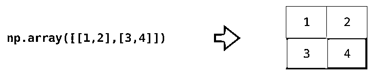
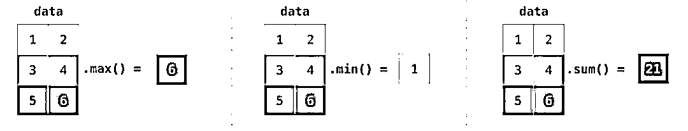

# 安利！这是我见过最好的 NumPy 图解教程

> 原文：[`mp.weixin.qq.com/s?__biz=MzAxNTc0Mjg0Mg==&mid=2653293420&idx=1&sn=5201a21714dc38487ca9324c528f91b4&chksm=802dc979b75a406fe59eb86ae9f7f9f926c5ee9160a068dcd46c820094e65b6b3ca4d29b98bc&scene=27#wechat_redirect`](http://mp.weixin.qq.com/s?__biz=MzAxNTc0Mjg0Mg==&mid=2653293420&idx=1&sn=5201a21714dc38487ca9324c528f91b4&chksm=802dc979b75a406fe59eb86ae9f7f9f926c5ee9160a068dcd46c820094e65b6b3ca4d29b98bc&scene=27#wechat_redirect)

**标星★公众号     **爱你们♥

来自：大数据文摘

编译：李雷、宁静

**近期原创文章：**

## ♥ [5 种机器学习算法在预测股价的应用（代码+数据）](https://mp.weixin.qq.com/s?__biz=MzAxNTc0Mjg0Mg==&mid=2653290588&idx=1&sn=1d0409ad212ea8627e5d5cedf61953ac&chksm=802dc249b75a4b5fa245433320a4cc9da1a2cceb22df6fb1a28e5b94ff038319ae4e7ec6941f&token=1298662931&lang=zh_CN&scene=21#wechat_redirect)

## ♥ [Two Sigma 用新闻来预测股价走势，带你吊打 Kaggle](https://mp.weixin.qq.com/s?__biz=MzAxNTc0Mjg0Mg==&mid=2653290456&idx=1&sn=b8d2d8febc599742e43ea48e3c249323&chksm=802e3dcdb759b4db9279c689202101b6b154fb118a1c1be12b52e522e1a1d7944858dbd6637e&token=1330520237&lang=zh_CN&scene=21#wechat_redirect)

## ♥ 2 万字干货：[利用深度学习最新前沿预测股价走势](https://mp.weixin.qq.com/s?__biz=MzAxNTc0Mjg0Mg==&mid=2653290080&idx=1&sn=06c50cefe78a7b24c64c4fdb9739c7f3&chksm=802e3c75b759b563c01495d16a638a56ac7305fc324ee4917fd76c648f670b7f7276826bdaa8&token=770078636&lang=zh_CN&scene=21#wechat_redirect)

## ♥ [机器学习在量化金融领域的误用！](http://mp.weixin.qq.com/s?__biz=MzAxNTc0Mjg0Mg==&mid=2653292984&idx=1&sn=3e7efe9fe9452c4a5492d2175b4159ef&chksm=802dcbadb75a42bbdce895c49070c3f552dc8c983afce5eeac5d7c25974b7753e670a0162c89&scene=21#wechat_redirect)

## ♥ [基于 RNN 和 LSTM 的股市预测方法](https://mp.weixin.qq.com/s?__biz=MzAxNTc0Mjg0Mg==&mid=2653290481&idx=1&sn=f7360ea8554cc4f86fcc71315176b093&chksm=802e3de4b759b4f2235a0aeabb6e76b3e101ff09b9a2aa6fa67e6e824fc4274f68f4ae51af95&token=1865137106&lang=zh_CN&scene=21#wechat_redirect)

## ♥ [如何鉴别那些用深度学习预测股价的花哨模型？](https://mp.weixin.qq.com/s?__biz=MzAxNTc0Mjg0Mg==&mid=2653290132&idx=1&sn=cbf1e2a4526e6e9305a6110c17063f46&chksm=802e3c81b759b597d3dd94b8008e150c90087567904a29c0c4b58d7be220a9ece2008956d5db&token=1266110554&lang=zh_CN&scene=21#wechat_redirect)

## ♥ [优化强化学习 Q-learning 算法进行股市](https://mp.weixin.qq.com/s?__biz=MzAxNTc0Mjg0Mg==&mid=2653290286&idx=1&sn=882d39a18018733b93c8c8eac385b515&chksm=802e3d3bb759b42d1fc849f96bf02ae87edf2eab01b0beecd9340112c7fb06b95cb2246d2429&token=1330520237&lang=zh_CN&scene=21#wechat_redirect)

## ♥ [WorldQuant 101 Alpha、国泰君安 191 Alpha](https://mp.weixin.qq.com/s?__biz=MzAxNTc0Mjg0Mg==&mid=2653290927&idx=1&sn=ecca60811da74967f33a00329a1fe66a&chksm=802dc3bab75a4aac2bb4ccff7010063cc08ef51d0bf3d2f71621cdd6adece11f28133a242a15&token=48775331&lang=zh_CN&scene=21#wechat_redirect)

## ♥ [基于回声状态网络预测股票价格（附代码）](https://mp.weixin.qq.com/s?__biz=MzAxNTc0Mjg0Mg==&mid=2653291171&idx=1&sn=485a35e564b45046ff5a07c42bba1743&chksm=802dc0b6b75a49a07e5b91c512c8575104f777b39d0e1d71cf11881502209dc399fd6f641fb1&token=48775331&lang=zh_CN&scene=21#wechat_redirect)

## ♥ [计量经济学应用投资失败的 7 个原因](https://mp.weixin.qq.com/s?__biz=MzAxNTc0Mjg0Mg==&mid=2653292186&idx=1&sn=87501434ae16f29afffec19a6884ee8d&chksm=802dc48fb75a4d99e0172bf484cdbf6aee86e36a95037847fd9f070cbe7144b4617c2d1b0644&token=48775331&lang=zh_CN&scene=21#wechat_redirect)

## ♥ [配对交易千千万，强化学习最 NB！（文档+代码）](http://mp.weixin.qq.com/s?__biz=MzAxNTc0Mjg0Mg==&mid=2653292915&idx=1&sn=13f4ddebcd209b082697a75544852608&chksm=802dcb66b75a4270ceb19fac90eb2a70dc05f5b6daa295a7d31401aaa8697bbb53f5ff7c05af&scene=21#wechat_redirect)

## ♥ [关于高盛在 Github 开源背后的真相！](https://mp.weixin.qq.com/s?__biz=MzAxNTc0Mjg0Mg==&mid=2653291594&idx=1&sn=7703403c5c537061994396e7e49e7ce5&chksm=802dc65fb75a4f49019cec951ac25d30ec7783738e9640ec108be95335597361c427258f5d5f&token=48775331&lang=zh_CN&scene=21#wechat_redirect)

## ♥ [新一代量化带货王诞生！Oh My God！](https://mp.weixin.qq.com/s?__biz=MzAxNTc0Mjg0Mg==&mid=2653291789&idx=1&sn=e31778d1b9372bc7aa6e57b82a69ec6e&chksm=802dc718b75a4e0ea4c022e70ea53f51c48d102ebf7e54993261619c36f24f3f9a5b63437e9e&token=48775331&lang=zh_CN&scene=21#wechat_redirect)

## ♥ [独家！关于定量/交易求职分享（附真实试题）](https://mp.weixin.qq.com/s?__biz=MzAxNTc0Mjg0Mg==&mid=2653291844&idx=1&sn=3fd8b57d32a0ebd43b17fa68ae954471&chksm=802dc751b75a4e4755fcbb0aa228355cebbbb6d34b292aa25b4f3fbd51013fcf7b17b91ddb71&token=48775331&lang=zh_CN&scene=21#wechat_redirect)

## ♥ [Quant 们的身份危机！](https://mp.weixin.qq.com/s?__biz=MzAxNTc0Mjg0Mg==&mid=2653291856&idx=1&sn=729b657ede2cb50c96e92193ab16102d&chksm=802dc745b75a4e53c5018cc1385214233ec4657a3479cd7193c95aaf65642f5f45fa0e465694&token=48775331&lang=zh_CN&scene=21#wechat_redirect)

## ♥ [拿起 Python，防御特朗普的 Twitter](https://mp.weixin.qq.com/s?__biz=MzAxNTc0Mjg0Mg==&mid=2653291977&idx=1&sn=01f146e9a88bf130ca1b479573e6d158&chksm=802dc7dcb75a4ecadfdbdace877ed948f56b72bc160952fd1e4bcde27260f823c999a65a0d6d&token=48775331&lang=zh_CN&scene=21#wechat_redirect)

## ♥ [AQR 最新研究 | 机器能“学习”金融吗？](http://mp.weixin.qq.com/s?__biz=MzAxNTc0Mjg0Mg==&mid=2653292710&idx=1&sn=e5e852de00159a96d5dcc92f349f5b58&chksm=802dcab3b75a43a5492bc98874684081eb5c5666aff32a36a0cdc144d74de0200cc0d997894f&scene=21#wechat_redirect)

**正文**

NumPy 是 Python 中用于数据分析、机器学习、科学计算的重要软件包。它极大地简化了向量和矩阵的操作及处理。python 的不少数据处理软件包依赖于 NumPy 作为其基础架构的核心部分（例如 scikit-learn、SciPy、pandas 和 tensorflow）。除了数据切片和数据切块的功能之外，掌握 numpy 也使得开发者在使用各数据处理库调试和处理复杂用例时更具优势。  

在本文中，将介绍 NumPy 的主要用法，以及它如何呈现不同类型的数据（表格，图像，文本等），这些经 Numpy 处理后的数据将成为机器学习模型的输入。

**NumPy 中的数组操作**

**创建数组**

我们可以通过将 python 列表传入 np.array()来创建一个 NumPy 数组（也就是强大的 ndarray）。在下面的例子里，创建出的数组如右边所示，通常情况下，我们希望 NumPy 为我们初始化数组的值，为此 NumPy 提供了诸如 ones()，zeros()和 random.random()之类的方法。我们只需传入元素个数即可：

 

一旦我们创建了数组，我们就可以用其做点有趣的应用了，文摘菌将在下文展开说明。

**数组的算术运算**

让我们创建两个 NumPy 数组，分别称作 data 和 ones：

若要计算两个数组的加法，只需简单地敲入 data + ones，就可以实现对应位置上的数据相加的操作（即每行数据进行相加），这种操作比循环读取数组的方法代码实现更加简洁。

当然，在此基础上举一反三，也可以实现减法、乘法和除法等操作：

许多情况下，我们希望进行数组和单个数值的操作（也称作向量和标量之间的操作）。比如：如果数组表示的是以英里为单位的距离，我们的目标是将其转换为公里数。可以简单的写作 data * 1.6：

NumPy 通过数组广播（broadcasting）知道这种操作需要和数组的每个元素相乘。

**数组的切片操作**

我们可以像 python 列表操作那样对 NumPy 数组进行索引和切片，如下图所示：

**聚合函数**

NumPy 为我们带来的便利还有聚合函数，聚合函数可以将数据进行压缩，统计数组中的一些特征值：

除了 min，max 和 sum 等函数，还有 mean（均值），prod（数据乘法）计算所有元素的乘积，std（标准差），等等。上面的所有例子都在一个维度上处理向量。除此之外，NumPy 之美的一个关键之处是它能够将之前所看到的所有函数应用到任意维度上。

**NumPy 中的矩阵操作**

**创建矩阵**

我们可以通过将二维列表传给 Numpy 来创建矩阵。

np.array([[1,2],[3,4]])

除此外，也可以使用上文提到的 ones()、zeros()和 random.random()来创建矩阵，只需传入一个元组来描述矩阵的维度：

**矩阵的算术运算**

对于大小相同的两个矩阵，我们可以使用算术运算符（+-*/）将其相加或者相乘。NumPy 对这类运算采用对应位置（position-wise）操作处理：

对于不同大小的矩阵，只有两个矩阵的维度同为 1 时（例如矩阵只有一列或一行），我们才能进行这些算术运算，在这种情况下，NumPy 使用广播规则（broadcast）进行操作处理：

与算术运算有很大区别是使用点积的矩阵乘法。NumPy 提供了 dot()方法，可用于矩阵之间进行点积运算：

上图的底部添加了矩阵尺寸，以强调运算的两个矩阵在列和行必须相等。可以将此操作图解为如下所示：

**矩阵的切片和聚合**

索引和切片功能在操作矩阵时变得更加有用。可以在不同维度上使用索引操作来对数据进行切片。

我们可以像聚合向量一样聚合矩阵：

不仅可以聚合矩阵中的所有值，还可以使用 axis 参数指定行和列的聚合：

**矩阵的转置和重构**

处理矩阵时经常需要对矩阵进行转置操作，常见的情况如计算两个矩阵的点积。NumPy 数组的属性 T 可用于获取矩阵的转置。

在较为复杂的用例中，你可能会发现自己需要改变某个矩阵的维度。这在机器学习应用中很常见，例如模型的输入矩阵形状与数据集不同，可以使用 NumPy 的 reshape()方法。只需将矩阵所需的新维度传入即可。也可以传入-1，NumPy 可以根据你的矩阵推断出正确的维度：

上文中的所有功能都适用于多维数据，其中心数据结构称为 ndarray（N 维数组）。

很多时候，改变维度只需在 NumPy 函数的参数中添加一个逗号，如下图所示：

**NumPy 中的公式应用示例**

NumPy 的关键用例是实现适用于矩阵和向量的数学公式。这也 Python 中常用 NumPy 的原因。例如，均方误差是监督机器学习模型处理回归问题的核心：

在 NumPy 中可以很容易地实现均方误差：

这样做的好处是，numpy 无需考虑 predictions 与 labels 具体包含的值。文摘菌将通过一个示例来逐步执行上面代码行中的四个操作：

预测（predictions）和标签（labels）向量都包含三个值。这意味着 n 的值为 3。在我们执行减法后，我们最终得到如下值：

然后我们可以计算向量中各值的平方：

现在我们对这些值求和：

最终得到该预测的误差值和模型质量分数。

**用 NumPy 表示日常数据**

日常接触到的数据类型，如电子表格，图像，音频......等，如何表示呢？Numpy 可以解决这个问题。

**表和电子表格**

电子表格或数据表都是二维矩阵。电子表格中的每个工作表都可以是自己的变量。python 中类似的结构是 pandas 数据帧（dataframe），它实际上使用 NumPy 来构建的。

**音频和时间序列**

音频文件是一维样本数组。每个样本都是代表一小段音频信号的数字。CD 质量的音频每秒可能有 44,100 个采样样本，每个样本是一个-65535 到 65536 之间的整数。这意味着如果你有一个 10 秒的 CD 质量的 WAVE 文件，你可以将它加载到长度为 10 * 44,100 = 441,000 个样本的 NumPy 数组中。想要提取音频的第一秒？只需将文件加载到我们称之为 audio 的 NumPy 数组中，然后截取 audio[:44100]。

以下是一段音频文件：

时间序列数据也是如此（例如，股票价格随时间变化的序列）。

**图像**

图像是大小为（高度×宽度）的像素矩阵。如果图像是黑白图像（也称为灰度图像），则每个像素可以由单个数字表示（通常在 0（黑色）和 255（白色）之间）。如果对图像做处理，裁剪图像的左上角 10 x 10 大小的一块像素区域，用 NumPy 中的 image[:10,:10]就可以实现。

这是一个图像文件的片段：

如果图像是彩色的，则每个像素由三个数字表示 ：红色，绿色和蓝色。在这种情况下，我们需要第三维（因为每个单元格只能包含一个数字）。因此彩色图像由尺寸为(高 x 宽 x 3）的 ndarray 表示。

**语言**

如果我们处理文本，情况就会有所不同。用数字表示文本需要两个步骤，构建词汇表（模型知道的所有唯一单词的清单）和嵌入（embedding）。让我们看看用数字表示这个（翻译的）古语引用的步骤：“Have the bards who preceded me left any theme unsung?”

模型需要先训练大量文本才能用数字表示这位战场诗人的诗句。我们可以让模型处理一个小数据集，并使用这个数据集来构建一个词汇表（71,290 个单词）：

 

然后可以将句子划分成一系列“词”token（基于通用规则的单词或单词部分）：

然后我们用词汇表中的 id 替换每个单词：

这些 ID 仍然不能为模型提供有价值的信息。因此，在将一系列单词送入模型之前，需要使用嵌入（embedding）来替换 token/单词（在本例子中使用 50 维度的 word2vec 嵌入)：

你可以看到此 NumPy 数组的维度为[embedding_dimension x sequence_length]。

在实践中，这些数值不一定是这样的，但我以这种方式呈现它是为了视觉上的一致。出于性能原因，深度学习模型倾向于保留批数据大小的第一维（因为如果并行训练多个示例，则可以更快地训练模型）。很明显，这里非常适合使用 reshape()。例如，像 BERT 这样的模型会期望其输入矩阵的形状为：[batch_size，sequence_length，embedding_size]。

这是一个数字合集，模型可以处理并执行各种有用的操作。我留空了许多行，可以用其他示例填充以供模型训练（或预测）。

事实证明，在我们的例子中，那位诗人的话语比其他诗人的诗句更加名垂千古。尽管生而为奴，诗人安塔拉（Antarah）的英勇和语言能力使他获得了自由和神话般的地位，他的诗是伊斯兰教以前的阿拉伯半岛《悬诗》的七首诗之一。

相关报道：

*https://jalammar.github.io/visual-numpy/*

*—End—*

量化投资与机器学习微信公众号，是业内垂直于**Quant**、**MFE**、**CST、AI**等专业的**主****流量化自媒体**。公众号拥有来自**公募、私募、券商、银行、海外**等众多圈内**10W+**关注者。每日发布行业前沿研究成果和最新量化资讯。

