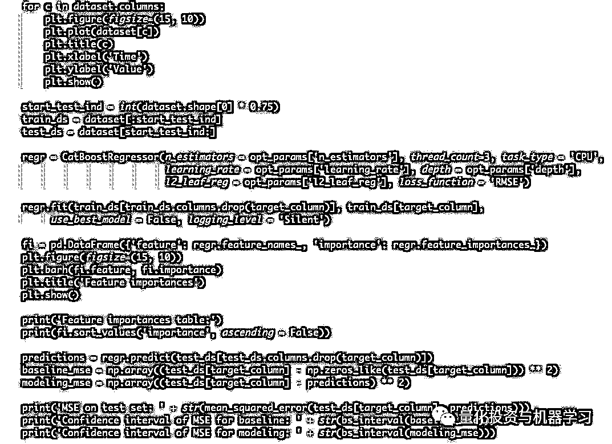

# 梯度提升（GBM）预测订单薄价格变动（代码+数据）

> 原文：[`mp.weixin.qq.com/s?__biz=MzAxNTc0Mjg0Mg==&mid=2653293409&idx=1&sn=9cdd3e9d3db5f2d6b1276aad32657b50&chksm=802dc974b75a4062d450560794cd51ee12a807beb60129197a61971c0d20eba5d749af86802a&scene=27#wechat_redirect`](http://mp.weixin.qq.com/s?__biz=MzAxNTc0Mjg0Mg==&mid=2653293409&idx=1&sn=9cdd3e9d3db5f2d6b1276aad32657b50&chksm=802dc974b75a4062d450560794cd51ee12a807beb60129197a61971c0d20eba5d749af86802a&scene=27#wechat_redirect)

**标星★公众号     **爱你们♥

作者：Sergey Malchevskiy   

编译：1+1=6 | 公众号翻译部

**近期原创文章：**

## ♥ [5 种机器学习算法在预测股价的应用（代码+数据）](https://mp.weixin.qq.com/s?__biz=MzAxNTc0Mjg0Mg==&mid=2653290588&idx=1&sn=1d0409ad212ea8627e5d5cedf61953ac&chksm=802dc249b75a4b5fa245433320a4cc9da1a2cceb22df6fb1a28e5b94ff038319ae4e7ec6941f&token=1298662931&lang=zh_CN&scene=21#wechat_redirect)

## ♥ [Two Sigma 用新闻来预测股价走势，带你吊打 Kaggle](https://mp.weixin.qq.com/s?__biz=MzAxNTc0Mjg0Mg==&mid=2653290456&idx=1&sn=b8d2d8febc599742e43ea48e3c249323&chksm=802e3dcdb759b4db9279c689202101b6b154fb118a1c1be12b52e522e1a1d7944858dbd6637e&token=1330520237&lang=zh_CN&scene=21#wechat_redirect)

## ♥ 2 万字干货：[利用深度学习最新前沿预测股价走势](https://mp.weixin.qq.com/s?__biz=MzAxNTc0Mjg0Mg==&mid=2653290080&idx=1&sn=06c50cefe78a7b24c64c4fdb9739c7f3&chksm=802e3c75b759b563c01495d16a638a56ac7305fc324ee4917fd76c648f670b7f7276826bdaa8&token=770078636&lang=zh_CN&scene=21#wechat_redirect)

## ♥ [机器学习在量化金融领域的误用！](http://mp.weixin.qq.com/s?__biz=MzAxNTc0Mjg0Mg==&mid=2653292984&idx=1&sn=3e7efe9fe9452c4a5492d2175b4159ef&chksm=802dcbadb75a42bbdce895c49070c3f552dc8c983afce5eeac5d7c25974b7753e670a0162c89&scene=21#wechat_redirect)

## ♥ [基于 RNN 和 LSTM 的股市预测方法](https://mp.weixin.qq.com/s?__biz=MzAxNTc0Mjg0Mg==&mid=2653290481&idx=1&sn=f7360ea8554cc4f86fcc71315176b093&chksm=802e3de4b759b4f2235a0aeabb6e76b3e101ff09b9a2aa6fa67e6e824fc4274f68f4ae51af95&token=1865137106&lang=zh_CN&scene=21#wechat_redirect)

## ♥ [如何鉴别那些用深度学习预测股价的花哨模型？](https://mp.weixin.qq.com/s?__biz=MzAxNTc0Mjg0Mg==&mid=2653290132&idx=1&sn=cbf1e2a4526e6e9305a6110c17063f46&chksm=802e3c81b759b597d3dd94b8008e150c90087567904a29c0c4b58d7be220a9ece2008956d5db&token=1266110554&lang=zh_CN&scene=21#wechat_redirect)

## ♥ [优化强化学习 Q-learning 算法进行股市](https://mp.weixin.qq.com/s?__biz=MzAxNTc0Mjg0Mg==&mid=2653290286&idx=1&sn=882d39a18018733b93c8c8eac385b515&chksm=802e3d3bb759b42d1fc849f96bf02ae87edf2eab01b0beecd9340112c7fb06b95cb2246d2429&token=1330520237&lang=zh_CN&scene=21#wechat_redirect)

## ♥ [WorldQuant 101 Alpha、国泰君安 191 Alpha](https://mp.weixin.qq.com/s?__biz=MzAxNTc0Mjg0Mg==&mid=2653290927&idx=1&sn=ecca60811da74967f33a00329a1fe66a&chksm=802dc3bab75a4aac2bb4ccff7010063cc08ef51d0bf3d2f71621cdd6adece11f28133a242a15&token=48775331&lang=zh_CN&scene=21#wechat_redirect)

## ♥ [基于回声状态网络预测股票价格（附代码）](https://mp.weixin.qq.com/s?__biz=MzAxNTc0Mjg0Mg==&mid=2653291171&idx=1&sn=485a35e564b45046ff5a07c42bba1743&chksm=802dc0b6b75a49a07e5b91c512c8575104f777b39d0e1d71cf11881502209dc399fd6f641fb1&token=48775331&lang=zh_CN&scene=21#wechat_redirect)

## ♥ [计量经济学应用投资失败的 7 个原因](https://mp.weixin.qq.com/s?__biz=MzAxNTc0Mjg0Mg==&mid=2653292186&idx=1&sn=87501434ae16f29afffec19a6884ee8d&chksm=802dc48fb75a4d99e0172bf484cdbf6aee86e36a95037847fd9f070cbe7144b4617c2d1b0644&token=48775331&lang=zh_CN&scene=21#wechat_redirect)

## ♥ [配对交易千千万，强化学习最 NB！（文档+代码）](http://mp.weixin.qq.com/s?__biz=MzAxNTc0Mjg0Mg==&mid=2653292915&idx=1&sn=13f4ddebcd209b082697a75544852608&chksm=802dcb66b75a4270ceb19fac90eb2a70dc05f5b6daa295a7d31401aaa8697bbb53f5ff7c05af&scene=21#wechat_redirect)

## ♥ [关于高盛在 Github 开源背后的真相！](https://mp.weixin.qq.com/s?__biz=MzAxNTc0Mjg0Mg==&mid=2653291594&idx=1&sn=7703403c5c537061994396e7e49e7ce5&chksm=802dc65fb75a4f49019cec951ac25d30ec7783738e9640ec108be95335597361c427258f5d5f&token=48775331&lang=zh_CN&scene=21#wechat_redirect)

## ♥ [新一代量化带货王诞生！Oh My God！](https://mp.weixin.qq.com/s?__biz=MzAxNTc0Mjg0Mg==&mid=2653291789&idx=1&sn=e31778d1b9372bc7aa6e57b82a69ec6e&chksm=802dc718b75a4e0ea4c022e70ea53f51c48d102ebf7e54993261619c36f24f3f9a5b63437e9e&token=48775331&lang=zh_CN&scene=21#wechat_redirect)

## ♥ [独家！关于定量/交易求职分享（附真实试题）](https://mp.weixin.qq.com/s?__biz=MzAxNTc0Mjg0Mg==&mid=2653291844&idx=1&sn=3fd8b57d32a0ebd43b17fa68ae954471&chksm=802dc751b75a4e4755fcbb0aa228355cebbbb6d34b292aa25b4f3fbd51013fcf7b17b91ddb71&token=48775331&lang=zh_CN&scene=21#wechat_redirect)

## ♥ [Quant 们的身份危机！](https://mp.weixin.qq.com/s?__biz=MzAxNTc0Mjg0Mg==&mid=2653291856&idx=1&sn=729b657ede2cb50c96e92193ab16102d&chksm=802dc745b75a4e53c5018cc1385214233ec4657a3479cd7193c95aaf65642f5f45fa0e465694&token=48775331&lang=zh_CN&scene=21#wechat_redirect)

## ♥ [拿起 Python，防御特朗普的 Twitter](https://mp.weixin.qq.com/s?__biz=MzAxNTc0Mjg0Mg==&mid=2653291977&idx=1&sn=01f146e9a88bf130ca1b479573e6d158&chksm=802dc7dcb75a4ecadfdbdace877ed948f56b72bc160952fd1e4bcde27260f823c999a65a0d6d&token=48775331&lang=zh_CN&scene=21#wechat_redirect)

## ♥ [AQR 最新研究 | 机器能“学习”金融吗？](http://mp.weixin.qq.com/s?__biz=MzAxNTc0Mjg0Mg==&mid=2653292710&idx=1&sn=e5e852de00159a96d5dcc92f349f5b58&chksm=802dcab3b75a43a5492bc98874684081eb5c5666aff32a36a0cdc144d74de0200cc0d997894f&scene=21#wechat_redirect)

**前言**

投资市场中的订单薄（Order book），是指针对某个股票/商品/货币在公开市场上的一系列报价数据，这些数据是有所有的申买价和对应的数量，以及申卖价和对应的数量。通常有很多个价格档位，这些价格是匿名的。通过订单薄可以放映出市场中买卖双方的力量。通常来讲，订单薄是针对同一个交易所的统一标的（股票、商品、货币等等）而言。

订单薄列出了在每个价格点或市场深度被投标或报价的股票数量。市场深度数据有助于交易员确定某一特定证券的价格走势。例如，交易员可以使用市场深度数据来理解证券的买卖价差，以及上述两种数据之上的成交量。具有强大市场深度的证券通常具有强大的交易量和相当的流动性，允许交易员在不显著影响市场价格的情况下下大额订单。

**公众号独家解读：**

**什么是市场深度（Market Depth）？**

市场深度是指市场能够在不影响证券价格的情况下维持相对较大的市场订单。市场深度考虑的是未平仓订单的整体水平和广度，通常指单个证券内的交易。

市场深度与证券的流动性和成交量密切相关，但并不意味着每只交易量大的股票都具有良好的市场深度。在任何一天，订单的不平衡都可能大到足以造成高波动性，即使是对日交易量最高的股票也是如此。

市场深度是限时订单中所包含的订单的属性。是将交易数量的限价订单与给定价格（如果它不是限制大小），或将获得最优的价格，市场秩序与给定大小（或限价订单按大小是有限的，而不是价格）。虽然价格的变化可能会反过来吸引后续订单，但这并不包括在市场深度中，因为它并不为人所知。

例如，如果某只股票的市场处于“深度”，那么买卖双方都将有足够数量的待完成订单，从而防止大额订单对价格产生重大影响。

市场深度也指在不引起股价上涨的情况下，某一特定公司可以购买的股票数量。如果股票流动性非常好，并且有大量的买家和卖家，购买大量股票通常不会导致明显的股价波动。

市场深度通常以电子买卖单的形式存在；这些是按照价格水平组织的，并实时更新以反映当前的活动。虽然有时这些数据是收费的，但大多数交易平台现在都提供某种形式的市场深度显示。这使得证券交易的各方都能看到一份完整的待执行买卖订单列表，以及它们的大小——而不是简单地看最好的那些。

市场深度看起来是这样的，它取决于软件的展示：

BTC 市场深度

另一种可视化的方法是带有 bids and offers 的列表

中间价可以简单地定义为当前报价和要价的平均值。

我们的目标是建立一个预测中间价格的模型。

**数据获取**

以 Google、Apple、Amazon、Intel、Microsoft assets 为例，提供 3 个级别作为市场深度（1、5、10 个级别）。

首先，我们建议可视化所有标的的中间价格和 ask-bid 成交量的差异。导入必要的库！

加载数据：

可视化每种标的：

**特征工程**

这部分非常重要，因为模型的质量直接取决于它。我们应该在这些新特征中反映 bids、asks 和成交量之间的关系，以及不同深度的数据之间的关系。  

特征

这些特征是特征工程的第一部分。第二部分是添加 lag components。这意味着我们将给定的特征转移到时间上的滞后并添加为列。这个例子展示了它是如何在原始数据集（而不是新特性）上工作的。

Lag components  

下面这段代码提供特性工程的这两部分，并添加目标列 log_return_mid_price。

**通过梯度提升和微调（Fine-Tuning）建模**

**我们的目标是证明训练一个 GBM 是对真实目标 y 和近似值之间的某个损失函数进行梯度下降最小化：**

****

**这意味着添加弱模型：**

****

**对于我们的 GBM 加性模型：**

****

**在某种程度上是梯度下降。让近似值越来越接近真实 y 是有意义的，这就是梯度下降。例如，每一步的残差都变小。我们必须最小化与真实目标和近似距离相关的函数。让我们重温高尔夫球手的类比，并将近似和真实值之间的平方误差可视化：**

****

***https://explained.ai/gradient-boosting/descent.html***

****

**我们将使用 Yandex 的梯度增强，称为 CatBoost。在大多数情况下，这个库的速度和质量都比其他库好！**

*****https://catboost.ai/*****

****

**这个算法有几个参数对质量有很大的影响：**

****n_estimators：**在解决机器学习问题时可以构建树的最大数量。**

****depth：**树的最大深度。**

****learning_rate：**用于减少梯度步骤。它影响整个训练的时间——值越小，训练需要的迭代次数越多。**

****l2_leaf_reg：**成本函数 L2 正则化项的系数。 允许任何正值。**

**此外，我们还有以下特征参数：**

****level：**市场深度**

****number of time-steps：**构建滞后时间**

**理论上，我们的每个资产都可以有唯一的一组参数。对于本篇推文，我们应该定义评估模型质量的目标函数。**

****

**定义最优参数的最佳方法之一是贝叶斯优化。详情见：**

**[**量化交易中的贝叶斯优化问题（论文+代码）**](http://mp.weixin.qq.com/s?__biz=MzAxNTc0Mjg0Mg==&mid=2653291242&idx=1&sn=a7cf26908f0589d9a683d275c4f11baa&chksm=802dc0ffb75a49e9deb9549240515644ca78a2b74f8eb456d9efe9a53bf4a8701a8edb96e80b&scene=21#wechat_redirect)** 

**损失函数 RMSE：**

****

**训练集由 50%的数据组成。验证数据用于模型的微调。测试集占 25%。**

****

**在微调步骤之后，我们在这两个部分(训练和验证集)上训练最终模型，并使用最后一部分测试模型。代码如下：**

 ****

**do_experiment 函数是本篇推文的主要内容之一。该函数还构建了最佳模型的特征重要性，并估计了模型的质量。**

**一般来说，重要性提供了一个评分，它表明每个特征在增强决策树模型构建中有多么有用。使用决策树做出关键决策的属性越多，其相对重要性就越高。** 

**这个重要性是为数据集中的每个属性显式计算的，允许属性之间进行排序和比较。**

**对于单个决策树，重要性是通过每个属性分割点改进性能度量的数量来计算的，权重是通过节点负责观察的数量来计算的。性能度量可以是用于选择分裂点的纯度（基尼指数）或另一个更具体的误差函数。**

**然后，对模型中所有决策树的特征重要性进行平均。**

****结果分析****

**成功的基本标准是使误差小于基线。这意味着最终的模型质量很好。** 

**第一个问题是如何衡量质量。可以是平方误差。然后，利用自举法对区间进行估计。上面的 bs_interval 函数实现了 bootstrap 采样、计算统计和区间估计。**

****

**Bootstrapping**

**第二个问题是应该使用哪些值作为基线预测。许多研究声称市场是不可预测的。通常，预测的下一个价格和上一个价格是一样的，加上一些噪音，看起来是这样的：**

****

**详情见：**

**[**教你如何鉴别那些用深度学习预测股价的花哨模型？**](http://mp.weixin.qq.com/s?__biz=MzAxNTc0Mjg0Mg==&mid=2653290132&idx=1&sn=cbf1e2a4526e6e9305a6110c17063f46&chksm=802e3c81b759b597d3dd94b8008e150c90087567904a29c0c4b58d7be220a9ece2008956d5db&scene=21#wechat_redirect)** 

**这意味着，如果我们想预测收益率，它将在 0+噪音附近。**

**我们的基线是相似的。该方法在 do_experiment 函数中实现。让我们运行这个 do_experiment(asset_name)，其中 asset_name 来自列表(AAPL、AMZN、GOOG、INTC、MSFT)。**

**将重要参数和度量收集到此表中：**

****

**最终结果表** 

**AMZN 和 GOOG 具有相同的优化参数。通常，水平和深度具有最大值或接近最大值。**

**在最初的探索阶段，前三种资产（AAPL、AMZN、GOOG）的的 ask-bid 和成交量具有良好的分布。最后两个资产（INTC、MSFT）的分布很奇怪。**

**该表显示我们在 AAPL，AMZN，GOOG 的误差存在统计学上的显著差异，并且基线已被打败（绿色）。建模间隔的上限低于基线的下限。。**

**对于 INTC，没有一个显著的结果，区间是相交的（灰色）。在 MSFT 情况下，给定的结果比基线差（红色）。也许，这种现象的原因是在分布中发现的（也许是做市商的某些活动或其他因素）。**

****

**让我们来看看模型中最重要的特征：**

****

****

****

****

****

**正如我们所看到的，对于成功的模型，最重要的特征与最近的**log_return_ask、log_return_bid、log_ask_div_bid**等值相关。**

****改善****

*   **在优化中更改 max_evals 的数量。** 

*   **在拟合中更改 max_depth、n_estimators。**

*   **添加比当前特征更好的新特征，或给定特征的组合。**

*   **利用更多的数据进行实验，得到更好的模型。**

*   **在订单薄中查找具有更多级别的历史记录。**

*   **使用专门为时间序列开发的模型（例如 LSTM、GRU 等）。**

****获取全部代码****

**在**后台**输入（严格大小写）**

*****OrderbookLhtzJQXX*****

****

***—End—***

**量化投资与机器学习微信公众号，是业内垂直于**Quant**、**MFE**、**CST、AI**等专业的主**流量化自媒体**。公众号拥有来自**公募、私募、券商、银行、海外**等众多圈内**10W+**关注者。每日发布行业前沿研究成果和最新量化资讯。**

****