# 变分自编码器：金融间序的降维与指标构建（附代码）

> 原文：[`mp.weixin.qq.com/s?__biz=MzAxNTc0Mjg0Mg==&mid=2653293366&idx=1&sn=d0dd93b56a30d64b96898ba821868448&chksm=802dc923b75a4035e923d4f4cfec420f10abf7d909113b69d0b4fbc0fff86acdcbd9e701ee9e&scene=27#wechat_redirect`](http://mp.weixin.qq.com/s?__biz=MzAxNTc0Mjg0Mg==&mid=2653293366&idx=1&sn=d0dd93b56a30d64b96898ba821868448&chksm=802dc923b75a4035e923d4f4cfec420f10abf7d909113b69d0b4fbc0fff86acdcbd9e701ee9e&scene=27#wechat_redirect)

**标星★公众号     **爱你们♥

作者：Marie Imokoyende   

编译：方的馒头

**近期原创文章：**

## ♥ [5 种机器学习算法在预测股价的应用（代码+数据）](https://mp.weixin.qq.com/s?__biz=MzAxNTc0Mjg0Mg==&mid=2653290588&idx=1&sn=1d0409ad212ea8627e5d5cedf61953ac&chksm=802dc249b75a4b5fa245433320a4cc9da1a2cceb22df6fb1a28e5b94ff038319ae4e7ec6941f&token=1298662931&lang=zh_CN&scene=21#wechat_redirect)

## ♥ [Two Sigma 用新闻来预测股价走势，带你吊打 Kaggle](https://mp.weixin.qq.com/s?__biz=MzAxNTc0Mjg0Mg==&mid=2653290456&idx=1&sn=b8d2d8febc599742e43ea48e3c249323&chksm=802e3dcdb759b4db9279c689202101b6b154fb118a1c1be12b52e522e1a1d7944858dbd6637e&token=1330520237&lang=zh_CN&scene=21#wechat_redirect)

## ♥ 2 万字干货：[利用深度学习最新前沿预测股价走势](https://mp.weixin.qq.com/s?__biz=MzAxNTc0Mjg0Mg==&mid=2653290080&idx=1&sn=06c50cefe78a7b24c64c4fdb9739c7f3&chksm=802e3c75b759b563c01495d16a638a56ac7305fc324ee4917fd76c648f670b7f7276826bdaa8&token=770078636&lang=zh_CN&scene=21#wechat_redirect)

## ♥ [机器学习在量化金融领域的误用！](http://mp.weixin.qq.com/s?__biz=MzAxNTc0Mjg0Mg==&mid=2653292984&idx=1&sn=3e7efe9fe9452c4a5492d2175b4159ef&chksm=802dcbadb75a42bbdce895c49070c3f552dc8c983afce5eeac5d7c25974b7753e670a0162c89&scene=21#wechat_redirect)

## ♥ [基于 RNN 和 LSTM 的股市预测方法](https://mp.weixin.qq.com/s?__biz=MzAxNTc0Mjg0Mg==&mid=2653290481&idx=1&sn=f7360ea8554cc4f86fcc71315176b093&chksm=802e3de4b759b4f2235a0aeabb6e76b3e101ff09b9a2aa6fa67e6e824fc4274f68f4ae51af95&token=1865137106&lang=zh_CN&scene=21#wechat_redirect)

## ♥ [如何鉴别那些用深度学习预测股价的花哨模型？](https://mp.weixin.qq.com/s?__biz=MzAxNTc0Mjg0Mg==&mid=2653290132&idx=1&sn=cbf1e2a4526e6e9305a6110c17063f46&chksm=802e3c81b759b597d3dd94b8008e150c90087567904a29c0c4b58d7be220a9ece2008956d5db&token=1266110554&lang=zh_CN&scene=21#wechat_redirect)

## ♥ [优化强化学习 Q-learning 算法进行股市](https://mp.weixin.qq.com/s?__biz=MzAxNTc0Mjg0Mg==&mid=2653290286&idx=1&sn=882d39a18018733b93c8c8eac385b515&chksm=802e3d3bb759b42d1fc849f96bf02ae87edf2eab01b0beecd9340112c7fb06b95cb2246d2429&token=1330520237&lang=zh_CN&scene=21#wechat_redirect)

## ♥ [WorldQuant 101 Alpha、国泰君安 191 Alpha](https://mp.weixin.qq.com/s?__biz=MzAxNTc0Mjg0Mg==&mid=2653290927&idx=1&sn=ecca60811da74967f33a00329a1fe66a&chksm=802dc3bab75a4aac2bb4ccff7010063cc08ef51d0bf3d2f71621cdd6adece11f28133a242a15&token=48775331&lang=zh_CN&scene=21#wechat_redirect)

## ♥ [基于回声状态网络预测股票价格（附代码）](https://mp.weixin.qq.com/s?__biz=MzAxNTc0Mjg0Mg==&mid=2653291171&idx=1&sn=485a35e564b45046ff5a07c42bba1743&chksm=802dc0b6b75a49a07e5b91c512c8575104f777b39d0e1d71cf11881502209dc399fd6f641fb1&token=48775331&lang=zh_CN&scene=21#wechat_redirect)

## ♥ [计量经济学应用投资失败的 7 个原因](https://mp.weixin.qq.com/s?__biz=MzAxNTc0Mjg0Mg==&mid=2653292186&idx=1&sn=87501434ae16f29afffec19a6884ee8d&chksm=802dc48fb75a4d99e0172bf484cdbf6aee86e36a95037847fd9f070cbe7144b4617c2d1b0644&token=48775331&lang=zh_CN&scene=21#wechat_redirect)

## ♥ [配对交易千千万，强化学习最 NB！（文档+代码）](http://mp.weixin.qq.com/s?__biz=MzAxNTc0Mjg0Mg==&mid=2653292915&idx=1&sn=13f4ddebcd209b082697a75544852608&chksm=802dcb66b75a4270ceb19fac90eb2a70dc05f5b6daa295a7d31401aaa8697bbb53f5ff7c05af&scene=21#wechat_redirect)

## ♥ [关于高盛在 Github 开源背后的真相！](https://mp.weixin.qq.com/s?__biz=MzAxNTc0Mjg0Mg==&mid=2653291594&idx=1&sn=7703403c5c537061994396e7e49e7ce5&chksm=802dc65fb75a4f49019cec951ac25d30ec7783738e9640ec108be95335597361c427258f5d5f&token=48775331&lang=zh_CN&scene=21#wechat_redirect)

## ♥ [新一代量化带货王诞生！Oh My God！](https://mp.weixin.qq.com/s?__biz=MzAxNTc0Mjg0Mg==&mid=2653291789&idx=1&sn=e31778d1b9372bc7aa6e57b82a69ec6e&chksm=802dc718b75a4e0ea4c022e70ea53f51c48d102ebf7e54993261619c36f24f3f9a5b63437e9e&token=48775331&lang=zh_CN&scene=21#wechat_redirect)

## ♥ [独家！关于定量/交易求职分享（附真实试题）](https://mp.weixin.qq.com/s?__biz=MzAxNTc0Mjg0Mg==&mid=2653291844&idx=1&sn=3fd8b57d32a0ebd43b17fa68ae954471&chksm=802dc751b75a4e4755fcbb0aa228355cebbbb6d34b292aa25b4f3fbd51013fcf7b17b91ddb71&token=48775331&lang=zh_CN&scene=21#wechat_redirect)

## ♥ [Quant 们的身份危机！](https://mp.weixin.qq.com/s?__biz=MzAxNTc0Mjg0Mg==&mid=2653291856&idx=1&sn=729b657ede2cb50c96e92193ab16102d&chksm=802dc745b75a4e53c5018cc1385214233ec4657a3479cd7193c95aaf65642f5f45fa0e465694&token=48775331&lang=zh_CN&scene=21#wechat_redirect)

## ♥ [拿起 Python，防御特朗普的 Twitter](https://mp.weixin.qq.com/s?__biz=MzAxNTc0Mjg0Mg==&mid=2653291977&idx=1&sn=01f146e9a88bf130ca1b479573e6d158&chksm=802dc7dcb75a4ecadfdbdace877ed948f56b72bc160952fd1e4bcde27260f823c999a65a0d6d&token=48775331&lang=zh_CN&scene=21#wechat_redirect)

## ♥ [AQR 最新研究 | 机器能“学习”金融吗？](http://mp.weixin.qq.com/s?__biz=MzAxNTc0Mjg0Mg==&mid=2653292710&idx=1&sn=e5e852de00159a96d5dcc92f349f5b58&chksm=802dcab3b75a43a5492bc98874684081eb5c5666aff32a36a0cdc144d74de0200cc0d997894f&scene=21#wechat_redirect)

**正文**

**本文探讨了使用一个变分自动编码器来降低使用 Keras 和 Python 的金融时间序列的维度。我们将进一步检测不同市场中的金融工具之间的相似性，并将使用获得的结果构建一个自定义指数。**

**获取全部代码，见文末**

**使用变分自动编码器的降维**

在本节中，我们将讨论：

*   创建几何移动平均数据集

*   使用随机模拟扩充数据

*   构建变分自动编码器模型

*   获取预测

**▍创建几何移动平均数据集**

为了比较各种价格区间的时间序列，我们选择计算收益的几何移动平均时间序列，定义如下：

我们选择 d=5，因为它代表了一周的交易日。

本文使用的数据集包含从 2016 年 1 月 4 日到 2019 年 3 月 1 日期间的 423 个几何移动平均时间序列。

类似于这样：

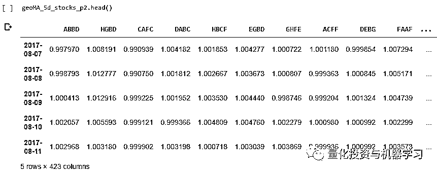

结果可以通过绘制一些样本股价时间序列及其几何移动平均曲线来验证：

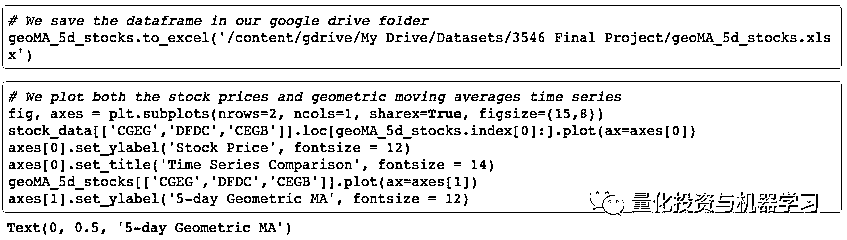

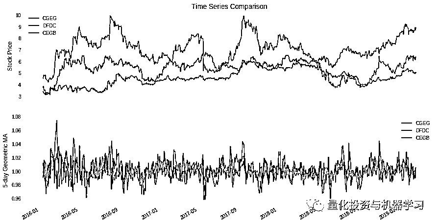

然后，刚刚构建的 dataframe 可以分为两个等长的时间段，仅在第一阶段内转置一个。第 1 阶段从 2016 年 1 月 12 日到 2017 年 8 月 4 日。第 2 阶段从 2017 年 8 月 7 日到 2019 年 3 月 1 日。

我们将只使用第 1 阶段的数据来获取预测。

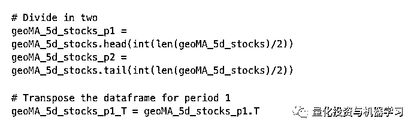

我们对 dataframe 进行转置，以便每一行表示给定股票的时间序列：

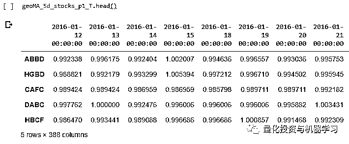

**▍使用随机模拟扩充数据**

我们将使用随机模拟来生成合成的几何移动平均曲线。目标不是精确地建模返回，而是获得具有类似于真实数据的行为的曲线。通过仅使用模拟曲线训练模型，我们可以保留真实的数据来获得预测。

使用几何布朗运动生成合成曲线。我们遵循以下步骤操作：

1、使用第一阶段 dataframe，随机选择 100 只股票代码；

2、对于所选的每只股票代码，计算一个对数收益的向量，以便：

3、然后对于所选的每只股票代码，我们将生成 100 条路径，以便：

这里有一条模拟曲线和一条真实曲线的示例：

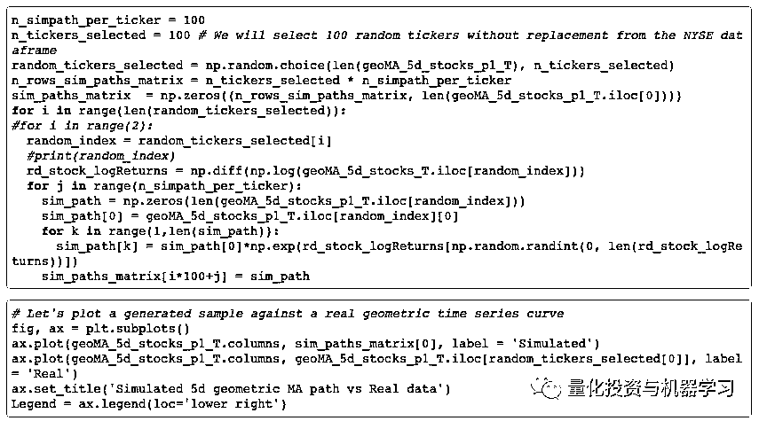

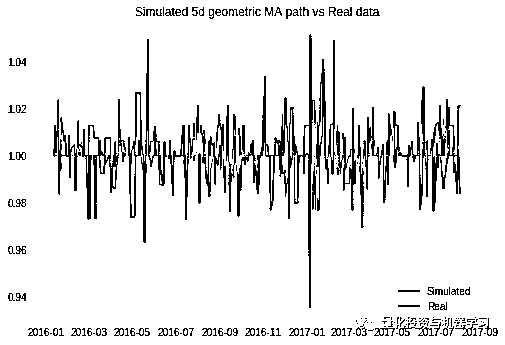

我们已将 423 个时间序列的数据集扩展为 100 * 100 = 10，000 个与股票数据集相似（但不相等）的新时间序列。

这将允许我们保留实际的股票数据集范围以进行预测，甚至不必使用它进行验证。

在构建变分自动编码器（VAE）模型之前，创建训练和测试集（使用 80%-20%的比率）：

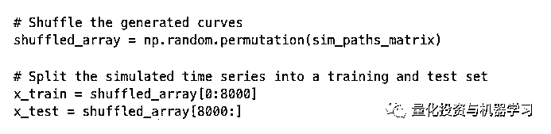

读者还应该注意，在训练模型之前，无需删除时间序列的季节性和趋势。

**▍构建变分自动编码器模型（VAE）**

我们将使用变分自动编码器将具有 388 个项目的时间序列向量的维度降低到二维点。

自动编码器是用于压缩数据的无监督算法。它们是由一个编码器、一个解码器和一个丢失函数构成，用于测量压缩和解压缩数据表示之间的信息丢失。

该编码器模型具有：

*   一个长度为 388 的输入向量

*   一个长度为 300 的中间层，具有整流线性单元（ReLu）激活功能

*   一个二维编码器。

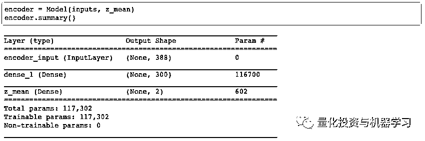

解码器模型具有：

*   一个二维输入向量（从潜在变量中采样）

*   一个长度为 300 的中间层，具有整流线性单元（ReLu）激活功能

*   具有 S 形激活函数的长度为 388 的解码向量。

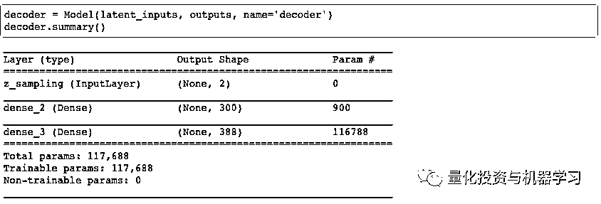

以下代码改编自 Keras 上 Github 团队的 variational_autoencoder.py。它用于构建和训练 VAE 模型。

*https://github.com/keras-team/keras/blob/master/examples/variational_autoencoder.py*

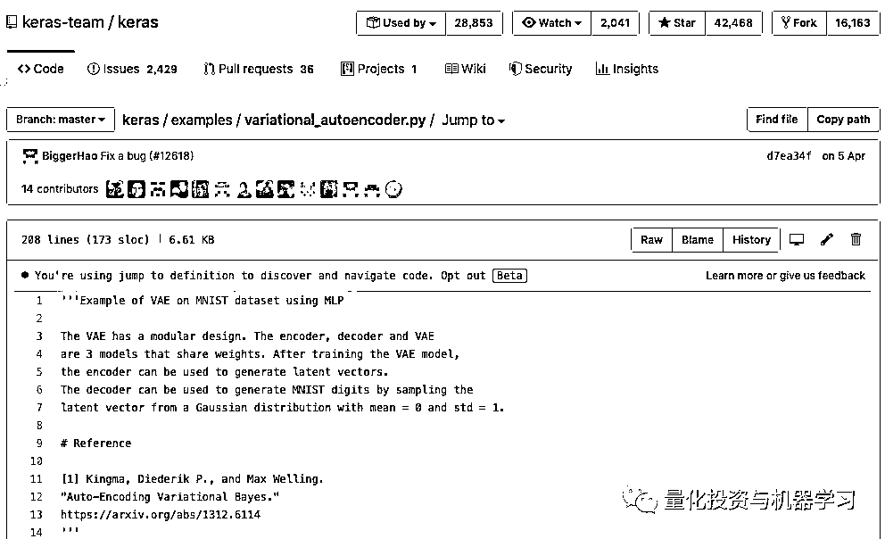

训练结束后，我们绘制训练和验证损失曲线：

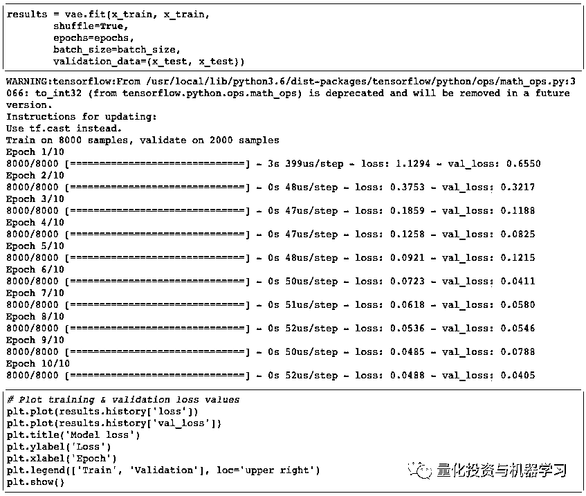

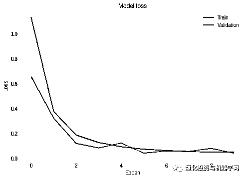

**▍获取预测**

我们将只使用编码器来获取预测。我们将使用实值矩阵，包括股票数据集和一个或多个感兴趣的时间序列。

在我们的项目中，我们针对在另一个国家以不同货币所列出的前一个月期货合约测试了一个股票数据集。

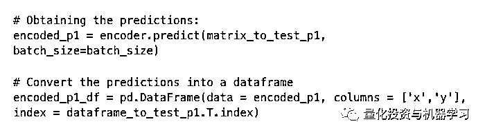

我们获得了以下结果：

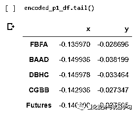

在绘制结果之前，我们必须：

1、计算期货合约点与 dataframe 中所有其他股票之间的距离。

2、选择最接近期货合约的 50pints。

我们现在可以绘制获得的结果，以可视化最近的 50 只股票：

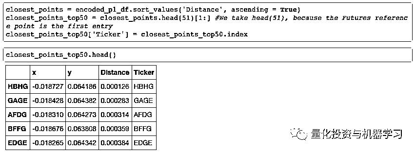

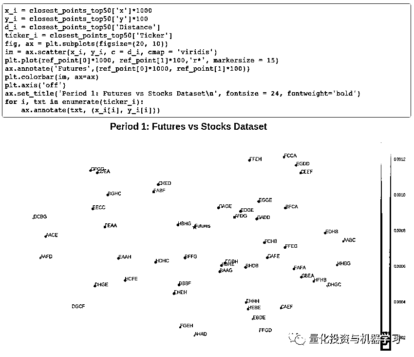

我们已经对另一个国家所列出的期货合约进行了分析，但是对于来自于同一交易所的股

票，我们可以按照第 1 部分中的相同步骤进行。

**指标构建**

让我们使用在第 1 部分中获得的结果来创建一个指标。

**由于 VAE 模型的随机性，我们将无法获得每次运行的前 50 只股票的准确列表。**为了得到最接近 50 个点的公平表示，我们将运行 VAE 模型（每次运行时重新初始化和重新训练）。然后，我们将在每次运行中找到的 50 个最近点，以创建一个长度为 500 的 dataframe closest_points_df。

一旦建立了 dataframe closet_points_df：

1、按距离对点进行排序；

2、删除重复的代码，只保留第一次出现；

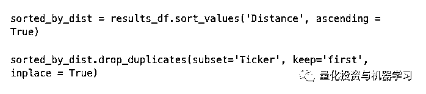

删除重复项后，我们只保留 50 个最近点。

**▍****计算每只股票的权重**

在指数构建中，股票权重的计算采用不同的方法，如市值法或股票的价格法。

相反，我们将计算每只股票的权重，使得最接近期货合约点的点将比离它较远的点获得更高的权重。

**对于非匿名股票数据，在计算股票权重之前，对得到的结果进行过滤是非常重要的。应删除异常值并改进市值范围。**

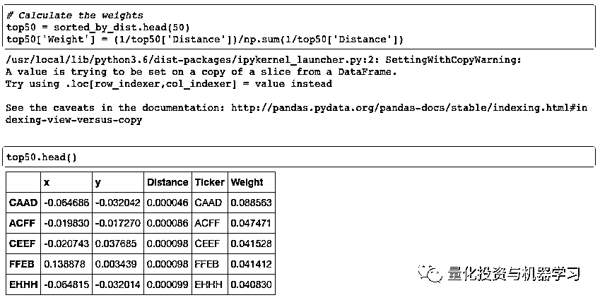

**▍****计算样本权重**

计算每只股票的股数

计算权重后，我们计算了自定义指标中每只股票的股数。我们需要：

*   在 2016 年 1 月 4 日（第 1 期的第一天）获得的每只股票的价格

*   定义净资产金额

*   计算每只股票的股数

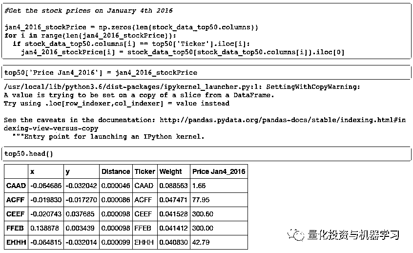

我们为 2016 年 1 月 4 日的股价增添了一列

我们为股份数增添了一列

**指标构建**

为了建造指标，我们将使用拉斯拜尔指数（Laspeyresindex），计算如下：

我们绘制了获得的自定义指标：

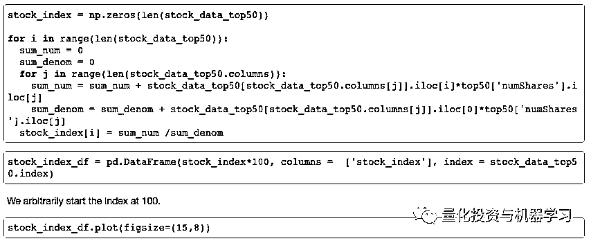

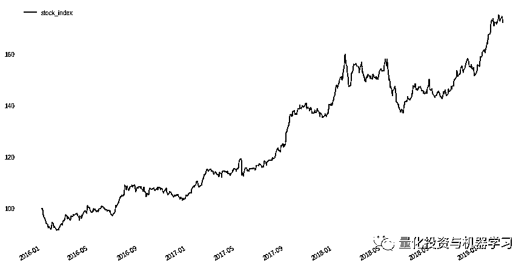

**将我们的自定义指标与期货时间序列进行比较**

我们必须缩放期货价格数据，以便将其绘制在与我们自定义指标相同的图表中。要做到这一点，我们必须：

*   计算期货价格数据的日百分比变化

*   设置 S_0=100

现在我们将曲线绘制在同一张图表中：

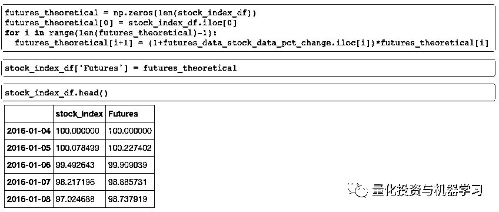

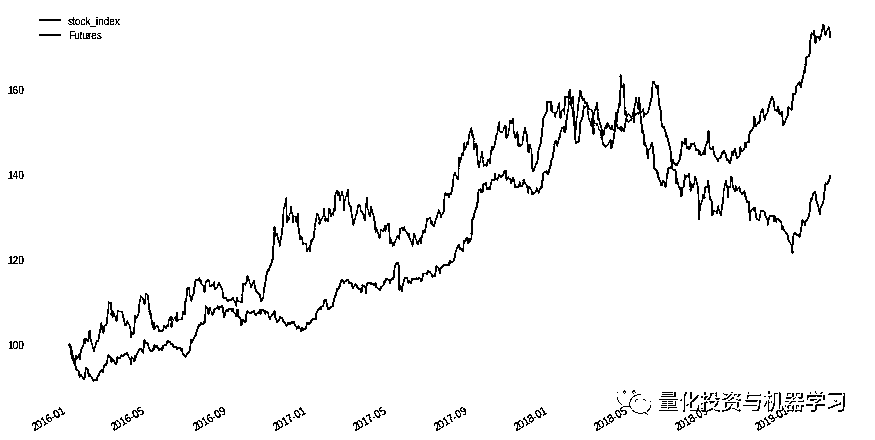

除 2018 年下半年外，我们的指数与参考期货时间序列的趋势大致相同。因为我们使用匿名数据，所以我们没有过滤股票的异常值和市值限制。此外，在观察到的两个时间段内没有重新平衡，并且我们忽略了分布。

如果识别出股票代码并删除异常值，则自定义指数绝对有可能击败期货指数。

我们鼓励大家利用在线提供的免费（GPU）实例创建自己的指标。这对我们来说是一个有趣的实验，我们发现了一些有趣的股票模式。

**结论**

**使用变分自动编码器可以加快外国股票市场新指数的发展，即使分析师不熟悉它们。此外，还可以创建符合客户利益的利基指数或投资组合。**

**虽然这种方法可以用于创建 ETF，但我们相信它也可以为全球的直接指数和智能投顾公司创造新的投资可能性。**

**获取全部代码**

在**后台**输入（严格大小写）

***变分自编码器 LhtzJQXX***

*—End—*

量化投资与机器学习微信公众号，是业内垂直于**Quant**、**MFE**、**CST、AI**等专业的主**流量化自媒体**。公众号拥有来自**公募、私募、券商、银行、海外**等众多圈内**10W+**关注者。每日发布行业前沿研究成果和最新量化资讯。

