# 二千零一十九、最新西蒙斯访谈：量化策略、职业与交易

> 原文：[`mp.weixin.qq.com/s?__biz=MzAxNTc0Mjg0Mg==&mid=2653293316&idx=1&sn=1828e486f53b70a21c04b94b020ed5c6&chksm=802dc911b75a4007c02d27551ebdfe712dfc60f8dfb6caf2aa9b6244d5f494741a8923413d6a&scene=27#wechat_redirect`](http://mp.weixin.qq.com/s?__biz=MzAxNTc0Mjg0Mg==&mid=2653293316&idx=1&sn=1828e486f53b70a21c04b94b020ed5c6&chksm=802dc911b75a4007c02d27551ebdfe712dfc60f8dfb6caf2aa9b6244d5f494741a8923413d6a&scene=27#wechat_redirect)

**标星★公众号     **爱你们♥

量化投资与机器学习微信公众号，是业内垂直于**Quant**、**MFE**、**CST、AI**等专业的**主流量化自媒体**。公众号拥有来自**公募、私募、券商、银行、海外**等众多圈内**10W+**关注者。每日发布行业前沿研究成果和最新行业资讯。

**编译人员**

Allen 、 ZL 、 Eva 、 叶别

**量化投资与机器学习公众号独家解读**

**未经允许，禁止任何媒体转载** 

**前言**

提起西蒙斯、大奖章、文艺复兴大家可能再也熟悉不过了，几乎所有 Quant 都听闻过他老人家和文艺复兴的辉煌业绩。在这里我们不再对其西蒙斯本人进行过多的介绍。只想说一句：

**詹姆斯·西蒙斯（ James Simons，1938 年－）是美国的数学家、投资家和慈善家。作为最伟大的对冲基金经理之一，他是量化投资界的传奇人物！**

****

在前几年有关西蒙斯的公开视频中，大家关注最多的有以下几个：

**2010 年 MIT**

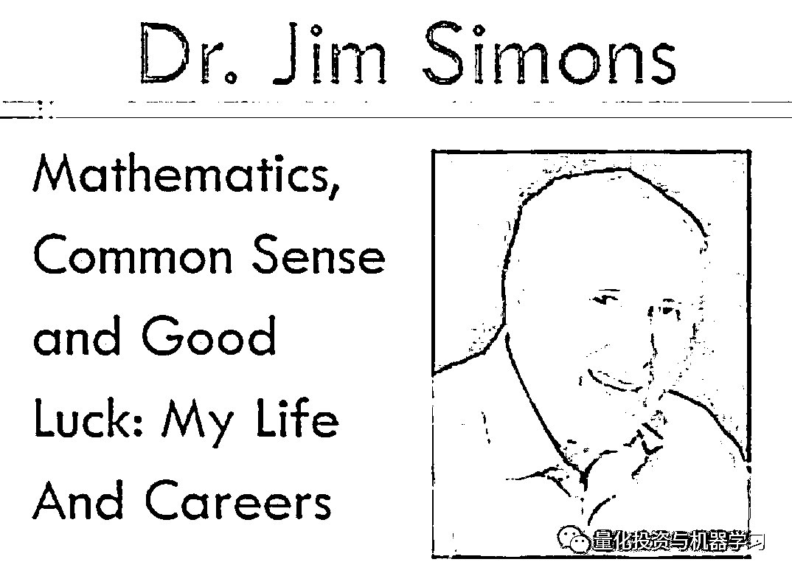

**2014 年 AMS Einstein Public Lecture**

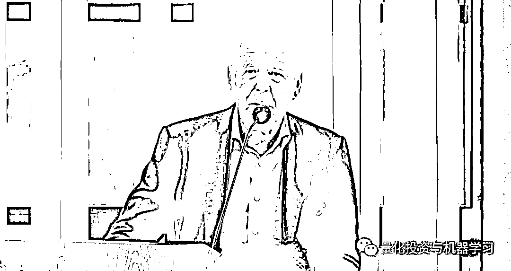

**2015 年 TED**

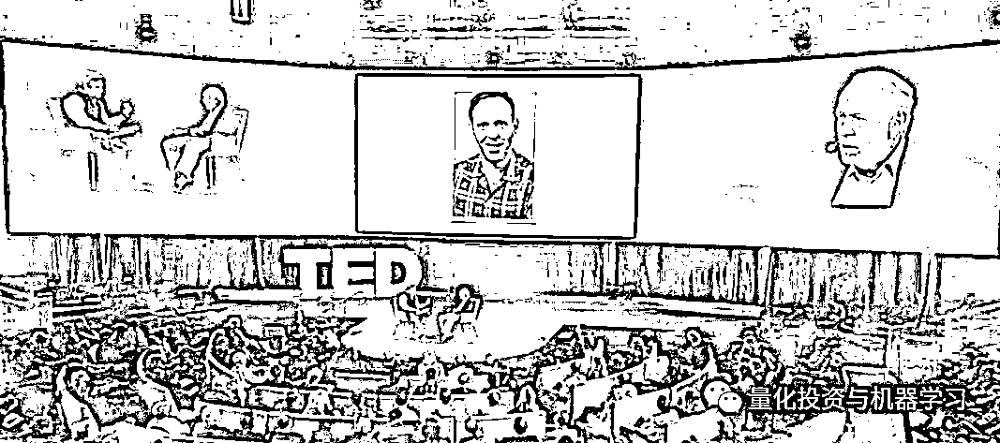

时隔多年，2019 年，西蒙斯又一次在公开场合会为我们带来怎样的论点呢？

**讲座背景**

2018 年 9 月 17 日：麻省理工 Sloan 管理学院宣布，麻省理工学院校友、文艺复兴创始人、数学家詹姆斯·西蒙斯获得 S. Donald Sussman 奖。该奖项授予在量化投资策略和模型方面表现出创新和卓越表现的个人或团体。西蒙斯因其在这一领域的杰出贡献，以及他在数学方面的工作和对基础科学研究的积极支持而入选。麻省理工 Sloan 管理学院院长 David Schmittlein 表示：“我们很高兴授予西蒙斯博士这个奖项，以表彰他作为数学家、投资者和慈善家的非凡职业生涯。”

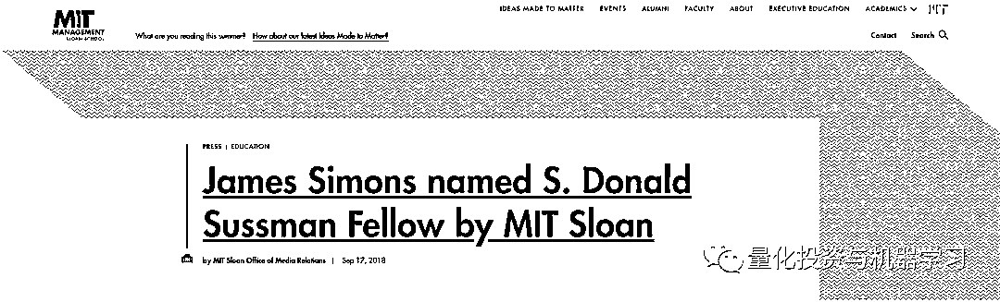

麻省理工 Sloan 管理学院金融工程实验室主任、奖项委员会成员 Andrew Lo 教授指出：“西蒙斯在多个领域都是一个传奇人物，他是量化投资的典范；我们很感谢他接受这个奖项。”

**关于 S. Donald Sussman 奖**

## S. Donald Sussman 从事另类投资超过 30 年，管理着专注于量化和基本面策略的基金。他是 Trust Asset Management、Paloma Funds 和 New China Capital Management LLC 的创始人。他是董事会成员和执行委员会成员，也是卡内基音乐厅投资委员会的联合主席。他曾就读于哥伦比亚大学，并在纽约大学获得理学学士和工商管理硕士学位。

## S. Donald Sussman 奖由 MIT Sloan Finance Group 监管。获奖者将获得 10 万美元的现金奖励，**且在获奖期间于麻省理工 Sloan 管理学院举办三场公开讲座，分享对量化金融和金融业的见解。**

**这就是本次演讲的由来，大家清楚了吧？**

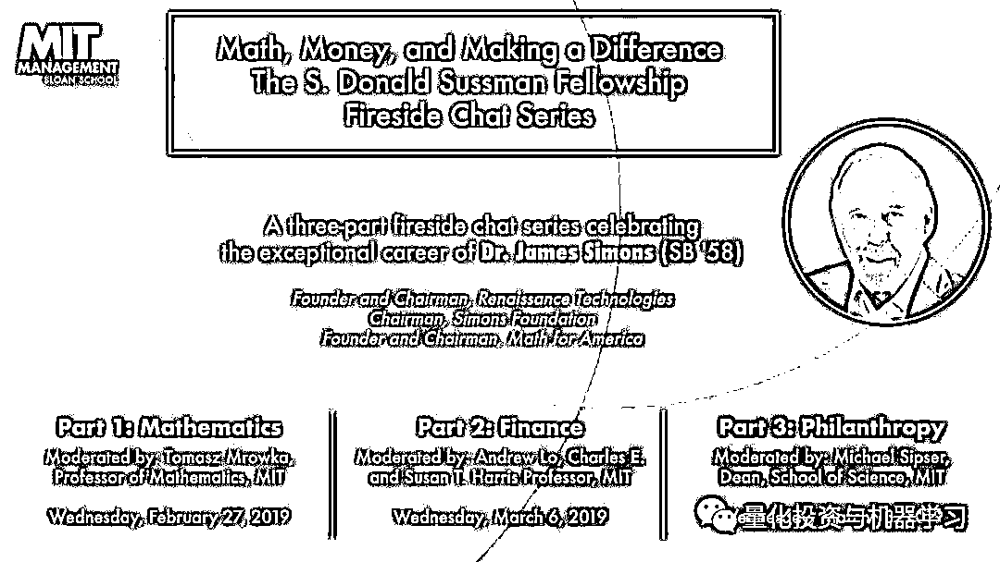

S. Donald Sussman Fellowship Award Fireside Chat Series 

本次公开讲座的总体主旨是：

***Math, Money, and Making a Difference***

主题分别为：

2018-2019 年度获奖者：MIT 校友詹姆斯·西蒙斯博士，SB '58

*   **第 1 场：数学**

*   **第 2 场：金融**

*   **第 3 场：慈善事业**

本文首先对**【第 2 场：金融】****的****采访和问答进行了脱水整理与解读**。**主持人是 MIT 金融学教授 Andre W. Lo**。在这次采访中，西蒙斯讨论了他的量化投资方法，以及这一方法在他的职业生涯中是如何演变的。同时还谈到了基础交易以及他的管理风格是如何帮助文艺复兴取得了如此成功。最后还有和观众精彩的问答环节。

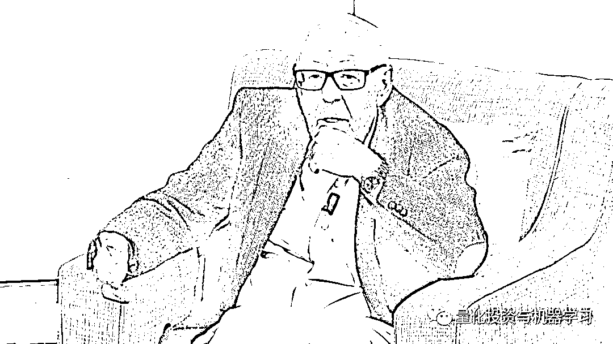

对比之前得照片，可以感觉到，西蒙斯老了 

后面会对**【第 1 场：数学】****进行整理与解读**。大家敬请期待！

针对【**第 3 场：慈善事业】**我们将**不做解读**，大家自行收看！

公众号对此次采访做了 **全网独家 ****翻译和解读**。同时**感谢石川博士**对部分内容的修正。

**内容概要**

*   **对商业的兴趣**

*   **其他概括**

*   **为什么去石溪大学数学系？** 

*   **为什么开始从事货币交易？**

*   **关于大奖章基金**

*   **文艺复兴办公环境介绍**

*   **如何管理你的团队 ？**

*   **如何保持在业绩上的长青？**

*   **2008 金融危机**

*   **问答环节（12 个问题）**

**对商业的兴趣**

我毕业之后去伯克利读了博士，在那里我遇到了我的论文导师 Berg Kaster，后来我和哥伦比亚的朋友，一起做一些生意，并且赚了一些钱，我父亲当时也投资了一些钱，那些钱后来为我职业生涯的转变奠定了基础。我在 MIT 教书的时候，我通过借钱对我的生意做投资。几年过去了，我需要开始还贷，就像所有其他的企业刚刚起步一样，我们开始期望 18 个月以后就可以有红利可分，我们对自己的公司报了太高的期望。不过我们最终还是得到了红利，但那是在几年之后，不过这些红利数目还是相当可观的。

**其他概述**

需要建立一个系统性的交易系统，要知道模型的所有细节。他还讲述了大家众所周知修整模型，王者归来的事情。

这也在西蒙斯之前的一些演讲中多次提到的事情：

我从 IDA 找来了全世界最好的模型创建者，Lenny。在 IDA 的时候我们一起构建模型。Lenny 开始和我一起创建模型，但是我却一直在做交易。Lenny 似乎对建模越来越不感兴趣，而是经常会去阅读一些新闻。然后他会形成自己的观点比如说市场会上涨，市场会下跌之类，都是关于外汇和债券的一些东西。然后我开始发现有很多时候他的分析是对的。我说：“好的，你是用的什么模型？不妨我们用它来赚点钱吧。”我们的回报率很高，从我问“你运用的什么模型”开始的两年里，我们把我们投资者的钱变成了刚开始的 12 倍，那还是扣除了其他费用的。听上去我们做得不错，我们也是极其幸运的。当时在我的脑海里想的仍然是我可不想只去建模，但是另外其他的人可以专门建模。Jim Max，一个很著名的数学家，离开了石溪大学后加入了我们，他的确建了一些模型。在接下来的几年里，我们把基本面交易，风险投资和所有其他的投资方式结合在一起，我们一直在不断创造出新的更有效的模型。

既然我们会做模型，那就不妨跟着模型走。

所以，在 1988 年的时候，我决定百分之百的依靠模型交易。而且从那时起，我们一直都这么做。我们建立了一个百分之百依靠电脑模型做交易的公司，逐渐地，那些模型也变得越来越有效，我们还招进了越来越多的人。

当时他请来了普林斯顿大学的数学教授 Henry Laufer，一起对交易模型进行修正。这次耗时 6 个月的修正被《量化投资——西蒙斯用公式打败市场的故事》一书的作者称为是大奖章基金的“遵义会议”，当时制定的投资策略一直被保留了下来，成为基金长盛不衰的立命之本。

***“我们完全停止了基本面分析，变成了一个彻底的、依靠模型的量化投资者”  ***

*——西蒙斯*

**Baum-Welsh 算法**

****▍主持人****

许多技术的前身，包括现在的深度学习都是一个有趣的历史，我记得 Lenny Baum 早期的 Baum-Welsh 算法，主要是估计 HMM 的参数，那么对你的意义而言···

**▍西蒙斯**

我第一次遇见 Lenny Baum 是在街上，Lenny Baum 和 Lloyd Welsh 一起发明了 Baum-Welsh 算法，这个算法可以估计出隐藏马尔可夫模型中的参数。隐藏马尔可夫模型有很多参数，这个算法不断攀爬、不断重新估计参数，计算新的期望值，不断获得更好的参数估计。

然而当时没人可以证明这个算法一定是有效的；虽然这个算法肯定是有效的，可以从任意初始条件下都收敛的比较好。

当我在 IDA（国防分析研究所）工作时，我尝试想证明 Baum-Welsh 算法的每一步都是都是向着向正确方向攀爬的，但是没能成功。然后我离开了 IDA，Baum 和他的朋友 Petrie 最终证明了出来，他们写了很长很长的论文；他们告诉我，我是可以用很短的篇幅内就完成这个证明，有一些他们不了解的定理可以使证明过程明显变短。如今这个算法在语音识别和很多其它领域都十分有用。

**公众号独家解读**

目前语音识别的算法里，HMM 算法是效果最好的一个。美国贝尔实验室劳伦斯拉宾纳的英文版教程《Fundamentals of Sppech Recognition》，其中第六章系统地解了隐马尔可夫模型的原理和应用，国内大多书籍里关于隐马尔可夫模型的资料都是翻译了这一章。

下面这张图是网上流传的影印版。大家可自行下载阅读。

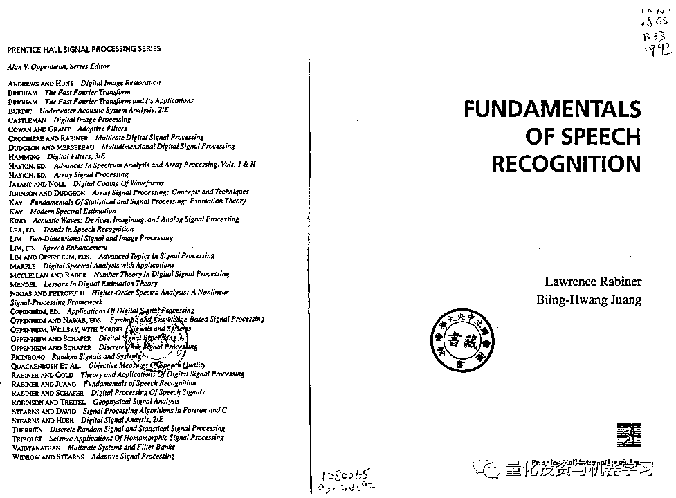

在文艺复兴科技成立初期，统计学家 Leonard Baum 无疑起到了关键的作用。Baum 是率先提出隐马尔科夫模型（Hidden Markov Model，HMM）的专家之一，该方法用来描述一个含有未知参数的马尔可夫过程， 在语音识别、生物信息学等领域取得了非常成功的应用。此外，统计学 Baum-Welch 公式也是以这位杰出科学家的名字命名，它是一种学习 隐马尔科夫模型参数的有效方法。西蒙斯本人认为投资和语音识别很相似，因此曾 经把 IBM 的整个语音实验室的精英挖到文艺复兴公司。基于这些背景，人们有理由相信隐马尔科夫模型是大奖章基金取得辉煌业绩的神秘法宝。

这个方法是有用，但是绝对没有那么简单，前几年国内的一些研究者曾对这个算法做过复现。

**广发证券**

**1、《探寻西蒙斯投资之道：基于 HMM 模型的周择时策略研究》**

将 HMM 模型应用到我国股市的预测中，通过对股票数据序列的模式识别来对股市每周趋势进行预测。我们将股票的未来走势分别划分为两种(涨、跌)和三种(涨、跌、平)状态，把股市的波动预测转化为 分类问题，并通过 HMM 模型进行识别。

**2、《再探西蒙斯投资之道：基于隐马尔科夫模型的选股策略研究》**

将语音识别的技术引入到股票涨跌预测中。假设上涨和下跌的 股票各自都存在一种明确的模式，都分别可由一个 HMM 模型来描述。我 们选择换手率、股价 1 日涨跌幅等 6 个价量指标作为模型观测值，选择股 票池内上涨的样本训练表征上涨模式的 HMM 模型。

预测时，一个股票在表征上涨模式的 HMM 模型上的观测概率越大， 说明该股票实际上涨的概率也越大。我们将股票池内的股票按照 HMM 因 子值均分成 10 档，每期超配最高一档的股票

**东北证券**

**1、《HMM 指数择时研究之实战篇》**

**2、《HMM 指数择时研究之理论篇》**

**东证期货**

**1、《包含基本面信息的 HMM 投机策略》**

从 HMM 的输入数据来看，输入变量一般比输入参数更能影响状态的输出。梳理现有的 研究成果，我们发现输入变量更多的是行情变量和技术变量。在基本面量化愈发深入人 心的背景下，基本面变量的引入可能会提升 HMM 的策略表现，这也是我们将基本面信 息引入到 HMM 中的动因。需要说明的是，这里提到的“基本面信息”指基本面变量。从期货市场研究的逻辑来看， 国债期货和商品期货的基本面逻辑较强，因此实证部分仅针对国债期货和部分商品期货 进行 HMM 的测试。

据我们了解，使用 HMM 模型做量化策略，一定要**注意参数过拟合、引用未来函数、模型具体算法更新等问题**。大家可自行进行进一步研究，这里不再陈述。

**为什么去石溪大学数学系？**

**▍主持人**

我来问两个促使你后来创立大奖章基金的事情。其中一个问题是关于你**离****开 IDA、选择加入纽约州立石溪大学数学系，当时石溪大学的声誉远不如现在，你为何考虑去那里、在那里有哪些经历**？

**▍西蒙斯**

**我是被 IDA 开除的**，有过一次被开除的经历是不错的，一旦你经历过你就绝对不想再经历一次了。

IDA 的总部在华盛顿特区，其中一个小部门在普林斯顿。一个名叫 Maxwell Taylor 将军负责（听众里面年龄大点的应该听过 Maxwell Taylor 这个名字）在纽约时报杂志上撰文描述美军是如何在越南获得胜利的、美国应该坚持作战到底。

**公众号独家解读**

马克斯韦尔·泰勒（Maxwell Taylor 1901—1987），美国四星上将。二战时期的 101 空降师师长，参加过美军在欧洲的所有空降战役。战后历任西点军校校长，驻朝鲜第 8 集团军司令，美国陆军参谋长，约翰·肯尼迪总统军事顾问和美国参谋长联席会议主席等职务，提出了著名的灵活反应战略。是军中少有的理论与实践融为一体的人物，在第二次柏林危机，古巴导弹危机和参与越南战争等决策上，他是著名的鹰派人物。

当时是 1968 年，我不同意他的观点，我给纽约时报写了一封信，第一句话是：并不是每个服务于 Taylor 将军的人都同意他的观念，他应该尽快从越南撤退。

然后没有任何理由，我就被 IDA 解除了安全许可。几个月以后，一个宣称是新闻杂志的人说他正在撰写一篇关于为国防部工作的人文章，他很难找到这样的人，问可以采访我吗。

当时我 29 岁，从来没接受过采访，被采访时很激动，我说当我在 IDA 时，一半的时间用来给 IDA 干活、另外一半时间是私下自己干活，**我在那个时间段做了大量的数学研究**。在越战结束之前我只干自己的活、战争结束之后我才会各干一半的活。

当我采访结束回到办公室，我告诉我的老板我接受采访的事情。我本应在采访之前征询下他的意见，那样他就会建议我不要接受任何采访。我的老板问了我说了什么，我把一半给自己干活、一半给 IDA 干活的言论说了一遍，老板听了之后没说什么，走回办公室给 Maxwell Taylor 打了一个电话，五分钟后他出来了告诉我，我被开除了。

我反驳说，你不能解雇我，因为我的职位是永久员工；他问我是否知道永久员工和临时员工之间的区别，我说不知道，他说临时员工是有合同、永久员工没合同，所以我不得不离开 IDA。

我有三个孩子，必须得寻找一份新工作；当时我很自信自己可以找到好的工作，我确实在数学领域做出了一些重要的成果。有几个教授的职位供我选择，**我最终选择了石溪大学数学系主任的职位；****当时的石溪大学数学系比较弱，他们在一直在寻找一个有声誉的人来领导他们的数学系。**

当时的纽约州州长 Rockefeller 很喜欢石溪大学，那时，石溪大学有很有钱，我便招募了许多优秀的人才。那是一段美妙的时光，我在最初的几年内做了大量的数据研究，研究成果也很不错。

**为什么开始从事货币交易？**

**▍主持人**

那什么原因让你离开石溪大学去从事货币交易呢？

**▍西蒙斯**

一开始我是花一半时间从事交易，然后渐渐的全部时间用来交易。**当时我被一个数学问题给难倒了，所以转向新的交易领域做了些尝试，我发现自己对交易很感兴趣，然后我就开始了一段新的职业生涯。**  

我的父亲很反对我的决定，他觉得我已经有了终身教职、很好的工作，为什么还要出去冒险，但是**我很自信我能够搞定交易**。

**▍主持人**

在你的货币交易中，可以与我们**分享你是如何做**的吗？比如你是**如何使用技术分析**的。

**▍西蒙斯**

我读了所有的报纸、经济学家写的东西，重点关注有哪两个货币之间是可以在公开市场交易的（因为有些国家的货币是绑定美元的、不太好交易）。

这是最基本的。但问题是， 有时这套方法是有效的，这时我感觉自己是天才；有时这套方法效果很差，我又会觉得自己是个蠢货。

这是一个非常痛苦的事情，我希望可以开发一个系统、利用计算机来告诉你如何进行交易。在此之后，**我们聘请了科学家，并建立了这样的交易系统并持续的改进它们。**

**关于大奖章基金**

**▍主持人**

现在我们来聊聊大奖章基金。当我介绍金融学时，我通常用一个方程：数学+金钱=金融，我认为大奖章基金是这个方程的集中体现，因为它产生了巨大的回报。 

现在的基金记录是保密的，但你在 2002 年接受的一次采访中曾经透露，西蒙斯旗下的大奖章基金自 1988 年成立到 2000 年表现的越来越好。**自 1988 年 3 月成立以来，西蒙斯旗下规模为 33 亿美元的大奖章基金的年回报率为 35.6％，而 SP 同期则为 18％。这是在扣除了费用之后的回报，那时大奖章基金的最高费用是 5％的固定费用+44%利润分成。**

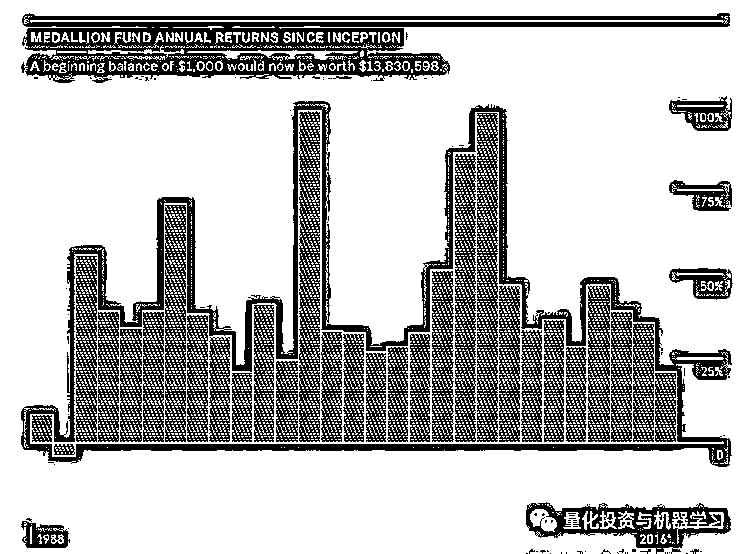

  图片来自：彭博

从 88 到 99 这 11 年间，大奖章基金的整体收益是 2478.6%。当时对冲基金中第二好的是索罗斯的量子基金，其同期收益仅为 1710%。你是如何做到这么高的收益的？

**▍西蒙斯**

我不记得那个时候我们的管理费是不是 5%固定费用+44%的利润分成了，一开始我们是先提升到 5%固定费用+36%的利润分成的，投资者都在抱怨，而我们还是进一步提升费用到 5%固定费用+44%的利润分成。不过依然有非常好的投资回报，没有一个投资者发起了赎回。

后来我意识到，**基金规模是我们的局限性，我们可以管理中等规模的资金、但是无法管理更多的比如千亿规模的钱****；**与此同时，我们的基金增长很快产生了更多的钱，这些都要求我们做出一些改变。 

**一开始我们只允许内部员工的投资、拒绝了所有的外部投资者**。后来我们收购了 5 个外部投资方，让内部员工来持有， 一段时间后这个也遇到了瓶颈；在同一年，我们启动了外部基金。

**外部基金和内部的大奖章基金是不冲突的，后者更关注长期的回报；**我们的外部基金发展的很好，**现在的****基金规模为 450 亿美元****。**

**▍主持人**

大奖章基金还是保持原有的规模吗？

**▍西蒙斯**

是的，大奖章基金还是保持固定的规模，没有**450 亿美元**那么大。

**▍主持人**

**能透露下你有多少名员工吗？ **

**▍西蒙斯**

**我们有****300 多名员工**，其中包含**大量的科学家****。****在我们的业务中，****需要持续的改进系统；****系统中的某些部分会在一段时间后渐渐失效，需要找出来并进行优化改进，所以我们一直都在尽可能的招聘最优秀的科学家。**

有人对我说，招募太多的科学家对这个世界并不是件好事，他们本来可以做出伟大的科学；但我觉得这些科学家赚了很多钱、然后把钱捐赠给慈善机构，并不会伤害这个世界。

**正确的方式是：首先雇用最聪明的人，让他们合理的协作；让每个人都知道其他人在做什么。现在有些公司也在做类似的系统，他们分成了若干个组，这是一个组，那是一个组，每个组会按照他们各自的系统的效果来获得报酬。 **

我们只有一个系统，每周开一个研究会，如果有人有新的东西，他就展示出来；每个人看都有机会获得代码， 他们可以运行代码，判断是否真的有用。所以**我****们是一个非常协作的公司，我认为这是加速科学研究的的最佳方****式**。  

另外，**我们拥有非常棒的基础设施**。在别的地方我从来没有看到过类似的高效率。我们公司被组织的很好、并且有伟大的员工。

**公众号独家解读**

**文艺复兴办公环境介绍**

这里是文艺复兴科技公司（Renaissance Technologies）的总部所在地（纽约）。建筑师的目标是提供一个刺激的工作氛围，包括各种工作条件，从私人办公室和会议室到更多公共活动和非正式用途的空间。

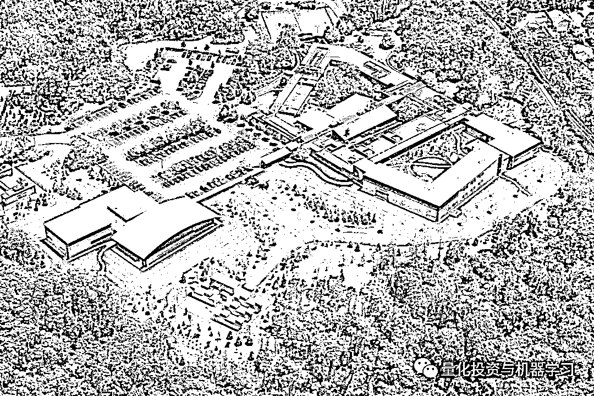

所有办公空间均为私人空间，设有金色木质天花板和大型木框窗户，可以俯瞰风景园林和林区；大楼独特的两翼设有交易大厅和行政区域。在庭院之间有两根巨大的露在外面的胶合木梁，覆盖了东端的餐厅和会议室。西面是图书馆、休息室和健身房——后者可以通往网球场和穿过风景蜿蜒的跑道。

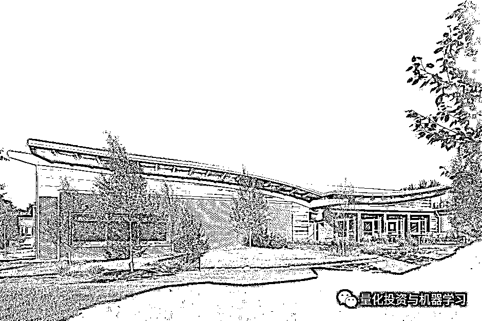

新增的办公楼，每个办公室都配有大型木窗。包括一个中央庭院；一个最先进的董事会议室，以容纳公司的持续增长；7000 平方英尺数据中心，配有 N+1 冗余 HVAC 系统；健身设施包括室内网球场、健身房和室内足球区/半球场篮球场。

多数人都在位于东锡托基特（East Setauket）长岛镇（Long Island Town）的公司总部上班，公司总部修建得像堡垒一样。因为除了道路上的访问控制和被郁郁葱葱的森林隐藏的设施包围之外，内部还有许多访问控制，这取决于建筑每个部分所需的限制程度。当你经过一个简单的磁条时，可以穿过了一些门，但更接近公司核心的其他门需要额外的代码甚至是他们的指纹。主楼还有两层地下空间，其中包括计算机室和其他秘密部门。这是一个巨大的空间，白色的墙壁，两层高的天花板。在房间的中央，6 根 2 米高的柱子两边排列着处理器，在柱子和柱子之间形成了长长的走廊。每一根柱子的长度都令人印象深刻，长度应该在 50 到 60 米之间。 

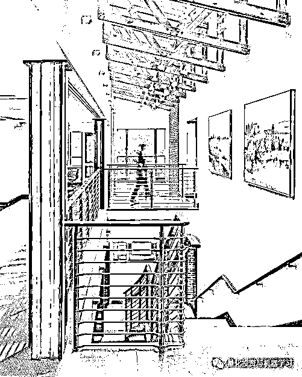

大家办公室的门基本都是敞开的，正如西蒙斯在采访中所肯定的那样，每个人都敞开着自己的门，以促进思想之间的相互交流。在讨论室，有一个巨大的屏幕，上面是一张巨大的椭圆形桌子，大约有 40 个座位，桌子周围是第二圈椅子，总共有一百多个座位。想象一下，满屋子的博士们激烈地争论着，试图找出任何新提议的漏洞。

**的确，科学家们继续留在文艺复兴的主要目的不是为了钱**，还有比这更好的地方吗？**与众多科学家、博士共事的智力挑战，不仅能留住文艺复兴在职的人才，还能吸引那些在大学研究岗位上感到无聊的杰出人士。**不断向对方的理论剔除挑战与反驳，在世界上任何一所大学，这是可能的！

**▍主持人**

**文艺复兴公司所做的很多事情很明显是保密的，连你们的员工也是保密的**。但我可以说,你们的员工都是他们各自领域最顶尖的科学家之一，在许多不同的领域都是这样。这么说恰当吗？

**▍西蒙斯**

我说一个有趣的故事，文艺复兴公司每周都有一次座谈会，有一次从外部邀请来了一个天文学家来做讲座，当时他的一个朋友正在文艺复兴公司工作。 

那天他的讲座十分有趣，我把他拉到一边，对他说：你的朋友在我们这工作的不错，要不你来加入进来？

他说我们的工作机会非常有吸引力，但他需要先完成他手头上的科研项目，后来他获取了诺贝尔奖。

他是发现宇宙实际上正在加速膨胀而不是减速的两个团队中的一个，这个发现在当时是一个大新闻。

我认为他当时的决定是对的，大多数人更愿意获得诺贝尔奖。他是我们差点招募到的唯一一个诺贝尔奖的科学家，除此之外我不认为公司里的其他人能达到这个高度。

尽管他们中有些人做出了了不起的成果，但是毕竟没有获得诺贝尔奖。**我们有实验物理学家、有天文学家，他们收集了大量的数据并就行分析**。

**如何管理你的团队 ？**

**▍主持人**

第二个问题是：你如何管理这些天才型的员工的，**天才往往都非常自我、难以管****理**。你谈到过合作精神，**但作为数学系的主任和公司的管理者吗，这些天才并不容易协作的**。

**▍西蒙斯**

数学系的主任是没有权力管理这些天才的， 在座的听众有的是教授应该是的知道，他们只要做好教学和科研就好了。 

**在文艺复兴公司，不同员工做的事情是有相互影响的， 每周的研究会上他们能看到别人的工作、也会对别人的工作提出一些建议。**

**我们给员工的报酬并不是按照他当年的工作来分配的**；每年都有员工对我说，他今年给公司赚了很多钱、理应获得更高的报酬，我就问他你的工作难道不依赖别人吗，**你****赚的钱中的很多部分是依赖别人的工作的，别人的工作我已经付出了报酬；****如果每个人都照你这样要钱，我得多付出五倍的报酬。**

我会看一个人在**连续 3 到 5 年内的综合成绩**，然后给他应得的报酬。 

**没有人会对一切事情都满意的，我也知道有些人认为自己应该拿更多的报酬，这是人的天性；但总体来说每个人都是开心，这个是开心工作的地方。**

****如何保持在业绩上的长青？****

**▍主持人**

我最后的问题是，你和文艺复兴公司激励着很多量化投资者、学生、教师、也包括我自己，但直到今天也没有任何一个其它的量化投资者能接近你的成绩。 

**我有一个带有偏见的猜想是，你的基金并没有依赖奇特的方程式或算法，在你考虑数学之前、你就是一个天才的交易者。你拥有判断赢钱亏钱的直觉，你在选人方面做得很好，然后组建了一个优秀的团队。**

你刚才也提到了，每年年终都会有些员工找你聊一些比较尴尬的谈话。你认同我的观念吗？ 

**▍西蒙斯**

学习一些基础的交易知识当然是有好处的，可以知道市场运行的机制。并不是像你说的那样，**我九年前就离开了文艺复兴公司，当时我 72 岁。****我离开后公司一直运行的很好，有优秀的领导，没有错过机会、比我在的时候更好**。  

**当时我觉得是时候让位给年轻人了，我也需要在慈善基金会上投入更多的时间**。我给两个职位很高的年轻人越来越大的权限，后来把整个公司交给他们，然后我就离开了。**我认为我作为公司主席的最大贡献，是不停的推动公司来招聘年轻人。**

各位还有机会

**▍主持人**

所以你担任石溪大学数学系主任期间，你在这方面做了准备。

**▍西蒙斯** 是的，当然。

**▍主持人**

我再问几个琐碎的问题，感兴趣的就回答。**早在 2003 年，文艺复兴公司就开始担忧麦道夫的投资骗局，你是怎么得到风声的？**

**公众号独家解读**

伯纳德·麦道夫是美国华尔街的传奇人物，曾任纳斯达克股票市场公司董事会主席。多年来，他一直是华尔街最炙手可热的“投资专家”之一。他以高额资金回报为诱饵，吸引大量投资者不断注资，以新获得的收入偿付之前的投资利息，形成资金流。这个骗局维持多年，直到 2008 年次贷危机爆发，他面临高达 70 亿美元资金赎回压力，无法再撑下去，才向两个儿子，也是其公司高管坦白其实自己“一无所有”，一切“只是一个巨大的谎言”。麦道夫的儿子们当晚便告发了老爸，一场可能是美国历史上金额最大的欺诈案这才暴露在世人眼前。

**▍西蒙斯**

文艺复兴公司没有投钱、但我的基金会在麦道夫那里长期投钱。

我对他有一些了解，他可以令人震惊的每年都保持非常稳定的收益率，无论刮风还是下雨。

我猜这家伙一定是知道一些我不知道的事情。我拿到了麦道夫过去两年的一些交易情况，让文艺复兴公司的一位员工来分析下、看看有哪些地方是值得我们学习的**。**

**我们发现，他买入时总是很低的价格、卖出时总是很高的价格，大部分时间都持仓不动；****但这些交易只能解释其 10%的收益，另外 80%多的收益完全是个谜**。**我们怀疑他们进行了 put 或 call 交易来对冲他们的风险，而且交易量已经很大；****如果真的有这么大的交易量，一定会影响市场的变化，但我们没有观察到任何证据。****因此我们就从麦道夫那里退出了。**

姜还是老的辣

几年过去了，那个相关基金会负责人打电话，建议我多关注 Madoff。我说：“我不能建议你也卖掉份额，因为他已经运作很长时间了而且还在运作，他肯定知道一些我不知道的事情。即使我已经拿回来我的投资，但是我无法建议你去卖掉它”。我从没想到这是个庞氏骗局。因为我不清楚他确切在做什么，只是直觉上认为不能投，所以我卖掉了。五年后东窗事发，Madoff 这几年的所做的事人被揭发，所有人都知道接下来发生了什么。与我们相关的基金会，把他六年来所赚的所有收益都支付给了两个损失最多的投资者。Madoff 的庞氏骗局真是金融界发生过的最疯狂的事情。

**▍主持人**

讽刺的是，其实 Madoff 公布的跟踪数据远不如 medallion fund 的真实跟踪数据。

**▍西蒙斯**

这是真的，不过 Madoff 的回报率是真的稳定，非常稳定。紧接着 SEC 就开始调查我们，因为有些人开始议论，认为文艺复兴（Renaissance）是不是知道 Madoff 的内幕所以才及时退出。我们其实什么都不知道，因为根本没有一个人确切知道他们 Madoff 做了什么。那些议论 Renaissance 的人既看不到我们的组合，又不知道为什么我们退出，所以怀疑我们。其实那个时候，我们已经把所有的钱都还给了投资者。所以我可以说，你看我们没做错任何事，因为这都是我们自己的钱，我们已经把所有的钱都还给了投资者！但怀疑我们的人确实花了很长时间来研究我们，当然最终也没得出有用的结论。当然对我们来说，及时卖出 Madoff 份额的后果就是遭到了 SEC 的检查。

**2008 金融危机**

**▍西蒙斯**

2008 的金融危机就不应该发生。发生的缘由就是有些 MBS（Mortgage-Backed Security， 抵押支持债券或者抵押贷款证券化）的不良发展，其中出现了个特别花哨的，紧接着各式各样的 MBS 都被创造出来。那时候的评级机构，也就是现在的债券评级机构，他们客户都是债券购买者。评级机构希望能为客户提供正确的评级服务，所以在每个特定时点比如每周，会为客户提供一份报告、实时通讯或者类似汇报。但随着越来越频繁的互联网使用，人们会在网上分享给那些没有订阅债券评级报告的人。所以，这些评级机构决定，不再向债券买家收费了，而是转而向债券卖家收费。这里出现了利益冲突，如果评级机构希望债券卖光，他们就不会很严格的进行评级。所以为了卖掉债券，他们就像一个傻子一样给所有债券 AAA。

那时候申请房贷无需任何文件和信用背书，人们只需走进去申请就行。举个例子：

*   你要多少钱？

*   我要 10 万美元。

*   你赚多少钱？

*   我赚 20 万美元。

*   好吧，我们借给你钱。

银行甚至不索要申请者任何材料，例如纳税表。为什么银行这么大方？因为银行知道可以这些打包的房贷卖给机构，如房地美，房利美和吉利美。由机构打包房贷，包装成一个 AA 级或者 AAA 级的 MBS，所有的事情都看起来那么的不靠谱。

我们一直都对 Bear Stearns 非常有信心，他们做事非常保守，然而在 08 年几乎因此濒临破产。幸运的是他们存活了下来，就在他们眼见将陷入泥潭的三天前，我们救了他们出来，为他提供了一些资金支持。同时我们也在和 Lehman Brothers 合作，Medallion fund 和我们的外部基金都为 Lehman Brothers 提供了大量的资金，但是实际公司情况变得愈发愈差，我决定叫停。我给 Lehman Brothers 的负责人打电话：“Dick，我们得抽掉一半的资金，因为我对公司越来越没信心了”。所以我们这样做了，然后果然情况变得越来越糟，我们对他的资产负债表有了一些了解，我们知道里面充满了这些不良的 MBS。我打电话给他，我记得我在开车，我告诉 Dick 我得把剩下的钱拿出来。他说：“所有的钱？我以为你打电话给我是要买我们新发行的超额认购债券，而且如果你买，我会特意留给你一些。”，我说：“我并不想买，但至于剩余的钱我会稍微等几天再取出，因为我想看看你们新发行的债券销售情况“。过了几天，这些债券的买主名单就出来了，这是你们所知道的最不成熟的群体，一个默默无闻的教师退休基金。没有一家声誉良好的大机构购买这些债券，我打电话给他，把剩下的钱都拿出来了，那是雷曼兄弟倒闭前的三个月。

所以，如果评级机构完成了他们的工作，这场金融危机并不会发生，但没有人想责怪评级机构，因为没人听说过他们。新闻报纸类媒体去责怪银行，责怪大型投资者，**但实际上是因为不准确的债券评级导致了住房抵押贷款证券的崩溃，并引发了这场金融危机。**

**问答环节**

**▍问题一**

这些年随着电脑科技的发展，你逐渐从普通的基本面投资聚焦于量化投资上。你曾经指出，最终基本面投资很容易被淘汰，所以从你直觉出发，你认为是否人们在基本面投资上会有优势？

**▍西蒙斯**

Yes。

---

**▍问题二**

我知道 Renaissance 是量化投资公司，你是否认为**量化胜于基本面****投资？**

**▍西蒙斯**

No，基本面投资领域也是一个绝佳的职业，这是一个合法的投资方式，因为有台电脑不仅是让你去数你有多少钱，他们还会用电脑做别的事情。

---

**▍问题三**

一位好的基本面投资者与一位好的量化投资者之前有什么不同的技能？

**▍西蒙斯**

我认为这是两个不同领域，所以所需技能也是不同的。比如说一个好的基本面投资者：一家公司，它会希望去评估管理效率，人才利用，市场走向。这都是基本面投资者所需的技能。而且人与人也不同，有些人掌握量化的技能，比如我。不知道有没有回答你的问题。

 ---

**▍问题四**

量化一直寻求用越来越强大的工具来寻找效率低下的地方和可以开发的市场，我们一直在开发它们，直到没有什么东西可以开发，才能控制交易成本最小化。**所以我们注定在慢慢地迫使自己缩小商业圈吗？****如果我们一直不断开发，还剩多长时间留给我们？**

**▍西蒙斯**

这个问题很棒。是的，效率低下的地方最终会被发开和折衷。但是市场并不是静止的，而是会动态变化的，就在当下时刻也会具现化一些低效领域。因此我认为一直高效的领域是不存在的，**市场总有值得发掘的地方**。在另一方面，到目前为止在我们的管理下，在长期我们的投资回报率已经多多少少比较稳定了，但我们还简直不断地发现新事物，并舍弃那些对当下市场无用的事物。

 ---

**▍问题四**

新事物，像是量化，正在寻求更新的事物，所以可以说量化正在开发新的其他量化领域？  

**▍西蒙斯**

我不知道。

---

**▍问题四**

你最喜欢的算法是什么？

**▍西蒙斯**

我最喜欢的算法是什么？我会告诉你我最喜欢的算法。我最喜欢的算法是我在国防分析研究所时做的，它与解决某个领域的经典问题有关，我解决了这个问题，但它是机密的。我解决了这个问题，他们在国家安全局制造了一个专用机器，我听说三十年后，他们仍然在使用这个专用机器来实现这个算法，所以这是我最喜欢的算法，但需要保密不便透露。

 ---

**▍问题五**

**随着时间的推移，你用什么方法保护你的知识资本？许多人才都在贵公司就职，又是如何使是大家齐心协力？你是如何留住这些人才的？**

**▍西蒙斯**

这是个好问题。**每个人都签署了永远公开禁止协议**。在员工在职几年后，会被邀请签署一个永远竞业禁止协议，业界基本都在这么做。因为你的奖金中有很多钱。一定数额的奖金会被推迟一段时间。其实这些钱都投在 Medallion fund 中，你会持续从中得到收益。所以员工总是有很多奖金在账户上但无法当下取出，这激励了他们继续工作。当然总会有些意外。之前有几位俄罗斯员工离职，并偷走了一些秘密，我们对他们提起了诉讼等等。他们现在也并不在做生意了，他们偷走的系统也已经过时，所以我们不是很担心这个问题。但**人们不想离开的主要原因是公司环境气氛很好，在这里工作非常有意思，而且毫无疑问我们的工资非常丰厚**。我们也有一些退休员工，当然除了那些俄罗斯人，退休员工从来没有做过任何投资业务。还有个退休员工去了麻省剑桥 Broad 研究所，成为一名优秀的科学家。**所以如果有家公司的人员流动率非常高，一定是哪里有问题的。****对于 Renaissance 来说，****我们的人员流动率一直保持在很低的水平**。

 ---

**▍问题六**

开始时提到的你想了解系统是如何呈现的，如何工作的，同时你在另一点上你也提到，一旦你拥有了这个系统，所做的一切都是为了让它变得越来越高效，所以我的问题是这两者之间的平衡。**因为当你试图使你的系统越来越高效的情况下，有可能使它变得越来越复杂，以至于你不再理解它，所以你如何改进你的模型并同时保持足够简单的？**

**▍西蒙斯**

这是一个很好的问题。**其实一个复杂的系统也是可以被完全理解的**。如果你花一周的时间什么都不做，只去理解系统代码，你也可以把系统理解的很透彻。因为系统已经都被一条一条写好了，你多花点时间总是能理解。**比如说，预测未来市场信号，这个是非常复杂，但并不代表它不能被理解。****而我们，就理解它**。

 ---

**▍问题七**

现在的大奖章在 10、20 年前核心部分是否一样？

**▍西蒙斯**

噢，我们会不断的重新设计自己。我想其中有些部分可能已经存在了十年甚至二十年了，但是随着新事物的出现，我们需要不断的修改，去迎合新市场的发展。就像我说的那样，**你只需要保持你的运转，人们会发现你的系统很棒，还有专业的科学家去维持这样的系统，所以这就是答案。**

  ---

**▍问题八**

你在 Medallion 开始阶段提到过，那时候你们做得不好，我想问当时**你们是否怀疑过自己？****如果是的话，那你是如何继续下去并最终取得成功的？**

**▍西蒙斯**

在那段时间里我们下架了 Medallion。我不确定，但我确实觉得我们可以把它改良到继续交易的程度，所以我从没怀疑过它会继续正常运转。我想你都知道，我们很幸运。在**某种程度上，运气在生活中发挥了相当大的作用**。很多人会说，生意失败了是因为运气不好，生意成功了是因为努力工作，但其实这里面都掺杂着运气的成分在。到目前为止，我们很幸运，所以我并没有太担心过。当一个月过去的时候，如果我们没赚钱是非常罕见的，偶尔也会这样，但总会回来的。

   ---

**▍问题九**

**行为金融学在量化投资中的作用**。事实是你确实有某种直觉，当一个系统工作表现不佳时，直觉在对判断策略上会起到什么作用？

**▍西蒙斯**

**如果你正在不断地失去某个东西，你不是靠直觉，无论是来判断某个东西是错误的，或者应该停止这样做**。但是有直觉总是很好的，你知道科学家们有很好的科学直觉，但我不清楚它在数学领域如何运用。你可能会说，嘿，这样做在别人那儿管用，可能在我这里也管用，我要试试看。因此，当人们进入公司时，他们会了解到什么是有效的。有时他们会说，噢，如果我们稍微改变一下这里，它会更好地工作。你可能认识一些人有一些科学直觉，但**我认为这是科学直觉，这不是市场直觉**。

   ---

**▍问题十**

你的投资模型中的基本方法主要是**基于归纳推理的还是演绎推理**的？换句话说，**你的模型是数据驱动还是靠逻辑驱动的？**

**▍西蒙斯**

**我们的模型当然是逻辑驱动的，因为不是用逻辑驱动实在很难运行**。我们可以获取到大量的数据，因此产生不同的结果，我们需要尝试代入所有数据来检验他们是否有效。**但是这种做法的弊端在于，即使我们尝试了几百万次最终找到了有用的数据，但是这样的概率很低**，不知道我这样是否回答了你的问题。

 ---

**▍问题十一**

你从你从石溪转到去做交易，是因为你当时在解决一个很吃力的问题，而且一直到今天还没有被解答，你回去继续研究。你有没有遇到任何你想解决的财务问题?

**▍西蒙斯**

我想有很多人会担心他们会怎么付房租，就他们而言，这可能是一个未解决的财务问题。是的，我不知道未解决的财务问题的真正含义是什么。

 ---

**▍问题十二**

对于所有未来的量化研究者，关于他们应该如何应对这个领域和职业的一些建议。

**▍西蒙斯**

**我认为任何潜在量化研究者都不应该进入这个行业，我们不需要更多人了**。你知道，**努****力工作，雇佣优秀的人，进入这个行业真的不容易**，可以从大数据，电脑编程开始学习。你有一个想法，你可以测试它，如果它结果是好的，它会给你许多继续下去的力量。

**感觉大佬在劝退 Quant******

不过在近期福布斯发布的一份排行榜可以看出，量化还是占了主流的地位：

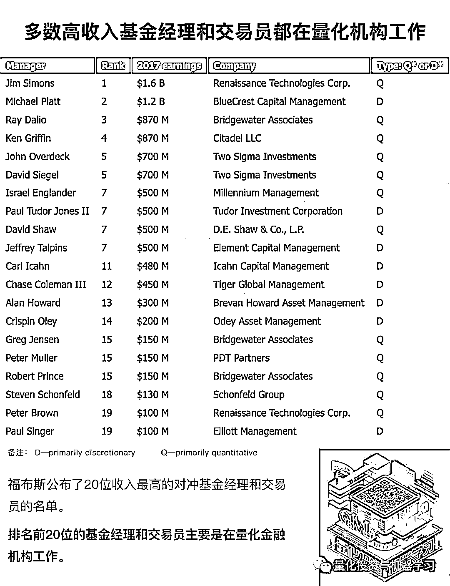

大家可以在**留言处**写下你对本次访谈的感想。

**公众号的话****再次感谢小伙伴们的辛勤付出，是你们日以继夜的工作，才有了这篇精彩的解读。**公众号作为全网量化自媒体的佼佼者，我们一直在努力推动国内量化生态圈的发展，**希望把新颖的思想、独家的观点、前沿的策略第一时间分享给大家！********也很感谢 10W+读者这么对年来对我们的支持与鼓励。做任何事都有起起伏伏，都有辛酸泪水。但一定要记住：**不忘初心、坚持对的东西！******谢谢大家的关注！**

****附此次访谈视频（无字幕）****

 **[`v.qq.com/iframe/preview.html?width=500&height=375&auto=0&vid=a0854qcutqs`](https://v.qq.com/iframe/preview.html?width=500&height=375&auto=0&vid=a0854qcutqs)** 

***—End—***

****