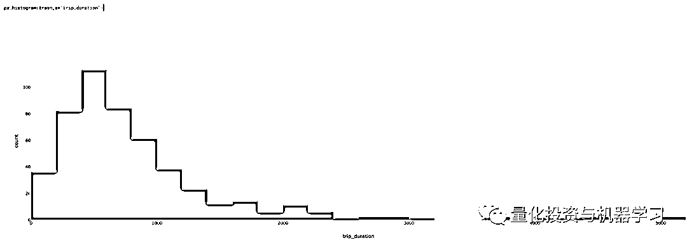

# 特征工程：Kaggle 刷榜必备技巧（附代码）！！！

> 原文：[`mp.weixin.qq.com/s?__biz=MzAxNTc0Mjg0Mg==&mid=2653293286&idx=1&sn=b14e84646e77c28f6f39c2bcb3bca7da&chksm=802dc8f3b75a41e58c10d8dd2e2782557508caae1db7b81b4108492b02c149cf9d76747506e3&scene=27#wechat_redirect`](http://mp.weixin.qq.com/s?__biz=MzAxNTc0Mjg0Mg==&mid=2653293286&idx=1&sn=b14e84646e77c28f6f39c2bcb3bca7da&chksm=802dc8f3b75a41e58c10d8dd2e2782557508caae1db7b81b4108492b02c149cf9d76747506e3&scene=27#wechat_redirect)

**标星★公众号     **爱你们♥

作者：Rahul Agarwal   

编译：方的馒头

**近期原创文章：**

## ♥ [5 种机器学习算法在预测股价的应用（代码+数据）](https://mp.weixin.qq.com/s?__biz=MzAxNTc0Mjg0Mg==&mid=2653290588&idx=1&sn=1d0409ad212ea8627e5d5cedf61953ac&chksm=802dc249b75a4b5fa245433320a4cc9da1a2cceb22df6fb1a28e5b94ff038319ae4e7ec6941f&token=1298662931&lang=zh_CN&scene=21#wechat_redirect)

## ♥ [Two Sigma 用新闻来预测股价走势，带你吊打 Kaggle](https://mp.weixin.qq.com/s?__biz=MzAxNTc0Mjg0Mg==&mid=2653290456&idx=1&sn=b8d2d8febc599742e43ea48e3c249323&chksm=802e3dcdb759b4db9279c689202101b6b154fb118a1c1be12b52e522e1a1d7944858dbd6637e&token=1330520237&lang=zh_CN&scene=21#wechat_redirect)

## ♥ 2 万字干货：[利用深度学习最新前沿预测股价走势](https://mp.weixin.qq.com/s?__biz=MzAxNTc0Mjg0Mg==&mid=2653290080&idx=1&sn=06c50cefe78a7b24c64c4fdb9739c7f3&chksm=802e3c75b759b563c01495d16a638a56ac7305fc324ee4917fd76c648f670b7f7276826bdaa8&token=770078636&lang=zh_CN&scene=21#wechat_redirect)

## ♥ [机器学习在量化金融领域的误用！](http://mp.weixin.qq.com/s?__biz=MzAxNTc0Mjg0Mg==&mid=2653292984&idx=1&sn=3e7efe9fe9452c4a5492d2175b4159ef&chksm=802dcbadb75a42bbdce895c49070c3f552dc8c983afce5eeac5d7c25974b7753e670a0162c89&scene=21#wechat_redirect)

## ♥ [基于 RNN 和 LSTM 的股市预测方法](https://mp.weixin.qq.com/s?__biz=MzAxNTc0Mjg0Mg==&mid=2653290481&idx=1&sn=f7360ea8554cc4f86fcc71315176b093&chksm=802e3de4b759b4f2235a0aeabb6e76b3e101ff09b9a2aa6fa67e6e824fc4274f68f4ae51af95&token=1865137106&lang=zh_CN&scene=21#wechat_redirect)

## ♥ [如何鉴别那些用深度学习预测股价的花哨模型？](https://mp.weixin.qq.com/s?__biz=MzAxNTc0Mjg0Mg==&mid=2653290132&idx=1&sn=cbf1e2a4526e6e9305a6110c17063f46&chksm=802e3c81b759b597d3dd94b8008e150c90087567904a29c0c4b58d7be220a9ece2008956d5db&token=1266110554&lang=zh_CN&scene=21#wechat_redirect)

## ♥ [优化强化学习 Q-learning 算法进行股市](https://mp.weixin.qq.com/s?__biz=MzAxNTc0Mjg0Mg==&mid=2653290286&idx=1&sn=882d39a18018733b93c8c8eac385b515&chksm=802e3d3bb759b42d1fc849f96bf02ae87edf2eab01b0beecd9340112c7fb06b95cb2246d2429&token=1330520237&lang=zh_CN&scene=21#wechat_redirect)

## ♥ [WorldQuant 101 Alpha、国泰君安 191 Alpha](https://mp.weixin.qq.com/s?__biz=MzAxNTc0Mjg0Mg==&mid=2653290927&idx=1&sn=ecca60811da74967f33a00329a1fe66a&chksm=802dc3bab75a4aac2bb4ccff7010063cc08ef51d0bf3d2f71621cdd6adece11f28133a242a15&token=48775331&lang=zh_CN&scene=21#wechat_redirect)

## ♥ [基于回声状态网络预测股票价格（附代码）](https://mp.weixin.qq.com/s?__biz=MzAxNTc0Mjg0Mg==&mid=2653291171&idx=1&sn=485a35e564b45046ff5a07c42bba1743&chksm=802dc0b6b75a49a07e5b91c512c8575104f777b39d0e1d71cf11881502209dc399fd6f641fb1&token=48775331&lang=zh_CN&scene=21#wechat_redirect)

## ♥ [计量经济学应用投资失败的 7 个原因](https://mp.weixin.qq.com/s?__biz=MzAxNTc0Mjg0Mg==&mid=2653292186&idx=1&sn=87501434ae16f29afffec19a6884ee8d&chksm=802dc48fb75a4d99e0172bf484cdbf6aee86e36a95037847fd9f070cbe7144b4617c2d1b0644&token=48775331&lang=zh_CN&scene=21#wechat_redirect)

## ♥ [配对交易千千万，强化学习最 NB！（文档+代码）](http://mp.weixin.qq.com/s?__biz=MzAxNTc0Mjg0Mg==&mid=2653292915&idx=1&sn=13f4ddebcd209b082697a75544852608&chksm=802dcb66b75a4270ceb19fac90eb2a70dc05f5b6daa295a7d31401aaa8697bbb53f5ff7c05af&scene=21#wechat_redirect)

## ♥ [关于高盛在 Github 开源背后的真相！](https://mp.weixin.qq.com/s?__biz=MzAxNTc0Mjg0Mg==&mid=2653291594&idx=1&sn=7703403c5c537061994396e7e49e7ce5&chksm=802dc65fb75a4f49019cec951ac25d30ec7783738e9640ec108be95335597361c427258f5d5f&token=48775331&lang=zh_CN&scene=21#wechat_redirect)

## ♥ [新一代量化带货王诞生！Oh My God！](https://mp.weixin.qq.com/s?__biz=MzAxNTc0Mjg0Mg==&mid=2653291789&idx=1&sn=e31778d1b9372bc7aa6e57b82a69ec6e&chksm=802dc718b75a4e0ea4c022e70ea53f51c48d102ebf7e54993261619c36f24f3f9a5b63437e9e&token=48775331&lang=zh_CN&scene=21#wechat_redirect)

## ♥ [独家！关于定量/交易求职分享（附真实试题）](https://mp.weixin.qq.com/s?__biz=MzAxNTc0Mjg0Mg==&mid=2653291844&idx=1&sn=3fd8b57d32a0ebd43b17fa68ae954471&chksm=802dc751b75a4e4755fcbb0aa228355cebbbb6d34b292aa25b4f3fbd51013fcf7b17b91ddb71&token=48775331&lang=zh_CN&scene=21#wechat_redirect)

## ♥ [Quant 们的身份危机！](https://mp.weixin.qq.com/s?__biz=MzAxNTc0Mjg0Mg==&mid=2653291856&idx=1&sn=729b657ede2cb50c96e92193ab16102d&chksm=802dc745b75a4e53c5018cc1385214233ec4657a3479cd7193c95aaf65642f5f45fa0e465694&token=48775331&lang=zh_CN&scene=21#wechat_redirect)

## ♥ [拿起 Python，防御特朗普的 Twitter](https://mp.weixin.qq.com/s?__biz=MzAxNTc0Mjg0Mg==&mid=2653291977&idx=1&sn=01f146e9a88bf130ca1b479573e6d158&chksm=802dc7dcb75a4ecadfdbdace877ed948f56b72bc160952fd1e4bcde27260f823c999a65a0d6d&token=48775331&lang=zh_CN&scene=21#wechat_redirect)

## ♥ [AQR 最新研究 | 机器能“学习”金融吗？](http://mp.weixin.qq.com/s?__biz=MzAxNTc0Mjg0Mg==&mid=2653292710&idx=1&sn=e5e852de00159a96d5dcc92f349f5b58&chksm=802dcab3b75a43a5492bc98874684081eb5c5666aff32a36a0cdc144d74de0200cc0d997894f&scene=21#wechat_redirect)

**前言**

好的特征是任何机器学习模式的支柱。

好的特征创建通常需要领域知识、创造力和很多时间。

在今天的推文中，我们将谈谈：

*   各种特征创建方法——自动和手动

*   处理分类特征的不同方法

*   经度和纬度特征

*   一些 kaggle 技巧

*   以及其他一些关于特征创建的想法

总而言之， 这篇帖子是关于我们已经学习并最终经常使用的**有用的特征工程方法和技巧。**

**使用自动特征工程自动创建特征**

你读过有关自动特征工程的内容吗？如果没有，那么你会很高兴的。

自动特征工程是执行自动化功能工程的框架。它擅长将时间和关系数据集转换为机

器学习的特征矩阵。

怎么样？让我们用一个玩具的例子来向你展示自动特征工程的威力。

我们假设我们的数据库中有三个表：顾客、会话和事务。

数据集和关系

这是一个相当好玩的玩具数据集，因为具有基于时间的列以及分类列和数字列。

如果我们要在这些数据上创建特征，我们需要使用 Pandas 进行大量的合并和聚合。

自动特征工程让我们很容易。虽然有一些事情，但我们需要在生活变得更容易之前学会。

自动特征工程与实体集一起工作。

你可以将实体集理解为 dataframe 的存储区以及它们之间的关系。

实体集=dataframe 和关系的存储

所以，话不多说，让我们创建一个空的实体集。我刚把这个名字命名为顾客。你可以在此处使用任何名称。现在它只是一个空桶。

让我们将数据帧添加到其中。添加 dataframe 的顺序并不重要。要将数据帧添加到现有的实体集中，我们执行以下操作。

因此，我们在这里做了一些将数据帧添加到空的实体集存储桶的事情。

1、提供 entity_id：这只是一个名字。把它当成 customers。

2、dataframe：命名为 customers_df

3、index：此参数将表中的主键作为输入

4、time_index：时间索引定义为第一次可以使用行中的任何信息。对于顾客来说，这是加入日期。对于事务来说，它将是处理时间。

5、variable_types：用于指定是否必须以不同方式处理特定变量。在我们的 Dataframe，我们有 zip_code 变量，并且我们希望以不同的方式对待它，所以我们使用这个变量。这些是我们可以使用不同变量的类型：

这是我们的实体集存储桶目前的样子。它只包含一个 dataframe 在里面。并且没有关系。

让我们添加我们所有的 dataframe：

这是我们的实体集存储桶现在的样子。

所有三个 dataframe 没有关系。在关系方面，我的意思是我的存储桶不知道 customers_df 和 session_df 中的 customers_id 是相同的列。

我们可以向我们的实体集提供以下信息：

在这之后我们的实体集长这样：

我们可以看到数据集以及关系。我们在这里的大部分工作都已完成。我们准备烹饪特征。

烹饪和特征工程没有什么不同，把特征当成配料

像这个例子这样创建特征：

并且我们在 73 条新特征处结束。你可以从 feature_defs 中看到特征姓名。部分特征结束时我们创建成这样：

你可以获得诸如标准金额的总和（SUM（sessions.STD(transactions.amount））或者数量总和的标准（STD（sessions.SUM（transactions.amount））的特征。这就是函数调用中 max_depth 参数的含义。在这里，我们将其指定为 2 以获得两级聚合。

如果我们将 max_depth 更改为 3，我们可以获得如下功能：

MAX（sessions.NUM_UNIQUE（transactions.YEAR（transaction_time）））

想想如果你不得不编写代码来获得这些特征，你需要花费多少时间。另外，需要注意的是，增加 max_depth 可能需要更长的时间。

**处理分类特征：****标签/二进制/哈希散列和目标/平均编码**

创建自动化特征有其好处。但是，如果一个简单的 library 能够完成我们所有的工作，为什么我们数据科学家还会被需要呢？

这就是我们将讨论处理分类特征的部分。

我们可以使用一个热编码来编码我们的分类特征。所以如果我们在一个类别中有 n 个级别，我们将获得 n-1 个特征。

在我们的 session_df 表中，我们有一个名为 device 的列，它包含三个级别——桌面、移动设备或平板电脑。我们可以使用以下方法从这样的列中获取两列：

这是在谈论分类特征时想到的最自然的事情，并且在许多情况下效果很好。

**▍序数编码**

有时会有一个与类别相关联的订单，在这种情况下，通常在 pandas 中使用一个简单的映射/应用函数来创建一个新的序数列。

例如，如果有一个包含三个级别温度的数据帧：高中低，我们会将其编码为：

使用这个保留低<中<高的信息

****▍**标签编辑器**

我们也可以使用标签编辑器将变量编码为数字。标签编辑器本质上做的是它看到列中的第一个值并将其转换成 0，下一个值转换成 1，依次类推。**这种方法在树模型中运行得相当好，当我在分类变量中有很多级别时，我会结束使用它。****我们可以用它作为：**

**▍二进制编码器**

二进制编码器是另一种可用于对分类变量进行编码的方法。如果一个列中有多个级别，那么这是一种很好的方法。虽然我们可以使用一个热编码来对使用 1023 列的具有 1024 个级别的列进行编码，但是使用二进制编码，我们可以通过使用 10 列来完成。

让我们说我们的 FIFA 19 球员数据中有一列包含所有俱乐部名称。此列有 652 个唯一值。一个热编码意味着创建 651 列，这意味着大量的内存使用和大量的稀疏列。

如果我们使用二进制编码器，我们将只需要像 29<652<210 这样的 10 列。

我们可以很容易地使用 category_encoders 中的“二进制编码器”对象对这个变量进行二进制编码：

**▍哈希散列编码器**

**可以将哈希散列编码器视为一个黑盒函数，它将字符串转换为 0 到某个预定值之间的数字。**

它与二进制编码器不同，因为在二进制编码中，两个或多个俱乐部参数可能是 1，而在哈希散列中只有一个值是 1。

我们可以像这样使用哈希散列：

一定会有冲突（两个俱乐部有相同的编码。例如，尤文图斯足球俱乐部和巴黎圣日耳曼足球俱乐部具有相同的编码），但有时这种技术效果很好。

**▍目标/平均编码**

**这是我们在 Kaggle 比赛中发现的一项很有效的技术。如果训练/测试都来自于同一时间段（横截面）的同一个数据集，我们就可以巧妙地使用特征。**

例如：在泰坦尼克知识挑战中，测试数据是从训练数据中随机抽样的。在这种情况下，我们可以使用不同分类变量的平均目标变量作为特征。

在泰坦尼克中，我们可以在乘客舱变量上创建目标编码特征。

在使用目标编码时，我们必须小心，因为它可能会导致我们的模型过度使用。因此，当我们使用它时，我们使用 k 折交叉验证目标编码。

然后我们可以创建一个平均编码特征像这样：

你可以看到 3 等舱乘客是如何基于平均值的交叉验证编码为 0.261538 和 0.230570。

此特征非常有用，因为它会对类别的目标值进行编码。仅仅看一下这个特征，我们可以说，与 3 等舱乘客相比，1 等舱乘客的生存倾向更高。

**一些 Kaggle 技巧**

虽然不一定是特征创建技术，但你可能会发现一些有用的后处理技术。

**▍对数损失剪裁技术**

我在杰里米·霍华德的神经网络课程中学到的东西。它是基于一个基本的想法。

如果我们非常自信和错误的话，对数损失会给我们带来很大损失。

因此，在分类问题中，我们必须预测 kaggle 中的概率，最好将我们的概率限制在 0.05-0.95 之间，这样我们就不太确定我们的预测结果，反过来，得到的惩罚更少。可以通过简单的 np.clip 来完成。

以 gzip 格式提交 Kaggle：

一小段代码可以帮助你节省无数小时的上传时间。请享用。

**使用纬度和经度特征**

本部分将详细介绍如何很好地使用经纬度特征。

对于此任务，我将使用操场比赛的数据：

https://www.kaggle.com/c/nyc-taxi-trip-duration/data

我们在这里写的大部分函数都是受博鲁戈（Beluga）在 Kaggle 上写的一个操作系统内核启发的。

在本次比赛中，我们必须预测旅行的持续时间。我们获得了很多特征，其中上下车的经纬度也在那里。我们创建了以下特征：

**A.两个纬度/经度之间的半正矢距离：**

根据其纬度和经度，半正矢公式确定了一个球面上两点之间的大圆距离。

然后我们可以像这样使用函数：

**B.两个纬度/经度之间的曼哈顿距离**

按直角轴测量两点间距离

然后我们可以像这样使用函数：

**C.两个纬度/经度之间的方位**

一个方位通常表示一个点相对于另一个点的方向。

然后我们可以像这样使用函数：

**D.上下车点间的中心纬度和经度**

这些是我们新创建的列：

**原因一：结构化数据**

**▍自动编码器**  

有时人们也使用自动编码器来创建自动特征。

什么是自动编码器？

编码器是深度学习函数，其近似于从 X 到 X 的映射，即输入=输出。它们首先将输入特征压缩成较低的维表示，然后从该表示中重新构造输出。

我们可以使用这个表示向量作为模型的特征。

**你可以对你的特征进行一些常规操作**

**1、按最大-最小比例缩放：**通常需要线性模型和神经网络的预处理

**3、使用标准差归一化：**通常需要线性模型和神经网络的预处理

**3、基于对数的特征/目标**：使用基于对数的特征或基于对数的目标函数。如果使用一个假定

特征是正态分布的线性模型，则对数转换可以使特征正态。在像收入等倾斜变量发生时，它也很方便。或者在我们的旅行持续时间案例中。以下是无对数转换的旅行持续时间图。

以及使用对数转换：

旅行持续时间的对数转换倾斜越小，对模型越有帮助。

**基于直觉的一些附加特征**

**▍日期时间特征**

可以根据领域知识和直觉创建额外的日期时间特征。例如，基于时间的特征，像“Evening”、“Noon”、“Night”、“Purchases_last_month”、“Purchases_last_week”等，可以适用于特定应用。

****▍**领域特定特征**

假设你有一些购物车数据，并且你想要对旅行类型进行分类。这是沃尔玛招聘中的确切问题：Kaggle 的旅行类型分类。

一些旅行类型的事例：一个顾客可以进行一次小规模的每日晚餐旅行，每周一次的大型杂货店旅行，为即将到来的假期购买礼物的旅行，或者购买衣服的季节性旅行。

为了解决这个问题，你可以考虑创建一个像“Stylish”这样的特征，在这里你可以通过将属于男性时尚、女性时尚和青少年时尚类别的项目数量相加起来创建这个变量。

或者你可以创建一个像“Rare”这样的特征，它是根据我们拥有的数据将某些项目标记为稀有项目，然后计算购物车中这些稀有项目的数量来创建的。

这些特征可能有效或无效。据我观察，它们通常提供很多价值。

我们觉得这就是目标公司“Pregnant Teen model”的制作方式。他们会有一个变量，在这个变量中他们保留了怀孕青少年可以购买的所有物品，并将它们放入分类算法中。

****▍**交互特征**

如果你有特征 A 和 B,可以创建 A*B，A+B，A/B，A-B 等特征。

例如，为了预测一个房子的价格，如果我们有长度和宽度两个特性，一个更好的想法是创建一个区域（长度×宽度）特性。

或者在某些情况下，一个比率可能比单独拥有两个特性更有价值。例如：信用卡利用率比有信用额度和限额使用变量更有价值。

**结论**

**创造力至关重要！****！****！**

这些只是我们用来创建特征的一些方法。

**但是在特征工程方面肯定没有限制，只有你的想象力限制了你。**

在这一点上，我们总是在心里考虑特征工程的同时考虑我将要使用的模型。在随机森林中工作的特征可能在逻辑回归中无法很好的工作。

特征创建是试验和错误的领域。在尝试之前，你将无法知道转换的工作原理或什么编码效果最佳。它总是在时间和效用之间进行权衡。

有时，特征创建过程可能会花费大量时间。在这种情况下，你可能希望将你的 Pandas 功能并行。

*—End—*

量化投资与机器学习微信公众号，是业内垂直于**Quant**、**MFE**、**CST**等专业的主流量化自媒体。公众号拥有来自**公募、私募、券商、银行、海外**等众多圈内**10W+**关注者。每日发布行业前沿研究成果和最新资讯。

