# 重大事件后，股价将何去何从？（附代码）

> 原文：[`mp.weixin.qq.com/s?__biz=MzAxNTc0Mjg0Mg==&mid=2653293217&idx=1&sn=856e9c7bb346165a33f3bf371b3ad859&chksm=802dc8b4b75a41a239315290be9ad0a24c81f2eed201a39b9761e06753fc70bd646c224a948f&scene=27#wechat_redirect`](http://mp.weixin.qq.com/s?__biz=MzAxNTc0Mjg0Mg==&mid=2653293217&idx=1&sn=856e9c7bb346165a33f3bf371b3ad859&chksm=802dc8b4b75a41a239315290be9ad0a24c81f2eed201a39b9761e06753fc70bd646c224a948f&scene=27#wechat_redirect)


**标星★公众号     **爱你们♥

作者：Steven Wang

编译：Remedios | 公众号翻译部

**近期原创文章：**

## ♥ [5 种机器学习算法在预测股价的应用（代码+数据）](https://mp.weixin.qq.com/s?__biz=MzAxNTc0Mjg0Mg==&mid=2653290588&idx=1&sn=1d0409ad212ea8627e5d5cedf61953ac&chksm=802dc249b75a4b5fa245433320a4cc9da1a2cceb22df6fb1a28e5b94ff038319ae4e7ec6941f&token=1298662931&lang=zh_CN&scene=21#wechat_redirect)

## ♥ [Two Sigma 用新闻来预测股价走势，带你吊打 Kaggle](https://mp.weixin.qq.com/s?__biz=MzAxNTc0Mjg0Mg==&mid=2653290456&idx=1&sn=b8d2d8febc599742e43ea48e3c249323&chksm=802e3dcdb759b4db9279c689202101b6b154fb118a1c1be12b52e522e1a1d7944858dbd6637e&token=1330520237&lang=zh_CN&scene=21#wechat_redirect)

## ♥ 2 万字干货：[利用深度学习最新前沿预测股价走势](https://mp.weixin.qq.com/s?__biz=MzAxNTc0Mjg0Mg==&mid=2653290080&idx=1&sn=06c50cefe78a7b24c64c4fdb9739c7f3&chksm=802e3c75b759b563c01495d16a638a56ac7305fc324ee4917fd76c648f670b7f7276826bdaa8&token=770078636&lang=zh_CN&scene=21#wechat_redirect)

## ♥ [机器学习在量化金融领域的误用！](http://mp.weixin.qq.com/s?__biz=MzAxNTc0Mjg0Mg==&mid=2653292984&idx=1&sn=3e7efe9fe9452c4a5492d2175b4159ef&chksm=802dcbadb75a42bbdce895c49070c3f552dc8c983afce5eeac5d7c25974b7753e670a0162c89&scene=21#wechat_redirect)

## ♥ [基于 RNN 和 LSTM 的股市预测方法](https://mp.weixin.qq.com/s?__biz=MzAxNTc0Mjg0Mg==&mid=2653290481&idx=1&sn=f7360ea8554cc4f86fcc71315176b093&chksm=802e3de4b759b4f2235a0aeabb6e76b3e101ff09b9a2aa6fa67e6e824fc4274f68f4ae51af95&token=1865137106&lang=zh_CN&scene=21#wechat_redirect)

## ♥ [如何鉴别那些用深度学习预测股价的花哨模型？](https://mp.weixin.qq.com/s?__biz=MzAxNTc0Mjg0Mg==&mid=2653290132&idx=1&sn=cbf1e2a4526e6e9305a6110c17063f46&chksm=802e3c81b759b597d3dd94b8008e150c90087567904a29c0c4b58d7be220a9ece2008956d5db&token=1266110554&lang=zh_CN&scene=21#wechat_redirect)

## ♥ [优化强化学习 Q-learning 算法进行股市](https://mp.weixin.qq.com/s?__biz=MzAxNTc0Mjg0Mg==&mid=2653290286&idx=1&sn=882d39a18018733b93c8c8eac385b515&chksm=802e3d3bb759b42d1fc849f96bf02ae87edf2eab01b0beecd9340112c7fb06b95cb2246d2429&token=1330520237&lang=zh_CN&scene=21#wechat_redirect)

## ♥ [WorldQuant 101 Alpha、国泰君安 191 Alpha](https://mp.weixin.qq.com/s?__biz=MzAxNTc0Mjg0Mg==&mid=2653290927&idx=1&sn=ecca60811da74967f33a00329a1fe66a&chksm=802dc3bab75a4aac2bb4ccff7010063cc08ef51d0bf3d2f71621cdd6adece11f28133a242a15&token=48775331&lang=zh_CN&scene=21#wechat_redirect)

## ♥ [基于回声状态网络预测股票价格（附代码）](https://mp.weixin.qq.com/s?__biz=MzAxNTc0Mjg0Mg==&mid=2653291171&idx=1&sn=485a35e564b45046ff5a07c42bba1743&chksm=802dc0b6b75a49a07e5b91c512c8575104f777b39d0e1d71cf11881502209dc399fd6f641fb1&token=48775331&lang=zh_CN&scene=21#wechat_redirect)

## ♥ [计量经济学应用投资失败的 7 个原因](https://mp.weixin.qq.com/s?__biz=MzAxNTc0Mjg0Mg==&mid=2653292186&idx=1&sn=87501434ae16f29afffec19a6884ee8d&chksm=802dc48fb75a4d99e0172bf484cdbf6aee86e36a95037847fd9f070cbe7144b4617c2d1b0644&token=48775331&lang=zh_CN&scene=21#wechat_redirect)

## ♥ [配对交易千千万，强化学习最 NB！（文档+代码）](http://mp.weixin.qq.com/s?__biz=MzAxNTc0Mjg0Mg==&mid=2653292915&idx=1&sn=13f4ddebcd209b082697a75544852608&chksm=802dcb66b75a4270ceb19fac90eb2a70dc05f5b6daa295a7d31401aaa8697bbb53f5ff7c05af&scene=21#wechat_redirect)

## ♥ [关于高盛在 Github 开源背后的真相！](https://mp.weixin.qq.com/s?__biz=MzAxNTc0Mjg0Mg==&mid=2653291594&idx=1&sn=7703403c5c537061994396e7e49e7ce5&chksm=802dc65fb75a4f49019cec951ac25d30ec7783738e9640ec108be95335597361c427258f5d5f&token=48775331&lang=zh_CN&scene=21#wechat_redirect)

## ♥ [新一代量化带货王诞生！Oh My God！](https://mp.weixin.qq.com/s?__biz=MzAxNTc0Mjg0Mg==&mid=2653291789&idx=1&sn=e31778d1b9372bc7aa6e57b82a69ec6e&chksm=802dc718b75a4e0ea4c022e70ea53f51c48d102ebf7e54993261619c36f24f3f9a5b63437e9e&token=48775331&lang=zh_CN&scene=21#wechat_redirect)

## ♥ [独家！关于定量/交易求职分享（附真实试题）](https://mp.weixin.qq.com/s?__biz=MzAxNTc0Mjg0Mg==&mid=2653291844&idx=1&sn=3fd8b57d32a0ebd43b17fa68ae954471&chksm=802dc751b75a4e4755fcbb0aa228355cebbbb6d34b292aa25b4f3fbd51013fcf7b17b91ddb71&token=48775331&lang=zh_CN&scene=21#wechat_redirect)

## ♥ [Quant 们的身份危机！](https://mp.weixin.qq.com/s?__biz=MzAxNTc0Mjg0Mg==&mid=2653291856&idx=1&sn=729b657ede2cb50c96e92193ab16102d&chksm=802dc745b75a4e53c5018cc1385214233ec4657a3479cd7193c95aaf65642f5f45fa0e465694&token=48775331&lang=zh_CN&scene=21#wechat_redirect)

## ♥ [拿起 Python，防御特朗普的 Twitter](https://mp.weixin.qq.com/s?__biz=MzAxNTc0Mjg0Mg==&mid=2653291977&idx=1&sn=01f146e9a88bf130ca1b479573e6d158&chksm=802dc7dcb75a4ecadfdbdace877ed948f56b72bc160952fd1e4bcde27260f823c999a65a0d6d&token=48775331&lang=zh_CN&scene=21#wechat_redirect)

## ♥ [AQR 最新研究 | 机器能“学习”金融吗？](http://mp.weixin.qq.com/s?__biz=MzAxNTc0Mjg0Mg==&mid=2653292710&idx=1&sn=e5e852de00159a96d5dcc92f349f5b58&chksm=802dcab3b75a43a5492bc98874684081eb5c5666aff32a36a0cdc144d74de0200cc0d997894f&scene=21#wechat_redirect)

**前言**

美国食品与药品管理局（FDA）批准新药、法律裁决、企业合并、股票回购和 CEO 偶然在播客上露脸，这些都是影响股价的事件的例子。现实生活中发生的重大事件虽然不能被像技术指标一样被量化，但是无疑会对股价产生影响。

为了对事件与股价之间的关系进行更进一步的探索，我们从 IEX API 收集了股票历史数据，并从一些著名金融新闻网站抓取了事件数据。这篇文章将梳理数据的收集和清洗、探索性分析检测价格趋势和重大事件对于股价的影响。

**获取数据**

和在大多数数据分析一样，获取并清洗数据是最花时间的一步，特别是当初始数据不是处于机器可读的格式时。这是这个项目中要用到的许多数据都存在的情况，因此我们提供了一些函数来抓取或收集这些数据。**具体详见代码！**

**获取全部代码，见文末**

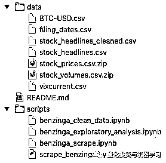

**金融事件**

抓取重大事件数据的函数使用 Beautifulsoup，并从 Benzings（特别是他们强调最近股票涨跌和潜在的影响因素的的 Movers 系列）抓取重大事件的描述。新闻文章的格式、标题和发表时间在过去的一些年里存在改变，所以最终的抓取函数将作考虑到这些变化的多种描述的总结。这些函数可以可靠地抓取回溯到 2015 年十月的事件。抓取到的事件在如下数据表格当中： 

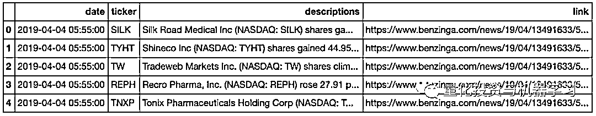

**历史股价**

获取历史股价的函数在很大程度上依靠 Python 模块 pandas-datareader 实现，

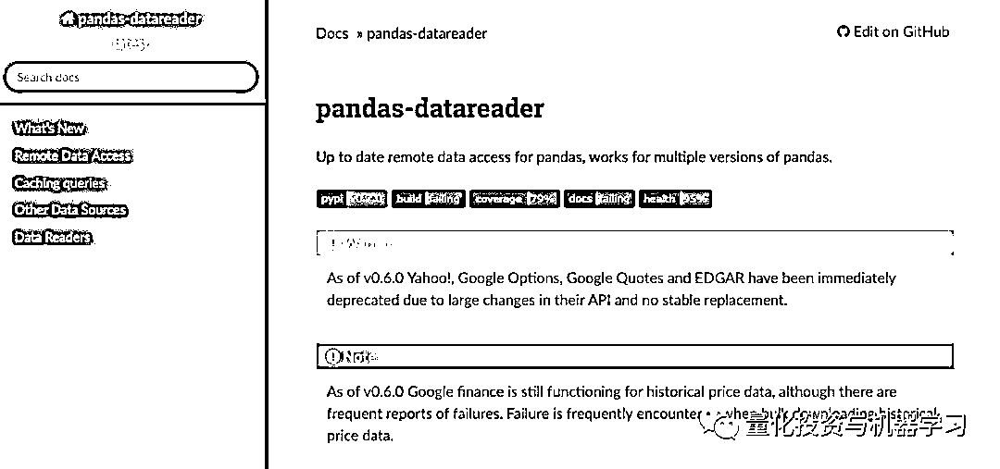

地址：

https://pandas-datareader.readthedocs.io/en/latest/index.html

它使得用户能够从多种金融资源中将金融数据导入 pandas dataframe。我们决定使用 IEX 的数据是因为它返回的数据集有一定格式且方便处理。导入一系列股票代码和一个导出价格的起始日期，函数将返回一个数据集，这个数据集包含一个特定的日期范围内个股每日的收盘价。以下是 Apple 的例子：

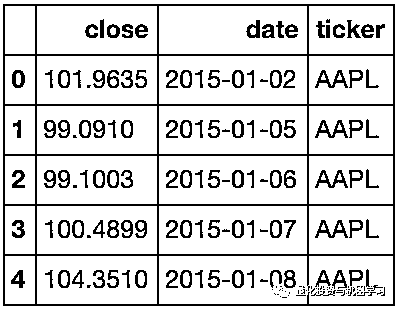

在国内获取美股数据可以在 windquant 上得到：

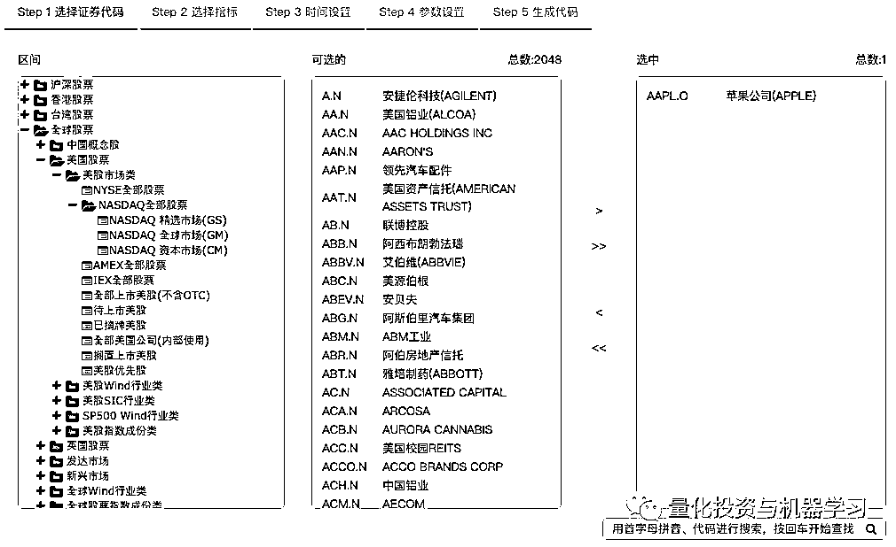

地址：

www.windquant.com

**收集报告日期**

收集报告日期的原因会在之后的探索性分析部分中解释。使用 Beautifulsoup, 我们写了一个函数来抓取 Marketwatch（https://www.marketwatch.com/）上的数据获得年报和季报发布的日期。

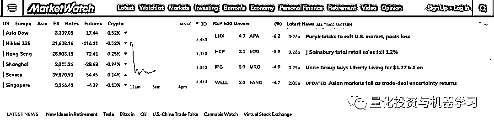

提供一系列股票代码和回测的时间间隔，这个函数会返回一个个股报告日期的数据集。以下是另一个使用 Apple 的例子：

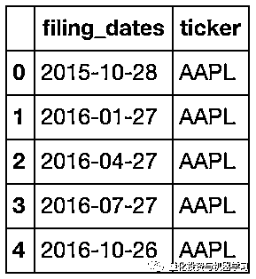

**清洗合并数据**

****▍**将股价与到事件描述结合**

因为我们对重大事件和股价波动之间的关系感兴趣，很明显的接下来的第一步就是要把股价和事件的数据框连结起来，来获得事件发生当日和事件发生前一日的收盘价。获得事件发生当日的收盘价方法比较直接，因为我们只需要结合股票和日期。

为了获得事件发生前一日的收盘价，我们会使用一个 pandas merge 函数的变体，merge_asof，

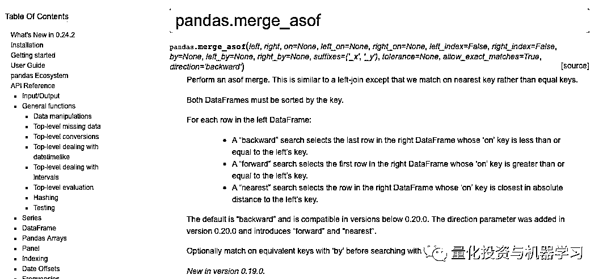

*地址：*

*https://pandas.pydata.org/pandas-docs/stable/reference/api/pandas.merge_asof.html*

这个包将一个最近的键和一个明确的键连结起来。我们想要将收盘价和事件日期的最近一天联系起来：

```py
events = pd.merge_asof(events, prices, by = 'ticker', left_on = 'date', right_on = 'date', direction = 'backward',
 allow_exact_matches = False)

events = events.rename(columns = {'close':'prev_day_close'})
```

 参数解释如下：

1、第一和第二个参数明确了要连结的数据集（在两个数据集中数据都已经过整理）。

2、第三个参数明确了合并表格之前哪一列要对齐（股票）。

3、第四和第五个参数明确了哪些列可以完成与最近一列的连结（日期）。

4、第六个参数明确了朝哪个方向结合股票与事件数据（向后，因为我们想要得到的是前一天的收盘价）。

5、最后一个参数明确了我们是否想要特定的配对（不，因为我们不想与当前日期配对，而是想跟前一天配对）。

我们现在有了一个重大事件与当日收盘价和前一日收盘价结合的数据集。最后，我们可以通过事件发生当日价格和事件发生的前一天的价格计算股价改变的百分比。

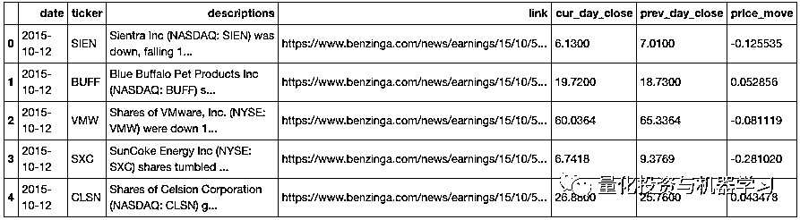

**计算移动平均值**

在之后探索性分析的部分中，我们用移动平均来做一些分析。下一部分的数据准备会展示如何计算这些移动平均值。

尽管以下展示的程序可以计算任何日期范围内的数据，我们将要计算的平均值是 50 和 200 天的移动平均值。  

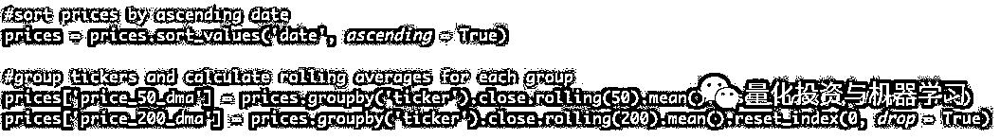

我们首先以日期递增的顺序整理价格数据集。接下来我们使用 pandas groupby 函数来将股票代码分组，因为我们想要对个股分别计算移动平均值。最后，我们使用 pandas rolling 函数来进行滚动计算，在这里计算的是在数据集上的特定窗口的滚动平均。以下是 Apple 的例子，展示了 5 日和 10 日移动平均值。

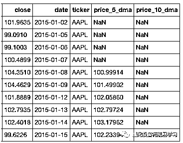

为了结合移动平均值和重大事件的数据集，我们需要做的是将个股与日期结合，来获得每一个重大事件发生日的移动平均值。

****▍**剔除事件发生后少于四周的跟踪股价数据**

在之后的探索性分析部分中，一部分分析包括看事件发生后或价格大幅波动后至少 19 个交易日（20 个交易日或从起始日起四周）的价格表现。因此，我们需要能够去掉我们的事件数据集中跟踪价格数据少于 19 个交易日的数据。

为了达到这个目的，我们在个股的价格数据的基础上找到了最大日期，并检验了对应的时间间隔是否少于 19 个交易日。

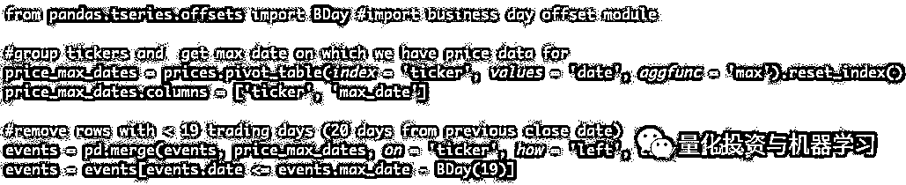

我们从 pandas 导入 BDay 以帮助我们过滤出交易日，并使用 pivot_table 来将每个股票日期成组，我们以前用 groupby 函数来组成组，这是处理数据的另一个方法。我们之后将会把这些最晚日期融入到事件集中，并从这些数据中剔除事件发生日与股票最晚日期间隔少于 19 个工作日的条目。

****▍**剔除报告发布前四周内的事件数据**

除了排除与少于四周的跟踪价格数据关联的事件之外，对于以下分析的某些部分我还要排除发生在公司的报告日期前四周之内的事件数据。因为报告的收益可能导致大幅度的价格变化。为了达到这个目的，我们将再一次使用 merge_asof，这一次是为了找出事件发生后最近的报告日期。

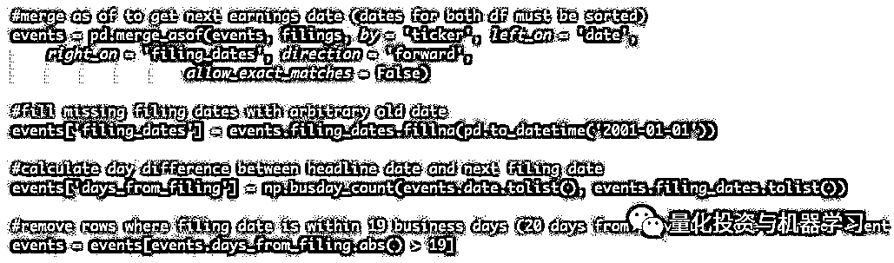

我们用获得前一日收盘价的同样方法来设置 merge_asof 函数，不过注意现在方向参数要设置为向前，因为我们想要得到的是接下来的报告日期。由于 Marketwatch 并没有所有股票的报告数据，我们用一个随机的过去的日期来补上遗漏的报告日期。最后我们计算事件发生日和下一个报告日期之间相差多少个工作日，并剔除相差少于 19 个工作日的那些条目。事实是我们实际上对报告日期缺失的股票假设与之关联的事件都不发生在要被剔除的期限内，显然这不是理想的，但这是我们目前必须对这种情况做出的假设。

总而言之，我们结合处理并清理之后的数据集现在包括以下字段：**事件日期，股票代码，事件描述，股价，前一日的股价，股价变动的百分比和股价的移动平均值**。除此之外，我们也展示了如何剔除事件发生后后续股价数据少于四周和事件发生在报告日期前四周内的条目。

**探索分析**

我们事件和股价的数据集跨越 2015 年 10 月 12 日到 2019 年 5 月 2 日的日期范围，让我们来更进一步地深入探索：

**▍初始股价波动后的一般表现**

使用清洗过的事件数据集和历史价格，我们可以观察不同初始股价变动幅度的股价表现。下图展示了一个事件发生 20 天之后的依据 0-1 的股价变化分组的股票的价格。

**获取全部代码，查看文末**

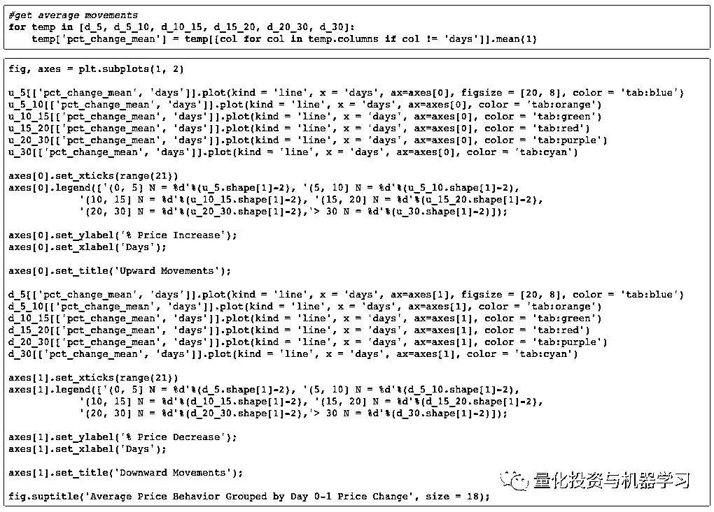

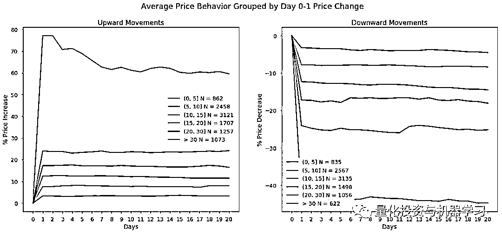

**在初始的价格突然上升或下降之后，在事件发生后的二十天内大多数组趋向于保持他们的新价格水平。**例外是价格升高了 30%以上的股票组，他们的平均价格在事件发生后的 20 天中下滑。一个可能的合理解释是这个组中股票的价格在事件发生后一开始剧烈升高，例如，升高的幅度大于 50%，这些股票在接下来的日子里更可能回吐一部分的涨幅。下面的图展示了价格升高了 30%~50%和大于 50%的初始股票涨幅，为这个理论提供了一些论据：

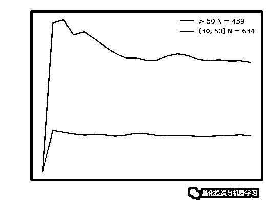

第一天后价格增幅在 30%~50%的股票的价格表现相对平缓，但是价格增幅在 50%以上的股票组展现了我们在前一图中观察到的下降表现。

** 金叉**

有一个大家技术指标叫做金叉。黄金交叉出现在一个短期移动平均值与一个长期移动平均值交叉时，提供了一个潜在持续的股价上升信号。使用我们之前计算的移动平均，**我们可以将黄金交叉作为价格稳步上升的指标来检验对股价产生影响的事件进行探索****。如果金叉有效，我们可以期望股票进入金叉之后继续上升或保持他们的价格水平并且价格完全不下降。**一个常见的移动平均金叉组合是 50 日移动平均与 200 日移动平均相交。经过初始价格变化分组之后，以下表格展示了事件发生后 20 天内的股票 50-200 日金叉成功和不成功的表现：

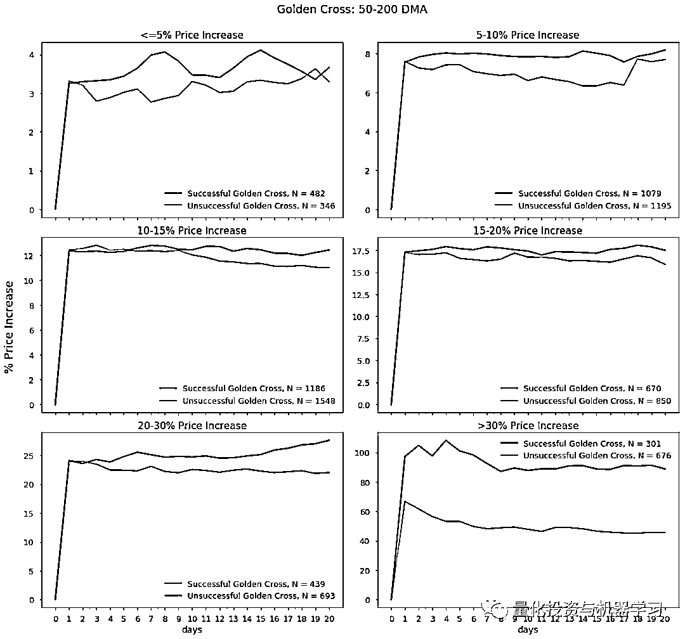

**正如上面可以看到的，期望的金叉表现在某种程度上是正确的。**对于大部分的价格变动组来说，特别是除了股价上升幅度小于等于 5%的组之外的每个组，股价成功的进入了金叉的股票在接下来的二十天里比一般情况表现得更好。尽管在股价大于 30%的组中，股价形成成功的金叉和不成功的金叉的股票价格都下降了，成功进入金叉的组在这 20 天里价格下降得更少一些。

然而，没有进入金叉的股票价格并不总向初始状态改变。没有形成成功的金叉的股价上升 15%~20%和 20%~30%的股票组，尽管股票情况比成功进入金叉的股票更差，但这些股票也能保持他们价格升高后的新价格水平。

看起来一个金叉给一个股票在价格上升后还是否会保持向上动量提供了指示。更进一步的、关于其他金叉的测试可能带来不同的结果。此外，更多的观察结果可能使曲线趋于平缓，并带来更多的期待的金叉表现。

**分类事件**

回想一下事件数据集中包含的导致价格变动的事件描述。通过常见的表达从语法上分析这些描述的内容，我们可以将事件分成若干类别。举个例子，下面的常见的表达被用于将事件分入法律，区块链和股份回购、股利宣告：

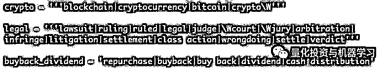

我们总共创建了 12 个事件分类，每个都有大量的事实证据，或者我们认为是有趣的：

**1、高管变动：高管（CEO、COO 等）的变化**

**2、药物批准/试用公告**

**3、加密货币/供应链**

**4、法律：任何法律裁决，诉讼案件，或其他法律实践**

**5、亚马逊对其他公司的影响，如 Wholefoods 收购百货商店**

**6、收益**

**7、分析师评级变化**

**8、合并或收购公告**

**9、回购或股利公告**

**10、交易/协议：交易的信号，合作关系，合同等**

**11、投资资助：公司对其他公司投资**

**12、除了 IPO 以外的股票发售**

下图展示了一个事件发生后 20 天内每个事件分类股票上涨和下跌的平均价格表现：

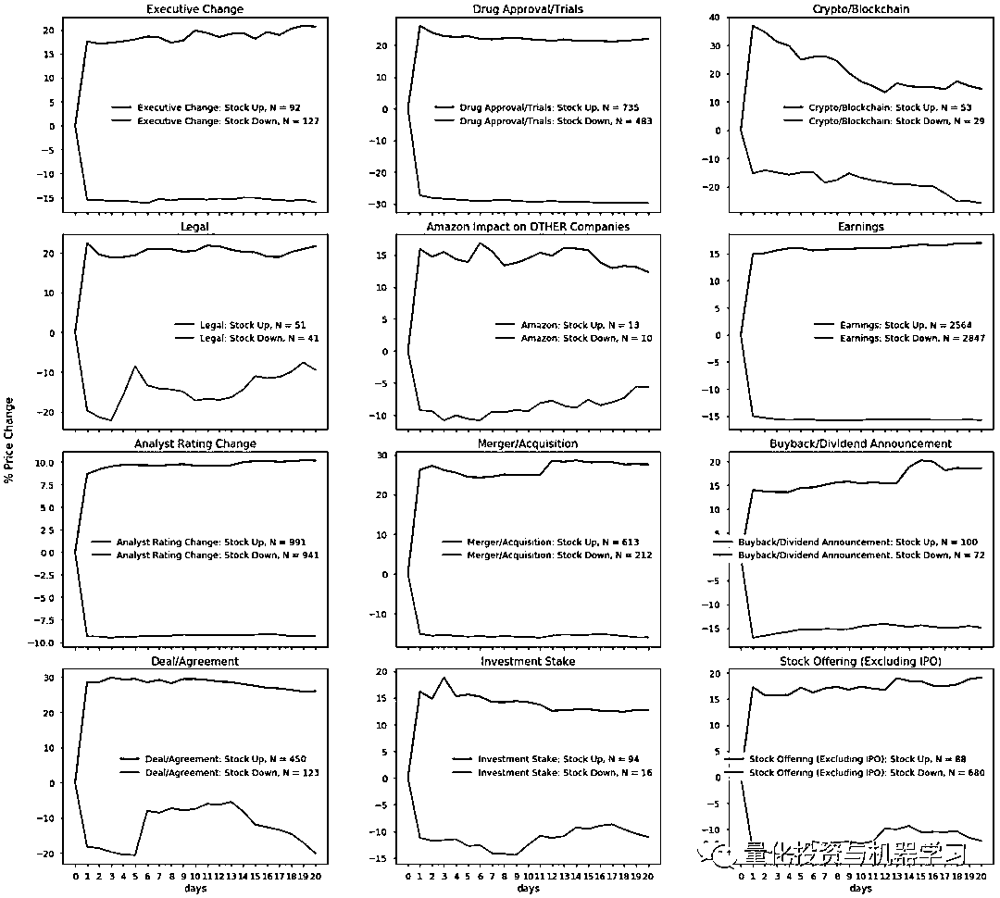

因为大多数分类的时间对于受影响的公司会产生重大冲击，所以看到在接下去的 20 天中这些公司的股价创新高或新低并不值得惊讶。**举个例子，一次不成功的临床试验会对一个公司产生负面的金融影响，因为这次失败意味着资源浪费和未来收益的损失。****作为结果，我们应该预判公司的股价不仅仅会下降，而且将保持一个低的股价。****这个预判表现可以在上表中的药物批准/试用分类中看到。****并且同样的情况也会出啊现在大量其他事件分类当中。**  

三个与这种情况有所不同的事件分类分别是加密程序、法律和亚马逊对其他公司的影响。**对于加密货币，不管相关事件引导价格上升还是下降，价格都倾向于下滑。****对于法律，随着价格恢复一些，积极事件的影响缓缓施力，负面事件造成的向下的压力随着时间减少。****这三个分类拥有的案例规模较小，所以这些趋势可能会被干扰**。

**Crypto Rally 和 Bust**

随着加密货币的价格呈指数级增长，很多公司寻求方法利用市场热度。一些公司开始供应链投机，比如 overstock.com 投资了一个基于供应链技术建立的股票交易平台：

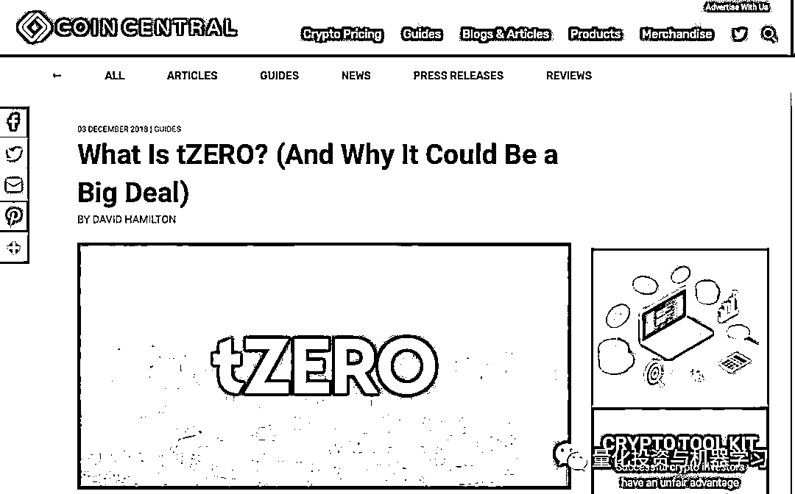

*地址：*

*https://coincentral.com/what-is-tzero-and-why-it-could-be-a-big-deal/*

除此之外，如 Long Island Iced Tea Corp. 仅仅通过将它自己重新命名为 LongBlockchain Corp 。

地址： 

https://en.wikipedia.org/wiki/Long_Blockchain_Corp

正如下图中所展示的，与加密货币或供应链相关的价格波动事件出现的频率与比特币的价格密切相关。

 **获取全部代码，查看文末**

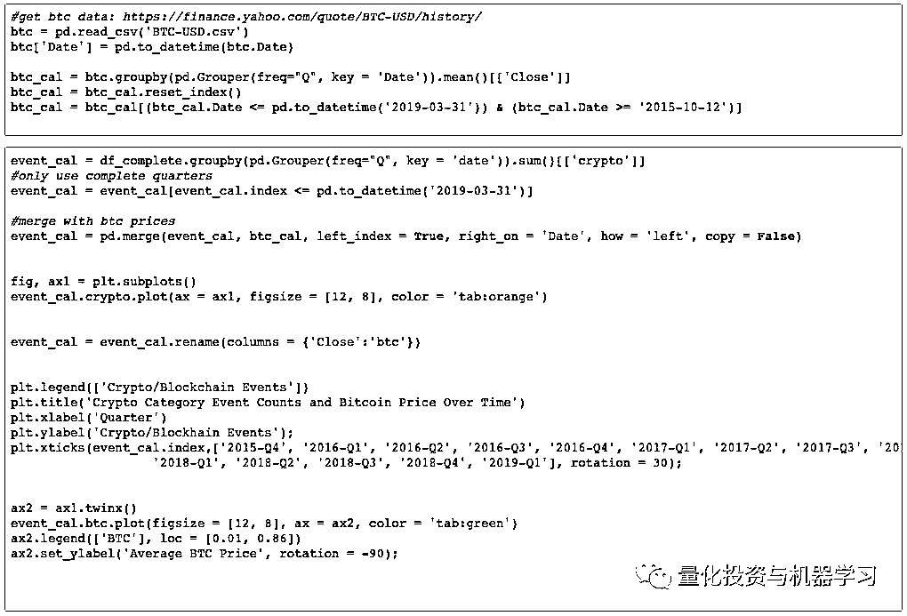

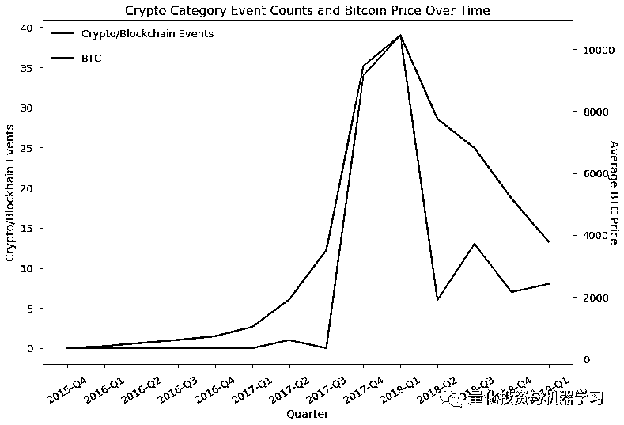

比特币泡沫的高峰——2017 年 4 季度和 2018 年 1 季度正是大多数与加密相关的引起股价波动的事件发生的时候。加密相关事件数量的上升和下降也反映了比特币价格的的上升和下降。基于这些观察，我们可以期待在下一次加密程序复苏（特别是更多公司开始在他们的业务中合并供应链技术时，哪怕仅仅是换了一个名字）时，看到加密程序驱动的价格有小幅增加。

**  波动性**

探究我们的事件数据的另一方面看价格波动的幅度随着时间的改变变化的多少。换句话说，在观察的时间段内我们事件数据中的价格是如何波动的。价格的变化幅度是越来越大还是越来越小了？他们对比市场波动的通常情况如何？

下面的图在左边的轴上展示了我们的事件数据中的平均绝对百分比价格变化。右边的轴展示了 VIX（http://www.cboe.com/vix）（衡量美国股市波动率的指数）的平均价格。

**获取全部代码，查看文末**

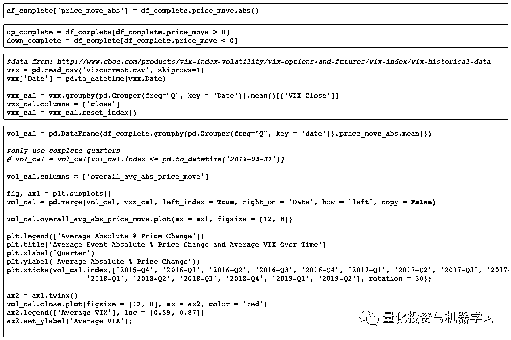

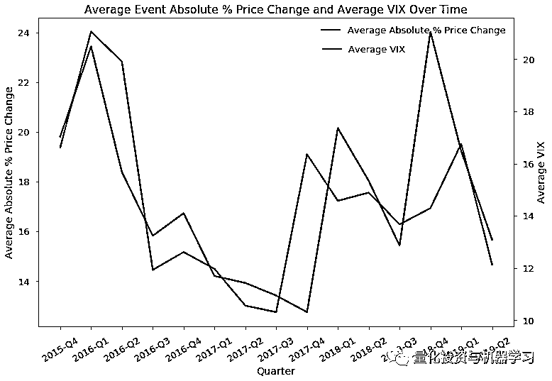

尽管不是准确的匹配，平均价格变化在我们抓取的事件数据集中随着 VIX 的移动和图形紧密变化。随着 VIX 从 2015 年四季度到 2017 年三季度的价格下降，平均价格也相似地改变了。并且随着 VIX 恢复并从 2017 年四季度开始制造出了小小的 M 形状，平均价格变化也发生了类似的变化。

尽管非常接近，两个形状出于某些原因并不完全吻合。第一个原因是抓取的数据是基于公司 Benzinga 在它的 Movers 系列中着重提到的股票，而 VIX 是基于一个更固定的股票组合，标普 500。第二个原因是 VIX 的股票池包含相对大规模的公司，而 Benzinga 包括各种各样大小的公司，包括可能波动幅度更大的小市值股票。最后，上图中使用的波动率的定义并不是完全相同的，**在重大事件中，数据波动率粗略地被定义为绝对平均价值变化，而 VIX 使用标普 500 多空期权的报价来计算波动率。**

尽管存在这些不同，从波动率的角度上来看似乎我们抓取的事件数据中的股票中的大多数表现得与更广泛的股票市场相似。

这篇文章提供了对于如何抓取、清洗并对相对混乱不同的数据集进行一些分析的概览。毫无疑问，从这个数据上还能获得很多其他信息。我们能想到的内容就包括**情感分析，其他技术指标，和市值的影响等等**。随着额外数据的增加，看观察到的趋势如何变化也应该会是非常有趣的。

**希望本文对你在研究过程中有思路上的帮助！**

**获取全部代码**

在**后台**输入（严格大小写）

***重大事件 LhtzJQXX***

*—End—*

量化投资与机器学习微信公众号，是业内垂直于**Quant**、**MFE**、**CST**等专业的主流量化自媒体。公众号拥有来自**公募、私募、券商、银行、海外**等众多圈内**10W+**关注者。每日发布行业前沿研究成果和最新资讯。

