# 微博对大 A 股的预测能力到底怎样？（附 Python 代码）

> 原文：[`mp.weixin.qq.com/s?__biz=MzAxNTc0Mjg0Mg==&mid=2653293185&idx=1&sn=0e4d478d23318b9a81465d30434b64c7&chksm=802dc894b75a418287dcbd7196c280aff8161c60e48d623d5d72718eb71432fb7eca8547bca1&scene=27#wechat_redirect`](http://mp.weixin.qq.com/s?__biz=MzAxNTc0Mjg0Mg==&mid=2653293185&idx=1&sn=0e4d478d23318b9a81465d30434b64c7&chksm=802dc894b75a418287dcbd7196c280aff8161c60e48d623d5d72718eb71432fb7eca8547bca1&scene=27#wechat_redirect)

**标星★公众号     **爱你们♥

# 作者：Fan Zhang

编译：Eva | 公众号翻译部

**近期原创文章：**

## ♥ [5 种机器学习算法在预测股价的应用（代码+数据）](https://mp.weixin.qq.com/s?__biz=MzAxNTc0Mjg0Mg==&mid=2653290588&idx=1&sn=1d0409ad212ea8627e5d5cedf61953ac&chksm=802dc249b75a4b5fa245433320a4cc9da1a2cceb22df6fb1a28e5b94ff038319ae4e7ec6941f&token=1298662931&lang=zh_CN&scene=21#wechat_redirect)

## ♥ [Two Sigma 用新闻来预测股价走势，带你吊打 Kaggle](https://mp.weixin.qq.com/s?__biz=MzAxNTc0Mjg0Mg==&mid=2653290456&idx=1&sn=b8d2d8febc599742e43ea48e3c249323&chksm=802e3dcdb759b4db9279c689202101b6b154fb118a1c1be12b52e522e1a1d7944858dbd6637e&token=1330520237&lang=zh_CN&scene=21#wechat_redirect)

## ♥ 2 万字干货：[利用深度学习最新前沿预测股价走势](https://mp.weixin.qq.com/s?__biz=MzAxNTc0Mjg0Mg==&mid=2653290080&idx=1&sn=06c50cefe78a7b24c64c4fdb9739c7f3&chksm=802e3c75b759b563c01495d16a638a56ac7305fc324ee4917fd76c648f670b7f7276826bdaa8&token=770078636&lang=zh_CN&scene=21#wechat_redirect)

## ♥ [机器学习在量化金融领域的误用！](http://mp.weixin.qq.com/s?__biz=MzAxNTc0Mjg0Mg==&mid=2653292984&idx=1&sn=3e7efe9fe9452c4a5492d2175b4159ef&chksm=802dcbadb75a42bbdce895c49070c3f552dc8c983afce5eeac5d7c25974b7753e670a0162c89&scene=21#wechat_redirect)

## ♥ [基于 RNN 和 LSTM 的股市预测方法](https://mp.weixin.qq.com/s?__biz=MzAxNTc0Mjg0Mg==&mid=2653290481&idx=1&sn=f7360ea8554cc4f86fcc71315176b093&chksm=802e3de4b759b4f2235a0aeabb6e76b3e101ff09b9a2aa6fa67e6e824fc4274f68f4ae51af95&token=1865137106&lang=zh_CN&scene=21#wechat_redirect)

## ♥ [如何鉴别那些用深度学习预测股价的花哨模型？](https://mp.weixin.qq.com/s?__biz=MzAxNTc0Mjg0Mg==&mid=2653290132&idx=1&sn=cbf1e2a4526e6e9305a6110c17063f46&chksm=802e3c81b759b597d3dd94b8008e150c90087567904a29c0c4b58d7be220a9ece2008956d5db&token=1266110554&lang=zh_CN&scene=21#wechat_redirect)

## ♥ [优化强化学习 Q-learning 算法进行股市](https://mp.weixin.qq.com/s?__biz=MzAxNTc0Mjg0Mg==&mid=2653290286&idx=1&sn=882d39a18018733b93c8c8eac385b515&chksm=802e3d3bb759b42d1fc849f96bf02ae87edf2eab01b0beecd9340112c7fb06b95cb2246d2429&token=1330520237&lang=zh_CN&scene=21#wechat_redirect)

## ♥ [WorldQuant 101 Alpha、国泰君安 191 Alpha](https://mp.weixin.qq.com/s?__biz=MzAxNTc0Mjg0Mg==&mid=2653290927&idx=1&sn=ecca60811da74967f33a00329a1fe66a&chksm=802dc3bab75a4aac2bb4ccff7010063cc08ef51d0bf3d2f71621cdd6adece11f28133a242a15&token=48775331&lang=zh_CN&scene=21#wechat_redirect)

## ♥ [基于回声状态网络预测股票价格（附代码）](https://mp.weixin.qq.com/s?__biz=MzAxNTc0Mjg0Mg==&mid=2653291171&idx=1&sn=485a35e564b45046ff5a07c42bba1743&chksm=802dc0b6b75a49a07e5b91c512c8575104f777b39d0e1d71cf11881502209dc399fd6f641fb1&token=48775331&lang=zh_CN&scene=21#wechat_redirect)

## ♥ [计量经济学应用投资失败的 7 个原因](https://mp.weixin.qq.com/s?__biz=MzAxNTc0Mjg0Mg==&mid=2653292186&idx=1&sn=87501434ae16f29afffec19a6884ee8d&chksm=802dc48fb75a4d99e0172bf484cdbf6aee86e36a95037847fd9f070cbe7144b4617c2d1b0644&token=48775331&lang=zh_CN&scene=21#wechat_redirect)

## ♥ [配对交易千千万，强化学习最 NB！（文档+代码）](http://mp.weixin.qq.com/s?__biz=MzAxNTc0Mjg0Mg==&mid=2653292915&idx=1&sn=13f4ddebcd209b082697a75544852608&chksm=802dcb66b75a4270ceb19fac90eb2a70dc05f5b6daa295a7d31401aaa8697bbb53f5ff7c05af&scene=21#wechat_redirect)

## ♥ [关于高盛在 Github 开源背后的真相！](https://mp.weixin.qq.com/s?__biz=MzAxNTc0Mjg0Mg==&mid=2653291594&idx=1&sn=7703403c5c537061994396e7e49e7ce5&chksm=802dc65fb75a4f49019cec951ac25d30ec7783738e9640ec108be95335597361c427258f5d5f&token=48775331&lang=zh_CN&scene=21#wechat_redirect)

## ♥ [新一代量化带货王诞生！Oh My God！](https://mp.weixin.qq.com/s?__biz=MzAxNTc0Mjg0Mg==&mid=2653291789&idx=1&sn=e31778d1b9372bc7aa6e57b82a69ec6e&chksm=802dc718b75a4e0ea4c022e70ea53f51c48d102ebf7e54993261619c36f24f3f9a5b63437e9e&token=48775331&lang=zh_CN&scene=21#wechat_redirect)

## ♥ [独家！关于定量/交易求职分享（附真实试题）](https://mp.weixin.qq.com/s?__biz=MzAxNTc0Mjg0Mg==&mid=2653291844&idx=1&sn=3fd8b57d32a0ebd43b17fa68ae954471&chksm=802dc751b75a4e4755fcbb0aa228355cebbbb6d34b292aa25b4f3fbd51013fcf7b17b91ddb71&token=48775331&lang=zh_CN&scene=21#wechat_redirect)

## ♥ [Quant 们的身份危机！](https://mp.weixin.qq.com/s?__biz=MzAxNTc0Mjg0Mg==&mid=2653291856&idx=1&sn=729b657ede2cb50c96e92193ab16102d&chksm=802dc745b75a4e53c5018cc1385214233ec4657a3479cd7193c95aaf65642f5f45fa0e465694&token=48775331&lang=zh_CN&scene=21#wechat_redirect)

## ♥ [拿起 Python，防御特朗普的 Twitter](https://mp.weixin.qq.com/s?__biz=MzAxNTc0Mjg0Mg==&mid=2653291977&idx=1&sn=01f146e9a88bf130ca1b479573e6d158&chksm=802dc7dcb75a4ecadfdbdace877ed948f56b72bc160952fd1e4bcde27260f823c999a65a0d6d&token=48775331&lang=zh_CN&scene=21#wechat_redirect)

## ♥ [AQR 最新研究 | 机器能“学习”金融吗？](http://mp.weixin.qq.com/s?__biz=MzAxNTc0Mjg0Mg==&mid=2653292710&idx=1&sn=e5e852de00159a96d5dcc92f349f5b58&chksm=802dcab3b75a43a5492bc98874684081eb5c5666aff32a36a0cdc144d74de0200cc0d997894f&scene=21#wechat_redirect)

**[所有模型都是错的，但其中有些是有用的！](http://mp.weixin.qq.com/s?__biz=MzAxNTc0Mjg0Mg==&mid=2653293065&idx=1&sn=45b6a1db897b5c5c928a2bd87076c5dc&chksm=802dc81cb75a410a049cb6c5f7d1412ecb4ecfbaf46d390e41c5bf5d81add3d21839e2095c36&scene=21#wechat_redirect)**

**前言**

大家习惯在微博上浏览查看某些股票专家的观点意见。根据我们的经验，**社交媒体的普遍共识通常可以用来预测中国 A 股未来 2-3 天内的表现**。因此。我们准备研究一下：**社交媒体对股票市场的预测能力。**

**数据集**

**中国 A 股股票数据：**

日权益类数据包括：日期、最高价、最低价、开盘价、收盘价、调整后的收盘价格和成交量。历史权益类数据范围为 2014 年 1 月至 2017 年 7 月。

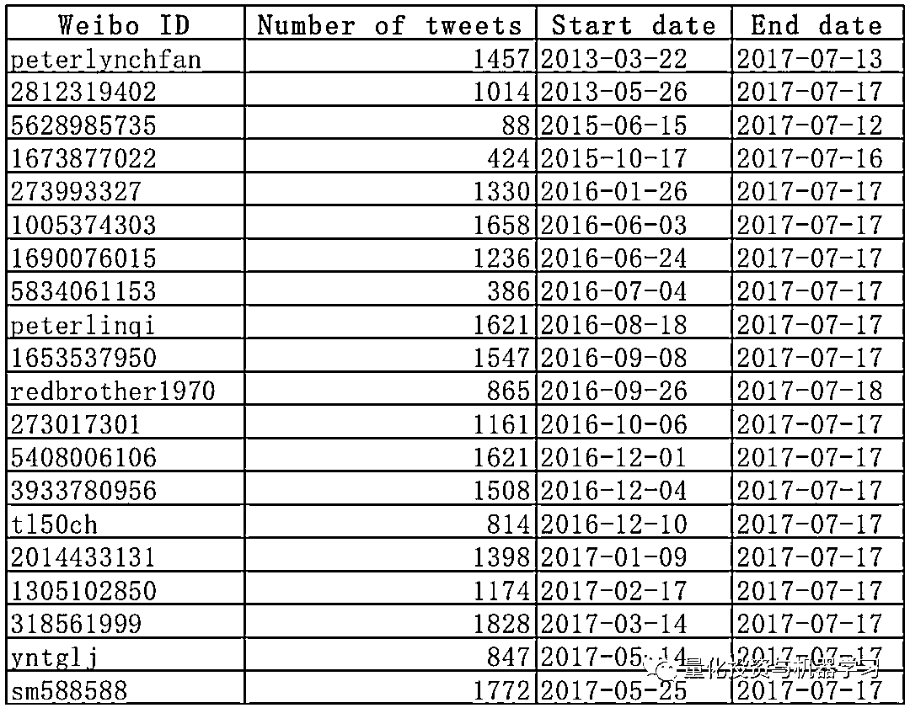

表 1\. 选定的微博财经类账户 ID、检索到的推文数量、每个 ID 的起止日期

社交媒体数据：

**微博可以通过 API 进行访问，但是检索到的微博内容和请求频率对于普通用户是有限的。**

例如，如果一个帐户在 30 分钟内通过 API 发出的请求超过 5000 次，则相应的微博帐户将被阻止进一步访问。

由于 API 账户请求的限制以及不重要的公开账户产生的“噪音”，本项目将会根据交易经验选择 20 个微博财经账户。**一个强有力的假设是，选定的账户是具有清晰市场洞察能力的参与者，从他们的微博推文内容中可以推断出将预测未来的市场走势**。

20 个选定的有效微博账户 ID 如表 1 所示。

检索到的微博推文开始日期均不同。回测区间确定为 2016-10-01 至 2017-07-14。

**交易策略**

1、在每个交易日的上午 00:00-09:30，从选定的的财经微博账户中获取社交媒体数据。

2、选择交易活跃或者是有被选入投资组合潜力的的四个有代表性的板块。

3、如果至少有 3 个专家（微博财经账户）同时支持一个特定的板块，则购买该板块表现最优的股票，股票在投资组合中的资金权重相等。

4、以开盘价买入持有一天，在第二天开盘时卖出。

该项目的具体流程图如图 1 所示。

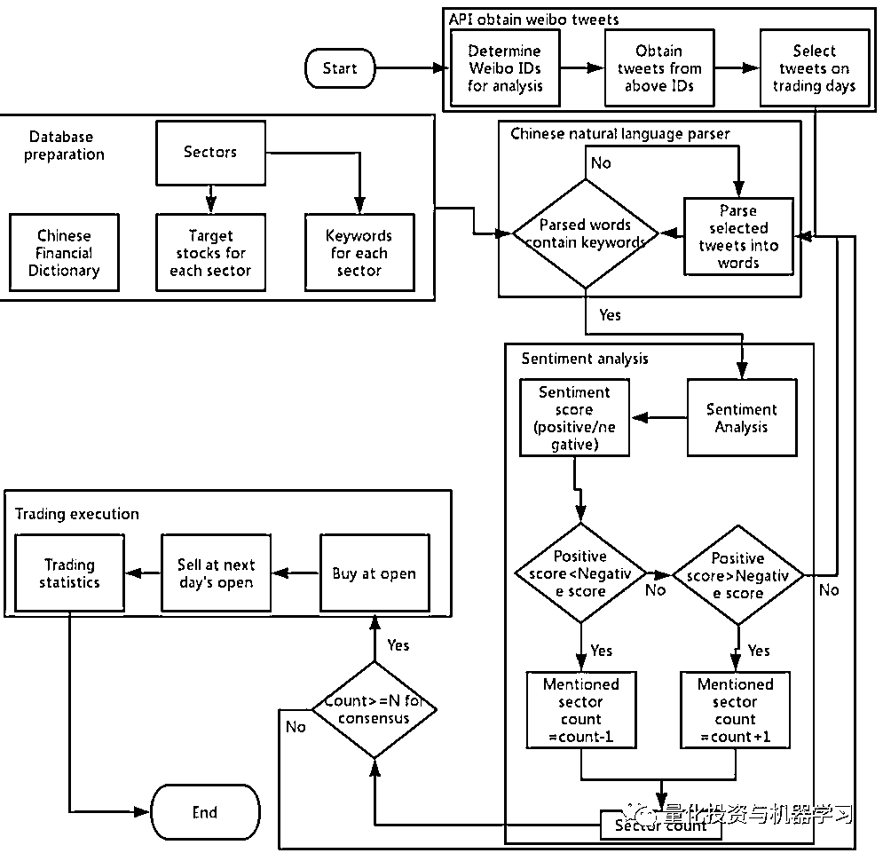

图 1\. 项目流程图：通过 API、数据库、中文自然语言解析器、情绪分析、交易执行等来获取微博推文内容

**板块**

板块的选择：**人工智能（AI）、银行、锂和证券**。之所以选择这些板块是因为它们是经**常在微博上被讨论，并且它们对应的关键字易于使用自然语言处理技术进行解析，从而避免了在分析的微博推文中出现歧义**。每个部门的中文关键词如表 2 所示。

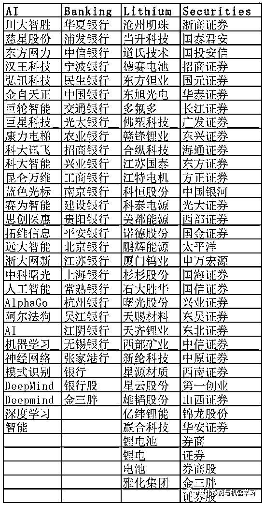

表 2\. 关键词：人工智能，银行，锂和证券

在每一个板块中，如果相关板块受到微博上专家的“青睐”，那么只购买最具代表性并且活跃交易的五家股票。每个板块的选定股票如表 3 所示：

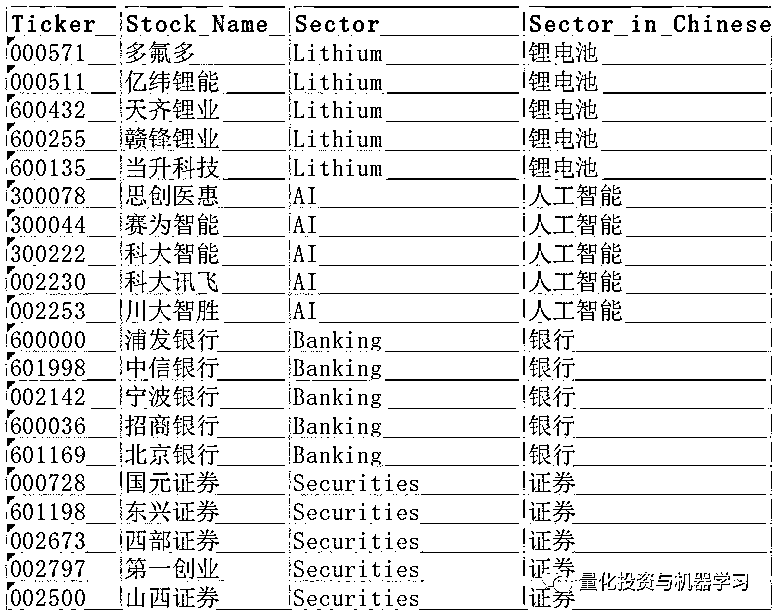

表 3\. 为每个行业选择有代表性的股票

**中文自然语言分析器**

虽然有多个中文自然语言解析器可用，但**没有一个软件包是为中国金融市场设计的。****很多金融关键词并没有被地正确解析**。例如，股票 “中国银行”将被分为“中国”和“银行”，而不是作为一个整体来确认。由于缺乏金融关键词数据库，这种错误的分析会给交易决策带来错误的信息。

因此，以下为这一公开中文语法分析器（HANLAP）4 的修正：**该项目构建了 4952 个金融关键词的中文金融词典，包括所有交易的 A 股股票和微博上使用的大多数俚语/行话。**

**修改后的中国金融解析器显著提高了交易中的解析性能。**

地址：

***https://github.com/hankcs/HanLP***

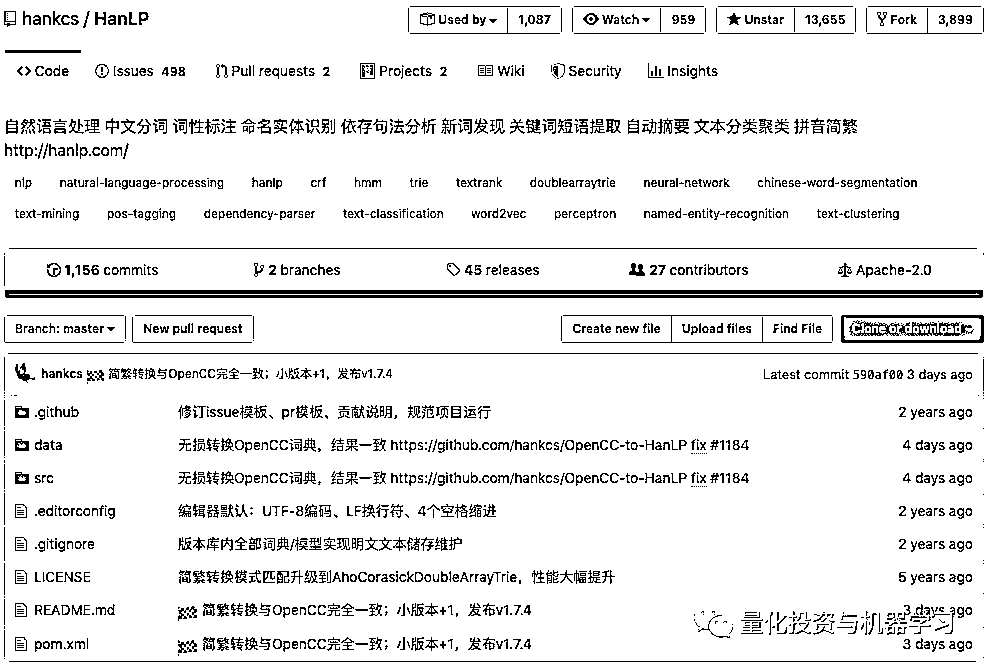

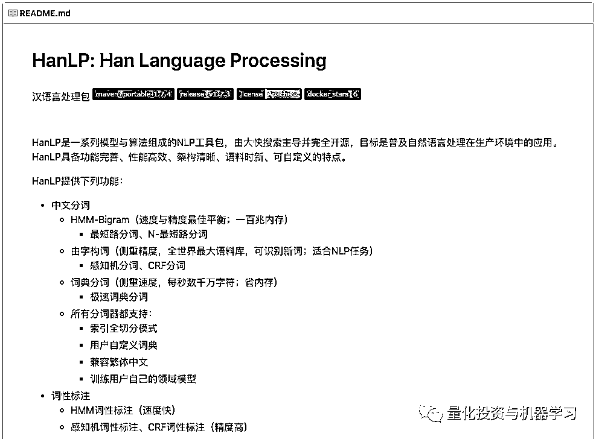

**情绪分析**

情绪分析是通过一个商业软件包进行的：BosonNLP。对于每一条微博，情绪分为正倾向和负倾向两个分数，两个分数之和为 1。例如，“这顿饭不错”的情绪分数是 0.98 和 0.02，这意味着这一陈述是强烈的正面，两个分数加起来是 1。

地址：

***https://bosonnlp.com/***

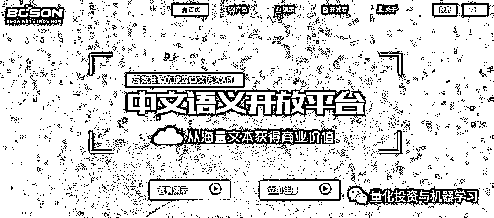

情绪分析结果的一个样本快照如图 2 所示。

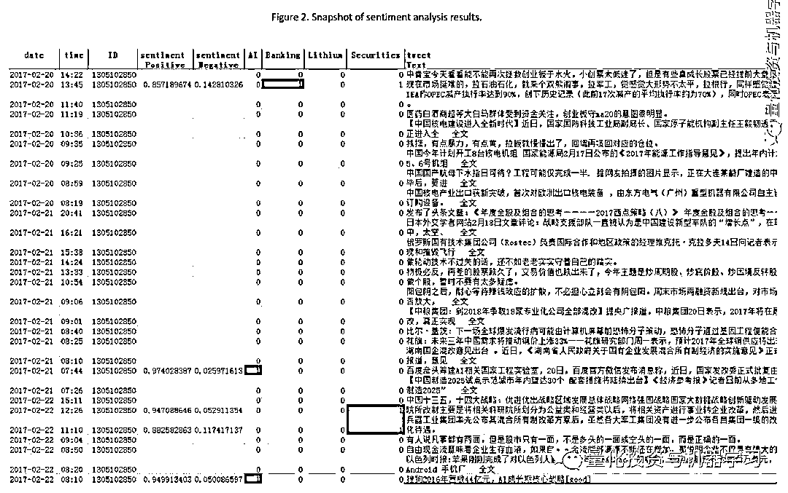

**策略表现**

对于买入信号的标准设置为：在上午 00:00-09:30 期间，**至少有三个微博 ID 在某一天支持该板块。**  

1、从 2016-10-01 至 2017-07-14，中国市场共计有 188 个交易日。

2、期间出现了四次交易机会：两个是关于人工智能的，另外两个是关于证券。

3、四笔交易中有三笔产生正的收益。

4、具体的交易记录见图表 4。

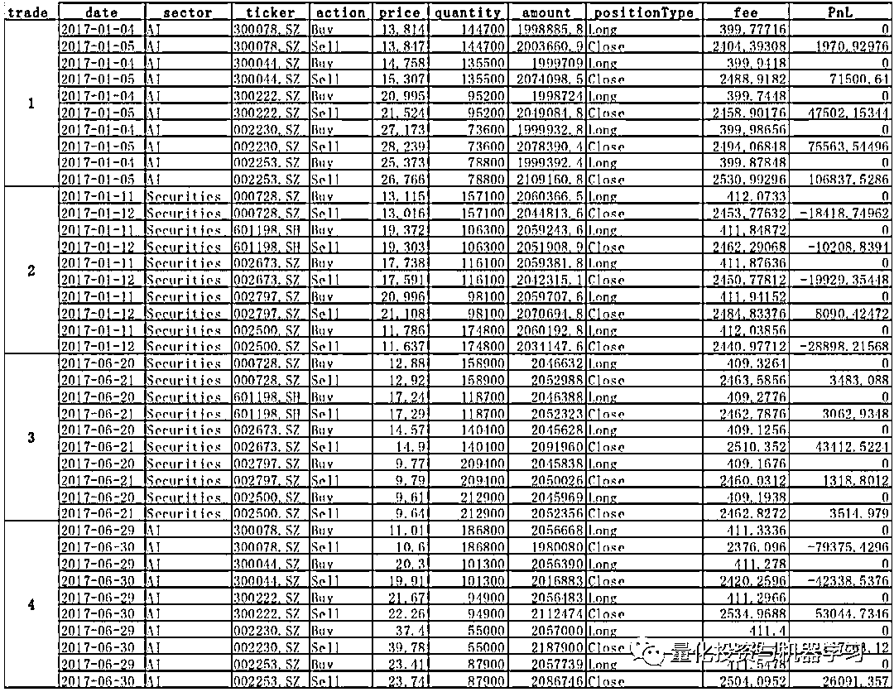

表 4\. 2016-10-01 至 2017-07-14 期间交易回测记录

该策略实现了 3.74%的回报率（年化回报率 5.14%），夏普比率为 0.86。具体表现如图 3 所示。

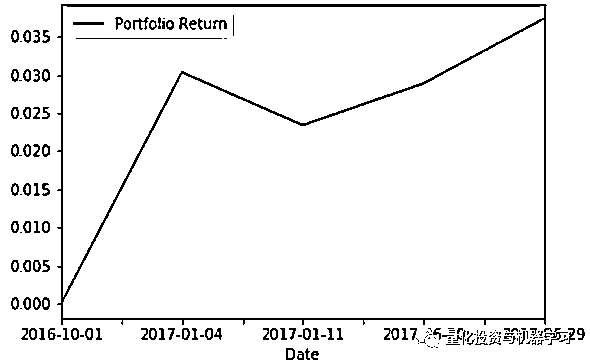

图 3\. 组合的收益率表现基于至少 3 个微博财经账户的推荐

**其他场景**

**场景 1：**

如果将买入信号的标准从 3 个微博 ID 放宽到 2 个微博 ID，则策略表现呈现为负的收益率，-9.83%（图 4）。微博推文获取时间段是在每个交易日的上午 00:00-09:30 之间。

图 4  组合的收益率表现基于至少 2 个微博财经账户的推荐（上午 00:00-09:30）。

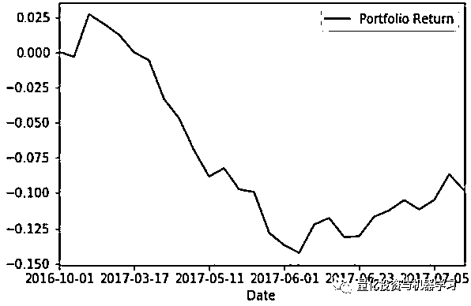

图 4

**场景 2：**

如果将买入信号的标准设置为 4 个微博 ID 而不是 3 个微博 ID，则在此期间未检测到任何交易机会。微博推文获取时间段是在每个交易日的上午 00:00-09:30 之间。

**场景 3：**

微博推文获取的时间段从 00:00-09:30 扩展到 00:00-14:575，那么符合买入信号标准的微博 ID 数量增加到 8 个和 10 个，以第一天的收盘价买入，在第二天以开盘价卖出，投资组合获得负的收益率，分别为-3.07%和-0.61%（图 5 和图 6）。

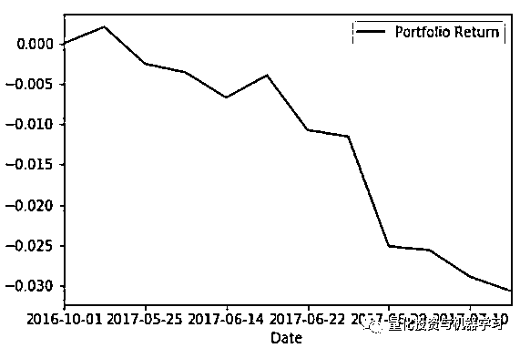

图 5

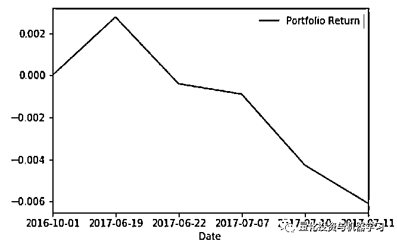

图 6

通过进一步分析可以得知，将获取微博消息的时间区间延长至 14:57 后产生的负收益率可能是因为：**在交易期间，大多数选定的微博 ID 都会对当天表现良好的板块发表评论，他们是在板块上涨后才对此板块进行评论；****也就是说，他们在交易时间的微博推文很可能是回顾性的，而不是带有预测性的。****因此，基于日内交易时间发布的微博推文而作出的交易决策很有可能失败**。

**进一步工作**

一个更全面的微博推文数据库将会使得该策略的回测结果更加可靠和具有统计说服力。

每条微博文章中提到的时间可以是不同的时间段：过去（昨天、上周）、短期（1 天）、中期（几周）或长期（几个月）。精准的处理时间可能会显著提高策略的准确性。

** 部分代码展示**

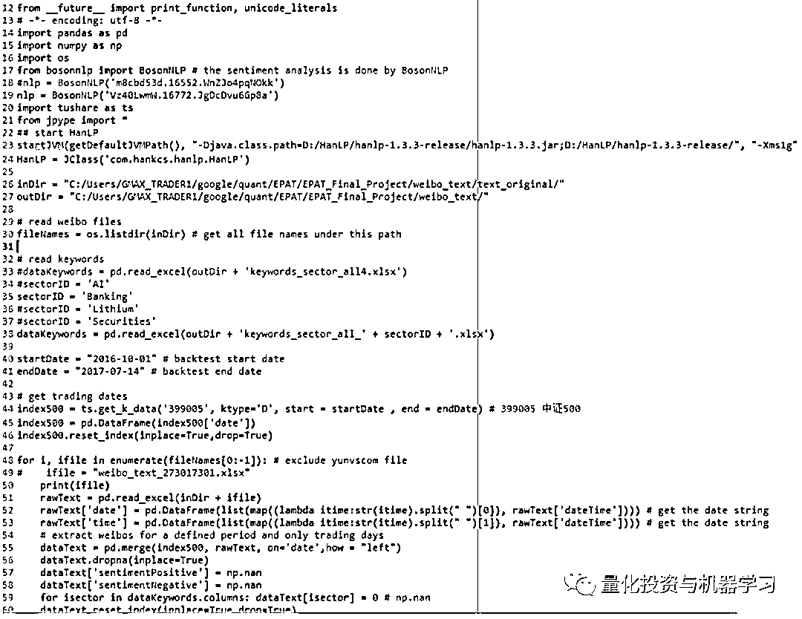

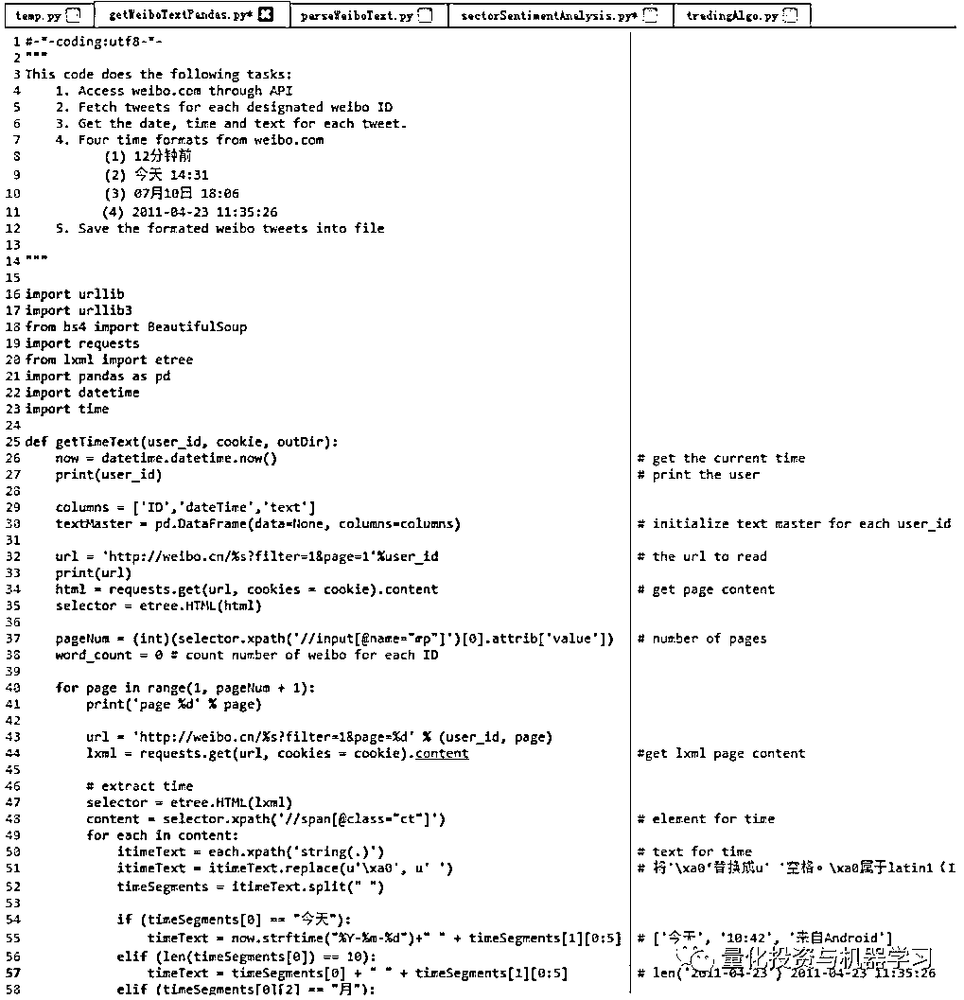

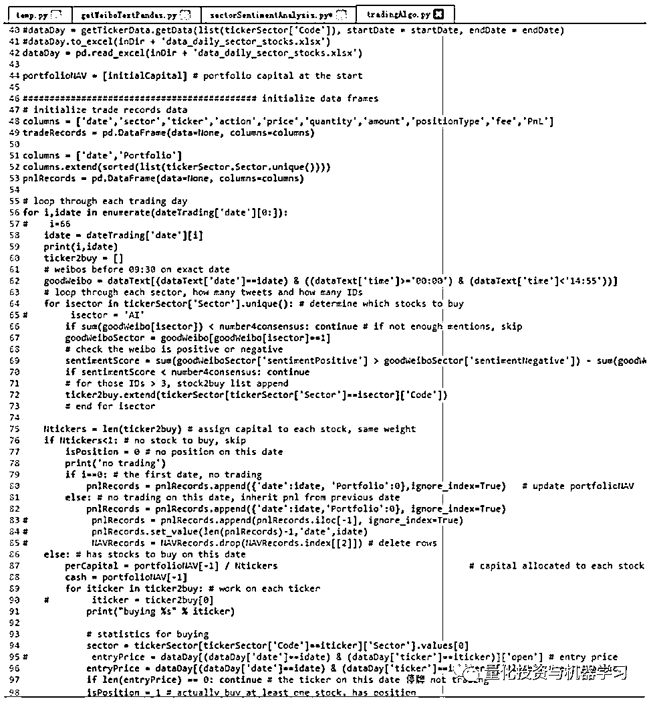

**微博代码获取**

在**后台**输入（严格大小写）

***微博 Aaaa 股***

*—End—*

量化投资与机器学习微信公众号，是业内垂直于**Quant**、**MFE**、**CST**等专业的主流量化自媒体。公众号拥有来自**公募、私募、券商、银行、海外**等众多圈内**10W+**关注者。每日发布行业前沿研究成果和最新资讯。

