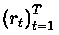
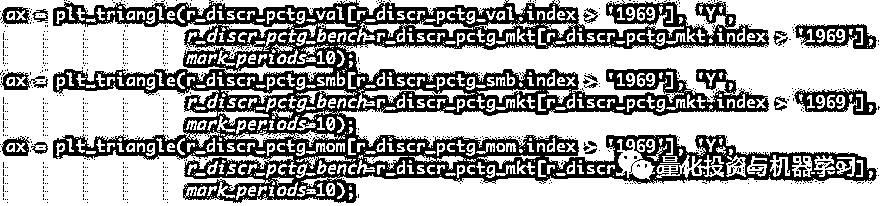

# 新颖研究 | 长期投资与三角形的可视化邂逅（附代码）

> 原文：[`mp.weixin.qq.com/s?__biz=MzAxNTc0Mjg0Mg==&mid=2653293150&idx=1&sn=b319d677f379a88e7181c2afc85f9966&chksm=802dc84bb75a415d69e904ee627111a5907946016ba751d571adb599b2ffb152942d36c1b350&scene=27#wechat_redirect`](http://mp.weixin.qq.com/s?__biz=MzAxNTc0Mjg0Mg==&mid=2653293150&idx=1&sn=b319d677f379a88e7181c2afc85f9966&chksm=802dc84bb75a415d69e904ee627111a5907946016ba751d571adb599b2ffb152942d36c1b350&scene=27#wechat_redirect)

**标星★公众号     **爱你们♥

# 作者：Malte Kurz 

编译：Guiyang Wang | 公众号翻译部

**近期原创文章：**

## ♥ [5 种机器学习算法在预测股价的应用（代码+数据）](https://mp.weixin.qq.com/s?__biz=MzAxNTc0Mjg0Mg==&mid=2653290588&idx=1&sn=1d0409ad212ea8627e5d5cedf61953ac&chksm=802dc249b75a4b5fa245433320a4cc9da1a2cceb22df6fb1a28e5b94ff038319ae4e7ec6941f&token=1298662931&lang=zh_CN&scene=21#wechat_redirect)

## ♥ [Two Sigma 用新闻来预测股价走势，带你吊打 Kaggle](https://mp.weixin.qq.com/s?__biz=MzAxNTc0Mjg0Mg==&mid=2653290456&idx=1&sn=b8d2d8febc599742e43ea48e3c249323&chksm=802e3dcdb759b4db9279c689202101b6b154fb118a1c1be12b52e522e1a1d7944858dbd6637e&token=1330520237&lang=zh_CN&scene=21#wechat_redirect)

## ♥ 2 万字干货：[利用深度学习最新前沿预测股价走势](https://mp.weixin.qq.com/s?__biz=MzAxNTc0Mjg0Mg==&mid=2653290080&idx=1&sn=06c50cefe78a7b24c64c4fdb9739c7f3&chksm=802e3c75b759b563c01495d16a638a56ac7305fc324ee4917fd76c648f670b7f7276826bdaa8&token=770078636&lang=zh_CN&scene=21#wechat_redirect)

## ♥ [机器学习在量化金融领域的误用！](http://mp.weixin.qq.com/s?__biz=MzAxNTc0Mjg0Mg==&mid=2653292984&idx=1&sn=3e7efe9fe9452c4a5492d2175b4159ef&chksm=802dcbadb75a42bbdce895c49070c3f552dc8c983afce5eeac5d7c25974b7753e670a0162c89&scene=21#wechat_redirect)

## ♥ [基于 RNN 和 LSTM 的股市预测方法](https://mp.weixin.qq.com/s?__biz=MzAxNTc0Mjg0Mg==&mid=2653290481&idx=1&sn=f7360ea8554cc4f86fcc71315176b093&chksm=802e3de4b759b4f2235a0aeabb6e76b3e101ff09b9a2aa6fa67e6e824fc4274f68f4ae51af95&token=1865137106&lang=zh_CN&scene=21#wechat_redirect)

## ♥ [如何鉴别那些用深度学习预测股价的花哨模型？](https://mp.weixin.qq.com/s?__biz=MzAxNTc0Mjg0Mg==&mid=2653290132&idx=1&sn=cbf1e2a4526e6e9305a6110c17063f46&chksm=802e3c81b759b597d3dd94b8008e150c90087567904a29c0c4b58d7be220a9ece2008956d5db&token=1266110554&lang=zh_CN&scene=21#wechat_redirect)

## ♥ [优化强化学习 Q-learning 算法进行股市](https://mp.weixin.qq.com/s?__biz=MzAxNTc0Mjg0Mg==&mid=2653290286&idx=1&sn=882d39a18018733b93c8c8eac385b515&chksm=802e3d3bb759b42d1fc849f96bf02ae87edf2eab01b0beecd9340112c7fb06b95cb2246d2429&token=1330520237&lang=zh_CN&scene=21#wechat_redirect)

## ♥ [WorldQuant 101 Alpha、国泰君安 191 Alpha](https://mp.weixin.qq.com/s?__biz=MzAxNTc0Mjg0Mg==&mid=2653290927&idx=1&sn=ecca60811da74967f33a00329a1fe66a&chksm=802dc3bab75a4aac2bb4ccff7010063cc08ef51d0bf3d2f71621cdd6adece11f28133a242a15&token=48775331&lang=zh_CN&scene=21#wechat_redirect)

## ♥ [基于回声状态网络预测股票价格（附代码）](https://mp.weixin.qq.com/s?__biz=MzAxNTc0Mjg0Mg==&mid=2653291171&idx=1&sn=485a35e564b45046ff5a07c42bba1743&chksm=802dc0b6b75a49a07e5b91c512c8575104f777b39d0e1d71cf11881502209dc399fd6f641fb1&token=48775331&lang=zh_CN&scene=21#wechat_redirect)

## ♥ [计量经济学应用投资失败的 7 个原因](https://mp.weixin.qq.com/s?__biz=MzAxNTc0Mjg0Mg==&mid=2653292186&idx=1&sn=87501434ae16f29afffec19a6884ee8d&chksm=802dc48fb75a4d99e0172bf484cdbf6aee86e36a95037847fd9f070cbe7144b4617c2d1b0644&token=48775331&lang=zh_CN&scene=21#wechat_redirect)

## ♥ [配对交易千千万，强化学习最 NB！（文档+代码）](http://mp.weixin.qq.com/s?__biz=MzAxNTc0Mjg0Mg==&mid=2653292915&idx=1&sn=13f4ddebcd209b082697a75544852608&chksm=802dcb66b75a4270ceb19fac90eb2a70dc05f5b6daa295a7d31401aaa8697bbb53f5ff7c05af&scene=21#wechat_redirect)

## ♥ [关于高盛在 Github 开源背后的真相！](https://mp.weixin.qq.com/s?__biz=MzAxNTc0Mjg0Mg==&mid=2653291594&idx=1&sn=7703403c5c537061994396e7e49e7ce5&chksm=802dc65fb75a4f49019cec951ac25d30ec7783738e9640ec108be95335597361c427258f5d5f&token=48775331&lang=zh_CN&scene=21#wechat_redirect)

## ♥ [新一代量化带货王诞生！Oh My God！](https://mp.weixin.qq.com/s?__biz=MzAxNTc0Mjg0Mg==&mid=2653291789&idx=1&sn=e31778d1b9372bc7aa6e57b82a69ec6e&chksm=802dc718b75a4e0ea4c022e70ea53f51c48d102ebf7e54993261619c36f24f3f9a5b63437e9e&token=48775331&lang=zh_CN&scene=21#wechat_redirect)

## ♥ [独家！关于定量/交易求职分享（附真实试题）](https://mp.weixin.qq.com/s?__biz=MzAxNTc0Mjg0Mg==&mid=2653291844&idx=1&sn=3fd8b57d32a0ebd43b17fa68ae954471&chksm=802dc751b75a4e4755fcbb0aa228355cebbbb6d34b292aa25b4f3fbd51013fcf7b17b91ddb71&token=48775331&lang=zh_CN&scene=21#wechat_redirect)

## ♥ [Quant 们的身份危机！](https://mp.weixin.qq.com/s?__biz=MzAxNTc0Mjg0Mg==&mid=2653291856&idx=1&sn=729b657ede2cb50c96e92193ab16102d&chksm=802dc745b75a4e53c5018cc1385214233ec4657a3479cd7193c95aaf65642f5f45fa0e465694&token=48775331&lang=zh_CN&scene=21#wechat_redirect)

## ♥ [拿起 Python，防御特朗普的 Twitter](https://mp.weixin.qq.com/s?__biz=MzAxNTc0Mjg0Mg==&mid=2653291977&idx=1&sn=01f146e9a88bf130ca1b479573e6d158&chksm=802dc7dcb75a4ecadfdbdace877ed948f56b72bc160952fd1e4bcde27260f823c999a65a0d6d&token=48775331&lang=zh_CN&scene=21#wechat_redirect)

## ♥ [AQR 最新研究 | 机器能“学习”金融吗？](http://mp.weixin.qq.com/s?__biz=MzAxNTc0Mjg0Mg==&mid=2653292710&idx=1&sn=e5e852de00159a96d5dcc92f349f5b58&chksm=802dcab3b75a43a5492bc98874684081eb5c5666aff32a36a0cdc144d74de0200cc0d997894f&scene=21#wechat_redirect)

**[所有模型都是错的，但其中有些是有用的！](http://mp.weixin.qq.com/s?__biz=MzAxNTc0Mjg0Mg==&mid=2653293065&idx=1&sn=45b6a1db897b5c5c928a2bd87076c5dc&chksm=802dc81cb75a410a049cb6c5f7d1412ecb4ecfbaf46d390e41c5bf5d81add3d21839e2095c36&scene=21#wechat_redirect)**

可视化技术在任何投资分析中都是一种关键要素。今天公众号为大家介绍一个基于三角形图的 Python 项目，**用于可视化长期投资指标！**

**摘要**

## 1、我们引入了三角形图，用于可视化长期投资指标。

2、收益三角形非常适合展示大量可能子周期内的策略或资产的表现。受限于持有期长度的敏感分析和开始与结束的日期因此被很容易的呈现出来和可视化。

3、可以使用收益三角形来分析两个资产或策略的成对比较，以便以绝对值表示优异性能，或者可以绘制超出性能指标。

4、最大下降和波动三角形允许研究不同子周期的长期投资风险。

5、通过风险和收益三角形的结合以获得风险调整后的收益三角形。

6、开源的 Python 代码允许读者为自己的资产或策略生成三角形。

**1、用于可视化长期投资指标的三角形**

## 随着数据和计算能力的提高，可视化工具和技术变得越来越重要。在一篇讨论大数据的文章中，Edd Wilder-James 在陈述时强调了这一点：

*在连接人机之间的鸿沟以有意义的方式调解分析洞察力方面，数据可视化的艺术和实践变得越来越重要。*

*EddWilder-James《什么是大数据？》*

可视化技术是我们分析量化投资策略时的一种关键因素。通常，采用定量资产配置技术的投资者具有相当长的投资期限。然而，散户投资者的平均投资时间可能在 5 到 15 年之间。因此，除了长期回测结果外，资产管理人员也对分析不同长度的子周期感兴趣。不幸地是，这样的子时段的数量的迅速增长，可用的数据越多，整个回测周期越长。为此，我们提出了三角形热图，它允许在单个图中可视化大量信息。例如，“纽约时报”（2011 年）和 Frankfurter Allgemeine Zeitung（2018 年）使用相似的三角形图来可视化长期投资收益。我们在几个方面扩展了框架：首先，我们在第 6 节中提供了一个开源实现，以便于生成图。其次，除了纯收益三角形之外，我们在第 4 节还考虑中用于比较两种不同策略或资产的三角形。此外，我们在第 5 节中介绍了风险三角形，即最大下降三角形和波动三角形。在那里，我们还提出了风险调整后的收益三角形的自然延伸。

**2、数据和三角图的功能介绍**

## 第 6 节中 Python 介绍的实现包含一个函数 plt_triangle()，该函数是获取三角形图的主要接口。要运行 plt_triangle()，用户需要提供 pandas.Series，它包含日期索引的离散百分比收益。如果有价格的 pd.DataFrame 或 pd.Series，可以通过 prices.pct_change() * 100 轻松获得这种收益。因为可以通过选项设置目标返回频率，所以建议以尽可能高的采样频率为数据系列提供服务。提供了返回序列和目标频率后，使用 pd.Series.resample()对数据进行下采样。然后聚合返回，并为每个可能的子窗口计算年化收益。

为了便于说明，我们将研究来自 Kenneth R. French 的数据，在分析中，我们将研究因子收益（价值，规模和动量），并假设我们的假想投资者可以获得多头头寸但不能卖空。因此，我们计算因子返回的代理为：

 被表示从数据库获得的原始长短因子收益。市场收益被这个公式计算：

使用 Python 包 pandas-datareader，可以轻松加载本文中使用的样本数据。在下面的代码中，我们将动量因子加入到三个经典的 Fama-French 因子中，并计算本文中使用的四个不同因子收益序列（市值，价值，规模和动量）。

**3、收益三角形**

## 让我们假设有一个百分比收益的向量

且我们对更低的频率感兴趣。不失一般性这种更低频率有 N 个不相交的间隔和

对于 1≤n≤N 表示这些间隔中的每一个的索引集可以获得收益间隔 n 的百分比收益值（对于 1≤n≤N）。这个收益值是对于收益间隔 n，然后可以被获得形如：（对于对于 1≤n≤N）

并且可以在对角线上的返回三角形中找到，如索引 Xn,n 对应于矩阵中的位置。为了解释收益三角形的功能，我们在 1999 年 1 月到 2019 年 3 月之间生成了一个市场投资组合，如大约 20 年的数据。我们选择年度目标频率，三角形如图 1 所示。在第一上对角线中，收益值对应于目标频率的两个周期的长度的间隔。这意味着收益三角形的第一个上对角线上的条目可以获得为，对于

我们通过应用平方根来标准化，使得三角形中的每个条目被标准化为目标频率的一个间隔的长度。通常，收益三角形的条目定义为，对于

索引集由

给出。图 1 给出了收益三角形的第一个例子。要生成绘图，只需将第 6 节的代码复制粘贴到.py 文件中。选择模块名称并将其用作文件名，如 scalable_triangle_utils.py 然后导入该功能 plt_triangle。为了获得图 1 中的图，我们称之为：

图 1：Fama—French 市场投资组合的收益（上）三角形（年度，1999 年 1 月至 2019 年 3 月）

在图 1 中，我们添加了一些注释来进一步解释三角图的条目。这个被突出表示的 7.5%值的条目表明了：如果一个投资于 2006 年初投入市场并在 2015 年底后十年后出售，则可获得平均年收益。一般来说，可视化的图表中，行代表购买年份，列表示销售资产或策略。因此，在图 1 的主对角线上所有条目对应于一年的保持期，并且在第一个上对角线上，所有条目对应于两年的保持期等，依此类推。这意味着通过向右上角移动（如，进一步向右和/或进一步向顶部），投资期限是增加的。当然，为了更容易定位，引入一些对角线标记会有很大帮助。这些阶梯形式的标记可以通过可选输入 mark_periods 进行更改。对于年度重新采样频率，我们可以通过设置将所有持有期间标记为五年的倍数 mark_periods= 5。这在图 2 完成，其中我们看到用 5,10,15 和 20 注释的阶梯。突出显示的对角线包含在 1999 年和 2019 年之间的研究样本期内的所有可能的 10 年投资期。

图 2：Fama-French 市场投资组合的收益三角形（每年，1999 年 1 月至 2019 年 3 月）

图 2 中可以通过以下代码获得：

### **▍3.1 收益三角形的选项和变化**

这个 plt_triangle()功能允许用户自定义其收益三角形图。例如，通过 annot = True | False 可以确定是否应该在热图的单元格中显示数字。变量 vmin 和 vmax 可用于标准化 colourmap。如果应该直接比较几个竞争策略的收益三角形并且人们想要确保颜色编码是对齐的，则这尤其有用。另一个选项是 triangle_type = upper | lower，它可用于在下三角和上三角之间进行选择作为绘图类型。举个例子，我们提供的下部三角形的对应图 2 中图 3，图 3 的三角形可以通过以下代码获得：

图 3：Fama - French 市场投资组合的收益（下）三角形（年度，1999 年 1 月至 2019 年 3 月）  

请注意，在图 3 中，投资范围现在变得越大，将会有越多的人移动到三角图中的左下角。本文中的所有公式，尤其是索引，都将参考上三角图。

如果人们对整个投资期的更精细的粒度感兴趣，则可以调整重采样规则。例如，在图 4 中，在我们考虑了 2009 年至 2019 年之间的季度投资期。该图可以通过以下代码获得：

图 4：Fama-French 市场投资组合的收益三角形（季度，2009 年 1 月至 2019 年 3 月）

**4、收益三角形的成对比较**

## 许多分析的一个重要组成部分是与基准的比较。举个例子，我们研究了对因子组合价值，规模或动量的长期投资。我们不是分析这些因子素组合的绝对表现，而是将其与市场投资组合的投资进行对比。将展示两种不同的可视化：绝对值表现优异以及卓越绩效指标。

### **▍4.1 绝对条件中表现优异的收益三角形**

让我们假设我们已经计算了感兴趣的资产或策略的收益三角形的条目

并且我们想要将它与我们也获得返回三角形条目

的基准进行比较。然后将优异的回归三角形（绝对值）定义为：

价值，规模和动量与市场的相应比较收益三角形分别如图 5，图 6，图 7 所示。代码：

图 5：长期 Fama-French 价值因子投资组合与市场投资组合的表现（年度，1969 年 1 月至 2019 年 3 月）

图 6：长期 Fama-French 规模因子投资组合与市场投资组合的表现（年度，1969 年 1 月至 2019 年 3 月）

图 7：长期 Fama-French 动量因子投资组合与市场投资组合的表现（年度，1969 年 1 月至 2019 年 3 月）

### **▍4.2 优异指标三角形**

关于 Fama-French 因子组合的好处可以追溯到 1926 年的数据。如果我们想要分析如此大量的数据，那么优秀的回归三角形变得难以可视化，因为它们有太多的条目。一种可能的替代方案是关注指标而不是增量，如我们不是确定战略的表现优于哪个数量，而是指出它是否优于相应的时期。每当

为正时，**优秀指标三角形中的条目为 True（绿色），相当于**

****

**否则为 False（红色**）。价值，规模和动量与市场的这些优异指标回归三角形分别如图 8，图 9，图 10 所示。代码：

图 8，图 9，图 1 为因子投资的长期表现提供了一些有趣的见解。对角阶梯也是对方向有用标记。例如，在图 8 中可以看出，只要投资期超过 20 年，无论开始日期如何，对价值因子投资组合的长期投资都会超过市场投资组合。对于动量因子图 10，它非常相似，在 20 世纪 30 年代初投资时只有一个例外区域。图 9 规模因子的三角形包含更多红色表现不佳的条目，其中一个条目甚至高于 50 年投资期限对角线。

图 8：长期 Fama-French 价值因子投资组合与市场投资组合的优异指标（年度，1969 年 1 月至 2019 年 3 月）

图 9：长期 Fama-French 规模因子投资组合与市场投资组合的优异指标（年度，1969 年 1 月至 2019 年 3 月）

图 10：长期 Fama-French 动量因子投资组合与市场投资组合的优异指标（年度，1969 年 1 月至 2019 年 3 月）

**5、风险三角形**

## 除了投资策略或资产的表现外，与资产管理者和散户投资者密切相关的第二组指标是风险衡量指标。风险衡量指标，如最大下降或波动率也可以使用三角形轻松显示特定持续时间的所有可能的子周期。我们将介绍两种不同的风险三角形，即**最大下降三角形和波动率三角形**。此外，我们通过标准化具有风险三角形的收益三角形来提供生成风险调整后的返回三角形的功能。

### **▍5.1 下降三角形**

投资策略和单一资产的一个可能的风险衡量标准是最大亏损。我们从我们的回归系列获得累积性能系列的第 n 个间隔为：

对于每个

针对于最大下降的每个间隔

现在被定义为：

然后，最大下降三角形的条目由

给出，且相同的索引集与对应地 回归三角由给出。

注意通过构造单调性：

无论

何时都保持索 L 引集在开始或结束时是否连续增加以获得更大的集合 J。

对于市场投资组合，过去 50 年（1969 年至 2019 年）的最大下降三角形如图 11 所示。它可以通过改变 plt_type，如：

值得注意的是：我们另外选择了不同的颜色图，'RdYlGn_r'因为更高的绘图表示更高的风险，因此默认颜色图的反转版本更合适。在图 11 中我们可以了解到，在过去五十年中，十年投资期限的最低可能最大跌幅为 20％，最高为 55％。对于更长的投资期限，通过构造的最大下降值的变化趋于更小。例如，对于市场上的三十年投资，投资者将遭受 48％至 55％的最大亏损这决定于开始日期。

图 11：Fama - French 市场投资组合的最大亏损三角形（年度，1969 年 1 月至 2019 年 3 月

### **▍5.2 波动率三角形**

作为最大下降三角形的替代，我们也可以考虑波动率三角形。为了获得波动率三角形中的条目，需要做出一些假设。为简单起见，我们使用最高可能的返回采样频率估算样本波动率，然后应用平方根时间缩放规则来获取通过重采样规则选项指定的周期长度的估计值。依赖这一假设的一个主要原因是我们还希望能够对主要和第一对角线提供一些可靠的估计。首次汇总收益时，这是不可能的，因为我们必须从单个或少量观察中估算出波动率。然而，在解释波动率三角形时，应该意识到它们依赖于某些假设，如平方根时间缩放。

波动率三角形的条目定义为，对于

其中索引集由

给出。另外，

表示样本均值

表示索引集

的基数

此外，波动三角形可以通过改变 plt_type 来轻松生成，如图 12 所示。

图 12：Fama-French 市场投资组合的波动率三角形（年度，1969 年 1 月至 2019 年 3 月）

### **▍5.3 风险调整后的收益三角形**

风险和收益三角形的自然延伸是风险调整的收益三角形。我们的实施允许根据波动率或最大亏损调整收益。因此，人们获得夏普比率（人们可能希望使用超额收益作为收益三角函数的输入）和收益率。为了说明界面，我们提供了图 13 市场投资组合的风险调整（相对于波动率）收益三角形。可以通过调用接口

图 13：Fama - French 市场投资组合的风险调整收益三角形（年度，1969 年 1 月至 2019 年 3 月）

**6、Python 实现**

## 本节包含 python 所有提出的三角形的实现。主要功能是 plt_triangle()。前两个输入变量 r_discr_pctg（pandas.Series 包含以日期索引的离散百分比返回）和 resampling_rule（目标频率）是必需的。所有其他输入都是可选的，可用于自定义三角图。

在开始之前，请选择模块名称并将其用作文件名，例如，scalable_triangle_utils.py 然后导入该功能 plt_triangle。除了传递三角形图的主要功能外，还定义了三个实际计算功能。功能 compute_ret_triangle()，compute_dd_triangle()并且 compute_vol_triangle()可以被用于分别获得收益，最大下降和波动率三角形的条目。该模块依赖于某些依赖项，主要是 pandas 包和热力图来源于 seaborn 包。

  

**7、总结**

## 在本文中，我们介绍了用于可视化长期投资指标的三角形图。为了介绍，解释和展示我们三角形的一般功能，我**们研究了 Fama-French 因子数据**。**收益三角形可用于显示不同持有期间和不同开始和结束日期的策略或资产的性能**。此外，收益三角形还可用于执行不同策略或资产的成对比较。为了研究不同投资视野的风险度量，我们引入了最大下降和波动三角形。收益和风险三角形的组合产生了风险调整的收益三角形，用于分析长期投资决策。

** 8、参考文献**

1\. Frankfurter Allgemeine Zeitung (2018), Daniel Mohr, Kaum Verluste mit deutschen Aktien möglich

2。The New York Times (2011), In Investing, It’s When You Start And When You Finish

3\. Wilder-James, E. (2012), What is big data?

*—End—*

量化投资与机器学习微信公众号，是业内垂直于**Quant**、**MFE**、**CST**等专业的主流量化自媒体。公众号拥有来自**公募、私募、券商、银行、海外**等众多圈内**10W+**关注者。每日发布行业前沿研究成果和最新资讯。

