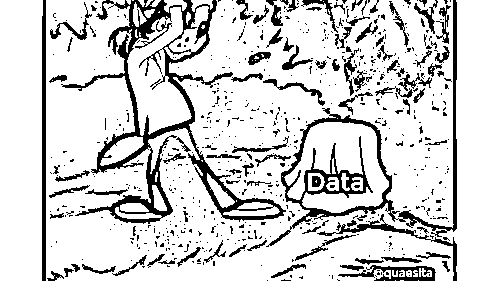

# 为什么说 p 值像根针？一场关于 p 值的战争！

> 原文：[`mp.weixin.qq.com/s?__biz=MzAxNTc0Mjg0Mg==&mid=2653293076&idx=1&sn=44fbf63abcd51859b174252c3af047e5&chksm=802dc801b75a41178bf4dc3bc204bca805cc7d8c14391b0884f338982be46bd92d1fb833f4f5&scene=27#wechat_redirect`](http://mp.weixin.qq.com/s?__biz=MzAxNTc0Mjg0Mg==&mid=2653293076&idx=1&sn=44fbf63abcd51859b174252c3af047e5&chksm=802dc801b75a41178bf4dc3bc204bca805cc7d8c14391b0884f338982be46bd92d1fb833f4f5&scene=27#wechat_redirect)

**标星★公众号     **爱你们♥

# 作者：Cassie Kozyrkov

编译：ArchanJin | 公众号翻译部

**近期原创文章：**

## ♥ [5 种机器学习算法在预测股价的应用（代码+数据）](https://mp.weixin.qq.com/s?__biz=MzAxNTc0Mjg0Mg==&mid=2653290588&idx=1&sn=1d0409ad212ea8627e5d5cedf61953ac&chksm=802dc249b75a4b5fa245433320a4cc9da1a2cceb22df6fb1a28e5b94ff038319ae4e7ec6941f&token=1298662931&lang=zh_CN&scene=21#wechat_redirect)

## ♥ [Two Sigma 用新闻来预测股价走势，带你吊打 Kaggle](https://mp.weixin.qq.com/s?__biz=MzAxNTc0Mjg0Mg==&mid=2653290456&idx=1&sn=b8d2d8febc599742e43ea48e3c249323&chksm=802e3dcdb759b4db9279c689202101b6b154fb118a1c1be12b52e522e1a1d7944858dbd6637e&token=1330520237&lang=zh_CN&scene=21#wechat_redirect)

## ♥ 2 万字干货：[利用深度学习最新前沿预测股价走势](https://mp.weixin.qq.com/s?__biz=MzAxNTc0Mjg0Mg==&mid=2653290080&idx=1&sn=06c50cefe78a7b24c64c4fdb9739c7f3&chksm=802e3c75b759b563c01495d16a638a56ac7305fc324ee4917fd76c648f670b7f7276826bdaa8&token=770078636&lang=zh_CN&scene=21#wechat_redirect)

## ♥ [机器学习在量化金融领域的误用！](http://mp.weixin.qq.com/s?__biz=MzAxNTc0Mjg0Mg==&mid=2653292984&idx=1&sn=3e7efe9fe9452c4a5492d2175b4159ef&chksm=802dcbadb75a42bbdce895c49070c3f552dc8c983afce5eeac5d7c25974b7753e670a0162c89&scene=21#wechat_redirect)

## ♥ [基于 RNN 和 LSTM 的股市预测方法](https://mp.weixin.qq.com/s?__biz=MzAxNTc0Mjg0Mg==&mid=2653290481&idx=1&sn=f7360ea8554cc4f86fcc71315176b093&chksm=802e3de4b759b4f2235a0aeabb6e76b3e101ff09b9a2aa6fa67e6e824fc4274f68f4ae51af95&token=1865137106&lang=zh_CN&scene=21#wechat_redirect)

## ♥ [如何鉴别那些用深度学习预测股价的花哨模型？](https://mp.weixin.qq.com/s?__biz=MzAxNTc0Mjg0Mg==&mid=2653290132&idx=1&sn=cbf1e2a4526e6e9305a6110c17063f46&chksm=802e3c81b759b597d3dd94b8008e150c90087567904a29c0c4b58d7be220a9ece2008956d5db&token=1266110554&lang=zh_CN&scene=21#wechat_redirect)

## ♥ [优化强化学习 Q-learning 算法进行股市](https://mp.weixin.qq.com/s?__biz=MzAxNTc0Mjg0Mg==&mid=2653290286&idx=1&sn=882d39a18018733b93c8c8eac385b515&chksm=802e3d3bb759b42d1fc849f96bf02ae87edf2eab01b0beecd9340112c7fb06b95cb2246d2429&token=1330520237&lang=zh_CN&scene=21#wechat_redirect)

## ♥ [WorldQuant 101 Alpha、国泰君安 191 Alpha](https://mp.weixin.qq.com/s?__biz=MzAxNTc0Mjg0Mg==&mid=2653290927&idx=1&sn=ecca60811da74967f33a00329a1fe66a&chksm=802dc3bab75a4aac2bb4ccff7010063cc08ef51d0bf3d2f71621cdd6adece11f28133a242a15&token=48775331&lang=zh_CN&scene=21#wechat_redirect)

## ♥ [基于回声状态网络预测股票价格（附代码）](https://mp.weixin.qq.com/s?__biz=MzAxNTc0Mjg0Mg==&mid=2653291171&idx=1&sn=485a35e564b45046ff5a07c42bba1743&chksm=802dc0b6b75a49a07e5b91c512c8575104f777b39d0e1d71cf11881502209dc399fd6f641fb1&token=48775331&lang=zh_CN&scene=21#wechat_redirect)

## ♥ [计量经济学应用投资失败的 7 个原因](https://mp.weixin.qq.com/s?__biz=MzAxNTc0Mjg0Mg==&mid=2653292186&idx=1&sn=87501434ae16f29afffec19a6884ee8d&chksm=802dc48fb75a4d99e0172bf484cdbf6aee86e36a95037847fd9f070cbe7144b4617c2d1b0644&token=48775331&lang=zh_CN&scene=21#wechat_redirect)

## ♥ [配对交易千千万，强化学习最 NB！（文档+代码）](http://mp.weixin.qq.com/s?__biz=MzAxNTc0Mjg0Mg==&mid=2653292915&idx=1&sn=13f4ddebcd209b082697a75544852608&chksm=802dcb66b75a4270ceb19fac90eb2a70dc05f5b6daa295a7d31401aaa8697bbb53f5ff7c05af&scene=21#wechat_redirect)

## ♥ [关于高盛在 Github 开源背后的真相！](https://mp.weixin.qq.com/s?__biz=MzAxNTc0Mjg0Mg==&mid=2653291594&idx=1&sn=7703403c5c537061994396e7e49e7ce5&chksm=802dc65fb75a4f49019cec951ac25d30ec7783738e9640ec108be95335597361c427258f5d5f&token=48775331&lang=zh_CN&scene=21#wechat_redirect)

## ♥ [新一代量化带货王诞生！Oh My God！](https://mp.weixin.qq.com/s?__biz=MzAxNTc0Mjg0Mg==&mid=2653291789&idx=1&sn=e31778d1b9372bc7aa6e57b82a69ec6e&chksm=802dc718b75a4e0ea4c022e70ea53f51c48d102ebf7e54993261619c36f24f3f9a5b63437e9e&token=48775331&lang=zh_CN&scene=21#wechat_redirect)

## ♥ [独家！关于定量/交易求职分享（附真实试题）](https://mp.weixin.qq.com/s?__biz=MzAxNTc0Mjg0Mg==&mid=2653291844&idx=1&sn=3fd8b57d32a0ebd43b17fa68ae954471&chksm=802dc751b75a4e4755fcbb0aa228355cebbbb6d34b292aa25b4f3fbd51013fcf7b17b91ddb71&token=48775331&lang=zh_CN&scene=21#wechat_redirect)

## ♥ [Quant 们的身份危机！](https://mp.weixin.qq.com/s?__biz=MzAxNTc0Mjg0Mg==&mid=2653291856&idx=1&sn=729b657ede2cb50c96e92193ab16102d&chksm=802dc745b75a4e53c5018cc1385214233ec4657a3479cd7193c95aaf65642f5f45fa0e465694&token=48775331&lang=zh_CN&scene=21#wechat_redirect)

## ♥ [拿起 Python，防御特朗普的 Twitter](https://mp.weixin.qq.com/s?__biz=MzAxNTc0Mjg0Mg==&mid=2653291977&idx=1&sn=01f146e9a88bf130ca1b479573e6d158&chksm=802dc7dcb75a4ecadfdbdace877ed948f56b72bc160952fd1e4bcde27260f823c999a65a0d6d&token=48775331&lang=zh_CN&scene=21#wechat_redirect)

## ♥ [AQR 最新研究 | 机器能“学习”金融吗？](http://mp.weixin.qq.com/s?__biz=MzAxNTc0Mjg0Mg==&mid=2653292710&idx=1&sn=e5e852de00159a96d5dcc92f349f5b58&chksm=802dcab3b75a43a5492bc98874684081eb5c5666aff32a36a0cdc144d74de0200cc0d997894f&scene=21#wechat_redirect)

这是公众号关于**统计学系列**文章的第一篇，往后，我们将会为大家带来更多**文风犀利，观点特别**的统计学文章，让大家从另一个角度看看统计学的应用和误用！脱离理论，回归现实！

[**所有模型都是错的，但其中有些是有用的！**](http://mp.weixin.qq.com/s?__biz=MzAxNTc0Mjg0Mg==&mid=2653293065&idx=1&sn=45b6a1db897b5c5c928a2bd87076c5dc&chksm=802dc81cb75a410a049cb6c5f7d1412ecb4ecfbaf46d390e41c5bf5d81add3d21839e2095c36&scene=21#wechat_redirect)

**前言**

关于 p 值的争论多到难以置信。作为一名既支持频率学派也支持贝叶斯学派的统计学家，让我们来试试为你解惑。我们将非常乐意站在一个中立的立场。

如果你对 p 值比较陌生，简单来说呢，p 值是一个告诉你是否应该认为原假设很荒谬的决策工具。

**反对 p 值**

当人们（经常是贝叶斯学派）批判 p 值的时候，通常可以归结为两种论点：

**1、关于定义或公式。经常包括”后验概率更好”；**

**2、关于可能误用的担忧。**

在我们看来，他们就像在说：

1、我不喜欢你做出统计决策的方式。

2、懒惰的人就是懒惰。

**论点 1（反对）**

如果你已经提出过论点 1，这会让你看上去很糟糕。因为仿佛你忘记了**统****计学是改变你想法的科****学，如何****搭建你所想要的决策框架然后选择正确的工具完全取决于你自****己。**（当然，如果你在数学方面比决策方面更有造诣，就请忽略吧！）

**做出选择的正确方法取决于决策者想怎样决策！**

如果你想用一种合理的方式来选择决策，并希望使做出错误选择的风险最小化，频率学派的方法不是非常有用。如果你想要用数据来形成个人观点，那么贝叶斯学派的方法更加说得过去。

做出选择的正确方法取决于决策者想怎样决策，所以没有万能的通用方法。正确答案又有很多，偏好与哲学观点使得一切都与之息息相关。为什么一些人就是非常自负，想让本就主观、本就没有正确答案的事物“正确”？这着实让我们困惑。

**论点 2（反对）**

论点 2（误用的可能）是公正的，但不是 p 值的错。**事实表明用统计学来小心地做出决策需要付出努力，但人们总是想找到奇迹般的、一蹴而就的魔法**。就像水晶球一样。神秘的 p 值显示出了非常强的诱惑——**大多数使用 p 值的人都不理解如何使用它，由此产生的沟通不畅已经达到了一个荒谬的水平**。我和你一样。

这就是我们为什么极力提倡放轻松。换句话说，如果你不愿意付出努力，我们建议你承认没有严格对待自己，并且根据数据做决策就好。对于那些懒惰的人来说，最好的解决方案是做一些描述性统计并且保持谦卑。

**如果你不愿意付出努力，选择描述性统计并保持谦卑**

**统计推断只有在你认真对待它，完全遵照你搭建起来的决策框架和假设的时候才有意义。**这不是 p 值问题。这是一个棘手的问题：统计数据常常被当作一种神奇的灵丹妙药来出售——如果你停下来想一想，就会发现，所有这些数据所提供的保证都是疯狂的。没有什么魔法能让不确定性变成确定性，但不知何故，总有假装内行的人走在了相反的一边。

**支持 p 值**

你应该对那些对 p 值怀有极端狂热的人也抱有怀疑。p 值只是在一些非常特定的情形下才有用。但当 p 值有用的时候，就会不鸣则已，一鸣惊人。

**p 值是特定方式下决策的有力工具**

质疑这一点非常困难。对想要尽力在不确定的世界里以特定方式做出决策的决策者来说，p 值堪称完美。不要仅仅因为你喜欢用不同的方式做决策就给他们泼冷水——当你是决策者时，你可以为所欲为。

**p 值的另一种情况**

如果你对分析学感兴趣（不是统计学），p 值是一种有用的方法来汇总数据，迭代搜索。请不要像统计学家那样去解释 p 值。除非数据内含特定的模式，否则 p 值无法说明任何事情。统计学家和分析学家可能会互殴如果他们没有意识到分析学是（仅仅）关于数据本身，而统计学是超越数据的。

**当你做分析的时候不要使用“假设”一词，否则会让你听上去像个 idiot！**

对一名分析学家来说，p 值仅仅是一个统计量，除了“这是当我用特定方式处理数据集时得到的一个数字，当它很小就说明我的数据集有某种特定的模式”之外没有其他解释。就把它当作一种有效形象化庞杂数据集的一种方法吧。当你做分析的时候不要使用“假设”一词，否则会让听上去象个 idiot。你应该接受这样事实：**这些数据有这种模式。****就是这样。**

分析学就到此为止——那里没有争论（就像除了“不要超越数据做决策”之外没有别的规则）。让我们回到统计学，争论还如火如荼！

**用置信区间代替 p 值**

你走错地儿了，老兄。回到分析学吧，置信区间是一种更有效的可视化和汇总数据的方法。在统计决策时，没人在乎。为什么？你根据置信区间和 p 值做出的决策是一模一样的。如果你在做真正的统计推断，你应该对没有美感的理由漠不关心。

 这对未来数据探索者分析学家：是一件好事，如果你用置信区间来报告你的结果，但这与你决策的好坏没有任何关系。

**回到基础**

让我们回顾 p 值有统计意义的情况。首先，你正围绕着本来的行为选择你的决策，并且让你的数据有机会劝阻你。你不是尝试形成一个可以用数学描述的观点（贝叶斯学派才是）。你很乐意用这篇推文的逻辑来做决策。如果不是，p 值就不适合你。这没有什么好争论的。**p 值对某些工作来说是很好的工具，但对你需要完成的工作来说不是。****去找一个更好的工具吧。****什么时候开始我们指望一种工具可以胜任所有工作了？****！**

既然你已经决定用经典的方式来做假设检验，让我们看看你是如何计算 p 值的。

**建造原假设世界**

一旦你规范地表述出了原假设，大部分工作就是让原假设世界变得更加形象，找到在这个世界里事物是怎样运转的，所以我们可以构建一个玩具模型。

这就是统计学课堂上那些晦涩难懂的“鬼画符”的要点——把一个数学模型变成一个宇宙，在这个宇宙里以切规则都是由原假设支配的。你从方程组（或者模拟）中建造了这个宇宙，所以可以在下一步中来测试它。

**一切数学都是关于建立一个原假设宇宙的玩具模型。****这就是你如何得到 p 值的方式。**

**假设，假设，还是假设！**

自然地，你将要做出一些简化的假设，否则你很快就会把自己压垮。**没有人有时间来建造一个和我们所生活在其中的一样丰富多彩的宇宙。****这就是为什么统计学无法告诉你永恒不变的真相，而只是在不确定下做出合理决策的一种方法**……受制于那些你非常乐意避开的种种约束（这也是为什么刻意卖弄统计学看上去特 silly）。

在课堂上，这些假设可以算是强塞给你们的：“数据服从正态分布……”。在现实生活中，你必须要自己提出假设，虽然你可能因为没有正确答案而感到害怕。

**现实生活中没有正确答案。****我们力所能及的就是用合理的方式来做决策！**

如果是为别人计算 p 值，对你来说可能是没有用的。p 值应该与那些做出相同简化假设、按相同方式制定决策的人分享。

**用别人的 p 值是危险的事情……它们就像针：****如果你要用，就用自己的！**

**不论是贝叶斯学派还是频率学派，统计决策总是主观的，因为你总是不得不做出简化假设。**由此得到的结论只在你接受那些假设的情况下才有效，这就是为什么排除那些不知道你的妙语基于什么假设就赞同你的人看起来有点古怪。为什么要那样做？不知道。我们不这样做。**如果我们不愿意思考应该怎样做出决策、假设对我们来说是否可接受（在我看到数据或 p 值之前），那么我们通过 p 值所看到的就和分析学家一样了：****在玩弄一些设定后，你看见了一种模式。****这有点滑稽。**有时候我们看见天上的云也会看见小动物。如果想认真地对待它，我们会遵循其他可以提供洞见的数据。不然，会把当成模糊的灵感……谁在乎它是好是坏？

**这个证据是否让你大吃一惊？**

既然你已经想象出了可以描述原假设的世界，你可能会问你的证据——数据——在那个世界里是否会出人意料。p 值简单来说就是原假设世界的概率。当 p 值比较小，就意味着你的数据在那个世界里看上去有点奇怪，这让你对生活在那个世界感到荒谬。当 p 值对你来说足够小——小于称之为显著性水平的阈值——就意味着你感到足够的震惊从而会改变想法，远离本来的决策。不然的话，无论如何你都会一直坚持做下去。

**把较小的 p 值解释为：“某个人被某件事惊到了”**

是谁定义了“荒谬”？是决策者（选择了假设和显著性水平的任何人）。如果你不做任何分析，那么对小 p 值唯一有效的解释就是：“某个人被某件事惊到了”。让我们都静静思考一下，如果你在对讨论的某个人或某件事知之甚少，你知道的到底有多么渺茫？

**这就是为什么 p 值有点像医生用的针头。它们是供个人使用的，共用 p 值是很危险的事情。**

对于那些坚决表示“假设是用于计算显著性水平的，这是为什么我们用假设‘一词’和 Cassie（作者）为什么把每个人（每个人！）都喊成 idiot”的人……虽然计算中用到假设是真的，我们想提醒你分析学的游戏是关于速度的。为什么要把检验颠来倒去呢？有很多（软件）包可以用。

对于那些坚决表示“如果你有所有的数据来检验确定性的假设，那么我们会在焚毁真相的耀眼桂冠之前就高喊出‘假设’”的人……各位，这种行为的另一个名字又叫做“寻找答案”。是的，**你可以用分析学来基于事实做决策，但仔细想想：****为什么我们要在那样的背景下讨论 p 值、置信区间、置信水平？****当你知道了所有真相，完全可以忽略所有带有统计学标签的文章中的谎言，当然也包括本文。**

*—End—*

量化投资与机器学习微信公众号，是业内垂直于**Quant**、**MFE**、**CST**等专业的主流量化自媒体。公众号拥有来自**公募、私募、券商、银行、海外**等众多圈内**10W+**关注者。每日发布行业前沿研究成果和最新资讯。

