# 所有模型都是错的，但其中有些是有用的！

> 原文：[`mp.weixin.qq.com/s?__biz=MzAxNTc0Mjg0Mg==&mid=2653293065&idx=1&sn=45b6a1db897b5c5c928a2bd87076c5dc&chksm=802dc81cb75a410a049cb6c5f7d1412ecb4ecfbaf46d390e41c5bf5d81add3d21839e2095c36&scene=27#wechat_redirect`](http://mp.weixin.qq.com/s?__biz=MzAxNTc0Mjg0Mg==&mid=2653293065&idx=1&sn=45b6a1db897b5c5c928a2bd87076c5dc&chksm=802dc81cb75a410a049cb6c5f7d1412ecb4ecfbaf46d390e41c5bf5d81add3d21839e2095c36&scene=27#wechat_redirect)

**标星★公众号     **爱你们♥

**近期原创文章：**

## ♥ [5 种机器学习算法在预测股价的应用（代码+数据）](https://mp.weixin.qq.com/s?__biz=MzAxNTc0Mjg0Mg==&mid=2653290588&idx=1&sn=1d0409ad212ea8627e5d5cedf61953ac&chksm=802dc249b75a4b5fa245433320a4cc9da1a2cceb22df6fb1a28e5b94ff038319ae4e7ec6941f&token=1298662931&lang=zh_CN&scene=21#wechat_redirect)

## ♥ [Two Sigma 用新闻来预测股价走势，带你吊打 Kaggle](https://mp.weixin.qq.com/s?__biz=MzAxNTc0Mjg0Mg==&mid=2653290456&idx=1&sn=b8d2d8febc599742e43ea48e3c249323&chksm=802e3dcdb759b4db9279c689202101b6b154fb118a1c1be12b52e522e1a1d7944858dbd6637e&token=1330520237&lang=zh_CN&scene=21#wechat_redirect)

## ♥ 2 万字干货：[利用深度学习最新前沿预测股价走势](https://mp.weixin.qq.com/s?__biz=MzAxNTc0Mjg0Mg==&mid=2653290080&idx=1&sn=06c50cefe78a7b24c64c4fdb9739c7f3&chksm=802e3c75b759b563c01495d16a638a56ac7305fc324ee4917fd76c648f670b7f7276826bdaa8&token=770078636&lang=zh_CN&scene=21#wechat_redirect)

## ♥ [机器学习在量化金融领域的误用！](http://mp.weixin.qq.com/s?__biz=MzAxNTc0Mjg0Mg==&mid=2653292984&idx=1&sn=3e7efe9fe9452c4a5492d2175b4159ef&chksm=802dcbadb75a42bbdce895c49070c3f552dc8c983afce5eeac5d7c25974b7753e670a0162c89&scene=21#wechat_redirect)

## ♥ [基于 RNN 和 LSTM 的股市预测方法](https://mp.weixin.qq.com/s?__biz=MzAxNTc0Mjg0Mg==&mid=2653290481&idx=1&sn=f7360ea8554cc4f86fcc71315176b093&chksm=802e3de4b759b4f2235a0aeabb6e76b3e101ff09b9a2aa6fa67e6e824fc4274f68f4ae51af95&token=1865137106&lang=zh_CN&scene=21#wechat_redirect)

## ♥ [如何鉴别那些用深度学习预测股价的花哨模型？](https://mp.weixin.qq.com/s?__biz=MzAxNTc0Mjg0Mg==&mid=2653290132&idx=1&sn=cbf1e2a4526e6e9305a6110c17063f46&chksm=802e3c81b759b597d3dd94b8008e150c90087567904a29c0c4b58d7be220a9ece2008956d5db&token=1266110554&lang=zh_CN&scene=21#wechat_redirect)

## ♥ [优化强化学习 Q-learning 算法进行股市](https://mp.weixin.qq.com/s?__biz=MzAxNTc0Mjg0Mg==&mid=2653290286&idx=1&sn=882d39a18018733b93c8c8eac385b515&chksm=802e3d3bb759b42d1fc849f96bf02ae87edf2eab01b0beecd9340112c7fb06b95cb2246d2429&token=1330520237&lang=zh_CN&scene=21#wechat_redirect)

## ♥ [WorldQuant 101 Alpha、国泰君安 191 Alpha](https://mp.weixin.qq.com/s?__biz=MzAxNTc0Mjg0Mg==&mid=2653290927&idx=1&sn=ecca60811da74967f33a00329a1fe66a&chksm=802dc3bab75a4aac2bb4ccff7010063cc08ef51d0bf3d2f71621cdd6adece11f28133a242a15&token=48775331&lang=zh_CN&scene=21#wechat_redirect)

## ♥ [基于回声状态网络预测股票价格（附代码）](https://mp.weixin.qq.com/s?__biz=MzAxNTc0Mjg0Mg==&mid=2653291171&idx=1&sn=485a35e564b45046ff5a07c42bba1743&chksm=802dc0b6b75a49a07e5b91c512c8575104f777b39d0e1d71cf11881502209dc399fd6f641fb1&token=48775331&lang=zh_CN&scene=21#wechat_redirect)

## ♥ [计量经济学应用投资失败的 7 个原因](https://mp.weixin.qq.com/s?__biz=MzAxNTc0Mjg0Mg==&mid=2653292186&idx=1&sn=87501434ae16f29afffec19a6884ee8d&chksm=802dc48fb75a4d99e0172bf484cdbf6aee86e36a95037847fd9f070cbe7144b4617c2d1b0644&token=48775331&lang=zh_CN&scene=21#wechat_redirect)

## ♥ [配对交易千千万，强化学习最 NB！（文档+代码）](http://mp.weixin.qq.com/s?__biz=MzAxNTc0Mjg0Mg==&mid=2653292915&idx=1&sn=13f4ddebcd209b082697a75544852608&chksm=802dcb66b75a4270ceb19fac90eb2a70dc05f5b6daa295a7d31401aaa8697bbb53f5ff7c05af&scene=21#wechat_redirect)

## ♥ [关于高盛在 Github 开源背后的真相！](https://mp.weixin.qq.com/s?__biz=MzAxNTc0Mjg0Mg==&mid=2653291594&idx=1&sn=7703403c5c537061994396e7e49e7ce5&chksm=802dc65fb75a4f49019cec951ac25d30ec7783738e9640ec108be95335597361c427258f5d5f&token=48775331&lang=zh_CN&scene=21#wechat_redirect)

## ♥ [新一代量化带货王诞生！Oh My God！](https://mp.weixin.qq.com/s?__biz=MzAxNTc0Mjg0Mg==&mid=2653291789&idx=1&sn=e31778d1b9372bc7aa6e57b82a69ec6e&chksm=802dc718b75a4e0ea4c022e70ea53f51c48d102ebf7e54993261619c36f24f3f9a5b63437e9e&token=48775331&lang=zh_CN&scene=21#wechat_redirect)

## ♥ [独家！关于定量/交易求职分享（附真实试题）](https://mp.weixin.qq.com/s?__biz=MzAxNTc0Mjg0Mg==&mid=2653291844&idx=1&sn=3fd8b57d32a0ebd43b17fa68ae954471&chksm=802dc751b75a4e4755fcbb0aa228355cebbbb6d34b292aa25b4f3fbd51013fcf7b17b91ddb71&token=48775331&lang=zh_CN&scene=21#wechat_redirect)

## ♥ [Quant 们的身份危机！](https://mp.weixin.qq.com/s?__biz=MzAxNTc0Mjg0Mg==&mid=2653291856&idx=1&sn=729b657ede2cb50c96e92193ab16102d&chksm=802dc745b75a4e53c5018cc1385214233ec4657a3479cd7193c95aaf65642f5f45fa0e465694&token=48775331&lang=zh_CN&scene=21#wechat_redirect)

## ♥ [拿起 Python，防御特朗普的 Twitter](https://mp.weixin.qq.com/s?__biz=MzAxNTc0Mjg0Mg==&mid=2653291977&idx=1&sn=01f146e9a88bf130ca1b479573e6d158&chksm=802dc7dcb75a4ecadfdbdace877ed948f56b72bc160952fd1e4bcde27260f823c999a65a0d6d&token=48775331&lang=zh_CN&scene=21#wechat_redirect)

## ♥ [AQR 最新研究 | 机器能“学习”金融吗？](http://mp.weixin.qq.com/s?__biz=MzAxNTc0Mjg0Mg==&mid=2653292710&idx=1&sn=e5e852de00159a96d5dcc92f349f5b58&chksm=802dcab3b75a43a5492bc98874684081eb5c5666aff32a36a0cdc144d74de0200cc0d997894f&scene=21#wechat_redirect)

**作者&编译**

Stuart Gordon Reid、Allen

**出品**

公众号编辑部、海外部 

**公众号的话**

**在做量化研究的朋友们。****在平时的研究中，是不是也会犯类似这样的错误或者疏忽呢？****希望本文对你们在学习和工作中有所帮互助！**

**前言**

2008 年的金融危机以惊人的方式向世界揭示了金融模型的脆弱性。自金融危机以来，有一 个词一再出现：**模型风险（model risk）**。

模型用于表示现实世界中的某个对象。我们建立模型，这样我们就可以用它们来推断现实世界中有关该对象的事物。例如，建筑的 CAD 模型可以让工程师们推断出这些建筑物在发生地震时的行为方式。使用这些模型的风险在于模型是明显错误的，因为如果模型是错误的，那么该模型的结果将与现实世界不一致，使用该模型做出的任何和所有推断或决策都将是错误的。

金融模型有很多种，但它们都用来代表金融界的一些东西。金融建模的一个有趣挑战是，被建模的东西往往是虚构的。最流行的模型类型是估值模型。估值模型用于估计非流动性和/或复杂证券或投资组合的公允价值。估值模型也被用来计算风险和资本管理模型中的敏感性，用于创建对冲策略。

金融模型风险是指运用金融模型所产生的金融损失风险。简而言之，这就是犯错的风险；但更具体地说，这是非常错误的风险，就像我们在 2008 年所做的那样。事实上，所有的 Quant 都应该记住下面这句名言，英国统计学家 George E. P. Box 说：

*“All models are wrong, but some are useful.” *

**所有模型都是错的，但其中有些是有用的**

其实，后面他还说了一句：

*"Remember that all models are wrong; the practical question is how wrong do they have to be to not be useful."*

**“记住，所有模型都是错误的；关键的****问题是模型错到什么程度就没有用处了。****”**

********公众号独家解读：********

**所有模型都是错的这句话是对事实的陈述，而不是有争议的观点。**

分析模型也是如此。它们都是真实事物的表示，或多或少经过简化。他们都或多或少地“错”了。那么，你怎么知道他们有多错呢？

大多数模型都具有不一样类型的拟合或误差的度量。根据所使用的建模的类型，可以有不同的拟合方式和误差。例如，在简单线性回归中，R 平方或相关系数是衡量模型拟合质量的基本度量。它大致解释了模型可以解释多少数据的变化。但这只是衡量模型好坏的一种方法，我们将很多方法进行对比，以达到其预期目的的最佳模型。这是建模科学的艺术。

**但其中有些是有用的。**我们可以从度量标准和统计数据中构建一些“错误”的概念，但是如何开发“有用”的概念呢？“在这种情况下，错误本质上是一个分析概念，而有用的概念实际上是一个商业概念。如果它能帮助我做出更好的决策并降低风险，那么它就很有用。但最好的模型不一定是最有用的。

始终将 George Box 放在心上并向自己（或建模者）提出几个问题：

*   **“它有多糟糕？”（即它足够强大吗？）**

*   **“我能用它做什么？”（即它有用吗？）**

事实上，考虑到这一点，这可能适用于任何分析。

**危险的假设**

在构建金融模型时，假设是不可避免的，因此，我们的目标在于如何做出假设，使模型不因预期目标而失效。在讨论机器学习模型时，我们经常提倡的一条格言是奥卡姆剃刀。奥卡姆剃刀（Ockham’s Razor）认为，在两种预测精度相当的模型中选择参数较少和/或假设较少的模型，这样可以更广范围的去应用。**许多实践者误解了这一观点，认为“越简单的模型越好”。****这是不对的****。**

******公众号独家解读：******

奥卡姆剃刀定律（Occam's Razor, Ockham's Razor）又称“奥康的剃刀”，它是由 14 世纪英格兰的逻辑学家、圣方济各会修士奥卡姆的威廉（William of Occam，约 1285 年至 1349 年）提出。这个原理称为“如无必要，勿增实体”，即**“简单有效原理”**。正如他在《箴言书注》2 卷 15 题说“切勿浪费较多东西去做，**用较少的东西，同样可以做好的事情**。

只有当模型具有相同的预测精度时，越简单越好。如果不是这样，简单的模型往往是不充分并且不适合所有数据。不幸的是，**我们认为研究人员喜欢用“越简单的模型越好”的论点来逃避危险的假设，这些假设使他们的模型更容易处理、更优雅，但也更错误**。计算金融（Computational Finance）的好处在于，它允许我们创建和处理更棘手、不那么优雅、但也更现实和更准确的模型。

本节的其余部分介绍了三个危险的假设，我们认为这三个假设到处都在使用。通常情况下，这些假设都是在没有经过仔细考虑的情况下使用的。并不是说这些假设使模型错误到无法使用的地步；我们的意思是，**大多数研究人员没有意识到他们在做这些假设**，这很危险。

**线性**

线性是假设任意两个变量之间的关系可以用直线图表示。线性是隐藏在金融模型中的一个常见假设，因为大多数相关度量是两个变量之间的线性度量。一些相关性度量适合非线性。

使用相关性的第一个问题是，**你可能错误地认为两个变量之间存在线性关系，而实际上是非线性关系**。在这种情况下，你的模型可以很好地用于较小型的预测，但根本不适用于大型预测。或者，**你可以假设两个变量之间没有线性关系，而实际上存在非线性关系**。在这种情况下，你的模型将不会捕获模型系统的复杂性，并且很可能会受到精度不佳的影响。

换句话说，如果关系是非线性的，那么任何线性度量，要么根本检测不到关系，要么低估或高估了关系的强度。你可能想知道为什么这是个问题？

首先，在投资组合管理中，投资组合的多样化收益是利用组成资产收益的历史相关矩阵来获取的。如果任何两种资产之间的关系都是非线性的（例如某些衍生品），那么相关性要么会高估或低估多元化收益，而投资组合的风险将高于或低于预期。其次，如果一个公司因为偿付能力的原因而储备资本，并且他们假设各种风险因素之间存在线性关系，那么这可能导致公司持有的资本太少或太多。因此，压力测试不会真正反映出这些公司的风险。

此外，如果你正在操作某种分类，并且数据中两个类之间的关系是非线性的，那么你的分类器可能错误地假设数据中只有一个类。**一个很好的解决方法是使用线性分类器对非线性数据进行分类**，这是**核技巧（Kernel trick）**。这种技巧增加了额外的维度，比如相似性，允许使用线性分离两个不同的类。

# ****公众号独家解读：****

# **核技巧（Kernel trick）解析**

**它的核心是通过利用一个 X 空间内的计算高效的 kernel function 的计算，来映射到经过特征转换到 Z 空间后的两个向量的内积结果。**

**由于核函数的计算是在 X 空间内完成的，它就避免了对 Z 空间的高维度 d~的依赖。**  

举个例子来说，原始二维空间两个点 P1_ori(x1,y1)和 P2_ori(x2,y2)，经过 Kernel Function 投射后变为了三维空间两个点 P1(x1,y1,z1)和 P2(x2,y2,z1)，接下来在进行相似度计算（就是计算内积<P1,P2>），进一步进行分类任务。

现在我们想 一步登天！直接在原始空间中计算出<P1,P2>。也就是找到某个相似度函数 S，通过 S(P1_ori, P2_ori) 直接计算出 <P1,P2>，找到的 S 就是所谓的  Kernel Trick 。

**平稳性**

平稳性是一种假设，即一个变量，或者说一个随机变量的抽样分布，在一段时间内是常数。在许多领域，平稳性是一个合理的假设。举个例子，重力常数不会随着时间的推移突然发生很大的变化，所以可以把它看成常数。对于复杂的适应性系统——金融市场，同样的假设也不能掉以轻心。

在模型风险的背景下，**通常假定三件事是平稳的，而这三件事往往是非平稳的，即****相****关性、波动性和风险因子**。每一个都有自己的问题。

**假设相关性是平稳的是危险的**，因为正如前面提到的，它们被用来衡量投资组合的多样化收益。分散化是由于持有许多证券而降低了风险，这些证券要么彼此相反（负相关），要么彼此不同（低相关）。**不幸的是，相关性在一段时间内并不稳定，往往会在市场低迷时崩溃。****换句话说，当你最需要分散投资时，你却没有**。

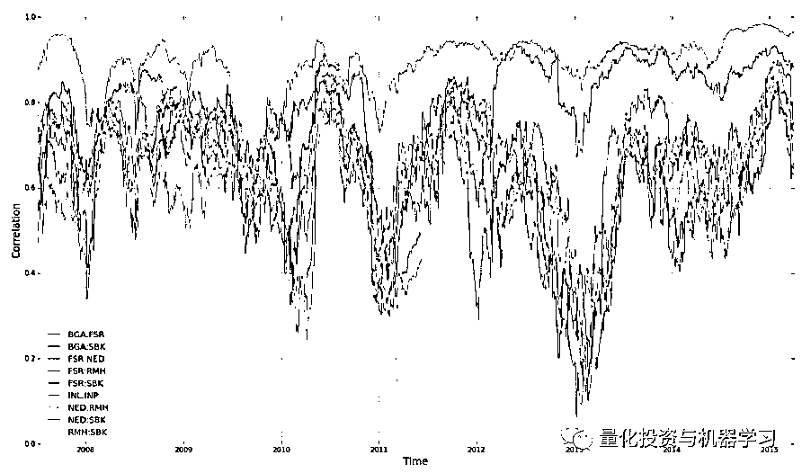

上图显示了某指数成分股的滚动相关性。这些股票之间应该存在相关性是有逻辑原因的，但是，从图中可以看出，在某些时候这些相关性会被打破。在我们看来，原因是杠杆。不同资产类别的股票由跨资产类别交易的公司联系在一起。

*"The correlations between financial quantities are notoriously unstable." *

*- **Paul Wilmott*

**另一个常被假设为平稳的变量是波动性，尤其是在使用随机过程来模拟证券收益和价格时**。波动性是衡量证券收益率随时间变化程度的指标。一般来说，以下关系适用于衍生证券：较高的波动性等于较高的衍生品价格。为什么？因为在到期时，因为衍生品在货币到期的可能性更高。因此，**如果你的模型低估了波动性，它可能会低估衍生品的价格。**

支撑 Black Scholes 模型的随机过程是布朗运动。该模型假设随时间的波动是恒定的。请注意在使用该模型时，**可能的收益范围与使用 CIR 过程对随机波动进行建模的 Heston 模型之间的差异。**

**公众号独家解读：**  

**BS 公式的另一个重要假设是：标的资产的波动率是一个常数。**在现实经济世界中，这个假设显然是无法成立的或存在缺陷的。大量实证研究已经表明，金融资产价格序列的波动率并非恒定常数，而是一个时序波动过程。

Heston 模型是由 Steven Heston 于 1993 年提出的描述标的资产波动率变化的数学模型。**Heston 模型是一个随机波动模型，这种模型假设资产收益率的波动率并不恒定，也不确定，而是跟随一个随机过程来运动**。

基础 Heston 模型假设 St，标的资产在时间 t 的价格，有一个随机过程来决定：

Vt：瞬时方差率，是一个**CIR 过程**，符合

其中

是相关系数为ρ的 Wiener 过程。

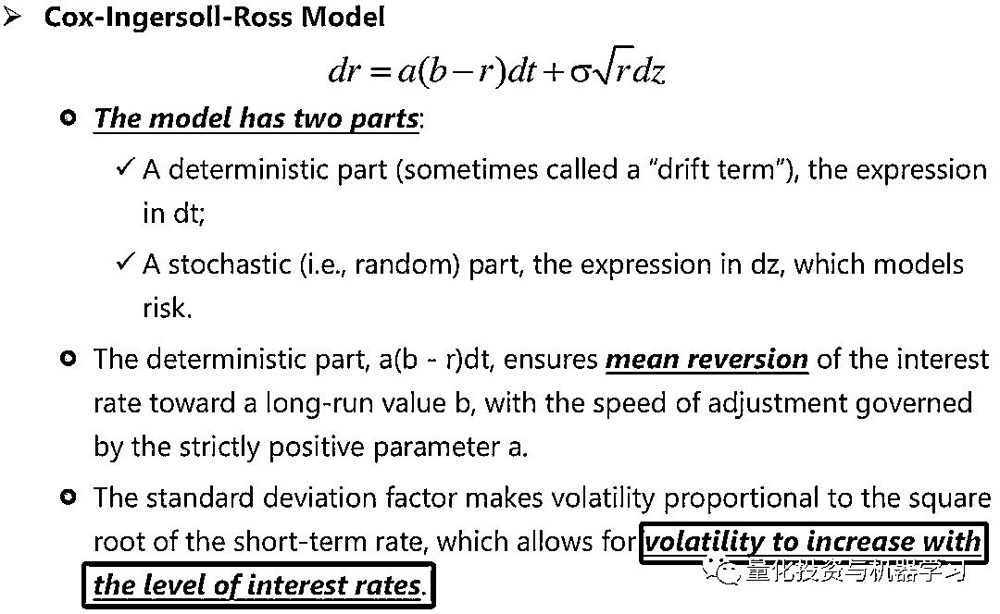

最后一段：**因为标准差因子使波动率与短期利率的平方根成正比，使得波动率随利率水平的增加而增加。****也就是考虑了利率期限结构！**

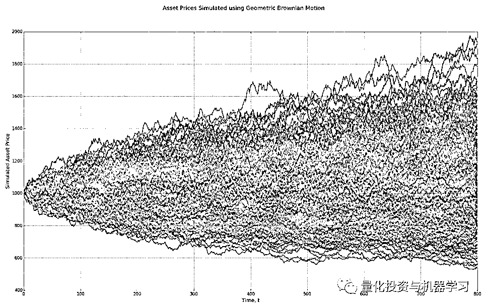

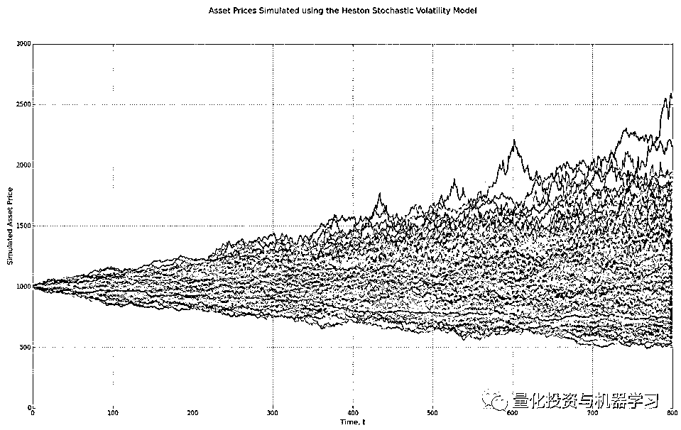

在第一张图中，潜在的终值范围在 500 到 2000 之间，而在第二张图中，潜在的终值范围在 500 到 2500 之间。这是波动性影响的一个例子。

最后，许多投资者在对策略进行回测时，**隐含地假设风险因子随着时间的推移而不变。**事实上，随着市场人口结构的变化，动量、价值、均值回归和企业规模等风险因子可能会随着时间的推移而变得更强或更弱。在泡沫达到顶峰时，动量推动着收益；在经济衰退最严重的时候，价值因子可能在推动收益率（如果有的话）。**风险因子是周期性的**。具体查看下面的文档：

下载地址：

*https://www.msci.com/documents/10199/71b6daf5-9e76-45ff-9f62-dc2fcd8f2721*

这个动画图很好地说明了动态分布以及遗传算法如何适应分布随时间的变化。风险管理需要这样的动态算法。

**正太性**

正态性是随机变量服从正态分布的假设。正态分布，也称为高斯分布。首先，任意数量的正态分布的组合可以得到一个正态分布。其次，正态分布可以更容易地在代数上进行操作，这意味着学者们可以更容易地以封闭的形式找到复杂问题优雅的解决方案。

许多模型，包括计算风险价值和几何布朗运动的 Delta-normal 方法。**实际上，市场回报呈现出过度的峰度和更肥的尾部。****这意味着，企业往往低估了它们所面临的尾部风险，对市场崩盘毫无准备。**

1987 年的股市崩盘就是一个很好的例子。1987 年 10 月 19 日，全球许多股票市场下跌了 20%以上。迄今为止，这仍是标普 500 指数自上世纪 50 年代以来单日最大跌幅。有趣的是，在正常的事件（即遵循正态分布的事件）中，这个事件本不应该发生。而且在统计上基本上是不可能的。

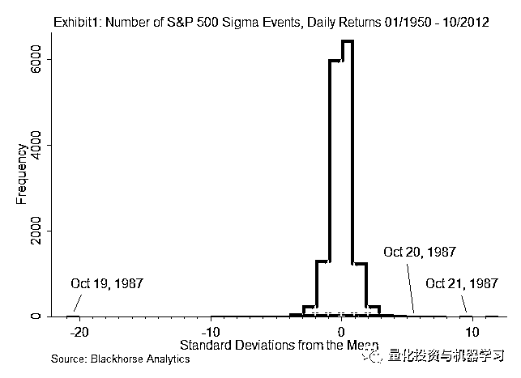

**公众号独家解读：**

### **计算风险价值 VaR 的 Delta-Normal 方法**

**Delta-normal 方法假设所有资产回报都是正态分布的。**由于投资组合回报是正态变量的线性组合，因此它也是正态分布的。例如， 在过去的 5 年中，计算所有风险因子的方差和相关性。然后，组合风险由假定为正态分布的许多因子的线性风险敞口和协方差矩阵的预测组合而成。

可以看看这篇讲解：

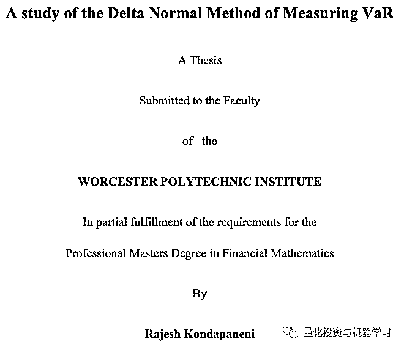

下载地址：

*https://web.wpi.edu/Pubs/ETD/Available/etd-050905-104553/unrestricted/Rajesh_Thesis.pdf*

还有这篇：

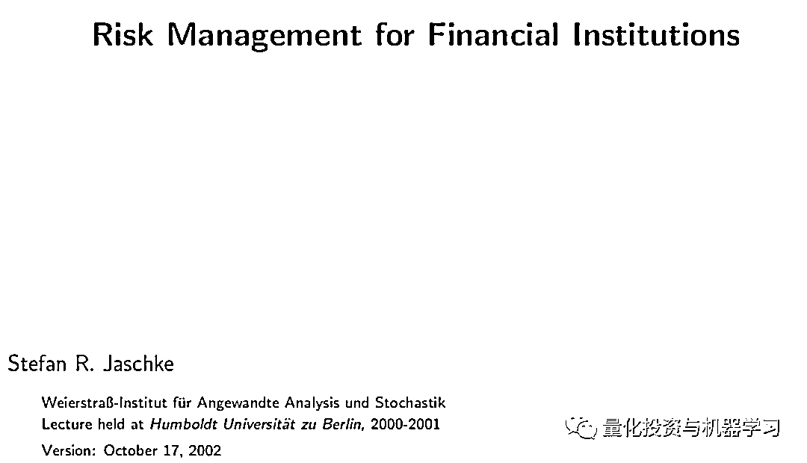

下载地址：

*http://citeseerx.ist.psu.edu/viewdoc/download?doi=10.1.1.543.8751&rep=rep1&type=pdf*

另一个关于正态分布假设如何使模型基本无用（至少对风险管理而言）的例子是李祥林（DavidX.Li）的信用违约概率模型（DavidX.Li 现在高金任职，有时候会碰到他在上课哦！）。当该模型假设投资组合中的信用违约率与高斯 Copula 相关，高斯 Copula 基本上是一个高维正态分布。不过话说回来，或许它们是这样，但分布发生了变化，也就是说，**由于美联储引发的宏观经济环境变化，这种分布不是平稳的。**

他于 2000 年在金融杂志《固定收益》（Journal of Fixed Income）上发表论文《论违约相关性：相依函数方法》《On Default Correlation: A Copula Function Approach》率先使用高斯 Copula 对信用衍生品投资组合中信用衍生品之间的违约相关性进行建模。他的方法是受到了人寿保险公司衡量死亡风险的启发。总之，李提出，如果给出一个信用曲线来衡量从现在到到期的任何时间点，任何指定的信用衍生品将经历信用违约的概率，那么信用衍生品的投资组合的概率就会经历一个信用违约被定义为的联合分布曲线。**在精算学中，Copula 是用来计算联合分布的。****高斯 copula 是最流行的。**

高斯 Copula 是一种高维正态分布，该图显示了二维正态分布

由于该模型要么是根据历史数据进行校准，要么是根据评级（评级也基于历史数据），要么是不知情的市场价格，因此该模型低估了信用衍生品投资组合的风险。这是因为信用违约的历史概率分布不能代表未来信用违约的概率分布。换句话说，这个分布是非平稳的。因为外部因素的变化，如过低的利率和道德风险，从根本上改变了购房者的行为，从而改变了未来信贷违约发生的可能性。

**该模型的另一个问题是，它假定基础信用衍生品的信用违约事件概率之间是独立的。**李知道这是一个危险的假设，他在自己的论文中写道：“信贷风险的独立性假设显然是不现实的；实际上，一组信贷的违约率在经济衰退时往往更高，而在经济繁荣时则更低。这意味着每一笔信贷都受到同一套宏观经济环境的制约，而且这些信贷之间存在某种形式的积极依赖关系。”因此，当房地产市场下跌，违约数量激增。

正常使用 Gaussian copula 来 price 的顺序是先求 expected tranche losses，再求 premium leg 和 default leg，两个 leg 在 initiation 时应该相等，就和 CDS 一样。这个时候 fair premium 就被求了出来。

而如果我们用在 market 先观察到的 tranche price，去反推 expected tranche losses，再去反推 correlation matrix，我们会发现一件非常神奇的事情。

每一个 tranche 相对应的 correlation matrix 不一样，但 underlying reference portfolio 并没有变。

这就说明我们的 assumption 已经出了问题。说到底还是 correlation 的问题。

source: "Financial Engineering and Risk Management Part II" by Columbia University

这张图揭示了 correlation 只能 capture linear dependence。而现实往往更复杂。 

总而言之，copula 提供了一种很美好的思路，但理想很美好，现实往往很残酷。它的出现是必然的，就像 BS，但也有过于 simplified assumption 的模型的通病

**尽管存在上述问题，但很难将其归咎于 David X. Li 和他的高斯 copula，把责任怪在任何一个人或一个机构身上都是不负责任的！因为高斯 copula 只是一个工具，和其他任何工具一样，它也有其局限性**。在量化世界中，这些限制现在被称为模型风险。模型风险是由于使用模型进行决策而导致的损失风险。2008 年金融危机之后，人们更加强调量化在不确定的世界中使用模型的风险。由于市场不遵守规则，因此对模型盲目信任没有好处。

不幸的是，同样对量化模型的盲目信任现在也被用于机器学习模型中。**一些基金依赖于神经网络来做出投资决策，而不需要花时间去理解大多数神经网络模型所基于的假设**。例如，与高斯 copula 一样，神经网络假设输入模式的分布是平稳的，并且没有异常值。如果说金融危机教会了我们什么的话，那就是**市场上没有什么是一尘不变的，也没有什么是正常的。我们主张在金融中正确使用机器学习和量化模型**。

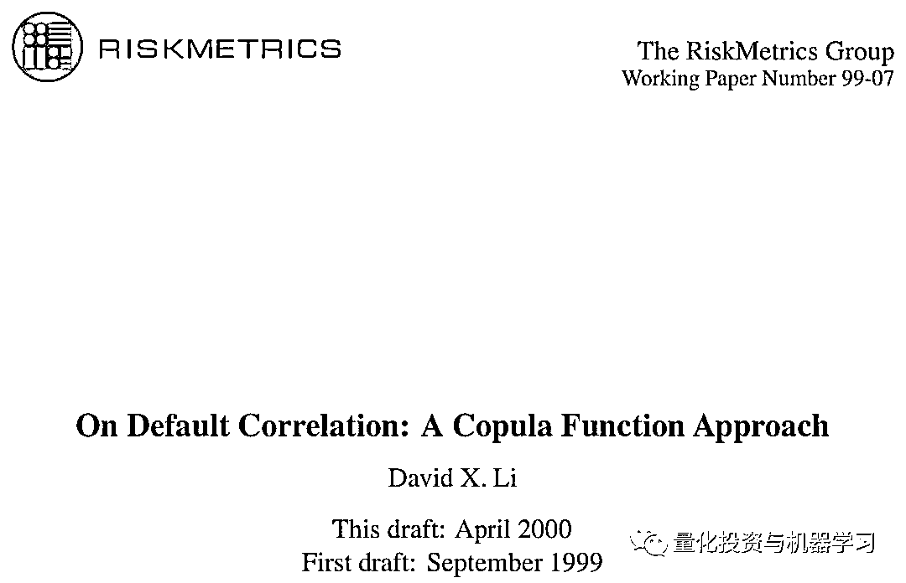

下载地址：

*http://cyrusfarivar.com/docs/li.defaultcorrelation.pdf*

**抽样偏差**

样本不能代表总体时，通常是在样本选择策略存在偏差时引起的。简而言之，这意味着样本中任意给定该模式出现的概率大于或小于总体中出现该模式的概率。有许多样本选择手段，但最流行的是简单随机抽样、系统抽样、分层抽样和多阶段抽样。

分层抽样可用于标记数据，从每个类中选择的模式数量与该类的大小成正比。例如，给定三个类（A、B 和 C）的模式，其中属于每个模式的模式百分比分别为 5％，70％和 25％，100 个模式的样本可以包含来自 A 类 5 个，B 类 70 个，以及来自 C 类的 25 个。这样做的**好处是样本具有代表性；****缺点是该策略只能用于标记数据**。

多阶段抽样是对未标记数据进行分层抽样的一种抽样选择策略。这一策略包括两个步骤：首先，利用 K-Means 聚类或蚁群优化等聚类算法将数据聚类；然后，对数据进行采样，以便在样本中表示每个类的比例数量。**该策略克服了对包含多个类的数据集进行简单随机采样的缺点，但依赖于所选聚类算法的性能。**

除了可能由于选择不同样本选择策略而产生的偏差；这就是维度的诅咒。维数的诅咒是，当产生一个代表性样本所需的模式数量随着这些模式中属性的数量呈指数增长时。在某些方面，**几乎不可能产生一个真正具有代表性的样本，因此任何统计数据最终都会有偏差。**

**过拟合、欠拟合**

**所谓过拟合（Overfitting），其实就是模型在训练样本中表现得过于优越，导致在验证数据集以及测试数据集中表现不佳**。当发生这种情况时，该模型被认为具有低泛化能力。在性能的角度上讲就是协方差过大（variance is large），同样在测试集上的损失函数（cost function）会表现得很大。

一般来说，当模型过于复杂时（或者更确切地说，考虑到模型的复杂性，当训练策略被过度简化时）会发生过拟合。**这方面的复杂性是指可以在模型中调整参数的数量。**  

*With four parameters I can fit an elephant, and with five I can make him wiggle his trunk. *

*- John von Neumann*

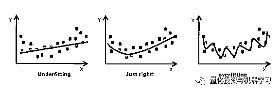

过拟合和欠拟合

随着时间的推移，简单的线性回归模型将优于大多数复杂模型。不幸的是，这些人往往忽略了欠拟合更为微妙的影响，即当模型过于简单而无法学习潜在的统计关系时。

这里我么你大概说一下**欠拟合 **：

因为对于给定数据集，欠拟合的成因大多是模型不够复杂、拟合函数的能力不够。 

判断欠拟合或过拟合最简单直接的方法是画出学习曲线（learning curve）。过拟合的表现是: 训练误差很低（甚至为 0），而测试误差很高，两者有很大的差距。而欠拟合的表现是: 训练误差和测试误差很接近，但都很高，下图是两个例子。

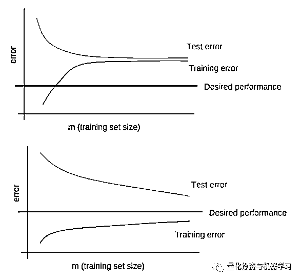

**过拟合与欠拟合的关系**

模型容量与过拟合欠拟合关系示意图

x 轴为模型能力，y 轴为损失，其中损失越低越合理。通常一个模型开始训练时处于欠拟合区域（如图形左侧）。理想下，这时随着训练进行训练损失和验证损失都开始下降，这表明我们的网络实际上正在学习。

但是，随着模型能力的提高（更深的网络、更多的神经元、没有正则化等等），我们将达到网络的“最佳能力”。从这点开始，我们的训练和验证损失/精确度开始出现分歧，且一个可看到的差距开始出现。我们的目标是限制这个差距，即保持模型的泛化能力。

如果我们不能限制这个差距，我们将进入“过拟合区域”（如图形右侧），从这点上，我们的训练损失或者保持稳定或者持续下降，但是我们的验证损失将稳定并最终增加。验证损失在一系列连续 epoch 上增加是过拟合的强烈指示。

如前所述，模型是否超出或不符合数据在很大程度上取决于用于开发模型的训练策略。为了减少过拟合，多数研究人员使用一种称为**交叉验证（cross-validation）**的方法。

交叉验证的核心思想是：**先将全部样本划分成两部分，一部分用来训练模型，称为训练集；****另外一部分用来验证模型，称为验证集。****随后考察模型在训练集和验证集的表现是否接近。****如果两者接近，说明模型具备较好的预测性能;如果训练集的表现远优于验证集，说明模型存在过拟合的风险**。当我们需要对不同超参数设置下的多个模型进行比较时，可以考察模型在验证集的表现，选择验证集表现最优的那组超参数作为最终模型的超参数，这一过程称为调参（parameter tuning）。

华泰证券金融工部曾经写过一篇报告**《对抗过拟合：****从时序交叉验证谈起》**，文中指出：

对人工智能及机器学习的广泛诟病之一在于过拟合：模型通常能完美地拟合样本内数据， 但是对样本外数据集的泛化能力较弱。在投资领域，一方面，投资者在阅读机器学习相关研究报告的过程中，面对一条漂亮的回测净值曲线，往往会持怀疑态度，认为历史上的优秀表现未必能延续。另一方面，**量化策略的研究者在调试机器学习模型的过程中，也往往会陷入过度调参的怪圈，刻意追求好的回测结果，而忽视了对参数泛化能力的考量**。这些 因素客观上妨碍了机器学习模型在投资领域的应用。

**传统交叉验证方**法包括**简单交叉验证、K 折交叉验证、留一法和留 P 法**。这些方法的基本思想和共同点在于，假设所有样本服从独立同分布，选择其中一部分作为训练集用以训 练模型，剩下一部分作为验证集用以评估模型的真实性能。上述交叉验证方法在机器学习领域被广泛应用。

然而，**金融领域有别于其它领域的一个重要特点是样本的时序特性，一 段时间区间内的样本不一定满足独立同分布（大部分时候不满足）**，这与传统交叉验证的 假设相违背。

基于传统交叉验证在处理时序数据上的缺陷，研究者提出一种新的交叉验证方法：

**时序交叉验证**

其基本思想是：**采用时间靠前的样本作为训练集，时间靠后的样本作为验证集**。Tashman(2000)、Varma 和 Simon(2006)、Bergmeir 和 Benitez(2012)等研究表明， 时序交叉验证方法在时序数据上的表现优于传统交叉验证方法。

**幸存者偏差**

公众号在 2016 年的时候，专门写过一篇文章叫[**《量化交易七宗罪》**](https://mp.weixin.qq.com/s?__biz=MzAxNTc0Mjg0Mg==&mid=2653283543&idx=1&sn=f7376931ac3a99647b26ba5fa0c597d7&scene=21#wechat_redirect)，里面专门讲到了**幸存者偏差（Survivorship bias）。**

**题外话：**

2016 年的时候，公众号还是个懵懂的孩子，还没什么人关注我们知道我们。现在回顾之前的得峥嵘岁月，不禁感慨万千！ 

幸存者偏差是投资者最常见的错误之一。**大多数人都知道生存偏差，但很少有人知道它的意义。**

我们在回测的时候倾向于只使用当前存在的公司，这意味我们剔除了那些因为破产、重组而退市的公司的影响。当我们在沪深 300 这 300 只股票中做策略的时候（每半年沪深 300 成分股会做调整），如果没有考虑到那些被剔除出沪深 300 指数成分股的股票的影响，举个例子，歌华有线（600037）是 16 年 6 月 13 日纳入沪深 300 指数的，如果我们在做策略的时候选用了现在的沪深 300 指数的成分股作为股票池，并且固定下来用来做回测，这样 6 月 13 日之前的回测结果是不正确的，因为 6 月 13 日之前的成分股里并没有歌华有线，而是包含了一些在 6 月 13 日被剔除出成分股的股票，而这些被剔除的股票没有出现在你策略的股票池里，也就是说只利用了现在成分股的信息对过去做了回测，**剔除了那些在未来因为业绩或者股价表现不好而被剔除出沪深 300 成分股的股票的影响。**

下面我们通过几张图展现一下生存偏差带来的影响究竟有多大。

下图展示的是，MSCI 欧洲指数成分股等权重作为一个投资组合在过去的表现。蓝线为正确的投资组合，红线为存在生存偏差的组合。我们可以看到红线明显收益高于蓝线，这会使得在回测时高估投资组合的收益。

下图是我们自己画的沪深 300 成分股的情况。

从上面两张图，我们已经看到生存偏差对回测结果的影响很大。而更令人震惊的是，在做因子分析时，它有可能带来完全相反的结果。

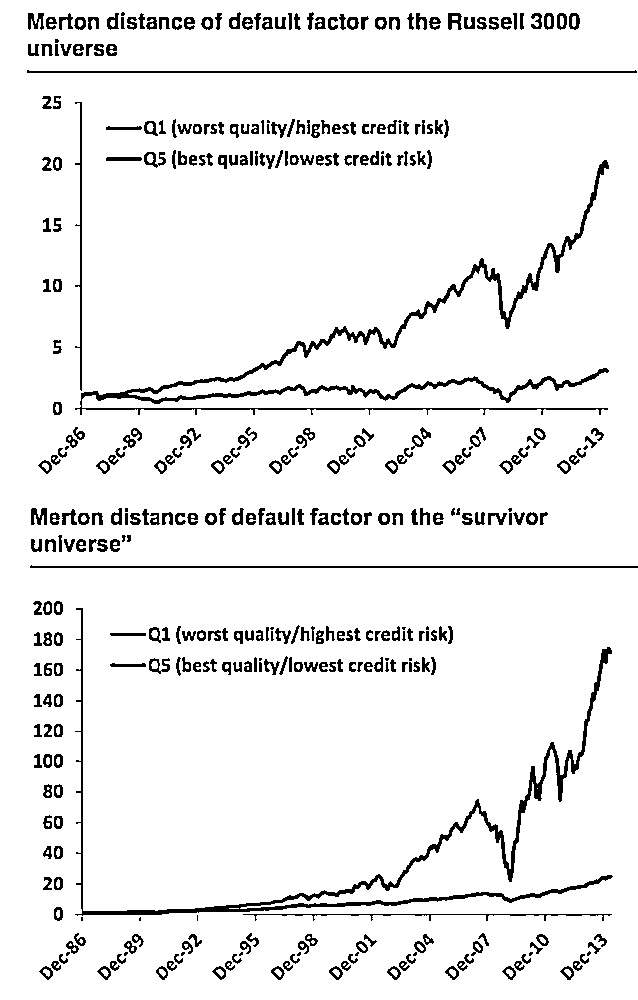 

上面两张图是在罗素 3000 指数的测试结果，选取的因子为公司质量/公司的债务风险，蓝线的为因子数值高的一篮子股票，红线为因子数值低的一篮子股票。第一张图是不存在生存偏差的结果，也是符合我们的直观逻辑的，公司质量越好、债务风险越低，未来的收益也就越高。第二张图是存在生存偏差的，也就是将现在的罗素 3000 指数的成分股固定下来对过去做回测，我们得到了公司质量越差债务风险越高，未来收益越高的错误结果。这也非常容易解释，**因为存在生存偏差之后，我们的股票池里没有那些在过去退市破产的股票，而在这个股票池里选出来的质量差债务风险高的股票恰恰是那些在未来实现困境反转的股票，所以它的组合收益会偏高**。

上面只是一个例子，还有很多的因子在存在生存偏差的时候，会得到完全相反的结果，具体可以看德银的报告。

大家还可以看一下这篇研究：

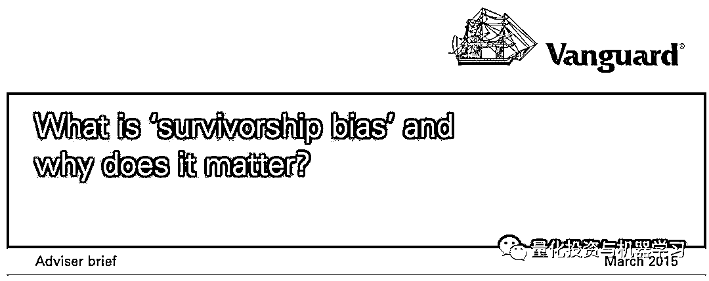

下载地址：

*https://www.vanguard.co.uk/documents/adv/literature/survivorship-bias.pdf*

**遗漏变量偏差**

当一个模型被建立时，遗漏了一个或多个重要的因果变量，就会产生遗遗漏变量偏差(omitted variable bias)。当模型不正确地通过高估或低估其他变量的影响来补偿缺失的变量时，就会产生偏差。尤其当包含的变量与缺失的因果变量相关时。另外，缺失的变量可能导致更大的预测误差。

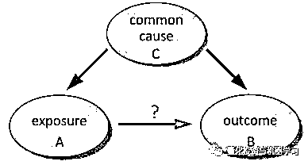

识别可能对因变量具有预测能力的自变量并不简单。一**种方法是确定解释因变量中最大方差的变量集**。这种方法称为最佳子集。或者，你可以识别特征向量（可用变量的线性组合），它们在因变量中占最大方差。这是执行主成分分析时采用的方法。主成分分析的一个问题是，它也可能会过度拟合数据，而特征向量可能不会随着时间的推移而很好地推广。最后，你可以迭代地向模型添加变量。这是采用逐步多元线性回归和自适应神经网络的方法。

**结论**

不可能开发出一个真正无偏见的模型。无论是你的假设是显式的还是隐式的，还是实际在开发过程对模型产生的偏见……即使你可以避免这两种偏见的来源，模型用户仍然会产生认知偏差。所有这些都增加了模型风险，即模型的错误风险足以造成经济损失。尽管如此，本文最重要的结论是：**尽管所有模型都是错的，但其中有些是有用的！**

*—End—*

量化投资与机器学习微信公众号，是业内垂直于**Quant**、**MFE**、**CST**等专业的主流量化自媒体。公众号拥有来自**公募、私募、券商、银行、海外**等众多圈内**10W+**关注者。每日发布行业前沿研究成果和最新资讯。

