# 技术分析！要我怎么说！

> 原文：[`mp.weixin.qq.com/s?__biz=MzAxNTc0Mjg0Mg==&mid=2653293026&idx=1&sn=7556c630307bdbc4018824116754020a&chksm=802dcbf7b75a42e1f9c08af735d1e2fbade1a3150aca38d522f1a86f88bdaf3d9b397dacc953&scene=27#wechat_redirect`](http://mp.weixin.qq.com/s?__biz=MzAxNTc0Mjg0Mg==&mid=2653293026&idx=1&sn=7556c630307bdbc4018824116754020a&chksm=802dcbf7b75a42e1f9c08af735d1e2fbade1a3150aca38d522f1a86f88bdaf3d9b397dacc953&scene=27#wechat_redirect)

**标星★公众号     **爱你们♥

作者：David H Bailey

编译：route | 公众号翻译部

**近期原创文章：**

## ♥ [5 种机器学习算法在预测股价的应用（代码+数据）](https://mp.weixin.qq.com/s?__biz=MzAxNTc0Mjg0Mg==&mid=2653290588&idx=1&sn=1d0409ad212ea8627e5d5cedf61953ac&chksm=802dc249b75a4b5fa245433320a4cc9da1a2cceb22df6fb1a28e5b94ff038319ae4e7ec6941f&token=1298662931&lang=zh_CN&scene=21#wechat_redirect)

## ♥ [Two Sigma 用新闻来预测股价走势，带你吊打 Kaggle](https://mp.weixin.qq.com/s?__biz=MzAxNTc0Mjg0Mg==&mid=2653290456&idx=1&sn=b8d2d8febc599742e43ea48e3c249323&chksm=802e3dcdb759b4db9279c689202101b6b154fb118a1c1be12b52e522e1a1d7944858dbd6637e&token=1330520237&lang=zh_CN&scene=21#wechat_redirect)

## ♥ 2 万字干货：[利用深度学习最新前沿预测股价走势](https://mp.weixin.qq.com/s?__biz=MzAxNTc0Mjg0Mg==&mid=2653290080&idx=1&sn=06c50cefe78a7b24c64c4fdb9739c7f3&chksm=802e3c75b759b563c01495d16a638a56ac7305fc324ee4917fd76c648f670b7f7276826bdaa8&token=770078636&lang=zh_CN&scene=21#wechat_redirect)

## ♥ [一位数据科学 PhD 眼中的算法交易](https://mp.weixin.qq.com/s?__biz=MzAxNTc0Mjg0Mg==&mid=2653290118&idx=1&sn=a261307470cf2f3e458ab4e7dc309179&chksm=802e3c93b759b585e079d3a797f512dfd0427ac02942339f4f1454bd368ba47be21cb52cf969&token=770078636&lang=zh_CN&scene=21#wechat_redirect)

## ♥ [基于 RNN 和 LSTM 的股市预测方法](https://mp.weixin.qq.com/s?__biz=MzAxNTc0Mjg0Mg==&mid=2653290481&idx=1&sn=f7360ea8554cc4f86fcc71315176b093&chksm=802e3de4b759b4f2235a0aeabb6e76b3e101ff09b9a2aa6fa67e6e824fc4274f68f4ae51af95&token=1865137106&lang=zh_CN&scene=21#wechat_redirect)

## ♥ [如何鉴别那些用深度学习预测股价的花哨模型？](https://mp.weixin.qq.com/s?__biz=MzAxNTc0Mjg0Mg==&mid=2653290132&idx=1&sn=cbf1e2a4526e6e9305a6110c17063f46&chksm=802e3c81b759b597d3dd94b8008e150c90087567904a29c0c4b58d7be220a9ece2008956d5db&token=1266110554&lang=zh_CN&scene=21#wechat_redirect)

## ♥ [优化强化学习 Q-learning 算法进行股市](https://mp.weixin.qq.com/s?__biz=MzAxNTc0Mjg0Mg==&mid=2653290286&idx=1&sn=882d39a18018733b93c8c8eac385b515&chksm=802e3d3bb759b42d1fc849f96bf02ae87edf2eab01b0beecd9340112c7fb06b95cb2246d2429&token=1330520237&lang=zh_CN&scene=21#wechat_redirect)

## ♥ [WorldQuant 101 Alpha、国泰君安 191 Alpha](https://mp.weixin.qq.com/s?__biz=MzAxNTc0Mjg0Mg==&mid=2653290927&idx=1&sn=ecca60811da74967f33a00329a1fe66a&chksm=802dc3bab75a4aac2bb4ccff7010063cc08ef51d0bf3d2f71621cdd6adece11f28133a242a15&token=48775331&lang=zh_CN&scene=21#wechat_redirect)

## ♥ [基于回声状态网络预测股票价格（附代码）](https://mp.weixin.qq.com/s?__biz=MzAxNTc0Mjg0Mg==&mid=2653291171&idx=1&sn=485a35e564b45046ff5a07c42bba1743&chksm=802dc0b6b75a49a07e5b91c512c8575104f777b39d0e1d71cf11881502209dc399fd6f641fb1&token=48775331&lang=zh_CN&scene=21#wechat_redirect)

## ♥ [AQR 最最最新 | 计量经济学应用投资失败的 7 个原因](https://mp.weixin.qq.com/s?__biz=MzAxNTc0Mjg0Mg==&mid=2653292186&idx=1&sn=87501434ae16f29afffec19a6884ee8d&chksm=802dc48fb75a4d99e0172bf484cdbf6aee86e36a95037847fd9f070cbe7144b4617c2d1b0644&token=48775331&lang=zh_CN&scene=21#wechat_redirect)

## ♥ [关于高盛在 Github 开源背后的真相！](https://mp.weixin.qq.com/s?__biz=MzAxNTc0Mjg0Mg==&mid=2653291594&idx=1&sn=7703403c5c537061994396e7e49e7ce5&chksm=802dc65fb75a4f49019cec951ac25d30ec7783738e9640ec108be95335597361c427258f5d5f&token=48775331&lang=zh_CN&scene=21#wechat_redirect)

## ♥ [新一代量化带货王诞生！Oh My God！](https://mp.weixin.qq.com/s?__biz=MzAxNTc0Mjg0Mg==&mid=2653291789&idx=1&sn=e31778d1b9372bc7aa6e57b82a69ec6e&chksm=802dc718b75a4e0ea4c022e70ea53f51c48d102ebf7e54993261619c36f24f3f9a5b63437e9e&token=48775331&lang=zh_CN&scene=21#wechat_redirect)

## ♥ [独家！关于定量/交易求职分享（附真实试题）](https://mp.weixin.qq.com/s?__biz=MzAxNTc0Mjg0Mg==&mid=2653291844&idx=1&sn=3fd8b57d32a0ebd43b17fa68ae954471&chksm=802dc751b75a4e4755fcbb0aa228355cebbbb6d34b292aa25b4f3fbd51013fcf7b17b91ddb71&token=48775331&lang=zh_CN&scene=21#wechat_redirect)

## ♥ [Quant 们的身份危机！](https://mp.weixin.qq.com/s?__biz=MzAxNTc0Mjg0Mg==&mid=2653291856&idx=1&sn=729b657ede2cb50c96e92193ab16102d&chksm=802dc745b75a4e53c5018cc1385214233ec4657a3479cd7193c95aaf65642f5f45fa0e465694&token=48775331&lang=zh_CN&scene=21#wechat_redirect)

## ♥ [拿起 Python，防御特朗普的 Twitter](https://mp.weixin.qq.com/s?__biz=MzAxNTc0Mjg0Mg==&mid=2653291977&idx=1&sn=01f146e9a88bf130ca1b479573e6d158&chksm=802dc7dcb75a4ecadfdbdace877ed948f56b72bc160952fd1e4bcde27260f823c999a65a0d6d&token=48775331&lang=zh_CN&scene=21#wechat_redirect)

想象下，天气预报中，播报员展示一幅当地气温最近变化图，指出“趋势”和“波浪”，然后得出“突破形态”。大部分人不会相信这种预报，否则后果不堪设想。

**你以为是 MACD 呢******

或者设想下，病人在诊所拍了张心电图，医师用手比划并标出黄金分割比；在复核病人脉搏血压数据时，指出“三角形态”。这种情况病人肯定不敢再请这位医师看病。

上述情况并没有发生在科研领域，原因是这些领域的数据分析标准近年来大幅提高。典型的有美国计量协会（ASA）对 P 值和显著性统计的使用发表的声明。该声明批评所谓的“P-hacking”，即通过在单一组数据集上测试不计其数的假说，直到其中一个假说满足要求的 P 值。

**券商及金融媒体眼中的技术分析**

那么，对于那些推动技术分析的众多主要券商和金融媒体机构，包括“趋势”，“波浪”，“突破模式”，“三角形模式”和“斐波那契比率”，又是什么呢？

**▍嘉信理财（Charles Schwab）**

认为技术分析对主动交易员来说不可或缺。

**▍美林银行（Merrill Lynch）**

提供一本技术分析手册，其中章节标题有“价格动量指标”“阻力支撑”“斐波那契”等。

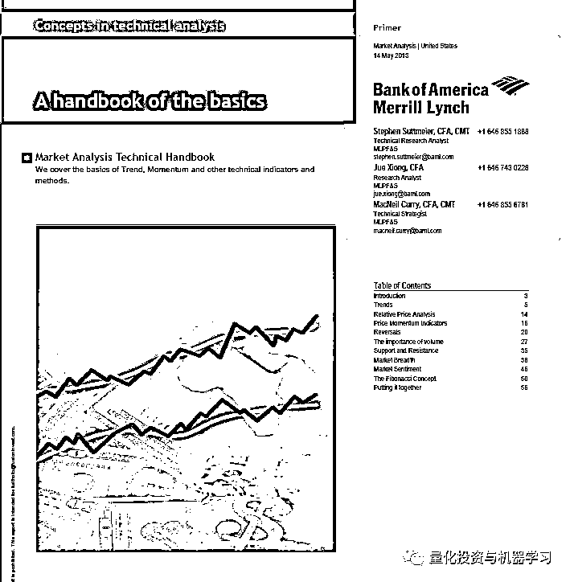

**▍美国银行（Bank of America）和美林银行（Merrill Lynch）**

Bank of America Merrill Lynch 全球主要 FICC 技术策略师 Paul Ciana 引用了“双突破”模式，相信债券市场将很快反弹。

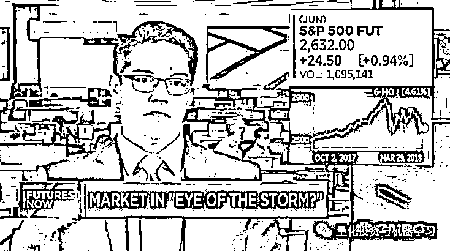

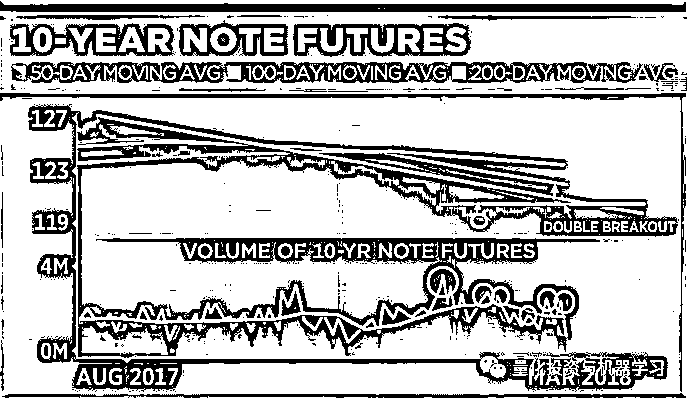

**▍富达投资集团（Fidelity Investment Group）**

认为技术分析适用于散户和职业交易员，可以帮助他们识别进出场点位，实现收益目标。

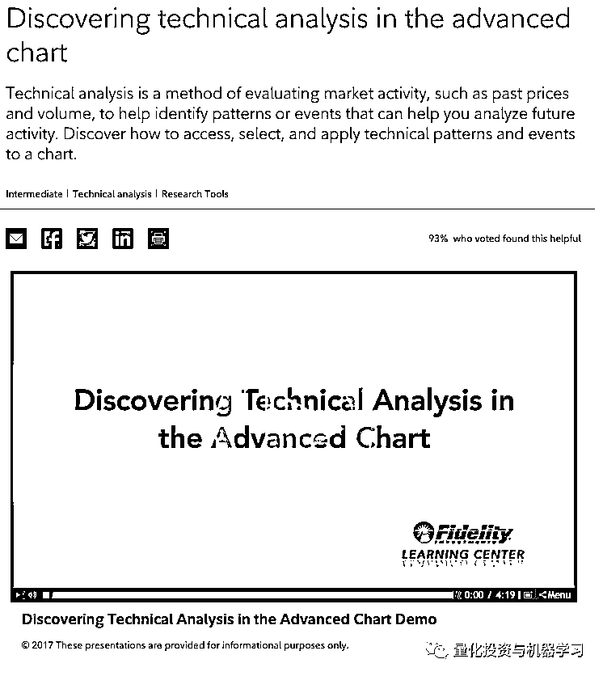

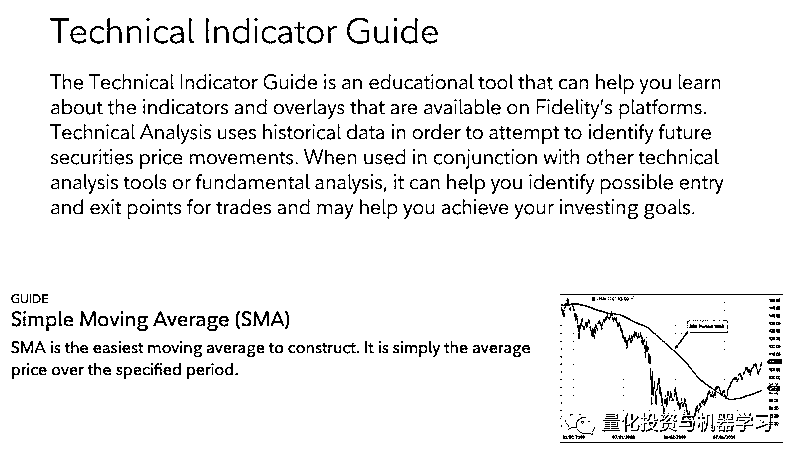

**▍E-Trade**

供了技术分析的介绍。在本文的介绍中，我们了解到技术分析是建立在几个假设之上的，其中两个假设是“市场反应一切”和“历史会重演”。

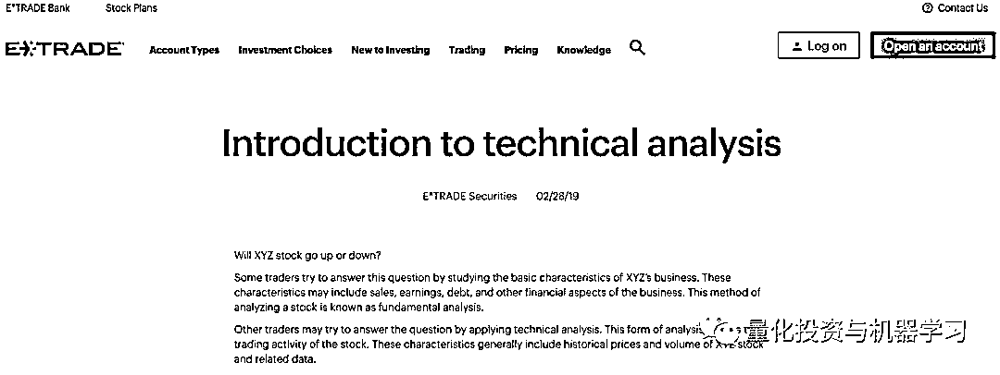

https://us.etrade.com/knowledge/library/stocks/intro-to-technical-analysis

**▍Barrons（巴伦周刊）**

巴伦周在此解释为什么他们认为技术分析很重要：

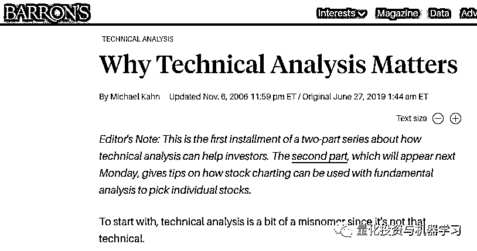

https://www.barrons.com/articles/SB116283108833814528

如果一只股票正在上涨，然后开始横盘整理，因为多头和空头都不确定下一步该做什么，随着价格朝两个方向的波动减弱，图表上就会出现一种盘绕的模式。图表观察人士等待价格上传三角形上方，然后买进该股，获利的可能性更大。

**▍华尔街日报**

《华尔街日报》在下面列出了大量关于技术分析的文章。在这篇文章中，一个人读到“股票不可能永远上涨，但技术人员说，熊市的坏消息是，几乎没有明确的卖出信号出现。”

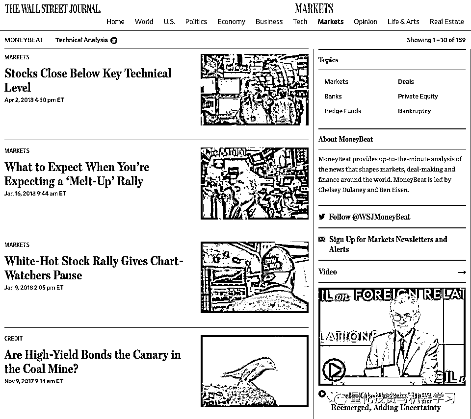

https://blogs.wsj.com/moneybeat/tag/technical-analysis/

**▍Bloomberg （彭博）**

彭博在这里提供了一个专门用于技术分析的博客。本博客引用一位分析师的话说，技术分析的最佳定义是“利用技术改善投资结果”。

文章地址：

https://www.bloomberg.com/professional/blog/technical-analysis-transformed/

**▍MarketWatch**

MarketWatch 提供了一个博客，在这里推广技术分析工具：

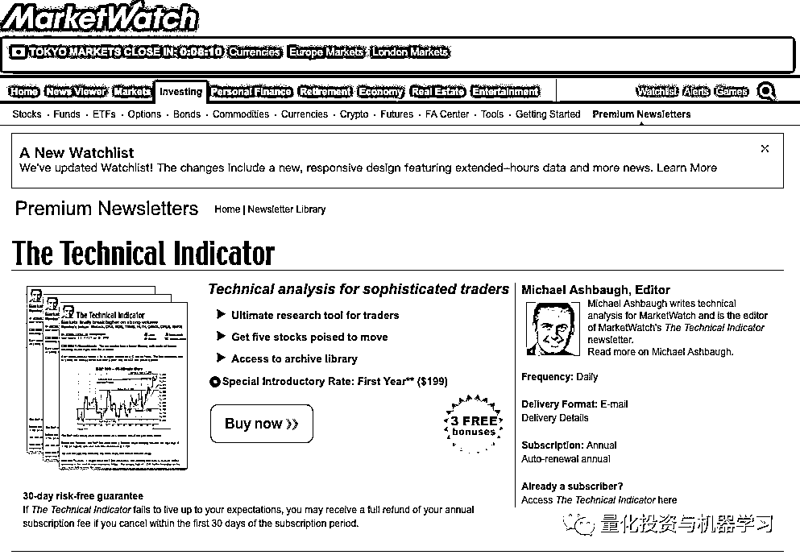

https://www.marketwatch.com/premium-newsletters/technical-indicator

使用烛台图表和专有工具，该工具包建立短期市场意见，并确定模式，趋势，支持和阻力水平，移动平均线，有吸引力的进入和退出点。

部分技术分析人士还推崇艾略特波浪理论（Elliott Wave Principle）作为投资工具等等。

**为什么技术分析不起作用**

因为对图表的解读本身就很模糊和模棱两可，当然对解读后的买卖行为也就不可能有什么共识。

****▍**举证一**

最近一项研究分析了 68 位市场预测者的预测记录（记录由 CXO Advisory 采集）：

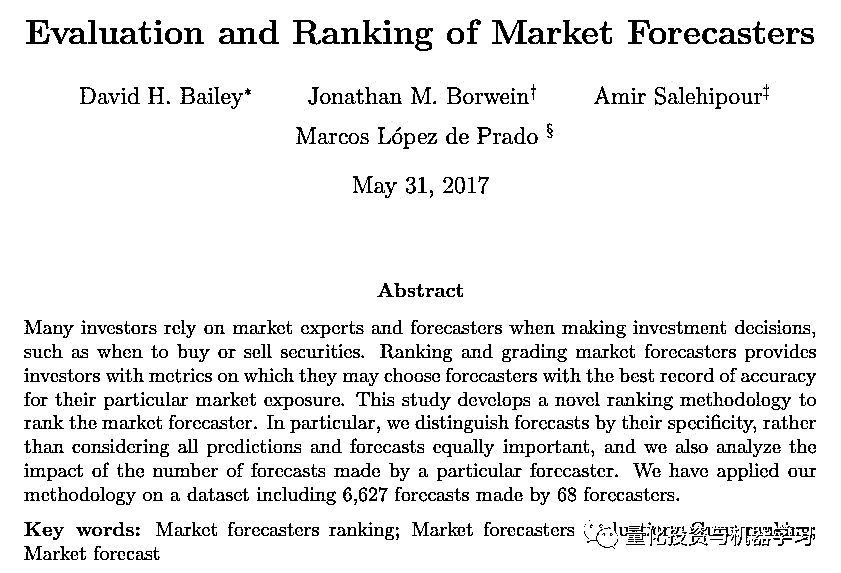

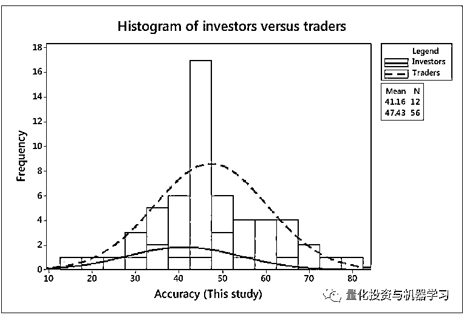

投资者和交易员的准确性直方图

投资者组中的预测者的准确性低于交易员组。

论文地址：

*https://papers.ssrn.com/sol3/papers.cfm?abstract_id=2944853*

根据预测精确度采用新颖的加权方式进行打分。68 位预测者中有 27 位懂得运用技术分析。结果如何？**这 27 位预测者的平均得分 44.1，比 68 位预测者的总平均分还低。**事实上没有任何证据证明技术分析能有效预测市场。

****▍**举证二**

市场分析师 Laszlo Birinyi 在**《金融异术》**（The Heretics ofFinance）这本书中直言不讳指出技术分析无效。  

****▍**举证三**

市场运作机制的基本考虑。许多量化基金和其他金融机构采用复杂的数学算法和海量数据集，部署在先进的大规模计算设备上，以毫秒甚至微妙为单位运行。更重要的是，这样越来越多的机构持续盈利。而且，这些项目被卷入了一场“军备竞赛”中，有效的策略很快会被市场上其他机构模仿，优势迅速消失。这部分解释了为什么市场价格是随机游走的。那些鼓吹技术分析的人想让我们相信受过严格训练的数学家和他们复杂的算法全都错过了一些简单基本的方案**，而任何人只要拥有一台笔记本、一套绘图软件和其他一些简单工具就可以利用这些方案去击败市场。****很显然不可能存在这么简单的方案**。

**为什么这很重要**

技术分析在金融新闻报道中几乎无处不在。更重要的是，散户、养老金、共同基金和其他一些机构一直在用技术分析。这就是问题所在，成千上万的投资者深信技术分析可以击败市场。

在某福布斯访谈中有提到：

“技术分析提供毫无客观价值的指引，鼓励交易员和投资者下注。如果同样无效的数据分析手段用在医学或医药界，恐怕早已官司缠身。从银行到券商的各种金融服务提供商都在推动未经测试，未经证实的技术分析策略。鼓励交易者和投资者投入资金，同时提供没有客观信息价值的指导。实际上，金融中最重要的情节不是技术分析，而是夏普比率的统计分布等。“

如上所述，因为要判断进出场点位，所以**择时**就显得至关重要。不过专业分析师一致认为市场择时是非常差的策略。除了多出的费用外，在大部分案例中投资者都在市场触底前恐慌出货，错过了大幅反弹。一位财务顾问曾报道说至少一位客户在 08-09 的大跌中割肉离场，然后再也没恢复到原先净值水平。其他客户在市场高点时孤注一掷，相反在市场底部时却不情愿买入。

**成千上万的投资者择时失败，这也是散户表现平庸的一个主要原因。**

**曙光**

随着量化及机器学习在金融领域取得的成功，越来越多的技术分析者也开始探究这些先进理念。有量化及机器学习背景的分析师供不应求。

**但是同样重要的是，当越来越多的证据表明技术分析无效或过时，会有更多的人愿意承认“皇帝没穿新装”，即技术分析无效。**

*—End—*

量化投资与机器学习微信公众号，是业内垂直于**Quant**、**MFE**、**CST**等专业的主流量化自媒体。公众号拥有来自**公募、私募、券商、银行、海外**等众多圈内**10W+**关注者。每日发布行业前沿研究成果和最新资讯。

