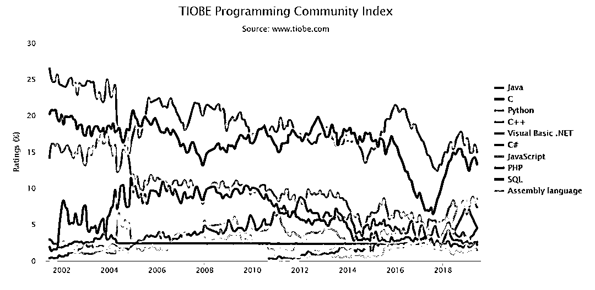

# Quant 时代的紧迫感！

> 原文：[`mp.weixin.qq.com/s?__biz=MzAxNTc0Mjg0Mg==&mid=2653293004&idx=1&sn=72427cd5ed30538e059da15732215603&chksm=802dcbd9b75a42cfdbced4a0f958253c978363b6e43eeb802642ef6419197bf892611d0f8583&scene=27#wechat_redirect`](http://mp.weixin.qq.com/s?__biz=MzAxNTc0Mjg0Mg==&mid=2653293004&idx=1&sn=72427cd5ed30538e059da15732215603&chksm=802dcbd9b75a42cfdbced4a0f958253c978363b6e43eeb802642ef6419197bf892611d0f8583&scene=27#wechat_redirect)

**标星★公众号     **爱你们♥

**前言**

随着人工智能与大数据的不断发展，量化投资会随着这些新技术的发展越来越流行。跨学科跨专业的人才不断涌入。但不管你是金工、数学或者统计背景出身，还是物理、计算机等工科类背景出身。

J.P. Morgan 也曾说过：量化研究人员的技能与数据科学家的技能几乎是一样的。因此，**拥有计算机科学、统计学、数学、金融工程、计量经济学和自然科学背景的现有买方和卖方量化投资者应该重塑自己**。

既然想在这个圈子里混，那你就必须更多的了解量化行业的方方面面，这样才可以做到心中有数，游刃有余！

****Quant 的选择与努力**** 

在这里，我们列出了以下类型的量化岗位方向类型以及从事这些岗位的优劣势：

**▍Desk Quant**

开发直接被交易员使用的价格模型。优势是接近交易中所遇到的 money 和机会。劣势是压力很大。

## **▍Model Validating Quant**

## 独立开发价格模型，不过是为了确定 desk quant 开发的模型的正确性。优势是更轻松,压力比较小。劣势是这种小组会比较没有作为而且远离 money。

## **▍Front Office Quants（FOQs）**

开发和管理计算市场资产价格的模型。

## **▍投资/资产管理 Quant**

开发减少投资损失的模型。

## **▍Research Quant**

Research Quant 尝试发明新的价格公式和模型，有时还会执行 blue-sky research。优势是比较有趣，而且你学到很多东西。劣势是有时会比较难证明有你这个人存在（跟科学家一样，没有什么大的成果就没人注意你）

## **▍Quant Developer**

其实就是名字被美化的程序员，但收入很不错而且很容易找到工作。这种工作变化很大。 它可能是一直在写代码，或者调试其他人的大型系统。

## **▍Statistical Arbitrage Quant**

Statistical arbitrage Quant 在数据中寻找自动交易系统的模式（就是套利系统）。这种技术比起衍生品定价的技术有很大的不同，它主要用在对冲基金里。而且这种位置的回报是极不稳定的。

## **▍Capital Quant**

capital Quant 建立银行的信用和资本模型。相比衍生品定价相关的工作，它没有那么吸引人，但是随着巴塞尔 II 银行协议，它变的越来越重要。你会得到不错的收入（但不会很多）。更少的压力和更少的工作时间。

这些是市场上在其他各种类型中占主导地位的一些角色。**开发商也在高频交易（HFT Trading）领域受到追捧。**

进入高频交易有几种途径，但其中大多数需要在以下一门或多门科学（**如数学、物理、计算机科学或电子工程**）中具备广泛的技术技能。

**关于国内的 Quant**

国内的量化工程师一般分两个方向：

## **▍量化策略工程师**

做金融相关的量化策略编写、模型定价、风险控制等，数学和统计要求比较高。

## **▍量化 IT 工程师**

开发和测试量化交易系统软件，实现策略代码实盘运行，跟程序员几乎无异。

**工作岗位集中在券商和期货公司的金工组或者 IT 部，商业银行的金工组，公募和私募基金公司，量化交易平台互联网公司以及软件公司。**

**还有一类属于交易员：**

## **▍****自营交易员**（用公司的资金做交易的人）。

## **▍**机构，买方，**基金经理**（用别人的钱做交易，做出决定或设计系统，不一定负责执行交易）。

## **▍****机构，卖方**（例如投资银行的期权交易者，使用银行资本但不是主要的风险承担者）。

## **▍**自筹资金的**独立交易员**（交易自有资金的人）。

**你的雇主需要什么**

  首先你要了解你会去哪里，然后了解你的雇主需要你具备什么样的条件与技能？

• **商业银行**（例如：汇丰银行、招商银行）

**• 投资银行**（例如：高盛、UBS）

**• 对冲基金**（例如：Citadel、九坤）

**• 会计师事务所**（例如：PWC、EY）

**• 软件公司**（例如：Wind、DataYes）

雇主的需要：

**1、对于交易策略开发的职位，熟悉 Python 将是一个优势。**

要成为一名 Python 开发人员，除了具备股票市场的领域知识和强大的逻辑技能外，还应具备 Python 等编程语言的高级技能。包括其所有库，如 NumPy，SciPy，Pandas，Scikit-Learn，HDF5 和 TensorFlow。

**所有掌握 Python 真的是你必须要有的一项技能。**

TIOBE 编程语言最新的排行榜（6 月） 

**Python 排名再度超越 C++，拿下第三名的位置！**

根据以往的数据，Python 的 TIOBE 指数在本月确实创下了历史新高，达到 8.530%，远超 C++ 的 7.384%。TIOBE 甚至认为，如**果 Python 可以保持这种增长速度，有机会在 3 到 4 年内在 TIOBE 语言排行榜上取代 C 和 Java 的位置，从而成为世界上最流行的编程语言。**

因为 Python 的简洁又属于胶水语言，几行代码就可以搞定很多事情。所以如此方便且易上手的编程语言，自然会深受欢迎。

TOP 10 编程语言 TIOBE 指数走势（2002-2018）

在 eFinancialCareers 平台上，我们分析了纽约和伦敦的金融编程岗位：Python 的平均年薪为$117k (£92k) ，如下图所示：

可见 Python 在金融领域的重要性。

**2、分析能力**

对于任何量化交易者/开发者而言，具有分析性思维是一种非常重要的品质。

**3、数学技能**

由于量化投资的核心围绕着算法，数据和编程，具有合理的编程技能以及对统计和微积分的基本理解对于算法/高频交易中的任何求职者都很重要。

**4、策略的市场考虑**

在制定任何策略时，重要的是要了解与该策略相关的风险和回报，以确定其是否在市场中具有优势。这是在策略的回测中完成的。在开始实施实盘之前，还需要考虑交易频率，杠杆等。单一策略并不能保证年复一年的利润。我们必须使用数学模型和统计数据定期制定和更新策略，以保持市场的盈利。

#### **5、了解金融市场**

量化投资不光涉及技术问题，你可能还要对整个行业、市场有一个深刻的了解！

除此之外，还可以增值以下这些技能：

****机器学习助你一臂之力****

**全球的很多金融机构已开始选择了机器学习算法进行交易。一些较大的交易公司如 Blackrock，Two Sigma 也在使用人工智能来挑选股票，摩根大通和 IBM 正试图将 AI 纳入金融监管和合规。事实上，有一些纯粹基于人工智能的对冲基金，即 Rebellion Research 和 KFL Capital。他们根据其交易策略开发自己的人工智能产品。**

**根据有关新闻报道，摩根大通正在争取在不同领域采用人工智能算法。其 2018 年的最新技术预算为 100 亿美元，包括人工智能的预算，旨在帮助交易者预测市场走势。**

**包括国内，很多量化机构将人工智能和机器学习与量化策略相结合。一些顶尖私募，比如：九坤、幻方、朱雀等都在使用 AI 量化策略，从各大公司的招聘公告上也可以看出这点。**

****

**图来自网络**

****为此，他们需要掌握这些技能的人才能帮助他们在这场比赛中取得领先！****

**我们最终的目的也是为了赚钱。**具体方法，本文后面的章节会介绍**。**

****

**JP 摩根相关报告**

****Quant 的薪酬****

**根据你拥有的知识和技能类型。可参考下面这张全球统计表：**

****

**前段时间。《福布斯》公布了 20 位收入最高的对冲基金经理和交易员名单。从名单上我们可以看到：**

****排名前 20 的冲基金经理和交易员主要在量化金融机构从事工作。****

****这说明什么？****

****说明在量化行业努力前行的你，未来一天也可以成为他们！****

****

****针对量化研究的小白、有志于投身 AI 量化交易事业的同学**，**网易云课堂**特推出了 AI 量化交易课程。**

****你需要不断学习，不断充电****

**课程从量化基础讲起覆盖资产标记统计套利、衍生品定价两大知识内容。Python/R/C++/Matlab/VBA 5 种工作语言，顶级基金&投行 35 个代码案例，全面破解量化交易秘密。**

****

****课程项目实训****

****

****对课程感兴趣的同学，现在还可领取限时免费学习礼包！****

****添加助教小叶即可领取**** 

****

**微信：weizhuanyeAI**

****礼包详情****

*****1. *****《带你走近短线交易，了解交易技巧》****

****6****.26 晚 8 点 直播公开课****

****直播大纲：**** 

**1 短线交易的概念**

**2 短线交易的特点与属性**

**3 短线交易的操作方式**

**4 短线交易的实战举例**

*****2*****. 《AI 量化交易》试学课程****

****

****课程大纲：****

**1 量化交易的历史背景与发展**

**2 机器学习加持下的量化交易新世界 **

**3 量化系统搭建**

**4 量化交易之衍生品定价**

*****3*****. 定制资料礼包****

**** 

****上方扫码添加助教即可领取网易云课堂的 AI 量化学习礼包~****