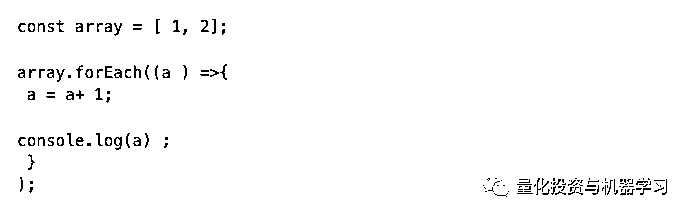
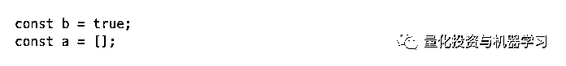
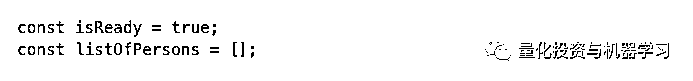

# 你就是这样在编程面试中挂掉的！

> 原文：[`mp.weixin.qq.com/s?__biz=MzAxNTc0Mjg0Mg==&mid=2653293000&idx=1&sn=c50cfa5de55599d5c514202d0f5169e1&chksm=802dcbddb75a42cb2b2485908b048926a092996714d9602e817ae714a38570c532e4836ea7e4&scene=27#wechat_redirect`](http://mp.weixin.qq.com/s?__biz=MzAxNTc0Mjg0Mg==&mid=2653293000&idx=1&sn=c50cfa5de55599d5c514202d0f5169e1&chksm=802dcbddb75a42cb2b2485908b048926a092996714d9602e817ae714a38570c532e4836ea7e4&scene=27#wechat_redirect)

**标星★公众号     **爱你们♥

作者：Michael Lazarski

编译：张晶晶 | 公众号翻译部

**近期原创文章：**

## ♥ [5 种机器学习算法在预测股价的应用（代码+数据）](https://mp.weixin.qq.com/s?__biz=MzAxNTc0Mjg0Mg==&mid=2653290588&idx=1&sn=1d0409ad212ea8627e5d5cedf61953ac&chksm=802dc249b75a4b5fa245433320a4cc9da1a2cceb22df6fb1a28e5b94ff038319ae4e7ec6941f&token=1298662931&lang=zh_CN&scene=21#wechat_redirect)

## ♥ [Two Sigma 用新闻来预测股价走势，带你吊打 Kaggle](https://mp.weixin.qq.com/s?__biz=MzAxNTc0Mjg0Mg==&mid=2653290456&idx=1&sn=b8d2d8febc599742e43ea48e3c249323&chksm=802e3dcdb759b4db9279c689202101b6b154fb118a1c1be12b52e522e1a1d7944858dbd6637e&token=1330520237&lang=zh_CN&scene=21#wechat_redirect)

## ♥ 2 万字干货：[利用深度学习最新前沿预测股价走势](https://mp.weixin.qq.com/s?__biz=MzAxNTc0Mjg0Mg==&mid=2653290080&idx=1&sn=06c50cefe78a7b24c64c4fdb9739c7f3&chksm=802e3c75b759b563c01495d16a638a56ac7305fc324ee4917fd76c648f670b7f7276826bdaa8&token=770078636&lang=zh_CN&scene=21#wechat_redirect)

## ♥ [一位数据科学 PhD 眼中的算法交易](https://mp.weixin.qq.com/s?__biz=MzAxNTc0Mjg0Mg==&mid=2653290118&idx=1&sn=a261307470cf2f3e458ab4e7dc309179&chksm=802e3c93b759b585e079d3a797f512dfd0427ac02942339f4f1454bd368ba47be21cb52cf969&token=770078636&lang=zh_CN&scene=21#wechat_redirect)

## ♥ [基于 RNN 和 LSTM 的股市预测方法](https://mp.weixin.qq.com/s?__biz=MzAxNTc0Mjg0Mg==&mid=2653290481&idx=1&sn=f7360ea8554cc4f86fcc71315176b093&chksm=802e3de4b759b4f2235a0aeabb6e76b3e101ff09b9a2aa6fa67e6e824fc4274f68f4ae51af95&token=1865137106&lang=zh_CN&scene=21#wechat_redirect)

## ♥ [如何鉴别那些用深度学习预测股价的花哨模型？](https://mp.weixin.qq.com/s?__biz=MzAxNTc0Mjg0Mg==&mid=2653290132&idx=1&sn=cbf1e2a4526e6e9305a6110c17063f46&chksm=802e3c81b759b597d3dd94b8008e150c90087567904a29c0c4b58d7be220a9ece2008956d5db&token=1266110554&lang=zh_CN&scene=21#wechat_redirect)

## ♥ [优化强化学习 Q-learning 算法进行股市](https://mp.weixin.qq.com/s?__biz=MzAxNTc0Mjg0Mg==&mid=2653290286&idx=1&sn=882d39a18018733b93c8c8eac385b515&chksm=802e3d3bb759b42d1fc849f96bf02ae87edf2eab01b0beecd9340112c7fb06b95cb2246d2429&token=1330520237&lang=zh_CN&scene=21#wechat_redirect)

## ♥ [WorldQuant 101 Alpha、国泰君安 191 Alpha](https://mp.weixin.qq.com/s?__biz=MzAxNTc0Mjg0Mg==&mid=2653290927&idx=1&sn=ecca60811da74967f33a00329a1fe66a&chksm=802dc3bab75a4aac2bb4ccff7010063cc08ef51d0bf3d2f71621cdd6adece11f28133a242a15&token=48775331&lang=zh_CN&scene=21#wechat_redirect)

## ♥ [基于回声状态网络预测股票价格（附代码）](https://mp.weixin.qq.com/s?__biz=MzAxNTc0Mjg0Mg==&mid=2653291171&idx=1&sn=485a35e564b45046ff5a07c42bba1743&chksm=802dc0b6b75a49a07e5b91c512c8575104f777b39d0e1d71cf11881502209dc399fd6f641fb1&token=48775331&lang=zh_CN&scene=21#wechat_redirect)

## ♥ [AQR 最最最新 | 计量经济学应用投资失败的 7 个原因](https://mp.weixin.qq.com/s?__biz=MzAxNTc0Mjg0Mg==&mid=2653292186&idx=1&sn=87501434ae16f29afffec19a6884ee8d&chksm=802dc48fb75a4d99e0172bf484cdbf6aee86e36a95037847fd9f070cbe7144b4617c2d1b0644&token=48775331&lang=zh_CN&scene=21#wechat_redirect)

## ♥ [关于高盛在 Github 开源背后的真相！](https://mp.weixin.qq.com/s?__biz=MzAxNTc0Mjg0Mg==&mid=2653291594&idx=1&sn=7703403c5c537061994396e7e49e7ce5&chksm=802dc65fb75a4f49019cec951ac25d30ec7783738e9640ec108be95335597361c427258f5d5f&token=48775331&lang=zh_CN&scene=21#wechat_redirect)

## ♥ [新一代量化带货王诞生！Oh My God！](https://mp.weixin.qq.com/s?__biz=MzAxNTc0Mjg0Mg==&mid=2653291789&idx=1&sn=e31778d1b9372bc7aa6e57b82a69ec6e&chksm=802dc718b75a4e0ea4c022e70ea53f51c48d102ebf7e54993261619c36f24f3f9a5b63437e9e&token=48775331&lang=zh_CN&scene=21#wechat_redirect)

## ♥ [独家！关于定量/交易求职分享（附真实试题）](https://mp.weixin.qq.com/s?__biz=MzAxNTc0Mjg0Mg==&mid=2653291844&idx=1&sn=3fd8b57d32a0ebd43b17fa68ae954471&chksm=802dc751b75a4e4755fcbb0aa228355cebbbb6d34b292aa25b4f3fbd51013fcf7b17b91ddb71&token=48775331&lang=zh_CN&scene=21#wechat_redirect)

## ♥ [Quant 们的身份危机！](https://mp.weixin.qq.com/s?__biz=MzAxNTc0Mjg0Mg==&mid=2653291856&idx=1&sn=729b657ede2cb50c96e92193ab16102d&chksm=802dc745b75a4e53c5018cc1385214233ec4657a3479cd7193c95aaf65642f5f45fa0e465694&token=48775331&lang=zh_CN&scene=21#wechat_redirect)

## ♥ [拿起 Python，防御特朗普的 Twitter](https://mp.weixin.qq.com/s?__biz=MzAxNTc0Mjg0Mg==&mid=2653291977&idx=1&sn=01f146e9a88bf130ca1b479573e6d158&chksm=802dc7dcb75a4ecadfdbdace877ed948f56b72bc160952fd1e4bcde27260f823c999a65a0d6d&token=48775331&lang=zh_CN&scene=21#wechat_redirect)

请对号入座，看看你是否也犯了同样的错！

凡事都需要认真对待！

**阅读编程题目不够细致**

有时一字之差就会完全改变要求原意，或许你在第一时间并未领会该词要义，又或许以为自己领会到了，然而实际上未必。

**改进：**将题目多读几遍，直到真正理解。

**未使用 Git 客户端，或其他版本控制系统**

千万不要把完整的 node_modules 压缩成 60Mzip 文件后电邮，OSX 系统对解压缩 node_modules 并不友好，所以阅件人甚至都不会看你的代码。

用 Git 客户端解决上述问题。**若不了解 Git，正好认真学一下**。很多大公司都用 Git，迟早要学。

**不会写优秀的提交说明**

改用 Git 后，**不要把所有工作一次性提交。****公司在看 git 日志时会浏览提交说明**。你必须谨记以后将是团队工作，其中优秀的提交说明格外重要。对团队成员而言，两周之内消化理解提交内容所涉及的应用至关重要，所以你应该分多次提交，写说明尽量简洁明了。

**忘记.gitignore 文件**

如果你没有.gitignore 文件，该目录中的所有内容都将添加到 Git 中。相当于你发送的依旧是完整的 node_modules，而 node_modules 没人去看。

.gitignore 文件汇总请点击：

*https://github.com/github/gitignore*

**通过电子邮件的发送 zip 文件**

**作为开发人员你必须知道 GitHub！**所以尽量使用它。把代码放在 GitHub 上，并将 GitHub 链接发给阅件人，这会给其留下个好印象。注意以下几点：

**1、公司垃圾邮件过滤器不会删除 zip 文件；**

**2、即使在 2019 年电子邮件仍然有大小限制，或许你发邮时会受限；**

**3、简单扫一眼确保代码没下载为 zip 文件；**

**4、通常公司里不止一人看你的代码，确保看你代码的其他开发人员易于浏览。**  

**没有 README.md 文件，或者写的不好**

Github 会显示 README.md 文件，这将显示在你报告的主页。尽量丰富其内容。例如，任务命名或解释任务作用等方法或许会锦上添花。由此，引出下一个误区。

**对如何启动编程任务未作介绍**

阅件人会在 package.json 文件查看脚本，写的好的话会看哪条可行，哪条不可行。所以请在 README.md 中写下如何设置、启动任务，以便阅件人运行。

**编程任务没有有效链接**

或许你会有这样的疑问：我刚刚在写链接你却叫我写运行介绍？尽量让编程代码审核流畅，审核人才不会因花费近一小时来看懂代码和任务要求是否匹配而不高兴。**设置有效的且在 Heroku，GitHub pages，AWS 或 Azure 等页面中兼容的链接也是很简单的事**。

**没有从任务中删除旧的/不需要的文件**

不要在 Git 库中设置“old”文件夹，阅件人看到只会不知所措，犹豫该不该看下去，并对此表示无奈。所以**务必在代码中删除之前的和不必要的文件**。

**没有写一封漂亮的关于 GitHub 回复的邮件**

发送只含链接的空邮件会被认为十分失礼。至少写上：“X 您好，希望您诸事顺遂。这是我的编程任务链接。【链接】张三！”。等等~

**不要随意说某事轻而易举**

有个普遍现象——有人说“Java 一点儿也不难”，我很不能理解。其实，若把 Java 换成任意的词——任何事同时有或易或难的一面。开车简单但驾驶一级方程式赛车却很艰难。

为何会有这种问题呢？研究发现人脑中有某种思维定式。具体而言，这跟不熟悉编程的人问：‘做这件事的最佳方法是什么？’是一码事，事实上没有学习编程语言的最佳方法或唯一方法。如果你学完 C++后瞧不起 Java 开发人员，说明你只是小团体中的佼佼者，就像是你学会了工具箱中的一种工具，会使爪锤却不会大锤。现在学习大锤的确会简单些，但两种工具各有所长。

**若工作规格要求会做测试而你却只字未提**

编写测试是个加分项，不必力求完美，也不必用 100%的代码覆盖。仅仅用些简单测试检验核心功能就会很加分。

**没有对代码进行拆分**

若你发送一份含 2000 行代码的大型文件，则很难对其审核。作为代码审核人，很难看出代码要做什么、怎样切换。或许你自己也得从头看起。最好尝试把代码分割成小块，这对后期工作尤为重要，没人想看团队中除了你别人都看不懂的代码，所以**务必拆分，这样核查起来要容易得多**。

**没有代码注释或者仅仅解释一行代码**

这个现象甚至是具有多年开发经验的老程序员都有。像下面的注释：

“// Loops through an array”，下一行是“Array.forEach()”。

你好，显然先生！如果你能用更抽象的方式描述这个循环，那就更好了。

写成像形如“// preparing data for sending it via AJAX”的代码以便代码意图更易懂。

**代码编写不规范**

上述代码晦涩难懂，也反映出你工作马虎。现有**的代码检测工具如 eslint 和 prettier 功能都很强大**。所有大型编辑器和 IDE 都内置该功能，只需安装一个插件或扩展文件即可，要习惯尽量使用它。

**不恰当的变量命名**

上述代码变量“b”的含义就很难懂，应该写成下面这样会好一点：

这些仅仅做个示范，每个语言都有自己的命名方式。当然，你可能猜不出它是哪种方式，只需按照自己认定有意义的方式命名，并**坚持一种风格**。

**仅仅对旧代码做注释**

虽然这种现象屡见不鲜，还是不懂为何如此。有个 100 行代码的文件，其中 70 行旧代码，30 行才是真正用于实现的代码。那是要我看旧代码吗？还是要告诉我你第一次写错后面又修改了呢？第一次的代码都不会完美，**所以记得删除不必要的代码，需要查看是否重构代码时只需看 Git 提交说明就能理解代码作用了**。

**没有检查代码是否更新完毕**

这事儿也经常发生，周天晚上审核人从参加面试人员那收到一封邮件。周一工作时审核人开始检查代码，然后突然又收到第二封，面试者声称代码已更新，审核人还得祈祷这封才真正有效。

**修改后未检查代码是否更新完毕**

对于全栈开发人员而言，工作要求其在数据库中保存变量，他们可以选择数据库、架构以及变量保存方式，但必须保存。这可能导致代码修改后并未检查是否真的保存进数据库中。例如，仅仅修改架构或某个小文件等等都有可能导致类似问题。

**在发给代码审核人之前，请检查是否全部功能是否依旧奏效。并不是说需要你掌握每个极端情况**，但至少掌握一些普通开发人员需要做到的常识。

**对于编程面试毫无准备**

在发送编程成果后和正式面试之前这段时间，一般会是一周多一点，你还记得编程里写了些什么吗？比如为何以某种特定方式解决这个任务，认为编程任务还应该怎么改善？

整个过程的目标不仅仅需要看你是个多合格的程序员，**更应该是如果你是团队一员的话，是否和团队兼容**。**相比编程硬实力，其实更看重的是你的软实力，所以务必在面试前仔细阅读自己的代码。**

上述误区仅仅是职业生涯中的部分情况，如果你还有不同的误区，请在下方留言区写下你的评论。

*—End—*

量化投资与机器学习微信公众号，是业内垂直于**Quant**、**MFE**、**CST**等专业的主流量化自媒体。公众号拥有来自**公募、私募、券商、银行、海外**等众多圈内**10W+**关注者。每日发布行业前沿研究成果和最新资讯。

