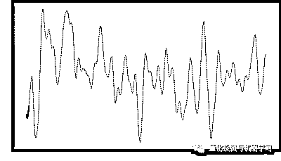

# 机器学习在量化金融领域的误用！

> 原文：[`mp.weixin.qq.com/s?__biz=MzAxNTc0Mjg0Mg==&mid=2653292984&idx=1&sn=3e7efe9fe9452c4a5492d2175b4159ef&chksm=802dcbadb75a42bbdce895c49070c3f552dc8c983afce5eeac5d7c25974b7753e670a0162c89&scene=27#wechat_redirect`](http://mp.weixin.qq.com/s?__biz=MzAxNTc0Mjg0Mg==&mid=2653292984&idx=1&sn=3e7efe9fe9452c4a5492d2175b4159ef&chksm=802dcbadb75a42bbdce895c49070c3f552dc8c983afce5eeac5d7c25974b7753e670a0162c89&scene=27#wechat_redirect)

**标星★公众号     **爱你们♥

作者：euler

编译：高翊程 | 公众号翻译部

**近期原创文章：**

## ♥ [5 种机器学习算法在预测股价的应用（代码+数据）](https://mp.weixin.qq.com/s?__biz=MzAxNTc0Mjg0Mg==&mid=2653290588&idx=1&sn=1d0409ad212ea8627e5d5cedf61953ac&chksm=802dc249b75a4b5fa245433320a4cc9da1a2cceb22df6fb1a28e5b94ff038319ae4e7ec6941f&token=1298662931&lang=zh_CN&scene=21#wechat_redirect)

## ♥ [Two Sigma 用新闻来预测股价走势，带你吊打 Kaggle](https://mp.weixin.qq.com/s?__biz=MzAxNTc0Mjg0Mg==&mid=2653290456&idx=1&sn=b8d2d8febc599742e43ea48e3c249323&chksm=802e3dcdb759b4db9279c689202101b6b154fb118a1c1be12b52e522e1a1d7944858dbd6637e&token=1330520237&lang=zh_CN&scene=21#wechat_redirect)

## ♥ 2 万字干货：[利用深度学习最新前沿预测股价走势](https://mp.weixin.qq.com/s?__biz=MzAxNTc0Mjg0Mg==&mid=2653290080&idx=1&sn=06c50cefe78a7b24c64c4fdb9739c7f3&chksm=802e3c75b759b563c01495d16a638a56ac7305fc324ee4917fd76c648f670b7f7276826bdaa8&token=770078636&lang=zh_CN&scene=21#wechat_redirect)

## ♥ [一位数据科学 PhD 眼中的算法交易](https://mp.weixin.qq.com/s?__biz=MzAxNTc0Mjg0Mg==&mid=2653290118&idx=1&sn=a261307470cf2f3e458ab4e7dc309179&chksm=802e3c93b759b585e079d3a797f512dfd0427ac02942339f4f1454bd368ba47be21cb52cf969&token=770078636&lang=zh_CN&scene=21#wechat_redirect)

## ♥ [基于 RNN 和 LSTM 的股市预测方法](https://mp.weixin.qq.com/s?__biz=MzAxNTc0Mjg0Mg==&mid=2653290481&idx=1&sn=f7360ea8554cc4f86fcc71315176b093&chksm=802e3de4b759b4f2235a0aeabb6e76b3e101ff09b9a2aa6fa67e6e824fc4274f68f4ae51af95&token=1865137106&lang=zh_CN&scene=21#wechat_redirect)

## ♥ [如何鉴别那些用深度学习预测股价的花哨模型？](https://mp.weixin.qq.com/s?__biz=MzAxNTc0Mjg0Mg==&mid=2653290132&idx=1&sn=cbf1e2a4526e6e9305a6110c17063f46&chksm=802e3c81b759b597d3dd94b8008e150c90087567904a29c0c4b58d7be220a9ece2008956d5db&token=1266110554&lang=zh_CN&scene=21#wechat_redirect)

## ♥ [优化强化学习 Q-learning 算法进行股市](https://mp.weixin.qq.com/s?__biz=MzAxNTc0Mjg0Mg==&mid=2653290286&idx=1&sn=882d39a18018733b93c8c8eac385b515&chksm=802e3d3bb759b42d1fc849f96bf02ae87edf2eab01b0beecd9340112c7fb06b95cb2246d2429&token=1330520237&lang=zh_CN&scene=21#wechat_redirect)

## ♥ [WorldQuant 101 Alpha、国泰君安 191 Alpha](https://mp.weixin.qq.com/s?__biz=MzAxNTc0Mjg0Mg==&mid=2653290927&idx=1&sn=ecca60811da74967f33a00329a1fe66a&chksm=802dc3bab75a4aac2bb4ccff7010063cc08ef51d0bf3d2f71621cdd6adece11f28133a242a15&token=48775331&lang=zh_CN&scene=21#wechat_redirect)

## ♥ [基于回声状态网络预测股票价格（附代码）](https://mp.weixin.qq.com/s?__biz=MzAxNTc0Mjg0Mg==&mid=2653291171&idx=1&sn=485a35e564b45046ff5a07c42bba1743&chksm=802dc0b6b75a49a07e5b91c512c8575104f777b39d0e1d71cf11881502209dc399fd6f641fb1&token=48775331&lang=zh_CN&scene=21#wechat_redirect)

## ♥ [AQR 最最最新 | 计量经济学应用投资失败的 7 个原因](https://mp.weixin.qq.com/s?__biz=MzAxNTc0Mjg0Mg==&mid=2653292186&idx=1&sn=87501434ae16f29afffec19a6884ee8d&chksm=802dc48fb75a4d99e0172bf484cdbf6aee86e36a95037847fd9f070cbe7144b4617c2d1b0644&token=48775331&lang=zh_CN&scene=21#wechat_redirect)

## ♥ [关于高盛在 Github 开源背后的真相！](https://mp.weixin.qq.com/s?__biz=MzAxNTc0Mjg0Mg==&mid=2653291594&idx=1&sn=7703403c5c537061994396e7e49e7ce5&chksm=802dc65fb75a4f49019cec951ac25d30ec7783738e9640ec108be95335597361c427258f5d5f&token=48775331&lang=zh_CN&scene=21#wechat_redirect)

## ♥ [新一代量化带货王诞生！Oh My God！](https://mp.weixin.qq.com/s?__biz=MzAxNTc0Mjg0Mg==&mid=2653291789&idx=1&sn=e31778d1b9372bc7aa6e57b82a69ec6e&chksm=802dc718b75a4e0ea4c022e70ea53f51c48d102ebf7e54993261619c36f24f3f9a5b63437e9e&token=48775331&lang=zh_CN&scene=21#wechat_redirect)

## ♥ [独家！关于定量/交易求职分享（附真实试题）](https://mp.weixin.qq.com/s?__biz=MzAxNTc0Mjg0Mg==&mid=2653291844&idx=1&sn=3fd8b57d32a0ebd43b17fa68ae954471&chksm=802dc751b75a4e4755fcbb0aa228355cebbbb6d34b292aa25b4f3fbd51013fcf7b17b91ddb71&token=48775331&lang=zh_CN&scene=21#wechat_redirect)

## ♥ [Quant 们的身份危机！](https://mp.weixin.qq.com/s?__biz=MzAxNTc0Mjg0Mg==&mid=2653291856&idx=1&sn=729b657ede2cb50c96e92193ab16102d&chksm=802dc745b75a4e53c5018cc1385214233ec4657a3479cd7193c95aaf65642f5f45fa0e465694&token=48775331&lang=zh_CN&scene=21#wechat_redirect)

## ♥ [拿起 Python，防御特朗普的 Twitter](https://mp.weixin.qq.com/s?__biz=MzAxNTc0Mjg0Mg==&mid=2653291977&idx=1&sn=01f146e9a88bf130ca1b479573e6d158&chksm=802dc7dcb75a4ecadfdbdace877ed948f56b72bc160952fd1e4bcde27260f823c999a65a0d6d&token=48775331&lang=zh_CN&scene=21#wechat_redirect)

**前言**

近年来，机器学习技术和大数据工具在金融和投资界得到了广泛的应用。在这一成功之后，许多机器学习研究人员决定成立自己的资产管理公司，希望能从中分一杯羹。

这就引出了一个问题：大量的数据和计算能力是征服金融市场所需要的吗？在本文中，**我们深入探讨了机器学习（ML）在金融领域的应用和误用**。

**两类机器学习**

对于新手来说，所有的 ML 看起来都一样。然而，这两种方式有着明显的区别：**一类是****工业巨头开发的商业应用**。比如谷歌、Facebook、亚马逊、Netflix、苹果、微软和特斯拉。这些公司有一个明确的目标：

创造出“预测”，即“黑匣子”：不关心是如何做出预测的，只要能做出最好的预测就可以。

当亚马逊为你推荐一本书时，“预测”系统并没有开发出一个有关人类行为的大致理论，以及在各种环境中可能有用的偏好。相反，“预测”系统挖掘大量的数据以找到一种模式，以某种方式选择一本你特别感兴趣的书。这是一种公众最熟悉的 ML 应用。

**第二类是用于科学研究的 ML**，这涉及从美国劳伦斯伯克利国家实验室（LawrenceBerkeley National Laborator）和法国的 INRIA 等大型研究实验室的科学家，到世界各地大学的无数个人研究人员。这些研究人员所采用的 ML 技术的目标是非常不同的：分析数据，识别值得进一步研究的“有趣”现象，并最终产生更好的科学理论。一个好的研究科学家不会把金融科学理论替换为一个金融预言家。（这句话的意思是**金****融理论相较于算法更加重要**）科学的最终目的不是做出预测或推荐书籍，尽管预测对检验和验证理论很有用，但研究的最终目标是了解自然。

相反，“预测”系统使我们处于黑箱之中。，“预测”系统也不能增进知识，我们谁也不能在“预测”系统上建立知识、提炼知识或概括知识。我们可以有一个预言电场行为的“预测”系统，另一个预言磁场行为的“预测”系统，但仍然忽略了电磁学是一个单一物理现象这一基本事实。

**为何金融预测系统失效了**

有人可能会说，“预测”系统是一种理想的金融应用系统：投资者只想得到回报。他为什么要关注经济理论？问题在于，由于多种原因，**投资是一种不能被“预测”系统有效解决的类型**。

首先，“预测”系统在有数百万个独立样本的任务中蓬勃发展，算法可以从中学习，新的数据集可以即时生成。你可以在数以百万计的人脸上训练一个算法，而且还会有数以十亿计的人脸需要绘制。相比之下，**金融时间序列通常较短且高度冗余（即是所谓的“多重共线性”：多重共线性是指线性回归模型中的解释变量之间由于存在精确相关关系或高度相关关系而使模型估计失真或难以估计准确。一般来说，由于经济数据的限制使得模型设计不当，导致设计矩阵中解释变量间存在普遍的相关关系。完全共线性的情况并不多见，一般出现的是在一定程度上的共线性，即近似共线性）**。

第二，**ML 算法依赖于一种假设，这种假设常被金融时间序列所扰乱**。例如，金融时间序列经常是非平稳的。在时间序列中，非平稳意味着在一定时期内其并不以“常数分布”为特征。非平稳是一个大问题，因为对于一个 ML 算法，如果被学习的样本们是类似的，那么它只能学习到样本的特性。类比来说，我们训练算法以识别猫脸，则它可能会给狗脸贴上一个错误的猫脸标签。

第三，**由于套利的力量，金融市场的信号均衡率非常低**。那些我们从中获利的竞争对手们（韭菜）要么学习，要么消失，导致利润来源的侵蚀。相比之下，自然法则并没有“被套利走”。

第四，在实验室里一边重复实验，一边改变环境变量的时候，确定特定的原因影响机制就成为了一种不可能。例如，**我****们不能通过添加和删除特定的参与者来数以千次的重复股灾事件以帮助我们找到原因**。我们所拥有的只是在那一天所观察到的一个历史现象。

因此，“预测”系统在金融领域通常不是很有用。从 Kaggle 竞赛中提取一个算法，将其插入一组金融时间序列，并期望它预测金融价格，这是最不明智的做法。在选择正确的金融问题时，有一种技巧可以帮助算法解答。**理论****知识对于设定“符合现实的假设”与“一致性假设”是必不可少的**。正确的准备数据和解释中间结果需要金融知识。

**过拟合**

许多 ML 研究人员根据“预测范式”来研究金融市场，仔细观察这些研究就可以发现这种方法的缺陷。例如，一家硅谷的初创公司最近发表了一篇博客文章和论文，该公司开发了金融市场的 ML 算法，但其中却基本上没有经济理论做支撑。

这篇文章叫做：**《金融市场的平稳性和记忆性》**

https://medium.com/pit-ai-technologies/non-stationarity-and-memory-in-financial-markets-4b8d1200667c

简而言之，文章指出**“在一个有限制的时间间隔（无论这个时间间隔有多长）内观察到一条路径，不可能检验时间序列是否非平稳。因此，你不应该相信任何平稳性测试。”**

对于训练有素的数学家来说，这些大胆的声明会引发一些危险。平稳性测试是一种数学工具。在某些明确说明的情况下，它们被证明是有效的假设。但是，它并没有质疑金融假设的有效性，而是否定了测试本身的有效性。用他们自己的话说：

直观地说，平稳时间序列是一个局部特征随时间而保持不变的时间序列。因此，过去几十年来，它一直是计量经济学中的一个关键假设，因此人们常常认为，从业者在进行任何建模之前，至少在 Box-Jenkins 思想流派中，应首先使时间序列保持平稳。这并不奇怪，因为一个简单的原因，（二阶）平稳性，作为一个属性，不能从一个单一的有限样本路径被推翻。是的，继续阅读以了解原因。

大多数科学预测依赖于预测误差是固定的假设。因此，平稳性测试在所有科学领域都发挥着至关重要的作用。在数学证明中发现任何一个支撑这些测试的错误将是一个惊天动地的发现，也许不会在《纽约时报》的头版上获得一个标题，但仍然非常重要。但这怎么可能是真的呢？

发表上述文章的组织没有指出在数学证明中发现的任何错误。相反，它提供了一个如下侧所示的图。如果在一个大的平稳样本（红点）中给一个小的非平稳样本（蓝点），平稳性测试将错误地得出这个过程是非平稳的结论。

为什么平稳性测试“失败”？因为蓝色样本不能代表这整个过程。但问题不在测试。问题在于研究人员违反了建立测试所依据的代表性假设。因此，依据这个图表，去宣称“你不应该相信任何平稳性测试”是一个错误和不合理的结论。

**文章认为，由于不能确定非平稳样本是否代表这个过程，因此不能否定平稳性假设，因此平稳性检验是无用的。****这一论点相当不可信**。

同样地，由于我们永远不能确定一个样本是否代表这个过程，所以我们根本就不应该使用统计数据了？如果样本不能代表人口，人们怎么能相信一个平均数呢？更重要的是，如果文章是正确的，机器学习也是无用的，发布文章的组织应该停止向客户销售他们的服务。一个人怎么能从样本中学习到任何东西？毕竟这些样本永远不可能是完整的对吧？当然，答案是研究人员必须假设数据具有代表性，而不是陈述。这个假设的基础是什么？研究人员对观察结果的具体知识。现场专家可以根据他们对观察样品的专业知识，作出一个合理的假设，即一个时间序列具有代表性。

作为 ML“预测范式”的真正追随者，发表本文的组织认为，基于专家的样本代表性假设在其框架中不可靠，科学理论和专家知识不应在 ML 模型中发挥作用。对他们来说，数据才是最重要的。这个论点是矛盾的，**因为如果数据是重要的，那么我们就不能从理论中得出假设，没有假设，就不能使用量化工具，那么数据也就无用武之地**。

在抨击了平稳性测试之后，组织将其枪口瞄向“微分”。微分是数学家用来将非平稳样本转化为平稳样本的标准程序。然而，**数学家们知道差异化是有代价的：丢失与未来预测相关的过去信息，即记忆**。

用这些术语来思考记忆：当一个重物拉伸一个弹簧时，弹簧会“记住”它的平衡位置，并将重量拉回来。即使弹簧是非平稳的，比如连接在火车上的弹簧，也会发生这种情况。但是为了建立弹簧的动力学模型，我们需要微分它的观测结果，这样我们就可以处理一个平稳序列。然而，这种微分并不完美，它抹去了确定弹簧与平衡距离所需的一些信息。解决这种“平稳性与记忆困境”的方法是尽可能少的微分以实现平稳性。统计学家解决这种困境的一种方法是通过分数微分。但是，发表上述文章的组织认为，既然平稳性测试无论如何都是无用的，那么微分所完成的唯一事情就是失去记忆。因此，他们再次错误地得出结论，微分是无用的，就像平稳性测试一样。他们的建议是使用非平稳序列，这是一种过度拟合的方法：**不能在单个实例上可靠地训练 ML 算法。他们的文章和论文的其余部分来自这些基本的误解**。

**忽视理论的影响**

让上述文章和论文如此引人入胜的是因为它提供了一个直接的观点，这往往导致金融业的后验过度拟合。**一旦一个从业者不重视经济理论，ML 寻找模式的能力就会失去控**制（特别是可能识别出一个虚假模式）。将这种“数据挖掘能力”与“套利行为会大幅降低信噪比的事实（理论预测得到的）”结合起来，无论从业者是否意识到这一点，都很容易产生误报。 

**在经济学、金融和投资领域中，理论与现象的关联性，远比自然科学理论与现象的关联性大。**原因在于，经济体系是人为构建的。经济学家对这些现象的规律有着无与伦比的洞察。例如，市场微观结构理论家知道价格是如何形成的：价格是平衡供求关系的拍卖机制的结果。经济学家不需要一个统计测试来告诉我们价格是非平稳的。经济学家通过市场结构知道这一事实，而平稳性测试的目的是推导出以最小记忆损失实现平稳性的微分量。物理学家没有这样的优势，因为自然规律和系统不是人类的构造——至少在可观测的现实感上是如此，物理学的规律是成立的，不管宇宙是否包含一个有知觉的个体，能够发现这些规律。这使得经济理论在设定现实假设方面特别强大（并且非常重要）。

ML“预测范式”的追随者遗漏的关键是：由于前者的低信噪比，**金融时间序列比物理时间序列更容易产生过度拟合**。研究人员最希望在经济理论方面避免假阳性预测，特别是因为经济学家喜欢在一个人类制造的系统领域（金融领域）工作。

总之，**ML 和经济理论是相辅相成的：经济理论限制了 ML 的过度拟合倾向，而 ML 通过揭示变量之间存在的复杂相互作用，帮助经济学家发展出更好的理论。更好的理论会带来更好的预测。但是理论应该做预测，而不是“预言家”**。这与科学家们几十年来在各个领域使用 ML 的方式没有什么不同，因为它可以增进我们的理解，并改进以前的知识。与此形成鲜明对比的是，“预测范式”忽视了所有的经济理论，因为它错误地承诺了更好的预测。

对于投资者来说，重要的是要理解为什么金融预言从根本上是有缺陷的，并避免成为轻易致富这一不科学承诺的牺牲品。。

简而言之：

**当心炒作**

**ML 在金融领域有着重要的作用，但它无法取代经济理论。**

*—End—*

量化投资与机器学习微信公众号，是业内垂直于**Quant**、**MFE**、**CST**等专业的主流量化自媒体。公众号拥有来自**公募、私募、券商、银行、海外**等众多圈内**10W+**关注者。每日发布行业前沿研究成果和最新资讯。

