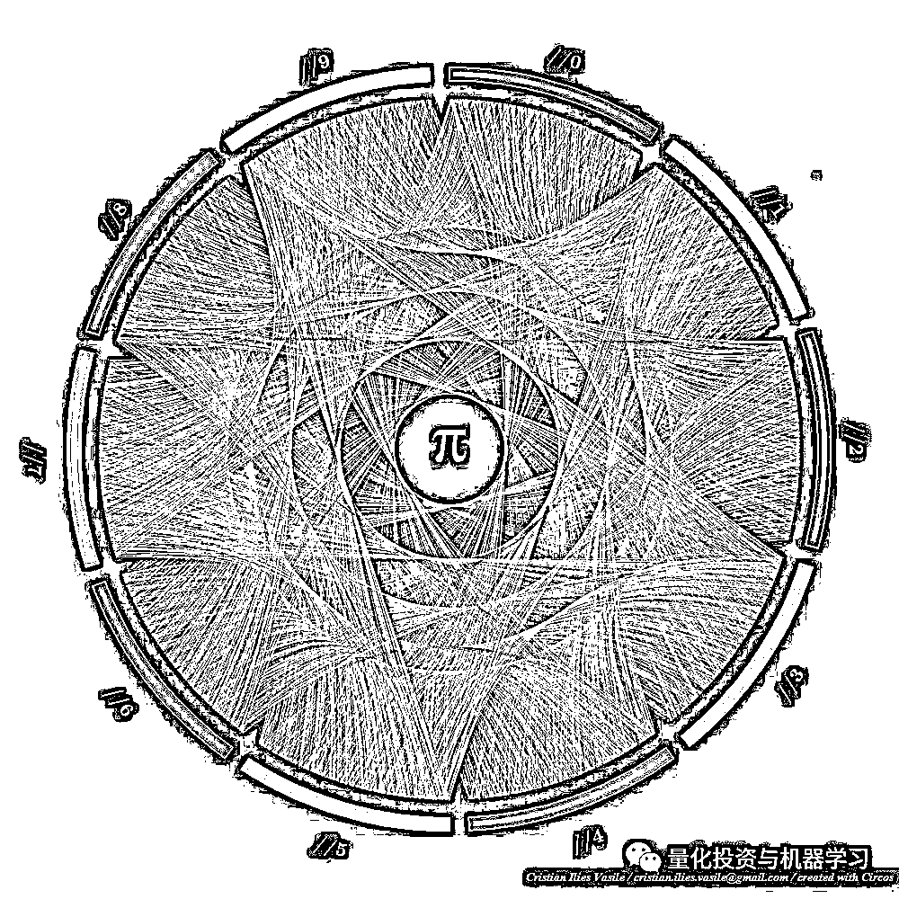
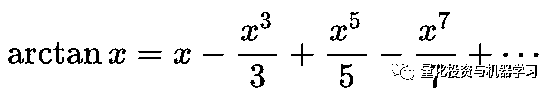
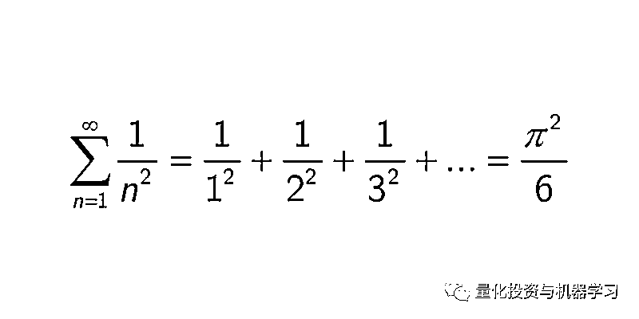

# π 的美丽

> 原文：[`mp.weixin.qq.com/s?__biz=MzAxNTc0Mjg0Mg==&mid=2653292968&idx=1&sn=0be9bf53853545eead4907673939b6cd&chksm=802dcbbdb75a42ab8c31f1a18290e62b35ea5741118f0fa3134ee876f0c0bb83c4964c84bb27&scene=27#wechat_redirect`](http://mp.weixin.qq.com/s?__biz=MzAxNTc0Mjg0Mg==&mid=2653292968&idx=1&sn=0be9bf53853545eead4907673939b6cd&chksm=802dcbbdb75a42ab8c31f1a18290e62b35ea5741118f0fa3134ee876f0c0bb83c4964c84bb27&scene=27#wechat_redirect)

**标星★公众号     **爱你们♥

作者：Ali Kayaspor

编译：方的馒头 | 公众号翻译部

**近期原创文章：**

## ♥ [5 种机器学习算法在预测股价的应用（代码+数据）](https://mp.weixin.qq.com/s?__biz=MzAxNTc0Mjg0Mg==&mid=2653290588&idx=1&sn=1d0409ad212ea8627e5d5cedf61953ac&chksm=802dc249b75a4b5fa245433320a4cc9da1a2cceb22df6fb1a28e5b94ff038319ae4e7ec6941f&token=1298662931&lang=zh_CN&scene=21#wechat_redirect)

## ♥ [Two Sigma 用新闻来预测股价走势，带你吊打 Kaggle](https://mp.weixin.qq.com/s?__biz=MzAxNTc0Mjg0Mg==&mid=2653290456&idx=1&sn=b8d2d8febc599742e43ea48e3c249323&chksm=802e3dcdb759b4db9279c689202101b6b154fb118a1c1be12b52e522e1a1d7944858dbd6637e&token=1330520237&lang=zh_CN&scene=21#wechat_redirect)

## ♥ 2 万字干货：[利用深度学习最新前沿预测股价走势](https://mp.weixin.qq.com/s?__biz=MzAxNTc0Mjg0Mg==&mid=2653290080&idx=1&sn=06c50cefe78a7b24c64c4fdb9739c7f3&chksm=802e3c75b759b563c01495d16a638a56ac7305fc324ee4917fd76c648f670b7f7276826bdaa8&token=770078636&lang=zh_CN&scene=21#wechat_redirect)

## ♥ [一位数据科学 PhD 眼中的算法交易](https://mp.weixin.qq.com/s?__biz=MzAxNTc0Mjg0Mg==&mid=2653290118&idx=1&sn=a261307470cf2f3e458ab4e7dc309179&chksm=802e3c93b759b585e079d3a797f512dfd0427ac02942339f4f1454bd368ba47be21cb52cf969&token=770078636&lang=zh_CN&scene=21#wechat_redirect)

## ♥ [基于 RNN 和 LSTM 的股市预测方法](https://mp.weixin.qq.com/s?__biz=MzAxNTc0Mjg0Mg==&mid=2653290481&idx=1&sn=f7360ea8554cc4f86fcc71315176b093&chksm=802e3de4b759b4f2235a0aeabb6e76b3e101ff09b9a2aa6fa67e6e824fc4274f68f4ae51af95&token=1865137106&lang=zh_CN&scene=21#wechat_redirect)

## ♥ [如何鉴别那些用深度学习预测股价的花哨模型？](https://mp.weixin.qq.com/s?__biz=MzAxNTc0Mjg0Mg==&mid=2653290132&idx=1&sn=cbf1e2a4526e6e9305a6110c17063f46&chksm=802e3c81b759b597d3dd94b8008e150c90087567904a29c0c4b58d7be220a9ece2008956d5db&token=1266110554&lang=zh_CN&scene=21#wechat_redirect)

## ♥ [优化强化学习 Q-learning 算法进行股市](https://mp.weixin.qq.com/s?__biz=MzAxNTc0Mjg0Mg==&mid=2653290286&idx=1&sn=882d39a18018733b93c8c8eac385b515&chksm=802e3d3bb759b42d1fc849f96bf02ae87edf2eab01b0beecd9340112c7fb06b95cb2246d2429&token=1330520237&lang=zh_CN&scene=21#wechat_redirect)

## ♥ [WorldQuant 101 Alpha、国泰君安 191 Alpha](https://mp.weixin.qq.com/s?__biz=MzAxNTc0Mjg0Mg==&mid=2653290927&idx=1&sn=ecca60811da74967f33a00329a1fe66a&chksm=802dc3bab75a4aac2bb4ccff7010063cc08ef51d0bf3d2f71621cdd6adece11f28133a242a15&token=48775331&lang=zh_CN&scene=21#wechat_redirect)

## ♥ [基于回声状态网络预测股票价格（附代码）](https://mp.weixin.qq.com/s?__biz=MzAxNTc0Mjg0Mg==&mid=2653291171&idx=1&sn=485a35e564b45046ff5a07c42bba1743&chksm=802dc0b6b75a49a07e5b91c512c8575104f777b39d0e1d71cf11881502209dc399fd6f641fb1&token=48775331&lang=zh_CN&scene=21#wechat_redirect)

## ♥ [AQR 最最最新 | 计量经济学应用投资失败的 7 个原因](https://mp.weixin.qq.com/s?__biz=MzAxNTc0Mjg0Mg==&mid=2653292186&idx=1&sn=87501434ae16f29afffec19a6884ee8d&chksm=802dc48fb75a4d99e0172bf484cdbf6aee86e36a95037847fd9f070cbe7144b4617c2d1b0644&token=48775331&lang=zh_CN&scene=21#wechat_redirect)

## ♥ [关于高盛在 Github 开源背后的真相！](https://mp.weixin.qq.com/s?__biz=MzAxNTc0Mjg0Mg==&mid=2653291594&idx=1&sn=7703403c5c537061994396e7e49e7ce5&chksm=802dc65fb75a4f49019cec951ac25d30ec7783738e9640ec108be95335597361c427258f5d5f&token=48775331&lang=zh_CN&scene=21#wechat_redirect)

## ♥ [新一代量化带货王诞生！Oh My God！](https://mp.weixin.qq.com/s?__biz=MzAxNTc0Mjg0Mg==&mid=2653291789&idx=1&sn=e31778d1b9372bc7aa6e57b82a69ec6e&chksm=802dc718b75a4e0ea4c022e70ea53f51c48d102ebf7e54993261619c36f24f3f9a5b63437e9e&token=48775331&lang=zh_CN&scene=21#wechat_redirect)

## ♥ [独家！关于定量/交易求职分享（附真实试题）](https://mp.weixin.qq.com/s?__biz=MzAxNTc0Mjg0Mg==&mid=2653291844&idx=1&sn=3fd8b57d32a0ebd43b17fa68ae954471&chksm=802dc751b75a4e4755fcbb0aa228355cebbbb6d34b292aa25b4f3fbd51013fcf7b17b91ddb71&token=48775331&lang=zh_CN&scene=21#wechat_redirect)

## ♥ [Quant 们的身份危机！](https://mp.weixin.qq.com/s?__biz=MzAxNTc0Mjg0Mg==&mid=2653291856&idx=1&sn=729b657ede2cb50c96e92193ab16102d&chksm=802dc745b75a4e53c5018cc1385214233ec4657a3479cd7193c95aaf65642f5f45fa0e465694&token=48775331&lang=zh_CN&scene=21#wechat_redirect)

## ♥ [拿起 Python，防御特朗普的 Twitter](https://mp.weixin.qq.com/s?__biz=MzAxNTc0Mjg0Mg==&mid=2653291977&idx=1&sn=01f146e9a88bf130ca1b479573e6d158&chksm=802dc7dcb75a4ecadfdbdace877ed948f56b72bc160952fd1e4bcde27260f823c999a65a0d6d&token=48775331&lang=zh_CN&scene=21#wechat_redirect)

**正文**

终于到周末了！在家看了我最喜欢的电视节目《疑犯追踪》来解压。令人惊讶的是，这一集是关于最著名的数学常数 pi（π），它等于圆周长与直径之比，通常约为 3.14159。芬奇先生（主人公）担任代课老师，在黑板上写下了 3.1415926535。然后他问学生：“这是什么意思？”我想了想在心里回答了这个问题：“如果我有一个直径为 1 的自行车轮胎，那么自行车轮胎完整转一圈可以行使的距离就是 pi。”然而，在电影中，没有人回答。然后芬奇先生自己回答了这个问题，说道：

《有趣的人》第二季第十一集“2 Pi R”

 “Pi，圆周长与直径的比值，3.1415926535 仅仅只是个开始。它永远不会重复，这意味着包含在这串小数中的是每一个其他的数字；你的出生日期，你的抽屉密码，你的社保账号等等。这些都在那里的某个地方。如果你把这些小数转换成字母，你就会在每一个可能的组合中找到每一个单词；你小时候讲的第一个音节，你最近迷恋对象的名字，你从头到尾的整个人生故事，以及我们曾经说过或做过的一切。世界上所有的无限可能都在这个简单的圆中。那么你将如何处理这些信息；它有什么好处？呃，这取决于你……”

虽然那个场景实际上不准确，但我喜欢它。这个场景很美，因为世界上大多数老师都像这里的芬奇先生一样努力成为一个好老师和一个有趣的老师。他对这门课的认知使讨论延伸到课本之外，并使学生在课堂上保持注意力集中。

伟大的曼德尔布罗特 | Pi 的历史 | 如何烘焙 Pi

Pi 是圆周长与直径的比值。直径正好与边界的π倍相吻合。Pi 展开

不幸的是，这是错误的，因为数学家们还没有证明 pi 具有“常态”的特征。换句话说，数学家们不确定 pi 是否包含从 0 到 9 的所有有限长的数字排列。他们不确定如果每一个数字在 pi 的十进制表示中是一个确定次数还是一个无限次数。

π中的数字是无穷尽的

如果我们持续下去，没人知道我们会在 Pi 的数字中找到什么。例如，当我们检查 pi 的前十亿位数字时，我们发现数字 7 出现了近 1 亿次。这使得 pi 成为一个很好的随机数生成器。然而，在某些点后，pi 可能不包含数字 7，而是可能有一个仅有两个或三个数字的非重复号码，就像 010203112233000011122233……

例如，在 pi 的前 761 位数字之后，有一个著名的数学巧合，一行中连续出现 6 个 9，称为费曼点（“费曼点”）。

推特，费曼图书馆，“Pi 中的费曼点”

但我们确信 pi 的数字会一直以随机的顺序持续下去。这使得 pi 很有趣，因为 pi 的值是有限的，然而，它的十进制值是无限长的。这不矛盾。Pi 是一个常数，因为它是一个圆的周长与直径的比值，这是有限值。不过，我们仍然需要一个 pi 的近似值。

1768 年，约翰·兰伯特证明了 pi 是一个无理数，它不能写成有理简单分数。22/7 是一个常用的近似值，但不包含 pi 的所有数字。这是因为无理数不能写成两个数字的比值，例如 ab，因为它们的数字持续到无穷大且不遵循一个模式。1882 年，费迪南德·林德曼证明了 pi 是一个超越数，因为它不是代数；它不是一个具有有理系数的非常数多项式方程（“超越数”）。

我们很有把握的说 pi 是超验的，因为数学家金田康正发现 pi 的前万亿位数字在统计上是随机的。如果查看下表，你会看到每个数字发生的时间都是独立的，并且发生的概率是十分之一（“金田康正实验室”）。

多年后的 2019 年，爱玛·治子·岩发现 34.1 万亿位数的 pi。治子和他的计算机花了 121 天的时间，因为计算 pi 需要很大的能量，即便对于一台计算机也是如此。你可以像这样在你的脑海里想象它：如果你用正常大小的普通字体打印十亿个十进制 Pi 值，它会从纽约排到堪萨斯。

然而，34.1 万亿位数字仍然不足以证明 pi 是常态与否（“天空中的 Pi”）。超级计算机仍在处理这些数字。如果你查看以下图表，你将会看到自公元前 250 年以来每年已知的 pi 的数字。

“甚至在 31 万亿位数后，我们仍未离 Pi 更近一点”

回到芬奇先生，我们看到他并非百分之百错误。我们可以很容易地在 pi 中找到我们的生日。如果你去 mypiday.com 输入你的生日，它会给你在 pi 中的小数位。例如，我的生日出现在小数点后的第 675097 位。

**如果 pi 是正常数，那么我们可以说我们的整个命运都是用 pi 编码的。我们将来会拍摄的照片将会是 pi，因为图像背后有二进制数字。所有数码产品都是 pi。甚至这篇文章已经在 pi 中存在了数千年。此外，每个生物的 DNA 都是 pi。芬奇先生其实是对的。**

有一种有趣且艺术的方式来展示 pi 的随机性。一些科学家可能对他们繁琐的散点图很满意，但也有一些艺术家通过使用颜色进行数据可视化与公众交流。马丁·克兹温斯基就是这样一个艺术家，他在 Pi 的随机性中发现了美和艺术性。他给 pi 的每一个数字加上不同的颜色。例如，他给 3 用橘色，1 用红色，4 用黄色等等。随后他做了一张很漂亮的海报。如果你仔细观察，你看不到颜色的任何特定图案。

具体画法，查看这篇文章：

**[3.14 特别纪念 | π 的第 100000000000000···](http://mp.weixin.qq.com/s?__biz=MzAxNTc0Mjg0Mg==&mid=2653291092&idx=1&sn=b5479c0f5066036663bc84a0bde66617&chksm=802dc041b75a4957c6be83ed7f6c4136068d94d0c09460aa849401029876f72a1d70aefaeb84&scene=21#wechat_redirect)**  

马丁•克兹温斯基的科学艺术

除了很多有关 pi 的有趣事实外，它也是迄今为止数学史上研究最多的数。许多人想要记住 pi 的数字，而不是其他无理数的数字（优兔，美国公共电视台新闻时间）。它使人们陷入疯狂和混乱。几个世纪以来，数学家们一直在努力精确计算 pi。

那么，我们是应该停止研究 pi 还是应该继续寻找一个更好的近似值呢？假设 pi 等于 3.14 就足够了吗？或者使用 pi 的 40 位数字就足以计算银河系的周长，其误差是否小于质子的大小呢（美国国家航空航天局喷气推进实验室）？Pi 的前 152 位是否足以找到可观测宇宙的周长为 930 亿光年呢（《连线》）？多年来有数百名数学家一直试图找出 pi 的更多数字。这就像是试图登月，然后到下一个星球等等。但是为什么呢？为什么数学家们会费心计算更多的数字？为什么 pi 的 34.1 万亿位数还不够呢？是因为 pi 潜伏于每一个圆中吗？

每一个旋转都是π的表达式

逻辑上的原因似乎很隐晦；这是因为 pi 是产生随机数的一个很好的来源。然而，真正的原因似乎是各国可以向其他国家展示他们的技术，因为计算万亿位数的 pi 需要一台非常强有力的计算机。例如，《星际迷航》中的一集“狼在折叠”，斯波克命令邪恶的计算机“计算 Pi 的最后一位值”。所以让计算机计算 Pi 被称为“压力测试”，并且可能会让它崩溃。

1962 年 9 月 12 日，约翰·肯尼迪发表了一篇关于太空计划的演讲。他说：

“迄今为止，外层空间没有争论，没有偏见，也没有国家冲突。它的危害对我们所有人都是敌对的。征服它是全人类最值得的，以及很多关于和平合作的机会再也没有了。但是有人说，为什么是月亮呢？为什么选择这个作为我们的目标呢？以及他们可能会问为什么要爬最高的山？**我们选择去登月。我们选择在这十年内登月并做其他事情，不是因为它们很容易，而是因为它们很难，因为这个目标将有助于组织和衡量我们最好的能量和技能，因为这个挑战是我们愿意接****受的，一个是我们不愿意推迟，一个是我们打算赢得的，以及其他也一样。”**

我们不可避免地将过去联系在一起，而 pi 是一条贯穿人类历史的线索。这就是为什么我们可以说，只要有人，总会有人想知道接下去会发生什么。我向你们保证，在世界的某个地方，有一位数学家或科学家正在使用 pi 来获取对我们宇宙来说重要的东西，因为 pi 仍然是大自然神秘的常数。

**寻找 Pi**

之前的陈述是完全正确的，因为一直有人在做 Pi 的工作。数学和文明一样古老。Pi 已经被人类研究了将近 4000 年。当最后一只猛犸灭绝时，人们就在研究 Pi。据我们所知，**古希腊的阿基米德是最早计算 pi 的人之一。他最有可能帮助车轮制造商。但他如何估计 pi 的值呢？**

首先，他把所有多边形看成一个圆。根据阿基米德，如果你不断增加多边形的边数，你会更接近完美的圆。换句话说，一个五边形比一个正方形更圆，但是一个六边形比一个五边形更圆等等。因此，富有传奇色彩的阿基米德在两千多年前将一个圆定义为一个有着非常多条边的正多边形。

刻在单位圆上的多边形

他的定义很有用，因为很难精确测量一个曲面。他找到了求圆周长的方法。首先，他画了一个正方形，它的角接触到圆周，并找到了内接正方形的周长。其次。他画了另一个正方形，它的边也接触到圆周，并找到外接正方形的周长。他得出的结论是，圆周长必须介于这两个正方形的周长之间。

然而，使用这种方法，当他使用正方形时，这两个值之间的差异非常大。所以，他画了五边形来观察圆周长的上下限。他当时得到一个小区间。之后，他不断增加他在圆内外绘制的多边形的数量。每次他这样做，他的估值就会变得更准确。**阿基米德直到筋疲力尽才得到了一个 96 条边的正多边形[称为“正六边形”]。他发现那时的上下限分别是 3.1408 和 3.1429。因此，他将π计算到小数点后两位。**

阿基米德的方法需要改进，因为他的寿命不足以长到亲自找到 pi 的其他数字。数学家们需要发现更有效的公式和新技术。

在他们做到这一点之前，他们需要发现代数。起初，人们用符号来表示数字。**例如，假设你和你的邻居共有 75 匹马，而你有 35 匹。没有代数，解答需要很长时间。但在发现代数之后，我们只用方程式就能解决问题。这个特定的例子中，我们可以写 75 = x + 35，其中 x 是你邻居的马。写这样的方程式并使用变量代替数字，对于古典世界来说是革命性的。允许代数在所有数学中更容易计算。**

伟大的数学家们对代数的采用激发了一种看待世界的全新方式。计算 pi 的下一个大飞跃是微积分的发明。在那之后，数学家们开始研究无穷级数。无穷级数是一个表达式，数字一个接一个地加在一起直到无穷大，有时这些无穷级数收敛到一个特定的值。 

现在有很多方法可用来计算 Pi。戈特弗里德·莱布尼兹在无穷远处找到 pi。詹姆斯·格雷戈里发现 pi 的以下方程式。**他正在为下面的反正切函数研究一个令人惊讶的无穷级数。他将无限多的数字加在了一起，并发现了 pi**。

他把 x=1 放入反正切级数中。他向我们展示了我们走的越远，我们得到的 pi 估值越接近。然而，为了得到 10 位数的 pi，我们需要写大约 50 亿个分数来相加。

在那之后，**另一位伟大的数学家莱昂哈德·欧拉正式采用希腊字母“π”作为代表数值的符号，在他 28 岁时发现了一个更有效的方程式。这个符号就有标志性。欧拉的 Pi 方程式计算出来一个无穷和。巴塞尔问题以他的名字命名**。

欧拉还用 Pi 写出了另一个美丽的方程式，**欧拉恒等式**。

**多亏了印度数学家拉马努金对 pi 的痴迷**，我们才有了很多新的公式来找到 pi。当从印度到剑桥后，他带来了一本笔记本，里面用了 400 页的公式来找到 pi。

在机械计算机发明之后，**数学家使用莱布尼兹、欧拉和拉马努金的无穷级数来计算 pi 的万亿位小数（斯坦福密码学组）**。**如果没有超级计算机，要找到 pi 的数字将是困难的**。举个例子，数学家威廉·尚克斯设法徒手计算 pi 的前 707 位数，但不幸的是，他在第 527 位之后犯了一个错误。

**Pi 无处不在**

螺旋描记器是数学模式，其中不同的旋转变量产生不同的结果

孩子们在七年级时开始学习 pi，并且使用 pi 直到他们从大学毕业。甚至在那之后，大多数人在他们的孩子上学时重新使用起 pi。Pi 出现在宇宙的每一个地方以及我们生活的每一个时间。它完全融入我们的宇宙；行星的轨道，电磁波，河流，极光的颜色，DNA 的结构，吉萨大金字塔……

π是三角正弦和余弦函数的一部分

**如果一个科学家想要描述宇宙的结构或者发现行星之间的关系，他/她肯定需要使用 Pi。因为任何涉及圆或球体的东西都是关于 Pi 的。出现在自然界的圆，无论是肥皂泡，还是夜空中的月亮。这就解释了为什么数学在所有科学领域中都很重要。Pi 帮助我们看到各种物理过程背后的数学思想**。

在字母“Pi”上显示出巧妙的玩法的 GIF

**河流弯曲度**

Pi 与地球上的河流有直接关系。但是如何呢？为了找到这个，我们需要用两种不同的方法来测量河流的长度。假设我们知道河流的起点和终点。首先，我们需要实际长度来看看这条河有多弯曲。换句话说，你需要从起点游到终点。整个长度将为“L”。其次，我们需要找到一个直的长度。换句话说，这次我们需要从起点飞到终点。而这条直线路径将是一个小写的“l”。现在我们可以用 L 除以 l 来写出弯曲度的公式。弯曲度是一个比值，用来衡量河流有多弯曲。

这里最重要的是没有限制弯曲度有多高。这条河可能非常弯曲。然而，**汉斯·亨利克·圣卢姆证明了世界各地河流的平均弯曲度是 pi**。如果你找到所有河流的弯曲度并取其平均弯曲度，你应该得到 Pi（曲流河）。

关于弯曲度还有一个有趣的事实。河流在某些地方会非常弯曲。我们希望有很高的弯曲度。但突然间，那些河流变得笔直，使得弯曲度等于 Pi。所以，**由于流体动力学的原因，很难找到弯曲度等于 7 的河流。数学家们发现最高的弯曲度约为 3.5，最低的弯曲度约为 2.7。**

**一段时间后，河流会变得非常混乱。然后他们突然恢复正常。在极度弯曲的地方，河流在弯曲点之后切短，并形成一条再次变直的捷径。这种现象被称为牛轭湖，它控制着河流的弯曲度。这使得河流的弯曲度近似 Pi。**

**空间中的 Pi**

我们的宇宙中存在着一种固有的数学秩序。例如，为了了解我们的太阳系，我们需要 Pi。我们知道我们的星球在它的主恒星前面移动。光来自于主恒星。谈到在这个光，我们需要知道这个主恒星有多大。换句话说，我们需要主恒星的表面积。球体表面积的公式是 4πr²，r 是恒星的半径。行星的大小也有助于科学家们猜测它是否适合居住。

每 8 个地球轨道，金星绕太阳运行 13 次

显示 pi 和宇宙之间关系的另一个不错的例子是静电力，它是两个电荷之间的力。电子向各个方向施加力并形成球场。电子也在电场中相互作用。为了计算这种相互作用，我们需要找到球体的表面积，这里再次出现=pi。

Pi 和重力也有联系。如果你有机会去看看爱因斯坦的场方程，你会注意到那儿也有 Pi。

上面的公式计算具有大质量的物体，例如恒星和星系，如何通过它们的重力来弯曲空间和时间。爱因斯坦说，就像坐在床单上的球一样，任何形式的动量和能量也可以围绕它弯曲时空。总而言之，公式是：

**Gravity = 8 x π x Energy & Momentum**

**因此 Pi 是宇宙的重力、能量和动量以及其中包含的所有物体的一部分。不是任何其他无理数。如果你对地球重力开平方根，你得到的值近似 Pi。**

**在自然界中寻找 Pi**

无穷级数不是寻找 Pi 的唯一途径。你可以通过一些酷炫且有趣的活动来自行估算 pi 值。其中之一被称为蒙特卡罗方法。假设你正在使用 1×1 的网格。你正在生成 0 和 1 之间的用来绘制坐标平面上的点。如果你继续绘制点，你将会看到一些点到原点的距离小于 1.其中一些点将大于 1。在某些点之后，你会发现你得到了一个四分之一圆。如果你找到该四分之一圆的面积，它近似π/ 4。下面有一个 1000 点的例子。你可以从这里开始试试。

**蒙特卡罗模拟**

如果你不想处理计算机编程，那么你只需使用一只铅笔和一张纸来完成。你只需画一个半径为 1 的圆，然后围绕圆画一个正方形。正方形的面积必须是 4，因为圆的直径是 2。现在，如果你拿着铅笔闭上眼睛，在纸上多次画上随机点，最终你的点落在圆内的的百分比将接近π/4。所以你可以在这里感觉像是阿基米德。

**布冯针**

在还没有网络的时候，孩子们常常在地板上玩硬币，看硬币是否穿过一条线。法国哲学家和数学家乔治·路易斯·勒克莱尔决定计算出硬币穿过一条线的概率。好主意！

他首先将一根针落在一张附有内衬的纸上，并确定针穿过纸上一条线的概率。然后他用很多针做了多次实验。他取得了显著的结果。概率与无穷尽的 pi 值直接相关，因为他掉落的针数除以穿过一条线的针数几乎等于 2 倍的 pi。所以他做了一个公式：

P：概率 | n:针数 | c:针穿过一条线的数量。然后：

***P = 2n/c***

在勒克莱尔之后，一位意大利数学家拉扎里尼投掷了将近 4000 次针头来完成这项实验。他精确地得到了 pi。他得到了 pi 的前六位小数。

你可以查看以下的蒙特卡罗模拟。动图显示了使用不同牙签数量对 pi 的估计。

投掷 1000 次针头来估计 pi

**Pi 日**

经过长期的 pi 学习历史，人们决定在 3 月 14 日组织一个 pi 的官方庆祝活动。自**1988 年起，人们在 3 月 14 日庆祝这个神奇的常数**。有一个有趣的巧合，阿尔伯特·爱因斯坦出生于 1879 年 3 月 14 日的 Pi 日。**爱因斯坦也在 Pi 日发表了他的广义相对论**。

Pi 日的谷歌徽标

···

**总而言之，数学是一种被印刻在全人类大脑中的语言。Pi 只是那种语言中的一个词。约翰·肯尼迪知道月亮并不是无限遥远，并且他到了那里。我相信总有一天伟大的数学家们会揭示 pi 的所有数字。**

我希望在我还是学生的时候，芬奇是我的老师。

*—End—*

量化投资与机器学习微信公众号，是业内垂直于**Quant**、**MFE**、**CST**等专业的主流量化自媒体。公众号拥有来自**公募、私募、券商、银行、海外**等众多圈内**10W+**关注者。每日发布行业前沿研究成果和最新资讯。

