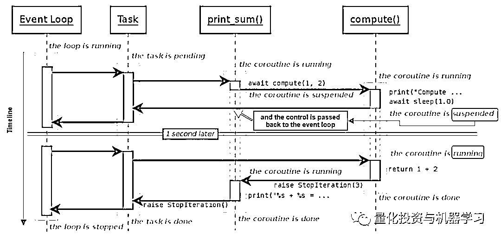

# 配对交易千千万，强化学习最 NB！（附文档+代码讲解）

> 原文：[`mp.weixin.qq.com/s?__biz=MzAxNTc0Mjg0Mg==&mid=2653292915&idx=1&sn=13f4ddebcd209b082697a75544852608&chksm=802dcb66b75a4270ceb19fac90eb2a70dc05f5b6daa295a7d31401aaa8697bbb53f5ff7c05af&scene=27#wechat_redirect`](http://mp.weixin.qq.com/s?__biz=MzAxNTc0Mjg0Mg==&mid=2653292915&idx=1&sn=13f4ddebcd209b082697a75544852608&chksm=802dcb66b75a4270ceb19fac90eb2a70dc05f5b6daa295a7d31401aaa8697bbb53f5ff7c05af&scene=27#wechat_redirect)

**标星★公众号     **爱你们♥

作者：WI

编译：叶别 | 公众号翻译部

**近期原创文章：**

## ♥ [5 种机器学习算法在预测股价的应用（代码+数据）](https://mp.weixin.qq.com/s?__biz=MzAxNTc0Mjg0Mg==&mid=2653290588&idx=1&sn=1d0409ad212ea8627e5d5cedf61953ac&chksm=802dc249b75a4b5fa245433320a4cc9da1a2cceb22df6fb1a28e5b94ff038319ae4e7ec6941f&token=1298662931&lang=zh_CN&scene=21#wechat_redirect)

## ♥ [Two Sigma 用新闻来预测股价走势，带你吊打 Kaggle](https://mp.weixin.qq.com/s?__biz=MzAxNTc0Mjg0Mg==&mid=2653290456&idx=1&sn=b8d2d8febc599742e43ea48e3c249323&chksm=802e3dcdb759b4db9279c689202101b6b154fb118a1c1be12b52e522e1a1d7944858dbd6637e&token=1330520237&lang=zh_CN&scene=21#wechat_redirect)

## ♥ 2 万字干货：[利用深度学习最新前沿预测股价走势](https://mp.weixin.qq.com/s?__biz=MzAxNTc0Mjg0Mg==&mid=2653290080&idx=1&sn=06c50cefe78a7b24c64c4fdb9739c7f3&chksm=802e3c75b759b563c01495d16a638a56ac7305fc324ee4917fd76c648f670b7f7276826bdaa8&token=770078636&lang=zh_CN&scene=21#wechat_redirect)

## ♥ [一位数据科学 PhD 眼中的算法交易](https://mp.weixin.qq.com/s?__biz=MzAxNTc0Mjg0Mg==&mid=2653290118&idx=1&sn=a261307470cf2f3e458ab4e7dc309179&chksm=802e3c93b759b585e079d3a797f512dfd0427ac02942339f4f1454bd368ba47be21cb52cf969&token=770078636&lang=zh_CN&scene=21#wechat_redirect)

## ♥ [基于 RNN 和 LSTM 的股市预测方法](https://mp.weixin.qq.com/s?__biz=MzAxNTc0Mjg0Mg==&mid=2653290481&idx=1&sn=f7360ea8554cc4f86fcc71315176b093&chksm=802e3de4b759b4f2235a0aeabb6e76b3e101ff09b9a2aa6fa67e6e824fc4274f68f4ae51af95&token=1865137106&lang=zh_CN&scene=21#wechat_redirect)

## ♥ [如何鉴别那些用深度学习预测股价的花哨模型？](https://mp.weixin.qq.com/s?__biz=MzAxNTc0Mjg0Mg==&mid=2653290132&idx=1&sn=cbf1e2a4526e6e9305a6110c17063f46&chksm=802e3c81b759b597d3dd94b8008e150c90087567904a29c0c4b58d7be220a9ece2008956d5db&token=1266110554&lang=zh_CN&scene=21#wechat_redirect)

## ♥ [优化强化学习 Q-learning 算法进行股市](https://mp.weixin.qq.com/s?__biz=MzAxNTc0Mjg0Mg==&mid=2653290286&idx=1&sn=882d39a18018733b93c8c8eac385b515&chksm=802e3d3bb759b42d1fc849f96bf02ae87edf2eab01b0beecd9340112c7fb06b95cb2246d2429&token=1330520237&lang=zh_CN&scene=21#wechat_redirect)

## ♥ [WorldQuant 101 Alpha、国泰君安 191 Alpha](https://mp.weixin.qq.com/s?__biz=MzAxNTc0Mjg0Mg==&mid=2653290927&idx=1&sn=ecca60811da74967f33a00329a1fe66a&chksm=802dc3bab75a4aac2bb4ccff7010063cc08ef51d0bf3d2f71621cdd6adece11f28133a242a15&token=48775331&lang=zh_CN&scene=21#wechat_redirect)

## ♥ [基于回声状态网络预测股票价格（附代码）](https://mp.weixin.qq.com/s?__biz=MzAxNTc0Mjg0Mg==&mid=2653291171&idx=1&sn=485a35e564b45046ff5a07c42bba1743&chksm=802dc0b6b75a49a07e5b91c512c8575104f777b39d0e1d71cf11881502209dc399fd6f641fb1&token=48775331&lang=zh_CN&scene=21#wechat_redirect)

## ♥ [AQR 最最最新 | 计量经济学应用投资失败的 7 个原因](https://mp.weixin.qq.com/s?__biz=MzAxNTc0Mjg0Mg==&mid=2653292186&idx=1&sn=87501434ae16f29afffec19a6884ee8d&chksm=802dc48fb75a4d99e0172bf484cdbf6aee86e36a95037847fd9f070cbe7144b4617c2d1b0644&token=48775331&lang=zh_CN&scene=21#wechat_redirect)

## ♥ [关于高盛在 Github 开源背后的真相！](https://mp.weixin.qq.com/s?__biz=MzAxNTc0Mjg0Mg==&mid=2653291594&idx=1&sn=7703403c5c537061994396e7e49e7ce5&chksm=802dc65fb75a4f49019cec951ac25d30ec7783738e9640ec108be95335597361c427258f5d5f&token=48775331&lang=zh_CN&scene=21#wechat_redirect)

## ♥ [新一代量化带货王诞生！Oh My God！](https://mp.weixin.qq.com/s?__biz=MzAxNTc0Mjg0Mg==&mid=2653291789&idx=1&sn=e31778d1b9372bc7aa6e57b82a69ec6e&chksm=802dc718b75a4e0ea4c022e70ea53f51c48d102ebf7e54993261619c36f24f3f9a5b63437e9e&token=48775331&lang=zh_CN&scene=21#wechat_redirect)

## ♥ [独家！关于定量/交易求职分享（附真实试题）](https://mp.weixin.qq.com/s?__biz=MzAxNTc0Mjg0Mg==&mid=2653291844&idx=1&sn=3fd8b57d32a0ebd43b17fa68ae954471&chksm=802dc751b75a4e4755fcbb0aa228355cebbbb6d34b292aa25b4f3fbd51013fcf7b17b91ddb71&token=48775331&lang=zh_CN&scene=21#wechat_redirect)

## ♥ [Quant 们的身份危机！](https://mp.weixin.qq.com/s?__biz=MzAxNTc0Mjg0Mg==&mid=2653291856&idx=1&sn=729b657ede2cb50c96e92193ab16102d&chksm=802dc745b75a4e53c5018cc1385214233ec4657a3479cd7193c95aaf65642f5f45fa0e465694&token=48775331&lang=zh_CN&scene=21#wechat_redirect)

## ♥ [拿起 Python，防御特朗普的 Twitter](https://mp.weixin.qq.com/s?__biz=MzAxNTc0Mjg0Mg==&mid=2653291977&idx=1&sn=01f146e9a88bf130ca1b479573e6d158&chksm=802dc7dcb75a4ecadfdbdace877ed948f56b72bc160952fd1e4bcde27260f823c999a65a0d6d&token=48775331&lang=zh_CN&scene=21#wechat_redirect)

**本文亮点**

**1、可扩展的基础架构，数据获取方便；** 

**2、Python 编程技术应用；**

**3、编程、计量经济学、强化学习的基础概念；**

**4、超全策略代码；**

本推文会介绍如何在利用股票分钟数据，基于强化学习来做配对交易。包括基本概念和具体实现；这里采用的强化学习方法，是类似多臂老虎机（N-armed bandit）问题。

**获取全部代码，见文末**

**数据获取**

****▍**Tiingo 数据源**

Tiingo 是一个金融研究平台，提供包括新闻、基本面和股票价格在内的数据。我们可以通过其 REST IEX API 提取日内股票市场数据，该 API 从 IEX 交易所检索到 TOPS 数据（最高价/最低价/开盘/收盘价）。

举个例子，可以通过访问以下链接来获取苹果公司在 2019 年 1 月 2 号中每 5 分钟的股价。

https://api.tiingo.com/iex/aapl/prices?startDate=2019-01-02&endDate=2019-01-02&resampleFreq=5min&token=ef79e455ba9b04c3df719407e34f05e1b051b4d6

json 返回结果：

为了使任务自动化，我们提供了一个能够在指定历史窗口内获得股票列表的标准化的日内数据的函数。

**不足之处有：**

1、最多提供 1 分钟级别的数据；

2、不同股票可以查询到的股价的天数不是固定的，即使指定 365 天的窗口，也可能只获得几天的数据；

3、不同股票在一天之内可以查询到的时间段也不是固定的（可能某些股票开盘后了才能查到股价）；查询速度不是很快。

**解决方案:**

1、一次只查询一只股票、只查询一天的数据；

2、对查询到的多个时间段的数据，用固定窗口去截断（比如限制每天只取 391 分钟的数据）；

3、异步 IO。

Pandas 提供了相关工具，可以从 Tiingo 和其它类似数据集中提取数据，但目前只提取天级别的数据。**虽然 API 是免费的，不过使用时也请注意调用方法，避免请求过多超出限制。**

**▍实现**

首先注册账号、申请：

*token:https://api.tiingo.com/account/api/token*

介绍下 Data/API.py 下面的几个主要函数：

1.生成获取股价数据的 url，参数有股票名(ticker)，时间(target_date)，请求频次(freq)，token；

2\. 获取 json 数据：

以上两个函数是放在 Data/API.py 文件中的 Tiingo 类下面的；可以根据输入不同重复执行。

**▍异步 IO**

上面实现是有局限性的、性能也比较差。 每获取一条数据时，程序会建立 API 连接、从服务器请求数据、等待响应，重复请求直到完成所有的 URL。异步 IO 的处理方式是不同的，下面这段代码是用异步 IO 的方式来获取 Google 和 Facebook 在 20180101 到 20180131 这段时间内的交易数据（每天 391 分钟数据, 319*24 个交易日*2 只股票，共约 15600 条数据）。可以看出，**相比于非异步请求，性能提升了 17 倍****（1.38s->23.58s）。**

**asyncio 是一个使用 async / await 方式的并发编程的库，asyncio 用作多个 Python 异步框架的基础，这些框架提供高性能的网络和 Web 服务器、数据库连接库、分布式任务队列等。AsyncIO 是单线程的，它使用一个单事件处理器来组织任务分配、以便多个任务可以在其他任务空闲时开始运行。**

下面有个官方示例来展示 asyncio 的思想。

程序地址：

*https://python.readthedocs.io/fr/latest/library/asyncio-task.html*

https://python.readthedocs.io/fr/latest/library/asyncio-task.html

上面程序中的关键字**async def**将相应的函数定义为可以暂停或恢复执行的协程。 每当任务运行到在关键字**await**处，将回传一个事件控制器（**loop**），该事件控制器再唤起另一个任务。 简单来说，这种方式不会浪费等待时间。

在我们的代码中也有类似的方法， **_fetch_hist_async**将创建一个事件循环来控制**fetch_data_async**进程（**fetch_data_async**是获取日内价格的基础任务）； 遇到 await 时控制器返回到事件循环，即使前一个请求尚未完成，也会触发另一个请求。

_fetch_hist_async in class Tiingo

fetch_data_async in class Tiingo

**▍数据存储**

把数据用.csv 格式保存到 STATICS/PRICE 目录下。

**代码结构**

**获取全部代码，见文末**

**配对交易的概念和分析**

****▍**配对交易**

配对交易是市场中性策略

Gatev 等人这样描述：

**“配对交易的概念非常简单， 找出价格在历史上一起变化的两只股票， 当它们之间的差距扩大时，做多价低者、做空价高者。如果历史重演，价格差距会收敛，套利者会获利。”** 

这里包含两个方阶段：

1、规则制订阶段：测量股票之间的价格关系,寻找潜在的股票配对。

2、在交易期间，监控股价变动，并根据预定义的规则进行交易。

Krauss (2017) 总结了配对交易的 5 种类型：距离法，协整方法，时间序列法，随机控制法和其他方法如机器学习、主成分分析、copula 等。 **本文是把经典的 Engle 和 Granger（1987）协整方法和强化学习算法结合起来的应用**。

这里我们会用时间序列分析中的平稳性的概念， 在金融时间序列中通常用的是弱平稳性（或协方差)，并遵从 3 个准则：

1、随机变量 x 的均值 E[x(t)]: 该均值和时间 t 独立； 

2、方差 Var(x(t))：大于 0 且有限的值、且与时间 t 独立；

3、协方差 Cov(x(t),x(s)):和 t-s 相关，但与单独的 t 和 s 独立。x(t)一般可以是对数股价收益（或差分），而不是价格本身。 如果一个时间序列的一阶差分平稳了，就是所谓的一阶单整 I(1)。

虽然有些交易可以从定向投注中获利，但这不是我们关注的，**我们真正想要的是找到一对价格差异或价差始终保持稳定（并且协整）的股票。**

**▍分析（见 EXAMPLE/Analysis.py）**

我们抽取了 20180101-20180731 期间的 21 只美股的 1 分钟级别的数据，用.csv 格式保存在 STATICS/PRICE 目录下。对时间段前 70%的数据，我们来进行一些分析。

****▍**Pearson 相关系数**

先看下代码：

****

看下结果：

上图可以看出，最高相关性位于 PEP（百事可乐）/PG（保洁）/JNJ（强生）/KO（可口可乐）这四只股票之间。从经济角度来看，可以形成两组配对：JNJ-PG 和 KO-PEP。 **不过需要注意的是高相关性并不一定意味着协整。**

**▍边缘分布**

如果我们画出以上股票对的边缘分布，可以看到线性相关和一些簇的关系。

代码如下：

效果如下：

**▍价格图表**

我们创建一个函数来绘制样本期间的价格和价差， 价格在开始时重新定为 1；其中第二个子图中的 th 是交易阈值（买点和买点），stop_loss 是止损点。

代码如下：

 

效果如下：

**▍****协整检验**

以下代码计算协整检验的 p 值，如果 p 值很小观察协整关系的概率应该相对较高。

代码如下：

但是相关性并不等于协整。即使两对股票的相关性是差不多的，但协整关系的概率差别比较大。

有时我们可以找到相关但不是协整的价格关系。**例如如果两种股票价格随着时间一起上涨，则它们是正相关的； 然而如果这两只股票以不同的速度上涨，价差将继续增长而不是在均衡时振荡，因此是非平稳的。**

下面给出一个例子，**用代码通过几何布朗运动（Geometric Brownian Motion）和 Cholesky 分解模拟两个相关的股票**，每个包含 1000 个样本。

可以看到虽然很相关，但是 p 值却非常大。

画出时间序列上的图：

上图中的第 2 个子图中显示了价差不断变大，而不是均值回归。

**▍协整**

1987 年 Engle 和 Granger 提出的协整理论，虽然一些变量的本身是非平稳序列，但是它们的线性组合却有可能是平稳序列。

这种平稳的线性组合被称为协整方程，且可解释为变量之间的长期稳定的均衡关系。具体地，如果两个 I(1)对数股票价格 x(1,t)和 x(2,t)有协整关系，那么存在一个系数 b 和一个平稳的时间序列 y(t), 使得：

其中 a 是一个固定常数，y(t)是目标的平稳的价差。 显然，我们可以简单地使用普通最小二乘方法来估计价差 y 和系数 b，通过将 x(1,t)来对 x(2,t)做回归。

****▍**协整检验**

测试协整的最常用方法是 DF 方法(Dickey Fuller)或 ADF 方法(Augmented Dickey Fuller)。

******▍********单****位根和 DF 检验**

对于一个简单的一阶自回归 AR(1)模型

其中 e(t)是白噪声，t 是时间, xt 是要检验的变量；如果 c=1 则说明单位根是存在的。

DF 检验是用来测试一个自回归模型是否存在单位根，把上面的回归模型改写为：

c=1 也就意味着零假设 c-1=0。 我们还可以添加截距或趋势项，并根据假设测试系数等于零的零假设。

******▍****ADF 检验**

把 DF 检验中用到的 AR(1)自回归改为高阶自回归 AR(p)，那么就是 ADF 检验。

AR(p)：

残差形式：

对应的零假设是：

**▍实现部分**

我们在策略类 EGCointegration 中实现了上面的分析。 请注意，此处的检验是基于 statsmodels.tsa.stattools.coint，在同一库中还有另一个函数 statsmodels.tsa.stattools.adfuller 是用来用于单元根检验的。

不同之处在于：

1、**coint**实际上是 Engle-Granger 协整检验，有 2 个时间序列输入，计算残差、对残差做检验；

2、**adfuller**是一个时间序列的输入，检验的是单变量的单位根。大部分场景下两个检验得出的结论是一致的，但是 coint 方法实现起来更直观。

**强化学习的介绍**

**▍基础概念**

强化学习有两个元素: Agent 和环境（Environment）。 环境由具有预定义状态空间（State）的不同状态表示，而 Agent 学习一个策略（Policy）来确定要在动作空间（Action）中执行哪个动作。 Agent 的学习周期可归纳为以下几个阶段：

**1、观察环境状态**

**2、根据现有 Policy 相应地采取动作**

**3、收到执行动作的相应奖励(Reward)**

**4、更新 Policy**

举个例子，假设一只小狗（Agent）正在学习如何对他主人的命令（环境）作出反应。 它是一只懒狗，只知道如何执行三个命令：

*   **坐**

*   **站**

*   **啥也不做**

为了训练小狗，他的主人经常给他一套命令（State），包括“坐”，“站”和“跳”。 如果狗的反应正确，他的主人会给他一些狗粮（Reward）。起初，小狗并不真正了解他的主人想要什么，不知道（Policy）如何将命令“正确地”映射到期望的动作（Action）。 但是，偶尔他可以做正确的动作并得到了奖励（Reward），并逐渐建立他们之间的联系（更新 Policy）。

经过多次试验，这个狗终于知道，只要听到“坐”或“站”这个词，他就应该坐/站立。 但无论他的主人要求他“跳”多少次，他都完全不知道该怎么办。 在这种情况下，他曾多次尝试坐下或站立，但无法获得任何奖励; 小狗最终选择了对“跳跃”命令什么都不做，因为与其他动作相比，这个选项能节约点体力（Reward 不为负）。

强化学习和监督学习是不同的。在监督学习中，每个样本都有一个预测目标以便计算差值，通过不断迭代减小这个差值来更新算法。然而在强化学习中，Policy 是通过评估来学习的，样本中没有直接的标注数据。Agent 只能通过持续评估反馈来学习，即不断挑选 Action 并评估相应的奖励(Reward)以调整策略(Policy)，保留最理想的结果。 强**化学习的流程要复杂一些， 如果我们在交易中应用强化学习时，需要仔细定义状态和动作空间这些基础元素。**

**▍几个简单的强化学习实例**

**多臂老虎机**

**问题：**上面的 2 臂老虎机，我们应该选择左臂还是右臂来获取最多的奖励。

**答案：**右臂。

但是机器如何学到这个策略呢？ 把这个问题转化为强化学习的形式如下:

*   **状态空间：无**

*   **动作空间: 拉左臂/右臂**

*   **奖励：1 或 0**

在训练过程中，RL 算法将重复上述任务（拉动手臂）并评估获得的奖励、持续更新策略(Policy)。 最后，通它应该能够得出哪个手臂最好拉动的结论。

**上下文赌博机**

上下文赌博机是多臂老虎机的扩展，如上图有 3 个机器、对于每个机器我们要选择不同的手臂。转化为强化学习形式如下:

*   **状态空间: 机器 A、机器 B、机器 C**

*   **动作空间：拉左臂/右臂**

*   **奖励：1 或 0**

**▍ 实现**

我们究竟希望机器学会如何执行？对于时间序列中的配对交易，**我们需要选择合适的历史窗口、交易窗口、交易阈值和止损这些都是动作（Action）的最佳组合来学习最大化预期交易利润（Reward）**。从强化学习的角度来看：

*   **状态空间：**无（只有一定的交易成本）

*   **动作空间：**历史窗口、交易窗口、交易阈值、止损点、信心水平

*   **奖励：**平均收益

**用强化学习实现配对交易**

实施的 6 个步骤有：

**1、加载相关配置和价格数据**

**2、将它们标准化并分成训练和测试集**

**3、创建状态空间和动作空间**

**4、构建网络**

**5、创建学习对象并开始训练**

**6、执行测试分析**

**参数：**

**配对股票**：JNJ-PG(强生 vs 宝洁)

**时间范围：**20180101-20180730

**数据频率：**分钟级别的

**状态空间：** 无

**动作空间:**

a. 历史窗口： 从 60 分钟到 600 分钟，每 60 分钟一步

b. 交易窗口: 从 120 分钟到 1200 分钟，每 60 分钟一步

c. 交易阈值： 增加/减少的访问时 1-5， 每步是 1

d. 止损点： 交易阈值基础上加减 1-2， 每步是 0.5

e. 信心水平：90%或 95%

**奖励：**平均收益

**交易数量：**每个买买信号交易 1 个价差

**价格校准：** 标准化

**交易价格：**实际价格

为了减轻极高回报的影响，平均回报的上限为 10。

**配置**

**第一步和第二步：**

加载相关配置和价格数据&& 将它们标准化并分成训练和测试集。

**第三步：**

创建状态空间和动作空间

**第四步：**

构建网络

**第五步：**

创建学习对象并开始训练

**第六步：**

执行测试分析

训练时的预期奖励如下：

训练中的奖励的分布：

训练好之后，对每分钟数据进行测试交易：

效果如下：

其中上图是每分钟内的交易数量；下图是累计收益(pnl)线。

**虽然看起来结果似乎不错，但在现实世界中情况因许多因素而变得复杂，例如买卖差价、执行延迟、保证金、利息、分数股等。但本文的目标是举例说明如何开发一个强化学习交易系统中用到的各种技术，希望对读者有一定借鉴意义。**

**代码设计逻辑**

**代码讲解**

代码讲解部分内容涉及较多，大家自行查看。

**参考文献**

Dickey, D. A., Fuller, W. A., 1979\. Distribution of the estimators for autoregressive time series with a unit root. Journal of the American Statistical Association. 74(366): 427–431. 

Engle, R.F., Granger, C.W.J., 1987, Co-integration and error correction: representation, estimation, and testing. Econometrica 55(2): 251–276

Gatev, E., Goetzmann, W.N., and Rouwenhorst, K.G., 2006, Pairs trading: performance of a relative-value arbitrage rule. The Review of Financial Studies 19(3): 797–827

Granger, C.W., 1981, Some properties of time series data and their use in econometric model specification. Journal of Economics 16(1): 121–130

Johansen, S., 1988, Statistical analysis of cointegration vectors. Journal of Economic Dynamics and Control 12(2–3): 231–254

Krauss, C., 2017, Statistical arbitrage pairs trading strategies: review and outlook. Journal of Economics Surveys 31(2): 513–545

Stock, J.H., 1987, Asymptotic properties of least squares estimators of cointegrating
vectors, Econometrica 55: 277–302.

Sutton, R.S., Barto, A.G., (1998), Reinforcement Learning: An Introduction. The MIT Press, Second Edition

**如何获取代码**

在**后台**输入（严格大小写）

***Pair-Trading-RL***

*—End—*

量化投资与机器学习微信公众号，是业内垂直于**Quant**、**MFE**、**CST**等专业的主流量化自媒体。公众号拥有来自**公募、私募、券商、银行、海外**等众多圈内**10W+**关注者。每日发布行业前沿研究成果和最新资讯。

