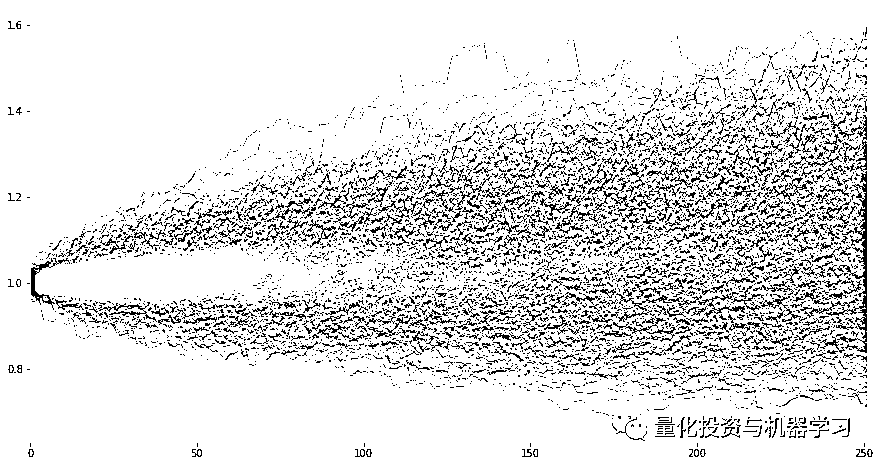

# 蒙特卡洛 VS 自举法 | 在投资组合中的应用（附代码）

> 原文：[`mp.weixin.qq.com/s?__biz=MzAxNTc0Mjg0Mg==&mid=2653292860&idx=1&sn=6d2b9e8fbdb0fb6937f6acc04f0b3ef3&chksm=802dcb29b75a423f70adff93ee449336ae539c96771640c67a343a3c6b424f06a5a1b1562f4f&scene=27#wechat_redirect`](http://mp.weixin.qq.com/s?__biz=MzAxNTc0Mjg0Mg==&mid=2653292860&idx=1&sn=6d2b9e8fbdb0fb6937f6acc04f0b3ef3&chksm=802dcb29b75a423f70adff93ee449336ae539c96771640c67a343a3c6b424f06a5a1b1562f4f&scene=27#wechat_redirect)

**标星★公众号     **爱你们♥

作者：Stuart J

编译：波哥大 | 公众号翻译部

**近期原创文章：**

## ♥ [5 种机器学习算法在预测股价的应用（代码+数据）](https://mp.weixin.qq.com/s?__biz=MzAxNTc0Mjg0Mg==&mid=2653290588&idx=1&sn=1d0409ad212ea8627e5d5cedf61953ac&chksm=802dc249b75a4b5fa245433320a4cc9da1a2cceb22df6fb1a28e5b94ff038319ae4e7ec6941f&token=1298662931&lang=zh_CN&scene=21#wechat_redirect)

## ♥ [Two Sigma 用新闻来预测股价走势，带你吊打 Kaggle](https://mp.weixin.qq.com/s?__biz=MzAxNTc0Mjg0Mg==&mid=2653290456&idx=1&sn=b8d2d8febc599742e43ea48e3c249323&chksm=802e3dcdb759b4db9279c689202101b6b154fb118a1c1be12b52e522e1a1d7944858dbd6637e&token=1330520237&lang=zh_CN&scene=21#wechat_redirect)

## ♥ 2 万字干货：[利用深度学习最新前沿预测股价走势](https://mp.weixin.qq.com/s?__biz=MzAxNTc0Mjg0Mg==&mid=2653290080&idx=1&sn=06c50cefe78a7b24c64c4fdb9739c7f3&chksm=802e3c75b759b563c01495d16a638a56ac7305fc324ee4917fd76c648f670b7f7276826bdaa8&token=770078636&lang=zh_CN&scene=21#wechat_redirect)

## ♥ [一位数据科学 PhD 眼中的算法交易](https://mp.weixin.qq.com/s?__biz=MzAxNTc0Mjg0Mg==&mid=2653290118&idx=1&sn=a261307470cf2f3e458ab4e7dc309179&chksm=802e3c93b759b585e079d3a797f512dfd0427ac02942339f4f1454bd368ba47be21cb52cf969&token=770078636&lang=zh_CN&scene=21#wechat_redirect)

## ♥ [基于 RNN 和 LSTM 的股市预测方法](https://mp.weixin.qq.com/s?__biz=MzAxNTc0Mjg0Mg==&mid=2653290481&idx=1&sn=f7360ea8554cc4f86fcc71315176b093&chksm=802e3de4b759b4f2235a0aeabb6e76b3e101ff09b9a2aa6fa67e6e824fc4274f68f4ae51af95&token=1865137106&lang=zh_CN&scene=21#wechat_redirect)

## ♥ [如何鉴别那些用深度学习预测股价的花哨模型？](https://mp.weixin.qq.com/s?__biz=MzAxNTc0Mjg0Mg==&mid=2653290132&idx=1&sn=cbf1e2a4526e6e9305a6110c17063f46&chksm=802e3c81b759b597d3dd94b8008e150c90087567904a29c0c4b58d7be220a9ece2008956d5db&token=1266110554&lang=zh_CN&scene=21#wechat_redirect)

## ♥ [优化强化学习 Q-learning 算法进行股市](https://mp.weixin.qq.com/s?__biz=MzAxNTc0Mjg0Mg==&mid=2653290286&idx=1&sn=882d39a18018733b93c8c8eac385b515&chksm=802e3d3bb759b42d1fc849f96bf02ae87edf2eab01b0beecd9340112c7fb06b95cb2246d2429&token=1330520237&lang=zh_CN&scene=21#wechat_redirect)

## ♥ [WorldQuant 101 Alpha、国泰君安 191 Alpha](https://mp.weixin.qq.com/s?__biz=MzAxNTc0Mjg0Mg==&mid=2653290927&idx=1&sn=ecca60811da74967f33a00329a1fe66a&chksm=802dc3bab75a4aac2bb4ccff7010063cc08ef51d0bf3d2f71621cdd6adece11f28133a242a15&token=48775331&lang=zh_CN&scene=21#wechat_redirect)

## ♥ [基于回声状态网络预测股票价格（附代码）](https://mp.weixin.qq.com/s?__biz=MzAxNTc0Mjg0Mg==&mid=2653291171&idx=1&sn=485a35e564b45046ff5a07c42bba1743&chksm=802dc0b6b75a49a07e5b91c512c8575104f777b39d0e1d71cf11881502209dc399fd6f641fb1&token=48775331&lang=zh_CN&scene=21#wechat_redirect)

## ♥ [AQR 最最最新 | 计量经济学应用投资失败的 7 个原因](https://mp.weixin.qq.com/s?__biz=MzAxNTc0Mjg0Mg==&mid=2653292186&idx=1&sn=87501434ae16f29afffec19a6884ee8d&chksm=802dc48fb75a4d99e0172bf484cdbf6aee86e36a95037847fd9f070cbe7144b4617c2d1b0644&token=48775331&lang=zh_CN&scene=21#wechat_redirect)

## ♥ [关于高盛在 Github 开源背后的真相！](https://mp.weixin.qq.com/s?__biz=MzAxNTc0Mjg0Mg==&mid=2653291594&idx=1&sn=7703403c5c537061994396e7e49e7ce5&chksm=802dc65fb75a4f49019cec951ac25d30ec7783738e9640ec108be95335597361c427258f5d5f&token=48775331&lang=zh_CN&scene=21#wechat_redirect)

## ♥ [新一代量化带货王诞生！Oh My God！](https://mp.weixin.qq.com/s?__biz=MzAxNTc0Mjg0Mg==&mid=2653291789&idx=1&sn=e31778d1b9372bc7aa6e57b82a69ec6e&chksm=802dc718b75a4e0ea4c022e70ea53f51c48d102ebf7e54993261619c36f24f3f9a5b63437e9e&token=48775331&lang=zh_CN&scene=21#wechat_redirect)

## ♥ [独家！关于定量/交易求职分享（附真实试题）](https://mp.weixin.qq.com/s?__biz=MzAxNTc0Mjg0Mg==&mid=2653291844&idx=1&sn=3fd8b57d32a0ebd43b17fa68ae954471&chksm=802dc751b75a4e4755fcbb0aa228355cebbbb6d34b292aa25b4f3fbd51013fcf7b17b91ddb71&token=48775331&lang=zh_CN&scene=21#wechat_redirect)

## ♥ [Quant 们的身份危机！](https://mp.weixin.qq.com/s?__biz=MzAxNTc0Mjg0Mg==&mid=2653291856&idx=1&sn=729b657ede2cb50c96e92193ab16102d&chksm=802dc745b75a4e53c5018cc1385214233ec4657a3479cd7193c95aaf65642f5f45fa0e465694&token=48775331&lang=zh_CN&scene=21#wechat_redirect)

## ♥ [拿起 Python，防御特朗普的 Twitter](https://mp.weixin.qq.com/s?__biz=MzAxNTc0Mjg0Mg==&mid=2653291977&idx=1&sn=01f146e9a88bf130ca1b479573e6d158&chksm=802dc7dcb75a4ecadfdbdace877ed948f56b72bc160952fd1e4bcde27260f823c999a65a0d6d&token=48775331&lang=zh_CN&scene=21#wechat_redirect)

**正文**

在这篇文章中，我们将比较**蒙特卡洛分析**（Monte Carlo analysis）和**自举法**（Bootstrapping）中的一些概念，这些概念与模拟收益序列以及生成与投资组合潜在风险和回报相关的置信区间有关。

这两种方法都用于为给定的资产或资产组合生成模拟的价格路径，但它们使用的方法略有不同，对于以前没有遇到过的人来说，这两种方法之间可能显得有些微妙。从技术上讲，**自举法（Bootstrapping）是蒙特卡洛模拟（Monte Carlo analysis）的一个特例**，所以乍一看这两个方法可能有点令人困惑。

对于蒙特卡罗分析（这里我们主要谈论“参数化的”蒙特卡罗方法），我们的想法是基于一些潜在的模型特征来生成数据。所以，例如，我们基于正态分布生成数据，指定我们对模型的期望输入，在这里就是平均值和标准差。那我们从哪里获得这些输入数据，人们往往会根据所讨论资产的历史实际价值来设置这些输入量。

因此，如果我们试图运行一些参数化的蒙特卡罗运行来生成模拟数据，例如股票上的应用，我们倾向于测量并计算该股票在一段时间内实际历史回报率的平均值和标准差，并将其用作模型的输入值。这就是这种方法的**缺点之一**，因为这样模型的输出值和相应的推论会依赖于这样一个假设，**即股票的未来回报率会有与历史回报率相同的特征**（至少这会用于计算模型的输入值）。

那么什么是 Bootstrapping 以及它有何不同？**Bootstrapping 也使用历史回报率作为模型输入，但这种方法使用历史数据更加明确。我们实际上是通过从历史回报率的分布去抽样来生成我们的数据，而不是计算回报率的基本特征然后将它们插入到参数化的模型中。**

值得注意的是，Bootstrapping 是一个涉及“替换”，并且属于“替换采样”方法的概念。

这意味着当一个随机样本从历史回报率的分布中被提取时，它不会被“抛弃”并从“帽子”中移除，而是将其替换并放回，以便在接下来的抽样期间被再次进行选择。

**这有一个需要注意的关键点，就是这种方法会导致一个根本不同的结果，即如果一个是“无需替换的样本”，那么在任何时候一个数据点被选中，它将从样本中被移除。**

Bootstrapping 方法背后的逻辑是，**如果我们使用带有替换性的抽样，如果是随机的情况下，那么抽取的每个样本将具有在“现实生活”中相同的出现频率**——比如上述在实际市场中出现那个特定的股票（这再次依赖于上述的那个假设，即基于抽取的样本，未来的收益分配将保留与历史收益相同的分布特征。也就是说，未来和过去的收益分布均来自相同的“总体”）。

为了解释这个问题，我们会收集一篮子资产的数据去创建一个同等权重的投资组合，然后运行参数化的蒙特卡罗方法和 Bootstrapping 模拟，接着比较这两个结果——看看它们的结果有多么相似！

首先是一些基本的导入和其他变量设置（图表的样式，“魔术”指令调用，在 Jupyter notebooks 中启用 matplotlib 绘图，并设置“figsize”变量以便用于图表调用）。

现在我们使用“pandas_datareader”从雅虎（Yahoo）下载一些价格数据用于各种股票指数，并将它们全部重新设置为从 1 开始以便进行比较。

接下来让我们为下载的资产数据绘制我们的价格序列。

现在，当对资产组合进行 Bootstrapping 时，我们要确保我们做法是正确的，这一点至关重要。**我们的方法必须能够解释资产之间的任何相关性，如果我们不这样做，我们将得到偏离现实的结果。**

例如，两个强负相关的股票，如果我们在进行随机抽样时对每个股票进行独立抽样，我们可能会抽取股票 1 在某个特定日的的样本，以及股票 2 在另一天的样本。好吧，如果我们这样做，我们可能就会看到这个样本对股票 1 有强正相关性，对于股票 2 而言，我们真的可以相信这是一种真正代表这两个股票之间真实关系的情况吗？

答案是否定的，**因为我们正在比较“苹果和橙子”——我们需要从同一时间段抽取我们的投资组合成分的样本，只有这样的随机样本才能正确地捕获所有资产之间的相关性。**

因此，**我们可以从我们所有投资组合成分的历史回报率序列中生成多个随机抽样（替换），然后相应地对它们进行加权，最终将加权回报相加并将相应的输出记录为我们的自举法的（Bootstrapped） “投资组合回报”**。 然后我们会多次重复此过程，每次记录模拟的“投资组合回报” ——这个模拟回报路径的集合就是我们的自举法的输出。

或者，**我们可以通过相应地对组合历史回报进行加权，将它们相加，然后对该单一组合历史回报分布执行 Bootstrapping 过程来构建投资组合回报**。 这个结果非常类似，因为在第二种方法中的构建投资组合的方式也固有地保留了组成资产之间所有相关性，因为回报序列是使用同一天发生的加权成分收益计算的。所以我们可以只自举单个组合，再次生成多个模拟收益路径，这些路径的集合将是我们的 Bootstrapped 输出。

让我们从第二种方法开始，创建我们同等加权的投资组合回报序列。我们只对相同权重的投资组合的单个成分收益取均值 - 这很简单。 然后让我们根据各个组合成分绘制我们投资组合的“价格序列”。

正如你所期望的那样，回报最终会在位于单个回报的中间位置。事实上，由于这是一个同等加权的投资组合，它最终会完全精确地位于成分收益的“中间”。

现在让我们在投资组合收益序列中执行 Bootstrapping 过程并绘制结果。

我们在下面这样做只是为了证明从另一个方法去完成上述目标是类似的。我们采用单个成分收益序列的样本，并使用它们来创建我们的 Bootstrapped 模拟量。我们以相同的结果结束（这里或者那里，当然有一个随机元素，即使基于相同的方法也会使每个得到的模拟量都不同）——下面是实现它的代码。

最后，我们看下使用参数化的蒙特卡罗方法，之后我们可以快速比较各种方法之间的结果。

如前所述，**参数化的蒙特卡罗方法涉及使用基础总体的特征来生成随机样本的值**。我们在这里讨论的特征是历史回报分布的均值和标准差（或方差）。然后将这些值输入到模型中，该模型从一个正态分布中随机采样，其平均值和标准差等于历史回报的平均值和标准差。

让我们首先从我们的投资组合中提取这些数据。我们就有了早期的历史收益序列。

现在我们从均值为 0.04％，标准差为 0.85％的正态分布中产生必要的样本。

现在让我们最终运行蒙特卡罗模拟方法，但这次从每个单独的资产分布中创建随机样本，然后构建我们的投资组合，看看结果是否有任何差异。

为每个单独的资产创建模拟资产回报的 DataFrame，并将它们存储在列表中。

使用列表推导来遍历资产回报 DataFrames 列表，并将值除以资产数量以表示同等加权的投资组合。

使用“functools”库中的“reduce”函数将 DataFrame 值加在一起（顺便说一句，对于这样的大型库，加载的函数非常有用，绝对值得一试）。

最后，我们绘制了蒙特卡罗组合值模拟结果。

我们可以立即发现有些东西看起来不同！或者，也许不是立即，但有些东西应该跳出来到我们面前。如果你注意到，所有以前的模拟，无**论是 Bootstrapping 还是 Monte Carlo，产生的模拟值都在 0.8 到 1.6 的结束值范围内。 但在最后一个图中，我们看到这些界限已经收紧到 0.9 到 1.3 左右。**

这是一个显着的差异，而且不能仅仅考虑随机性的影响。**如果你重新运行所有这些模拟几次，你会发现结果仍然相似，并且最后一种方法几乎总会产生更紧密的结束值范围**。

那你为什么要问这个呢！

还记得当我们提到个别资产之间的相关性的影响，以及我们在运行模拟时必须小心捕获这种影响的事实吗？它只是最后一种无法捕获这种相关性关系的方法。

让我们快速浏览一下我们选择的“资产范围”中资产成分回报之间的历史相关性。

注 - 重要的是计算资产收益之间的相关性，而不是它们的价格（可能在未来的文章中更多地提及）。

让我们创建一个漂亮的小相关热力图来看看。

从上述数值来看，我们可以看到所有资产在某种程度上都是正相关的，有些值更大，重要的是所有的值都是正的。

要说明为什么我们的最后一个情节和最后一个模拟方法（对成分资产进行参数蒙特卡罗模拟然后加权并求和以表示我们的投资组合）导致更窄范围的结束值，这有许多要解释。

逻辑相当简单——当两个资产相关时，它们往往会同时向同一个方向移动——所以如果一个值上升，那么另一个一般也会如此（有一些警告——再次，或许更多在未来的文章中）。这导致包含正相关资产的投资组合，平均而言，比完全不相关资产的投资组合会有更多极端的值，或者实际上是负相关资产的投资组合。

**这是因为如果所有成分资产高度相关，它们都会同时上下移动，导致价值波动更大。**

那么这与我们的情况有什么关系？为什么它会导致最后一个模型中结果差异？

前三种方法都捕获了组成资产之间存在的内在相关性，而我们的最后一种方法却没有。

方法 1 使用真实的历史日收益值创建了我们的投资组合，这些值实际上是在市场上同一天发生的——**因此所采用的移动是由真实的动作产生的，这些移动是由可以解释的标的资产运动过程产生的，并且这一过程受的资产之间的真实相关性影响**。

方法 2 的逻辑相同——尽管我们这次为我们的个人资产提供了 Bootstrapped 回报，然后形成了投资组合，**但再次仔细选择了 Bootstrapped 的初始回报，以便一次抽取的所有回报都来自同一天的每个资**产。这再次确保我们提取的值是实际发生在一天的实际值，并且再次由真实的标的资产运动过程生成，这**隐含地解释了资产之间的相关****性**。

现在，对于方法 3 和方法 4 的差异，它变得稍微微妙一些。

通过方法 3，我们使用真实的单个资产回报创建了我们的投资组合，然后运行参数化的 Bootstrap 过程，根据投资组合的基本特征模拟回报序列。现在这里是重要的部分——**因为投资组合首先是通过使用个别资产的加权每日收益的实际值创建的，价格序列隐含地解释了资产之间的相关性**。然后，当运行蒙特卡罗模拟时，输入的参数是在具有隐含内置的相关关系的历史价格序列上计算的。因此，该方法 DID 捕获了相关性的影响。

但是，对于方法 4，我们未能正确地模拟资产之间的相关性。对于每个资产单独的蒙特卡罗模拟都使用基于完全相互独立的计算值计算的参数。

**一项资产的均值和标准差的计算是在“真空”中进行的，在某种程度上，完全独立于其他资产。**

由于抽样样本来自正态分布，这意味着每个资产每天抽取的单个值确实是“随机的”——也就是说，不管其他资产的结果如何，每个单独资产的结果可能有相等的机会是正面的或负面的。

这听起来非常像我们对一系列完全不相关的资产所期望的——每个资产随机移动，而不管其他资产的移动。

突然间，我们开始模拟一篮子不相关资产的模拟价格系列！

这不是我们想要的......所以在执行这些方法时要小心，并**确保正确建模你实际想要建模的内容！**

*—End—*

量化投资与机器学习微信公众号，是业内垂直于**Quant**、**MFE**、**CST**等专业的主流量化自媒体。公众号拥有来自**公募、私募、券商、银行、海外**等众多圈内**10W+**关注者。每日发布行业前沿研究成果和最新资讯。

