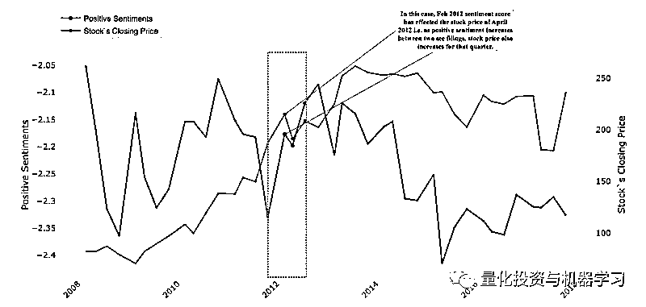

# QuantML | 使用财务情绪与量价数据预测稳健的投资组合（附代码）

> 原文：[`mp.weixin.qq.com/s?__biz=MzAxNTc0Mjg0Mg==&mid=2653292834&idx=1&sn=d50a527f52055afda613587af17ff0bb&chksm=802dcb37b75a4221998b40ec1153f4092755dad4abf51582c22933b0e3e05e6d97b508654656&scene=27#wechat_redirect`](http://mp.weixin.qq.com/s?__biz=MzAxNTc0Mjg0Mg==&mid=2653292834&idx=1&sn=d50a527f52055afda613587af17ff0bb&chksm=802dcb37b75a4221998b40ec1153f4092755dad4abf51582c22933b0e3e05e6d97b508654656&scene=27#wechat_redirect)

**标星★公众号     **爱你们♥

作者：Nandita Dwivedi

编译：Lin | 公众号翻译部

**近期原创文章：**

## ♥ [5 种机器学习算法在预测股价的应用（代码+数据）](https://mp.weixin.qq.com/s?__biz=MzAxNTc0Mjg0Mg==&mid=2653290588&idx=1&sn=1d0409ad212ea8627e5d5cedf61953ac&chksm=802dc249b75a4b5fa245433320a4cc9da1a2cceb22df6fb1a28e5b94ff038319ae4e7ec6941f&token=1298662931&lang=zh_CN&scene=21#wechat_redirect)

## ♥ [Two Sigma 用新闻来预测股价走势，带你吊打 Kaggle](https://mp.weixin.qq.com/s?__biz=MzAxNTc0Mjg0Mg==&mid=2653290456&idx=1&sn=b8d2d8febc599742e43ea48e3c249323&chksm=802e3dcdb759b4db9279c689202101b6b154fb118a1c1be12b52e522e1a1d7944858dbd6637e&token=1330520237&lang=zh_CN&scene=21#wechat_redirect)

## ♥ 2 万字干货：[利用深度学习最新前沿预测股价走势](https://mp.weixin.qq.com/s?__biz=MzAxNTc0Mjg0Mg==&mid=2653290080&idx=1&sn=06c50cefe78a7b24c64c4fdb9739c7f3&chksm=802e3c75b759b563c01495d16a638a56ac7305fc324ee4917fd76c648f670b7f7276826bdaa8&token=770078636&lang=zh_CN&scene=21#wechat_redirect)

## ♥ [一位数据科学 PhD 眼中的算法交易](https://mp.weixin.qq.com/s?__biz=MzAxNTc0Mjg0Mg==&mid=2653290118&idx=1&sn=a261307470cf2f3e458ab4e7dc309179&chksm=802e3c93b759b585e079d3a797f512dfd0427ac02942339f4f1454bd368ba47be21cb52cf969&token=770078636&lang=zh_CN&scene=21#wechat_redirect)

## ♥ [基于 RNN 和 LSTM 的股市预测方法](https://mp.weixin.qq.com/s?__biz=MzAxNTc0Mjg0Mg==&mid=2653290481&idx=1&sn=f7360ea8554cc4f86fcc71315176b093&chksm=802e3de4b759b4f2235a0aeabb6e76b3e101ff09b9a2aa6fa67e6e824fc4274f68f4ae51af95&token=1865137106&lang=zh_CN&scene=21#wechat_redirect)

## ♥ [如何鉴别那些用深度学习预测股价的花哨模型？](https://mp.weixin.qq.com/s?__biz=MzAxNTc0Mjg0Mg==&mid=2653290132&idx=1&sn=cbf1e2a4526e6e9305a6110c17063f46&chksm=802e3c81b759b597d3dd94b8008e150c90087567904a29c0c4b58d7be220a9ece2008956d5db&token=1266110554&lang=zh_CN&scene=21#wechat_redirect)

## ♥ [优化强化学习 Q-learning 算法进行股市](https://mp.weixin.qq.com/s?__biz=MzAxNTc0Mjg0Mg==&mid=2653290286&idx=1&sn=882d39a18018733b93c8c8eac385b515&chksm=802e3d3bb759b42d1fc849f96bf02ae87edf2eab01b0beecd9340112c7fb06b95cb2246d2429&token=1330520237&lang=zh_CN&scene=21#wechat_redirect)

## ♥ [WorldQuant 101 Alpha、国泰君安 191 Alpha](https://mp.weixin.qq.com/s?__biz=MzAxNTc0Mjg0Mg==&mid=2653290927&idx=1&sn=ecca60811da74967f33a00329a1fe66a&chksm=802dc3bab75a4aac2bb4ccff7010063cc08ef51d0bf3d2f71621cdd6adece11f28133a242a15&token=48775331&lang=zh_CN&scene=21#wechat_redirect)

## ♥ [基于回声状态网络预测股票价格（附代码）](https://mp.weixin.qq.com/s?__biz=MzAxNTc0Mjg0Mg==&mid=2653291171&idx=1&sn=485a35e564b45046ff5a07c42bba1743&chksm=802dc0b6b75a49a07e5b91c512c8575104f777b39d0e1d71cf11881502209dc399fd6f641fb1&token=48775331&lang=zh_CN&scene=21#wechat_redirect)

## ♥ [AQR 最最最新 | 计量经济学应用投资失败的 7 个原因](https://mp.weixin.qq.com/s?__biz=MzAxNTc0Mjg0Mg==&mid=2653292186&idx=1&sn=87501434ae16f29afffec19a6884ee8d&chksm=802dc48fb75a4d99e0172bf484cdbf6aee86e36a95037847fd9f070cbe7144b4617c2d1b0644&token=48775331&lang=zh_CN&scene=21#wechat_redirect)

## ♥ [关于高盛在 Github 开源背后的真相！](https://mp.weixin.qq.com/s?__biz=MzAxNTc0Mjg0Mg==&mid=2653291594&idx=1&sn=7703403c5c537061994396e7e49e7ce5&chksm=802dc65fb75a4f49019cec951ac25d30ec7783738e9640ec108be95335597361c427258f5d5f&token=48775331&lang=zh_CN&scene=21#wechat_redirect)

## ♥ [新一代量化带货王诞生！Oh My God！](https://mp.weixin.qq.com/s?__biz=MzAxNTc0Mjg0Mg==&mid=2653291789&idx=1&sn=e31778d1b9372bc7aa6e57b82a69ec6e&chksm=802dc718b75a4e0ea4c022e70ea53f51c48d102ebf7e54993261619c36f24f3f9a5b63437e9e&token=48775331&lang=zh_CN&scene=21#wechat_redirect)

## ♥ [独家！关于定量/交易求职分享（附真实试题）](https://mp.weixin.qq.com/s?__biz=MzAxNTc0Mjg0Mg==&mid=2653291844&idx=1&sn=3fd8b57d32a0ebd43b17fa68ae954471&chksm=802dc751b75a4e4755fcbb0aa228355cebbbb6d34b292aa25b4f3fbd51013fcf7b17b91ddb71&token=48775331&lang=zh_CN&scene=21#wechat_redirect)

## ♥ [Quant 们的身份危机！](https://mp.weixin.qq.com/s?__biz=MzAxNTc0Mjg0Mg==&mid=2653291856&idx=1&sn=729b657ede2cb50c96e92193ab16102d&chksm=802dc745b75a4e53c5018cc1385214233ec4657a3479cd7193c95aaf65642f5f45fa0e465694&token=48775331&lang=zh_CN&scene=21#wechat_redirect)

## ♥ [拿起 Python，防御特朗普的 Twitter](https://mp.weixin.qq.com/s?__biz=MzAxNTc0Mjg0Mg==&mid=2653291977&idx=1&sn=01f146e9a88bf130ca1b479573e6d158&chksm=802dc7dcb75a4ecadfdbdace877ed948f56b72bc160952fd1e4bcde27260f823c999a65a0d6d&token=48775331&lang=zh_CN&scene=21#wechat_redirect)

**获取全部代码，见文末**

**动机和背景**

投资组合管理是最大化投资组合回报的过程。投资组合经理根据他们对风险的偏好，代表客户做出交易决策。他们在决定他们应该在投资组合中持有哪些股票以平衡风险和获取最大回报之前，分析不同的资产的优势和劣势。这使得投资组合管理变得困难。**我们的目标是通过使用预测建模和深度学习技术使这个过程更好**，根据下个季度的预测股价生成稳定的投资组合。

在过去，人们做了很多预测公司股票价格的尝试，并且尝试去理解新闻文章，Twitter 帖子和其他平台的文字内容如何影响股票价格。这些尝试涉及分析上述资源的情绪影响并预测股价。尚未探讨过的是财务报告的情绪影响在预测股价上的效果。哈佛商学院发表了一份工作论文，名为“Lazy Prices”。论文指出**财务报告对公司的市值有影响**。他们表示，报表的相似性（Jaccard 和 Cosine Score）急剧变化可以增加或减少公司的市值[1]。

译者注：**该论文认为年报或季报中常规内容的变动包含有用的预测信息，做空报表变动大的公司，做多报表无变动的公司，可以获得超额收益。**

**问题陈述**

该项目要求我们首先探索金融领域，并收集有关股票价格变动，交易方法和投资组合管理技术的信息。我们了解到目前为止数据科学在金融方面的影响力如何，并提出了我们想要关注的三个主要问题：

**1、企业提交的季度和年度财务报告在多大程度上影响其股价？**

**2、包含历史财务报告的情绪因素，股票价格的预测会发生什么改变？**

**3、我们如何使用下一季度的预测值建立稳定的投资组合？**

这些问题具有挑战性，因为我们不得不对该领域进行大量的背景研究。使用正确的特征和进行适当的特征工程来提出最佳预测方法具有非常陡峭的学习曲线。除此之外，这些文件的数据来源和格式不一致，因此解析数据也是一项巨大的挑战。这里涉及两种不同的数据源：**一种是来自财务报告的数据，另一种是股票行情数据**。为了准备分析数据集并训练我们的预测模型，我们必须研究各种方法来整合这两种数据源。这些数据集彼此之间不是直接对齐的，因为 OHLC（开高低收）数据每天发布，而 SEC 报告每季度发布一次。要将这两种数据合并在一起，我们必须仔细匹配日期，然后深思熟虑地进行特征工程来构造下个季度的预测值。

**数据工作**

**数据采集**

来自 EDGAR 的 SEC 10-Q 和 10-K 文件。

我们数据处理流程的第一步是解析 SEC Edgar（电子数据收集，分析和检索）数据库。这是一个由美国证券交易委员会（“SEC”）维护的在线数据库，用于跟踪上市公司提交的所有 SEC 文件，现在包含超过 1200 万份此类文件。

由于 EDGAR 在撰写本文时不支持除公司代码和中央索引键（CIK）之外的任何过滤选项，因此我们不得不提取标普 500 [2]公司所有 10-K 和 10-Q 文件，而不是只提取我们感兴趣的某段时间内的文件。

我们从数据库中为 S＆P 500 所有股票收集了大约 60 GB 的数据。由于 EDGAR 将每个用户的请求数限制为每秒 10 次，因此我们必须添加一些额外的模块以适应此限制。此外，考虑到数据集的庞大规模，我们在下载时对每个下载的股票进行维护和检查，以便在发生故障时允许在稍后恢复并避免任何数据丢失。

**来自 QuandlAPI 的 OHLC 数据**

OHLC（open-high-low-close）是包含每个工作日股票开盘价，最高价，最低价和收盘价的数据集。该数据集在我们流程的后期是用于训练模型的最重要信息之一。我们利用 Stocker [3]（Quandl API 的 Python 接口）来检索每个标普 500 指数公司的 OHLC 数据。

**数据准备**

来自 EDGAR 的 SEC 10-Q 和 10-K 报表文件

我们发现收集的 10-K 和 10-Q SEC 文件是高度非结构化的，因为它包含 HTML 标签，符号和数字表。我们通过删除不相关的数据来清理这些文件，然后将 HTML 解析为干净的文本数据，然后用于分析情绪。为了清理和解析，我们使用了正则表达式，NumPy 和 BeautifulSoup。

作为数据准备的一部分，我们还为每个 CIK 生成了 10-K 和 10-Q 文件的 CikList 列表映射文件，其中包含日期，SEC 类型，文件名，CIK 和股票代码。日期字段是 SEC 表格的提交日期; SEC 类型为 10-Q 或 10-K，文件名为 SEC 文件名。

每个 CikList 映射文件大约有 12 行用于 10-K 和 34 行用于 10-Q SEC，时间窗口是 10 年。我们使用这些映射文件来跟踪每个 CIK 的 SEC 报表。这些保存的映射稍后用于计算与每个 CIK 相对应的所有 SEC 报表的情绪。

**来自 QuandlAPI 的 OHLC 数据**

通过 Python Stocker 模块，可以轻松获取每个股票的 Pandas dataframe 格式的 OHLC 数据。但是，由于我们用过去 90 天窗口（原因将在下文介绍）对下一季度进行预测，因此我们必须先进行一些数据处理才能将其提供给我们的深度学习模型。

我们使用了 90 天的窗口（一个季度是 90 天）将每行构造为包含该期间所有 OHLC 数据的 X 和 Adj.Close 作为 Y.我们构造该数据的可视化方法如图 1 所示：

图 1：在 OHLC 数据上创建的 90 天窗口

**数据集成**

**将情绪分数与 OHLC 数据相结合**

将 Quandl API 获得的 OHLC 数据与基于日期的 SEC 文件的情绪相结合是很复杂的，因为 SEC 文件日期和 OHLC 季度日期不同。

对于 OHLC 数据，季度股票收益率分别为第 3，第 6，第 9 和第 12 个月，而对于 SEC，季度数据为第 2，第 5，第 7 和第 10 个月。

因此，**为了解决这个问题，我们使用了 Pandas 的“forward”合并方法，该方法将该季度 SEC 文件的情绪分数与下一个最近的日期的股票价格数据相匹配。这种映射背后的目的是分析在财务报告发布后如何影响收盘价的**。我们在图 2 中显示了合并后数据的前 10 行。

图 2：OHLC 数据与 GWW 的 SEC 情绪分数合并

**标准化标普 500 股票的 OHLC 数据**

我们只获取标普 500 指数公司 10 年的股票数据。将这些数据限制在最近的时间窗口的原因在于，人们普遍认为财务数据是“非平稳的”并且制度的变化可能使旧数据与预测的相关性降低[4,5]。因此，我们将此期限定义为 2008 年 1 月 1 日至 2018 年 12 月 31 日。

在检索到这些数据并限制时间为最近 10 年之后，我们发现有些公司在 2008 年 1 月 1 日之后上市并且必须将其过滤以保持一致性。此过滤将数据集减少到大约 300 个股票。此外，在某些情况下，某些股票代码中缺少少量 OHLC 数据行。进一步分析并未发现这些公司历史上的任何特定事件，因此可能是 Quandl API 中的一些错误。为了解决这种不一致，我们使用 Pandas 的“插值”方法来构造那些缺失的行。

我们还使用 fastai 库将日期转换为“周内第几天”，“年中第几月”和“周”等，以便模型可以了解股票价格是否存在任何时间关系。

**研究方法**

**使用 NLTKVADER 进行情感分析**

**我们使用了 NLTK VADER（Valence Aware Dictionary 和 sEntiment Reasoner）情绪分析器**，这是一个基于词典和规则的情感分析工具。在这种方法中，词典中的每个单词都被评定为是正面，负面还是中性，并且根据情绪的正面，负面或中性来计算得分。

Vader 词典没有金融词典，所以我们用 Loughran-McDonald Financial Sentiment Word Lists 的金融词典更新了它[6,7]。

由于 SEC 文件的 MD＆A 部分关注从管理层的角度对财务指标的历史描述，如果处理得当，本部分可以帮助投资者更好地预测公司未来的回报。最初，我们决定专注于 MD＆A 部分，并尝试使用正则表达式从该部分获取内容，但由于 SEC 文件的结构混乱，我们未能实现它。

相反，我们获得了每份 SEC 文件的整个部分的正面，负面和中性情绪分数（大约 4600 个 SEC 文件）。VADER 对于大文本来说非常慢，因此我们将内容分成 2000 个单词一组的不同批次，这使得情绪计算时间减少。对于这些批次中的每一个文件，我们计算了正面，负面和中性情绪分数并取平均值，得到每个 SEC 文件的最终情绪分数。

**股票价格预测**

如前面所述，考虑到我们在前面部分中描述的限制，我们有大约 300 个股票可供使用。我们通过特征工程，开始使用所有 300 个股票数据训练一个模型，如下：

使用 90 天窗口构建每个股票的 pandas dataframe，如图 1 所示。

设置缩放器，将每个股票价格分别缩放到 0 到 1 之间。每个股票一个单独的缩放器是必不可少的，因为每个股票可以具有不同的最小和最大价格。

然后使用这些缩放器来转换每个股票的训练，验证和测试数据集。

在所有这些转换完成之后，我们使用 Keras TimeseriesGenerator 为所有股票级联 OHLC 数据，如图 3 所示。

图 3：每个股票的级联 OHLC 数据

每个图层表示使用图 1 中所示的方法窗口化的一个股票代码的数据集。

由于硬件资源的限制，我们未能使用所有 300 只股票数据训练模型，并且最终不得不将其限制为前 50 种股票。

**LSTM 模型已被很好地研究并证明在时间序列数据上非常有效。**我们使用 Keras 编译了神经网络模型，其中包含两个 LSTM 层，两个 dropout 层和一个用于输出的密集层。

在用所有 50 只股票（如图 3 所示构建）的数据训练 1 个模型后，我们获得了非常差的结果。为了进一步研究，我们还为 50 只股票的每一只都训练了单独的模型而没有级联方法。使用后者获得的结果证明更准确，趋势线反映了这些股票的真实趋势。这 50 个模型中的每一个都被训练了 20 步并且没有情绪分数。使用该方法获得的结果将在第 5 节中讨论。

**加入情绪训练**

情感分数只能每个季度计算，公司每个财政年度有三个 10-Q 和一个 10-K 文件。因此，需要将它们映射到每只股票的每日 OHLC 数据。我们通过将 90 天 OHLC 数据视为一个季度并且每一行复制前一季度的情绪分数。对于 50 个股票中的每一只，对具有与上述完全相同的架构的单独模型进行了 20 步的训练。第一次训练是以积极的情绪分数完成的，第二次训练是以负面的。结果将在后面的部分中讨论。

**预测稳定的投资组合**

我们决定创建稳定的投资组合，因为我们希望持有预测的下一季度组合。**我们为了创建稳定的投资组合而采取的策略是将不相关的股票保持在同一投资组合中。我们这样做是为了避免投资组合产生巨大损失，因为如果一只股票下跌，其他股票可能平衡损失**。例如：如果投资组合有 2 只股票[AAPL，FB]，如果它们相关，如果 AAPL 下跌，这意味着 FB 也会下跌，我们会在投资组合中获得整体损失。但如果股票不相关，AAPL 和 FB 将不会一起跌，从而防止重大损失。这创造了稳定的风险平衡的组合，可以为该季度带来持续的收益。

我们首先评估每对股票组合的相关性和协方差，并保持同一组中的每对组合之间具有弱相关性。我们考虑哪些相关系数小于 0.5，并且协方差小于平均协方差的组合。然后，对于每个集合，我们基于低相关/协方差值检查可以添加哪个其他股票。

夏普比率的计算方法是，从投资组合的收益中减去无风险利率，并将该结果除以投资组合超额收益的标准差。

夏普比率较高意味着更好的风险调整回报。夏普比率大于 1 被认为是好的，大于 2 被认为是非常好的，大于 3 被认为是优秀的。我们设置无风险利率为 2％，即美国市场的当前无风险利率。我们计算了随机选择的 200 个权重中每个投资组合的最佳夏普比率。根据获得的夏普比率，我们将我们的投资组合划分为好，更好，最好。

**评估**

**评估 SEC 情绪对股票价格的影响**

我们将季度 OHLC 数据与季度情绪分数进行映射，以分析正面和负面情绪如何影响收盘价。

从图 4 中可以看出，当积极情绪增加时，GWW 下一季度的收盘价一直处于上涨趋势并且走高。在图 5 中出现负面情绪的情况下，出现了相反的趋势。

图 4：SEC 文件的积极情绪对 GWW 后续收盘价的时间序列影响

图 5：SEC 文件的负面情绪对 GWW 后续收盘价的时间序列影响

我们能够看到股票收盘价与 SEC 情绪分数之间的正负趋势。这表明上一季度的情绪分数对下一季度股票的收盘价有影响。

由于股票价格也取决于其他各种因素，我们无法看到每个季度的情绪与股票收盘价之间的这种关系。

**评估股票预测**

我们为 50 个模型中的每个模型训练了三个案例; **没有情绪，积极的情绪作为特征和负面情绪作为特征**。表 1 中显示了所有三种情况的某只股票（WW Grainger Inc）的结果。

表 1：WW Grainger Inc（GWW）的结果

尽管我们为 GWW 股票获得了有希望的结果，但情况并非总是如此，一些股票的情绪从均方误差上看几乎没有影响。**这表明 SEC 文件的情绪并不是影响股票价格的唯一因素，可能存在其他可以研究的潜在因素**。例如，突然宣布能源政策的变化会对清洁能源公司产生积极或消极的影响，这种变化可以反映出下一季度的情况。如果此类变更在之前的 SEC 备案中从未得到解决，那么经过训练的模型将无法从该 SEC 备案的情绪分数中选择该信息。未来工作部分讨论了改进和避免这种情况的建议。

图 6 中的图显示了 GWW 的 Adj.Close 价格 。绿线表示 10 年期间的历史股票表现（使用此时段的数据进行模型训练）。蓝线显示没有情绪特征的预测趋势，黄线显示包括负情绪分数后的预测趋势。

测试窗口的放大视图如图 7 所示，包括实际和预测的趋势。请注意，尽管两种预测趋势相似，但包含负面情绪的趋势似乎更接近实际值。表 1 中给出的较低 RMSE 证实了这一点。

图 6：GWW 的 Adj.Close

图 7：比较实际 Adj.Close、带和不带负面情绪得分的预测价格

**投资组合优化评估**

我们使用 python colormaps 分析了 50 只股票之间的相关性。

图 8：50 种股票的相关矩阵

蓝色对应最小相关性而红色对应于最高相关性。这意味着蓝色股票可以在同一投资组合中。例如：[sbac，msci]

在得到相关性小于 0.5 且协方差小于均值协方差的股票对之后，我们使用图 9 中的图分析了“可配对”股票和“不可配对”股票：

图 9：可配对和不配对的股票

该图显示绿色的可对配对股票和蓝色不可配对股票。例如：[amgn，mat]基于其协方差和相关值有资格在同一个投资组合中。我们根据上面的图生成了投资组合，并计算了每个投资组合的夏普比率和权重分布。显示最终 dataframe 的前几行以供参考：

图 10：构建的投资组合的最终数据框架

最后，根据夏普比率，投资组合分为好，更好和最好。以下图表显示了“好”，“更好”和“最佳”范围内投资组合的收益率和波动率值。这些图可用于评估波动率，收益率和风险之间的均衡，并选择投资组合。

图 11 中的图是针对“好”投资组合生成的。通过查看下面的图表进行权衡的一个例子是[ma，zion，mat，vno，sna，flir，aee，duk，etr，pnr，akam]和[ndaq，mat]。可以看出，后者的回报率为 20％，具有类似 1.7 夏普比率的风险。

图 11：“好”投资组合图

图 12 中的情节是针对夏普比率> = 2 且<3（更好）的投资组合。这里的夏普比率越大意味着投资组合相对“好”投资组合的风险更小。如上所述，也可以在该集合中导出类似的有趣组合。该图显示了[ndaq，flir]和[wfc，rtn]之间的这种权衡，选择或者给出几乎相同的回报，但后者由于更高的夏普比率而风险更小。

图 12：“更好”投资组合图

从“最佳”夏普比率范围（图 13）也可以得出类似的结论。这组投资组合涉及的风险最小。

图 13：“最佳”投资组合图

**代码文件介绍**

我们的最终产品是 Jupyter notebook 集合。我们将产品分为四个模块：**SEC 解析，情感分析，股票预测器和投资组合生成器**。

**SEC 解析器：**该模块解析 SECEdgar 网站，为标普 500 指数公司提取 10-Q 和 10-K 文件。能够实现点检验，以便稍后恢复失败的下载。它还对 HTML 执行清理并生成原始文本文件。

**情感分析器：**此模块包含两个 notebook。

**情绪分析 notebook：**从目录中提供的 SEC 文件中提取正面，负面和中性情绪的分数。它将这些提取的情绪保存为 CSV 文件，以后可用于模型训练，可视化等。

**情感可视化 notebook：**用于绘制情绪趋势以及股票收盘价的通用 notebook。

**股票预测器：**此模块包含三个 notebook

**没有情绪的 LSTM 股票：**执行股票数据特征工程，训练并评估每个给定股票的 LSTM 模型。然后将每个模型保存在各自的目录中，同时将实际价格与预测价格进行比较。训练步数和所有目录都是可配置的。

**具有情绪的 LSTM 股票：**对股票数据以及情感分析器模块中提取的情绪数据执行特征工程。然后训练并保存每个模型以及对比图。

**预测生成器：**此 notebook 可在训练后用于加载已保存的模型并对测试数据执行预测。然后，可以将预测 dataframe 导出为 CSV 文件，以便稍后在各种情形下使用。

**投资组合生成器和优化器：**成对选择弱相关股票构建投资组合。通过给投资组合中股票的最佳权重，优化投资组合以获得最高的夏普比率。

**经验教训**

了解金融领域以了解哪些可能起作用绝对是一项挑战。此外，研究如何操作时间序列数据，窗口方法和使用它们训练 LSTM 模型是十分有趣的。我们的研究结果还表明，**由于相关性和协方差等问题，为所有公司的数据训练单一模型是富有成效的。**

**从 SEC 文件中提取的情绪对预测未来股票趋势具有重要意义**。我们学会了使用 NTLK VADER 提取非常大的文本数据（在某些情况下为 100,000 个单词）的情绪。

我们学习了如何通过利用相关性，协方差，夏普比率和波动率等概念来构建投资组合。诸如**colormap 和相关矩阵之类的相关可视化对于确认获得的结果非常有用**。

**总结**

金融机器学习最近才发展起来，很难找到合适的资源。**此外，股票价格预测通常被认为是一个难题，也是大多数投资组合经理不完全依赖它的原因之一**。我们已经展示了使**用 LSTM 构建神经网络对于这个问题是可靠的**。SEC 文件的情绪分析也被证明是一种可靠的技术。使用更清晰的数据和使用前面描述的工具进行更多评估，我们相信结果可以进一步改进。最后，投资组合构建很难，市场也可能发生变动。我们已经展示了一种可用于降低风险并根据预测结果构建多元化投资组合的方法。

**未来的工作**

**情感分析**

对于情感分析，我们可以考虑字嵌入模型，即：Word2Vec，FastText 和 Universal Sentence Encoder。我们可以评估**这些模型是否可以为我们提供更准确的情绪分数，并评估它们是否有助于更好的预测股票市场的趋势。**

我们从 SEC 的文件中仅提取了积极，消极和中立的情绪。金融业还有许多其他情绪，如不确定性，诉讼性，约束性，多余性，可以进一步提取和分析。

**股票价格预测**

目前，我们已为所考虑的每只股票训练了单独的模型。之所以这样做是因为我们在使用前面描述的方法训练单个模型后获得了非常差的结果。但是，如果股票数量很大，这种给每只股票训练单独模型的方法可能行不通。为了解决这个问题，我们可以**考虑针对一组高度相关的股票而不是单一股票进行训练。这可以减少训练模型的数量**。此外，我们对处于某共线性范围内的每个股票，**可以利用迁移学习来重新训练这些模型的最后一层。**

我们之前解释过，包含 SEC 文件情绪分数并不一定会得到较低的 RMSE 和更好的趋势线。为了进一步验证这一结论，**我们可以通过在每个季度为每个股票添加新闻情绪来增强我们的功能，并评估这些分数和 SEC 分数相结合是否有助于我们做出更好的预测**。

**组合优化**

有许多其他投资组合构建方法可以使用我们的预测进行评估。我们可以评估行业标准技术，如“全局最小方差投资组合（GMV）”和“反向波动率投资组合 IVP”[8]，并比较特定时间窗口下组合的实际效果。

最后，投资组合再平衡是投资公司的标准做法。我们可以扩展我们的方法来实现现有投资组合的再平衡，并**将它们的表现与我们每季度都构造组合的方法进行对比**。

**参考文献**

1、Lazy Prices http://laurenhcohen.com/wp-content/uploads/2017/09/lazyprices.pdf

2、S&P 500 Companies https://en.wikipedia.org/wiki/List_of_S%26P_500_companies

3、Python Stocker https://github.com/WillKoehrsen/Data-Analysis/tree/master/stocker

4、Universal features of price formation in financial markets: perspectives from Deep Learning https://arxiv.org/pdf/1803.06917.pdf

5、When Is a Liability Not a Liability? Textual Analysis, Dictionaries, and 10-Ks https://www.uts.edu.au/sites/default/files/ADG_Cons2015_Loughran%20McDonald%20JE%202011.pdf

6、Financial lexicon from Loughran-McDonald Sentiment Word Lists.https://sraf.nd.edu/textual-analysis/resources/#LM%20Sentiment%20Word%20Lists

7、The Most Rewarding Portfolio Construction Techniques https://seekingalpha.com/article/1710142-the-most-rewarding-portfolio-construction-techniques-an-unbiased-evaluation

**如何获取代码**

在**后台**输入（严格大小写）

***投资组合-ML***

*—End—*

量化投资与机器学习微信公众号，是业内垂直于**Quant**、**MFE**、**CST**等专业的主流量化自媒体。公众号拥有来自**公募、私募、券商、银行、海外**等众多圈内**10W+**关注者。每日发布行业前沿研究成果和最新资讯。

