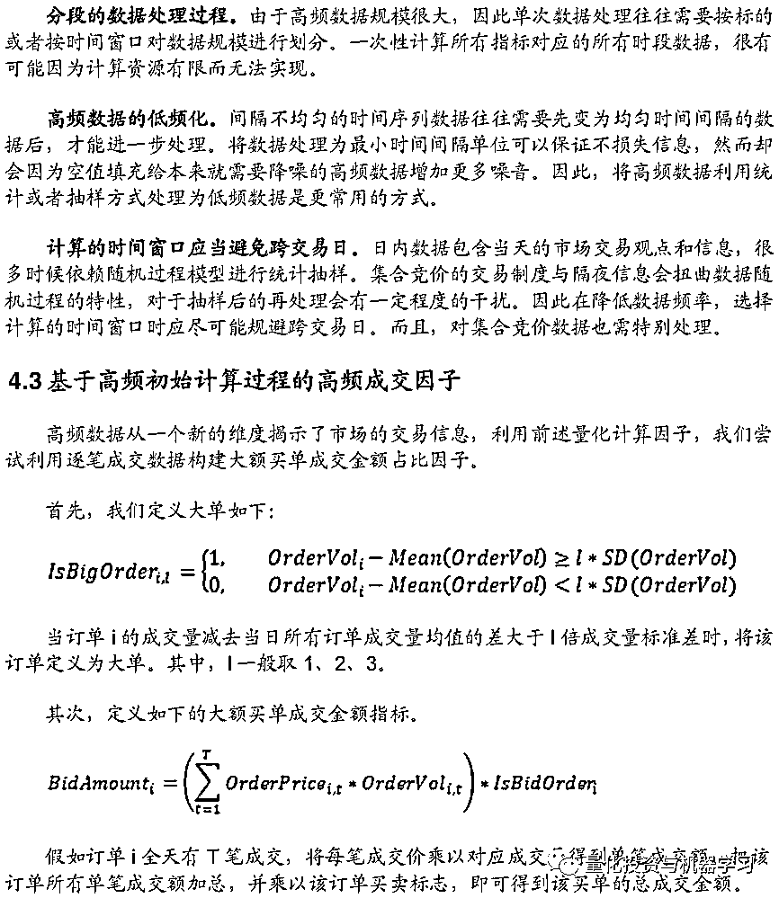
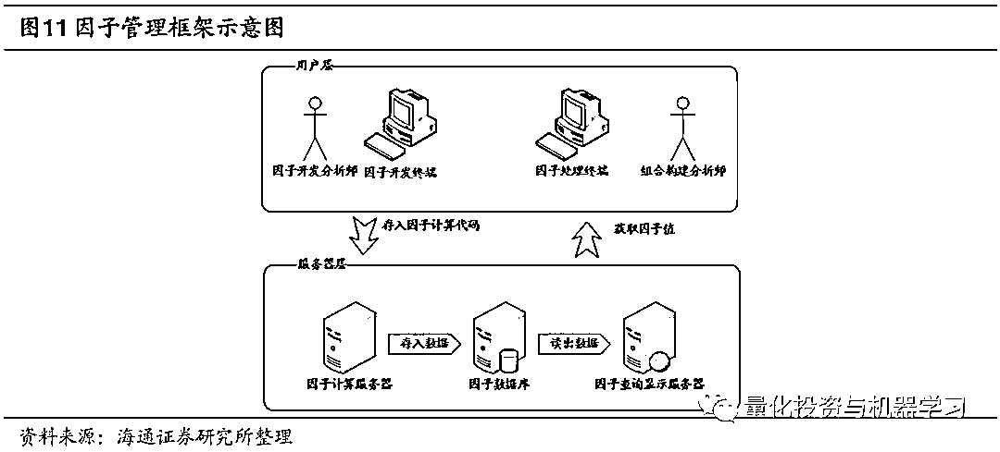

# 深度 | 高频量化因子的批量生产与集中管理

> 原文：[`mp.weixin.qq.com/s?__biz=MzAxNTc0Mjg0Mg==&mid=2653292804&idx=1&sn=ab92537673f0d0322119693d68705b4c&chksm=802dcb11b75a4207a8fd0ea69283fefed1da069479c75fbb77f5712ba61eb3c6f41b6ec15b54&scene=27#wechat_redirect`](http://mp.weixin.qq.com/s?__biz=MzAxNTc0Mjg0Mg==&mid=2653292804&idx=1&sn=ab92537673f0d0322119693d68705b4c&chksm=802dcb11b75a4207a8fd0ea69283fefed1da069479c75fbb77f5712ba61eb3c6f41b6ec15b54&scene=27#wechat_redirect)

**标星★公众号     **爱你们♥

作者：海通金工团队

**近期原创文章：**

## ♥ [5 种机器学习算法在预测股价的应用（代码+数据）](https://mp.weixin.qq.com/s?__biz=MzAxNTc0Mjg0Mg==&mid=2653290588&idx=1&sn=1d0409ad212ea8627e5d5cedf61953ac&chksm=802dc249b75a4b5fa245433320a4cc9da1a2cceb22df6fb1a28e5b94ff038319ae4e7ec6941f&token=1298662931&lang=zh_CN&scene=21#wechat_redirect)

## ♥ [Two Sigma 用新闻来预测股价走势，带你吊打 Kaggle](https://mp.weixin.qq.com/s?__biz=MzAxNTc0Mjg0Mg==&mid=2653290456&idx=1&sn=b8d2d8febc599742e43ea48e3c249323&chksm=802e3dcdb759b4db9279c689202101b6b154fb118a1c1be12b52e522e1a1d7944858dbd6637e&token=1330520237&lang=zh_CN&scene=21#wechat_redirect)

## ♥ 2 万字干货：[利用深度学习最新前沿预测股价走势](https://mp.weixin.qq.com/s?__biz=MzAxNTc0Mjg0Mg==&mid=2653290080&idx=1&sn=06c50cefe78a7b24c64c4fdb9739c7f3&chksm=802e3c75b759b563c01495d16a638a56ac7305fc324ee4917fd76c648f670b7f7276826bdaa8&token=770078636&lang=zh_CN&scene=21#wechat_redirect)

## ♥ [一位数据科学 PhD 眼中的算法交易](https://mp.weixin.qq.com/s?__biz=MzAxNTc0Mjg0Mg==&mid=2653290118&idx=1&sn=a261307470cf2f3e458ab4e7dc309179&chksm=802e3c93b759b585e079d3a797f512dfd0427ac02942339f4f1454bd368ba47be21cb52cf969&token=770078636&lang=zh_CN&scene=21#wechat_redirect)

## ♥ [基于 RNN 和 LSTM 的股市预测方法](https://mp.weixin.qq.com/s?__biz=MzAxNTc0Mjg0Mg==&mid=2653290481&idx=1&sn=f7360ea8554cc4f86fcc71315176b093&chksm=802e3de4b759b4f2235a0aeabb6e76b3e101ff09b9a2aa6fa67e6e824fc4274f68f4ae51af95&token=1865137106&lang=zh_CN&scene=21#wechat_redirect)

## ♥ [如何鉴别那些用深度学习预测股价的花哨模型？](https://mp.weixin.qq.com/s?__biz=MzAxNTc0Mjg0Mg==&mid=2653290132&idx=1&sn=cbf1e2a4526e6e9305a6110c17063f46&chksm=802e3c81b759b597d3dd94b8008e150c90087567904a29c0c4b58d7be220a9ece2008956d5db&token=1266110554&lang=zh_CN&scene=21#wechat_redirect)

## ♥ [优化强化学习 Q-learning 算法进行股市](https://mp.weixin.qq.com/s?__biz=MzAxNTc0Mjg0Mg==&mid=2653290286&idx=1&sn=882d39a18018733b93c8c8eac385b515&chksm=802e3d3bb759b42d1fc849f96bf02ae87edf2eab01b0beecd9340112c7fb06b95cb2246d2429&token=1330520237&lang=zh_CN&scene=21#wechat_redirect)

## ♥ [WorldQuant 101 Alpha、国泰君安 191 Alpha](https://mp.weixin.qq.com/s?__biz=MzAxNTc0Mjg0Mg==&mid=2653290927&idx=1&sn=ecca60811da74967f33a00329a1fe66a&chksm=802dc3bab75a4aac2bb4ccff7010063cc08ef51d0bf3d2f71621cdd6adece11f28133a242a15&token=48775331&lang=zh_CN&scene=21#wechat_redirect)

## ♥ [基于回声状态网络预测股票价格（附代码）](https://mp.weixin.qq.com/s?__biz=MzAxNTc0Mjg0Mg==&mid=2653291171&idx=1&sn=485a35e564b45046ff5a07c42bba1743&chksm=802dc0b6b75a49a07e5b91c512c8575104f777b39d0e1d71cf11881502209dc399fd6f641fb1&token=48775331&lang=zh_CN&scene=21#wechat_redirect)

## ♥ [AQR 最最最新 | 计量经济学应用投资失败的 7 个原因](https://mp.weixin.qq.com/s?__biz=MzAxNTc0Mjg0Mg==&mid=2653292186&idx=1&sn=87501434ae16f29afffec19a6884ee8d&chksm=802dc48fb75a4d99e0172bf484cdbf6aee86e36a95037847fd9f070cbe7144b4617c2d1b0644&token=48775331&lang=zh_CN&scene=21#wechat_redirect)

## ♥ [关于高盛在 Github 开源背后的真相！](https://mp.weixin.qq.com/s?__biz=MzAxNTc0Mjg0Mg==&mid=2653291594&idx=1&sn=7703403c5c537061994396e7e49e7ce5&chksm=802dc65fb75a4f49019cec951ac25d30ec7783738e9640ec108be95335597361c427258f5d5f&token=48775331&lang=zh_CN&scene=21#wechat_redirect)

## ♥ [新一代量化带货王诞生！Oh My God！](https://mp.weixin.qq.com/s?__biz=MzAxNTc0Mjg0Mg==&mid=2653291789&idx=1&sn=e31778d1b9372bc7aa6e57b82a69ec6e&chksm=802dc718b75a4e0ea4c022e70ea53f51c48d102ebf7e54993261619c36f24f3f9a5b63437e9e&token=48775331&lang=zh_CN&scene=21#wechat_redirect)

## ♥ [独家！关于定量/交易求职分享（附真实试题）](https://mp.weixin.qq.com/s?__biz=MzAxNTc0Mjg0Mg==&mid=2653291844&idx=1&sn=3fd8b57d32a0ebd43b17fa68ae954471&chksm=802dc751b75a4e4755fcbb0aa228355cebbbb6d34b292aa25b4f3fbd51013fcf7b17b91ddb71&token=48775331&lang=zh_CN&scene=21#wechat_redirect)

## ♥ [Quant 们的身份危机！](https://mp.weixin.qq.com/s?__biz=MzAxNTc0Mjg0Mg==&mid=2653291856&idx=1&sn=729b657ede2cb50c96e92193ab16102d&chksm=802dc745b75a4e53c5018cc1385214233ec4657a3479cd7193c95aaf65642f5f45fa0e465694&token=48775331&lang=zh_CN&scene=21#wechat_redirect)

## ♥ [拿起 Python，防御特朗普的 Twitter！](https://mp.weixin.qq.com/s?__biz=MzAxNTc0Mjg0Mg==&mid=2653291977&idx=1&sn=01f146e9a88bf130ca1b479573e6d158&chksm=802dc7dcb75a4ecadfdbdace877ed948f56b72bc160952fd1e4bcde27260f823c999a65a0d6d&token=48775331&lang=zh_CN&scene=21#wechat_redirect)

**前言**

**量化因子计算可以定义为一种基于初等计算函数与一阶谓词逻辑的递归过程。**量 化因子的本质是股票的某种数量化特征，一般需要通过对股票某些数量信息进行 计算得到。与计算机函数从“函数输入出发，输入函数计算，得到函数输出”相 类似，量化计算过程也可以拆解为“从量化指标出发，输入量化计算，得到新量 化指标”。由此可见，计算机函数构成的基本逻辑——递归过程也同样适用于因 子计算架构。

**定义量化指标的计算过程有计算机语言与 XML 文本两种方式。**由于 λ 算子与图 灵机、递归函数等价，因此无论是基于 λ 算子的函数式编程语言，还是基于图灵 机的过程、命令范式语言，都可以用来构建量化计算过程。在定义逻辑结构较为 复杂的因子时，过程、命令范式语言较为合适。而当需要批量生产因子时，可以 表达递归逻辑的 XML 文本也可以作为递归逻辑描述语言来使用。

**利用自动因子生成器暴力挖掘因子是生产有效因子的重要方式。**利用自动因子生 成器构建的 226 个突破型因子，其中有 20%-30%在截面上有较好的选股效果。 然而，经正交后，效果明显下降。这说明，暴力挖掘方式还是能获取一部分传统 因子构建过程中没有挖掘到的信息，但毕竟两种方式具有相同的初始算根，有大 量信息被传统因子所解释。

**利用逐笔数据构建的高频因子有着非常突出的效果。**构建买入大单成交额占比因 子，其截面表现非常优异。利用正交后的因子构建等权组合，可获得接近 20%的 多空年化收益与 9 左右的收益回撤比。高频数据的处理成本非常高，目前只能进 行 15 年 8 月以来的短周期回测，所以，因子表现的稳定性需要进一步跟踪。

**自动构建数据表是进行因子自动化管理的关键要素。**依据因子结构进行因子数据 库管理是因子计算自动化的重要步骤，而自动构建 SQL 语句，对数据表进行增 删查改是实现这种自动化管理的关键技术。

风险提示。数据挖掘是从历史先验数据获取经验模型的方法，存在模型失效可能！

**正文**

量化因子是构建多因子组合的基本要素。随着越来越多不同种类的有效因子被发现， 如何快速高效地计算因子，向前更新因子值，自动存储历史数据与新数据，方便快捷地 访问因子值，对于量化组合管理来说，正变得越来越重要。本文希望从计算机的角度， 构建一个完整的从计算到更新，再到管理的量化因子维护框架。

上图展示了因子计算的一般递归过程，其中所有实体都被定义为量化指标计算过程。 这是以一个量化指标计算过程为输入，获得新量化指标计算过程的实体。量化指标计算 过程的递归步骤如下表所示。

由上述过程可知，在构建量化指标计算过程时，如何获取初始量化指标计算过程， 定义哪些量化计算算子，用什么方式编写、记录量化计算过程的递归逻辑，是最重要的 三个问题。后文我们将从这三点出发，介绍不同类型的量化因子是如何构建的。

*—End—*

量化投资与机器学习微信公众号，是业内垂直于**Quant**、**MFE**、**CST**等专业的主流量化自媒体。公众号拥有来自**公募、私募、券商、银行、海外**等众多圈内**10W+**关注者。每日发布行业前沿研究成果和最新资讯。

