# 如何提高机器学习项目的准确性？我们有妙招！

> 原文：[`mp.weixin.qq.com/s?__biz=MzAxNTc0Mjg0Mg==&mid=2653292747&idx=1&sn=c360f24dfc3a161597c9b68f32185c20&chksm=802dcadeb75a43c863efc0a49881f6e0a870eceff1b2278ac6e4b39769626cd7b0d720192eb7&scene=27#wechat_redirect`](http://mp.weixin.qq.com/s?__biz=MzAxNTc0Mjg0Mg==&mid=2653292747&idx=1&sn=c360f24dfc3a161597c9b68f32185c20&chksm=802dcadeb75a43c863efc0a49881f6e0a870eceff1b2278ac6e4b39769626cd7b0d720192eb7&scene=27#wechat_redirect)

**标星★公众号     **爱你们♥

作者：Farhad Malik

编译：Guiyang Wang | 公众号翻译部

**近期原创文章：**

## ♥ [5 种机器学习算法在预测股价的应用（代码+数据）](https://mp.weixin.qq.com/s?__biz=MzAxNTc0Mjg0Mg==&mid=2653290588&idx=1&sn=1d0409ad212ea8627e5d5cedf61953ac&chksm=802dc249b75a4b5fa245433320a4cc9da1a2cceb22df6fb1a28e5b94ff038319ae4e7ec6941f&token=1298662931&lang=zh_CN&scene=21#wechat_redirect)

## ♥ [Two Sigma 用新闻来预测股价走势，带你吊打 Kaggle](https://mp.weixin.qq.com/s?__biz=MzAxNTc0Mjg0Mg==&mid=2653290456&idx=1&sn=b8d2d8febc599742e43ea48e3c249323&chksm=802e3dcdb759b4db9279c689202101b6b154fb118a1c1be12b52e522e1a1d7944858dbd6637e&token=1330520237&lang=zh_CN&scene=21#wechat_redirect)

## ♥ 2 万字干货：[利用深度学习最新前沿预测股价走势](https://mp.weixin.qq.com/s?__biz=MzAxNTc0Mjg0Mg==&mid=2653290080&idx=1&sn=06c50cefe78a7b24c64c4fdb9739c7f3&chksm=802e3c75b759b563c01495d16a638a56ac7305fc324ee4917fd76c648f670b7f7276826bdaa8&token=770078636&lang=zh_CN&scene=21#wechat_redirect)

## ♥ [一位数据科学 PhD 眼中的算法交易](https://mp.weixin.qq.com/s?__biz=MzAxNTc0Mjg0Mg==&mid=2653290118&idx=1&sn=a261307470cf2f3e458ab4e7dc309179&chksm=802e3c93b759b585e079d3a797f512dfd0427ac02942339f4f1454bd368ba47be21cb52cf969&token=770078636&lang=zh_CN&scene=21#wechat_redirect)

## ♥ [基于 RNN 和 LSTM 的股市预测方法](https://mp.weixin.qq.com/s?__biz=MzAxNTc0Mjg0Mg==&mid=2653290481&idx=1&sn=f7360ea8554cc4f86fcc71315176b093&chksm=802e3de4b759b4f2235a0aeabb6e76b3e101ff09b9a2aa6fa67e6e824fc4274f68f4ae51af95&token=1865137106&lang=zh_CN&scene=21#wechat_redirect)

## ♥ [如何鉴别那些用深度学习预测股价的花哨模型？](https://mp.weixin.qq.com/s?__biz=MzAxNTc0Mjg0Mg==&mid=2653290132&idx=1&sn=cbf1e2a4526e6e9305a6110c17063f46&chksm=802e3c81b759b597d3dd94b8008e150c90087567904a29c0c4b58d7be220a9ece2008956d5db&token=1266110554&lang=zh_CN&scene=21#wechat_redirect)

## ♥ [优化强化学习 Q-learning 算法进行股市](https://mp.weixin.qq.com/s?__biz=MzAxNTc0Mjg0Mg==&mid=2653290286&idx=1&sn=882d39a18018733b93c8c8eac385b515&chksm=802e3d3bb759b42d1fc849f96bf02ae87edf2eab01b0beecd9340112c7fb06b95cb2246d2429&token=1330520237&lang=zh_CN&scene=21#wechat_redirect)

## ♥ [WorldQuant 101 Alpha、国泰君安 191 Alpha](https://mp.weixin.qq.com/s?__biz=MzAxNTc0Mjg0Mg==&mid=2653290927&idx=1&sn=ecca60811da74967f33a00329a1fe66a&chksm=802dc3bab75a4aac2bb4ccff7010063cc08ef51d0bf3d2f71621cdd6adece11f28133a242a15&token=48775331&lang=zh_CN&scene=21#wechat_redirect)

## ♥ [基于回声状态网络预测股票价格（附代码）](https://mp.weixin.qq.com/s?__biz=MzAxNTc0Mjg0Mg==&mid=2653291171&idx=1&sn=485a35e564b45046ff5a07c42bba1743&chksm=802dc0b6b75a49a07e5b91c512c8575104f777b39d0e1d71cf11881502209dc399fd6f641fb1&token=48775331&lang=zh_CN&scene=21#wechat_redirect)

## ♥ [AQR 最最最新 | 计量经济学应用投资失败的 7 个原因](https://mp.weixin.qq.com/s?__biz=MzAxNTc0Mjg0Mg==&mid=2653292186&idx=1&sn=87501434ae16f29afffec19a6884ee8d&chksm=802dc48fb75a4d99e0172bf484cdbf6aee86e36a95037847fd9f070cbe7144b4617c2d1b0644&token=48775331&lang=zh_CN&scene=21#wechat_redirect)

## ♥ [关于高盛在 Github 开源背后的真相！](https://mp.weixin.qq.com/s?__biz=MzAxNTc0Mjg0Mg==&mid=2653291594&idx=1&sn=7703403c5c537061994396e7e49e7ce5&chksm=802dc65fb75a4f49019cec951ac25d30ec7783738e9640ec108be95335597361c427258f5d5f&token=48775331&lang=zh_CN&scene=21#wechat_redirect)

## ♥ [新一代量化带货王诞生！Oh My God！](https://mp.weixin.qq.com/s?__biz=MzAxNTc0Mjg0Mg==&mid=2653291789&idx=1&sn=e31778d1b9372bc7aa6e57b82a69ec6e&chksm=802dc718b75a4e0ea4c022e70ea53f51c48d102ebf7e54993261619c36f24f3f9a5b63437e9e&token=48775331&lang=zh_CN&scene=21#wechat_redirect)

## ♥ [独家！关于定量/交易求职分享（附真实试题）](https://mp.weixin.qq.com/s?__biz=MzAxNTc0Mjg0Mg==&mid=2653291844&idx=1&sn=3fd8b57d32a0ebd43b17fa68ae954471&chksm=802dc751b75a4e4755fcbb0aa228355cebbbb6d34b292aa25b4f3fbd51013fcf7b17b91ddb71&token=48775331&lang=zh_CN&scene=21#wechat_redirect)

## ♥ [Quant 们的身份危机！](https://mp.weixin.qq.com/s?__biz=MzAxNTc0Mjg0Mg==&mid=2653291856&idx=1&sn=729b657ede2cb50c96e92193ab16102d&chksm=802dc745b75a4e53c5018cc1385214233ec4657a3479cd7193c95aaf65642f5f45fa0e465694&token=48775331&lang=zh_CN&scene=21#wechat_redirect)

## ♥ [拿起 Python，防御特朗普的 Twitter！](https://mp.weixin.qq.com/s?__biz=MzAxNTc0Mjg0Mg==&mid=2653291977&idx=1&sn=01f146e9a88bf130ca1b479573e6d158&chksm=802dc7dcb75a4ecadfdbdace877ed948f56b72bc160952fd1e4bcde27260f823c999a65a0d6d&token=48775331&lang=zh_CN&scene=21#wechat_redirect)

# 在机器学习项目中工作是一个枯燥乏味的任务，尤其是当你收集到所有可用的数据，但是模型产出的结果糟糕。你可以跟着本篇推文中提供给你的方法来提高你在机器学习项目中的准确性。 

 ****总是先以数据为目标**** 

**这个章节旨在提供数据处理的技巧，你可以跟着它来产生一些高质量的训练集合。**

**创建一个高质量的数据集合是最重要的预测分析阶段。有时，它也是最消耗时间的部分。**

****普遍的数据质量问题****

**通常，在为机器学习模型准备数据时会遇到以下用例：**

**1、数据集中可能存在丢失或错误的值。**

**2、数据集中可能存在分类（文本，布尔）值，并非所有算法都适用于文本值。**

**3、某些特征可能具有比其他特征更大的值，并且需要进行转换以获得同等重要性。**

**4、有时，数据包含大量维度，并且需要减少维度数量。**

****提高数据质量的技巧****

### ****用例 1：填充缺失值****

**假设我们想要预测变量，例如公司销售，它取决于以下两个变量：公司的股价和员工总数。**

**股价和员工总数均包含数值。**

**我们还假设一系列日期的股价和员工总数存储在不同的 csv 文件中。**

****场景：**一旦我们使用 Python DataFrame Merge()方法连接两个数据集，我们可能会看到空值或占位符字符串（如 NaN）表示该数字为空。**

****问题：**当我们用缺失值提供它们时，大多数模型都无法拟合和预测值。**

****解决方案：**Pandas 的 data frame 提供了许多替换缺失值的特征。**

**第 1 步：将数据放入 pandas 的 data frame 中**

**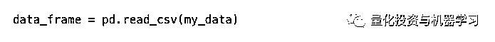**

**第 2 步：一个选择是删除空值的列/行，然而，我不建议这种方法：**

**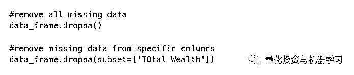**

**收集干净的数据是一项耗时的任务，删除列（特征）或行最终可能会丢失数据集中的重要信息。**更好的选择：**通过设置默认值来替换缺失值来替换 NaN，在后面或前面填充数据集，插入或推断这个值等方法。** 

**我们还可以使用模型并使用训练数据集对其进行训练，以便它可以返回适当的值来填充缺失值。其中一个合适的策略是使用 sci kit learn Imputer 来插入值。**

**举个例子，我们可以这样做：**

**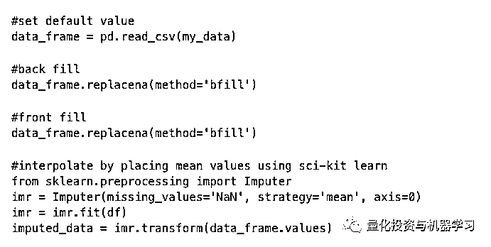**

**一旦我们替换了缺失值，我们现在需要查看数据集中是否有任何分类值。**

### ****用例 2：处理分类值****

**假设我们想要预测变量，例如推文数量，它取决于以下两个变量：最活跃的当前新闻类型和活跃用户数。**

**在这种例子当中，最活跃当前新闻类型是一个分类特征。它可以包含文本数据，如“时尚”，“经济”等。此外，活跃用户数包含数字字段。**

****场景：**在我们将数据集提供给机器学习模型之前，我们需要将分类值转换为数值，因为许多模型不适用于文本值。**

****解决方案：**有许多策略可以处理分类特征：**

**1、创建字典以将分类值映射到数值**

**字典是数据存储结构。它包含 key-value 配对的元素的列表。它使 key 值可以映射到 value 值。**

**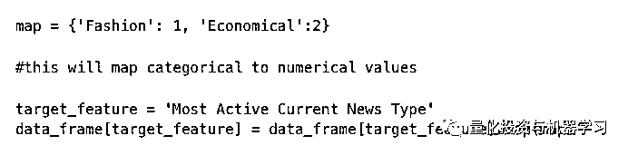**

**这种策略也适用于序数值。序数值是可以排序的那些文本值，例如衣服尺寸（小，中，大等）。** 

**2、另一种策略是使用编码器为每个文本值分配唯一的数值。此策略更适用于具有大量不同值（> 30）的变量，例如用于管理组织作业层次结构。**

**我们可以使用手动或 sci-kit 编码器。**

****2.1 手动编码器****

**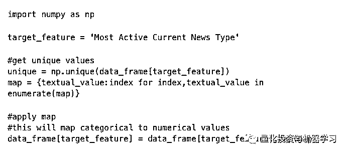**

****2.2 Sci Kit 学习编码器****

**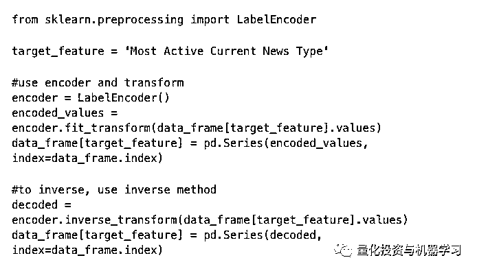**

****还有一个步骤经常被遗漏****

**我经常看到这种情况：在将文本值编码为数值后，我们将看到一些值将大于其他值。较高的值意味着它们具有更高的重要性。这可能导致我们的模型不同地处理特征。例如，时尚新闻类型的值可能为 1，经济新闻类型的值可能为 10.这使得机器学习模型假设经济新闻类型比时尚新闻类型更重要。**

****解决方案：**我们可以通过使用 One-Hot 编码来解决这个问题**

****One Hot 编码****

**为了防止某些分类值比其他值更重要，我们可以在将编码数据提供给我们的机器学习模型之前使用 one hot 编码技术。**

**One hot 编码技术实质上为我们的目标分类特征中的每个不同值创建了副本（虚拟）特征。一旦创建虚拟值后，将填充布尔值（0 或 1）以指示该特征的值是 true 还是 false。因此，我们最终得到一个宽的稀疏矩阵，其中填充了 0/1 值。**

**例如，如果你的特征有“A”，“B”和“C”值，则将创建三个新特征（列）：特征 A，特征 B 和特征 C。如果第一行的特征值为 A，那么对于 A，你会看到 1，对于特征 B 和 C，它将会是 0。**

****解决方案：****

**我们可以使用 Pandas get_dummies（）方法，它只将分类值转换为整数。**

**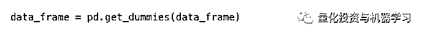**

**此外，我们可以使用 sklearn.preprocessing.OneHotEncoder** 

**提示：OneHot 编码总是在编码文本值之后以避免排序**

### ****用例 3：扩展特征****

**现在填充所有缺失值，并将分类值转换为数值。通常，当我们的数据集中有多个特征时，我们需要确保正确缩放数据集的值。**

****在特征中的值的范围应该反应他们的重要性。****

****更高价值的值反应更高的重要性。****

****场景：**假设我们想要衡量股市收盘价。我们希望使用一个简单的最佳拟合线回归模型，该模型使用 GBP 到 EUR 的汇率和公司员工的数量来预测股票的价格。**

**因此，我们收集的数据集包含 GBP 到 EUR 的汇率以及公司员工的数量。**

**汇率将从 0 到 1 不等，而员工人数将会大得多，可能会达到 1000s。**

**随后，该模型将考虑员工人数优先于汇率。**

**有两种方法可以扩展特征：**

****正则化：**确保所有值的范围在 0 到 1 之间。可以通过以下实现来完成：**

**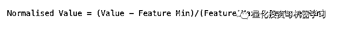**

**sklearn.preprocessing.MinMaxScaler 可以被用来实现正则化** 

****标准化：**确保特征中的值遵循正态分布，其中值的均值为 0，标准差为 1。**

**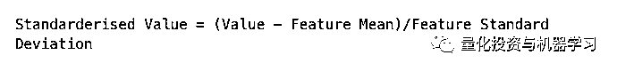**

**sklearn.preprocessing.StandardScaler 可以被用来实现标准化**

**在大多数情况下，标准化技术优于正则化技术，因为它保持异常值并将数据转换为正态分布。正态分布允许模型容易地预测值，并且还可以容易地确定权重，这再次有助于预测模型。**

****关键：**只在训练集中训练 Scalers，不能用于所有的训练集**

**当我们训练我们的模型时，即使我们正在训练 imputers 或标量，也总是使用训练集来训练测试模型。让测试或验证集仅用于测试。**

### ****用例 4：删除现有特征****

**假设你在训练集上训练你的机器学习模型，并且你正在使用一个测量方法，例如 Adjusted R Squared 来评估你的机器学习模型的质量。你的模型的 AdjustedR Squared 是 90％+意味着你的模型可以准确预测 90％的值。**

****场景：**当你将测试数据输入模型时， 你会得到一个非常低的 Adjusted R Squared，这意味着模型不准确并且过度拟合训练数据。**

**这是一个典型的过度拟合的例子。**

**有些特征并不像我们首次从训练集中得出的结论那么重要。它最终可能会过度拟合我们的机器学习模型。**

****解决方案：****

**有几种方法可以防止过度拟合，例如添加更多数据和/或消除特征。我在文章中概述了一些解决方案：**

**1、我们可以删除彼此之间具有强相关性的特征。你可以使用相关矩阵来确定所有自变量之间的相关性。**

**2、我们还可以使用散布混合图来确定所有变量如何相互链接。**

**2、我们可以使用 RandomForestClassifer，它可以让我们了解每个特征的重要性：**

**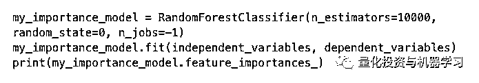**

**最不重要的特征可以被排除。**

### ****用例 5: 从已存在的特征中创建新的特征****

**偶尔地，我们希望从一个或多个特征中创建新的特征。有时，我们也可以从因变量中创建一个新特征，它是我们想要预测的变量。**

**例如，在时间序列预测分析中，我们可以从数据中提取趋势和季节性，然后将趋势和季节性作为单独的特征提供，以预测我们的目标变量。**

### ****用例 6: 减少维度****

****场景：**偶尔我们希望减少维度的数量。一个例子是我们想要通过使用文字到向量编码算法来爬取网站并将文本数据转换为向量。我们最终得到一个稀疏矩阵。**

****问题：**稀疏矩阵会降低算法速度。**

****解决方案：**分解矩阵，但确保不丢失有价值的信息。**

**我们可以使用主要成分分析（PCA），线性判别分析（LDA）或核主要成分分析来减少维度。**

****微调模型参数****

**微调机器学习预测模型是提高预测结果准确性的关键步骤。在最近几年，我写了很多文章来解释机器学习是如何工作的，以及如何丰富和分解特征集以提高机器学习模型的准确性。**

**本节发现以下细节：**

**1、使用评分指标检索模型性能的估计值**

**2、查找和诊断机器学习算法中的常见问题**

**3、微调机器学习模型的参数**

### ****第 1 步：理解调整机器学习模型是什么****

**有时，我们必须探索模型参数如何提高机器学习模型的预测准确性。**

**微调机器学习模型是一门黑色艺术。它可以证明是一项详尽的任务。我将介绍本文中的一些方法，我们可以遵循这些方法以在更短的时间内获得准确的结果。**

**我常常被问到一个问题，即当特征稳定并且特征集被分解时，可以用来调整预测模型的技术。**一旦尝试了所有的方法，我们应该关注调整我们的机器学习模型。****

**调整机器学习模型就像旋转电视开关和旋钮，直到你获得更清晰的信号**

**该图说明了参数如何相互依赖。**

**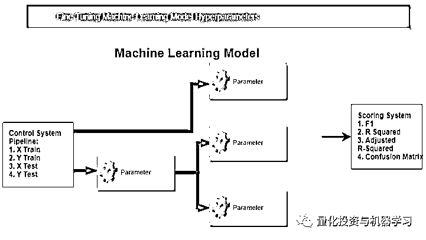**

*   **X 训练 - 训练自变量数据，也称为特征**

*   **X 测试 - 自变量的测试数据**

*   **Y 训练 - 因变量训练数据**

*   **Y 测试 - 因变量的测试数据**

**例如，如果你基于温度和湿度预测瀑布的体积，则水的体积表示为 Y（因变量），温度和湿度表示为 X（独立变量或特征）。 X 的训练数据被称为 X 训练，你可以使用它来训练你的模型。**

****超参数是模型的参数，可以作为模型的参数输入。****

### ****第 2 步：涵盖基础知识****

**在对预测模型进行微调之前，简要了解机器学习是什么是非常重要的。**

**相比较于微调模型的参数，通常更容易改进我们提供给模型的数据。如果你想提高预测模型的准确性，请首先丰富特征集中的数据。**

**如果你提供质量较差的数据，则模型将产生较差的结果。**

### ****第 3 步：找到你的分数指标****

**最重要的先决条件是决定你将用于评估预测模型准确性的指标。**

**它可以是 Rsquared，Adjusted R squared，ConfusionMatrix，F1，Recall，方差等。**

### ****第 4 步：获得准确的预测分数****

**一旦你准备好了训练集，丰富了其特征，缩放了数据，分解特征集，确定评分指标并在训练数据上训练模型后，你应该测试模型在看不见的数据上的准确性。看不见的数据称为“测试数据”。**

**你可以使用交叉验证来评估模型在看不见的数据上如何运作的。这称为模型的泛化错误。**

****交叉验证****

**有两种常见的交叉验证方法** 

****Holdout 交叉验证****

**这不是一种明智的机器学习实践，它训练在同一数据集上训练你的模型并对其准确性进行评分。在一个看不见的测试集上使用不同的模型参数值来测试模型是一种非常优越的技术。**

**将数据集分为三个部分是一种很好的做法：**

**1、训练集**

**2、验证集**

**3、测试集**

**在训练集上训练模型（60％的数据），然后在验证集上执行模型选择（调整参数）（20％的数据），一旦准备就绪，在测试集上测试模型（20％）数据）。**

**根据机器学习模型的需求和数据的可用性创建训练，验证和测试数据集比例。**

****K Fold 交叉验证****

**K Fold 交叉验证是一种优于 Holdout 交叉验证的机制。它的工作方式是将数据分成 k 个 folds（部分）。 k-1 fold 用于训练模型，最后 1 个 fold 用于测试模型。**

**然后重复该机制 k 次。此外，每次可以使用多个性能指标来评估和评分性能，然后报告性能指标的平均值。这些分类的比例保存在 StratifiedKFold 中。**

**n_jobs 参数控制用于运行交叉验证的 CPU 数。**

### ****第 5 步：使用验证曲线诊断最佳参数值****

**一旦准确的预测分数被建立，找出你的模型所需的所有参数。然后，你可以使用验证曲线来探索其值如何提高预测模型的准确性。**

**在我们调整参数之前，我们需要诊断并确定模型是否低度拟合或者过度拟合。**

**具有大量参数的模型往往过度拟合。我们可以使用验证曲线来解决机器学习中过度拟合和低度拟合的问题。**

****这些参数也称为超参数****

**验证曲线用于传递模型参数的一系列值。它一次更改一个模型参数的值，然后可以根据模型参数值绘制精度值，以评估模型的准确性。**

**例如，如果模型采用名为“树的数量”的参数，则可以通过传入 10 个不同的参数值来测试模型。你可以使用验证曲线报告每个参数值的准确性，以评估准确性。最后取得最高准确度的分数，并在可接受的时间内为你提供所需的结果。**

**Sci-kitlearn 提供验证曲线模块：**

**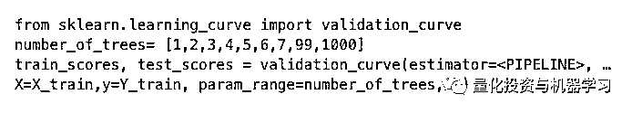**

### ****第 6 步：使用网格搜索进行优化超参数组合****

**一旦我们检索到单个模型参数的最佳值，我们就可以使用网格搜索来获得模型的超参数值的组合，从而为我们提供最高的精度**

**网格搜索评估参数值的所有可能组合。**

**网格搜索是详尽的，并使用强力来评估最准确的值。因此，它是计算密集型任务。**

**使用 sci-kit 的 GridSearchCV 学习执行网格搜索**

**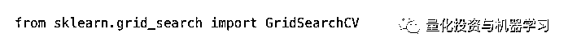**

### ****第 7 步：连续调整参数以进一步提高准确性****

**这里的关键是，一旦有更多数据，就要始终增强训练集。**

**始终在模型以前没有见过的更丰富的测试数据上测试你的预测模型。**

**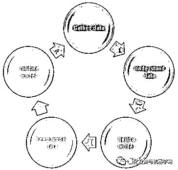**

**始终确保为 job 选择正确的模型和参数值。**

****重要的是一旦可用就提供更多数据并连续测试模型的准确性，以便进一步优化性能和准确性。****

****总结****

**本文提供了一个概述，关于进一步提高机器学习模型准确性的两个关键步骤。希望能帮助到你。**

***—End—***

**量化投资与机器学习微信公众号，是业内垂直于**Quant**、**MFE**、**CST**等专业的主流量化自媒体。公众号拥有来自**公募、私募、券商、银行、海外**等众多圈内**10W+**关注者。每日发布行业前沿研究成果和最新资讯。**

****