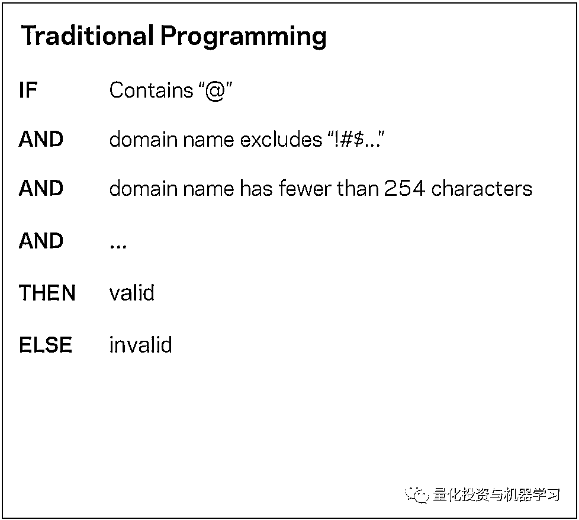
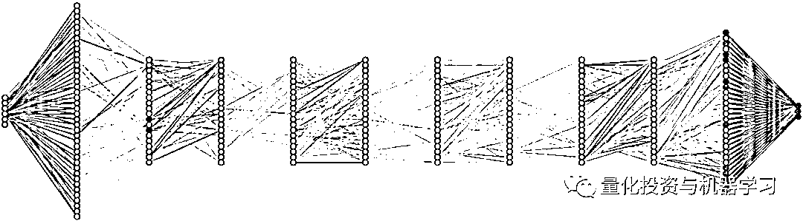

# AQR 最新研究 | 机器能“学习”金融吗？

> 原文：[`mp.weixin.qq.com/s?__biz=MzAxNTc0Mjg0Mg==&mid=2653292710&idx=1&sn=e5e852de00159a96d5dcc92f349f5b58&chksm=802dcab3b75a43a5492bc98874684081eb5c5666aff32a36a0cdc144d74de0200cc0d997894f&scene=27#wechat_redirect`](http://mp.weixin.qq.com/s?__biz=MzAxNTc0Mjg0Mg==&mid=2653292710&idx=1&sn=e5e852de00159a96d5dcc92f349f5b58&chksm=802dcab3b75a43a5492bc98874684081eb5c5666aff32a36a0cdc144d74de0200cc0d997894f&scene=27#wechat_redirect)

**标星★公众号     **爱你们♥

**近期原创文章：**

## ♥ [5 种机器学习算法在预测股价的应用（代码+数据）](https://mp.weixin.qq.com/s?__biz=MzAxNTc0Mjg0Mg==&mid=2653290588&idx=1&sn=1d0409ad212ea8627e5d5cedf61953ac&chksm=802dc249b75a4b5fa245433320a4cc9da1a2cceb22df6fb1a28e5b94ff038319ae4e7ec6941f&token=1298662931&lang=zh_CN&scene=21#wechat_redirect)

## ♥ [Two Sigma 用新闻来预测股价走势，带你吊打 Kaggle](https://mp.weixin.qq.com/s?__biz=MzAxNTc0Mjg0Mg==&mid=2653290456&idx=1&sn=b8d2d8febc599742e43ea48e3c249323&chksm=802e3dcdb759b4db9279c689202101b6b154fb118a1c1be12b52e522e1a1d7944858dbd6637e&token=1330520237&lang=zh_CN&scene=21#wechat_redirect)

## ♥ 2 万字干货：[利用深度学习最新前沿预测股价走势](https://mp.weixin.qq.com/s?__biz=MzAxNTc0Mjg0Mg==&mid=2653290080&idx=1&sn=06c50cefe78a7b24c64c4fdb9739c7f3&chksm=802e3c75b759b563c01495d16a638a56ac7305fc324ee4917fd76c648f670b7f7276826bdaa8&token=770078636&lang=zh_CN&scene=21#wechat_redirect)

## ♥ [一位数据科学 PhD 眼中的算法交易](https://mp.weixin.qq.com/s?__biz=MzAxNTc0Mjg0Mg==&mid=2653290118&idx=1&sn=a261307470cf2f3e458ab4e7dc309179&chksm=802e3c93b759b585e079d3a797f512dfd0427ac02942339f4f1454bd368ba47be21cb52cf969&token=770078636&lang=zh_CN&scene=21#wechat_redirect)

## ♥ [基于 RNN 和 LSTM 的股市预测方法](https://mp.weixin.qq.com/s?__biz=MzAxNTc0Mjg0Mg==&mid=2653290481&idx=1&sn=f7360ea8554cc4f86fcc71315176b093&chksm=802e3de4b759b4f2235a0aeabb6e76b3e101ff09b9a2aa6fa67e6e824fc4274f68f4ae51af95&token=1865137106&lang=zh_CN&scene=21#wechat_redirect)

## ♥ [如何鉴别那些用深度学习预测股价的花哨模型？](https://mp.weixin.qq.com/s?__biz=MzAxNTc0Mjg0Mg==&mid=2653290132&idx=1&sn=cbf1e2a4526e6e9305a6110c17063f46&chksm=802e3c81b759b597d3dd94b8008e150c90087567904a29c0c4b58d7be220a9ece2008956d5db&token=1266110554&lang=zh_CN&scene=21#wechat_redirect)

## ♥ [优化强化学习 Q-learning 算法进行股市](https://mp.weixin.qq.com/s?__biz=MzAxNTc0Mjg0Mg==&mid=2653290286&idx=1&sn=882d39a18018733b93c8c8eac385b515&chksm=802e3d3bb759b42d1fc849f96bf02ae87edf2eab01b0beecd9340112c7fb06b95cb2246d2429&token=1330520237&lang=zh_CN&scene=21#wechat_redirect)

## ♥ [WorldQuant 101 Alpha、国泰君安 191 Alpha](https://mp.weixin.qq.com/s?__biz=MzAxNTc0Mjg0Mg==&mid=2653290927&idx=1&sn=ecca60811da74967f33a00329a1fe66a&chksm=802dc3bab75a4aac2bb4ccff7010063cc08ef51d0bf3d2f71621cdd6adece11f28133a242a15&token=48775331&lang=zh_CN&scene=21#wechat_redirect)

## ♥ [基于回声状态网络预测股票价格（附代码）](https://mp.weixin.qq.com/s?__biz=MzAxNTc0Mjg0Mg==&mid=2653291171&idx=1&sn=485a35e564b45046ff5a07c42bba1743&chksm=802dc0b6b75a49a07e5b91c512c8575104f777b39d0e1d71cf11881502209dc399fd6f641fb1&token=48775331&lang=zh_CN&scene=21#wechat_redirect)

## ♥ [AQR 最最最新 | 计量经济学应用投资失败的 7 个原因](https://mp.weixin.qq.com/s?__biz=MzAxNTc0Mjg0Mg==&mid=2653292186&idx=1&sn=87501434ae16f29afffec19a6884ee8d&chksm=802dc48fb75a4d99e0172bf484cdbf6aee86e36a95037847fd9f070cbe7144b4617c2d1b0644&token=48775331&lang=zh_CN&scene=21#wechat_redirect)

## ♥ [关于高盛在 Github 开源背后的真相！](https://mp.weixin.qq.com/s?__biz=MzAxNTc0Mjg0Mg==&mid=2653291594&idx=1&sn=7703403c5c537061994396e7e49e7ce5&chksm=802dc65fb75a4f49019cec951ac25d30ec7783738e9640ec108be95335597361c427258f5d5f&token=48775331&lang=zh_CN&scene=21#wechat_redirect)

## ♥ [新一代量化带货王诞生！Oh My God！](https://mp.weixin.qq.com/s?__biz=MzAxNTc0Mjg0Mg==&mid=2653291789&idx=1&sn=e31778d1b9372bc7aa6e57b82a69ec6e&chksm=802dc718b75a4e0ea4c022e70ea53f51c48d102ebf7e54993261619c36f24f3f9a5b63437e9e&token=48775331&lang=zh_CN&scene=21#wechat_redirect)

## ♥ [独家！关于定量/交易求职分享（附真实试题）](https://mp.weixin.qq.com/s?__biz=MzAxNTc0Mjg0Mg==&mid=2653291844&idx=1&sn=3fd8b57d32a0ebd43b17fa68ae954471&chksm=802dc751b75a4e4755fcbb0aa228355cebbbb6d34b292aa25b4f3fbd51013fcf7b17b91ddb71&token=48775331&lang=zh_CN&scene=21#wechat_redirect)

## ♥ [Quant 们的身份危机！](https://mp.weixin.qq.com/s?__biz=MzAxNTc0Mjg0Mg==&mid=2653291856&idx=1&sn=729b657ede2cb50c96e92193ab16102d&chksm=802dc745b75a4e53c5018cc1385214233ec4657a3479cd7193c95aaf65642f5f45fa0e465694&token=48775331&lang=zh_CN&scene=21#wechat_redirect)

## ♥ [拿起 Python，防御特朗普的 Twitter！](https://mp.weixin.qq.com/s?__biz=MzAxNTc0Mjg0Mg==&mid=2653291977&idx=1&sn=01f146e9a88bf130ca1b479573e6d158&chksm=802dc7dcb75a4ecadfdbdace877ed948f56b72bc160952fd1e4bcde27260f823c999a65a0d6d&token=48775331&lang=zh_CN&scene=21#wechat_redirect)

本文是公众号编辑部针对报告做的独家解读，原报告请点击阅读原文。

**摘要**

**机器学习对资产管理有用吗？**如果有用，将有何用？**资本市场与机器学习在取得成功的环境方面有着根本的不同**，而对机器学习用于资产管理的研究才刚刚开始。早期的证据表明，机器学习可能会改善投资组合。机器学习的应用是投资研究的一种自然演变，并将继续得到探索。

**从机器编程到机器学习**

报告从一个简单的例子开始，来说明机器学习是如何改变解决问题的方式的。

**报告比较了传统编程与机器学习的区别。**

它举了一个例子：

**确定一个 Email 是否有效**

意思就是你可以用此 Email 进行正常的收发邮件。那么，我们要确保我们的 Email 有效，它必须满足一组基本的标准。例如，它应该包含一个“@”符号。 @后面应该是一个少于 254 个字符的 web（如 aqr.com 或 yale.edu），只由字母、数字、连字符组成等等。

传统编程解决方案是编写一系列 if/then 语句如下图：

如果满足所有必要条件，程序返回有效；如果违反了至少一个条件，则返回无效。

图：AQR

那么使用机器学习会是怎样呢？

计算机能够提出自己的规则来对地址进行排序吗？为了做到这一点，我们需要计算机使用统计数据来从数据中推断出规则。例如，我们向机器提供数以百万计的有效和无效的 Email，在这些数据集中，机器可能会发现“@”符号是一个重要的区别特征，从而得出自己的规则。这是一个非结构化机器学习的例子，研究人员只提供数据。有了足够的数据，机器最终可以找到有用的规则。另一种方法是提供一些规则，然后让机器对这些规则进行改进。例如，可以预先指定重要的变量，例如“@”符号、有效的 web 域等等。第二种方法更加结构化，以帮助引导机器更快、更有效地学习。

图：AQR

总结一下，传统的编程方式是人类自己积累经验，并将这些经验转换为规则或数学公式，然后就是用编程语言去表示这些规则和公式。而机器学习可以被看作一种全新的编程方式。在进行机器学习时，人类不需要总结具体的规则或公式，只需制订学习的步骤，然后将大量的数据输入给计算机。后者可以根据数据和人类提供的学习步骤自己总结经验，自动升级。计算机“学习”完成之后会得到一个模型程序，而这个由程序生成的程序可以达到甚至超过人类自身的水平。

**传统编程的公式：规则+数据=答案**

**机器学习的公式：答案+数据=规则**

**核心都是规则，最终目标是答案。**

世界都在数字化，能用传统编程方式模拟的规则都是一些简单的规则，而机器学习提供了一种探究复杂规则得途径。可以解决传统编程无法解决的一些问题。所以机器学习只是特定领域的一种解决方案。而现实中的解决方案大部分还是由传统编程解决的。

世界上的任何东西都是有规则的，都可以用数学表示。

机器学习通过穷举的方式使规则接近完美（监督学习），大数据的出现更加增强了这个效果。

更多关于机器学习与传统编程的案例，大家阅读原报告和上网进行搜寻。

**数据、算力和统计**

机器学习中的“学习”仅仅意味着统计和模型选择。新技术的创新之处在于，通过生成大量的数据和强大的算力，使大规模统计模型变得切实可行。  

对于**机器学习与统计学的区别**，有很多论述：

1、论文 STATISTICAL MODELING: THE TWO CULTURES，这是 Leo Breiman 大神 2001 年发表在 Statistical Science 上的一篇老文，他将统计科学分为两个分支：Data Modeling 和 Algorithm Modeling。Data Model 直接假设数据服从一定的分布和随机噪声，数据均是由这些分布产生。而 Algorithm Modeling 认为框架内部非常复杂，他们只是寻找一个函数 f(x)，用 x 做输入来预测 y。文章认为**统计学过分依赖了 Data Modeling，而机器学习主要依赖****模型预测精度（predictive accuracy of models），从而取得了更多进步。**

2、Brendan O’Connor 的博文 Statistics vs. Machine Learning, fight!，初稿是 08 年写的，或许和作者的机器学习背景有关，他在初稿中主要是贬低了统计学，思想和 1 有点类似，认为**机器学习比统计学多了些 Algorithm Modeling 方面内容**，比如 SVM 的 Max-margin，决策树等，此外他认为机器学习更偏实际。但 09 年十月的时候他转而放弃自己原来的观点，认为统计才是 real deal: Statistics, not machine learning, is the real deal, but unfortunately suffers from bad marketing.

他的博文中还引用了大神 Robert Tibshiriani 的一张对比表：

3、与人们的普遍认识相反，机器学习实际上已经有数十年的历史了。受模型计算需求和早期算力限制的影响，这一领域之前并未兴起。然而，得力于近年来信息爆炸所带来的海量数据优势，机器学习正方兴未艾。

我们常常听到与这一问题有关的一些模糊陈述：

“机器学习与统计学之间的区别在于其目的不同。机器学习旨在进行精确预测。而统计学模型则用于推断变量之间的关系。”

从技术角度看，这一陈述是正确的，然而却并非令人满意且明确的答案。可以肯定的是，目的确实是机器学习与统计学之间的主要区别，但关于机器学习的精确预测与统计学的关系推断这一论断则没有什么意义，除非你精通这些概念。

《Nature Methods》杂志上发表了一篇论文，概述了统计学和机器学习的不同。这个想法看起来可笑，但是却证明了在这一层次探讨的必要性。

*Points of Significance: Statistics versus machine learning*

*Statistics draws population inferences from a sample, and machine learning finds generalizable predictive patterns. Two…*

*www.nature.com*

**机器学习建立在统计学基础上。**这是因为机器学习涉及数据，而数据则必须使用统计学框架进行描述。然而，被扩展为大量粒子热力学的统计力学同样也建立在统计学框架之上。压强的概念实际上也是一个统计量，温度也是如此。如果你觉得很可笑，没关系，但事实如此。这就是为什么你不能描述一个分子的温度或压力。温度实际上是分子间碰撞产生平均能量的表现。对于足够多的分子，比如房子或户外环境来说，描述其温度才具有实际意义。

你会承认热力学和统计学是一样的吗？不会的，实际上热力学是用统计学来帮助我们理解功和热相互作用产生的输运现象。

事实上，除统计学外，热力学的建立还以很多其他学科为基础。同理，机器学习（ML）的建立也要以数学和计算机科学等领域为基础，比如：

*   **ML 理论源于数学和统计学**

*   **ML 算法源于优化、接矩阵代数、微积分**

*   **ML 的实现要依靠计算机科学和工程概念（如内核技巧、特性哈希）**

**当我们用 Python 编程，引入 sklearn 库并开始使用算法时，很多概念都被抽象了，所以很难看到它们的区别。因此，这种抽象导致了对机器学习内涵的不了解。**

公众号编辑部也认为：

**机器学习 != 统计学**

AQR 报告举例了：**决策树和神经网络**

因为树模型通常是我们形成投资组合的方式：

在上图中：假设观察结果是股票收益，两个“排序”变量是公司的市场权益（ME）和账面市值比（B/M）。首先根据公司规模对股票进行排序，形成几个在规模上最相似的组。然后在每个组中，股票进一步按 B/M 排序。树的最终“叶”只是由在这些特征上彼此最相似的一组股票组成，这些股票可以形成一个股票组合。树模型对“large value”股票的回报预测就是 large value 投资组合的平均回报。学术金融几十年来一直使用投资组合排序（Fama 和 French, 1992），而这本质上就是决策树的作用。

下图左边显示了两个简单的神经网络。第一个例子展示了一个单一“输入层”和“输出层”的神经网络。从左到右影响一个方向的流动，这使得这是一个简单的“前馈”网络。输入是简单的预测因子/回归因子/独立变量 x，输出是因变量或结果 y。目标是了解输入如何影响输出并使用它来进行预测。

图：AQR

右图增加了“隐藏层”。在统计学的术语中，它是变量 x 的一个变换，在这种情况下，它取 x 的正值，然后将负值归零。正是这些隐藏层使得神经网络如此强大。

隐藏层增加了模型的复杂性，但基本思想是相同的。 模型首先将它们处理为 z1 和 z2，然后测量 y 与 z 的关系，而不是对 x1，x2 和 x3 进行回归。**在资产管理研究中，在回归前使用转换自变量（例如，通过波动率进行缩放）是常见****的**。神经网络只是将这个步骤带入模型中，而不是预先选择数据转换。它使用统计信息搜索许多潜在的转换，以学习 y 的最佳预测。它需要强大的处理能力和大量的数据能才能进行可靠地估算。

**大数据，高速处理器**

下图给出了“深度”神经网络的示例，这些类型的神经网络已被证明在地震建模、计算机视觉和自动驾驶车辆等各种应用中取得了成功。通过将成千上万个小网络叠加在一起，你最终得到了一个非常灵活的模型，可以捕捉到一系列的结果和变量之间的相互作用，这些变量是描述现实世界现象复杂性所必需的。如果没有大量的数据和强大的计算能力来计算所有的网络路径，这一切都不可能实现。因此，机器学习应用的巨大创新飞跃更多地是由技术而不是技术驱动的。

图：AQR

此外，计算能力与我们现在拥有的大量信息源密切相关。我们获取和存储数据的能力远远超过我们分析和理解数据的能力，而这正是机器学习能够帮助弥合这一鸿沟的地方——尽管还有很长的路要走。

**金融是不同的**

**机器学习可以完成很多事情，但它在金融中的应用并不明显，也没有得到研究的支持，至少目前还没有。**

具体有哪些不同，论文给出了以下几点：

**1、低信噪比**

在金融领域，尤其是收益预测。信噪比不仅很弱，而且总是会趋向于 0。

首先，**信噪比较低的一个原因是金融市场极度嘈杂**。世界上最好的股票或投资组合，在任何一天、一季度或一年中，都会因为意料之外的消息而经历剧烈的波动。

其次，**金融市场的信号预计会很低，而且将保持在低位**。低信噪比并非市场的不幸巧合。相反，它是一种通过利润最大化和竞争这种简单的经济力量来确保并不断加强的特征。如果交易员有一些可靠的信息可以预测未来价格上涨，这是一个强烈的信号，他们就不会被动地依赖这些信息。他们开始进行交易。正是这种利用预测信息的行为推高了价格，从而从市场中吸收了一些可预测性。而他们不会在价格上涨一点点后就停止。他们会继续购买，直到用尽他们的信息，直到价格完全调整到他们的信息预测水平。通过利用信息进行以利润为导向的交易，投资者将可预测性降到最低。**由于市场的可预测性已经体现在价格中，唯一能推动市场的是意料之外的消息——噪音**。这个观点并不新鲜。也正是这个想法支撑着诺贝尔奖得主关于有效市场假说的研究（Fama，1970）。

在有效市场中，回报不一定完全缺乏可预测性。例如，如果需要承担太多风险、面临交易成本，或者像内幕交易那样受到法律限制，投资者可能会停止使用他们的信息。剩下的可预测性应该很小，而且很难把握，因为任何容易获得的利润都会很快被有竞争力的交易员抓住。

**样本较少和非结构化数据**

**结构化数据 vs. 非结构化数据：**结构化数据由明确定义的数据类型组成，其模式可以使其易于搜索。而非结构化数据通常由不容易搜索的数据组成，其中包括音频、视频和社交媒体发布等格式。

非结构化数据介绍与解读，可见公众号文章：

[**AFML 系列文章一**](https://mp.weixin.qq.com/s?__biz=MzAxNTc0Mjg0Mg==&mid=2653292098&idx=1&sn=b48bfb2858fc3edb00679c95dacd146f&chksm=802dc457b75a4d41d5a2765a8824830d5a74210b0bafa0ac0fb2529980c912abfbb5a5068ba4&token=1318691415&lang=zh_CN&scene=21#wechat_redirect)

另类数据解读，可见公众号文章：

[**另类数据是否可产生 Alpha？**](https://mp.weixin.qq.com/s?__biz=MzAxNTc0Mjg0Mg==&mid=2653292677&idx=1&sn=02245bb19a10b95f53c37f803d81810a&chksm=802dca90b75a43864b417c90d8c542aa9704d740d8a1af05a7bbb77989fcb022ae59445a35b1&token=1318691415&lang=zh_CN&scene=21#wechat_redirect)

**对于大多数非结构化数据集，数据历史很短**。例如，使用社交媒体，你可能有十年的数据要处理。有限时间序列对有意义的回测提出了挑战。由于历史较短，对策略表现形成准确的估计就更加困难，这最终意味着，即使是非常强烈的信号，在投资组合中也可能只会谨慎地获得很小的权重。

另类数据更多的应用于偏股票型的量化对冲基金。近于实时的另类数据流有助资产管理公司提前获得大量股票买入或卖出的信号。除此之外，传统资产管理公司也已经开始使用另类数据来帮助提升人工制定长期投资决策的质量。例如，英国资产管理公司 Schroders 在 2014 年推出了一个“数据洞察部门”（Data Insights Unit，以下简称“DIU”）。DIU 拥有 30 名数据科学家，他们分析各种另类数据，帮助投资组合管理团队制定中长期投资决策。

**欧美市场也正在形成包括使用另类数据的资产管理经理、数据所有者和供应商的另类数据生态系统**。例如，Orbital Insights 和 Prattle 两家另类数据供应商，前者利用卫星图像估计原油库存，后者根据文本数据定量分析主要国家货币政策情绪。

投资机构为了获得超额收益，不断寻找新的市场阿尔法，**但主动型基金在寻找市场阿尔法这个核心竞争力上的优势越来越弱：**

1、因为市场有效性不断增强，基金经理很难找到被错误定价的资产；

2、因为大部分基金经理能得到的信息同质化，导致很难找到独特的信息优势和额外信息；

3、因为调研高度人工化导致人才的费用越来越高。

**目前国内使用另类数据的多为对冲基金、二级市场基金及部分一级市场基金**。另类数据可以**给基金经理带来五点优势：**

*   **更大体量的数据和信息**

*   **新的洞察力**

*   **竞争优势**

*   **可靠性**

*   **效率**

虽然基金经理使用另类数据寻找到新的阿尔法只是时间问题，**但并不是所有另类数据都有潜力可以帮助基金公司获取市场阿尔法**，因此另类数据公司在收集、清洗数据的同时，需要基金经理来评判数据是否有价值，同时高效的处理和应用将是降低成本和提升效率的关键，因此**另类数据公司应当具备机器学习等技术开发能力和高效的产品策略**。

**另类数据 (Alternative Data) **包括传统数据之外的新的数据，主要成分如下图。

**个人数据**

个人数据 (Individual Data) 是由个人网上行为产生的，它还可细分为

*   社交网络数据 (social media data): Twitter, LinkedIn, 微信

*   新闻舆论数据 (news & reviews data): 新闻、产品舆论

*   网页搜索数据 (web search data): 谷歌搜索、百度搜索、邮件

案例：

*   **iSentium** 提供交易股票时用到的 Twitter 上的情绪数据指标

*   **RavenPack** 提供交易债券、外汇和股票时用到的新闻情绪数据指标

**商业数据**

商业数据 (Business Process Data) 是由商业流程产生的，它还可细分为

*   交易数据 (transcation data): 主要是消费者交易数据 (Square,Intuit, Xero 等)

*   公司数据 (corporate data): 主要是行业数据 (AROQ, Edmunds, SNL Financial, Smith Travel 等)

*   政府机构数据 (government agency data): 国际级别(IMF, WTO, World Bank)，国家级别(美联储, 人民央行)

案例

*   **Eagle Alpha** 提供交易个股时用到的用户电子邮件收据。

**传感数据**

传感数据 (Sensor Data) 是由手机、无人机、卫星上的传感器产生的，它还可细分为

*   卫星图像数据 (satellites images data): 卫星、无人机

*   地理定位数据 (geolocation data): GPS、手机 APP

*   天气数据 (weather data)

案例：

*   **Advan Research** 提供交易个股时用手机记录的地理位置数据 (根据人流量预测零售)

*   **RSMetrics** 提供交易个股时用无人机拍的停车场和仓库图像数据 (根据车位占满率预测员工)

**使用「另类数据」有利有弊**

*   优点是没被处理过，也没有为其他使用者提供，因此有很高的价值等待发掘，深度学习里的「计算机视觉」和「自然语言处理」的技术可以用来处理图像和文本数据

*   缺点是「获取昂贵」和「隐私忧患」

**另类数据并非神秘的、完全新生的事物，而是人类扩展信息边界的漫漫过程中的又一次量变性突破。**之所以这么说，是因为另类数据完全是一个具有相对性与变化性的概念。将历史拉长来看能更好理解：两百年前，地缘政治事件是另类数据；一百年前，股票价格数据是另类数据；五十年前，路透社公司首次将公司报表数字化之前，公司财务报表数据是另类数据。当时的这些数据和当今的网页数据等等很相似，都对于投资决策有重要意义，但其获取成本还未降低到足以使其普及。随着后来技术的不断进步，这些数据逐步被正式纳入投资决策数据，构成了今天的我们所认为的传统数据。而随着今天和未来技术的发展迭代，越来越多之前无法利用的有效信息、当下我们所称的“另类信息”也将逐步常规化，成为未来的传统数据。

**这一观点带给我们的启示是，数据的内涵与外延在不断变化，分析人员的思维不能停留在传统数据的舒适圈中，必须与时俱进，保持开放。而目前，我们的时代也许正处于这一轮变革浪潮的高潮。**

**需要可解释性**

部分机器学习模型是众所周知的黑箱。

模型的内部工作方式是资产管理中的一个重要的问题。资产管理者有责任去和客户沟通投资组合中的风险，这使得他们特别强调模型的可解释性。

# **机器学习模型的“可解释性”到底有多重要？**

虽然有些人说，知道模型性能好就行了，为什么还要知道它背后的原理呢？ 然而，作为人类，大多数决策基于逻辑和推理。 因此，人工智能（AI）作出决策的模式无疑会受到怀疑。 在很多现实情况下，有偏差的模型可能会产生真正的负面影响。 这包括预测潜在的犯罪、司法量刑、信用评分、欺诈发现、健康评估、贷款借款、自动驾驶等，其中模型的理解和解释是最重要的。 数据科学家、作家 Cathy O’ Neil 在她的著名著作《Weapons of Math Destruction》中也强调了这一点。

著名学者和作家凯特克劳福德在 NIPS 2017 主题演讲《The Trouble with Bias》中谈到了偏差在机器学习中的影响以及它对社会的影响。如果我们想利用机器学习来解决这些问题，所有这些真实世界的场景都在告诉我们模型解释是多么的重要。

随着时间的推移，由于环境中各种因素造成的模型概念漂移，性能可能会发生变化。因此，了解什么促使模型作出某些决定是极为重要的。论文《Why Should I Trust You？》由 MT Ribeiro，S. Singh 和 C. Guestrin 在 SIGKDD 2016 上介绍了 LIME（Local Interpretable Model-Agnostic Explanations）介绍了这些概念。

**然而，理解预测背后的原因在评估信任方面非常重要，如果计划基于预测采取行动，或者选择是否部署新模型，则对模型的信任是至关重要的。 无论人类是直接使用机器学习分类器作为工具还是在其他产品中部署模型，仍然存在一个至关重要的问题：如果用户不信任模型或预测，他们将不会使用它。**

同时大家可以看看这篇文章：

*地址：https://arxiv.org/pdf/1802.01933.pdf*

可解释性成为机器学习研究中一个优先考虑的问题。不过有许多有趣的潜在研究途径可以从金融机器学习模型中得出更有意义和更直观的结论。具体论述详见论文。

**前沿研究**

论文最后列举了一写机器学习在未来改进金融方面的方向：

**1、Analysis, Not Anecdotes**

当人们讨论金融领域的机器学习时：“我听别人说，关于某某经理是如何应用机器学习做到这一点的“。机器学习对资产管理的系统性研究还处于起步阶段。而且从经济上和统计上看，它的辅助作用是渐进的，但绝不是革命性的。

**2、Combining Economic Theory**

在资产管理中，人们可以通过引入经济理论来描述数据的某些方面，并辅以机器学习工具来捕获理论不涉及的数据的某些方面，从而解决低信噪比问题。

**3、Beyond Return Prediction**

虽然我们强调回报预测（由于其低信噪比和非平稳特性）对机器学习提出了一个特别困难的挑战，但也必须认识到，一些金融问题可以从机器学习中获益。与回报预测不同，投资者行为没有明显的趋势去消除这种可预测性，这使得机器学习可能更适合风险和交易成本建模。

大多数关于机器学习应用于金融领域的讨论，都集中在 Alpha 的创建上。使用新的数据和机器学习来构建 Alpha。随着越来越多的投资者带着类似的数据和工具进入市场，错误定价就会纠正，Alpha 就会减小为零。相比之下，一个有前途的资产管理研究领域，可以使用机器学习来改善投资的其他方面。

**总结**

机器学习在金融领域的应用有可能成为量化投资的下一个飞跃。在资产管理实践中，理解机器学习当前状态的两个关键点是至关重要的。首先，**研究刚刚起步，许多重要问题尚待解决**。利用机器学习在投资组合上的**改善是渐进的，而不是革命性的**。  

机器学习提供了一种系统化的投资方法，使管理机制化，允许管理者更快地消化来自更多新资源的信息，包括以前未开发的非结构化数据，并提供工具来搜索越来越灵活的经济模型，让这些模型更好地捕捉金融市场的复杂问题。**机器学习在金融领域的发展才刚刚开始。**

*—End—*

量化投资与机器学习微信公众号，是业内垂直于**Quant**、**MFE**、**CST**等专业的主流量化自媒体。公众号拥有来自**公募、私募、券商、银行、海外**等众多圈内**10W+**关注者。每日发布行业前沿研究成果和最新资讯。

