# 人工智能和另类数据：夸大其词 or 确有其用?

> 原文：[`mp.weixin.qq.com/s?__biz=MzAxNTc0Mjg0Mg==&mid=2653292677&idx=1&sn=02245bb19a10b95f53c37f803d81810a&chksm=802dca90b75a43864b417c90d8c542aa9704d740d8a1af05a7bbb77989fcb022ae59445a35b1&scene=27#wechat_redirect`](http://mp.weixin.qq.com/s?__biz=MzAxNTc0Mjg0Mg==&mid=2653292677&idx=1&sn=02245bb19a10b95f53c37f803d81810a&chksm=802dca90b75a43864b417c90d8c542aa9704d740d8a1af05a7bbb77989fcb022ae59445a35b1&scene=27#wechat_redirect)

**标星★公众号     **爱你们♥

编译：公众号海外翻译部、海外部整理：Mikhail Samonov、新金融评论、亿欧智库研究院

**近期原创文章：**

## ♥ [5 种机器学习算法在预测股价的应用（代码+数据）](https://mp.weixin.qq.com/s?__biz=MzAxNTc0Mjg0Mg==&mid=2653290588&idx=1&sn=1d0409ad212ea8627e5d5cedf61953ac&chksm=802dc249b75a4b5fa245433320a4cc9da1a2cceb22df6fb1a28e5b94ff038319ae4e7ec6941f&token=1298662931&lang=zh_CN&scene=21#wechat_redirect)

## ♥ [Two Sigma 用新闻来预测股价走势，带你吊打 Kaggle](https://mp.weixin.qq.com/s?__biz=MzAxNTc0Mjg0Mg==&mid=2653290456&idx=1&sn=b8d2d8febc599742e43ea48e3c249323&chksm=802e3dcdb759b4db9279c689202101b6b154fb118a1c1be12b52e522e1a1d7944858dbd6637e&token=1330520237&lang=zh_CN&scene=21#wechat_redirect)

## ♥ 2 万字干货：[利用深度学习最新前沿预测股价走势](https://mp.weixin.qq.com/s?__biz=MzAxNTc0Mjg0Mg==&mid=2653290080&idx=1&sn=06c50cefe78a7b24c64c4fdb9739c7f3&chksm=802e3c75b759b563c01495d16a638a56ac7305fc324ee4917fd76c648f670b7f7276826bdaa8&token=770078636&lang=zh_CN&scene=21#wechat_redirect)

## ♥ [一位数据科学 PhD 眼中的算法交易](https://mp.weixin.qq.com/s?__biz=MzAxNTc0Mjg0Mg==&mid=2653290118&idx=1&sn=a261307470cf2f3e458ab4e7dc309179&chksm=802e3c93b759b585e079d3a797f512dfd0427ac02942339f4f1454bd368ba47be21cb52cf969&token=770078636&lang=zh_CN&scene=21#wechat_redirect)

## ♥ [基于 RNN 和 LSTM 的股市预测方法](https://mp.weixin.qq.com/s?__biz=MzAxNTc0Mjg0Mg==&mid=2653290481&idx=1&sn=f7360ea8554cc4f86fcc71315176b093&chksm=802e3de4b759b4f2235a0aeabb6e76b3e101ff09b9a2aa6fa67e6e824fc4274f68f4ae51af95&token=1865137106&lang=zh_CN&scene=21#wechat_redirect)

## ♥ [如何鉴别那些用深度学习预测股价的花哨模型？](https://mp.weixin.qq.com/s?__biz=MzAxNTc0Mjg0Mg==&mid=2653290132&idx=1&sn=cbf1e2a4526e6e9305a6110c17063f46&chksm=802e3c81b759b597d3dd94b8008e150c90087567904a29c0c4b58d7be220a9ece2008956d5db&token=1266110554&lang=zh_CN&scene=21#wechat_redirect)

## ♥ [优化强化学习 Q-learning 算法进行股市](https://mp.weixin.qq.com/s?__biz=MzAxNTc0Mjg0Mg==&mid=2653290286&idx=1&sn=882d39a18018733b93c8c8eac385b515&chksm=802e3d3bb759b42d1fc849f96bf02ae87edf2eab01b0beecd9340112c7fb06b95cb2246d2429&token=1330520237&lang=zh_CN&scene=21#wechat_redirect)

## ♥ [WorldQuant 101 Alpha、国泰君安 191 Alpha](https://mp.weixin.qq.com/s?__biz=MzAxNTc0Mjg0Mg==&mid=2653290927&idx=1&sn=ecca60811da74967f33a00329a1fe66a&chksm=802dc3bab75a4aac2bb4ccff7010063cc08ef51d0bf3d2f71621cdd6adece11f28133a242a15&token=48775331&lang=zh_CN&scene=21#wechat_redirect)

## ♥ [基于回声状态网络预测股票价格（附代码）](https://mp.weixin.qq.com/s?__biz=MzAxNTc0Mjg0Mg==&mid=2653291171&idx=1&sn=485a35e564b45046ff5a07c42bba1743&chksm=802dc0b6b75a49a07e5b91c512c8575104f777b39d0e1d71cf11881502209dc399fd6f641fb1&token=48775331&lang=zh_CN&scene=21#wechat_redirect)

## ♥ [AQR 最最最新 | 计量经济学应用投资失败的 7 个原因](https://mp.weixin.qq.com/s?__biz=MzAxNTc0Mjg0Mg==&mid=2653292186&idx=1&sn=87501434ae16f29afffec19a6884ee8d&chksm=802dc48fb75a4d99e0172bf484cdbf6aee86e36a95037847fd9f070cbe7144b4617c2d1b0644&token=48775331&lang=zh_CN&scene=21#wechat_redirect)

## ♥ [关于高盛在 Github 开源背后的真相！](https://mp.weixin.qq.com/s?__biz=MzAxNTc0Mjg0Mg==&mid=2653291594&idx=1&sn=7703403c5c537061994396e7e49e7ce5&chksm=802dc65fb75a4f49019cec951ac25d30ec7783738e9640ec108be95335597361c427258f5d5f&token=48775331&lang=zh_CN&scene=21#wechat_redirect)

## ♥ [新一代量化带货王诞生！Oh My God！](https://mp.weixin.qq.com/s?__biz=MzAxNTc0Mjg0Mg==&mid=2653291789&idx=1&sn=e31778d1b9372bc7aa6e57b82a69ec6e&chksm=802dc718b75a4e0ea4c022e70ea53f51c48d102ebf7e54993261619c36f24f3f9a5b63437e9e&token=48775331&lang=zh_CN&scene=21#wechat_redirect)

## ♥ [独家！关于定量/交易求职分享（附真实试题）](https://mp.weixin.qq.com/s?__biz=MzAxNTc0Mjg0Mg==&mid=2653291844&idx=1&sn=3fd8b57d32a0ebd43b17fa68ae954471&chksm=802dc751b75a4e4755fcbb0aa228355cebbbb6d34b292aa25b4f3fbd51013fcf7b17b91ddb71&token=48775331&lang=zh_CN&scene=21#wechat_redirect)

## ♥ [Quant 们的身份危机！](https://mp.weixin.qq.com/s?__biz=MzAxNTc0Mjg0Mg==&mid=2653291856&idx=1&sn=729b657ede2cb50c96e92193ab16102d&chksm=802dc745b75a4e53c5018cc1385214233ec4657a3479cd7193c95aaf65642f5f45fa0e465694&token=48775331&lang=zh_CN&scene=21#wechat_redirect)

## ♥ [拿起 Python，防御特朗普的 Twitter！](https://mp.weixin.qq.com/s?__biz=MzAxNTc0Mjg0Mg==&mid=2653291977&idx=1&sn=01f146e9a88bf130ca1b479573e6d158&chksm=802dc7dcb75a4ecadfdbdace877ed948f56b72bc160952fd1e4bcde27260f823c999a65a0d6d&token=48775331&lang=zh_CN&scene=21#wechat_redirect)

## ♥ [用深度强化学习打造不亏钱的交易机器人（附代码）](https://mp.weixin.qq.com/s?__biz=MzAxNTc0Mjg0Mg==&mid=2653292021&idx=1&sn=a9cbc37fd50d917df61728eee0a109db&chksm=802dc7e0b75a4ef6937f4e73bd561362d4baa6219e948fc5211e1071c50925cd69925fb1850e&token=48775331&lang=zh_CN&scene=21#wechat_redirect)

**文末免费送书**

**公众号例行**免费送书活动，欢迎参与！

**正文**

前不久在纽约参加 Alpha Events 主办的人工智能会议，下面是我的一些感想分享给大家，仅供参考。

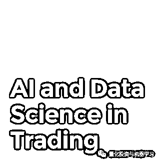

**人工智能（AI）**

1、大多数量化爱好者更喜欢机器学习（ML）这个术语而不是人工智能（AI）。

2、AI（ML）在量化投资过程中如何增加价值的问题仍然存在：

**观点一**

**英仕曼集团（Man Group）首席信息官 Sandy Rattray：****这****对交****易的执行很有效，但在预测收益方面却没有多大帮助**。来自彭博的一篇报道：

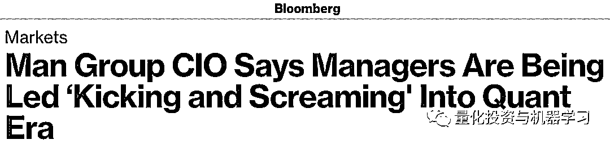

”Rattray said executing buy and sell orders is one of the easiest places to apply machine learning. Armed with huge amounts of data, traders can find clear patterns showing them the best banks to handle their orders.

Man trades about $6 trillion to $7 trillion a year and uses machine learning to execute almost all of those wagers, he said. The London-listed firm, which also uses quant methods in its discretionary business, oversaw $108.5 billion as of the end of last year.“

他谈到了机器学习的许多“rabbit holes”，没有任何价值的研究方向，比如卫星影像分析。**风险模型和归因中的机器学习很难向客户解释，因为这些因子几乎没有经济解释能力**。

**观点二**

**WorldQuant 的首席技术官 David Rushin：**这些先进的机器学习方法如何消除了新数据集的采集，准备，清理和测试的瓶颈，从而缩短研究周期。

**观点三**

**AQR 的 Marcos Lopez de Padr****o：**谈到了机器学习在风险管理和概率估计方面的成功。他说**机器学习对于大数据处理和分析的必要性**，但没有直接讨论机器学对收益预测成功率的内容。

**观点四**

几家初创的对冲基金公司：利用机器学习在多资产/宏观预测中使用大量的宏观经济时间序列来估计 regime。结果却是一半一半。

**观点五**

**法国巴黎银行 Ben Steiner**：机器学习的模型风险，并回应了这样的观点：与物理学，翻译，技术或工程学不同，机器学习正在学习类似“从图像中识别猫”这样的“真实”的现象，**而金融学中的机器学习学到东西有些不存在或正在发生变化，这样便带来了严重的模型风险问题。**

人工智能、机器学习和大数据分析的示意图

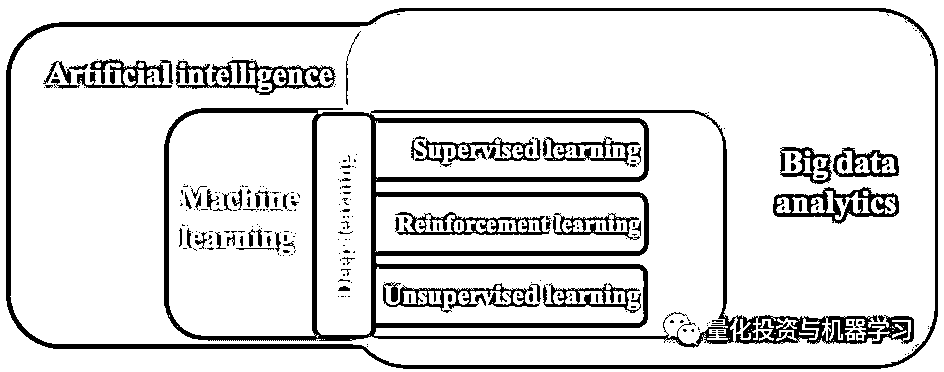

上图来自金融稳定理事会（Financial Stability Board，FSB）的一份报告。

**另类数据**

另类数据实际上是一个并行开发，已经在某种程度上加速了机器学习，但并不是所有的新数据都需要它。

**题外话：**

NRI（Nomura Research Institute，日本野村综合研究所）Takeshi Shimamura 写过一篇文章提到：

**近些年，另类数据在资产管理行业中的使用越来越广泛。根据 Opimas 公司的预测，全球另类数据市场将从 2017 年 43 亿美元增长到 2020 年的 90 亿美元——在 3 年间翻一番。**

另类数据更多的应用于偏股票型的量化对冲基金。近于实时的另类数据流有助资产管理公司提前获得大量股票买入或卖出的信号。除此之外，传统资产管理公司也已经开始使用另类数据来帮助提升人工制定长期投资决策的质量。例如，英国资产管理公司 Schroders 在 2014 年推出了一个“数据洞察部门”（Data Insights Unit，以下简称“DIU”）。DIU 拥有 30 名数据科学家，他们分析各种另类数据，帮助投资组合管理团队制定中长期投资决策。

**欧美市场也正在形成包括使用另类数据的资产管理经理、数据所有者和供应商的另类数据生态系统**。例如，Orbital Insights 和 Prattle 两家另类数据供应商，前者利用卫星图像估计原油库存，后者根据文本数据定量分析主要国家货币政策情绪。

根据新金融评论的报道：

**从数据积累方面看**

根据 IDC 的一份报告，2018 年全球有 33ZB 的数据，而这个数量预计在 2025 年会增长到 175ZB，这依赖于计算机算力的提升和存储设备技术的提高。

**从另类数据公司数量上看**

另类数据公司主要分为三类。一是原始数据提供者，这类供应商只收集最原始的另类数据，对于数据的处理程度最小；二是轻处理数据提供者，提供与金融资产相关的可视化数据；三是信号提供者，一般关注于某个特定行业，向资产管理公司提供打包好的量化投资信号。

**从市场空间上看**

另类数据统计表明截止 2017 年全球已有约 800 支基金利用另类数据做投资决策，2017 年投资机构对另类数据的投入规模约为 4 亿美金，行业正处于快速发展期，预计 2020 年可达 17 亿美金，CAGR 约为 45%。

**另类数据在量化投资领域**

投资机构为了获得超额收益，不断寻找新的市场阿尔法，**但主动型基金在寻找市场阿尔法这个核心竞争力上的优势越来越弱：**

1、因为市场有效性不断增强，基金经理很难找到被错误定价的资产；

2、因为大部分基金经理能得到的信息同质化，导致很难找到独特的信息优势和额外信息；

3、因为调研高度人工化导致人才的费用越来越高。

**目前国内使用另类数据的多为对冲基金、二级市场基金及部分一级市场基金**。另类数据可以**给基金经理带来五点优势：**

*   **更大体量的数据和信息**

*   **新的洞察力**

*   **竞争优势**

*   **可靠性**

*   **效率**

虽然基金经理使用另类数据寻找到新的阿尔法只是时间问题，**但并不是所有另类数据都有潜力可以帮助基金公司获取市场阿尔法**，因此另类数据公司在收集、清洗数据的同时，需要基金经理来评判数据是否有价值，同时高效的处理和应用将是降低成本和提升效率的关键，因此**另类数据公司应当具备机器学习等技术开发能力和高效的产品策略**。

另类数据提供商名单（部分举例）：

**国内 1：Wind**

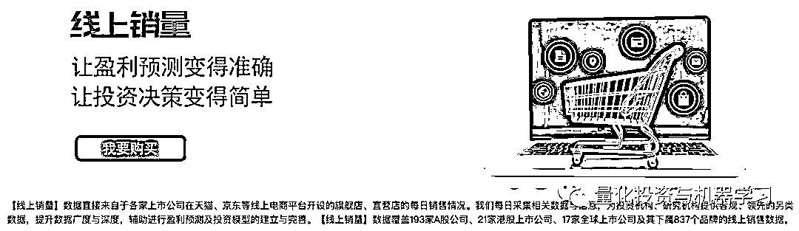

**国内 2：数据威**

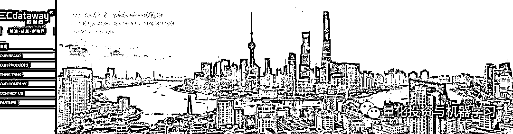

**国内 3：数库**

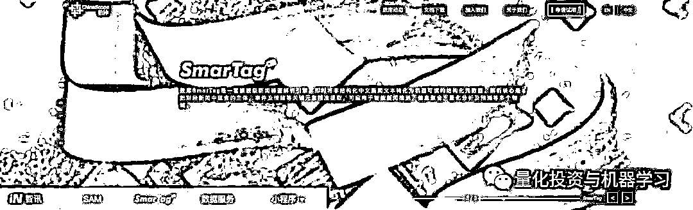

**国内 4：通联数据**

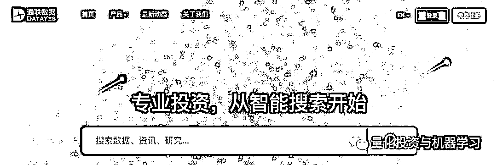

**国外 1：Quandl**

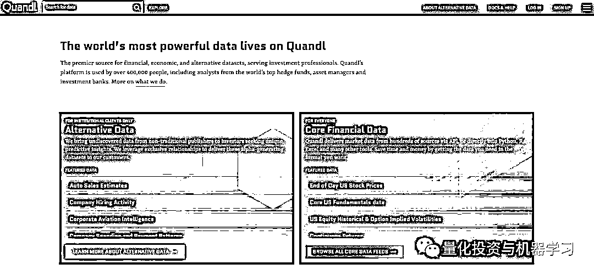

由于涉及百家国外公司，大家自行查看：

*https://alternativedata.org/data-providers/*

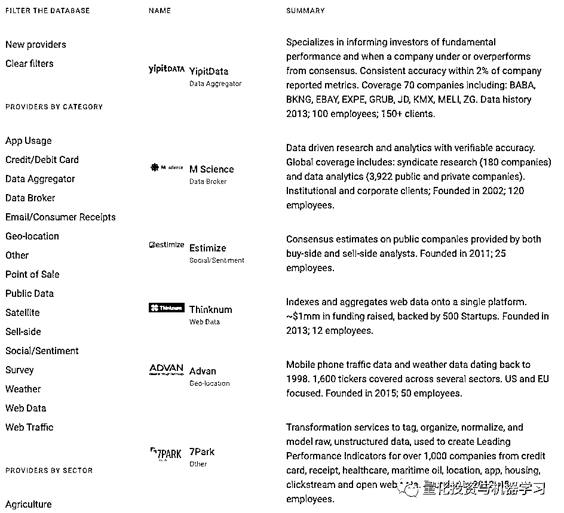

文献研究 1

*https://www.cfasociety.org/cleveland/Lists/Events%20Calendar/Attachments/1045/BIG-Data_AI-JPMmay2017.pdf*

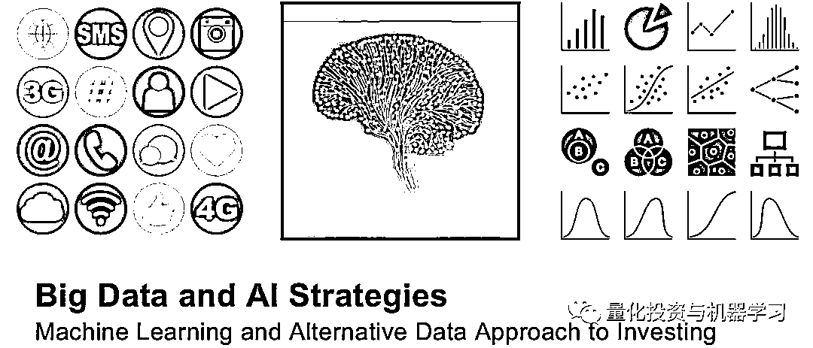

另类数据让我们感到充满了希望和创造力，但许多人拿”淘金热“作比喻——销售工具可能比寻找黄金本身更有利可图。

在许多对冲基金中，数据来源/采购是一项新的工作职能，它帮助数据供应商了解量化需求，并为大规模的量化研究细化数据。

**作者观点**

每个人都想谈论人工智能，但每个人都认为人工智能有太多的炒作。一些量化分析人士表示，人工智能并不是什么新东西。其他人则认为，先进的深度学习技术是真正的游戏规则改变者，而传统的分析方法无法处理大型复杂的数据集。无论哪种方式，我们都可以在金融领域找到机器学习的方方面面。

具体介绍见下面长达 53 页的 PPT：

**作者介绍**

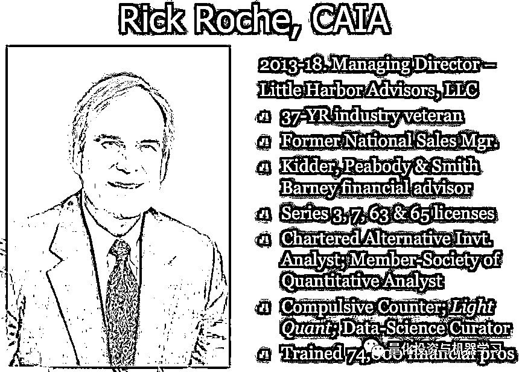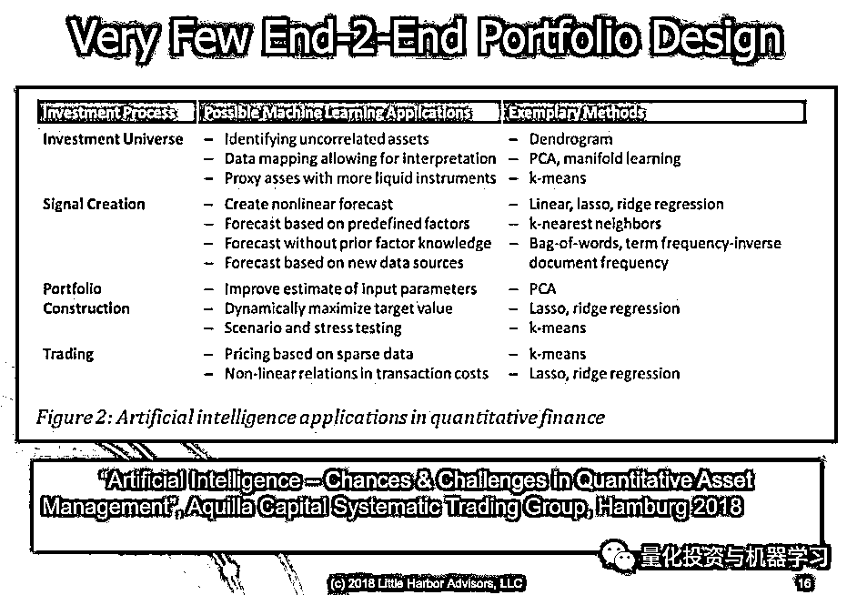

部分展示

PPT 下载：

*https://cdn.ymaws.com/www.scshp.com/resource/resmgr/fpa-nc_50min.pdf*

我相信，整合最新技术和数据的基本原理是一样的。首先，需要一个很好的研究方向或想法，然后是找到解决问题的工具。如果顺序颠倒过来，工具推动想法，那么“rabbit holes”很可能就会出现。

就像 90 年代的 Compustat / IBES / Matlab 一样，**今天的另类数据、机器学习将为那些具有独特创新思想的人带来一些非凡的成果。**

总的来说，我认为对**另类数据和机器学习的使用非常有价值，但前提是它要符合你一贯的投资风格。**

再引用一段来自**亿欧智库研究院**对另类数据的解读，觉得说的很好：

**另类数据并非神秘的、完全新生的事物，而是人类扩展信息边界的漫漫过程中的又一次量变性突破。**之所以这么说，是因为另类数据完全是一个具有相对性与变化性的概念。将历史拉长来看能更好理解：两百年前，地缘政治事件是另类数据；一百年前，股票价格数据是另类数据；五十年前，路透社公司首次将公司报表数字化之前，公司财务报表数据是另类数据。当时的这些数据和当今的网页数据等等很相似，都对于投资决策有重要意义，但其获取成本还未降低到足以使其普及。随着后来技术的不断进步，这些数据逐步被正式纳入投资决策数据，构成了今天的我们所认为的传统数据。而随着今天和未来技术的发展迭代，越来越多之前无法利用的有效信息、当下我们所称的“另类信息”也将逐步常规化，成为未来的传统数据。

**这一观点带给我们的启示是，数据的内涵与外延在不断变化，分析人员的思维不能停留在传统数据的舒适圈中，必须与时俱进，保持开放。而目前，我们的时代也许正处于这一轮变革浪潮的高潮。**

最后：

*“Most problems don’t require more data. They require more insight, more innovation and better eyes. Information is what we call it when a human being takes data and turns it into a useful truth.”*

*- Seth Godin*

*”大多数问题无需大量的数据。它们需要更多的洞察力，更多的创新性和一双慧眼。当人类获取数据并将其转化为有用的真理时，我们称之为信息。“*

**免费赠书活动**

公众号今天免费送读者**5 本****《****区块链与金融大数据整合实战****》**

本书从区块链的概念、原理、核心技术和应用等几个方面系统地介绍了区块链的相关知识，重点介绍了公链、联盟链和 DApp 开发等内容，并对区块链的海量存储和下一代公链扩容技术做了必要讲解。另外，本书对金融大数据的相关知识也做了详细介绍，并结合公链 DApp 和联盟链 Fabric 金融系统的开发，从实战角度介绍了区块链与金融大数据的整合应用，便于读者了解未来区块链技术在金融领域中的应用前景。 

获取方式很简单

在**写留言**处发表留言

**获得点赞前 5 的读者**

即可免费获赠此书

截止日期：**2019-06-17 12:00**

**届时，工作人员会联系五位读者微信，寄出此书**

*—End—*

量化投资与机器学习微信公众号，是业内垂直于**Quant**、**MFE**、**CST**等专业的主流量化自媒体。公众号拥有来自**公募、私募、券商、银行、海外**等众多圈内**10W+**关注者。每日发布行业前沿研究成果和最新资讯。

