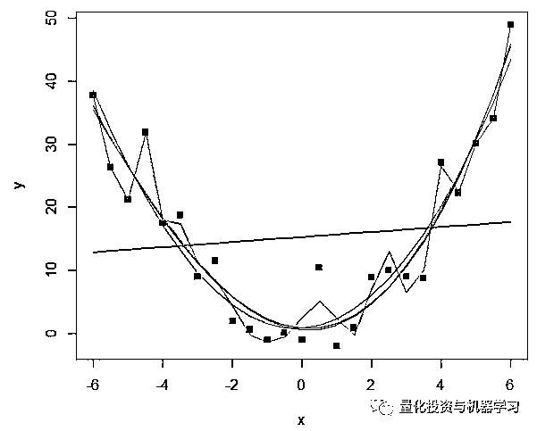
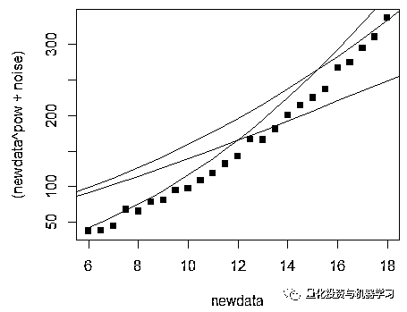
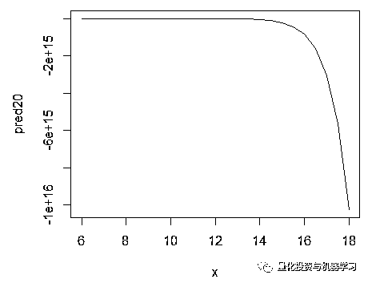
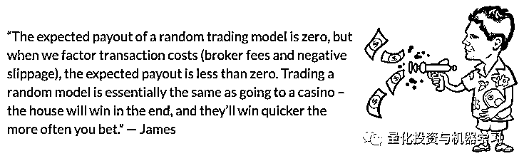
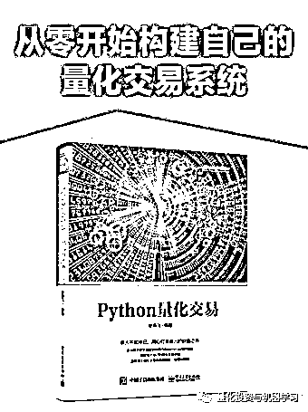

# 回测偏差让你哭到爆炸！（文末送最新量化书籍）

> 原文：[`mp.weixin.qq.com/s?__biz=MzAxNTc0Mjg0Mg==&mid=2653292650&idx=1&sn=fa699c385daa565d8c1d36eb97349a1b&chksm=802dca7fb75a4369679c604be1755ce1c57e422e6f4a4a332e981332df7570899d84744cc2fe&scene=27#wechat_redirect`](http://mp.weixin.qq.com/s?__biz=MzAxNTc0Mjg0Mg==&mid=2653292650&idx=1&sn=fa699c385daa565d8c1d36eb97349a1b&chksm=802dca7fb75a4369679c604be1755ce1c57e422e6f4a4a332e981332df7570899d84744cc2fe&scene=27#wechat_redirect)

**标星★公众号     **爱你们♥

编译：公众号海外翻译部作者：Michael M

**近期原创文章：**

## ♥ [5 种机器学习算法在预测股价的应用（代码+数据）](https://mp.weixin.qq.com/s?__biz=MzAxNTc0Mjg0Mg==&mid=2653290588&idx=1&sn=1d0409ad212ea8627e5d5cedf61953ac&chksm=802dc249b75a4b5fa245433320a4cc9da1a2cceb22df6fb1a28e5b94ff038319ae4e7ec6941f&token=1298662931&lang=zh_CN&scene=21#wechat_redirect)

## ♥ [Two Sigma 用新闻来预测股价走势，带你吊打 Kaggle](https://mp.weixin.qq.com/s?__biz=MzAxNTc0Mjg0Mg==&mid=2653290456&idx=1&sn=b8d2d8febc599742e43ea48e3c249323&chksm=802e3dcdb759b4db9279c689202101b6b154fb118a1c1be12b52e522e1a1d7944858dbd6637e&token=1330520237&lang=zh_CN&scene=21#wechat_redirect)

## ♥ 2 万字干货：[利用深度学习最新前沿预测股价走势](https://mp.weixin.qq.com/s?__biz=MzAxNTc0Mjg0Mg==&mid=2653290080&idx=1&sn=06c50cefe78a7b24c64c4fdb9739c7f3&chksm=802e3c75b759b563c01495d16a638a56ac7305fc324ee4917fd76c648f670b7f7276826bdaa8&token=770078636&lang=zh_CN&scene=21#wechat_redirect)

## ♥ [一位数据科学 PhD 眼中的算法交易](https://mp.weixin.qq.com/s?__biz=MzAxNTc0Mjg0Mg==&mid=2653290118&idx=1&sn=a261307470cf2f3e458ab4e7dc309179&chksm=802e3c93b759b585e079d3a797f512dfd0427ac02942339f4f1454bd368ba47be21cb52cf969&token=770078636&lang=zh_CN&scene=21#wechat_redirect)

## ♥ [基于 RNN 和 LSTM 的股市预测方法](https://mp.weixin.qq.com/s?__biz=MzAxNTc0Mjg0Mg==&mid=2653290481&idx=1&sn=f7360ea8554cc4f86fcc71315176b093&chksm=802e3de4b759b4f2235a0aeabb6e76b3e101ff09b9a2aa6fa67e6e824fc4274f68f4ae51af95&token=1865137106&lang=zh_CN&scene=21#wechat_redirect)

## ♥ [如何鉴别那些用深度学习预测股价的花哨模型？](https://mp.weixin.qq.com/s?__biz=MzAxNTc0Mjg0Mg==&mid=2653290132&idx=1&sn=cbf1e2a4526e6e9305a6110c17063f46&chksm=802e3c81b759b597d3dd94b8008e150c90087567904a29c0c4b58d7be220a9ece2008956d5db&token=1266110554&lang=zh_CN&scene=21#wechat_redirect)

## ♥ [优化强化学习 Q-learning 算法进行股市](https://mp.weixin.qq.com/s?__biz=MzAxNTc0Mjg0Mg==&mid=2653290286&idx=1&sn=882d39a18018733b93c8c8eac385b515&chksm=802e3d3bb759b42d1fc849f96bf02ae87edf2eab01b0beecd9340112c7fb06b95cb2246d2429&token=1330520237&lang=zh_CN&scene=21#wechat_redirect)

## ♥ [WorldQuant 101 Alpha、国泰君安 191 Alpha](https://mp.weixin.qq.com/s?__biz=MzAxNTc0Mjg0Mg==&mid=2653290927&idx=1&sn=ecca60811da74967f33a00329a1fe66a&chksm=802dc3bab75a4aac2bb4ccff7010063cc08ef51d0bf3d2f71621cdd6adece11f28133a242a15&token=48775331&lang=zh_CN&scene=21#wechat_redirect)

## ♥ [基于回声状态网络预测股票价格（附代码）](https://mp.weixin.qq.com/s?__biz=MzAxNTc0Mjg0Mg==&mid=2653291171&idx=1&sn=485a35e564b45046ff5a07c42bba1743&chksm=802dc0b6b75a49a07e5b91c512c8575104f777b39d0e1d71cf11881502209dc399fd6f641fb1&token=48775331&lang=zh_CN&scene=21#wechat_redirect)

## ♥ [AQR 最最最新 | 计量经济学应用投资失败的 7 个原因](https://mp.weixin.qq.com/s?__biz=MzAxNTc0Mjg0Mg==&mid=2653292186&idx=1&sn=87501434ae16f29afffec19a6884ee8d&chksm=802dc48fb75a4d99e0172bf484cdbf6aee86e36a95037847fd9f070cbe7144b4617c2d1b0644&token=48775331&lang=zh_CN&scene=21#wechat_redirect)

## ♥ [关于高盛在 Github 开源背后的真相！](https://mp.weixin.qq.com/s?__biz=MzAxNTc0Mjg0Mg==&mid=2653291594&idx=1&sn=7703403c5c537061994396e7e49e7ce5&chksm=802dc65fb75a4f49019cec951ac25d30ec7783738e9640ec108be95335597361c427258f5d5f&token=48775331&lang=zh_CN&scene=21#wechat_redirect)

## ♥ [新一代量化带货王诞生！Oh My God！](https://mp.weixin.qq.com/s?__biz=MzAxNTc0Mjg0Mg==&mid=2653291789&idx=1&sn=e31778d1b9372bc7aa6e57b82a69ec6e&chksm=802dc718b75a4e0ea4c022e70ea53f51c48d102ebf7e54993261619c36f24f3f9a5b63437e9e&token=48775331&lang=zh_CN&scene=21#wechat_redirect)

## ♥ [独家！关于定量/交易求职分享（附真实试题）](https://mp.weixin.qq.com/s?__biz=MzAxNTc0Mjg0Mg==&mid=2653291844&idx=1&sn=3fd8b57d32a0ebd43b17fa68ae954471&chksm=802dc751b75a4e4755fcbb0aa228355cebbbb6d34b292aa25b4f3fbd51013fcf7b17b91ddb71&token=48775331&lang=zh_CN&scene=21#wechat_redirect)

## ♥ [Quant 们的身份危机！](https://mp.weixin.qq.com/s?__biz=MzAxNTc0Mjg0Mg==&mid=2653291856&idx=1&sn=729b657ede2cb50c96e92193ab16102d&chksm=802dc745b75a4e53c5018cc1385214233ec4657a3479cd7193c95aaf65642f5f45fa0e465694&token=48775331&lang=zh_CN&scene=21#wechat_redirect)

## ♥ [拿起 Python，防御特朗普的 Twitter！](https://mp.weixin.qq.com/s?__biz=MzAxNTc0Mjg0Mg==&mid=2653291977&idx=1&sn=01f146e9a88bf130ca1b479573e6d158&chksm=802dc7dcb75a4ecadfdbdace877ed948f56b72bc160952fd1e4bcde27260f823c999a65a0d6d&token=48775331&lang=zh_CN&scene=21#wechat_redirect)

## ♥ [用深度强化学习打造不亏钱的交易机器人（附代码）](https://mp.weixin.qq.com/s?__biz=MzAxNTc0Mjg0Mg==&mid=2653292021&idx=1&sn=a9cbc37fd50d917df61728eee0a109db&chksm=802dc7e0b75a4ef6937f4e73bd561362d4baa6219e948fc5211e1071c50925cd69925fb1850e&token=48775331&lang=zh_CN&scene=21#wechat_redirect)

**前言**

在一个理想的交易世界里，我们都会有一个巨大的金色“因果关系放大镜”。通过这个虚构的镜头，你可以放大并理解金融市场短暂而神秘的本质，剥去其原因和影响。

确切地知道导致可利用效率低下的原因，将使预测市场的行为和建立有利可图的交易策略成为一项相当轻松的工作。

如果你是一名工程师或科学家，读到这篇文章，你可能会点头附和，希望我们可以讲述金融市场对资本家产生了某种多米诺骨牌效应。你可以用你在建筑工程或培养皿中使用的分析方法对它们进行建模。但不幸的是，**试图把市场硬塞进公式里是徒劳的**。

在真正投入资金之前，我们都想确定我们的想法是否会盈利。但是，由于你不能实际地将数学模型应用到策略以获得其未来的表现，所以你需要借助另一个方法进行验证。

通过在开发过程中试验你的交易策略，评估其潜在的未来表现时，你可能会出现一些致命的错误。这些会花费你的时间，金钱和许多令人头痛的事情。

**在本篇推文中，你将学习如何识别和避免更常见的模拟偏差，这样你就可以建立更强大，更有利可图的系统交易策略！**

作为一名系统性交易员，你如何进行实验?

在测试系统化交易策略时，你有两种选择：

*   你可以找出策略的**实际表现**

*   你可以找出策略的**可能表现**

第一个选择只需把真金白银投到策略的实时版本中，看看它是否有令人期待的效果。第二种方法是就是我们常说的：**回测**

简单地做回测是一回事，但是获得准确的、可操作的数据来帮助您保留更多的资金则是另一回事。

这种简单的方法无疑会导致一些回测偏差。 

这些微妙而深刻回测偏差将会渗透到你的开发过程中，并对策略性能产生灾难性的影响。

**前视偏差**

前视偏差是通过允许未来的事件影响你对历史场景的决策而引入的。在回测部分，这种偏差会影响到你的交易决策，因为在做出最初的交易决策时，这些是不可用的。

**使用交易完成之后的信息，导致前视偏差（Look-Ahead Bias）**。比如“在日最低价的 1%之内买入股票”的规则就具有先窥偏差，因为在收盘之前是不可能知道日最低价的。又如，用全部数据回归得来的系数，来产生一个基于前后两段价格系列的线性回归模型的交易信号，同样犯了前视偏差的错误。

即使你使用了避免前视偏差的回测框架，那你也需要小心。一个细微但潜在严重的错误是使用整个模拟周期来计算交易参数（例如，一个投资组合的优化参数)，然后在模拟开始时应用该参数。

这个错误太常见了，你必须反复检查。再三检查你的回测是否真的有效。

**过拟合偏差**

如果你做了一个年化收益率在成千上万百分点左右的回测——那么有可能你的策略出现了过拟合偏差。这些回测对于真实的、系统的交易毫无用处，请不要沾沾自喜！ 

看看下面的图，了解过拟合的情况。下图中的蓝色方块是一个人工生成的二次函数，添加了一些噪声来扭曲底层信号。这些线表示与数据点相匹配的各种模型。红线为线性回归线；绿线、蓝线和橙线分别是二次函数、三次函数和四次函数。除了线性回归线，所有这些都很好地对参数空间中的这个区域的数据进行了建模。

粉色线是一个高阶多项式回归，它最适合这个数据：

但是，这些模型经得起样本外的检验吗？在模型拟合过程中，对没有使用的数据的泛化程度如何？

下图显示了观察变量空间的一个新区域中二次，三次和四次函数的性能，这意味着一个样本外的数据集。在这种情况下，二次函数显然是表现最好的，我们知道它与底层生成函数最匹配，这是一个良好拟合模型的一个例子。

其他模型在预测这个新的、不可见的参数空间区域的函数值方面做得相当糟糕，尽管它们在样本内数据上看起来相当有吸引力。

样本数据集（高阶多项式）上的最佳模型在对样本外进行建模方面做得非常糟糕。实际上，为了看到它，我们必须看 y 轴上完全不同的部分，甚至使用对数标度来理解它：

当我们知道函数永远不会产生一个负值时（由于底层函数中的二次项），这个模型就会预测出函数的极大负值。这个函数看起来一点也不像二次函数：它更像一个双曲函数。

这种对基础流程的错误描述是一个典型的过度拟合的例子，它会让你在算法交易的早期经常碰壁。**事实上，在你策略制定的过程中，你每天都会面临这个问题，你只是在经验中学会了如何克服它。**

过拟合偏差会影响在样本内数据测试的策略。同样的数据用于优化和测试策略。常识会告诉你，一个策略将在它优化的数据上表现良好——这就是优化的全部意义！此外，无尽地搜索参数空间和选择局部最大值，无疑会导致样本外测试的过拟合和失败。

理解样本内数据集不是度量策略的性能的目的。样本内数据用于制定策略并找到可能合适的参数值。充其量，你应该考虑样本内的结果，来表明该策略是否能够盈利。

避免使用样本内结果来衡量策略未来可能的表现。

当你将一个模型（交易策略）与一个嘈杂的数据集相匹配时，你的模型就有可能与噪音相匹配，而不是与潜在的信号相匹配。潜在的信号是你认为可以提供有利可图的交易机会的异常或价格效应，而这个信号正是你试图用你的模型捕捉的信号。

**噪音介于你和钱之间。它不可能以完全相同的方式重复自己。 如果你的模型适合噪音，你最终会得到一个随机模型。**

那么这一切的最重要的教训是什么呢？

样本内数据仅在以下方面有用：

**1、找出一个策略是否盈利，以及在什么条件下盈利。**

**2、确定哪些参数对性能有显著影响。**

**3、确定可可以优化参数的合理范围。**

**4、调试策略，即确保交易按预期进行**

考虑到这篇文章的主题，你会发现上面缺少了一些内容：衡量交易策略的表现。

你从样本内测试中获得的任何性能评估都受到过拟合偏差的困扰，并且很可能是一个乐观的评估——除非你的整个开发过程都是无懈可击的……但这是另一回事了。

**解决过拟合偏差的办法是对市场和策略采取明智的做法。**这包括（**本篇精华：）**

**1、保持简单的交易。可适配参数的数量越少越好。**

**2、不要盲目地为交易规则挖掘数据，更倾向于那些可以用一句话解释清楚的交易。**

**3、优化稳健性，而不是样本内性能。**

**4、避免在模型规范中要求超精确。市场数据嘈杂多变，任何信号都很微弱。**

**5、避免那些顶多只能勉强抵消手续费的交易。**

再重复一遍：

**除非你非常非常小心，否则不要使用样本数据来衡量策略的表现！**

**数据偏差 or 选择偏差**

与其花一辈子的时间试图完全消除这种偏差，而是要意识到这一点并接受这一点：**总体而言，你的策略在市场上的表现不会像在模拟中那么好。**

假设你在外汇市场制定了一个趋势跟踪策略。该策略完胜欧元兑美元的回测，但在美元兑日元上却失效了。任何明智的人都会交易欧元/美元市场，对吗？当然，但是你刚刚在流程中引入了选择偏差。因为你对策略的表现估计是有偏差的。也许欧元兑美元表现良好是有原因的。但是，一些选择偏见已经渗透到你的开发过程中。 

有统计检验来解释数据挖掘的偏差，包括将策略的性能与随机性能的分布进行比较。

你也可以使用样本外数据，但是这很快就会产生问题，因为我们只有有限数量的历史数据可供开发。

因此，克服选择偏差最佳方法就是采用一种明智的、经过衡量的策略开发方法，如上所述。

**结论**

根据经验，你希望构建稳健的交易策略。更重要的是，你希望使用简单的方法实现这一目标。**你的方法越复杂，就越有可能落入我们在上面讨论过的陷阱。无论哪种方式，我们都很容易找到似乎表现不错、但其结果证明是由于运气或随机性的策略。**

在这里，我们还要隆重介绍一下石川博士曾经写的关于回测的四篇文章。可以对上文进行一个完美的补充（点击阅读）

*   [**美丽的回测 —— 教你定量计算过拟合概率**](https://mp.weixin.qq.com/s?__biz=MzIyMDEwNDk1Mg==&mid=2650878458&idx=1&sn=961a5d206149f0f801ead311f346b8e7&scene=21#wechat_redirect)

*   [**所有历史数据都是样本内**](https://mp.weixin.qq.com/s?__biz=MzIyMDEwNDk1Mg==&mid=2650878785&idx=1&sn=6df2c7e02b2f3cf0e1482d6319988c79&scene=21#wechat_redirect)

*   [**机器学习时代的回测规程**](https://mp.weixin.qq.com/s?__biz=MzIyMDEwNDk1Mg==&mid=2650879049&idx=1&sn=15c117537560fb08189e690df87e74db&scene=21#wechat_redirect)

*   [**科学回测中的大学问**](https://mp.weixin.qq.com/s?__biz=MzIyMDEwNDk1Mg==&mid=2650877613&idx=1&sn=ee932ca4c69460d2f3e7e62e5bab5d3f&scene=21#wechat_redirect)

石川博士也是我们**量化投资与机器学习微信公众号的专栏特约作者**。大家可以关注他的公众号：

**川总写量化**

**免费赠书活动**

公众号和「博文视点」合作送给公众号读者**5 本****《Python 量化交易》**

用**Python+vn.py**组合从零搭建属于自己的量化交易系统。

*   Python 量化交易仅用一章的篇幅就把量化交易概念、源起和发展用故事的形式介绍了，适合完全不懂量化交易的读者入门。

*   本书再仅用一章的篇幅就把 Python 在量化交易里用到的基础必用知识全部介绍完了，适合特别了解量化交易但不想学太多程序知识的读者，掌握这一章内容即可进行 Python 量化交易。

*   本书接下来用一章的篇幅把当下流行的 vn.py 框架引入进来。

*   接下来，即为本书的精华所在，也是本书价值所在，即各种量化交易策略的介绍、运用、回测等，帮助读者搭建属于自己的量化系统，找到最佳的产品配比组合。

获取方式很简单

在**写留言**处发表留言

**获得点赞前 5 的读者**

即可免费获赠此书

截止日期：**2019-06-14 18:00**

**届时，工作人员会联系五位读者微信，寄出此书**

*—End—*

量化投资与机器学习微信公众号，是业内垂直于**Quant**、**MFE**、**CST**等专业的主流量化自媒体。公众号拥有来自**公募、私募、券商、银行、海外**等众多圈内**10W+**关注者。每日发布行业前沿研究成果和最新资讯。

