# 如何考上清华北大？

> 原文：[`mp.weixin.qq.com/s?__biz=MzAxNTc0Mjg0Mg==&mid=2653292637&idx=1&sn=ca90d342519bd45f307b1c207b2c7993&chksm=802dca48b75a435e9a83ca5e74b65822759b46cdec0e78e4b6e81525e2e6887ef064eebf3465&scene=27#wechat_redirect`](http://mp.weixin.qq.com/s?__biz=MzAxNTc0Mjg0Mg==&mid=2653292637&idx=1&sn=ca90d342519bd45f307b1c207b2c7993&chksm=802dca48b75a435e9a83ca5e74b65822759b46cdec0e78e4b6e81525e2e6887ef064eebf3465&scene=27#wechat_redirect)

**标星★公众号     **爱你们♥

来自：EBSCNEDU 研究独家授权作者：刘凯、曹天宇、贾昌浩

**近期原创文章：**

## ♥ [5 种机器学习算法在预测股价的应用（代码+数据）](https://mp.weixin.qq.com/s?__biz=MzAxNTc0Mjg0Mg==&mid=2653290588&idx=1&sn=1d0409ad212ea8627e5d5cedf61953ac&chksm=802dc249b75a4b5fa245433320a4cc9da1a2cceb22df6fb1a28e5b94ff038319ae4e7ec6941f&token=1298662931&lang=zh_CN&scene=21#wechat_redirect)

## ♥ [Two Sigma 用新闻来预测股价走势，带你吊打 Kaggle](https://mp.weixin.qq.com/s?__biz=MzAxNTc0Mjg0Mg==&mid=2653290456&idx=1&sn=b8d2d8febc599742e43ea48e3c249323&chksm=802e3dcdb759b4db9279c689202101b6b154fb118a1c1be12b52e522e1a1d7944858dbd6637e&token=1330520237&lang=zh_CN&scene=21#wechat_redirect)

## ♥ [利用深度学习最新前沿预测股价走势](https://mp.weixin.qq.com/s?__biz=MzAxNTc0Mjg0Mg==&mid=2653290080&idx=1&sn=06c50cefe78a7b24c64c4fdb9739c7f3&chksm=802e3c75b759b563c01495d16a638a56ac7305fc324ee4917fd76c648f670b7f7276826bdaa8&token=770078636&lang=zh_CN&scene=21#wechat_redirect)

## ♥ [一位数据科学 PhD 眼中的算法交易](https://mp.weixin.qq.com/s?__biz=MzAxNTc0Mjg0Mg==&mid=2653290118&idx=1&sn=a261307470cf2f3e458ab4e7dc309179&chksm=802e3c93b759b585e079d3a797f512dfd0427ac02942339f4f1454bd368ba47be21cb52cf969&token=770078636&lang=zh_CN&scene=21#wechat_redirect)

## ♥ [基于 RNN 和 LSTM 的股市预测方法](https://mp.weixin.qq.com/s?__biz=MzAxNTc0Mjg0Mg==&mid=2653290481&idx=1&sn=f7360ea8554cc4f86fcc71315176b093&chksm=802e3de4b759b4f2235a0aeabb6e76b3e101ff09b9a2aa6fa67e6e824fc4274f68f4ae51af95&token=1865137106&lang=zh_CN&scene=21#wechat_redirect)

## ♥ [如何鉴别那些用深度学习预测股价的花哨模型？](https://mp.weixin.qq.com/s?__biz=MzAxNTc0Mjg0Mg==&mid=2653290132&idx=1&sn=cbf1e2a4526e6e9305a6110c17063f46&chksm=802e3c81b759b597d3dd94b8008e150c90087567904a29c0c4b58d7be220a9ece2008956d5db&token=1266110554&lang=zh_CN&scene=21#wechat_redirect)

## ♥ [优化强化学习 Q-learning 算法进行股市](https://mp.weixin.qq.com/s?__biz=MzAxNTc0Mjg0Mg==&mid=2653290286&idx=1&sn=882d39a18018733b93c8c8eac385b515&chksm=802e3d3bb759b42d1fc849f96bf02ae87edf2eab01b0beecd9340112c7fb06b95cb2246d2429&token=1330520237&lang=zh_CN&scene=21#wechat_redirect)

## ♥ [WorldQuant 101 Alpha、国泰君安 191 Alpha](https://mp.weixin.qq.com/s?__biz=MzAxNTc0Mjg0Mg==&mid=2653290927&idx=1&sn=ecca60811da74967f33a00329a1fe66a&chksm=802dc3bab75a4aac2bb4ccff7010063cc08ef51d0bf3d2f71621cdd6adece11f28133a242a15&token=48775331&lang=zh_CN&scene=21#wechat_redirect)

## ♥ [基于回声状态网络预测股票价格（附代码）](https://mp.weixin.qq.com/s?__biz=MzAxNTc0Mjg0Mg==&mid=2653291171&idx=1&sn=485a35e564b45046ff5a07c42bba1743&chksm=802dc0b6b75a49a07e5b91c512c8575104f777b39d0e1d71cf11881502209dc399fd6f641fb1&token=48775331&lang=zh_CN&scene=21#wechat_redirect)

## ♥ [AQR 最最最新 | 计量经济学应用投资失败的 7 个原因](https://mp.weixin.qq.com/s?__biz=MzAxNTc0Mjg0Mg==&mid=2653292186&idx=1&sn=87501434ae16f29afffec19a6884ee8d&chksm=802dc48fb75a4d99e0172bf484cdbf6aee86e36a95037847fd9f070cbe7144b4617c2d1b0644&token=48775331&lang=zh_CN&scene=21#wechat_redirect)

## ♥ [关于高盛在 Github 开源背后的真相！](https://mp.weixin.qq.com/s?__biz=MzAxNTc0Mjg0Mg==&mid=2653291594&idx=1&sn=7703403c5c537061994396e7e49e7ce5&chksm=802dc65fb75a4f49019cec951ac25d30ec7783738e9640ec108be95335597361c427258f5d5f&token=48775331&lang=zh_CN&scene=21#wechat_redirect)

## ♥ [新一代量化带货王诞生！Oh My God！](https://mp.weixin.qq.com/s?__biz=MzAxNTc0Mjg0Mg==&mid=2653291789&idx=1&sn=e31778d1b9372bc7aa6e57b82a69ec6e&chksm=802dc718b75a4e0ea4c022e70ea53f51c48d102ebf7e54993261619c36f24f3f9a5b63437e9e&token=48775331&lang=zh_CN&scene=21#wechat_redirect)

## ♥ [独家！关于定量/交易求职分享（附真实试题）](https://mp.weixin.qq.com/s?__biz=MzAxNTc0Mjg0Mg==&mid=2653291844&idx=1&sn=3fd8b57d32a0ebd43b17fa68ae954471&chksm=802dc751b75a4e4755fcbb0aa228355cebbbb6d34b292aa25b4f3fbd51013fcf7b17b91ddb71&token=48775331&lang=zh_CN&scene=21#wechat_redirect)

## ♥ [Quant 们的身份危机！](https://mp.weixin.qq.com/s?__biz=MzAxNTc0Mjg0Mg==&mid=2653291856&idx=1&sn=729b657ede2cb50c96e92193ab16102d&chksm=802dc745b75a4e53c5018cc1385214233ec4657a3479cd7193c95aaf65642f5f45fa0e465694&token=48775331&lang=zh_CN&scene=21#wechat_redirect)

## ♥ [拿起 Python，防御特朗普的 Twitter！](https://mp.weixin.qq.com/s?__biz=MzAxNTc0Mjg0Mg==&mid=2653291977&idx=1&sn=01f146e9a88bf130ca1b479573e6d158&chksm=802dc7dcb75a4ecadfdbdace877ed948f56b72bc160952fd1e4bcde27260f823c999a65a0d6d&token=48775331&lang=zh_CN&scene=21#wechat_redirect)

## ♥ [用深度强化学习打造不亏钱的交易机器人（附代码）](https://mp.weixin.qq.com/s?__biz=MzAxNTc0Mjg0Mg==&mid=2653292021&idx=1&sn=a9cbc37fd50d917df61728eee0a109db&chksm=802dc7e0b75a4ef6937f4e73bd561362d4baa6219e948fc5211e1071c50925cd69925fb1850e&token=48775331&lang=zh_CN&scene=21#wechat_redirect)

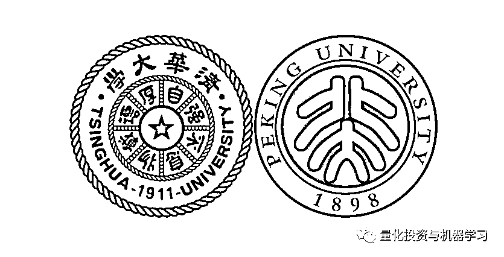

**正文**如何考上清华北大我们小时候都认真的想过这个问题——考清华好还是北大好。人生如戏，戏如人生。距离 2019 年高考还有 1 天，要不要尝试再次步入考场，蟾宫折桂，斩获清北？
**根据 2017 年录取情况，10000 名考生之中只有 7 人能考上清华北大。而这 7 人之中 90%以上都有 10-60 分加持，参加竞赛获得国奖是拿到加分的关键法宝。清华北大的 14 种招生方法您知多少？保送、签约、自招、博雅、强军、各种冬夏秋令营您知多少？**本文将根据 2017 年的录取数据（来自统计局、各省教育厅、清北招生官网），来为大家起底考上清北到底有多难和如何考上清北**考上清北到底有多难**2017 年全国高考人数为 920 万人，当年清北复交的录取人数分别为：清华 3328 人、北大 3396 人、复旦 3963 人、上海交大 2536 人，共计 13123 人。大约在一万个人里面只有 14 个人可以考上清北复交，7 个人可以考上清北，万里挑七。
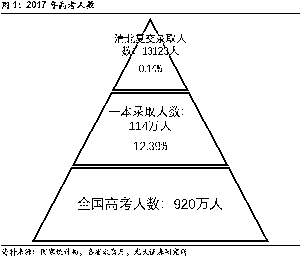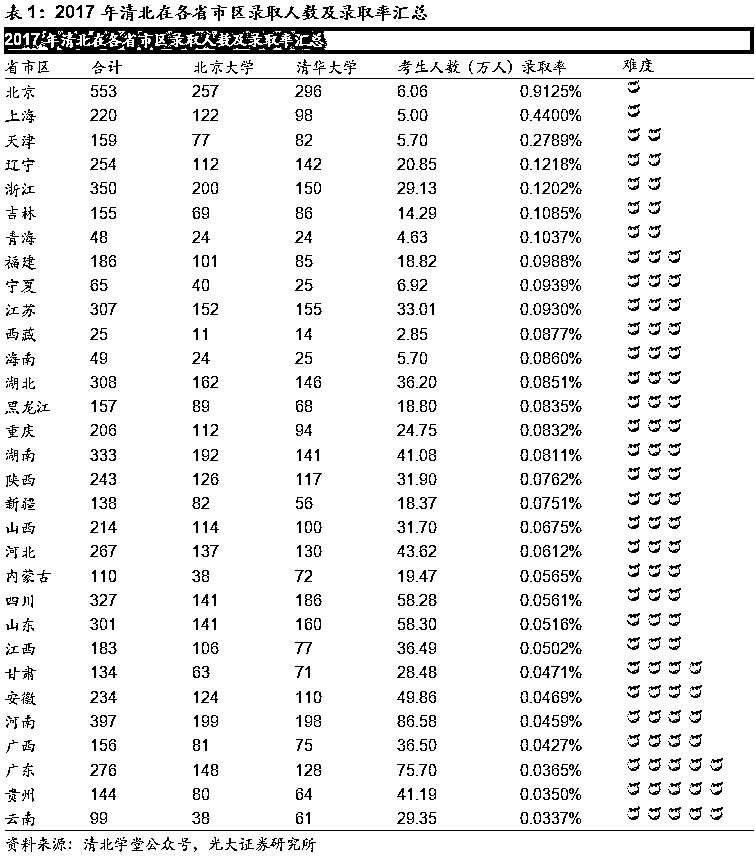**如何考上清北**

**裸分占比不足 10%**

**特招加分超过 90%** 

新高考教改增强考试自主性，促进教育公平。2014 年 9 月，教育部开始逐步启动新高考教改。新高考实行“不分文理，6 选 3”模式，学生可以在语数英之外根据特长从“政史地物化生”中选择 3 门，且外语科目提供两次考试机会，增强了学生的自主性。新高考改革在全国范围内分批推进，2014~2017 年 6 省市进行改革试点，2018 年 17 省市同时开启新高考改革，2020 年将全面建立新高考制度。随着新高考的推进，高校能够通过加大自主招生选拔力度，选择更适合专业要求的人才，考生能够在更加公平的环境下进行报考。

**考上清北的途径大致可以分为 14 类：高考裸分统招、自主招生、综合评价、领军计划/博雅计划、自强计划/筑梦计划、丘成桐数学班/数学英才班、高水平运动队、高水平艺术团、保送生、飞行员班/国防（飞行员）、定向生、艺术特长生、国际学生、港澳台侨。**“博雅计划、强军计划”侧重于选拔综合素质全面、品学兼优的优秀学生，自主招生侧重于选拔学科特长突出、具备创新潜质的优秀人才。

接下来，本文将介绍考入清北的若干方法，一定要牢记于心。

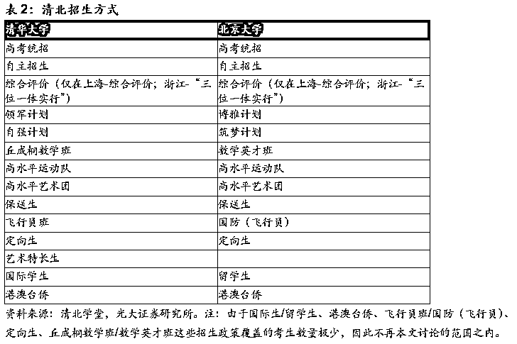

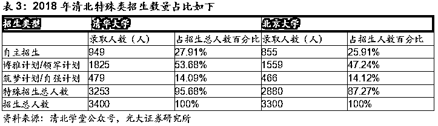

**2.1、高考裸分**

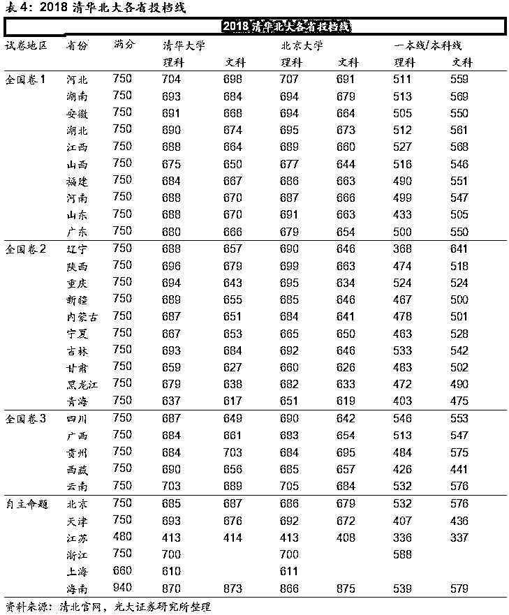

**2.2、保送**

在教育部下发的《关于做好 2016 年高校部分特殊类型招生工作的通知》中明确提出**省级优秀学生、中学生学科奥林匹克竞赛国家集训队成员、部分外国语中学推荐优秀学生、公安英烈子女、退役运动员**等五类人员具备高校保送资格。教育部公布的 2016 年全国普通高等学校名单中的高校均有资格招收保送生。但分数仍需达到保送学校规定的保送线（低于普通高考线）。

清北的保送生一般分为 2 类：

**1、在高中阶段获得全国中学生奥林匹克竞赛决赛一等奖，并被中国科协遴选为参加国际数学、物理、化学、生物学、信息学奥林匹克竞赛国家队集训的应届高中毕业生。**

**2、外国语学校的小语种保送生。**

保送程序：初审+测试+认定

**1、初审**

在规定期限内寄送内容和形式符合要求的申请材料，校方确定通过初审参加保送生选拔测试的名单。

**2、测试**

保送生选拔测试分为笔试和面试。其中，笔试科目分为三个考试科类：数学+物理;数学+化生；阅读(中、英文)+人文与社会。不同的考试科类对应不同的招生专业面试群组。

**3、认定**

保送名单将根据笔试和面试的综合成绩择优确定。

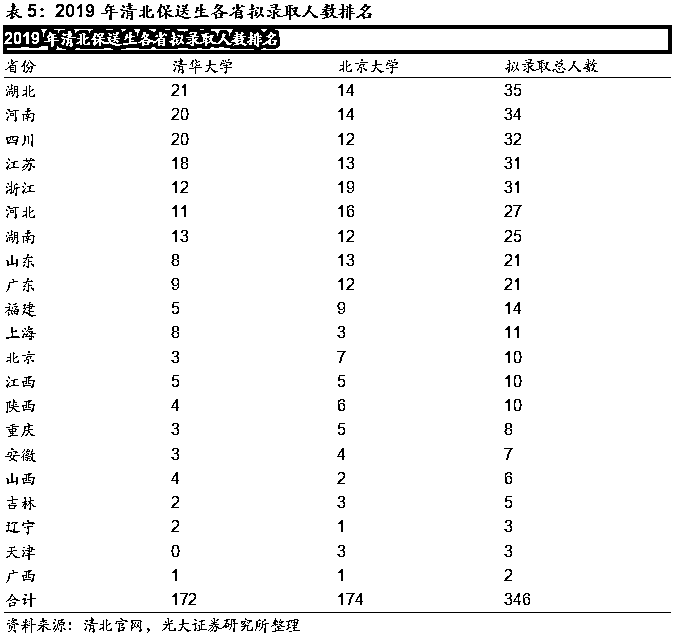

**2.3、自主招生**

自主招生是谋求按国内各个高校自主选拔优秀学生的政策，学生申请对应学校的高校自主招生简章即可。初审通过后参加学校的复试，根据复试成绩有不同的优惠政策，一般可获得 10-60 分不等的加分政策，最高可以优惠至考生高考当地的一本线。

近年来学科竞赛逐渐成为自主招生核心指标。高考自主招生比例逐渐扩大，2018 年全国有 90 所十点高校进行自主招生，报考自主招生的人数从 2016 年的 47 万人增长到 2018 年的 82 万人。学科竞赛因为更易量化成为核心指标。

**自主招生在高考录取中也变得越来越关键，2018 年全国享受清华北大各类录取降分政策的人数高达 6133 人，2018 年北大清华计划招生总人数为 6700 人，降分总人数占比高达 91.54%。**

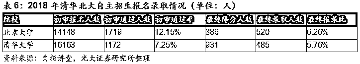

**2.4、“领军计划”、“博雅计划”**

即高考成绩结合校测面试的形式，清华的为“领军计划”、北大的为“博雅计划”。一般要求综合成绩在年级 1%以内，经过对应高校的选拔，如果合格可有降分录取，最高可达降至一本线录取的优惠政策。

清华领军计划采取先面试后体质测试的形式对报考的优秀学生进行考察，经认定的学生将享受高考总分最高降 60 分录取（特别优秀的学生可享受最高降至一本线的录取优惠），以及最高加 30 分的选专业优惠政策。该计划采取中学推荐的方式进行，根据各中学近年考入清华大学学生的质量、数量及在校综合表现确定具有推荐则个的中学名单和推荐人数。面试采取一名考生对三名考官的形式，面试全程大约 10 分钟。考官根据题库发文，考生回答后，考官还可能继续根据回答追问、交流。面试题目大多与时下热点结合紧密。

北大博雅计划分为初审和测试，根据考生报名材料将考生分为 A+ABC 四档，初审评价为“A+”的考生直接进入面试环节；初审评价结果为“A”和“B”的考生获得笔试、面试资格；初审评价结果为“C”的考生不再参加后续的选拔环节。获得测试资格的考生根据网上报名系统内的测试通知要求，参加北大组织的测试。

综上，目前的高考形势下，高等院校越来越重视综合评价、多元录取的招生政策，高等院校自主招生选拔比例也不断提升，在招生方面有了更多的自由。同时，各种招生政策也给了我们很多不同的选择，但是从以上选择都有一个基础就是需要在高中时期取得较好的成绩以及较好的高考成绩，才能进入清北特殊类型招生的视野。即使取得了自主招生的资格，也需要高考成绩达标。

**竞赛**

**得竞赛者得特招，得特招者得清北** 

**3.1、五大学科竞赛**

目前清华北大承认的是五大学科竞赛，即全国信息学奥林匹克竞赛、全国数学奥林匹克竞赛、全国中学生物理奥林匹克竞赛、全国高中生化学奥林匹克竞赛、全国中学生生物学奥林匹克竞赛等五个学科的竞赛。

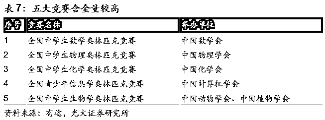

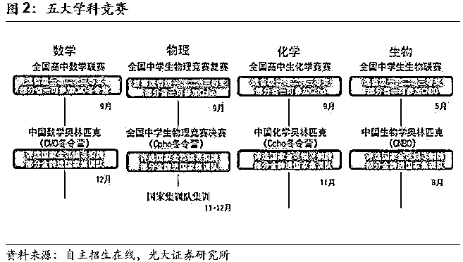

五大学科竞赛主要考四次，省级赛场两次，全国赛一次，国际赛一次(中国一般只有 4-6 个人可以参加)。

**1、省级初赛：**一般是以学校为单位自主报名参加，所有的考生都有资格参加。一般各市参加人数达到要求可在本市单独设有考场。考生可在本市考试即可。初赛会分一、二、三等奖，但是此奖项对于自主招生没有多大用处。

**2、省级复赛：**省级复赛是由各省竞委办统一组织举行。各省市所有考生到统一地点进行考试。复赛选手是从省初赛中选拔而出，不可单独报名参加。复赛结束后会确定各省省一、省二、省三的人员及人数。其中，省队选手是从省一中选拔而出。2019 年全国省一人数 1.2 万人，高考人数 1031 万人，省一获奖学生占高考总人数的 0.1%。

**3、全国决赛：**各省省队选手在规定的时间内参加学科全国性的比赛，一般称之为学科冬令营或者决赛。例如：2015 年第 32 届物理竞赛决赛是 10 月 31 日-11 月 5 日在湖南师范大学附属中学举行。此次决赛是各省市 31 个代表队共计 360 人参加。

决赛最终会确定出金银铜牌的人数及名单。国家会从金牌中选取 50-60 名考生作为集训队的选手，一般是最终成绩的前 50-60 名。集训队的考生具有保送资格，不需要参加高考。

**4、国际赛：**国际赛选手会从集训选手中挑选出 4-6 人到其他国家参加国际性的比赛。具体情况不加详述。

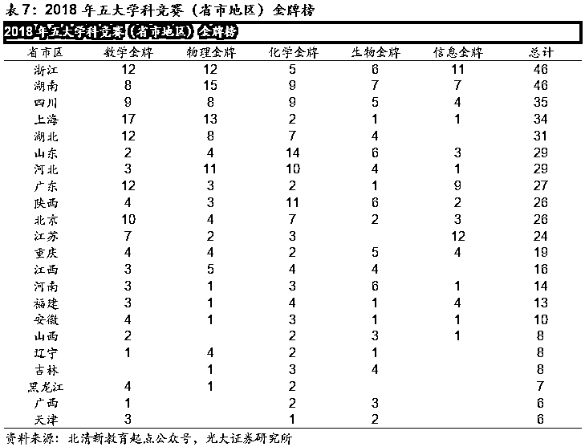

**3.2、通过竞赛进入清北的几种路径**

**高中阶段参加竞赛获奖可以拿到清北保送、签约、自招、综评等机会。**

**（一）保送录取**

根据教育部的要求，只有在五项学科竞赛中获得金牌并且入选国家集训队的队员，才有免高考的保送资格。绝大多数队员都选择保送了北大清华，且专业任选；但是全国仅有 250 个集训队名额。

**（二）签约录取**

**1、全国决赛营签约（进入决赛的省队选手）**

五大学科竞赛全国决赛指的是经过预选赛、复赛（联赛、国初）、省队考试三个选拔流程之后的赛事，每个科目全国都仅有 300 多位学生参加。清华北大会派出专人签约一些在决赛中表现优异的考生，清北一般会抢签决赛前 120 名的考生。

**2、清北六月体验营签约**

清华北大一般在 6 月份会举办面向信息省一（省队）、生物省一（省队）的体验营。

**3、清北暑期竞赛营签约（具备省一实力的高二学生）**

对于数学物理两个学科的竞赛具备省一实力的选手（高二升高三的暑假）而言，北大清华在暑假会组织数学暑期竞赛营和物理竞赛竞赛营。北大的暑期数学营叫数学科学夏令营，清华大学叫丘成桐中学生数学夏令营；北大的物理暑期竞赛营叫物理科学营，清华叫全国优秀中学生物理学夏令营。

**4、清北金秋竞赛营签约（已经获得省一或省队的高中生）**

对于数理化三个学科竞赛已经获得省一等奖的学生而言，每年的 10 月份北大清华都会针对这批学生组织一个金秋竞赛营。北大叫金秋营，清华叫体验营。

**5、北大冬令营竞赛签约**

北大在寒假左右时间会组织一个生命科学冬令营、化学寒假课堂。生命科学冬令营面向多科省一或者生物省队的选手。化学寒假课堂主要面向省一省二的高一高二学生。

**6、清北“飞签”之路（顶级高中的优秀竞赛生）**

“飞签”不经过高校组织的各类营，而由清北招生组老师空降至高中直接安排笔试面试，合适的直接签降分约。

**（三）自主招生**

清华北大每年自主招生的基本条件：北京大学（至少国决铜牌）、清华大学（至少国决铜牌）。

**（四）综合评价**

1、北大博雅（一般要有多科省奖的竞赛背景）；

2、清华领军（一般要有多科省奖的竞赛背景）。

**清北建议**

**一、 成绩：虽然条条大路通清北，但是扎实的成绩仍是关键。**

**二、 理科：小学阶段打好数学的底子，初中阶段打好数学、物理、化学的底子。**

**三、 竞赛：高中阶段在学有余力的情况下有必要参加一些竞赛。**

**四、 语文：新高考改革下，语文学科重要性突出，得语文者得天下。**

**在已实行新高考的试点省份中，语文已经成为拉分的最重要科目。**以浙江省 2017 年高考成绩为例，排名省前十名的学生必考科目数学、外语分数相差不大，两门必考科目和选考科目的平均分更是接近满分，但是语文的分数差距较大，总分最高的考生语文分数高达 132 分，为前十名考生中最高的，前十名考生的语文科目平均分为 123 分，语文已经成为了新高考模式下的拉分关键科目。

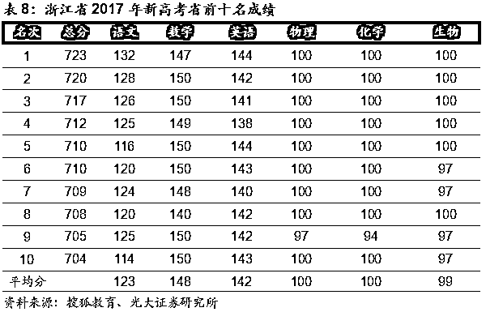

**你当年是如何考上清北的？**

请留言告诉全网用户！

*—End—*

量化投资与机器学习微信公众号，是业内垂直于**Quant**、**MFE**、**CST**等专业的主流量化自媒体。公众号拥有来自**公募、私募、券商、银行、海外**等众多圈内**10W+**关注者。每日发布行业前沿研究成果和最新资讯。

