# 如果你能回答封面的问题！

> 原文：[`mp.weixin.qq.com/s?__biz=MzAxNTc0Mjg0Mg==&mid=2653292635&idx=1&sn=3854a73b491b1bf45d0ccc832c6a879a&chksm=802dca4eb75a4358bf76d421f048114d4f1a501c51bfe29e2f35173643c7418e8c5e03661910&scene=27#wechat_redirect`](http://mp.weixin.qq.com/s?__biz=MzAxNTc0Mjg0Mg==&mid=2653292635&idx=1&sn=3854a73b491b1bf45d0ccc832c6a879a&chksm=802dca4eb75a4358bf76d421f048114d4f1a501c51bfe29e2f35173643c7418e8c5e03661910&scene=27#wechat_redirect)

**标星★公众号     **爱你们♥

**近期原创文章：**

## ♥ [5 种机器学习算法在预测股价的应用（代码+数据）](https://mp.weixin.qq.com/s?__biz=MzAxNTc0Mjg0Mg==&mid=2653290588&idx=1&sn=1d0409ad212ea8627e5d5cedf61953ac&chksm=802dc249b75a4b5fa245433320a4cc9da1a2cceb22df6fb1a28e5b94ff038319ae4e7ec6941f&token=1298662931&lang=zh_CN&scene=21#wechat_redirect)

## ♥ [Two Sigma 用新闻来预测股价走势，带你吊打 Kaggle](https://mp.weixin.qq.com/s?__biz=MzAxNTc0Mjg0Mg==&mid=2653290456&idx=1&sn=b8d2d8febc599742e43ea48e3c249323&chksm=802e3dcdb759b4db9279c689202101b6b154fb118a1c1be12b52e522e1a1d7944858dbd6637e&token=1330520237&lang=zh_CN&scene=21#wechat_redirect)

## ♥ [利用深度学习最新前沿预测股价走势](https://mp.weixin.qq.com/s?__biz=MzAxNTc0Mjg0Mg==&mid=2653290080&idx=1&sn=06c50cefe78a7b24c64c4fdb9739c7f3&chksm=802e3c75b759b563c01495d16a638a56ac7305fc324ee4917fd76c648f670b7f7276826bdaa8&token=770078636&lang=zh_CN&scene=21#wechat_redirect)

## ♥ [一位数据科学 PhD 眼中的算法交易](https://mp.weixin.qq.com/s?__biz=MzAxNTc0Mjg0Mg==&mid=2653290118&idx=1&sn=a261307470cf2f3e458ab4e7dc309179&chksm=802e3c93b759b585e079d3a797f512dfd0427ac02942339f4f1454bd368ba47be21cb52cf969&token=770078636&lang=zh_CN&scene=21#wechat_redirect)

## ♥ [基于 RNN 和 LSTM 的股市预测方法](https://mp.weixin.qq.com/s?__biz=MzAxNTc0Mjg0Mg==&mid=2653290481&idx=1&sn=f7360ea8554cc4f86fcc71315176b093&chksm=802e3de4b759b4f2235a0aeabb6e76b3e101ff09b9a2aa6fa67e6e824fc4274f68f4ae51af95&token=1865137106&lang=zh_CN&scene=21#wechat_redirect)

## ♥ [如何鉴别那些用深度学习预测股价的花哨模型？](https://mp.weixin.qq.com/s?__biz=MzAxNTc0Mjg0Mg==&mid=2653290132&idx=1&sn=cbf1e2a4526e6e9305a6110c17063f46&chksm=802e3c81b759b597d3dd94b8008e150c90087567904a29c0c4b58d7be220a9ece2008956d5db&token=1266110554&lang=zh_CN&scene=21#wechat_redirect)

## ♥ [优化强化学习 Q-learning 算法进行股市](https://mp.weixin.qq.com/s?__biz=MzAxNTc0Mjg0Mg==&mid=2653290286&idx=1&sn=882d39a18018733b93c8c8eac385b515&chksm=802e3d3bb759b42d1fc849f96bf02ae87edf2eab01b0beecd9340112c7fb06b95cb2246d2429&token=1330520237&lang=zh_CN&scene=21#wechat_redirect)

## ♥ [WorldQuant 101 Alpha、国泰君安 191 Alpha](https://mp.weixin.qq.com/s?__biz=MzAxNTc0Mjg0Mg==&mid=2653290927&idx=1&sn=ecca60811da74967f33a00329a1fe66a&chksm=802dc3bab75a4aac2bb4ccff7010063cc08ef51d0bf3d2f71621cdd6adece11f28133a242a15&token=48775331&lang=zh_CN&scene=21#wechat_redirect)

## ♥ [基于回声状态网络预测股票价格（附代码）](https://mp.weixin.qq.com/s?__biz=MzAxNTc0Mjg0Mg==&mid=2653291171&idx=1&sn=485a35e564b45046ff5a07c42bba1743&chksm=802dc0b6b75a49a07e5b91c512c8575104f777b39d0e1d71cf11881502209dc399fd6f641fb1&token=48775331&lang=zh_CN&scene=21#wechat_redirect)

## ♥ [AQR 最最最新 | 计量经济学应用投资失败的 7 个原因](https://mp.weixin.qq.com/s?__biz=MzAxNTc0Mjg0Mg==&mid=2653292186&idx=1&sn=87501434ae16f29afffec19a6884ee8d&chksm=802dc48fb75a4d99e0172bf484cdbf6aee86e36a95037847fd9f070cbe7144b4617c2d1b0644&token=48775331&lang=zh_CN&scene=21#wechat_redirect)

## ♥ [关于高盛在 Github 开源背后的真相！](https://mp.weixin.qq.com/s?__biz=MzAxNTc0Mjg0Mg==&mid=2653291594&idx=1&sn=7703403c5c537061994396e7e49e7ce5&chksm=802dc65fb75a4f49019cec951ac25d30ec7783738e9640ec108be95335597361c427258f5d5f&token=48775331&lang=zh_CN&scene=21#wechat_redirect)

## ♥ [新一代量化带货王诞生！Oh My God！](https://mp.weixin.qq.com/s?__biz=MzAxNTc0Mjg0Mg==&mid=2653291789&idx=1&sn=e31778d1b9372bc7aa6e57b82a69ec6e&chksm=802dc718b75a4e0ea4c022e70ea53f51c48d102ebf7e54993261619c36f24f3f9a5b63437e9e&token=48775331&lang=zh_CN&scene=21#wechat_redirect)

## ♥ [独家！关于定量/交易求职分享（附真实试题）](https://mp.weixin.qq.com/s?__biz=MzAxNTc0Mjg0Mg==&mid=2653291844&idx=1&sn=3fd8b57d32a0ebd43b17fa68ae954471&chksm=802dc751b75a4e4755fcbb0aa228355cebbbb6d34b292aa25b4f3fbd51013fcf7b17b91ddb71&token=48775331&lang=zh_CN&scene=21#wechat_redirect)

## ♥ [Quant 们的身份危机！](https://mp.weixin.qq.com/s?__biz=MzAxNTc0Mjg0Mg==&mid=2653291856&idx=1&sn=729b657ede2cb50c96e92193ab16102d&chksm=802dc745b75a4e53c5018cc1385214233ec4657a3479cd7193c95aaf65642f5f45fa0e465694&token=48775331&lang=zh_CN&scene=21#wechat_redirect)

## ♥ [拿起 Python，防御特朗普的 Twitter！](https://mp.weixin.qq.com/s?__biz=MzAxNTc0Mjg0Mg==&mid=2653291977&idx=1&sn=01f146e9a88bf130ca1b479573e6d158&chksm=802dc7dcb75a4ecadfdbdace877ed948f56b72bc160952fd1e4bcde27260f823c999a65a0d6d&token=48775331&lang=zh_CN&scene=21#wechat_redirect)

## ♥ [用深度强化学习打造不亏钱的交易机器人（附代码）](https://mp.weixin.qq.com/s?__biz=MzAxNTc0Mjg0Mg==&mid=2653292021&idx=1&sn=a9cbc37fd50d917df61728eee0a109db&chksm=802dc7e0b75a4ef6937f4e73bd561362d4baa6219e948fc5211e1071c50925cd69925fb1850e&token=48775331&lang=zh_CN&scene=21#wechat_redirect)

**那些被忽略的数学常数**

圆周率 Pi 在数学中无处不在：

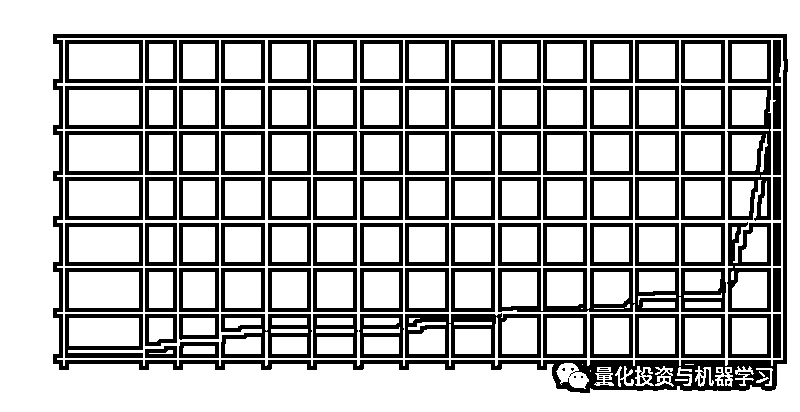

欧拉恒等式用 Pi 把 5 个最重要的数连在一起。海森堡测不准原理包含圆周率，它表明物体的位置和速度不能同时精确测量。在许多公式中 Pi 是一个正态常数，包括高斯/正态分布。Reimann zeta 函数取 2 时，收敛到一个因子 Pi。

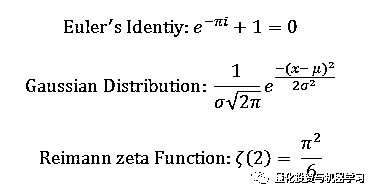

**但是，本推文将向那有时被遗忘、有时被忽视的数学常数致敬。它们和圆周率 Pi 一样深刻，一样迷人！**

**欧拉数：e**

# **欧拉数 e=2.71828...(Eulers Number)**

蓝色区域为 e 的积分范围：

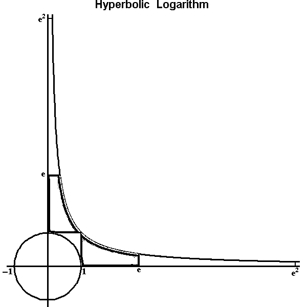

**e 是无理数**

欧拉借助连分式的形式证明了 e 是一个无理数，观察这个连分数的形式（最左侧）1,1,4,1,1,6,1,1,8,1,1,10.... 也就是说这种能够一直被处下去的连分数，那就意味着它是个无理数。

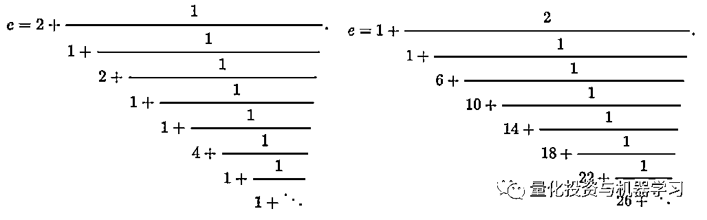

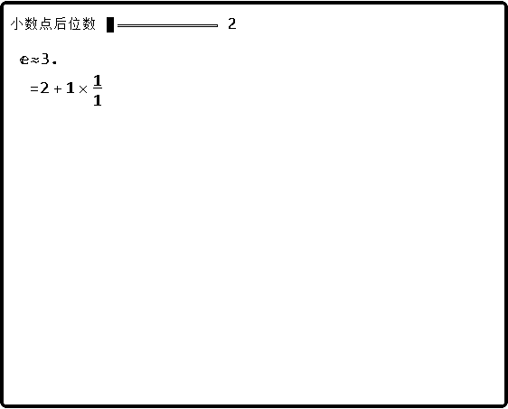

这种现实产生了一个有趣的过程，称为 spigot 算法，可以用来计算许多位数 e。下面有一个写好的 Python 代码对其进行实现，用于实现 e 的 spigot 算法：

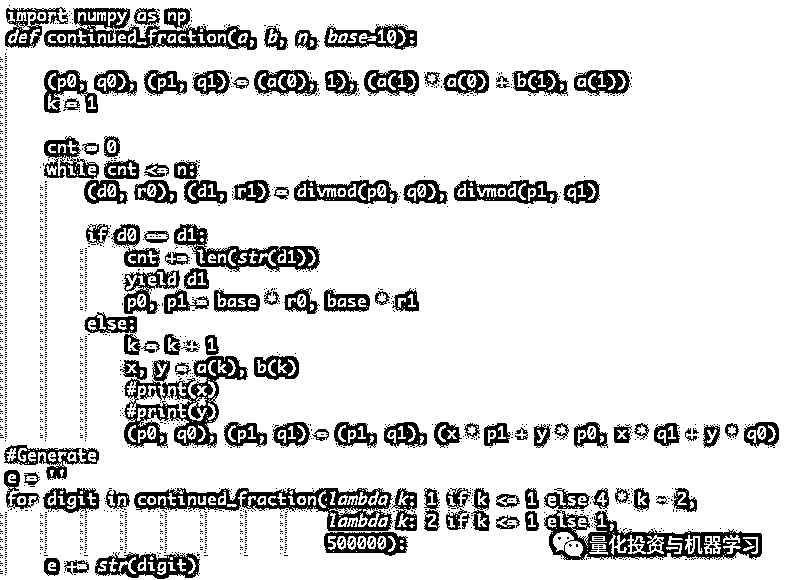

这是原代码的地址。我们做了一些修改：

*https://possiblywrong.wordpress.com/2017/09/30/digits-of-pi-and-python-generators/*

通过使用连分数在数字的两个分数估计值（p0/q0 和 p1/q1）之间迭代来实现的。当观察到这些分数的小数收敛时，可以剥离一致的数字（例如：23/27 = 0.315068 和 34/108 = 0.314815 可以剥离 0.31）。更有帮助的是，我们可以在去掉这些数字后重新设置分数的基数，并保持分数的分子/分母较小。

代码中的 lambda 函数示连分数的分子/分母。我们将数据存储为字符串，以便存储数千个数字。

2004 年 7 月，谷歌在硅谷的 101 号公路边竖立了一块巨大的广告牌（如下图）用于招聘。内容超级简单，就是一个以 .com 结尾的网址，而前面的网址是一个 10 位素数，这个素数是自然常数 e 中最早出现的 10 位连续数字。能找出这个素数的人，就可以通过访问谷歌的这个网站进入招聘流程的下一步。

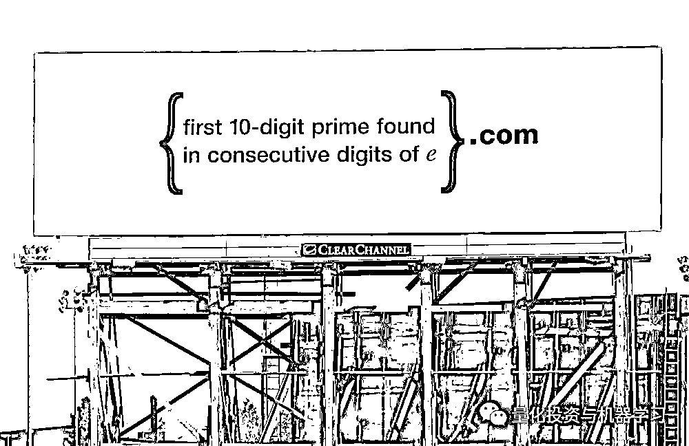

**哪位大神如果觉得自己有两把刷子****，可以把答案（任何语言编程）发送到公众号官方邮箱：**

***lhtzjqxx@163.com***

届时我们把您的回答全网进行展示。

**e 在微积分中性质**

e 描述增长率的自然常量, 并且还是唯一具有下面性质的函数：这个函数曲线上的每一个点的 y 值，在该点的斜率和面积都是相同的。x =1 时，函数值就等于 e。斜率也是 e，而曲线下的面积也是 e。

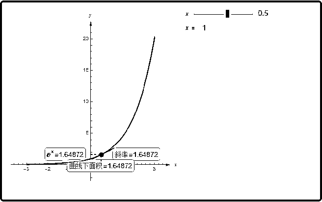

也正是因为这主要性质, 使得它成为了微积分的你最喜欢见到函数(微积分也正是描述变化率, 极限求和的数学). 所以当在微积分课程中, 凡是遇到 e 的计算, 计算会简单一些。

**最美的数学公式**

既然提到了 e，通常会提到将所有著名的常数出现在同一个方程 - 欧拉恒等式(Euler's identity)： 

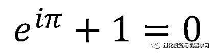

这个公式以一种极其简单的方式将数学上不同的分支联系起来，其中涵盖了数学中最重要的几个常数，堪称是最美的数学公式。

**质数**

**质数（prime number）又称素数，有无限个。**

质数定义为在大于 1 的自然数中，除了 1 和它本身以外不再有其他因数。

也就是说，质数是所有其他数的组成部分！这在几个方面是正确的: 

哥德巴赫猜说每个大于 2 的整数可以写成两个质数之和（例如 12 = 7 + 5）。一个令人信服的观点指出，随着数字的增长，构建两个这样的数字的机会越来越多：100，例如有 6 对（3 + 97，11 + 89，17 + 83，29 + 71，41 + 59，47 + 53）。下图通过散点图说明了这一点。

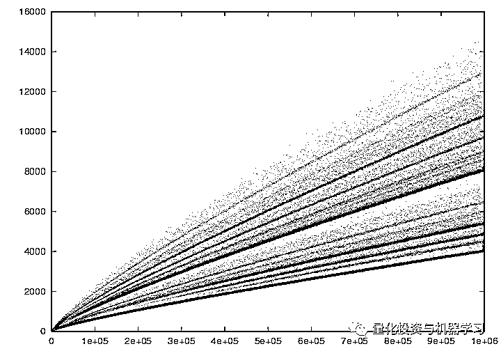

拉格朗日证明每一个正整数的和四个平方总和即

310 = 17²+ 4²+ 2²+ 1²

假设这个公式是这样的：

3 个数字在公式 x + 3y + 5z 中产生一个平方（例如 2+ 1 ** 4 + 4 ** 2 = 25，即 5²）。

另一个超级酷的事实是：蝉一生中的大部分时间都是在地下作为幼虫度过的，但在 7 年、13 年或 17 年后，它们会飞到地面，繁殖后代，几周后就会死去。生物学家假设质数繁殖周期的长度是一种进化策略，以防止捕食者与其繁殖周期同步。

质数有许多类，其中一类将在下面计算的常数中出现。**孪生素数**就是指相差 2 的素数对，例如 3 和 5，5 和 7，11 和 1。斐波纳契素数是一个素数，也是斐波那契数。一个 Mersenne 素数，有助于生成非常大的素数，遵循形式 2^n-1。

已知的最大质数有 2490 万位数，但没有生成质数的公式。许多算法是已知的，其中最容易理解的是埃拉托色尼筛选法(（The Sieve of Eratosthenes），简称埃氏筛法。该算法如下：

（1）先把 1 删除（现今数学界 1 既不是质数也不是合数）
（2）读取队列中当前最小的数 2，然后把 2 的倍数删去
（3）读取队列中当前最小的数 3，然后把 3 的倍数删去
（4）读取队列中当前最小的数 5，然后把 5 的倍数删去 

（5）如上所述直到需求的范围内所有的数均删除或读取

## **示例**

Apply sieve of Eratosthenes to find all primes in range 2..100.

### **Initial grid**

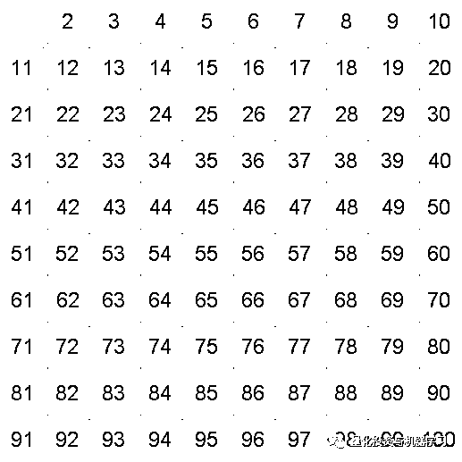

### **2 is prime, mark all multiples of 2, starting from 4**

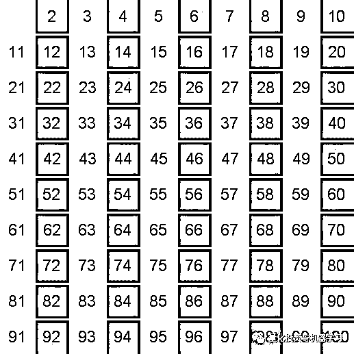

### **3 is prime, mark all multiples of 3, starting from 9**

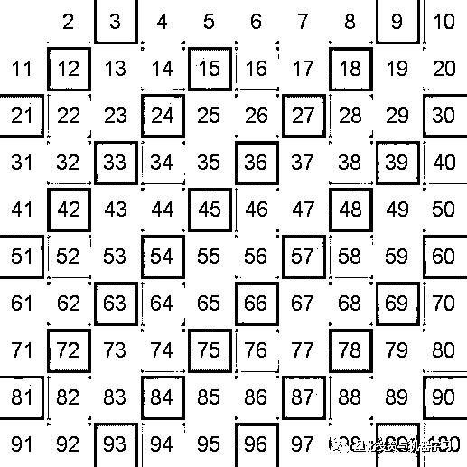

### **5 is prime, mark all multiples of 5, starting from 25**

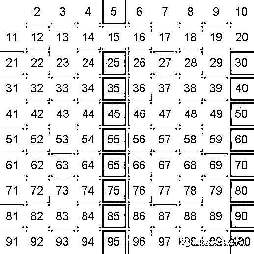

### **7 is prime, mark all multiples of 7, starting from 49**

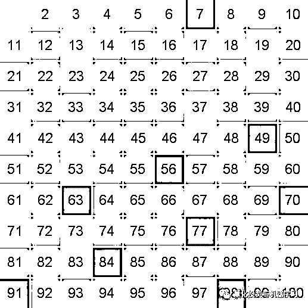

### **112 is more, than 100, all unmarked numbers are primes**

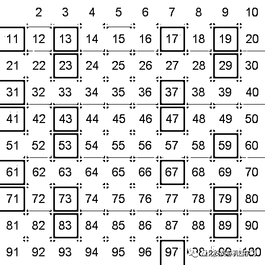

**最终结果**

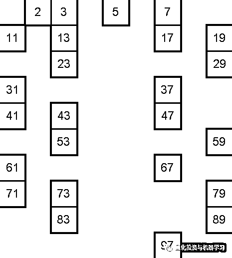

**Python 代码的实现 1**

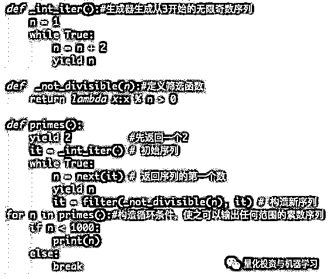

**Python 代码的实现 2**

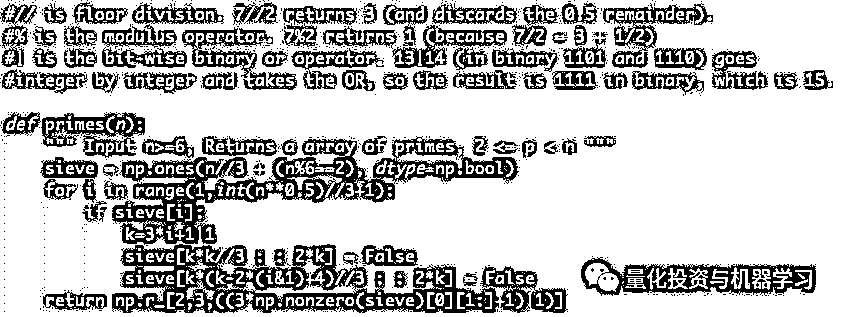

Eratosthenes 的正常筛子大约在多项式时间内运行，这意味着随着 n（你最大可能的素数）的增长，时间增长 n²（大约......）。 上面的算法通过使用两个不同和更复杂的公式来计算非素数列表来减少这种重复。

回到我们的 Google 广告牌。我们将 e_list 分割成 10 位数字，然后使用质数列表检查它们是否是质数。我们只需要检查 100000 因为没有 100000²是一个 11 位数字。

**Brun 和 Meissel-Mertens 常数**

素数出现在两个迷人的常数中，我们将在下面讨论。 

Brun 常数采用下面的形式：**所有素数对的倒数之和**

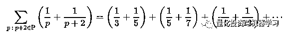

这个数字收敛极其缓慢，本身就很吸引人。这些分数的分母下降得很快——问题是即使对于非常大的数量，素数对也是相对常见的。事实上，Brun 常数是未知的。 据估计 ~ 1.902160583104 使用所有孪生质数¹⁶（即 10 万亿年），但仅证实小于 2.347。

回归谷歌：该公司在拍卖破产 Nortel corporation 的专利时，曾以 1,902,160,540 美元的价格拍得布鲁恩常数（Brun’s constant）。随后的出价 2,614,972,128 美元，这反映了 Meissel-Mertens 常数（约 0.26149 ......）。

Meissel-Mertens 常数也称为 Mertens 常数或质数倒数和常数，是数论中的一个常数，定义为只针对质数的调和级数和自然对数的自然对数二者差的极限：

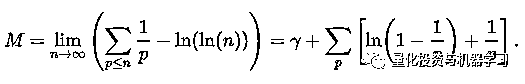

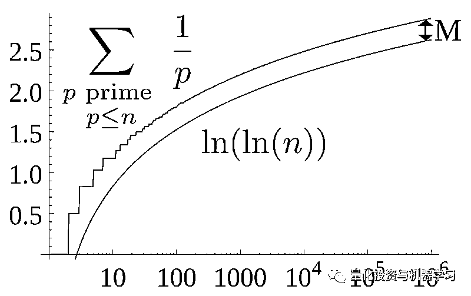

虽然这个数的收敛速度比 Brun 常数快得多，但它的确切值还是未知的。

**黄金比例和斐波那契数**

黄金比例是指将整体一分为二，较大部分与整体部分的比值等于较小部分与较大部分的比值，其比值约为 0.618。这个比例被公认为是最能引起美感的比例，因此被称为黄金比例。

2019 高考数学就出了这道题：

**题目（2019 年普通高等学校招生全国统一考试全国 I 卷理科数学）**

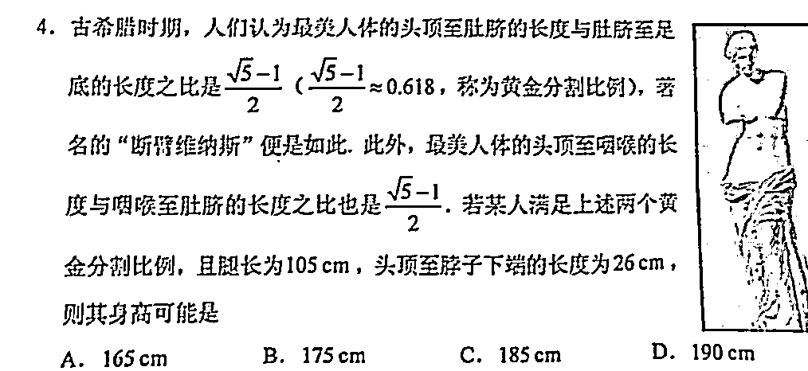

**各位不要看答案，自己知道怎么算吗？**

自欧几里得时代以来，黄金比例在几何学中占有重要地位，并具有多种几何表示。

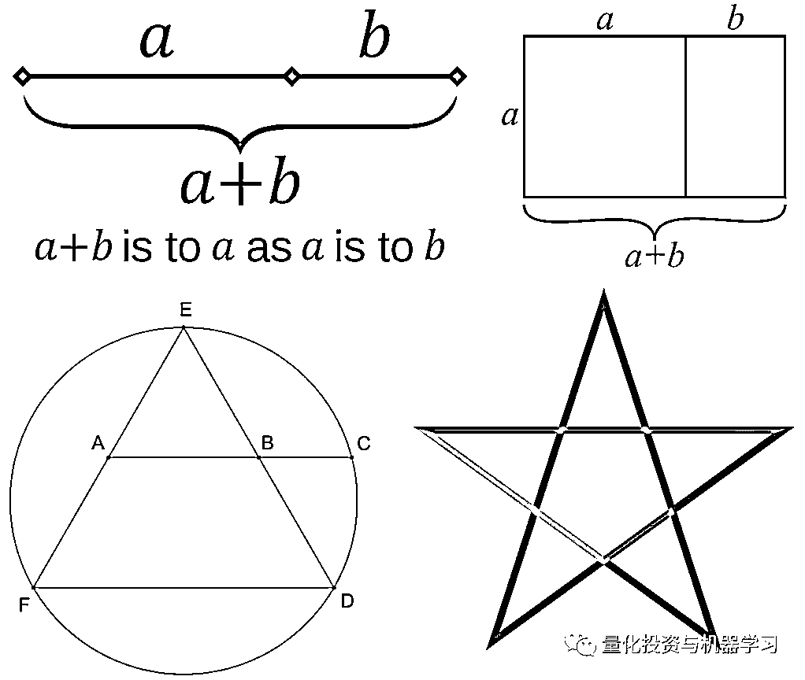

左：设 A 和 B 为等边三角形 DEF 边 EF 和边 ED 的中点，将 AB 延伸到 DEF 在 C 处的圆周上，AB/BC = AC/AB = 黄金比例。

右：五角星的颜色，用来区分不同长度的线段。这四个长度之间呈黄金比例。

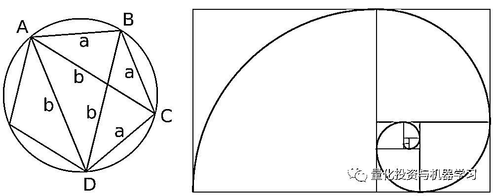

左：普通五边形的黄金比例可以用托勒密定理来计算。

右：一个接近黄金螺旋的斐波那契数列，使用斐波那契数列的平方，最大可达 34。螺旋从内 1×1 的正方形开始，向外依次画出较大的正方形。

斐波那契数，亦称之为斐波那契数列（意大利语： Successione di Fibonacci)，又称黄金分割数列、费波那西数列、费波拿契数、费氏数列，指的是这样一个数列：1、1、2、3、5、8、13、21、……在数学上，斐波那契数列以如下被以递归的方法定义：F0=0，F1=1，Fn=Fn-1+Fn-2（n>=2，n∈N*），用文字来说，就是斐波那契数列由 0 和 1 开始，之后的斐波那契数列系数就由之前的两数相加。

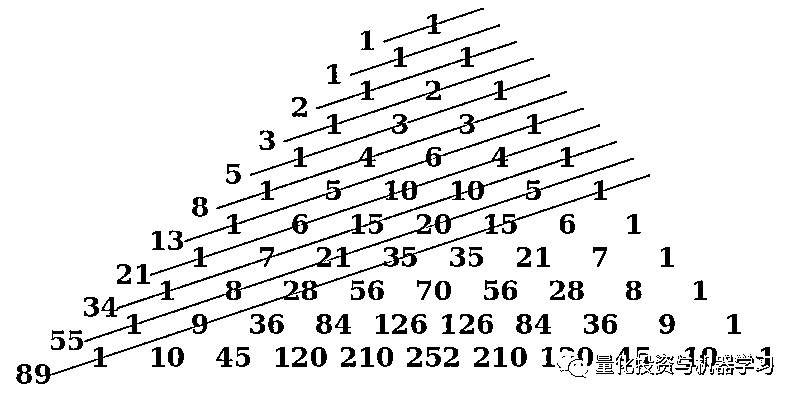

如上所述，当取连续的斐波那契数列的比值时，黄金分割比是收敛的。例如，89/55 = 1.61818，接近 1.61803 的真实值。黄金比例可以用无理数根 5 精确地定义。

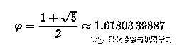

黄金分割比也可以表示为连分数，所以我们可以使用上面的或 e- generate algorithm 来生成黄金分割比的数字。

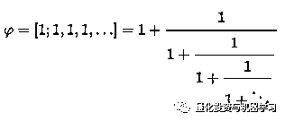

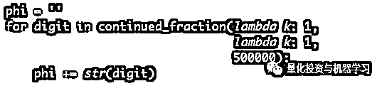

你将注意到，与 e 代码相比，运行上面的代码需要一段时间。500,000 要求算法返回 500k 个数字，而不考虑需要多少次连续分式迭代。黄金比率连分数收敛缓慢，这是有道理的：分母上的数字越大，重复出现的加法分数越小。

**数学是奇妙的，是美的。**

**公众号全体成员热爱着数学！**

*—End—*

量化投资与机器学习微信公众号，是业内垂直于**Quant**、**MFE**、**CST**等专业的主流量化自媒体。公众号拥有来自**公募、私募、券商、银行、海外**等众多圈内**10W+**关注者。每日发布行业前沿研究成果和最新资讯。

