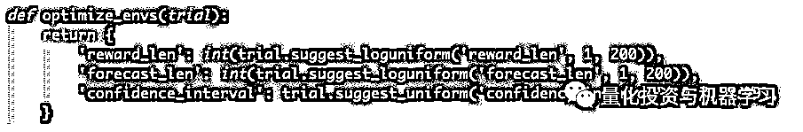

# 比特币：使用深度强化学习和贝叶斯优化获得巨额利润（附代码）

> 原文：[`mp.weixin.qq.com/s?__biz=MzAxNTc0Mjg0Mg==&mid=2653292562&idx=1&sn=2c1fcf6183661356daeb8eb20051e5c1&chksm=802dca07b75a4311db6b9c1d7a4ea09ed8e35886e9edb5056353d6460a382fb9d5fa21eed3c5&scene=27#wechat_redirect`](http://mp.weixin.qq.com/s?__biz=MzAxNTc0Mjg0Mg==&mid=2653292562&idx=1&sn=2c1fcf6183661356daeb8eb20051e5c1&chksm=802dca07b75a4311db6b9c1d7a4ea09ed8e35886e9edb5056353d6460a382fb9d5fa21eed3c5&scene=27#wechat_redirect)

**标星★公众号     **爱你们♥

作者：Adam King

编译：公众号海外部

**近期原创文章：**

## ♥ [5 种机器学习算法在预测股价的应用（代码+数据）](https://mp.weixin.qq.com/s?__biz=MzAxNTc0Mjg0Mg==&mid=2653290588&idx=1&sn=1d0409ad212ea8627e5d5cedf61953ac&chksm=802dc249b75a4b5fa245433320a4cc9da1a2cceb22df6fb1a28e5b94ff038319ae4e7ec6941f&token=1298662931&lang=zh_CN&scene=21#wechat_redirect)

## ♥ [Two Sigma 用新闻来预测股价走势，带你吊打 Kaggle](https://mp.weixin.qq.com/s?__biz=MzAxNTc0Mjg0Mg==&mid=2653290456&idx=1&sn=b8d2d8febc599742e43ea48e3c249323&chksm=802e3dcdb759b4db9279c689202101b6b154fb118a1c1be12b52e522e1a1d7944858dbd6637e&token=1330520237&lang=zh_CN&scene=21#wechat_redirect)

## ♥ [利用深度学习最新前沿预测股价走势](https://mp.weixin.qq.com/s?__biz=MzAxNTc0Mjg0Mg==&mid=2653290080&idx=1&sn=06c50cefe78a7b24c64c4fdb9739c7f3&chksm=802e3c75b759b563c01495d16a638a56ac7305fc324ee4917fd76c648f670b7f7276826bdaa8&token=770078636&lang=zh_CN&scene=21#wechat_redirect)

## ♥ [一位数据科学 PhD 眼中的算法交易](https://mp.weixin.qq.com/s?__biz=MzAxNTc0Mjg0Mg==&mid=2653290118&idx=1&sn=a261307470cf2f3e458ab4e7dc309179&chksm=802e3c93b759b585e079d3a797f512dfd0427ac02942339f4f1454bd368ba47be21cb52cf969&token=770078636&lang=zh_CN&scene=21#wechat_redirect)

## ♥ [基于 RNN 和 LSTM 的股市预测方法](https://mp.weixin.qq.com/s?__biz=MzAxNTc0Mjg0Mg==&mid=2653290481&idx=1&sn=f7360ea8554cc4f86fcc71315176b093&chksm=802e3de4b759b4f2235a0aeabb6e76b3e101ff09b9a2aa6fa67e6e824fc4274f68f4ae51af95&token=1865137106&lang=zh_CN&scene=21#wechat_redirect)

## ♥ [如何鉴别那些用深度学习预测股价的花哨模型？](https://mp.weixin.qq.com/s?__biz=MzAxNTc0Mjg0Mg==&mid=2653290132&idx=1&sn=cbf1e2a4526e6e9305a6110c17063f46&chksm=802e3c81b759b597d3dd94b8008e150c90087567904a29c0c4b58d7be220a9ece2008956d5db&token=1266110554&lang=zh_CN&scene=21#wechat_redirect)

## ♥ [优化强化学习 Q-learning 算法进行股市](https://mp.weixin.qq.com/s?__biz=MzAxNTc0Mjg0Mg==&mid=2653290286&idx=1&sn=882d39a18018733b93c8c8eac385b515&chksm=802e3d3bb759b42d1fc849f96bf02ae87edf2eab01b0beecd9340112c7fb06b95cb2246d2429&token=1330520237&lang=zh_CN&scene=21#wechat_redirect)

## ♥ [WorldQuant 101 Alpha、国泰君安 191 Alpha](https://mp.weixin.qq.com/s?__biz=MzAxNTc0Mjg0Mg==&mid=2653290927&idx=1&sn=ecca60811da74967f33a00329a1fe66a&chksm=802dc3bab75a4aac2bb4ccff7010063cc08ef51d0bf3d2f71621cdd6adece11f28133a242a15&token=48775331&lang=zh_CN&scene=21#wechat_redirect)

## ♥ [基于回声状态网络预测股票价格（附代码）](https://mp.weixin.qq.com/s?__biz=MzAxNTc0Mjg0Mg==&mid=2653291171&idx=1&sn=485a35e564b45046ff5a07c42bba1743&chksm=802dc0b6b75a49a07e5b91c512c8575104f777b39d0e1d71cf11881502209dc399fd6f641fb1&token=48775331&lang=zh_CN&scene=21#wechat_redirect)

## ♥ [AQR 最最最新 | 计量经济学应用投资失败的 7 个原因](https://mp.weixin.qq.com/s?__biz=MzAxNTc0Mjg0Mg==&mid=2653292186&idx=1&sn=87501434ae16f29afffec19a6884ee8d&chksm=802dc48fb75a4d99e0172bf484cdbf6aee86e36a95037847fd9f070cbe7144b4617c2d1b0644&token=48775331&lang=zh_CN&scene=21#wechat_redirect)

## ♥ [关于高盛在 Github 开源背后的真相！](https://mp.weixin.qq.com/s?__biz=MzAxNTc0Mjg0Mg==&mid=2653291594&idx=1&sn=7703403c5c537061994396e7e49e7ce5&chksm=802dc65fb75a4f49019cec951ac25d30ec7783738e9640ec108be95335597361c427258f5d5f&token=48775331&lang=zh_CN&scene=21#wechat_redirect)

## ♥ [新一代量化带货王诞生！Oh My God！](https://mp.weixin.qq.com/s?__biz=MzAxNTc0Mjg0Mg==&mid=2653291789&idx=1&sn=e31778d1b9372bc7aa6e57b82a69ec6e&chksm=802dc718b75a4e0ea4c022e70ea53f51c48d102ebf7e54993261619c36f24f3f9a5b63437e9e&token=48775331&lang=zh_CN&scene=21#wechat_redirect)

## ♥ [独家！关于定量/交易求职分享（附真实试题）](https://mp.weixin.qq.com/s?__biz=MzAxNTc0Mjg0Mg==&mid=2653291844&idx=1&sn=3fd8b57d32a0ebd43b17fa68ae954471&chksm=802dc751b75a4e4755fcbb0aa228355cebbbb6d34b292aa25b4f3fbd51013fcf7b17b91ddb71&token=48775331&lang=zh_CN&scene=21#wechat_redirect)

## ♥ [Quant 们的身份危机！](https://mp.weixin.qq.com/s?__biz=MzAxNTc0Mjg0Mg==&mid=2653291856&idx=1&sn=729b657ede2cb50c96e92193ab16102d&chksm=802dc745b75a4e53c5018cc1385214233ec4657a3479cd7193c95aaf65642f5f45fa0e465694&token=48775331&lang=zh_CN&scene=21#wechat_redirect)

## ♥ [拿起 Python，防御特朗普的 Twitter！](https://mp.weixin.qq.com/s?__biz=MzAxNTc0Mjg0Mg==&mid=2653291977&idx=1&sn=01f146e9a88bf130ca1b479573e6d158&chksm=802dc7dcb75a4ecadfdbdace877ed948f56b72bc160952fd1e4bcde27260f823c999a65a0d6d&token=48775331&lang=zh_CN&scene=21#wechat_redirect)

## ♥ [用深度强化学习打造不亏钱的交易机器人（附代码）](https://mp.weixin.qq.com/s?__biz=MzAxNTc0Mjg0Mg==&mid=2653292021&idx=1&sn=a9cbc37fd50d917df61728eee0a109db&chksm=802dc7e0b75a4ef6937f4e73bd561362d4baa6219e948fc5211e1071c50925cd69925fb1850e&token=48775331&lang=zh_CN&scene=21#wechat_redirect)

**获取全部代码，见文末**

在上一篇文章中：

[**用深度强化学习打造不亏钱的交易机器人（附代码）**](http://mp.weixin.qq.com/s?__biz=MzAxNTc0Mjg0Mg==&mid=2653292021&idx=1&sn=a9cbc37fd50d917df61728eee0a109db&chksm=802dc7e0b75a4ef6937f4e73bd561362d4baa6219e948fc5211e1071c50925cd69925fb1850e&scene=21#wechat_redirect)

我们使用深度强化学习来创建不会赔钱的比特币交易机器人。虽然 agent 是盈利的，但结果并没有那么令人满意，所以这次我们要更进一步，大幅提高模型的盈利能力。我们将首先改进我们的模型并设计一些更好的特征供我们的 agent 学习，然后我们将使用贝叶斯优化法来定位最有利可图的超参数。简而言之：

**贝叶斯优化是一种高效搜索超空间的方法，它可以找到使给定目标函数最大化的一组参数。**

简单地说，贝叶斯优化是一种改进任何黑箱模型的有效方法。它通过使用 agent 函数或 agent 函数的分布对对要优化的目标函数进行建模。随着时间的推移，这种分布会得到改善，因为算法会在产生最大价值的区域中探索超空间和区域。

上面的算法如何适用于我们的比特币交易机器人？本质上，我们可以使用这种方法来找到一组超参数，使我们的模型最有利可图。

**好比我们在大海捞针，贝叶斯优化就是我们的磁铁。**让我们开始吧！

**修改**

在优化超参数之前，我们要做的第一件事是对上一篇文章中编写的代码做一些改进。**最新修改代码文末获取。**

**递归网络**

我们需要做的第一个改变是更新我们的策略，**使用 LSTM 网络来代替我们之前的多层感知器（MLP）网络**。由于递归网络能够随着时间的推移保持内部状态，我们不再需要一个滑动的“look-back”窗口来捕捉价格的运动。相反，它本质上是由网络的递归特性捕获的。在每个时间步长，数据集的输入和最后一个时间步长的输出都被传递到算法中。

这允许 LSTM 维护一个内部状态，当 agent“记住”和“忘记”特定的数据关系时，该状态在每次执行步骤时更新。

图片来自：

*https://adventuresinmachinelearning.com/recurrent-neural-networks-lstm-tutorial-tensorflow/*

**数据平稳性**

上一篇文章也向我指出，我们的数据非平稳的，因此，任何机器学习模型都很难预测未来的值。最重要的是，我们的时间序列包含明显的趋势和季节性，这两个因素都会影响我们算法准确预测时间序列的能力。我们可以通过使用差分和变换方法从现有的时间序列中得到一个更加正态分布来解决这个问题。 

差分可以消除趋势，但是数据仍然具有明显的季节性。我们可以试着通过在差分前的每个时间步上取对数来去除它，这样操作，我们可以得到平稳的时间序列，如下图所示。

我们可以通过增广迪基-福勒检验（Augmented Dickey-Fuller test）简称 ADF 检验，来验证产生的时间序列是否平稳。这样做得到 p 值 0，允许我们拒绝原假设，并确认时间序列是平稳的。

**特征工程**

为了进一步改进我们的模型，我们将做一些特征工程。

特征工程是使用领域特定的知识来创建额外的输入数据，从而改进机器学习模型的过程。

在我们的示例中，我们将向数据集以及 StatsModels SARIMAX 预测模型的输出添加一些常见但有洞察力的技术指标。 这些特征功能组合应该为我们的模型提供有用的观察结果，以便我们学习。

*https://www.statsmodels.org/dev/generated/statsmodels.tsa.statespace.sarimax.SARIMAX.html*

**技术分析**

为了选择我们的技术指标集，我们将比较 ta 中所有 32 个指标（58 个特征）的相关性。我们可以使用 pandas 来找出同一类型各个指标之间的相关性（动量、成交量、趋势、波动性），然后从每个类型中选择相关性最小的指标作为特征。从而不会给我们的观测空间增加太多的噪音。

***https://github.com/bukosabino/ta***

BTC 数据集技术指标相关性图

事实证明，波动性指标都是高度相关的，还有一些动量指标。当我们删除所有重复的特征（在它们组中具有绝对平均相关性> 0.5 的特征）时，我们只剩下 38 个技术特征可以添加到我们的观察空间中。这是完美的，因此我们将创建一个名为 add_indicators 的方法来将这些特征添加到我们的数据框中，并在环境的初始化中调用它，以避免在每个时间步上计算这些值。

**统计分析**

接下来，我们需要添加预测模型。我们选择使用季节性自回归综合移动平均（SARIMA）模型来提供价格预测，因为它可以在我们的数据集上非常快的计算出每一步。它实现起来很简单，允许我们创建一个置信区间对其未来进行预测，这通常比单个值更具洞察力。例如，我们的 agent 可以学会在置信区间较小的时候更加谨慎地信任预测，在置信区间较大的时候承担更多的风险。

现在我们已经更新了我们的策略，使用一个更适用的、递归的网络，并通过上下文特征工程改进了我们的观察空间，是时候优化所有的东西了。

**奖励优化**

有人可能认为我们从上一篇文章中得到的奖励功能（即奖励增加的净资产收益）是我们能做的最好的事情，然而，进一步的研究表明这远非事实。虽然我们上次的简单奖励功能能够盈利，但它产生的不稳定策略往往导致资本的严重损失。为了改进这一点，我们将需要考虑其他指标来奖励，而不仅仅是未实现的利润。 

对这一策略的一个简单改进不仅在 BTC 股价上涨时奖励其持有 BTC 的利润，而且在 BTC 股价下跌时奖励其不持有 BTC 的利润。例如，我们可以奖励 agent 在持有 BTC/USD 头寸时净资产的任何增量增长，以及在不持有任何头寸时 BTC/USD 的增量下降。

虽然这种策略在奖励增加回报方面非常出色，但它没有考虑到产生这些高回报的风险。

**Volatility-Based 指标**

最常见的风险调整回报率指标是**夏普比率**。要保持较高的夏普比率，投资必须同时具有高回报和低波动性（即风险）。计算方法如下:

该指标经受住了时间的考验，但就我们的目的而言，它也有缺陷，因为它惩罚了上行波动。对于比特币来说，这可能是有问题的，因为上行波动（剧烈的价格上行运动）往往是相当有利可图的。这就引出了我们将与我们的 agent 一起测试的第一个奖励指标。

**Sortino 比率**与夏普比率非常相似，只是它只将下行波动视为风险，而不是整体波动。因此，这一比率不会对上行波动造成不利影响：

**其他指标**

我们将在这个数据集上测试的第二个奖励指标是 Calmar 比率。到目前为止，我们的所有指标都没有考虑到缩减。亏损是衡量一个投资组合从峰值到低谷具体价值损失的指标。大规模减持可能不利于成功的交易策略，因为长期的高回报可能很快被突然的大幅减持逆转。

为鼓励积极防止大规模资本削减的策略，我们可以使用一个奖励指标，专门解释这些资本损失，比如**Calmar 比率**。这个比率与夏普比率相同，不同之处在于它使用了最大的下降量来代替投资组合价值的标准差。

最后一个度量标准，在对冲基金行业被大量使用，从理论上讲，**Omega 比率**在衡量风险与回报之间的关系上应该优于 Sortino 和 Calmar 比率，因为它能够在一个单一的指标中反映出整个风险高于回报的分布。要找到它，我们需要计算一个投资组合高于或低于特定基准的概率分布，然后取二者之比。比率越高，上行潜力超过下行潜力的可能性就越大。

**代码**

虽然为这些奖励指标编写代码听起来很有趣，但我们选择使用**empyrical**库来计算它们。幸运的是，这个库恰好包含了我们在上面定义的三个奖励指标。

***https://github.com/quantopian/empyrical***

既然我们已经决定了如何衡量一个成功的交易策略，现在是时候找出这些指标中哪一个能产生最吸引人的结果了。**让我们将这些奖励函数中的每一个都插入 Optuna 中，并使用贝叶斯优化来为我们的数据集找到最佳策略。**

**工具库**

任何优秀的技术人员都需要优秀的工具集。我们不是重新发明轮子，而是要利用我们前辈们的总结。对于今天的工作，我们最重要的工具将是**O****ptuna 库**，它使用树结构 Parzen Estimators （TPEs）实现贝叶斯优化。TPEs 是并行的，这让我们可以利用我们的 GPU，大大减少了我们的整体搜索时间。

***https://papers.nips.cc/paper/4443-algorithms-for-hyper-parameter-optimization.pdf***

**Optuna**

使用 Optuna 优化超参数相当简单。首先，我们需要创建一个 Optuna study，它是所有超参数试验的父容器。一项试验包含超参数的特定配置及其由目标函数产生的成本。然后我们可以调用 study. optimization()并传递我们的目标函数，Optuna 将使用贝叶斯优化来找到产生最低成本的超参数的配置。

在这种情况下，我们的目标函数包括在比特币交易环境中训练和测试我们的 PPO2 模型。我们从函数中返回的成本是测试期间的平均回报，为负数。我们需要否定平均回报，因为 Optuna 把低回报解释为更好的试验。优化函数为我们的目标函数提供了一个试验对象，然后我们使用该对象指定要优化的每个变量。

optimize_ppo2()和 optimize_envs()方法方法接受试验对象并返回要测试的参数字典。每个变量的搜索空间由我们在试验中调用的特定 suggest 函数以及传递给该函数的参数定义。

*https://optuna.readthedocs.io/en/stable/tutorial/configurations.html#defining-parameter-spaces*

例如，trial.suggest_loguniform('n_steps',16,2048)将以对数方式建议 16 - 2048 之间的新浮点数(16,32,64，…，1024,2048)。此外，trial.suggest_uniform('cliprange',0.1,0.4)将以一种简单的添加方式(0.1,0.2,0.3,0.4)suggest 浮点数。这里我们不使用它，但 Optuna 还提供了一种 suggest 分类变量的方法：suggest_categorical('categorical'， 'option_one'， ' option_two'))。

稍后，在使用合适的 CPU/GPU 组合在运行优化函数之后，我们可以从告诉 Optuna 创建的 sqlite 数据库加载研究。该研究从测试中跟踪最佳试验，我们可以使用这些测试为我们的环境获取最佳的超参数集。

我们已经修改了我们的模型，改进了我们的特征集，并优化了我们所有的超参数。现在是时候看看我们的 agent 如何使用他们的新奖励机制了。我们训练了一个 agents 来优化四个回报指标：简单利润、Sortino 比率、Calmar 比率和 Omega 比率。让我们在一个测试环境中运行这些优化的 agent 程序，这个测试环境使用未经训练的价格数据初始化，并查看它们是否有利可图。

**回测**

在我们看结果之前，我们需要知道一个成功的交易策略是什么样的。我们将以几个常见但有效的比特币盈利交易策略作为基准。信不信由你，**在过去的十年里，BTC 最有效的交易策略之一就是简单的****买入并持有**。我们将测试的另外两种策略使用非常简单但有效的技术分析来创建买进和卖出信号。

1、买入并持有策略

这样做的目的是尽可能多地买进股票。虽然这一战略并不特别复杂，但它过去的成功率很高。

2、RSI 策略

当 RSI 继续下跌，连续的收盘价继续上涨时，一个负的趋势反转（卖出）信号就出现了。当 RSI 连续上涨而收盘价连续下跌时，就发出了正趋势逆转（买入）的信号。 

3、简单均线（SMA）策略

当长期移动平均线高于短期移动平均线时，一个负的趋势逆转（卖出）信号就出现了。当短期移动平均线高于长期移动平均线时，一个积极的趋势逆转（买入）信号就出现了。

**测试这些的目的是证明我们的深度强化学习 agent 实际上正在市场上创建 alpha。**

**如果我们不能超越这些简单的基准测试，那么我们就浪费了无数的开发时间和 GPU，只是为了做一个很酷的科学项目。**

**没意思~没意思~**

**让我们来证明不是这样的。**

**结果**

首先，我们有了 Omega 策略，它最终对我们的数据集毫无用处。

基于 omega 平均净资产超过 3500 小时的交易

观察这种 agent 交易，很明显，这种奖励机制产生了过度交易的策略，无法利用市场机会。基于 Calmar 的策略比基于 Omegat 的策略有一个小的改进，但最终非常相似。看起来我们已经投入了大量的时间和精力，只是为了让事情变得更糟……

然后是基于 old friend 的策略，简单的增量利润。虽然在我们的上一篇文章中没有证明这种奖励机制非常成功，但是我们所做的所有修改和优化似乎都极大地提高了 agent 的成功。在四个月的测试期内，平均利润仅略高于初始账户余额的 350%。如果你不知道平均市场回报率，这种结果绝对是疯狂的。当然，这是我们能做的最好的强化学习?

Sortino，OG，抢尽风头。基于 Sortino 比率的**平均利润接近 850%**。当我们看到这些策略的成功时，必须快速检查以确保没有错误。经**过彻底的检查，很明显代码是没有 bug 的，这些 agent 真的非常擅长交易比特币。**

这些 agents 似乎明白了低买高卖的重要性，同时将持有比特币的风险降至最低，而不是过度交易和资本不足。如果你们不相信，自己看吧：

注意 agent 是如何在价格大幅上涨之前买进（绿色三角形）一堆，然后在价格上涨时卖出（红色三角形）的。agents 似乎已经明白，应该尽早获利，不要在交易中陷得太久。不管这些 agent 学会了什么具体策略，我们的交易机器人显然已经学会了如何有利可图地交易比特币。

这些测试的成功可能并不适用于实时交易。尽管如此，**这些结果远比我们迄今所见的任何算法交易策略都令人印象深刻。考虑到这些 agents 事先没有获得如何盈利的交易知识，而是学会了通过反复试验获得巨大成功，通过大量的反复试验得来的！这确实令人惊讶。**

**结论**

在本文中，我们优化了我们的比特币交易深度强化学习 agent，以便做出更好的决策，这花了不少功夫，但我们做到了以下几点： 

1、升级我们现有的模型，使用具有平稳数据的周期性 LSTM 策略网络

2、为我们的 agent 设计了 40 多个新特征，以学习使用领域特定的技术和统计分析。

3、为了考虑风险改进 agents 的奖励制度，而不仅仅是利润。

4、利用贝叶斯优化对模型的超参数进行了微调。

5、以共同交易策略为基准，以确保我们总是能击败市场。

**理论上，一个高利润的交易机器人很棒。然而，我收到了相当多的反馈，称这些 agent 只是在学习适应曲线，因此，在实时数据上进行交易永远不会有利可图。虽然我们对单独数据集的训练/测试方法应该解决这个问题，但是我们的模型确实可能对这个数据集过度拟合，并且可能不能很好地推广到新数据。话虽如此，我们感觉这些 agents 学到的不仅仅是简单的曲线拟合，因此，他们能够在真实的交易环境中获利。**

**如何获取代码**

在**后台**输入（严格大小写）

***Bitcoin-RL***

*—End—*

量化投资与机器学习微信公众号，是业内垂直于**Quant**、**MFE**、**CST**等专业的主流量化自媒体。公众号拥有来自**公募、私募、券商、银行、海外**等众多圈内**10W+**关注者。每日发布行业前沿研究成果和最新资讯。

