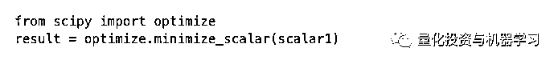

# 机器学习核心：优化问题基于 Scipy

> 原文：[`mp.weixin.qq.com/s?__biz=MzAxNTc0Mjg0Mg==&mid=2653292519&idx=1&sn=5f8083ad2eff460a86833e9ad131c2da&chksm=802dc5f2b75a4ce4de33b86b344a7da866a64610115fbe69f21da72deba60f5d35c4ae76c796&scene=27#wechat_redirect`](http://mp.weixin.qq.com/s?__biz=MzAxNTc0Mjg0Mg==&mid=2653292519&idx=1&sn=5f8083ad2eff460a86833e9ad131c2da&chksm=802dc5f2b75a4ce4de33b86b344a7da866a64610115fbe69f21da72deba60f5d35c4ae76c796&scene=27#wechat_redirect)

**标星★公众号     **爱你们♥

作者：Tirthajyoti Sarkar

编译：公众号编译部

**近期原创文章：**

## ♥ [5 种机器学习算法在预测股价的应用（代码+数据）](https://mp.weixin.qq.com/s?__biz=MzAxNTc0Mjg0Mg==&mid=2653290588&idx=1&sn=1d0409ad212ea8627e5d5cedf61953ac&chksm=802dc249b75a4b5fa245433320a4cc9da1a2cceb22df6fb1a28e5b94ff038319ae4e7ec6941f&token=1298662931&lang=zh_CN&scene=21#wechat_redirect)

## ♥ [Two Sigma 用新闻来预测股价走势，带你吊打 Kaggle](https://mp.weixin.qq.com/s?__biz=MzAxNTc0Mjg0Mg==&mid=2653290456&idx=1&sn=b8d2d8febc599742e43ea48e3c249323&chksm=802e3dcdb759b4db9279c689202101b6b154fb118a1c1be12b52e522e1a1d7944858dbd6637e&token=1330520237&lang=zh_CN&scene=21#wechat_redirect)

## ♥ [利用深度学习最新前沿预测股价走势](https://mp.weixin.qq.com/s?__biz=MzAxNTc0Mjg0Mg==&mid=2653290080&idx=1&sn=06c50cefe78a7b24c64c4fdb9739c7f3&chksm=802e3c75b759b563c01495d16a638a56ac7305fc324ee4917fd76c648f670b7f7276826bdaa8&token=770078636&lang=zh_CN&scene=21#wechat_redirect)

## ♥ [一位数据科学 PhD 眼中的算法交易](https://mp.weixin.qq.com/s?__biz=MzAxNTc0Mjg0Mg==&mid=2653290118&idx=1&sn=a261307470cf2f3e458ab4e7dc309179&chksm=802e3c93b759b585e079d3a797f512dfd0427ac02942339f4f1454bd368ba47be21cb52cf969&token=770078636&lang=zh_CN&scene=21#wechat_redirect)

## ♥ [基于 RNN 和 LSTM 的股市预测方法](https://mp.weixin.qq.com/s?__biz=MzAxNTc0Mjg0Mg==&mid=2653290481&idx=1&sn=f7360ea8554cc4f86fcc71315176b093&chksm=802e3de4b759b4f2235a0aeabb6e76b3e101ff09b9a2aa6fa67e6e824fc4274f68f4ae51af95&token=1865137106&lang=zh_CN&scene=21#wechat_redirect)

## ♥ [如何鉴别那些用深度学习预测股价的花哨模型？](https://mp.weixin.qq.com/s?__biz=MzAxNTc0Mjg0Mg==&mid=2653290132&idx=1&sn=cbf1e2a4526e6e9305a6110c17063f46&chksm=802e3c81b759b597d3dd94b8008e150c90087567904a29c0c4b58d7be220a9ece2008956d5db&token=1266110554&lang=zh_CN&scene=21#wechat_redirect)

## ♥ [优化强化学习 Q-learning 算法进行股市](https://mp.weixin.qq.com/s?__biz=MzAxNTc0Mjg0Mg==&mid=2653290286&idx=1&sn=882d39a18018733b93c8c8eac385b515&chksm=802e3d3bb759b42d1fc849f96bf02ae87edf2eab01b0beecd9340112c7fb06b95cb2246d2429&token=1330520237&lang=zh_CN&scene=21#wechat_redirect)

## ♥ [WorldQuant 101 Alpha、国泰君安 191 Alpha（源码分享）](https://mp.weixin.qq.com/s?__biz=MzAxNTc0Mjg0Mg==&mid=2653290927&idx=1&sn=ecca60811da74967f33a00329a1fe66a&chksm=802dc3bab75a4aac2bb4ccff7010063cc08ef51d0bf3d2f71621cdd6adece11f28133a242a15&token=48775331&lang=zh_CN&scene=21#wechat_redirect)

## ♥ [基于回声状态网络预测股票价格（附代码）](https://mp.weixin.qq.com/s?__biz=MzAxNTc0Mjg0Mg==&mid=2653291171&idx=1&sn=485a35e564b45046ff5a07c42bba1743&chksm=802dc0b6b75a49a07e5b91c512c8575104f777b39d0e1d71cf11881502209dc399fd6f641fb1&token=48775331&lang=zh_CN&scene=21#wechat_redirect)

## ♥ [AQR 最最最新 | 计量经济学应用投资失败的 7 个原因](https://mp.weixin.qq.com/s?__biz=MzAxNTc0Mjg0Mg==&mid=2653292186&idx=1&sn=87501434ae16f29afffec19a6884ee8d&chksm=802dc48fb75a4d99e0172bf484cdbf6aee86e36a95037847fd9f070cbe7144b4617c2d1b0644&token=48775331&lang=zh_CN&scene=21#wechat_redirect)

## ♥ [关于高盛在 Github 开源背后的真相！](https://mp.weixin.qq.com/s?__biz=MzAxNTc0Mjg0Mg==&mid=2653291594&idx=1&sn=7703403c5c537061994396e7e49e7ce5&chksm=802dc65fb75a4f49019cec951ac25d30ec7783738e9640ec108be95335597361c427258f5d5f&token=48775331&lang=zh_CN&scene=21#wechat_redirect)

## ♥ [新一代量化带货王诞生！Oh My God！](https://mp.weixin.qq.com/s?__biz=MzAxNTc0Mjg0Mg==&mid=2653291789&idx=1&sn=e31778d1b9372bc7aa6e57b82a69ec6e&chksm=802dc718b75a4e0ea4c022e70ea53f51c48d102ebf7e54993261619c36f24f3f9a5b63437e9e&token=48775331&lang=zh_CN&scene=21#wechat_redirect)

## ♥ [独家！关于定量/交易求职分享（附真实试题）](https://mp.weixin.qq.com/s?__biz=MzAxNTc0Mjg0Mg==&mid=2653291844&idx=1&sn=3fd8b57d32a0ebd43b17fa68ae954471&chksm=802dc751b75a4e4755fcbb0aa228355cebbbb6d34b292aa25b4f3fbd51013fcf7b17b91ddb71&token=48775331&lang=zh_CN&scene=21#wechat_redirect)

## ♥ [Quant 们的身份危机！](https://mp.weixin.qq.com/s?__biz=MzAxNTc0Mjg0Mg==&mid=2653291856&idx=1&sn=729b657ede2cb50c96e92193ab16102d&chksm=802dc745b75a4e53c5018cc1385214233ec4657a3479cd7193c95aaf65642f5f45fa0e465694&token=48775331&lang=zh_CN&scene=21#wechat_redirect)

## ♥ [拿起 Python，防御特朗普的 Twitter！](https://mp.weixin.qq.com/s?__biz=MzAxNTc0Mjg0Mg==&mid=2653291977&idx=1&sn=01f146e9a88bf130ca1b479573e6d158&chksm=802dc7dcb75a4ecadfdbdace877ed948f56b72bc160952fd1e4bcde27260f823c999a65a0d6d&token=48775331&lang=zh_CN&scene=21#wechat_redirect)

## ♥ [用深度强化学习打造不亏钱的交易机器人（附代码）](https://mp.weixin.qq.com/s?__biz=MzAxNTc0Mjg0Mg==&mid=2653292021&idx=1&sn=a9cbc37fd50d917df61728eee0a109db&chksm=802dc7e0b75a4ef6937f4e73bd561362d4baa6219e948fc5211e1071c50925cd69925fb1850e&token=48775331&lang=zh_CN&scene=21#wechat_redirect)

**获取全部代码，见文末**

**介绍**

你可能还记得高中时的一个简单的微积分问题——在给定盒子体积的情况下，求出构建盒子所需的最小材料量。

仔细看看上面的问题。约束是一个固定的体积。将其视为业务可交付物（即对客户的承诺）。 

但问题的目标是找到所需的最小材料（就表面积而言）。这与生产者的利润率有关（需要的材料越少，相同销售价格的生产成本越低，因此利润率越高）。

数学优化是解决工程、金融、医疗保健和社会经济事务中的主要业务问题的核心。几乎所有的业务问题都归结为某种资源成本的最小化或给定其他约束条件下某种利润的最大化。

优化过程也是运筹学的灵魂，运筹学与现代数据驱动的业务分析密切相关。它也与数据科学密切相关，如今几乎所有企业都在使用数据科学。

尽管已经有很多关于数据科学项目预测建模方面的文章，**但最终的前沿领域通常涉及使用数据驱动模型解决优化问题，这些模型可以通过降低成本或提高生产力来提高业务的基线。**

除了纯粹的业务驱动外，优化问题本身也值得研究，因为它是所有机器学习算法的核心，从简单的线性回归一直到深度神经网络。理解优化问题的各种算法和公式，可以为有效地解决机器学习问题并提供有价值的见解。

因此，对于数据科学家来说，学习基本的工具和框架来解决优化问题是非常必要的。

**SciPy 与优化**

Python 已经成为分析、数据科学和机器学习的通用语言。因此，讨论 Python 生态系统中的优化包和框架是十分有意义的。 

Python 中有一些功能强大的包，如 PuLP 和 CVXPY。

*   ***https://pythonhosted.org/PuLP/***

*   ***https://www.cvxpy.org/***

在本文中，我们将介绍 SciPy 生态系统中可用的优化算法。SciPy 是用于科学和数学分析最广泛的 Python 工具包，因此它拥有强大但易于使用的优化程序来解决复杂问题。

**首先**

我们从一个简单的标量函数（一个变量）最小化示例开始。假设，我们想最小化下面这个函数，它在 x = -10 到 x = 10 之间。函数如下所示。在函数域中，它有全局最小值和局部最小值。

定义函数的代码是：

使用 SciPy 确定全局最小值的代码非常简单。在这种情况下，我们可以使用 minimize_scalar 函数。

优化已经完成了！我们可以打印结果来获得更多有用的信息。

达到最小值的值存储在 result['x']变量中。

Rest 数量产生关于函数评估数、迭代次数、解决方案的状态（成功与否）和最终解决方案的函数值的信息。

**如果变量是有界的呢?**

上面的代码实现了所谓的无约束/无界优化，即没有对问题施加任何限制。然而，大多数实际的优化问题都涉及复杂的约束。一个简单的例子是关于自变量(x)的。 

我们可以看出，这个函数的特征是两个极小值，如果只考虑 x 的正值，结果会有所不同。

因此，我们必须传递带有合适包含最小和最大边界的元组边界参数，并使用 method='Bounded'参数。

**引入其他约束**

我们可以在这个问题中有其他复杂的约束条件。假设，我们希望满足以下条件，同时达到求全局最小值的目标。

注意，其中一个是不等式，另一个是等式约束。 

**将约束作为函数放入字典中**

SciPy 允许通过更通用的优化方法来处理任意约束。约束必须按照特定的语法在 Python 字典中编写。不等式约束需要分解为 f(x) < 0 形式的单个不等式。下面的代码演示了这个想法。

**选择合适的方法**

然后，我们可以通过选择一个合适的支持约束的方法来运行优化（并不是最小化函数中的所有方法都支持约束和边界）。这里我们选择了 SLSQP 方法，它代表序列最小二乘二次规划。

**初步猜测和第一次试运行**

此外，为了使用最小化，我们需要传递一个 x0 参数形式的初始猜测。假设，我们传递 x0=0 作为一个测试运行。

打印结果，我们会看到一些不同于简单的无约束优化结果。

优化参数成功：False 表示没有成功达到全局最小值。信息是“迭代限制超出”，也就是说，它尝试了 101 次迭代，但是没有达到最小值。

但是，为什么？

答案在于数学优化（以及相关算法）的深层理论，但可以肯定的是，最初的猜测发挥了很大的作用。一般来说，非凸优化问题没有成功求解的数学保证，其本质是非凸的。

**我们如何改进优化（搜索）？**

一般情况下，我们做不了什么。但是，在这个例子中，我们已经有了函数的图，并且可以找出最优解。因此，我们可以给算法一个更好的初始猜测。我们给 x0=2。

结果：

**那么迭代的次数呢？**

如果我们限制算法执行的迭代次数呢？仅为了展示目的，我们严格限制迭代次数为 3 次。

正如预期的那样，结果并不令人满意。

请注意，优化接近全局最小值，但没有完全达到它——当然，由于不允许迭代足够多的次数。

**为什么要考虑这个问题？**

这是因为每次迭代都等同于计算成本（有时不是计算成本，而是实际的物理成本）。

这是优化过程的业务方面。在现实生活中，如果单个函数的评估耗费大量资源，我们可能无法长时间运行优化。

当优化不涉及简单的数学评估，而是涉及复杂、耗时的仿真或成本和劳动密集型实验时，就会出现这种情况。

当每次评估都要花费金钱或资源时，不仅要考虑算法的选择，还要考虑更精细的细节。

**多元函数**

虽然我们在前几节中考虑了解决标准优化问题的所有基本问题，但是这个例子由一个简单的单变量分析函数组成。 

但事实并非如此！

SciPy 方法适用于任何 Python 函数，不一定是一个封闭的、一维的数学函数。

让我们展示一个多值函数的例子。

**高斯混合函数的最大化**

通常在化工或制造过程中，多个随机子过程结合在一起产生高斯混合。通过在各个子流程中选择最优操作点（在一定的流程限制内），可能希望最大限度地提高最终的流程输出结果。

诀窍是使用向量作为目标函数的输入，并确保目标函数仍然返回单个标量值。此外，由于这里的优化问题是关于目标函数的最大化，我们需要改变符号，返回目标函数的高斯函数和的负数。

相同的结果['x']将各个过程的最佳设置存储为向量。 这是优化单值函数和多元函数之间的唯一区别是我们得到一个向量而不是一个标量。

**有界输入**

我们可以改变这里的边界来反映实际的约束条件。例如，如果子流程设置只能占用一定范围的值（一些值必须为正，一些值必须为负，等等），那么解决方案将略有不同——它可能不是全局最优。

解决方案如下。这是命令将第三个子进程设置推到最大可能值（0），同时适当调整其他两个子进程。

多变量优化的约束以类似的方式处理，如单变量情况所示。

SLSQP 并不是 SciPy 生态系统中唯一能够处理复杂优化任务的算法。

更多参考：

*   ***https://docs.scipy.org/doc/scipy/reference/optimize.html#module-scipy.optimize*** 

*   ***https://www.tutorialspoint.com/scipy/scipy_optimize.htm***

*   ***https://people.duke.edu/~ccc14/sta-663/BlackBoxOptimization.html***

**将该过程扩展到机器学习领域**

只要你能够定义一个适当的目标函数，生成一个标量值，以及与实际问题场景匹配的适当边界和约束，那么你就可以推动这种方法到更复杂的问题中。 

**机器学习中的误差最小化**

几乎所有机器学习算法的关键都是定义一个合适的误差函数，对数据进行迭代，并找到使总误差最小的机器学习模型参数的最优设置。通常，误差是模型预测与真实值之间某种距离的度量。

因此，完全可以使用 SciPy 优化例程来解决 ML 问题。

这让你深入了解算法的实际工作，因为你必须自己构建损失度量，而不是依赖于一些现成的开箱即用的函数。

**机器学习中的超参数优化**

优化机器学习模型的参数和超参数常常是一项繁琐且容易出错的任务。虽然有一些网格搜索方法可以用来搜索最佳参数组合，但是通过在参数空间上运行优化循环可以很容易地引入一定程度的自动化。在本文中，目标函数必须是机器学习模型预测的某种度量（例如均方误差、复杂性度量或 F1 分数）。

**使用机器学习作为功能评估器**

在许多情况下，你不可能有一个完美的，封闭式的分析函数来作为优化问题的目标。

想象一下一个优化模型的威力，它由许多模型提供（其目标函数和约束条件）——这些模型在本质上不同，但在输出格式方面标准化，以便它们能够一致行动。

**你可以自由地选择分析函数、深度学习网络（可能作为回归模型），甚至是复杂的模拟模型，并将它们全部放入优化的坑中。**

可能性是无限的！

*来源：*

*https://towardsdatascience.com/optimization-with-scipy-and-application-ideas-to-machine-learning-81d39c7938b8*

**如何获取代码**

在**后台**输入（严格大小写）

***Optimization_LHTZ***

*—End—*

量化投资与机器学习微信公众号，是业内垂直于**Quant**、**MFE**、**CST**等专业的主流量化自媒体。公众号拥有来自**公募、私募、券商、银行、海外**等众多圈内**10W+**关注者。每日发布行业前沿研究成果和最新资讯。

