# 数学、乐高积木、神经网络产生怎样的花火？超超超赞！

> 原文：[`mp.weixin.qq.com/s?__biz=MzAxNTc0Mjg0Mg==&mid=2653292478&idx=1&sn=273cc39bf027c9acd11f4d46b7b73085&chksm=802dc5abb75a4cbd19c8b2ecd0cceac6a8de8b58c48dc946f8c6e5af45cdfafe34dfd6155bc3&scene=27#wechat_redirect`](http://mp.weixin.qq.com/s?__biz=MzAxNTc0Mjg0Mg==&mid=2653292478&idx=1&sn=273cc39bf027c9acd11f4d46b7b73085&chksm=802dc5abb75a4cbd19c8b2ecd0cceac6a8de8b58c48dc946f8c6e5af45cdfafe34dfd6155bc3&scene=27#wechat_redirect)

**标星★公众号     **爱你们♥

作者：Omar U. Florez

编译：公众号编译部

**近期原创文章：**

## ♥ [5 种机器学习算法在预测股价的应用（代码+数据）](https://mp.weixin.qq.com/s?__biz=MzAxNTc0Mjg0Mg==&mid=2653290588&idx=1&sn=1d0409ad212ea8627e5d5cedf61953ac&chksm=802dc249b75a4b5fa245433320a4cc9da1a2cceb22df6fb1a28e5b94ff038319ae4e7ec6941f&token=1298662931&lang=zh_CN&scene=21#wechat_redirect)

## ♥ [Two Sigma 用新闻来预测股价走势，带你吊打 Kaggle](https://mp.weixin.qq.com/s?__biz=MzAxNTc0Mjg0Mg==&mid=2653290456&idx=1&sn=b8d2d8febc599742e43ea48e3c249323&chksm=802e3dcdb759b4db9279c689202101b6b154fb118a1c1be12b52e522e1a1d7944858dbd6637e&token=1330520237&lang=zh_CN&scene=21#wechat_redirect)

## ♥ [利用深度学习最新前沿预测股价走势](https://mp.weixin.qq.com/s?__biz=MzAxNTc0Mjg0Mg==&mid=2653290080&idx=1&sn=06c50cefe78a7b24c64c4fdb9739c7f3&chksm=802e3c75b759b563c01495d16a638a56ac7305fc324ee4917fd76c648f670b7f7276826bdaa8&token=770078636&lang=zh_CN&scene=21#wechat_redirect)

## ♥ [一位数据科学 PhD 眼中的算法交易](https://mp.weixin.qq.com/s?__biz=MzAxNTc0Mjg0Mg==&mid=2653290118&idx=1&sn=a261307470cf2f3e458ab4e7dc309179&chksm=802e3c93b759b585e079d3a797f512dfd0427ac02942339f4f1454bd368ba47be21cb52cf969&token=770078636&lang=zh_CN&scene=21#wechat_redirect)

## ♥ [基于 RNN 和 LSTM 的股市预测方法](https://mp.weixin.qq.com/s?__biz=MzAxNTc0Mjg0Mg==&mid=2653290481&idx=1&sn=f7360ea8554cc4f86fcc71315176b093&chksm=802e3de4b759b4f2235a0aeabb6e76b3e101ff09b9a2aa6fa67e6e824fc4274f68f4ae51af95&token=1865137106&lang=zh_CN&scene=21#wechat_redirect)

## ♥ [如何鉴别那些用深度学习预测股价的花哨模型？](https://mp.weixin.qq.com/s?__biz=MzAxNTc0Mjg0Mg==&mid=2653290132&idx=1&sn=cbf1e2a4526e6e9305a6110c17063f46&chksm=802e3c81b759b597d3dd94b8008e150c90087567904a29c0c4b58d7be220a9ece2008956d5db&token=1266110554&lang=zh_CN&scene=21#wechat_redirect)

## ♥ [优化强化学习 Q-learning 算法进行股市](https://mp.weixin.qq.com/s?__biz=MzAxNTc0Mjg0Mg==&mid=2653290286&idx=1&sn=882d39a18018733b93c8c8eac385b515&chksm=802e3d3bb759b42d1fc849f96bf02ae87edf2eab01b0beecd9340112c7fb06b95cb2246d2429&token=1330520237&lang=zh_CN&scene=21#wechat_redirect)

## ♥ [WorldQuant 101 Alpha、国泰君安 191 Alpha（源码分享）](https://mp.weixin.qq.com/s?__biz=MzAxNTc0Mjg0Mg==&mid=2653290927&idx=1&sn=ecca60811da74967f33a00329a1fe66a&chksm=802dc3bab75a4aac2bb4ccff7010063cc08ef51d0bf3d2f71621cdd6adece11f28133a242a15&token=48775331&lang=zh_CN&scene=21#wechat_redirect)

## ♥ [基于回声状态网络预测股票价格（附代码）](https://mp.weixin.qq.com/s?__biz=MzAxNTc0Mjg0Mg==&mid=2653291171&idx=1&sn=485a35e564b45046ff5a07c42bba1743&chksm=802dc0b6b75a49a07e5b91c512c8575104f777b39d0e1d71cf11881502209dc399fd6f641fb1&token=48775331&lang=zh_CN&scene=21#wechat_redirect)

## ♥ [AQR 最最最新 | 计量经济学应用投资失败的 7 个原因](https://mp.weixin.qq.com/s?__biz=MzAxNTc0Mjg0Mg==&mid=2653292186&idx=1&sn=87501434ae16f29afffec19a6884ee8d&chksm=802dc48fb75a4d99e0172bf484cdbf6aee86e36a95037847fd9f070cbe7144b4617c2d1b0644&token=48775331&lang=zh_CN&scene=21#wechat_redirect)

## ♥ [关于高盛在 Github 开源背后的真相！](https://mp.weixin.qq.com/s?__biz=MzAxNTc0Mjg0Mg==&mid=2653291594&idx=1&sn=7703403c5c537061994396e7e49e7ce5&chksm=802dc65fb75a4f49019cec951ac25d30ec7783738e9640ec108be95335597361c427258f5d5f&token=48775331&lang=zh_CN&scene=21#wechat_redirect)

## ♥ [新一代量化带货王诞生！Oh My God！](https://mp.weixin.qq.com/s?__biz=MzAxNTc0Mjg0Mg==&mid=2653291789&idx=1&sn=e31778d1b9372bc7aa6e57b82a69ec6e&chksm=802dc718b75a4e0ea4c022e70ea53f51c48d102ebf7e54993261619c36f24f3f9a5b63437e9e&token=48775331&lang=zh_CN&scene=21#wechat_redirect)

## ♥ [独家！关于定量/交易求职分享（附真实试题）](https://mp.weixin.qq.com/s?__biz=MzAxNTc0Mjg0Mg==&mid=2653291844&idx=1&sn=3fd8b57d32a0ebd43b17fa68ae954471&chksm=802dc751b75a4e4755fcbb0aa228355cebbbb6d34b292aa25b4f3fbd51013fcf7b17b91ddb71&token=48775331&lang=zh_CN&scene=21#wechat_redirect)

## ♥ [Quant 们的身份危机！](https://mp.weixin.qq.com/s?__biz=MzAxNTc0Mjg0Mg==&mid=2653291856&idx=1&sn=729b657ede2cb50c96e92193ab16102d&chksm=802dc745b75a4e53c5018cc1385214233ec4657a3479cd7193c95aaf65642f5f45fa0e465694&token=48775331&lang=zh_CN&scene=21#wechat_redirect)

## ♥ [拿起 Python，防御特朗普的 Twitter！](https://mp.weixin.qq.com/s?__biz=MzAxNTc0Mjg0Mg==&mid=2653291977&idx=1&sn=01f146e9a88bf130ca1b479573e6d158&chksm=802dc7dcb75a4ecadfdbdace877ed948f56b72bc160952fd1e4bcde27260f823c999a65a0d6d&token=48775331&lang=zh_CN&scene=21#wechat_redirect)

## ♥ [用深度强化学习打造不亏钱的交易机器人（附代码）](https://mp.weixin.qq.com/s?__biz=MzAxNTc0Mjg0Mg==&mid=2653292021&idx=1&sn=a9cbc37fd50d917df61728eee0a109db&chksm=802dc7e0b75a4ef6937f4e73bd561362d4baa6219e948fc5211e1071c50925cd69925fb1850e&token=48775331&lang=zh_CN&scene=21#wechat_redirect)

想必大家都玩过乐高吧？

好玩不？

好玩！

接下来

有更好玩的

**↓ ↓ ↓**

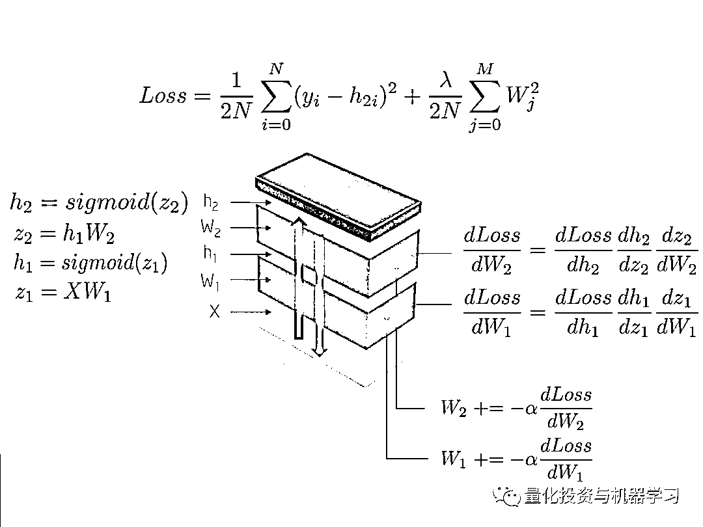

**用乐高积木结合数学来解释神经网络**

好玩不？

来，小哥哥，小姐姐

**我们教你玩！**

**文档+代码文末获取**

**前言**

神经网络是线性和非线性模块的巧妙组合。当我们明智地选择并连接它们时，我们就有了一个强大的工具来近似任何数学函数。例如，用非线性决策边界分离类的方法。

让我们从头开始构建一个神经网络，看看神经网络的内部功能，使用乐高积木块作为模块类比，每次一块积木。

**神经网络作为一个组成部分**

上图描述了一些用于训练神经网络的数学。在本文中，我们将对此进行解释。读者可能会发现，神经网络是一堆具有不同用途的模块：

**输入 X：**向神经网络提供原始数据，原始数据存储在一个矩阵中，其中观察值为行，维度为列。

**权值 W1：**将输入 X 映射到第一个隐藏层 h1。权值 W1 是线性核函数

**Sigmoid 函数：**通过将隐藏层中的数字缩放到 0-1。结果是一系列神经激活 h1 = Sigmoid(WX)

这些操作仅计算一般线性系统，该系统不具有模拟非线性交互的能力。当我们再叠加一层时，情况就不同了，这就给这个模块结构增加了深度。网络越深，我们可以学到更微妙的非线性相互作用，我们可以解决更复杂的问题，这可能部分解释了深层神经模型的兴起。

**举例：学习 XOR 函数**

让我们打开黑匣子。现在我们将从头构建一个学习 XOR 函数的神经网络。这个非线性函数的选择绝不是随机的。如果没有反向传播，就很难学会用直线分隔类。 

为了说明这个重要的概念，请注意下面一条直线是如何不能将 XOR 函数的输出 0 和 1 分开的。现实生活中的问题也是非线性可分的。

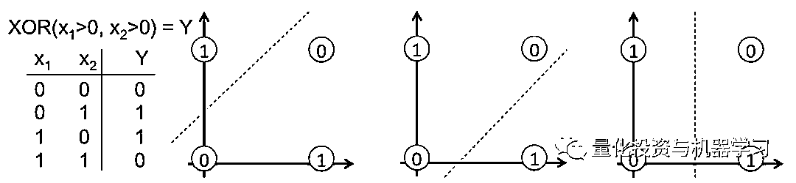

网络拓扑结构很简单：

1、输入 X 是一个二维向量；

2、权值 W1 是一个具有随机初始化值的 2x3 矩阵；

3、隐藏层 h1 由三个神经元组成。每个神经元接受一个加权的观测值作为输入，这是下图中绿色高亮显示的内积：z1 = [x1, x2][w1, w2]；

4、权值 W2 是一个具有随机初始化值和的 3x2 矩阵；

5、输出层 h2 由两个神经元组成，因为 XOR 函数返回 0 (y1=[0,1])或 1 (y2 =[1,0])

更直观的展示：

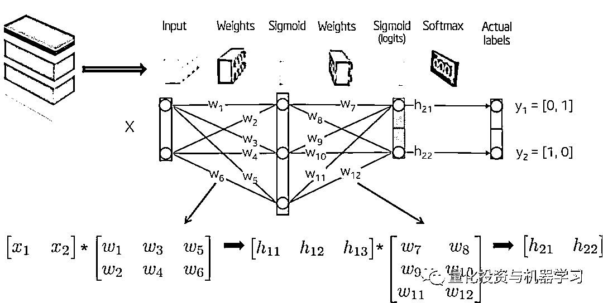

现在我们来训练模型。在我们的简单示例中，可训练的参数是权重，但请注意，目前的研究正在探索更多类型的参数进行优化。例如层之间的快捷方式、正则化分布、拓扑结构、残差、学习率等。

反向传播是一种向（梯度）方向更新权值的方法，它在给定一批标记的观测值的情况下最小化预定义的误差度量（称为损失函数）。这种算法已经被多次重新发现，它是一种更通用的技术的特例，这种技术称为逆向累加模式下的自动微分。

**网络初始化**

让我们用随机数初始化网络权重。

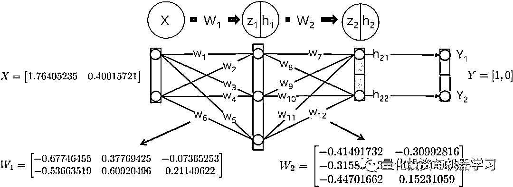

**向前一步**

这一步的目标是将输入 X 向前传播到网络的每一层，直到计算输出层 h2 中的向量为止。 

事情是这样发生的：

以权值 W1 为核，线性映射输入数据 X：

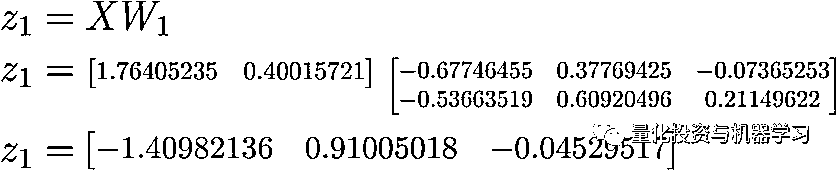

使用 Sigmoid 函数缩放该加权和 z1，以获得第一个隐藏层 h1 的值。注意，原来的 2D 向量现在映射到 3D 空间。

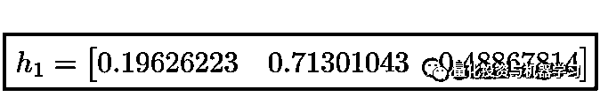

第二层 h2 也发生了类似的过程。我们先计算第一个隐层的加权和 z2，它现在是输入数据。

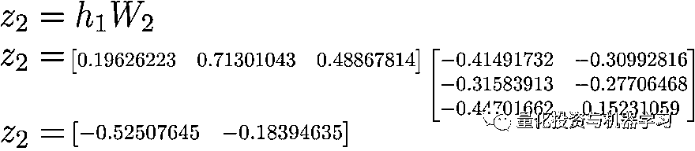

然后计算它们的 Sigmoid 活函数。该向量[0.37166596 0.45414264]表示由给定输入 X 的网络计算的对数概率或预测向量。

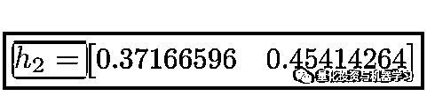

**计算总损失**

损失函数的目标是量化预测向量 h2 与 y 提供的实际标号之间的距离，也称为“实际减去预测值”。 

请注意，Loss 函数包含一个正则化组件，该组件惩罚较大的权重值，就像在 Ridge 回归中一样。换句话说，较大的平方权重值将增加损失函数，这是我们确实想要最小化的误差度量。

**向后一步**

该步骤的目标是更新神经网络的权值，使其损失函数最小化。我们将看到，这是一个递归算法，它可以重用以前计算的梯度，并且严重依赖于可微函数。由于这些更新减少了损失函数，网络“学会”用已知类近似观察值的标签。称为泛化的属性。

这个步骤的顺序是向后的，而不是向前的。首先计算损失函数对输出层（dLoss / dW2）和隐藏层（dLoss / dW1）的权重的偏导数。让我们详细解释每一个。

**dLoss/ DW2：**

链式法则说我们可以把神经网络的梯度计算分解成可微的部分：

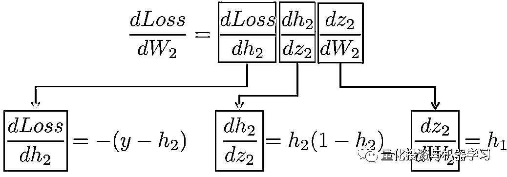

作为一个内存助手，这些是上面使用的函数定义及其一阶导数：

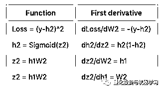

更直观地说，我们的目标是在下面的图中更新权重 W2（蓝色）。为了达到这个目的，我们需要计算沿着这个链的三个偏导数。

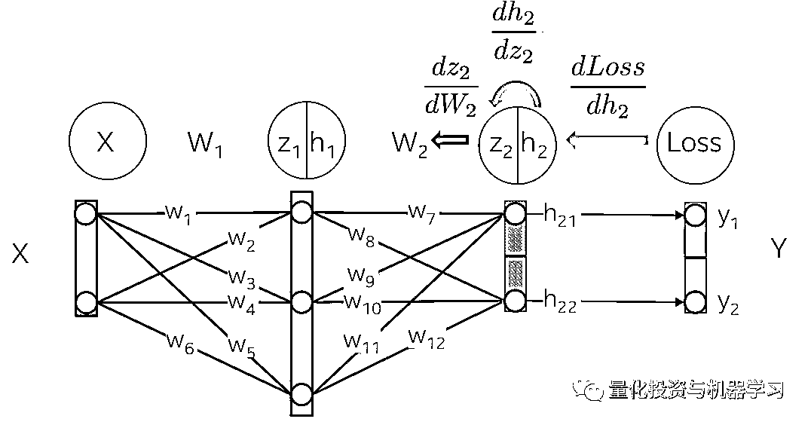

将值代入这些偏导数中，我们就可以计算出关于权值 W2 的梯度，如下所示。

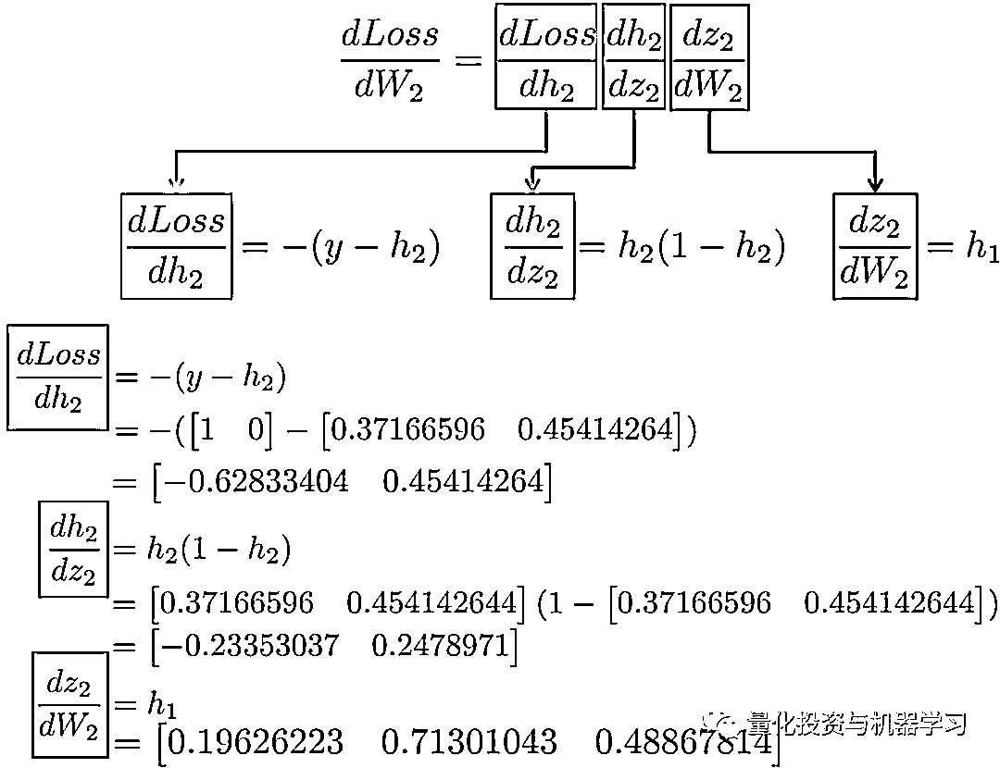

结果是一个 3x2 矩阵 dLoss/dW2，它将按照最小化损失函数的方向更新原始的 W2 值。

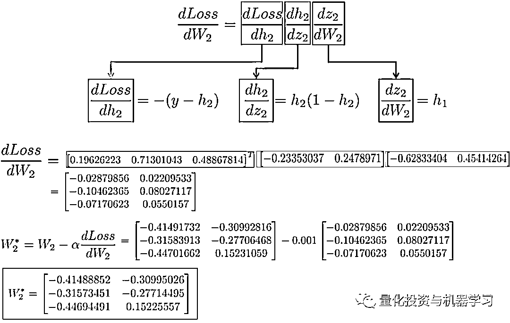

**dLoss / dW1：**

计算用于更新第一个隐藏层 W1 的权重的链式规则显示了重用现有计算的可能性。

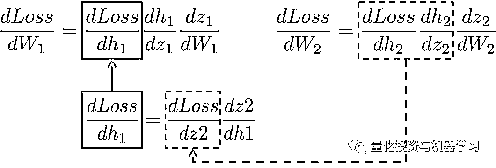

更直观地说，从输出层到权值 W1 的路径涉及到已经在后面几层计算过的偏导数。

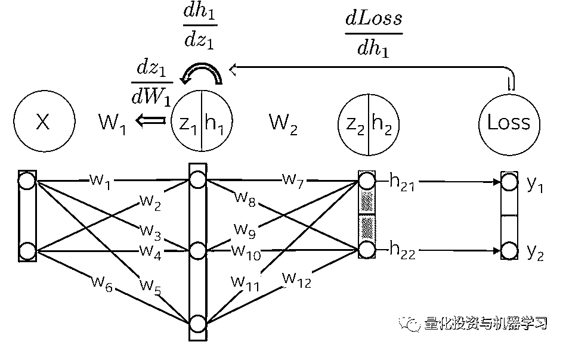

例如，偏导数 dLoss/dh2 和 dh2/dz2 在上一节中已经被计算为输出层 dLoss/dW2 学习权值的依赖项。

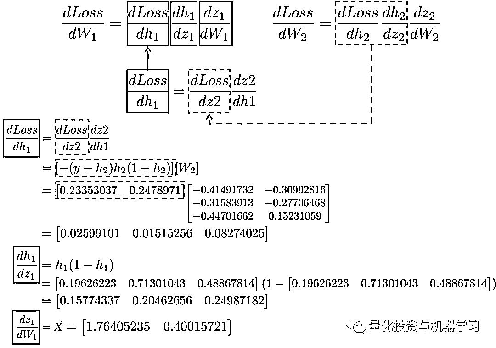

将所有的导数放在一起，我们可以再次执行链式法则来更新隐藏层 W1 的权值：

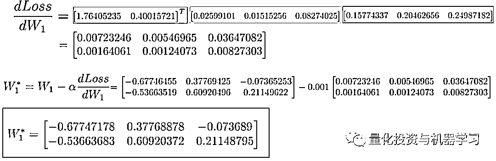

最后，我们将新值赋给权值，并在网络上完成了一个训练步骤。

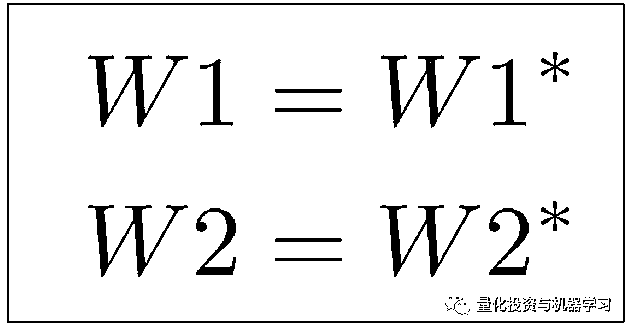

**代码实现**

让我们把上面的数学方程转换成只用 Numpy 作为线性代数引擎的代码。神经网络是在一个循环中训练的，在这个循环中，每次迭代都向网络提供已校准的输入数据。在这个示例中，我们只考虑每次迭代中的整个数据集。由于我们在每个循环中更新可训练参数（代码中的矩阵 w1 和 w2）及其相应的梯度（矩阵 dL_dw1 和 dL_dw2），因此对前向步、损失步和向后步的计算具有良好的泛化性。代码见文末：

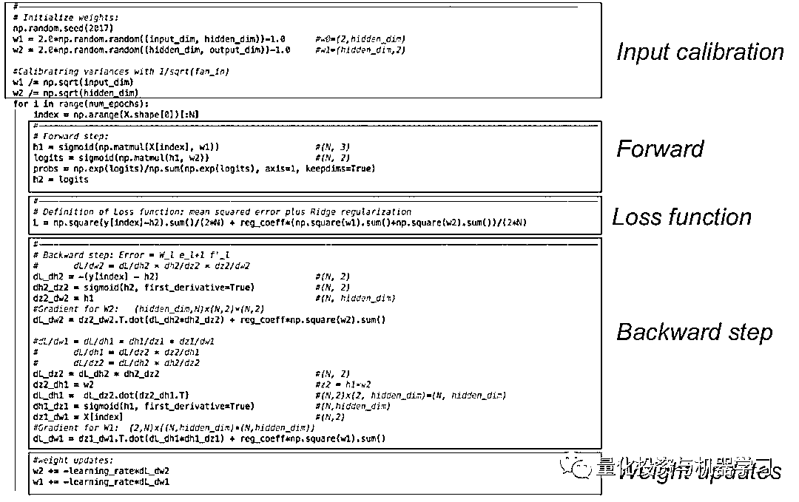

**运行代码**

下面是一些经过训练的神经网络，它们经过多次迭代来逼近 XOR 函数。 

首先，让我们看看隐藏层中有 3 个神经元的神经网络是如何具有小容量的。该模型学习用一个简单的决策边界将两个类分开，该边界开始是一条直线，但随后显示出非线性行为。随着训练的继续，右边图中的损失函数很好地降低了。

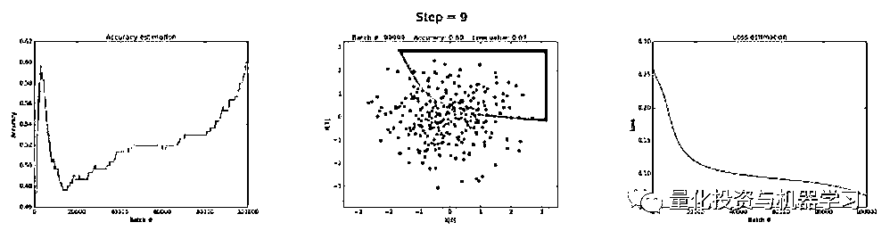

左图：准确性，中间：学习决策边界，右图：损失函数

在隐层中有 50 个神经元可以显著提高模型学习更复杂决策边界的能力。这不仅能产生更精确的结果，而且还能产生梯度爆炸，这在训练神经网络时是一个值得注意的问题。这种情况发生在非常大的梯度，在反向传播过程中乘以权重，从而生成较大的更新权重时。这就是为什么在训练的最后一步（步骤> 90）损失值突然增加的原因。损失函数的正则化组件计算平方值的权重已经非常大（sum（W²）/ 2N）。

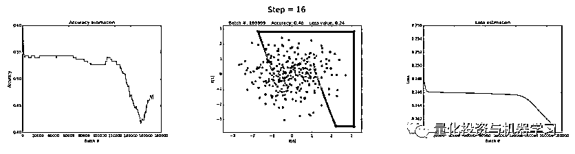

可以通过降低学习率来避免这个问题，如下所示。或者通过实施一项随着时间的推移而降低学习速度的策略。或者通过加强正则化，也许是 L1 而不是 L2。梯度爆炸和梯度消失是有趣的现象，我们将在后面进行完整的分析。

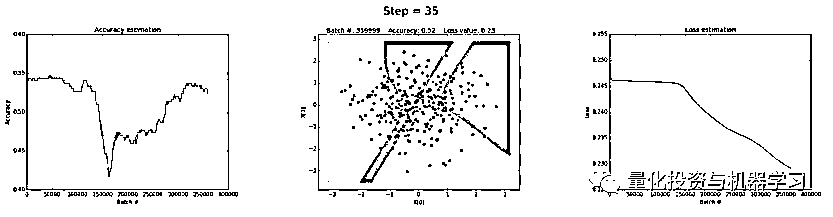

来源：https://towardsai.net/

**如何获取代码**

在**后台**输入（严格大小写）

***LEGO_Math***

*—End—*

量化投资与机器学习微信公众号，是业内垂直于**Quant**、**MFE**、**CST**等专业的主流量化自媒体。公众号拥有来自**公募、私募、券商、银行、海外**等众多圈内**10W+**关注者。每日发布行业前沿研究成果和最新资讯。

