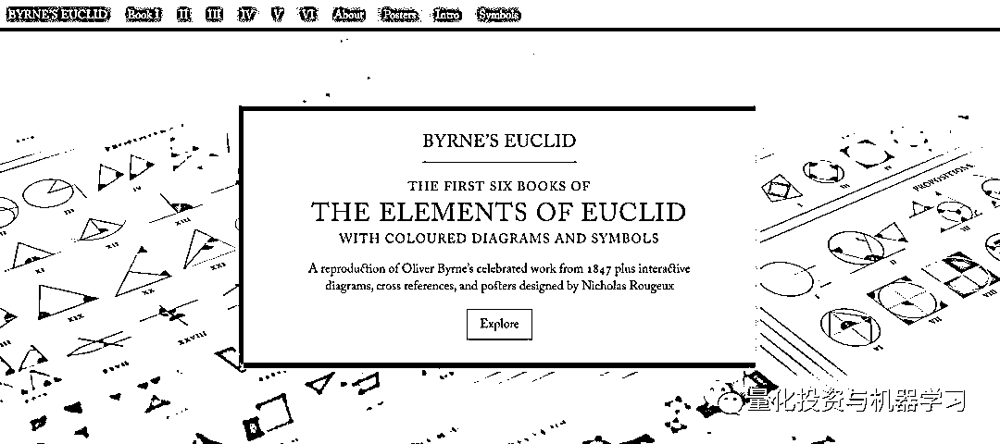

# 哭了！好美！交互式《几何原本》再现江湖

> 原文：[`mp.weixin.qq.com/s?__biz=MzAxNTc0Mjg0Mg==&mid=2653292383&idx=1&sn=4886481b69e2c4f7c183752bae415175&chksm=802dc54ab75a4c5c4031bb2c3ae9c47c87d05e82ff226a1078d77b97bb9e456f725d7aabbe8b&scene=27#wechat_redirect`](http://mp.weixin.qq.com/s?__biz=MzAxNTc0Mjg0Mg==&mid=2653292383&idx=1&sn=4886481b69e2c4f7c183752bae415175&chksm=802dc54ab75a4c5c4031bb2c3ae9c47c87d05e82ff226a1078d77b97bb9e456f725d7aabbe8b&scene=27#wechat_redirect)

**标星★公众号     **爱你们♥

作者：公众号编译整理

**近期原创文章：**

## ♥ [5 种机器学习算法在预测股价的应用（代码+数据）](https://mp.weixin.qq.com/s?__biz=MzAxNTc0Mjg0Mg==&mid=2653290588&idx=1&sn=1d0409ad212ea8627e5d5cedf61953ac&chksm=802dc249b75a4b5fa245433320a4cc9da1a2cceb22df6fb1a28e5b94ff038319ae4e7ec6941f&token=1298662931&lang=zh_CN&scene=21#wechat_redirect)

## ♥ [Two Sigma 用新闻来预测股价走势，带你吊打 Kaggle](https://mp.weixin.qq.com/s?__biz=MzAxNTc0Mjg0Mg==&mid=2653290456&idx=1&sn=b8d2d8febc599742e43ea48e3c249323&chksm=802e3dcdb759b4db9279c689202101b6b154fb118a1c1be12b52e522e1a1d7944858dbd6637e&token=1330520237&lang=zh_CN&scene=21#wechat_redirect)

## ♥ [利用深度学习最新前沿预测股价走势](https://mp.weixin.qq.com/s?__biz=MzAxNTc0Mjg0Mg==&mid=2653290080&idx=1&sn=06c50cefe78a7b24c64c4fdb9739c7f3&chksm=802e3c75b759b563c01495d16a638a56ac7305fc324ee4917fd76c648f670b7f7276826bdaa8&token=770078636&lang=zh_CN&scene=21#wechat_redirect)

## ♥ [一位数据科学 PhD 眼中的算法交易](https://mp.weixin.qq.com/s?__biz=MzAxNTc0Mjg0Mg==&mid=2653290118&idx=1&sn=a261307470cf2f3e458ab4e7dc309179&chksm=802e3c93b759b585e079d3a797f512dfd0427ac02942339f4f1454bd368ba47be21cb52cf969&token=770078636&lang=zh_CN&scene=21#wechat_redirect)

## ♥ [基于 RNN 和 LSTM 的股市预测方法](https://mp.weixin.qq.com/s?__biz=MzAxNTc0Mjg0Mg==&mid=2653290481&idx=1&sn=f7360ea8554cc4f86fcc71315176b093&chksm=802e3de4b759b4f2235a0aeabb6e76b3e101ff09b9a2aa6fa67e6e824fc4274f68f4ae51af95&token=1865137106&lang=zh_CN&scene=21#wechat_redirect)

## ♥ [如何鉴别那些用深度学习预测股价的花哨模型？](https://mp.weixin.qq.com/s?__biz=MzAxNTc0Mjg0Mg==&mid=2653290132&idx=1&sn=cbf1e2a4526e6e9305a6110c17063f46&chksm=802e3c81b759b597d3dd94b8008e150c90087567904a29c0c4b58d7be220a9ece2008956d5db&token=1266110554&lang=zh_CN&scene=21#wechat_redirect)

## ♥ [优化强化学习 Q-learning 算法进行股市](https://mp.weixin.qq.com/s?__biz=MzAxNTc0Mjg0Mg==&mid=2653290286&idx=1&sn=882d39a18018733b93c8c8eac385b515&chksm=802e3d3bb759b42d1fc849f96bf02ae87edf2eab01b0beecd9340112c7fb06b95cb2246d2429&token=1330520237&lang=zh_CN&scene=21#wechat_redirect)

## ♥ [WorldQuant 101 Alpha、国泰君安 191 Alpha](https://mp.weixin.qq.com/s?__biz=MzAxNTc0Mjg0Mg==&mid=2653290927&idx=1&sn=ecca60811da74967f33a00329a1fe66a&chksm=802dc3bab75a4aac2bb4ccff7010063cc08ef51d0bf3d2f71621cdd6adece11f28133a242a15&token=48775331&lang=zh_CN&scene=21#wechat_redirect)

## ♥ [基于回声状态网络预测股票价格（附代码）](https://mp.weixin.qq.com/s?__biz=MzAxNTc0Mjg0Mg==&mid=2653291171&idx=1&sn=485a35e564b45046ff5a07c42bba1743&chksm=802dc0b6b75a49a07e5b91c512c8575104f777b39d0e1d71cf11881502209dc399fd6f641fb1&token=48775331&lang=zh_CN&scene=21#wechat_redirect)

## ♥ [AQR 最最最新 | 计量经济学应用投资失败的 7 个原因](https://mp.weixin.qq.com/s?__biz=MzAxNTc0Mjg0Mg==&mid=2653292186&idx=1&sn=87501434ae16f29afffec19a6884ee8d&chksm=802dc48fb75a4d99e0172bf484cdbf6aee86e36a95037847fd9f070cbe7144b4617c2d1b0644&token=48775331&lang=zh_CN&scene=21#wechat_redirect)

## ♥ [关于高盛在 Github 开源背后的真相！](https://mp.weixin.qq.com/s?__biz=MzAxNTc0Mjg0Mg==&mid=2653291594&idx=1&sn=7703403c5c537061994396e7e49e7ce5&chksm=802dc65fb75a4f49019cec951ac25d30ec7783738e9640ec108be95335597361c427258f5d5f&token=48775331&lang=zh_CN&scene=21#wechat_redirect)

## ♥ [新一代量化带货王诞生！Oh My God！](https://mp.weixin.qq.com/s?__biz=MzAxNTc0Mjg0Mg==&mid=2653291789&idx=1&sn=e31778d1b9372bc7aa6e57b82a69ec6e&chksm=802dc718b75a4e0ea4c022e70ea53f51c48d102ebf7e54993261619c36f24f3f9a5b63437e9e&token=48775331&lang=zh_CN&scene=21#wechat_redirect)

## ♥ [独家！关于定量/交易求职分享（附真实试题）](https://mp.weixin.qq.com/s?__biz=MzAxNTc0Mjg0Mg==&mid=2653291844&idx=1&sn=3fd8b57d32a0ebd43b17fa68ae954471&chksm=802dc751b75a4e4755fcbb0aa228355cebbbb6d34b292aa25b4f3fbd51013fcf7b17b91ddb71&token=48775331&lang=zh_CN&scene=21#wechat_redirect)

## ♥ [Quant 们的身份危机！](https://mp.weixin.qq.com/s?__biz=MzAxNTc0Mjg0Mg==&mid=2653291856&idx=1&sn=729b657ede2cb50c96e92193ab16102d&chksm=802dc745b75a4e53c5018cc1385214233ec4657a3479cd7193c95aaf65642f5f45fa0e465694&token=48775331&lang=zh_CN&scene=21#wechat_redirect)

## ♥ [拿起 Python，防御特朗普的 Twitter！](https://mp.weixin.qq.com/s?__biz=MzAxNTc0Mjg0Mg==&mid=2653291977&idx=1&sn=01f146e9a88bf130ca1b479573e6d158&chksm=802dc7dcb75a4ecadfdbdace877ed948f56b72bc160952fd1e4bcde27260f823c999a65a0d6d&token=48775331&lang=zh_CN&scene=21#wechat_redirect)

## ♥ [用深度强化学习打造不亏钱的交易机器人（附代码）](https://mp.weixin.qq.com/s?__biz=MzAxNTc0Mjg0Mg==&mid=2653292021&idx=1&sn=a9cbc37fd50d917df61728eee0a109db&chksm=802dc7e0b75a4ef6937f4e73bd561362d4baa6219e948fc5211e1071c50925cd69925fb1850e&token=48775331&lang=zh_CN&scene=21#wechat_redirect)

**前言**

这个网站是对 1847 年 Oliver Byrne 对 Byrne 的 Euclid 的再现，它向美丽的原创设计者致敬，并包括由 Nicholas Rougeux 设计的交互式图表，交叉参考和海报等增强功能。

**https://www.c82.net/euclid/**

支持多种设备操作：

**地位**

**《几何原本》（希腊语：Στοιχεῖα）又称《原本》，是古****希腊数学家欧几里得的一部不朽之作，集整个古希腊数学成果和精神于一书。既是数学巨著，也是哲学巨著，并且第一次完成了人类对空间的认识**。

该身自问世之日起，在长达 2000 多年的时间里它历经多次翻译和修订，自 1482 年第一个印刷本出版后，至今已有 1000 多种不同的版本。除了《圣经》之外，没有任何其他著作，其研究、使用和传播之广泛，能够与《几何原本》相比。它是欧洲数学的基础，总结了平面几何五大公设，被广泛的认为是历史上最成功的教科书。欧几里得也写了一些关于透视、圆锥曲线、球面几何学及数论的作品。欧几里得使用了公理化的方法。这一方法后来成了建立任何知识体系的典范，在差不多二千年间，被奉为必须遵守的严密思维的范例。

几个世纪以来，原稿和一些抄本一直在流通，但直到 1440 年印刷机发明后不久，从 1482 年开始，原稿才得到更广泛的复制。

"BYRNE’S EUCLID 是 Oliver Byrne 版本的《几何原本（Euclid's Elements）》—— The First Six Books of the Elements of Euclid（前六卷几何原本，1847 年版）的复制。使用彩色插图演示证明从而避免使用字母标注边，角以及图形。添加了交互式图表（证明中的图形可点击），交叉引用。

**从 Byrne 的欧几里得中扫描前八个命题**

1847 年，爱尔兰的数学教授 Oliver Byrne 与出版商 William Pickering 密切合作，在伦敦出版了独特的一版 The First Six Books of the Elements of Euclid 。Byrne 的版本是最早的彩色印刷书籍之一，以其对欧几里得原著的独特理解而闻名。精确地使用颜色和图表意味着这本书非常具有挑战性，而且复制成本很高。关于为什么 Byrne 只设计了 13 本书中的 6 本，人们知之甚少，但这可能是由于时间和成本所致。

**1482 年第一版毕达哥拉斯定理的几何证明（左），1847 年 Byrne 的精彩演绎（右）**

关于 Byrne 更深入的历史和他的版本可以在美国数学协会的网站上找到：

*https://www.maa.org/press/periodicals/convergence/oliver-byrne-the-matisse-of-mathematics-byrnes-euclid-geometry-understood-via-color-coded-diagrams*

最新的交互式版本，完善了由于 19 世纪印刷方法限制而不可避免的粗糙和不精准。

**颜色与风格**

在创建图表时，我们开发了一个调色板，其中包含了 Byrne 在书中使用的所有样式，这样我们就可以轻松地将样式应用到在 Illustrator 中使用吸管工具进行创建。他只使用了四种颜色（红、蓝、黄和黑）、两种线条样式（实线和虚线）和两种线条粗细。

创建角度和圆弧的形状选择更精确的方法：

有些图需要平分角或平分线。一条任意角度的直线可以通过复制这条直线并围绕其中心旋转 90 度来平分。

**交互性**

通过使描述中的每个形状都可单击并在滚动时保持图表可见来实现。

[`mp.weixin.qq.com/mp/readtemplate?t=pages/video_player_tmpl&action=mpvideo&auto=0&vid=wxv_832307253352038400`](https://mp.weixin.qq.com/mp/readtemplate?t=pages/video_player_tmpl&action=mpvideo&auto=0&vid=wxv_832307253352038400)

**点击查看交互式**

这意味着这些图需要从 Illustrator 中导出为 SVG，然后添加到站点中，并且需要创建每个形状的相应微型版本，以便在描述中单击它们。这个过程是最耗时的，但也是最令人愉快的，因为当我们完成时，每个图表都栩栩如生。

**排版**

漂亮的排版是我们想重新创作 Byrne 版本的一个重要原因。 

幸运的是，大家都知道使用的字体是 Caslon，Adobe 有一个版本的字体支持这项工作。

装饰首字母是由 Mary Byfield 于 1843 年创作的木版画，最初展示在中世纪的字母，数字和装置中。 它们是几何图表现代性的完美补充，我觉得重现它们也很重要。通过在 Illustrator 中跟踪它们并使用 Glyphr Studio 将图形转换为字体来创建自定义字体。

**long s ( ſ ) **

long s ( ſ ) 贯穿于这本书。

**特殊符号**

有趣的是，“不相等”、“不大于”和“不小于”的符号只出现在符号和缩写的定义列表中，而没有出现在原著的任何地方。不平行的符号并不出现在符号列表中，而是出现在第一本书的命题 39 和命题 40 中。 

最后，在每次加载页面时都编写了一个小脚本，便为每个字符添加标题属性以获得更多帮助。

**方程和组**

Byrne 经常使用大括号来表示等式，并通过将文本行或形状组合在一起来避免重复文本。

作者做了很多复杂的前端处理：

但是还是有一些问题：因为括号是由 CSS 生成的，而不是在 HTML 中生成的，而且实际上是不可见的。这也意味着我必须为大小（.group-fence2，.group-fence3 等）指定不同的类，这些类不总是与行对齐。

Caslon 字体的花括号字符也有一个非常大的 em 方框，这是 CSS 无法改变的。放大字体大小意味着 em 方形通常会与其他文本和可单击形状重叠，如下所示。此外，大括号看起来很笨重，即使我们使用了其他字体。

作者进行了改进：基于 MathJax 如何处理花括号的原理，以及作者设计的更灵活的方法。每个组都有包含在 HTML 中的方括号供参考，然后替换为自定义 SVG 形状，并为上、中、下和扩展元素添加了一些 JavaScript。然后使用 CSS 对扩展元素进行拉伸，而不是使用字体大小设置进行放大，以填充上部、下部和中部留下的空白。

**自定义花括号**

下面的代码是一个工作示例：

这种方法非常好，并且没有其他两种方法的缺点，而且花括号的大小总是正确的。

**排对齐之前和之后的方程组**

**TeX**

还有一位作者，用 ConTeXt 宏来创建一个新的 MetaPost 实例。 在 MetaPost 中，有许多函数可以创建这些构造。 它们的使用看起来有点像这样：

对于命题文本，我们制作了一系列在同一个 MetaPost 实例中绘制图片的宏。通常，它们执行任意的 MetaPost 代码，但大多数情况下，它们将对象名称作为参数。是这样的：

如下：

书中的图片并不过分复杂，但有些部分需要特别注意。 

如果线段的末端彼此接触，则触摸点需要很好的显示。 目前，仅支持两条线路的连接。 

角度被描绘为圆形扇区。 如果角度足够小，具有相同半径的扇区可能看起来很小，因此放大它是有意义的。 目前，对于 60 度以上的角度，半径保持不变。

为了看起来不错，虚线应该以完整破折号开始和结束。

由于很多事情都是自动完成的，所以添加小字母并不是什么大不了的事情。默认情况下，点的名称是那些保存其坐标的变量的名称。标签可以放置在多边形的顶点，线段和 c 的末端。

这个项目的 GitHub：

***https://github.com/jemmybutton/byrne-euclid***

**海报**

*—End—*

量化投资与机器学习微信公众号，是业内垂直于**Quant**、**MFE**、**CST**等专业的主流量化自媒体。公众号拥有来自**公募、私募、券商、银行、海外**等众多圈内**10W+**关注者。每日发布行业前沿研究成果和最新资讯。

