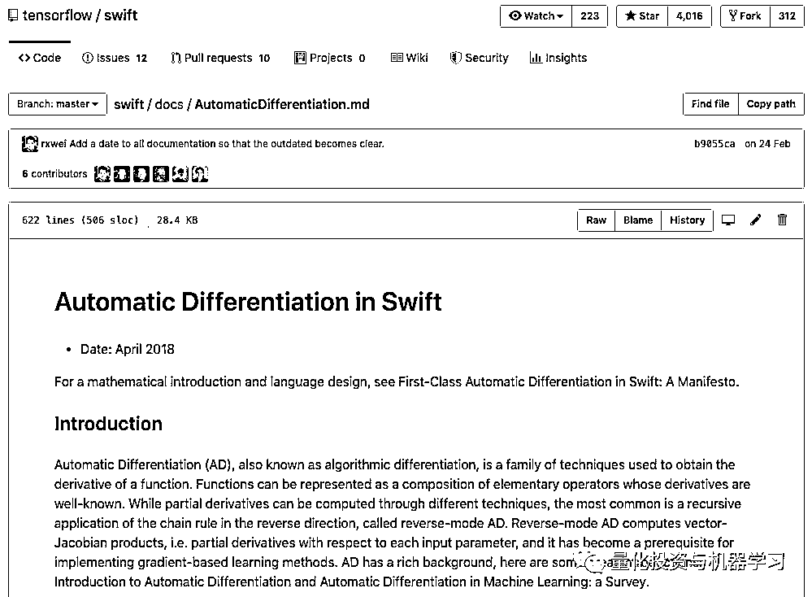

# Swift 会成为深度学习领域下一个 Superman！

> 原文：[`mp.weixin.qq.com/s?__biz=MzAxNTc0Mjg0Mg==&mid=2653292326&idx=1&sn=3902b8aebd814c1b5457ee7d10afd069&chksm=802dc533b75a4c25b208533fb670019a826f7c32faacb136ae3073135d8c4e2136a12672e862&scene=27#wechat_redirect`](http://mp.weixin.qq.com/s?__biz=MzAxNTc0Mjg0Mg==&mid=2653292326&idx=1&sn=3902b8aebd814c1b5457ee7d10afd069&chksm=802dc533b75a4c25b208533fb670019a826f7c32faacb136ae3073135d8c4e2136a12672e862&scene=27#wechat_redirect)

**标星★公众号     **爱你们♥

作者：Max Pechyonkin

编译：公众号海外部

**近期原创文章：**

## ♥ [基于无监督学习的期权定价异常检测（代码+数据）](https://mp.weixin.qq.com/s?__biz=MzAxNTc0Mjg0Mg==&mid=2653290562&idx=1&sn=dee61b832e1aa2c062a96bb27621c29d&chksm=802dc257b75a4b41b5623ade23a7de86333bfd3b4299fb69922558b0cbafe4c930b5ef503d89&token=1298662931&lang=zh_CN&scene=21#wechat_redirect)

## ♥ [5 种机器学习算法在预测股价的应用（代码+数据）](https://mp.weixin.qq.com/s?__biz=MzAxNTc0Mjg0Mg==&mid=2653290588&idx=1&sn=1d0409ad212ea8627e5d5cedf61953ac&chksm=802dc249b75a4b5fa245433320a4cc9da1a2cceb22df6fb1a28e5b94ff038319ae4e7ec6941f&token=1298662931&lang=zh_CN&scene=21#wechat_redirect)

## ♥ [深入研读：利用 Twitter 情绪去预测股市](https://mp.weixin.qq.com/s?__biz=MzAxNTc0Mjg0Mg==&mid=2653290402&idx=1&sn=efda9ea106991f4f7ccabcae9d809e00&chksm=802e3db7b759b4a173dc8f2ab5c298ab3146bfd7dd5aca75929c74ecc999a53b195c16f19c71&token=1330520237&lang=zh_CN&scene=21#wechat_redirect)

## ♥ [Two Sigma 用新闻来预测股价走势，带你吊打 Kaggle](https://mp.weixin.qq.com/s?__biz=MzAxNTc0Mjg0Mg==&mid=2653290456&idx=1&sn=b8d2d8febc599742e43ea48e3c249323&chksm=802e3dcdb759b4db9279c689202101b6b154fb118a1c1be12b52e522e1a1d7944858dbd6637e&token=1330520237&lang=zh_CN&scene=21#wechat_redirect)

## ♥ [利用深度学习最新前沿预测股价走势](https://mp.weixin.qq.com/s?__biz=MzAxNTc0Mjg0Mg==&mid=2653290080&idx=1&sn=06c50cefe78a7b24c64c4fdb9739c7f3&chksm=802e3c75b759b563c01495d16a638a56ac7305fc324ee4917fd76c648f670b7f7276826bdaa8&token=770078636&lang=zh_CN&scene=21#wechat_redirect)

## ♥ [一位数据科学 PhD 眼中的算法交易](https://mp.weixin.qq.com/s?__biz=MzAxNTc0Mjg0Mg==&mid=2653290118&idx=1&sn=a261307470cf2f3e458ab4e7dc309179&chksm=802e3c93b759b585e079d3a797f512dfd0427ac02942339f4f1454bd368ba47be21cb52cf969&token=770078636&lang=zh_CN&scene=21#wechat_redirect)

## ♥ [基于 RNN 和 LSTM 的股市预测方法](https://mp.weixin.qq.com/s?__biz=MzAxNTc0Mjg0Mg==&mid=2653290481&idx=1&sn=f7360ea8554cc4f86fcc71315176b093&chksm=802e3de4b759b4f2235a0aeabb6e76b3e101ff09b9a2aa6fa67e6e824fc4274f68f4ae51af95&token=1865137106&lang=zh_CN&scene=21#wechat_redirect)

## ♥ [人工智能『AI』应用算法交易，7 个必踩的坑！](https://mp.weixin.qq.com/s?__biz=MzAxNTc0Mjg0Mg==&mid=2653289974&idx=1&sn=88f87cb64999d9406d7c618350aac35d&chksm=802e3fe3b759b6f5eca6e777364270cbaa0bf35e9a1535255be9751c3a77642676993a861132&token=770078636&lang=zh_CN&scene=21#wechat_redirect)

## ♥ [神经网络在算法交易上的应用系列（一）](https://mp.weixin.qq.com/s?__biz=MzAxNTc0Mjg0Mg==&mid=2653289962&idx=1&sn=5f5aa65ec00ce176501c85c7c106187d&chksm=802e3fffb759b6e9f2d4518f9d3755a68329c8753745333ef9d70ffd04bd088fd7b076318358&token=770078636&lang=zh_CN&scene=21#wechat_redirect)

## ♥ [预测股市 | 如何避免 p-Hacking，为什么你要看涨？](https://mp.weixin.qq.com/s?__biz=MzAxNTc0Mjg0Mg==&mid=2653289820&idx=1&sn=d3fee74ba1daab837433e4ef6b0ab4d9&chksm=802e3f49b759b65f422d20515942d5813aead73231da7d78e9f235bdb42386cf656079e69b8b&token=770078636&lang=zh_CN&scene=21#wechat_redirect)

## ♥ [如何鉴别那些用深度学习预测股价的花哨模型？](https://mp.weixin.qq.com/s?__biz=MzAxNTc0Mjg0Mg==&mid=2653290132&idx=1&sn=cbf1e2a4526e6e9305a6110c17063f46&chksm=802e3c81b759b597d3dd94b8008e150c90087567904a29c0c4b58d7be220a9ece2008956d5db&token=1266110554&lang=zh_CN&scene=21#wechat_redirect)

## ♥ [优化强化学习 Q-learning 算法进行股市](https://mp.weixin.qq.com/s?__biz=MzAxNTc0Mjg0Mg==&mid=2653290286&idx=1&sn=882d39a18018733b93c8c8eac385b515&chksm=802e3d3bb759b42d1fc849f96bf02ae87edf2eab01b0beecd9340112c7fb06b95cb2246d2429&token=1330520237&lang=zh_CN&scene=21#wechat_redirect)

**如果你正在学习深度学习，那么 Swift 是一门你应该开始学习的语言！**

**介绍**

如果你喜欢编程，当你听到 Swift 时，你可能会想到 iOS 或 MacOS 的应用程序开发。如果你正在学习深度学习，那么你一定听说过 Swens for Tensorflow（缩写为 S4TF）。你可以问自己：“为什么 Google 会为 Swift 创建 TensorFlow 版本？ 已有 Python 和 C ++版本；为什么还要再添加一种语言？“。本文，我们将试着回答这个问题，并概述为什么你应该认真遵循 S4TF 以及 Swift 语言本身的原因。这篇文章的目的不是给出非常详细的解释，而是提供一个概括性的论述，如果你很感兴趣。便可以深入挖掘。

***https://www.tensorflow.org/swift/***

**Swift 背后强大的支持**

Swift 是由 Chris Lattner 在 Apple 工作时创建的。现在，Chris Lattner 在 Google Brain 工作，这是世界上最好的人工智能研究团队之一。Swift 语言的创造者现在在实验室从事深度学习的研究，这一事实应该告诉你，这是一个十分高大上的项目。

***https://ai.google/research/teams/brain***

一段时间以前，谷歌意识到，尽管 Python 是一门优秀的语言，但是它有许多难以克服的局限性。TensorFlow 需要一种新的语言，经过长时间的考虑，Swift 被选为候选人。这里有一个文档介绍了 Python 的缺点以及考虑了哪些其他语言，以及最终如何将其缩小到 Swift。

***https://github.com/tensorflow/swift/blob/master/docs/WhySwiftForTensorFlow.md***

**对于 TensorFlow 来说，Swift 不仅仅是一个库**

Swift 对于 TensorFlow 不仅仅是另一种语言的 TF。它本质上是 Swift 语言本身的另一个分支。这意味着 S4TF 不是一个库；它本身是一种语言，内置了支持 TensorFlow 所需的所有功能。例如，S4TF 中有一个非常强大的自动微分系统：

***https://github.com/tensorflow/swift/blob/master/docs/AutomaticDifferentiation.md***

这是计算梯度所需要的深度学习的基础之一。 与 Python 相比，自动区分不是语言的核心部分。 最初作为 S4TF 的一部分开发中的一些功能，后来被集成到 Swift 语言本身中。

**Swift 很快**

当我第一次知道 Swift 的运行速度和 C 代码一样快时，我很惊讶。我们知道 C 是高度优化的，可以达到非常快的速度，但这需要以微内存管理为代价，这会导致 C 不能保证内存的安全。此外，C 语言不是一门很容易学的语言。 

现在，Swift 在数值计算中运行得和 C 一样快：

***https://www.fast.ai/2019/01/10/swift-numerics/***

而且它没有内存安全问题，而且它更容易学习。Swift 背后的 LLVM 编译器非常强大，并且具有非常高效的优化功能，可确保你的代码运行速度非常快。

**可在 Swift 中使用 Python、C、****C++**

由于 Swift 应用机器学习还处于非常早期的阶段，这意味着适合 Swift 的机器学习库并不多。你不应该太担心，因为**Swift 具有惊人的 Python 互操作性**。你只需导入 Swift 中的任何 Python 库，它就能正常工作。类似地，你可以将 C 和 C++库导入到 Swift 中（对于 C++，你需要确保头文件是用纯 C 编写的，没有 C++特征）。 

***https://oleb.net/blog/2017/12/importing-c-library-into-swift/***

总之，如果你需要特定的功能，但它还没有在 Swift 中实现，你可以导入相应的 Python、C 或 C++包。十分不错！

**Swift Low-Level**

如果你曾经使用过 TensorFlow，那么很可能是通过 Python 包来实现的。在底层，Python 版本的 TensorFlow 库底层有 C 代码。所以当你调用 TensorFlow 中的任何函数时，在某种程度上你会碰到一些 C。这意味着检查源代码的速度是有限制的。例如，如果你想了解卷积是如何实现的，你将无法看到 Python 代码，因为它是在 C 语言中实现的。 

在 Swift 中，情况就不同了。**Chris Lattner 称 Swift 是“LLVM（汇编语言）的语法糖”**。这意味着从本质上说，Swift 非常接近硬件，并且没有其他层用 C 去编写。这也意味着 Swift 代码非常快，如上所述。这一切都使你作为开发人员能够从一个非常高的级别检查代码到一个非常低的级别，而无需进入 C。

**接下来是什么**

Swift 只是谷歌深度学习创新的一部分。还有一个非常相关的组件：MLIR（Multi-Level Intermediate Representation）。

MLIR 将是谷歌统一编译器的基础，允许用 Swift（或任何其他受支持的语言）编写代码，并将其编译到任何受支持的硬件中。目前，针对不同的目标硬件有大量的编译器，但是 MLIR 将改变这一点，不仅允许代码重用，还允许编写定制的编译器底层组件。它还将允许研究人员应用机器学习来优化底层算法：

虽然 MLIR 充当机器学习的编译器，但我们也看到它支持在编译器中使用机器学习！这一点尤其重要，因为开发数值库的工程师的扩展速度赶不上机器学习模型或硬件的多样化。

**总结**

如果你正在深入学习，那么 Swift 是一门你应该开始学习的语言。与 Python 相比，它有许多优势。谷歌正在加大投入，使 Swift 成为其 TensorFlow 机器学习基础设施的一个关键组件，而且很有可能 Swift 将成为深度学习的语言。所以，**尽早开始和 Swift 接触会给你一个先发优势。** 

*—End—*

量化投资与机器学习微信公众号，是业内垂直于**Quant**、**MFE**、**CST**等专业的主流量化自媒体。公众号拥有来自**公募、私募、券商、银行、海外**等众多圈内**10W+**关注者。每日发布行业前沿研究成果和最新资讯。

