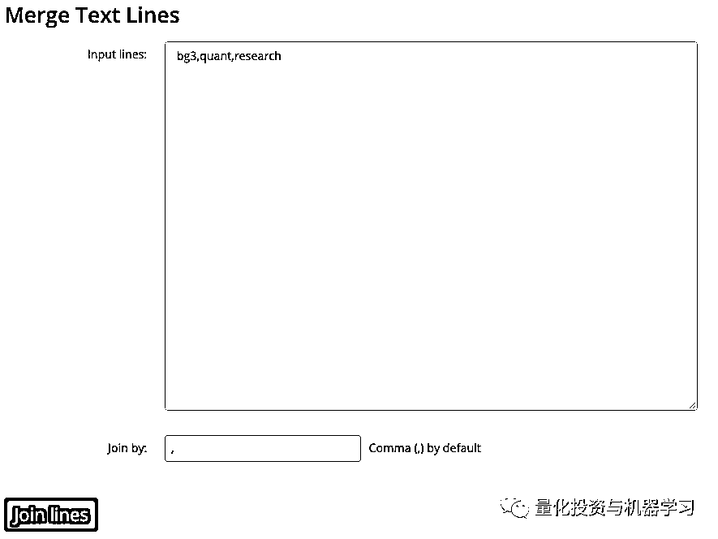

# Python 一条龙：创建、读取、更新、搜索 Excel 文件

> 原文：[`mp.weixin.qq.com/s?__biz=MzAxNTc0Mjg0Mg==&mid=2653292311&idx=1&sn=6bcaa4841b3bcbc4c113d57be8bd8fcc&chksm=802dc502b75a4c14b6cf659d9de39812b295d5fbc5d878c8636f790cf2ca794146ca740afb1c&scene=27#wechat_redirect`](http://mp.weixin.qq.com/s?__biz=MzAxNTc0Mjg0Mg==&mid=2653292311&idx=1&sn=6bcaa4841b3bcbc4c113d57be8bd8fcc&chksm=802dc502b75a4c14b6cf659d9de39812b295d5fbc5d878c8636f790cf2ca794146ca740afb1c&scene=27#wechat_redirect)

**标星★公众号     **爱你们♥

作者：Goran Aviani

编译：公众号海外部

**近期原创文章：**

## ♥ [基于无监督学习的期权定价异常检测（代码+数据）](https://mp.weixin.qq.com/s?__biz=MzAxNTc0Mjg0Mg==&mid=2653290562&idx=1&sn=dee61b832e1aa2c062a96bb27621c29d&chksm=802dc257b75a4b41b5623ade23a7de86333bfd3b4299fb69922558b0cbafe4c930b5ef503d89&token=1298662931&lang=zh_CN&scene=21#wechat_redirect)

## ♥ [5 种机器学习算法在预测股价的应用（代码+数据）](https://mp.weixin.qq.com/s?__biz=MzAxNTc0Mjg0Mg==&mid=2653290588&idx=1&sn=1d0409ad212ea8627e5d5cedf61953ac&chksm=802dc249b75a4b5fa245433320a4cc9da1a2cceb22df6fb1a28e5b94ff038319ae4e7ec6941f&token=1298662931&lang=zh_CN&scene=21#wechat_redirect)

## ♥ [深入研读：利用 Twitter 情绪去预测股市](https://mp.weixin.qq.com/s?__biz=MzAxNTc0Mjg0Mg==&mid=2653290402&idx=1&sn=efda9ea106991f4f7ccabcae9d809e00&chksm=802e3db7b759b4a173dc8f2ab5c298ab3146bfd7dd5aca75929c74ecc999a53b195c16f19c71&token=1330520237&lang=zh_CN&scene=21#wechat_redirect)

## ♥ [Two Sigma 用新闻来预测股价走势，带你吊打 Kaggle](https://mp.weixin.qq.com/s?__biz=MzAxNTc0Mjg0Mg==&mid=2653290456&idx=1&sn=b8d2d8febc599742e43ea48e3c249323&chksm=802e3dcdb759b4db9279c689202101b6b154fb118a1c1be12b52e522e1a1d7944858dbd6637e&token=1330520237&lang=zh_CN&scene=21#wechat_redirect)

## ♥ [利用深度学习最新前沿预测股价走势](https://mp.weixin.qq.com/s?__biz=MzAxNTc0Mjg0Mg==&mid=2653290080&idx=1&sn=06c50cefe78a7b24c64c4fdb9739c7f3&chksm=802e3c75b759b563c01495d16a638a56ac7305fc324ee4917fd76c648f670b7f7276826bdaa8&token=770078636&lang=zh_CN&scene=21#wechat_redirect)

## ♥ [一位数据科学 PhD 眼中的算法交易](https://mp.weixin.qq.com/s?__biz=MzAxNTc0Mjg0Mg==&mid=2653290118&idx=1&sn=a261307470cf2f3e458ab4e7dc309179&chksm=802e3c93b759b585e079d3a797f512dfd0427ac02942339f4f1454bd368ba47be21cb52cf969&token=770078636&lang=zh_CN&scene=21#wechat_redirect)

## ♥ [基于 RNN 和 LSTM 的股市预测方法](https://mp.weixin.qq.com/s?__biz=MzAxNTc0Mjg0Mg==&mid=2653290481&idx=1&sn=f7360ea8554cc4f86fcc71315176b093&chksm=802e3de4b759b4f2235a0aeabb6e76b3e101ff09b9a2aa6fa67e6e824fc4274f68f4ae51af95&token=1865137106&lang=zh_CN&scene=21#wechat_redirect)

## ♥ [人工智能『AI』应用算法交易，7 个必踩的坑！](https://mp.weixin.qq.com/s?__biz=MzAxNTc0Mjg0Mg==&mid=2653289974&idx=1&sn=88f87cb64999d9406d7c618350aac35d&chksm=802e3fe3b759b6f5eca6e777364270cbaa0bf35e9a1535255be9751c3a77642676993a861132&token=770078636&lang=zh_CN&scene=21#wechat_redirect)

## ♥ [神经网络在算法交易上的应用系列（一）](https://mp.weixin.qq.com/s?__biz=MzAxNTc0Mjg0Mg==&mid=2653289962&idx=1&sn=5f5aa65ec00ce176501c85c7c106187d&chksm=802e3fffb759b6e9f2d4518f9d3755a68329c8753745333ef9d70ffd04bd088fd7b076318358&token=770078636&lang=zh_CN&scene=21#wechat_redirect)

## ♥ [预测股市 | 如何避免 p-Hacking，为什么你要看涨？](https://mp.weixin.qq.com/s?__biz=MzAxNTc0Mjg0Mg==&mid=2653289820&idx=1&sn=d3fee74ba1daab837433e4ef6b0ab4d9&chksm=802e3f49b759b65f422d20515942d5813aead73231da7d78e9f235bdb42386cf656079e69b8b&token=770078636&lang=zh_CN&scene=21#wechat_redirect)

## ♥ [如何鉴别那些用深度学习预测股价的花哨模型？](https://mp.weixin.qq.com/s?__biz=MzAxNTc0Mjg0Mg==&mid=2653290132&idx=1&sn=cbf1e2a4526e6e9305a6110c17063f46&chksm=802e3c81b759b597d3dd94b8008e150c90087567904a29c0c4b58d7be220a9ece2008956d5db&token=1266110554&lang=zh_CN&scene=21#wechat_redirect)

## ♥ [优化强化学习 Q-learning 算法进行股市](https://mp.weixin.qq.com/s?__biz=MzAxNTc0Mjg0Mg==&mid=2653290286&idx=1&sn=882d39a18018733b93c8c8eac385b515&chksm=802e3d3bb759b42d1fc849f96bf02ae87edf2eab01b0beecd9340112c7fb06b95cb2246d2429&token=1330520237&lang=zh_CN&scene=21#wechat_redirect)

**第 1 部分：CSV 文件**

CSV 文件是由逗号分隔的值文件，其中纯文本数据以表格格式显示。它们可以与任何电子表格程序一起使用，如 Microsoft Office Excel、Google Spreadsheets 或 LibreOffice Calc

CSV 文件与其他电子表格文件不同，因为它们不允许保存单元格、列、行或公式。它们的限制是每个文件只允许一个工作表。

**写入 CSV 文件**

首先，打开一个新的 Python 文件并导入 Python CSV 模块。

**CSV 模块**

CSV 模块包含所有内置的必要方法。这些包括:

*   **csv.reader**

*   **csv.writer**

*   **csv.DictReader**

*   **csv.DictWriter**

*   **其他**  

我们将重点介绍**writer，DictWriter 和 DictReader**方法。它们允许你编辑，修改和操作存储在 CSV 文件中的数据。

在第一步中，我们需要定义文件的名称并将其保存为变量。我们应该对题和数据信息做同样的处理。

现在我们需要创建一个名为 writer 的函数，它将接受三个参数：header，data 和 filename。

下一步是修改 writer 函数，使它创建一个文件来保存来自 header 和数据变量的数据。

我们创建了第一个名为 imdb_top_4.csv 的 CSV 文件。使用你首选的电子表格应用程序打开此文件，会看到如下内容：

如果你选择在其他应用程序中打开文件，结果可能是这的：

**更新 CSV 文件**

如果要更新这个文件，你应该创建一个名为 updater 的新函数，它只接受一个名为 filename 的参数。 

这个函数首先打开 filename 变量中定义的文件，然后将从文件中读取的所有数据保存在名为 readData 的变量中。第二步是对新值进行硬编码，并将其置于 readData [0] ['Rating']。

函数中的最后一步是通过添加一个新的参数 update 来调用 writer 函数，该参数更新将告诉函数你正在执行更新。

csv.DictReader 的官方 Python 文档中有更多解释：

***https://docs.python.org/3/library/csv.html#dialects-and-formatting-parameters***

若要 writer 处理新参数，需要在定义 writer 的任何地方添加一个新参数。回到最初调用 writer 函数的地方，添加“write”作为一个新参数:

就在 writer 函数下面调用 updater 并将 filename 参数传递给它:

现在，你需要修改 writer 函数，以接受一个名为 option 的新参数:

从现在开始，我们希望收到 writer 函数的两个不同选项（写入和更新）。因此，我们应该添加两个 if 语句来支持这个新功能。函数 “if option == “write:” 下的第一部分你已经知道了。你只需要添加 “elif option == “update”:，代码：

**第 2 部分：xlsx 文件**

使用 Python3 和**openpyxl**库构建了这个解决方案。之所以选择 openpyxl，是因为可以它可以创建工作表、加载、更新、重命名和删除工作表的完整表现。它还允许我们读或写行和列，合并或取消合并单元格或创建 Python excel 图表等。

代码，代码再这里：

***https://github.com/GoranAviani/Manipulate-Excel-spreadsheets***

**Openpyxl**

1、Workbook 是 Openpyxl 中 Excel 文件的名称。

2、工作簿由工作表组成（默认为 1 个工作表），表格以其名称引用。

3、表格（sheet）由数字 1 开始的行（水平线）和从字母 A 开始的列（竖线）组成。

Openpyxl 有很好的文档，看这里：

***https://openpyxl.readthedocs.io/en/stable/***

作者还开发一个很有趣的在线应用程序：

***https://tools.incodaq.com/***

挺实用。大家可以自己试试。

点击 join，然后就变成这样了。

**MATLAB EXPO 2019 微信直播**

**免费！免费！免费！**

*—End—*

量化投资与机器学习微信公众号，是业内垂直于**Quant**、**MFE**、**CST**等专业的主流量化自媒体。公众号拥有来自**公募、私募、券商、银行、海外**等众多圈内**10W+**关注者。每日发布行业前沿研究成果和最新资讯。

