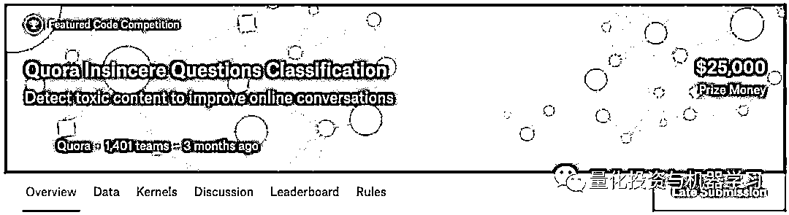

# 一个函数搞定并行，为 Pandas 提速！为我 Kaggle 摘银

> 原文：[`mp.weixin.qq.com/s?__biz=MzAxNTc0Mjg0Mg==&mid=2653292290&idx=1&sn=76e1c60683b445a22a336aa46aa475ae&chksm=802dc517b75a4c018708057d2c8c9108c92cf2a1d3ea454ccc97a177a2d83d793deda4485c40&scene=27#wechat_redirect`](http://mp.weixin.qq.com/s?__biz=MzAxNTc0Mjg0Mg==&mid=2653292290&idx=1&sn=76e1c60683b445a22a336aa46aa475ae&chksm=802dc517b75a4c018708057d2c8c9108c92cf2a1d3ea454ccc97a177a2d83d793deda4485c40&scene=27#wechat_redirect)

**标星★公众号     **爱你们♥

作者：Rahul Agarwal

编译：公众号海外部

**近期原创文章：**

## ♥ [基于无监督学习的期权定价异常检测（代码+数据）](https://mp.weixin.qq.com/s?__biz=MzAxNTc0Mjg0Mg==&mid=2653290562&idx=1&sn=dee61b832e1aa2c062a96bb27621c29d&chksm=802dc257b75a4b41b5623ade23a7de86333bfd3b4299fb69922558b0cbafe4c930b5ef503d89&token=1298662931&lang=zh_CN&scene=21#wechat_redirect)

## ♥ [5 种机器学习算法在预测股价的应用（代码+数据）](https://mp.weixin.qq.com/s?__biz=MzAxNTc0Mjg0Mg==&mid=2653290588&idx=1&sn=1d0409ad212ea8627e5d5cedf61953ac&chksm=802dc249b75a4b5fa245433320a4cc9da1a2cceb22df6fb1a28e5b94ff038319ae4e7ec6941f&token=1298662931&lang=zh_CN&scene=21#wechat_redirect)

## ♥ [深入研读：利用 Twitter 情绪去预测股市](https://mp.weixin.qq.com/s?__biz=MzAxNTc0Mjg0Mg==&mid=2653290402&idx=1&sn=efda9ea106991f4f7ccabcae9d809e00&chksm=802e3db7b759b4a173dc8f2ab5c298ab3146bfd7dd5aca75929c74ecc999a53b195c16f19c71&token=1330520237&lang=zh_CN&scene=21#wechat_redirect)

## ♥ [Two Sigma 用新闻来预测股价走势，带你吊打 Kaggle](https://mp.weixin.qq.com/s?__biz=MzAxNTc0Mjg0Mg==&mid=2653290456&idx=1&sn=b8d2d8febc599742e43ea48e3c249323&chksm=802e3dcdb759b4db9279c689202101b6b154fb118a1c1be12b52e522e1a1d7944858dbd6637e&token=1330520237&lang=zh_CN&scene=21#wechat_redirect)

## ♥ [利用深度学习最新前沿预测股价走势](https://mp.weixin.qq.com/s?__biz=MzAxNTc0Mjg0Mg==&mid=2653290080&idx=1&sn=06c50cefe78a7b24c64c4fdb9739c7f3&chksm=802e3c75b759b563c01495d16a638a56ac7305fc324ee4917fd76c648f670b7f7276826bdaa8&token=770078636&lang=zh_CN&scene=21#wechat_redirect)

## ♥ [一位数据科学 PhD 眼中的算法交易](https://mp.weixin.qq.com/s?__biz=MzAxNTc0Mjg0Mg==&mid=2653290118&idx=1&sn=a261307470cf2f3e458ab4e7dc309179&chksm=802e3c93b759b585e079d3a797f512dfd0427ac02942339f4f1454bd368ba47be21cb52cf969&token=770078636&lang=zh_CN&scene=21#wechat_redirect)

## ♥ [基于 RNN 和 LSTM 的股市预测方法](https://mp.weixin.qq.com/s?__biz=MzAxNTc0Mjg0Mg==&mid=2653290481&idx=1&sn=f7360ea8554cc4f86fcc71315176b093&chksm=802e3de4b759b4f2235a0aeabb6e76b3e101ff09b9a2aa6fa67e6e824fc4274f68f4ae51af95&token=1865137106&lang=zh_CN&scene=21#wechat_redirect)

## ♥ [人工智能『AI』应用算法交易，7 个必踩的坑！](https://mp.weixin.qq.com/s?__biz=MzAxNTc0Mjg0Mg==&mid=2653289974&idx=1&sn=88f87cb64999d9406d7c618350aac35d&chksm=802e3fe3b759b6f5eca6e777364270cbaa0bf35e9a1535255be9751c3a77642676993a861132&token=770078636&lang=zh_CN&scene=21#wechat_redirect)

## ♥ [神经网络在算法交易上的应用系列（一）](https://mp.weixin.qq.com/s?__biz=MzAxNTc0Mjg0Mg==&mid=2653289962&idx=1&sn=5f5aa65ec00ce176501c85c7c106187d&chksm=802e3fffb759b6e9f2d4518f9d3755a68329c8753745333ef9d70ffd04bd088fd7b076318358&token=770078636&lang=zh_CN&scene=21#wechat_redirect)

## ♥ [预测股市 | 如何避免 p-Hacking，为什么你要看涨？](https://mp.weixin.qq.com/s?__biz=MzAxNTc0Mjg0Mg==&mid=2653289820&idx=1&sn=d3fee74ba1daab837433e4ef6b0ab4d9&chksm=802e3f49b759b65f422d20515942d5813aead73231da7d78e9f235bdb42386cf656079e69b8b&token=770078636&lang=zh_CN&scene=21#wechat_redirect)

## ♥ [如何鉴别那些用深度学习预测股价的花哨模型？](https://mp.weixin.qq.com/s?__biz=MzAxNTc0Mjg0Mg==&mid=2653290132&idx=1&sn=cbf1e2a4526e6e9305a6110c17063f46&chksm=802e3c81b759b597d3dd94b8008e150c90087567904a29c0c4b58d7be220a9ece2008956d5db&token=1266110554&lang=zh_CN&scene=21#wechat_redirect)

## ♥ [优化强化学习 Q-learning 算法进行股市](https://mp.weixin.qq.com/s?__biz=MzAxNTc0Mjg0Mg==&mid=2653290286&idx=1&sn=882d39a18018733b93c8c8eac385b515&chksm=802e3d3bb759b42d1fc849f96bf02ae87edf2eab01b0beecd9340112c7fb06b95cb2246d2429&token=1330520237&lang=zh_CN&scene=21#wechat_redirect)

**前言**

我们有一张巨大的 Pandas Dataframe，想要对其应用一个复杂的函数，这需要很多时间。 

在本文章中，使用 Kaggle 上 Quora 虚假问题分类数据，我们需要创建一些数值特征，比如长度、标点的数量等。

*https://www.kaggle.com/c/quora-insincere-questions-classification/overview*

首先简单介绍一下：在这次比赛中，我们必须开发出能够识别和标记虚假问题的模型。**不仅是对性能的测试，而且是对高效代码编写技能的测试**。由于这是一场 Kaggle 内核比赛，外部数据选项有限，所以参赛者只能使用比赛组织者提供的词嵌入向量（WordEmbedding）。这意味着我们不能使用像 BERT 这样的先进模型。而且我们所有的模型都必须在 2 小时内完成运行。花费太多预处理时间会对整个比赛不利！

**小知识：**词嵌入向量（WordEmbedding）是 NLP 里面一个重要的概念，我们可以利用 WordEmbedding 将一个单词转换成固定长度的向量表示，从而便于进行数学处理。

我们可以使用并行来提高代码的性能吗？

**是的，我们可以！**

**只使用一个函数！**

**只使用一个函数并行化**

首先，我要定义一个函数来创建我们的特征。add_features 是我们希望应用于数据的函数。

我们可以使用下面的函数进行并行计算。

这段代码有什么作用？ 它将 Dataframe 分解为 n_core 部分，并产生 n_cores 个进程，此进程将该函数应用于所有部分。

一旦它将该函数应用于所有拆分后的 Dataframe，它就会将拆分后的 Dataframe 连接起来，并将完整的 Dataframe 返回给我们。

**如何使用它？**

**那是相当简单滴！**

**有用吗？**

为了检查这个并行函数的性能，在 Kaggle 内核中的 Jupyter notebook 上运行了 %%timeit magic。

**vs**

只使用函数本身

正如大家所看到的，我们通过使用并行化函数获得了一些性能。它使用的是一个只有 2 个 CPU 的 Kaggle 内核。

在实际的比赛中，需要进行大量的计算，而我们使用的 add_features 函数要复杂得多。这种并行化的功能极大地帮助我们缩短数据处理时间！

**结论**

**并行化并不是什么灵丹妙药，而是一颗霰弹。**

**它不会解决你所有的问题，你仍然需要优化更多的功能，但它是你武器库中一个很好的工具。**

时间很宝贵，有时我们会觉得时间不够用。在这些时候，我们应该能够轻松地使用并行化。

**MATLAB EXPO 2019 微信直播**

**免费！免费！免费！**

*—End—*

量化投资与机器学习微信公众号，是业内垂直于**Quant**、**MFE**、**CST**等专业的主流量化自媒体。公众号拥有来自**公募、私募、券商、银行、海外**等众多圈内**10W+**关注者。每日发布行业前沿研究成果和最新资讯。

