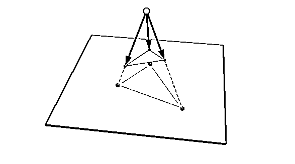
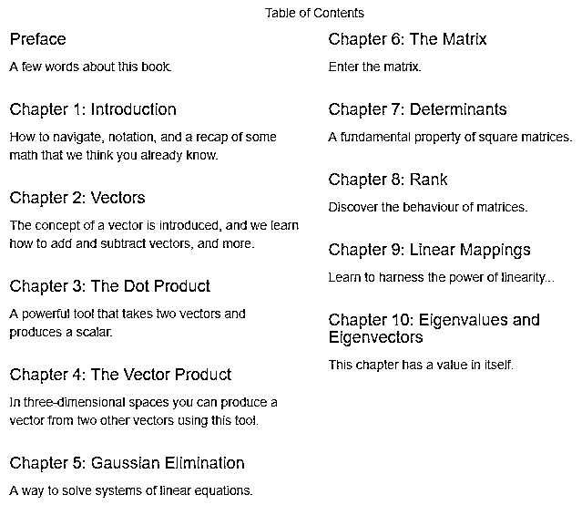
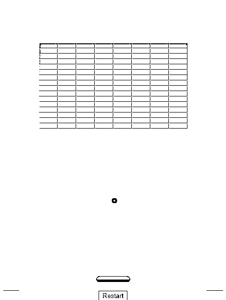
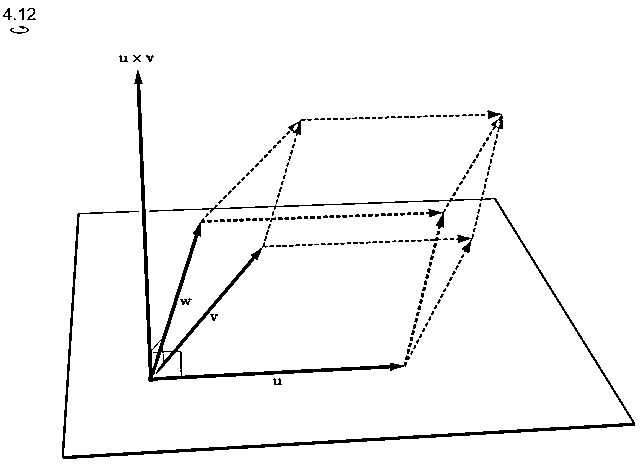
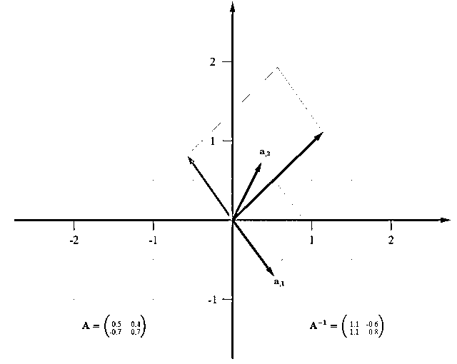
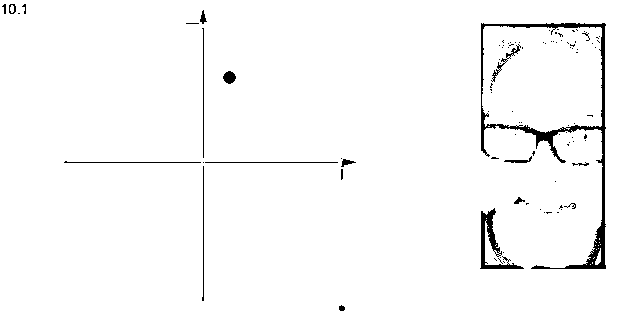

# 全交互式学习线性代数！机器学习的基本功啊啊啊~

> 原文：[`mp.weixin.qq.com/s?__biz=MzAxNTc0Mjg0Mg==&mid=2653292273&idx=1&sn=b165ad74916ce488462f383fdc90cdd1&chksm=802dc4e4b75a4df226054f60fb42f194bb39c0c348fbb63c76f1954cbdc9a2dd2aa1459308a0&scene=27#wechat_redirect`](http://mp.weixin.qq.com/s?__biz=MzAxNTc0Mjg0Mg==&mid=2653292273&idx=1&sn=b165ad74916ce488462f383fdc90cdd1&chksm=802dc4e4b75a4df226054f60fb42f194bb39c0c348fbb63c76f1954cbdc9a2dd2aa1459308a0&scene=27#wechat_redirect)

**标星★公众号     **爱你们♥

作者：红色石头

来自：AI 有道

**近期原创文章：**

## ♥ [基于无监督学习的期权定价异常检测（代码+数据）](https://mp.weixin.qq.com/s?__biz=MzAxNTc0Mjg0Mg==&mid=2653290562&idx=1&sn=dee61b832e1aa2c062a96bb27621c29d&chksm=802dc257b75a4b41b5623ade23a7de86333bfd3b4299fb69922558b0cbafe4c930b5ef503d89&token=1298662931&lang=zh_CN&scene=21#wechat_redirect)

## ♥ [5 种机器学习算法在预测股价的应用（代码+数据）](https://mp.weixin.qq.com/s?__biz=MzAxNTc0Mjg0Mg==&mid=2653290588&idx=1&sn=1d0409ad212ea8627e5d5cedf61953ac&chksm=802dc249b75a4b5fa245433320a4cc9da1a2cceb22df6fb1a28e5b94ff038319ae4e7ec6941f&token=1298662931&lang=zh_CN&scene=21#wechat_redirect)

## ♥ [深入研读：利用 Twitter 情绪去预测股市](https://mp.weixin.qq.com/s?__biz=MzAxNTc0Mjg0Mg==&mid=2653290402&idx=1&sn=efda9ea106991f4f7ccabcae9d809e00&chksm=802e3db7b759b4a173dc8f2ab5c298ab3146bfd7dd5aca75929c74ecc999a53b195c16f19c71&token=1330520237&lang=zh_CN&scene=21#wechat_redirect)

## ♥ [Two Sigma 用新闻来预测股价走势，带你吊打 Kaggle](https://mp.weixin.qq.com/s?__biz=MzAxNTc0Mjg0Mg==&mid=2653290456&idx=1&sn=b8d2d8febc599742e43ea48e3c249323&chksm=802e3dcdb759b4db9279c689202101b6b154fb118a1c1be12b52e522e1a1d7944858dbd6637e&token=1330520237&lang=zh_CN&scene=21#wechat_redirect)

## ♥ [利用深度学习最新前沿预测股价走势](https://mp.weixin.qq.com/s?__biz=MzAxNTc0Mjg0Mg==&mid=2653290080&idx=1&sn=06c50cefe78a7b24c64c4fdb9739c7f3&chksm=802e3c75b759b563c01495d16a638a56ac7305fc324ee4917fd76c648f670b7f7276826bdaa8&token=770078636&lang=zh_CN&scene=21#wechat_redirect)

## ♥ [一位数据科学 PhD 眼中的算法交易](https://mp.weixin.qq.com/s?__biz=MzAxNTc0Mjg0Mg==&mid=2653290118&idx=1&sn=a261307470cf2f3e458ab4e7dc309179&chksm=802e3c93b759b585e079d3a797f512dfd0427ac02942339f4f1454bd368ba47be21cb52cf969&token=770078636&lang=zh_CN&scene=21#wechat_redirect)

## ♥ [基于 RNN 和 LSTM 的股市预测方法](https://mp.weixin.qq.com/s?__biz=MzAxNTc0Mjg0Mg==&mid=2653290481&idx=1&sn=f7360ea8554cc4f86fcc71315176b093&chksm=802e3de4b759b4f2235a0aeabb6e76b3e101ff09b9a2aa6fa67e6e824fc4274f68f4ae51af95&token=1865137106&lang=zh_CN&scene=21#wechat_redirect)

## ♥ [人工智能『AI』应用算法交易，7 个必踩的坑！](https://mp.weixin.qq.com/s?__biz=MzAxNTc0Mjg0Mg==&mid=2653289974&idx=1&sn=88f87cb64999d9406d7c618350aac35d&chksm=802e3fe3b759b6f5eca6e777364270cbaa0bf35e9a1535255be9751c3a77642676993a861132&token=770078636&lang=zh_CN&scene=21#wechat_redirect)

## ♥ [神经网络在算法交易上的应用系列（一）](https://mp.weixin.qq.com/s?__biz=MzAxNTc0Mjg0Mg==&mid=2653289962&idx=1&sn=5f5aa65ec00ce176501c85c7c106187d&chksm=802e3fffb759b6e9f2d4518f9d3755a68329c8753745333ef9d70ffd04bd088fd7b076318358&token=770078636&lang=zh_CN&scene=21#wechat_redirect)

## ♥ [预测股市 | 如何避免 p-Hacking，为什么你要看涨？](https://mp.weixin.qq.com/s?__biz=MzAxNTc0Mjg0Mg==&mid=2653289820&idx=1&sn=d3fee74ba1daab837433e4ef6b0ab4d9&chksm=802e3f49b759b65f422d20515942d5813aead73231da7d78e9f235bdb42386cf656079e69b8b&token=770078636&lang=zh_CN&scene=21#wechat_redirect)

## ♥ [如何鉴别那些用深度学习预测股价的花哨模型？](https://mp.weixin.qq.com/s?__biz=MzAxNTc0Mjg0Mg==&mid=2653290132&idx=1&sn=cbf1e2a4526e6e9305a6110c17063f46&chksm=802e3c81b759b597d3dd94b8008e150c90087567904a29c0c4b58d7be220a9ece2008956d5db&token=1266110554&lang=zh_CN&scene=21#wechat_redirect)

## ♥ [优化强化学习 Q-learning 算法进行股市](https://mp.weixin.qq.com/s?__biz=MzAxNTc0Mjg0Mg==&mid=2653290286&idx=1&sn=882d39a18018733b93c8c8eac385b515&chksm=802e3d3bb759b42d1fc849f96bf02ae87edf2eab01b0beecd9340112c7fb06b95cb2246d2429&token=1330520237&lang=zh_CN&scene=21#wechat_redirect)

**前言**

有一本非常棒的在线线性代数教程，名为**《Immersive Linear Algebra》**，该教材最大的特点就是可交互式。

当时这本书作者还没有更新完。撒花！时隔两个月之后，这本独具特色的线性代数教程终于完结了！下面，让我们一起来好好了解一下这本优秀的教程吧~

这份线性代数教程严格地说不是一本书，而是一份在线教程。首先放上该在线教程的阅读地址：

***http://immersivemath.com/ila/index.html***

**为什么写这本书？**

这本《Immersive Linear Algebra》的作者是 J. Ström, K. Åström 和 T. Akenine-Möller。关于为什么写这本书，作者是这样说的： 

“画中有千言万语”是一个常见的表达方式，而对于课本来说，通常情况下，一个图形或插图也可以取代大量的字。然而，我们相信一个互动的插图可以说得更多，这就是为什么我们决定围绕这些插图建立我们的线性代数书。我们相信这些数字使我们更容易和更快地消化和学习线性代数（对于许多其他的数学书籍来说，这也是如此）。此外，我们在书中添加了更多的功能（例如，常用线性代数术语的弹出窗口），我们相信这些功能将使阅读和理解变得更容易、更快。

我们认为这本书将使学习和教授线性代数变得更加容易。此外，移动设备和网络浏览器的技术已经超过了一定的门槛，所以这本书可以以一种非常新颖和创新的方式。这个想法是从每一章开始，用一个直观具体的例子来说明数学是如何使用交互式插图工作的。在那之后，更正式的数学被引入，并且概念被普遍化，有时变得更抽象。我们相信，在每一章的开头，用一个简单而具体的例子巩固在读者的头脑中，更容易理解线性代数的整个主题。

**教程目录**

整本教程除了前言之外，总共包含 10 章内容。

完整目录如下：

*   前言

*   第一章：介绍

*   第二章：向量

*   第三章：点积

*   第四章：向量积

*   第五章：高斯消元

*   第六章：矩阵

*   第七章：行列式

*   第八章：秩

*   第九章：线性映射

*   第十章：特征值和特征向量

教程特色：

**1\. 动画演示**

本教程不是简单、枯燥的文字+公式组成，而是包含了大量生动有趣的动画演示，例如第二章中作者对向量的形象介绍：

向量是线性代数中最重要和最基本的概念之一。向量在我们周围，但一般来说，它们是不可见的。引入向量的常见方法是要么从严格的数学定义开始，要么讨论向量的例子，如速度、力、加速度等。为了更直观、更有希望更快地理解这个重要概念，本章从互动演示和清晰的可视化开始，看看什么是向量。在这种情况下，一个球的速度，由一个方向（球的运动方向）和一个速度（球的运动速度）组成，如下图所示：

再比如第四章关于向量积的动画演示：

通过形象的例子能够帮助你直观理解什么是向量，是不是很有意思呢。

**2\. 交互式**

这份线性代数教程不是单方面的你说我听的模式，而是一种交互式的学习方式。在阅读内容的时候，我们可以自己去移动其中的动图，变换参数，从不同的角度来理解其中的知识。

例如第六章，关于矩阵求它的逆矩阵，我们可以使用鼠标来更换不同的矩阵，程序动态显示它的逆矩阵。鼠标操作如下面的动图所示：

其实本教程还包含了一些非常有意思的例子。例如第十章中有一个生成新脸的操作，只需改变两个坐标，就可能改变嘴巴的位置，产生不同的表情。

关于该书籍的好玩之处，作者也做了一个简单的介绍视频：《沉浸式线性代数》简介

[`v.qq.com/iframe/preview.html?width=500&height=375&auto=0&vid=o0843skyo2c`](https://v.qq.com/iframe/preview.html?width=500&height=375&auto=0&vid=o0843skyo2c)

**结尾**

这本书通过可视化和动画演示，把线性代数讲解得非常生动和有趣，而且交互式得学习方式更能激发学习兴趣，提高学习效率。确实是一份不错的线性代数教程！ 

最后再放上这份教程的在线阅读地址：

***http://immersivemath.com/ila/index.html***

**MATLAB EXPO 2019 微信直播**

**免费！免费！免费！**

*—End—*

量化投资与机器学习微信公众号，是业内垂直于**Quant**、**MFE**、**CST**等专业的主流量化自媒体。公众号拥有来自**公募、私募、券商、银行、海外**等众多圈内**10W+**关注者。每日发布行业前沿研究成果和最新资讯。

