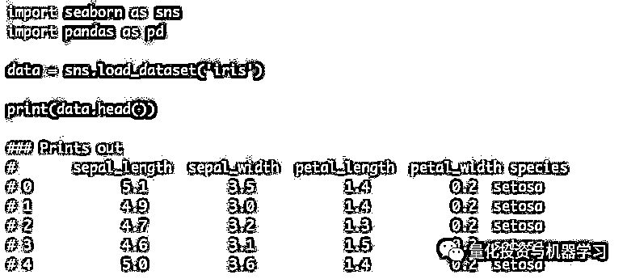
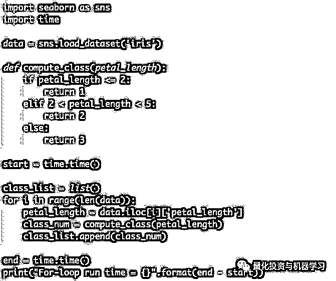
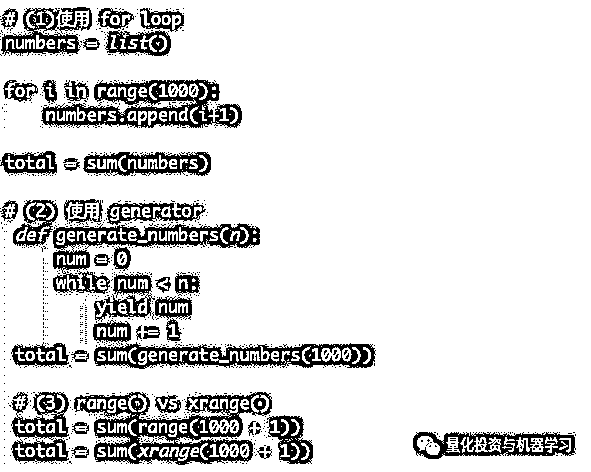
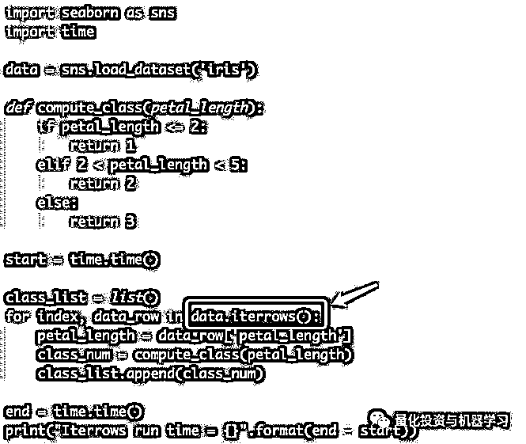
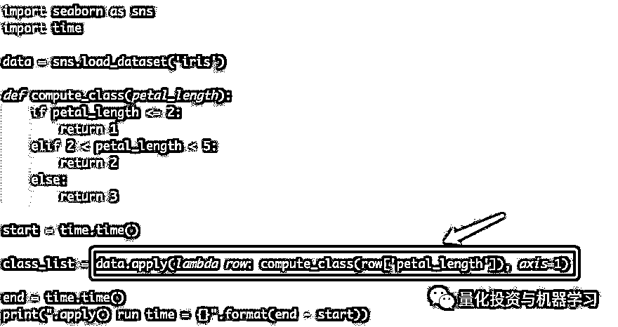
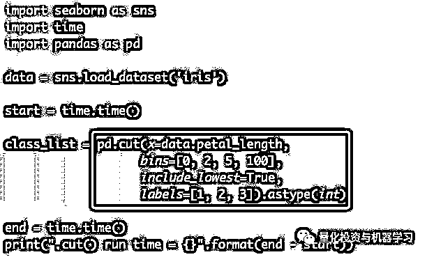

# 高逼格使用 Pandas 加速代码，向 for 循环说拜拜！

> 原文：[`mp.weixin.qq.com/s?__biz=MzAxNTc0Mjg0Mg==&mid=2653292258&idx=1&sn=d5d79cecb461eab3591ab8e3c2c03ce0&chksm=802dc4f7b75a4de195bcd6211ac8532d68096bef4d7ca0e5a4fcd792d1e2c7dd5bbea85f91cf&scene=27#wechat_redirect`](http://mp.weixin.qq.com/s?__biz=MzAxNTc0Mjg0Mg==&mid=2653292258&idx=1&sn=d5d79cecb461eab3591ab8e3c2c03ce0&chksm=802dc4f7b75a4de195bcd6211ac8532d68096bef4d7ca0e5a4fcd792d1e2c7dd5bbea85f91cf&scene=27#wechat_redirect)

**标星★公众号     **爱你们♥

作者：George Seif

编译：公众号翻译部

**近期原创文章：**

## ♥ [基于无监督学习的期权定价异常检测（代码+数据）](https://mp.weixin.qq.com/s?__biz=MzAxNTc0Mjg0Mg==&mid=2653290562&idx=1&sn=dee61b832e1aa2c062a96bb27621c29d&chksm=802dc257b75a4b41b5623ade23a7de86333bfd3b4299fb69922558b0cbafe4c930b5ef503d89&token=1298662931&lang=zh_CN&scene=21#wechat_redirect)

## ♥ [5 种机器学习算法在预测股价的应用（代码+数据）](https://mp.weixin.qq.com/s?__biz=MzAxNTc0Mjg0Mg==&mid=2653290588&idx=1&sn=1d0409ad212ea8627e5d5cedf61953ac&chksm=802dc249b75a4b5fa245433320a4cc9da1a2cceb22df6fb1a28e5b94ff038319ae4e7ec6941f&token=1298662931&lang=zh_CN&scene=21#wechat_redirect)

## ♥ [深入研读：利用 Twitter 情绪去预测股市](https://mp.weixin.qq.com/s?__biz=MzAxNTc0Mjg0Mg==&mid=2653290402&idx=1&sn=efda9ea106991f4f7ccabcae9d809e00&chksm=802e3db7b759b4a173dc8f2ab5c298ab3146bfd7dd5aca75929c74ecc999a53b195c16f19c71&token=1330520237&lang=zh_CN&scene=21#wechat_redirect)

## ♥ [Two Sigma 用新闻来预测股价走势，带你吊打 Kaggle](https://mp.weixin.qq.com/s?__biz=MzAxNTc0Mjg0Mg==&mid=2653290456&idx=1&sn=b8d2d8febc599742e43ea48e3c249323&chksm=802e3dcdb759b4db9279c689202101b6b154fb118a1c1be12b52e522e1a1d7944858dbd6637e&token=1330520237&lang=zh_CN&scene=21#wechat_redirect)

## ♥ [利用深度学习最新前沿预测股价走势](https://mp.weixin.qq.com/s?__biz=MzAxNTc0Mjg0Mg==&mid=2653290080&idx=1&sn=06c50cefe78a7b24c64c4fdb9739c7f3&chksm=802e3c75b759b563c01495d16a638a56ac7305fc324ee4917fd76c648f670b7f7276826bdaa8&token=770078636&lang=zh_CN&scene=21#wechat_redirect)

## ♥ [一位数据科学 PhD 眼中的算法交易](https://mp.weixin.qq.com/s?__biz=MzAxNTc0Mjg0Mg==&mid=2653290118&idx=1&sn=a261307470cf2f3e458ab4e7dc309179&chksm=802e3c93b759b585e079d3a797f512dfd0427ac02942339f4f1454bd368ba47be21cb52cf969&token=770078636&lang=zh_CN&scene=21#wechat_redirect)

## ♥ [基于 RNN 和 LSTM 的股市预测方法](https://mp.weixin.qq.com/s?__biz=MzAxNTc0Mjg0Mg==&mid=2653290481&idx=1&sn=f7360ea8554cc4f86fcc71315176b093&chksm=802e3de4b759b4f2235a0aeabb6e76b3e101ff09b9a2aa6fa67e6e824fc4274f68f4ae51af95&token=1865137106&lang=zh_CN&scene=21#wechat_redirect)

## ♥ [人工智能『AI』应用算法交易，7 个必踩的坑！](https://mp.weixin.qq.com/s?__biz=MzAxNTc0Mjg0Mg==&mid=2653289974&idx=1&sn=88f87cb64999d9406d7c618350aac35d&chksm=802e3fe3b759b6f5eca6e777364270cbaa0bf35e9a1535255be9751c3a77642676993a861132&token=770078636&lang=zh_CN&scene=21#wechat_redirect)

## ♥ [神经网络在算法交易上的应用系列（一）](https://mp.weixin.qq.com/s?__biz=MzAxNTc0Mjg0Mg==&mid=2653289962&idx=1&sn=5f5aa65ec00ce176501c85c7c106187d&chksm=802e3fffb759b6e9f2d4518f9d3755a68329c8753745333ef9d70ffd04bd088fd7b076318358&token=770078636&lang=zh_CN&scene=21#wechat_redirect)

## ♥ [预测股市 | 如何避免 p-Hacking，为什么你要看涨？](https://mp.weixin.qq.com/s?__biz=MzAxNTc0Mjg0Mg==&mid=2653289820&idx=1&sn=d3fee74ba1daab837433e4ef6b0ab4d9&chksm=802e3f49b759b65f422d20515942d5813aead73231da7d78e9f235bdb42386cf656079e69b8b&token=770078636&lang=zh_CN&scene=21#wechat_redirect)

## ♥ [如何鉴别那些用深度学习预测股价的花哨模型？](https://mp.weixin.qq.com/s?__biz=MzAxNTc0Mjg0Mg==&mid=2653290132&idx=1&sn=cbf1e2a4526e6e9305a6110c17063f46&chksm=802e3c81b759b597d3dd94b8008e150c90087567904a29c0c4b58d7be220a9ece2008956d5db&token=1266110554&lang=zh_CN&scene=21#wechat_redirect)

## ♥ [优化强化学习 Q-learning 算法进行股市](https://mp.weixin.qq.com/s?__biz=MzAxNTc0Mjg0Mg==&mid=2653290286&idx=1&sn=882d39a18018733b93c8c8eac385b515&chksm=802e3d3bb759b42d1fc849f96bf02ae87edf2eab01b0beecd9340112c7fb06b95cb2246d2429&token=1330520237&lang=zh_CN&scene=21#wechat_redirect)

***全网进行中···***

[***你为什么劝入/劝退 Quant？***](http://mp.weixin.qq.com/s?__biz=MzAxNTc0Mjg0Mg==&mid=2653292242&idx=1&sn=80bfe922d5f213f3ae82d5d9da7ae561&chksm=802dc4c7b75a4dd16c060b498e34bd1014c7744dd73b1bea2c793e5638dbfe5e3ef5c22cd70f&scene=21#wechat_redirect)

**前言**

使用 Pandas dataframe 执行数千甚至数百万次计算仍然是一项挑战。你不能简单的将数据丢进去，编写 Python for 循环，然后希望在合理的时间内处理数据。

Pandas 是为一次性处理整个行或列的矢量化操作而设计的，循环遍历每个单元格、行或列并不是它的设计用途。所以，在使用 Pandas 时，你应该考虑高度可并行化的矩阵运算。

本文将教你如何使用 Pandas 设计使用的方式，并根据矩阵运算进行思考。在此过程中，我们将向你展示一些实用的节省时间的技巧和窍门，**这些技巧和技巧将使你的 Pandas 代码比那些可怕的 Python for 循环更快地运行！**

**数据准备**

在本文中，我们将使用经典的鸢尾花数据集。

现在让我们建立一个标准线，用 Python for 循环来测量我们的速度。我们将通过循环遍历每一行来设置要在数据集上执行的计算，然后测量整个操作的速度。这将为我们提供一个基准，以了解我们的新优化对我们有多大帮助。

在上面的代码中，我们创建了一个基本函数，它使用 If-Else 语句根据花瓣的长度选择花的类。我们编写了一个 for 循环，通过循环 dataframe 对每一行应用函数，然后测量循环的总时间。

在 i7-8700k 计算机上，循环运行 5 次平均需要 0.01345 秒。

**使用.iterrows()**

我们可以做的最简单但非常有价值的加速是使用 Pandas 的内置 **.iterrows()** 函数。

在上一节中编写 for 循环时，我们使用了 range() 函数。然而，当我们在 Python 中对大范围的值进行循环时，生成器往往要快得多。

Pandas 的 .iterrows() 函数在内部实现了一个生成器函数，该函数将在每次迭代中生成一行 Dataframe。更准确地说，**.iterrows() 为 DataFrame 中的每一行生成(index, Series)的对（元组）**。这实际上与在原始 Python 中使用 enumerate() 之类的东西是一样的，但运行速度要快得多！

**生成器（Generators）**

生成器函数允许你声明一个行为类似迭代器的函数，也就是说，它可以在 for 循环中使用。这大大简化了代码，并且比简单的 for 循环更节省内存。

考虑这样一个例子，我们想把 1 到 1000 之间的所有数字加起来。下面代码的第一部分说明了如何使用 for 循环来实现这一点。

如果列表很小，比如长度为 1000，那就很好了。当你想要处理一个庞大的列表时，比如 10 亿个浮点数，问题就出现了。使用 for 循环，在内存中创建了大量的内存 huge 列表，并不是每个人都有无限的 RAM 来存储这样的东西！Python 中的 range()函数也做同样的事情，它在内存中构建列表

代码的第(2)节演示了使用 Python 生成器对数字列表求和。生成器将创建元素并仅在需要时将它们存储在内存中。一次一个。这意味着，如果必须创建 10 亿个浮点数，那么只能一次将它们存储在内存中。Python 中的 xrange()函数使用生成器来构建列表。

也就是说，如果你想多次迭代列表并且它足够小以适应内存，那么使用 for 循环和 range 函数会更好。这是因为每次访问 list 值时，生成器和 xrange 都会重新生成它们，而 range 是一个静态列表，并且内存中已存在整数以便快速访问。

下面我们修改了代码，使用.iterrows()代替常规的 for 循环。在我上一节测试所用的同一台机器上，平均运行时间为 0.005892 秒，**速度提高了 2.28 倍！**

**使用.apply()**

iterrows()函数极大地提高了速度，但我们还远远没有完成。请始终记住，当使用为向量操作设计的库时，可能有一种方法可以在完全没有 for 循环的情况下最高效地完成任务。 

为我们提供此功能的 Pandas 功能是 **.apply()** 函数。**a****pply()函数接受另一个函数作为输入，并沿着 DataFrame 的轴（行、列等）应用它。在传递函数的这种情况下，lambda 通常可以方便地将所有内容打包在一起。**

在下面的代码中，我们已经完全用.apply()和 lambda 函数替换了 for 循环，打包所需的计算。这段代码的平均运行时间是 0.0020897 秒，**比原来的 for 循环快 6.44 倍。**

**apply()之所以快得多，是因为它在内部尝试遍历 Cython 迭代器。**如果你的函数针对 Cython 进行了优化，.apply()将使你的速度更快。额外的好处是，**使用内置函数可以生成更干净、更可读的代码！**

**最后**

前面我们提到过，如果你正在使用一个为向量化操作设计的库，你应该总是在没有 for 循环的情况下寻找一种方法来进行任何计算。

类似地，以这种方式设计的许多库，包括 Pandas，都将具有方便的内置函数，可以执行你正在寻找的精确计算，但速度更快。

Pandas 的 **.cut()** 函数将一组 bin 定义为输入，这些 bin 定义了 If-Else 的每个范围和一组标签。这与我们用 compute_class() 函数手动编写有完全相同的操作。

看下面的代码，看看.cut()是如何工作的。我们又一次得到了更干净、更可读的代码。最后，.cut()函数平均运行 0.001423 秒，**比原来的 for 循环快了 9.39 倍!**

***全网进行中···***

[***你为什么劝入/劝退 Quant？***](http://mp.weixin.qq.com/s?__biz=MzAxNTc0Mjg0Mg==&mid=2653292242&idx=1&sn=80bfe922d5f213f3ae82d5d9da7ae561&chksm=802dc4c7b75a4dd16c060b498e34bd1014c7744dd73b1bea2c793e5638dbfe5e3ef5c22cd70f&scene=21#wechat_redirect)

*—End—*

量化投资与机器学习微信公众号，是业内垂直于**Quant**、**MFE**、**CST**等专业的量化主流自媒体。公众号拥有来自**公募、私募、券商、银行、海外**等众多圈内**10W+**关注者。每日发布行业前沿研究成果和最新资讯。

