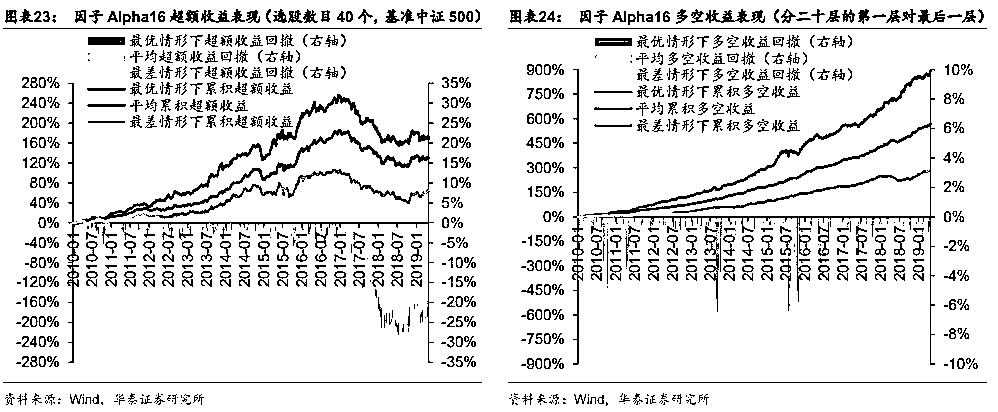
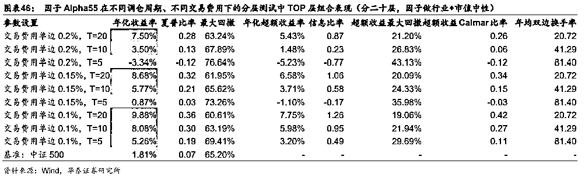

# 一百零一、因子新测评，会有哪些新发现？

> 原文：[`mp.weixin.qq.com/s?__biz=MzAxNTc0Mjg0Mg==&mid=2653292228&idx=1&sn=ac38081db0fec913a5bd78c069a55a58&chksm=802dc4d1b75a4dc7dfc2a6cf176e59b5b380095383e3d6829cf75c6b7675980997dfe71c109f&scene=27#wechat_redirect`](http://mp.weixin.qq.com/s?__biz=MzAxNTc0Mjg0Mg==&mid=2653292228&idx=1&sn=ac38081db0fec913a5bd78c069a55a58&chksm=802dc4d1b75a4dc7dfc2a6cf176e59b5b380095383e3d6829cf75c6b7675980997dfe71c109f&scene=27#wechat_redirect)

**标星★公众号     **爱你们♥

来自：华泰金工团队

**近期原创文章：**

## ♥ [基于无监督学习的期权定价异常检测（代码+数据）](https://mp.weixin.qq.com/s?__biz=MzAxNTc0Mjg0Mg==&mid=2653290562&idx=1&sn=dee61b832e1aa2c062a96bb27621c29d&chksm=802dc257b75a4b41b5623ade23a7de86333bfd3b4299fb69922558b0cbafe4c930b5ef503d89&token=1298662931&lang=zh_CN&scene=21#wechat_redirect)

## ♥ [5 种机器学习算法在预测股价的应用（代码+数据）](https://mp.weixin.qq.com/s?__biz=MzAxNTc0Mjg0Mg==&mid=2653290588&idx=1&sn=1d0409ad212ea8627e5d5cedf61953ac&chksm=802dc249b75a4b5fa245433320a4cc9da1a2cceb22df6fb1a28e5b94ff038319ae4e7ec6941f&token=1298662931&lang=zh_CN&scene=21#wechat_redirect)

## ♥ [深入研读：利用 Twitter 情绪去预测股市](https://mp.weixin.qq.com/s?__biz=MzAxNTc0Mjg0Mg==&mid=2653290402&idx=1&sn=efda9ea106991f4f7ccabcae9d809e00&chksm=802e3db7b759b4a173dc8f2ab5c298ab3146bfd7dd5aca75929c74ecc999a53b195c16f19c71&token=1330520237&lang=zh_CN&scene=21#wechat_redirect)

## ♥ [Two Sigma 用新闻来预测股价走势，带你吊打 Kaggle](https://mp.weixin.qq.com/s?__biz=MzAxNTc0Mjg0Mg==&mid=2653290456&idx=1&sn=b8d2d8febc599742e43ea48e3c249323&chksm=802e3dcdb759b4db9279c689202101b6b154fb118a1c1be12b52e522e1a1d7944858dbd6637e&token=1330520237&lang=zh_CN&scene=21#wechat_redirect)

## ♥ [利用深度学习最新前沿预测股价走势](https://mp.weixin.qq.com/s?__biz=MzAxNTc0Mjg0Mg==&mid=2653290080&idx=1&sn=06c50cefe78a7b24c64c4fdb9739c7f3&chksm=802e3c75b759b563c01495d16a638a56ac7305fc324ee4917fd76c648f670b7f7276826bdaa8&token=770078636&lang=zh_CN&scene=21#wechat_redirect)

## ♥ [一位数据科学 PhD 眼中的算法交易](https://mp.weixin.qq.com/s?__biz=MzAxNTc0Mjg0Mg==&mid=2653290118&idx=1&sn=a261307470cf2f3e458ab4e7dc309179&chksm=802e3c93b759b585e079d3a797f512dfd0427ac02942339f4f1454bd368ba47be21cb52cf969&token=770078636&lang=zh_CN&scene=21#wechat_redirect)

## ♥ [基于 RNN 和 LSTM 的股市预测方法](https://mp.weixin.qq.com/s?__biz=MzAxNTc0Mjg0Mg==&mid=2653290481&idx=1&sn=f7360ea8554cc4f86fcc71315176b093&chksm=802e3de4b759b4f2235a0aeabb6e76b3e101ff09b9a2aa6fa67e6e824fc4274f68f4ae51af95&token=1865137106&lang=zh_CN&scene=21#wechat_redirect)

## ♥ [人工智能『AI』应用算法交易，7 个必踩的坑！](https://mp.weixin.qq.com/s?__biz=MzAxNTc0Mjg0Mg==&mid=2653289974&idx=1&sn=88f87cb64999d9406d7c618350aac35d&chksm=802e3fe3b759b6f5eca6e777364270cbaa0bf35e9a1535255be9751c3a77642676993a861132&token=770078636&lang=zh_CN&scene=21#wechat_redirect)

## ♥ [神经网络在算法交易上的应用系列（一）](https://mp.weixin.qq.com/s?__biz=MzAxNTc0Mjg0Mg==&mid=2653289962&idx=1&sn=5f5aa65ec00ce176501c85c7c106187d&chksm=802e3fffb759b6e9f2d4518f9d3755a68329c8753745333ef9d70ffd04bd088fd7b076318358&token=770078636&lang=zh_CN&scene=21#wechat_redirect)

## ♥ [预测股市 | 如何避免 p-Hacking，为什么你要看涨？](https://mp.weixin.qq.com/s?__biz=MzAxNTc0Mjg0Mg==&mid=2653289820&idx=1&sn=d3fee74ba1daab837433e4ef6b0ab4d9&chksm=802e3f49b759b65f422d20515942d5813aead73231da7d78e9f235bdb42386cf656079e69b8b&token=770078636&lang=zh_CN&scene=21#wechat_redirect)

## ♥ [如何鉴别那些用深度学习预测股价的花哨模型？](https://mp.weixin.qq.com/s?__biz=MzAxNTc0Mjg0Mg==&mid=2653290132&idx=1&sn=cbf1e2a4526e6e9305a6110c17063f46&chksm=802e3c81b759b597d3dd94b8008e150c90087567904a29c0c4b58d7be220a9ece2008956d5db&token=1266110554&lang=zh_CN&scene=21#wechat_redirect)

## ♥ [优化强化学习 Q-learning 算法进行股市](https://mp.weixin.qq.com/s?__biz=MzAxNTc0Mjg0Mg==&mid=2653290286&idx=1&sn=882d39a18018733b93c8c8eac385b515&chksm=802e3d3bb759b42d1fc849f96bf02ae87edf2eab01b0beecd9340112c7fb06b95cb2246d2429&token=1330520237&lang=zh_CN&scene=21#wechat_redirect)

**往期 101 因子获取**

之前公众号分享过网友自行编写的**WorldQuant 101 因子源代码**，大家有需要可以点击链接进行免费获取。

**[WorldQuant 101 Alpha、国泰君安 191 Alpha（源码分享）](http://mp.weixin.qq.com/s?__biz=MzAxNTc0Mjg0Mg==&mid=2653290927&idx=1&sn=ecca60811da74967f33a00329a1fe66a&chksm=802dc3bab75a4aac2bb4ccff7010063cc08ef51d0bf3d2f71621cdd6adece11f28133a242a15&scene=21#wechat_redirect)**

**摘要**

**本****文对 101 个技术因子进行测试，其中存在具备长期稳定选股能力的因子。**

本文测试的 101 个技术因子**均是由价量数据计算得来**的，有些因子的构建公式较为复杂，难以直观理解其中蕴含的逻辑。我们对不同调仓周期、不同因子处理方式、不同回测区间下的因子测试结果进行对比，筛选出 7 个比较有效的因子， 4 个常见风格因子（对数总市值、过去 20 日收益率、过去 20 日平均换手率、过去 20 日波动率）进行对比，发现筛选出的因子具有长期稳定选股能力，IC_IR（信息比率）值明显高于 4 个风格因子。观察这些因子的计算公式发现，它们的构建逻辑比较类似，都是**选择****存在价量背离现象的个股**。

**因子处理方式、调仓周期的改变会对测试结果造成一定影响**

在本文测试的技术因子中，大部分选股效果较好的因子在做行业及市值中性处理时 IC_IR 值较高，说明剔除了行业、市值这两个最重要的风险因素后因子效果得到了普遍提升。我们筛选出的 7 个有效因子的 Rank IC 衰减速度都与过去 20 日收益率因子相当或稍慢一些，而过去 20 日收益率因子是比较传统的适于月频调仓的因子，因此可以推测这 7 个有效因子也适于月频调仓。实际上，通过分层测试法可以证实这 7 个因子确实都比较适合月频调仓，其中也存在 2 个因子同时适合月频或双周频调仓。这些因子在周频调仓设置下受到过高的交易成本影响，效果有所降低。

**筛选出的 7 个因子头部选股能力均有限，构建组合时需配置适量数目个股**

为了考察因子的头部选股能力，我们将所有个股按截面因子值排序，选前 j 只股票等权配置构建投资组合，j 取值范围为 10～1500。测试结果显示，在达到年化收益率最高时，因子 Alpha3，13，15，16，44，50，55 的最优 j 取值分别为 400，80，80，40，200，80，400，说明这些因子在只选取头部少量个股时效果均达不到最优，需选取适量股票构建较为稳健、分散的投资组合。并且，这些因子头部组合的超额收益并不是十分稳定，而多空收益则稳定得多，说明因子多空收益的良好表现部分源于空头组合，而 A 股市场很难做空个股，所以要理性看待。

**筛选出的 7 个因子构建逻辑类似，都是选择存在价量背离现象的个股**

我们筛选出的 7 个有效因子构建逻辑比较类似，核心算法都是 f(X,Y,d)，其中函数 f 为计算相关系数或协方差的函数，变量 X 为日频价格数据，变量 Y 为日频交易量数据，d 是一个取值在 3～10 之间的常数。f(X,Y,d)的作用在于探查个股在过去 d 个交易日的价量联动或背离属性，结合测试结果来看，这些因子的逻辑都是选择存在价量背离现象的个股。实际上，这些因子的计算公式都是比较简洁、易理解的，说明因子的构建方式并不是越复杂越好，我们在挖掘因子的过程中也可以借鉴本文待测因子中比较好的选股逻辑，通过替换变量、函数等方式获得属于自己的 Alpha 因子。

风险提示：单因子测试结果是历史经验的总结，如果市场环境改变，存在失效的可能。本文仅对因子在全部 A 股内的选股效果进行测试，测试结果不能直接推广到其它股票池内。技术因子的构建方式比较复杂，其中一些因子的构建逻辑难以解释，使用需谨慎。

**技术因子的选取及测试框架**

**技术因子的选取**

本文是华泰多因子系列研究第十一篇，是单因子测试系列的第九篇。在多因子系列首篇报告中，我们系统地阐述了多因子模型的基本理论，详细描述了多因子模型构建的流程，在多因子系列第二篇到第九篇报告中，我们分别对估值、成长、动量反转、换手率、波动率、资金流向、财务质量、一致预期类因子单独进行详细的研究和检验，通过综合对比评价，筛选出能持续获得稳健收益的优质因子，这正是构建多因子选股模型的关键一步。在多因子系列第十篇报告中，我们对因子合成环节进行了一些粗浅的探讨，本报告作为该系列第十一篇，我们将视角移回单因子测试环节，将主要针对 101 个技术因子（下文将该待测因子集简称为“101 技术因子”）进行分析测试，通过回归法、IC 值分析、分层测试法等方法检验各因子的有效性，并试图对某些有效因子的逻辑进行解释。

本文将要测试的 101 个因子计算公式详见图表 2～4，它们大多是由日频的价量数据计算得来，有些因子的构建公式较为复杂，难以直观理解其中的构建逻辑。这一点与多因子系列前作中涉及的风格因子有较大区别，之前测试的估值、成长、波动率等因子可以认为是投资者经验的演绎，“先有逻辑、后有公式”；本文中待测因子则是通过一些技术手段生成的，需要通过检验确定这些因子的有效性，再试图去解释其中一些有效因子的内涵，“先有公式、后有逻辑”。以上两种方式对应于选股方法中的“演绎法”与“归纳法”，都有一定的存在基础，本文中我们就要对这 101 个技术因子进行详细分析，从中挖掘出适用于 A 股市场的选股因子。这些因子构建公式中涉及的变量、函数、算符定义如图表 1 所示。

**技术因子的测试框架**

101 技术因子是基于价量数据计算的，因子值变化比较快，一般而言因子有效时间也比较短。本报告选择 5、10、20 个交易日作为持仓周期，分别用回归法、IC 值分析法对这 101 个因子进行测试并进行初步筛选，再用分层测试法对重点因子进行回测，主要观察 TOP 组的表现，最后将几种测试方法的结果综合对比筛选出有效因子，并试图对其中的构建逻辑进行解释。

**技术因子与传统价量因子的相关性**

我们将全回测期切分为三个时间阶段，时间阶段 1（2010/1/4～2015/6/12）对应 2010 年初至 2015 年中，时间阶段 2（2015/6/15～2016/12/30）对应 2015 年中至 2016 年底，时间阶段 3（2017/1/3～2019/4/30）对应 2017 年初至回测期末。我们分别计算 101 技术因子与对数总市值、过去 20 日收益率、过去 20 日平均换手率、过去 20 日波动率因子的日频截面因子值相关系数，并在三个时间阶段内分别求平均值，如下表所示（若某因子在任一时间阶段与任一因子的相关系数均值都不大于 0.2，则略去不展示）。

三个阶段内因子相关情况大体一致、细节略有不同。实际上，大部分因子与 4 个传统价量因子相关性都不大，可与后文因子测试结果形成参考对照。

**单因子测试方法简介及结果分析**

在多因子系列首篇报告《华泰多因子模型体系初探》（2016.09）中，我们系统地介绍了有效因子识别（即单因子测试）的理论基础和研究思路，在多因子系列第二篇报告《华泰单因子测试之估值类因子》中我们着眼于实践过程，给出了详细的流程操作说明。之后的第三至第六篇报告中均沿用第二篇报告的测试方法。在第七篇报告中，由于资金流向因子适于更短持仓周期，我们将月调仓改为 10 日调仓，其余测试细节保持不动。本报告中 101 技术因子的属性与测试细节与资金流向因子相仿，为避免阅读障碍，我们此处将单因子详细测试流程再复述一遍。

**单因子测试方法简介**

**回归法**

回归法是一种最常用的测试因子有效性的方法，具体做法是将第 T+1 期的因子暴露度向量与期的股票收益向量进行线性回归，所得到的回归系数即为因子在期的因子收益率，同时还能得到该因子收益率在本期回归中的显著度水平——t 值。在某截面期上的个股的因子暴露度（Factor Exposure）即指当前时刻个股在该因子上的因子值。第期的回归模型具体表达式如下。

在所有截面期上，我们对 T+1 回归测试，能够得到该因子的因子收益率序列（即所有截面期回归系数构成的序列）和对应的 t 值序列。t 值指的是对单个回归系数的 t 检验统计量，描述的是单个变量显著性，t 值的绝对值大于临界值说明该变量是显著的，即该解释变量（期个股在暴露度）是真正影响因变量（期个股收益率）的一个因素。也就是说，在每个截面期上，对于每个因子的回归方程，我们设：

该假设检验对应的 t 统计量为

其中 SE(a^T)代表回归系数 a^T 的标准差的无偏估计量。一般 t 值绝对值大于 2 我们就认为本期回归系数 a^T 是显著异于零的（也就是说，本期因子 X 对下期收益率具有显著的解释作用）。注意，我们在回归模型中加入了市值、行业因子，能在一定程度上规避市值、行业因素对财务质量因子的影响。

回归模型构建方法如下：

1、股票池：全 A 股，剔除 ST、PT 股票，剔除每个截面期下一交易日停牌的股票。

2、回溯区间：2010/1/4～2019/4/30。

3、截面期：每个交易日作为截面期计算因子值，与该截面期之后 5、10、20 个交易日内个股收益进行回归。

4、数据处理方法： 

a) 因子计算方法详见图表 1～4；

b) 中位数去极值：设第 T 期某因子在所有个股上的暴露度向量为 D_i，D_M 为该向量中位数，D_M1 为向量|D_i - D_M|的中位数，则将向量 D_i 中所有大于|D_M +5D_M1|的数重设为 D_i +5D_M1，将向量 D_i 中所有小于 D_M -5D_M1 的数重设为 D_M -5D_M1； 

c) 中性化：以行业及市值中性化为例，在第 T 期截面上用因子值（已去极值）做因变量、对数总市值因子（已去极值）及全部行业因子（0/1 哑变量）做自变量进行线性回归，取残差作为因子值的一个替代，这样做可以消除行业和市值因素对因子的影响；

d) 标准化：将经过以上处理后的因子暴露度序列减去其现在的均值、除以其标准差，得到一个新的近似服从 N(0,1)分布的序列，这样做可以让不同因子的暴露度之间具有可比性； 

e) 缺失值处理：因本文主旨为单因子测试，为了不干扰测试结果，如文中未特殊指明均不填补缺失值（在构建完整多因子模型时需考虑填补缺失值）。

5、回归权重：由于普通最小二乘回归（OLS）可能会夸大小盘股的影响（因为小盘股的财务质量因子出现极端值概率较大，且小盘股数目很多，但占全市场的交易量比重较小），并且回归可能存在异方差性，故我们参考 Barra 手册，采用加权最小二乘回归（WLS），使用个股流通市值的平方根作为权重，此举也有利于消除异方差性。

6、因子评价方法：

a) t 值序列绝对值均值——因子显著性的重要判据；

b) t 值序列绝对值大于 2 的占比——判断因子的显著性是否稳定；

c) t 值序列均值——与 a)结合，能判断因子 t 值正负方向是否稳定；

d) 因子收益率序列均值——判断因子收益率的大小。

**IC 值分析法**

因子的 IC 值是指因子在第 T 期的暴露度向量与 T+1 期的股票收益向量的相关系数，即

上式中因子暴露度向量 X^T 一般不会直接采用原始因子值，而是经过去极值、中性化等手段处理之后的因子值。在实际计算中，使用 Pearson 相关系数可能受因子极端值影响较大，使用 Spearman 秩相关系数则更稳健一些，这种方式下计算出来的 IC 一般称为 Rank IC。 

IC 值分析模型构建方法如下：

1、股票池、回溯区间、截面期均与回归法相同。

2、先将因子暴露度向量进行一定预处理（下文中会指明处理方式），再计算处理后的 T 期因子暴露度向量和 T+1 期股票收益向量的 Spearman 秩相关系数，作为 T 期因子 Rank IC 值。

3、因子评价方法： 

a)      Rank IC 值序列均值——因子显著性；

b)      Rank IC 值序列标准差——因子稳定性；

c)      IC_IR（Rank IC 值序列均值与标准差的比值）——因子有效性；

d)      Rank IC 值序列大于零的占比——因子作用方向是否稳定。

**分层回测法**

依照因子值对股票进行打分，构建投资组合回测，是最直观的衡量因子优劣的手段。分层测试法与回归法、IC 值分析相比，能够发掘因子对收益预测的非线性规律。也即，若存在一个因子分层测试结果显示，其 Top 组和 Bottom 组的绩效长期稳定地差于 Middle 组，则该因子对收益预测存在稳定的非线性规律，但在回归法和 IC 值分析过程中很可能被判定为无效因子。

分层测试模型构建方法如下：

1、股票池、回溯区间、截面期均与回归法相同。

2、换仓：在每个截面期核算因子值，构建分层组合，在截面期下一个交易日按当日收盘价换仓，交易费用默认为单边 0.15%。

3、分层方法：先将因子暴露度向量进行一定预处理（下文中会指明处理方式），将股票池内所有个股按处理后的因子值从大到小进行排序，等分 N 层，每层内部的个股等权重配置。当个股总数目无法被 N 整除时采用任一种近似方法处理均可，实际上对分层组合的回测结果影响很小。

4、多空组合收益计算方法：用 Top 组每天的收益减去 Bottom 组每天的收益，得到每日多空收益序列 r_1, r_2, r_3,...r_n，则多空组合在第 n 天的净值等于(1+r_1)(1+r_2)(1+r_3)...(1+r_n)。

5、评价方法：全部 N 层组合年化收益率（观察是否单调变化），多空组合的年化收益率、夏普比率、最大回撤、月胜率等。

**三种方法的关系**

首先介绍一下回归法和 IC 值分析法之间的关系。

我们先介绍一个引理。设 X,Y 为两个向量，则[corr(X,Y)]²=R²，其中 R² 为线性回归 Y=aX + b 或线性回归 X=aY+b 的可决系数（其中 a, b 是待回归系数）。

如果我们在单因子测试（线性回归法）中使用模型

（r 是股票收益率，X 是因子暴露度，c 是常数项，c 可以理解为市场因子）并且假设我们在计算因子 IC 值的时候，不预先对因子暴露度进行市值、行业调整了，就使用原始的因子暴露度 X，则本期因子 IC 值为 corr(X, r)，根据引理，因子 IC 值的平方就等于单因子测试的回归模型的 R²。

所以，因子 IC 值本质上反映的是下期收益率和本期因子暴露度的线性相关程度（R² 的平方根），是使用该因子预测收益率的稳健性（IC 值越大，这个因子的收益越稳定，波动越小）；而回归法中计算出的因子收益率本质上是一个斜率，反映的是从该因子可能获得的收益率的大小，这并不能说明任何关于线性拟合优度的信息（也就是说，因子收益率很大时，也可能出现 R² 很小的情形）；至于回归法中计算出的 t 值，在一元线性回归中 t 值与 R² 反映的信息一致（二者对应关系为，当 R²=0 时 t 值也为 0，当 R²=1 时 t 值为无穷大），但是由于我们所采用的回归模型包括了行业变量，所以 t 值仅代表被测因子对股票收益的解释能力（而不能代表模型的整体拟合优度）。实际计算过程中因子会进行一些预处理，回归方程也有可能引入其它风格变量使其表达形式更复杂，导致 IC 值和 t 值无法理论上互推，但前面所述结论的本质不变。

总结一下，IC 值反映模型整体线性拟合优度，t 值反映被测单因子对模型的解释能力是否显著，因子收益率与前两者差别较大，它反映的是可能获得的收益率的大小，而对这个收益是否稳健未知。

其次介绍一下回归法和分层测试法之间的关系。

假设本期因子值与下期收益完全线性相关，满足。此时 IC 值绝对值为 1，回归法中的因子收益率为。并且假设本期因子值 X 服从[0,1]均匀分布，那么当按因子从小到大等分 N 层测试时，第 i 层组合的下期收益为，多空收益（第 N 层收益减去第 1 层收益）为，也即说明分层测试法中的多空收益与回归法中的因子收益率具有一定程度的等价关系。实际上因子 IC 值大部分在 0.1 附近波动，所以回归拟合的因子收益率与分层测试下的多空收益也未必完全一致。

**单因子回归法与 IC 值测试结果分析**

首先，我们将展示图表 2～4 中的 101 技术因子的单因子回归法与 IC 值测试结果，并挑选出表现较好的因子进行详细展示。101 技术因子都是基于价量数据计算的，与基本面类因子从逻辑和性质上都有较大区别，能与 101 技术因子类比的常见风格因子为动量反转、换手率、波动率因子。在《华泰单因子测试之财务质量因子》中，我们曾对常见风格因子在沪深 300 成分股、中证 500 成分股、全 A 股票池中分别进行测试对比，发现价量类因子一般在全 A 股票池中选股效果较好，而在沪深 300 成分股、中证 500 成分股票池中效果稍弱。实际上，这也与投资者的应用场景是相符的，一般来讲，中大盘股的量化选股模型更加依赖财务数据，小盘股或全市场量化选股模型更加依赖价量数据。所以本文中我们只展示在全 A 股票池中 101 技术因子的测试结果。

我们将调仓频率记为 T（单位：交易日），当 T=20 且所有因子暂不做任何中性化处理时，所有因子的回归法、IC 值分析结果如下图所示。由于因子数目较多，这里只节选展示 IC_IR 值在 0.3 以上的因子，并与四个常见风格因子（对数总市值、过去 20 日收益率、过去 20 日平均换手率、过去 20 日波动率）的测试结果进行对比。101 技术因子中有 89 个在全回测期内的 Rank IC 均值是正数，有 12 个 Rank IC 均值是负数但绝对值都比较小，且 IC_IR 绝对值都小于 0.3（不足以进入下表的展示范围）。我们选做对照组的 4 个常见风格因子都是负向的，此处先对因子值乘以-1 之后再进行测试。另外一点需要说明的是，为了使测试结果更加客观，我们以回测期内每个交易日作为截面，与未来 T 日（下表中 T=20）的个股收益向量做回归或计算 IC 值，这样得到的测试结果不存在“路径依赖”现象。

我们对上表中排名前 7 位的因子（Alpha3，13，15，16，44，50，55）与 4 个对照因子计算日频 Rank IC 累积曲线并作图如下。从下图中可以看出，4 个对照因子的 Rank IC 最终累积值比较大，但是波动也比较大，排名前七位的 101 技术因子 Rank IC 累积曲线则要更加稳定一些，并在全回测期内都没发生明显回撤。这与上表的测试结果可以互相对照来看，排名前 7 位的 101 技术因子虽然 Rank IC 均值不如 4 个对照因子，但 IC_IR 是明显优于 4 个对照因子的。

**改变因子处理方式及调仓周期对测试结果的影响**

图表 7 中展示了 T=20 且因子不做中性化处理的测试结果，那么当改变因子处理方式及调仓周期时，因子的测试结果会发生怎样的改变？在接下来的测试中，我们取了三种可能的 T 值——20、10、5，分别对应于月频、双周频、周频调仓；同时取了四种可能的因子处理方式——不做中性化处理、仅做行业中性处理、同时做行业及市值中性处理、同时做行业及 4 个常见风格因子中性处理，其中 4 个常见风格因子即指图表 7 中最后 4 行的对照因子。我们在图表 9、10 中展示了以上 12 种情形下的因子 IC_IR 值（图表 9 对应全回测期的测试结果，图表 10 对应 2017 年初至回测期末的测试结果）。我们按每个因子在 12 种情形下的 IC_IR 最大值进行排序，选取前 50 名进行节选展示。

图表 9、10 中排序比较靠前的因子基本是一致的，说明这些因子没有因为 2017 年市场投资风格的改变而失效。大部分排序靠前的因子都是在因子做行业及市值中性处理时 IC_IR 值最高，说明剔除了行业、市值这两个最重要的风险因素后因子效果得到了普遍提升。在同时做行业及 4 个常见风格因子中性处理时，有些因子的效果下降比较多（比如 Alpha27），说明这些因子的选股效果部分来源于 4 个常见风格因子，对风格因子做中性处理之后剩余的信息量减少明显。

我们在图表 9、10 中展示的 IC_IR 值都是非年化的，因此 T=20、10、5 时的 IC_IR 值无法形成直接比较。IC_IR 的年化公式是用原始 IC_IR 值乘以根号下 240/T，但 IC_IR 年化值仅在因子 IC 无衰减时具有比较意义（详见 Qian 等 2007 年的文章《Information Horizon，Portfolio Turnover，and Optimal Alpha Models》），我们将在下一小节中对排序靠前的因子的 IC 衰减效应进行测试，可以发现这些因子的 IC 衰减还是比较快的，与 20 日反转因子大致相当。在实际使用这些因子构建投资组合时，还需考虑调仓成本问题，T 取值越小可能面临的调仓成本越大，在下下小节中我们会对排序靠前的因子进行分层测试，届时会涉及调仓成本的研究。

下面两图中，我们分别对因子 Alpha13 在不同因子处理方式下、在不同调仓周期下 Rank IC 值累积曲线进行展示。可以发现，曲线最终值稍有差别，但中间的变化趋势差别不大。请注意，根据前文的讨论，由于 IC 衰减现象的存在，不同调仓周期下 Rank IC 值的大小没有直接对比意义。 

**因子的 IC 衰减效应研究**

接下来，我们对图表 9、10 中排序靠前的因子的 IC 衰减效应进行研究，此处假定 T=20 且因子不进行中性化处理。

设因子在交易日 K 收盘截面上计算得到的因子值向量为 X^K，所有股票在 K 日之后 20 个交易日内的收益率向量为 r_K^{K+20}（该收益率由 K+20 交易日复权收盘价除以 K 交易日复权收盘价再减 1 得来），则因子在该截面上的 Rank IC 值为 X^K 和 r_K^{K+20}的 Spearman 秩相关系数。令 i=0,1,2,...,则 X^K 和 r_{K+i}^{K+20+i}的 Spearman 秩相关系数称为因子“滞后 i 期”的 Rank IC 值，随着 i 从 0 变化到 240，因子 Alpha3，13，15，16，44，50，55 与 4 个对照因子的“滞后 i 期”的 Rank IC 均值（对全回测期所有截面计算均值）变化曲线如下图所示。

半衰期可以更精细地刻画因子的衰减速度，我们此处通过两种方式计算因子的半衰期。第一种，由于 Rank IC 近似以指数形式衰减，我们用函数 y=c*e^{ax}去拟合上图曲线（a，c 是待拟合参数），从而计算半衰期。第二种，我们直接找到上图曲线中 Rank IC 值首次衰减到一半时的滞后期数作为因子的半衰期。观察下表所展示的结果，我们发现这 7 个 Alpha 因子的半衰期大致与对照因子中的过去 20 日收益率因子相当或稍长一些，而过去 20 日收益率因子是比较传统的适于月频调仓的因子，因此我们有理由推测这 7 个 Alpha 因子也比较适于月频调仓，在下一小节中，我们将通过分层测试等方法加以论证。

**有效因子的分层测试**

在前三个小节中，我们主要通过回归法、IC 值分析对 101 技术因子进行初筛，并选中了 7 个效果较好的因子，接下来我们将对这些因子逐个进行分层测试，考察它们在实际组合构建中的效果。在回测过程中，以某交易日收盘信息构建的分层组合，将在下个交易日以 vwap 价完成调仓，所有分层方式均为等权重等数量均分（按预处理后的因子值排序分层），每层组合内股票等权重配置。并且，下文中分层测试的结果均不存在“路径依赖”效应，我们以 T=20 为例说明构建方法：首先，在回测首个交易日 K_0 构建分层组合并完成建仓，然后分别在交易日 K_i,K_{i+20},K_{i+40},...按当日收盘信息重新构建分层组合并完成调仓，i 取值为 1～20 内的整数，则我们可以得到 20 个不同的回测轨道，在这 20 个回测结果中按不同评价指标（比如年化收益率、信息比率等）可以提取出最优情形、最差情形、平均情形等，以便我们对因子的分层测试结果形成更客观的认知。

**Alpha13 因子**

我们对因子 Alpha13 进行分层回测（分二十层），交易费用取为单边 0.15%，在全回测期内，我们统计了不同因子处理方式、不同调仓周期下的每层组合年化收益率均值（均值是指对 T 个不同的回测轨道取均值，详见图表 14 下方段落所述），如下图所示。

在不同调仓周期下，组合的年均换手率水平不同，因此交易成本设置方式可能会对回测结果产生比较大的影响。此处我们将交易费用分别取为单边 0.2%、0.15%、0.1%，TOP 层组合表现如下（TOP 层是指分二十层测试中的第一层，下表中所有值均为 T 个不同回测轨道的均值）。可以发现，在交易费用取为单边 0.1%时，三种调仓周期下 TOP 层表现比较接近，不过一般认为实际交易成本比单边 0.1%要大一些，因此对于因子 Alpha13 还是 T=20 或 10 的 TOP 层更有优势。

投资者往往更关注 Alpha 因子的头部选股能力。我们将所有个股按截面因子值排序，选前 j 只股票等权配置构建投资组合，交易成本、调仓周期等设置均与分层测试相仿，在 T=20 时对每个可能的 j 取值均能生成 20 个不同的回测轨道，我们取这 20 个回测轨道中的年化收益率最大值、平均值、最小值作图如下。可以发现，因子 Alpha13 在 j 大于等于 80 之后平均年化收益率比较稳定，我们将 j=80 情形下累积超额收益及回撤曲线展示在图表 18 中（基准为中证 500 指数）。同时，我们将多空组合的累积收益及回撤曲线展示在图表 19 中，其中多头、空头组合分别是指分二十层测试的第一层、最后一层。在图表 17～19 中参数设置方式为：交易费用单边 0.15%、T=20、因子做行业+市值中性处理。

**Alpha16 因子**

我们对因子 Alpha16 进行分层回测（分二十层），交易费用取为单边 0.15%，在全回测期内，我们统计了不同因子处理方式、不同调仓周期下的每层组合年化收益率均值（均值是指对 T 个不同的回测轨道取均值，详见图表 14 下方段落所述），如下图所示。

在不同调仓周期下，组合的年均换手率水平不同，因此交易成本设置方式可能会对回测结果产生比较大的影响。此处我们将交易费用分别取为单边 0.2%、0.15%、0.1%，TOP 层组合表现如下（TOP 层是指分二十层测试中的第一层，下表中所有值均为 T 个不同回测轨道的均值）。可以发现，在交易费用取为单边 0.1%时，三种调仓周期下 TOP 层表现比较接近，不过一般认为实际交易成本比单边 0.1%要大一些，因此对于因子 Alpha16 还是 T=20 的 TOP 层更有优势。

投资者往往更关注 Alpha 因子的头部选股能力。我们将所有个股按截面因子值排序，选前 j 只股票等权配置构建投资组合，交易成本、调仓周期等设置均与分层测试相仿，在 T=20 时对每个可能的 j 取值均能生成 20 个不同的回测轨道，我们取这 20 个回测轨道中的年化收益率最大值、平均值、最小值作图如下。可以发现，因子 Alpha16 在 j=40 时平均年化收益率最高，我们将 j=40 情形下累积超额收益及回撤曲线展示在图表 23 中（基准为中证 500 指数）。同时，我们将多空组合的累积收益及回撤曲线展示在图表 24 中，其中多头、空头组合分别是指分二十层测试的第一层、最后一层。在图表 22～24 中参数设置方式为：交易费用单边 0.15%、T=20、因子做行业+市值中性处理。

**Alpha50 因子**

我们对因子 Alpha50 进行分层回测（分二十层），交易费用取为单边 0.15%，在全回测期内，我们统计了不同因子处理方式、不同调仓周期下的每层组合年化收益率均值（均值是指对 T 个不同的回测轨道取均值，详见图表 14 下方段落所述），如下图所示。

在不同调仓周期下，组合的年均换手率水平不同，因此交易成本设置方式可能会对回测结果产生比较大的影响。此处我们将交易费用分别取为单边 0.2%、0.15%、0.1%，TOP 层组合表现如下（TOP 层是指分二十层测试中的第一层，下表中所有值均为 T 个不同回测轨道的均值）。可以发现，在交易费用取为单边 0.1%时，三种调仓周期下 TOP 层表现比较接近，不过一般认为实际交易成本比单边 0.1%要大一些，因此对于因子 Alpha50 还是 T=20 的 TOP 层更有优势。

投资者往往更关注 Alpha 因子的头部选股能力。我们将所有个股按截面因子值排序，选前 j 只股票等权配置构建投资组合，交易成本、调仓周期等设置均与分层测试相仿，在 T=20 时对每个可能的 j 取值均能生成 20 个不同的回测轨道，我们取这 20 个回测轨道中的年化收益率最大值、平均值、最小值作图如下。可以发现，因子 Alpha50 在 j=80 时平均年化收益率最高，我们将 j=80 情形下累积超额收益及回撤曲线展示在图表 28 中（基准为中证 500 指数）。同时，我们将多空组合的累积收益及回撤曲线展示在图表 29 中，其中多头、空头组合分别是指分二十层测试的第一层、最后一层。在图表 27～29 中参数设置方式为：交易费用单边 0.15%、T=20、因子做行业+市值中性处理。

**Alpha44 因子**

我们对因子 Alpha44 进行分层回测（分二十层），交易费用取为单边 0.15%，在全回测期内，我们统计了不同因子处理方式、不同调仓周期下的每层组合年化收益率均值（均值是指对 T 个不同的回测轨道取均值，详见图表 14 下方段落所述），如下图所示。

在不同调仓周期下，组合的年均换手率水平不同，因此交易成本设置方式可能会对回测结果产生比较大的影响。此处我们将交易费用分别取为单边 0.2%、0.15%、0.1%，TOP 层组合表现如下（TOP 层是指分二十层测试中的第一层，下表中所有值均为 T 个不同回测轨道的均值）。可以发现，在交易费用取为单边 0.1%时，三种调仓周期下 TOP 层表现比较接近，不过一般认为实际交易成本比单边 0.1%要大一些，因此对于因子 Alpha44 还是 T=20 或 10 的 TOP 层更有优势。

投资者往往更关注 Alpha 因子的头部选股能力。我们将所有个股按截面因子值排序，选前 j 只股票等权配置构建投资组合，交易成本、调仓周期等设置均与分层测试相仿，在 T=20 时对每个可能的 j 取值均能生成 20 个不同的回测轨道，我们取这 20 个回测轨道中的年化收益率最大值、平均值、最小值作图如下。可以发现，因子 Alpha44 在 j=200 时平均年化收益率最高，我们将 j=200 情形下累积超额收益及回撤曲线展示在图表 33 中（基准为中证 500 指数）。同时，我们将多空组合的累积收益及回撤曲线展示在图表 34 中，其中多头、空头组合分别是指分二十层测试的第一层、最后一层。在图表 32～34 中参数设置方式为：交易费用单边 0.15%、T=20、因子做行业+市值中性处理。

**Alpha3 因子**

我们对因子 Alpha3 进行分层回测（分二十层），交易费用取为单边 0.15%，在全回测期内，我们统计了不同因子处理方式、不同调仓周期下的每层组合年化收益率均值（均值是指对 T 个不同的回测轨道取均值，详见图表 14 下方段落所述），如下图所示。

在不同调仓周期下，组合的年均换手率水平不同，因此交易成本设置方式可能会对回测结果产生比较大的影响。此处我们将交易费用分别取为单边 0.2%、0.15%、0.1%，TOP 层组合表现如下（TOP 层是指分二十层测试中的第一层，下表中所有值均为 T 个不同回测轨道的均值）。可以发现，在这三种交易费用设置下，都是 T=20 的 TOP 层表现比较好。

投资者往往更关注 Alpha 因子的头部选股能力。我们将所有个股按截面因子值排序，选前 j 只股票等权配置构建投资组合，交易成本、调仓周期等设置均与分层测试相仿，在 T=20 时对每个可能的 j 取值均能生成 20 个不同的回测轨道，我们取这 20 个回测轨道中的年化收益率最大值、平均值、最小值作图如下。可以发现，因子 Alpha3 在 j=400 时平均年化收益率最高，我们将 j=400 情形下累积超额收益及回撤曲线展示在图表 38 中（基准为中证 500 指数）。同时，我们将多空组合的累积收益及回撤曲线展示在图表 39 中，其中多头、空头组合分别是指分二十层测试的第一层、最后一层。在图表 37～39 中参数设置方式为：交易费用单边 0.15%、T=20、因子做行业+市值中性处理。

**Alpha15 因子**

我们对因子 Alpha15 进行分层回测（分二十层），交易费用取为单边 0.15%，在全回测期内，我们统计了不同因子处理方式、不同调仓周期下的每层组合年化收益率均值（均值是指对 T 个不同的回测轨道取均值，详见图表 14 下方段落所述），如下图所示。

在不同调仓周期下，组合的年均换手率水平不同，因此交易成本设置方式可能会对回测结果产生比较大的影响。此处我们将交易费用分别取为单边 0.2%、0.15%、0.1%，TOP 层组合表现如下（TOP 层是指分二十层测试中的第一层，下表中所有值均为 T 个不同回测轨道的均值）。可以发现，在交易费用取为单边 0.1%时，T=20，10 的 TOP 层表现比较接近，T=5 的 TOP 层表现在三种交易费用下都比较弱。不过一般认为实际交易成本比单边 0.1%要大一些，因此对于因子 Alpha15 还是 T=20 的 TOP 层更有优势。

投资者往往更关注 Alpha 因子的头部选股能力。我们将所有个股按截面因子值排序，选前 j 只股票等权配置构建投资组合，交易成本、调仓周期等设置均与分层测试相仿，在 T=20 时对每个可能的 j 取值均能生成 20 个不同的回测轨道，我们取这 20 个回测轨道中的年化收益率最大值、平均值、最小值作图如下。可以发现，因子 Alpha15 在 j=80 时平均年化收益率最高，我们将 j=80 情形下累积超额收益及回撤曲线展示在图表 43 中（基准为中证 500 指数）。同时，我们将多空组合的累积收益及回撤曲线展示在图表 44 中，其中多头、空头组合分别是指分二十层测试的第一层、最后一层。在图表 42～44 中参数设置方式为：交易费用单边 0.15%、T=20、因子做行业+市值中性处理。

**Alpha55 因子**

我们对因子 Alpha55 进行分层回测（分二十层），交易费用取为单边 0.15%，在全回测期内，我们统计了不同因子处理方式、不同调仓周期下的每层组合年化收益率均值（均值是指对 T 个不同的回测轨道取均值，详见图表 14 下方段落所述），如下图所示。

在不同调仓周期下，组合的年均换手率水平不同，因此交易成本设置方式可能会对回测结果产生比较大的影响。此处我们将交易费用分别取为单边 0.2%、0.15%、0.1%，TOP 层组合表现如下（TOP 层是指分二十层测试中的第一层，下表中所有值均为 T 个不同回测轨道的均值）。可以发现，在这三种交易费用设置下，都是 T=20 的 TOP 层表现比较好。

投资者往往更关注 Alpha 因子的头部选股能力。我们将所有个股按截面因子值排序，选前 j 只股票等权配置构建投资组合，交易成本、调仓周期等设置均与分层测试相仿，在 T=20 时对每个可能的 j 取值均能生成 20 个不同的回测轨道，我们取这 20 个回测轨道中的年化收益率最大值、平均值、最小值作图如下。可以发现，因子 Alpha55 在 j=400 时平均年化收益率最高，我们将 j=400 情形下累积超额收益及回撤曲线展示在图表 48 中（基准为中证 500 指数）。同时，我们将多空组合的累积收益及回撤曲线展示在图表 49 中，其中多头、空头组合分别是指分二十层测试的第一层、最后一层。在图表 47～49 中参数设置方式为：交易费用单边 0.15%、T=20、因子做行业+市值中性处理。

**关于因子构建逻辑的解释性探索**

在下表中我们重新罗列了以上 7 个因子的计算公式，其中涉及的函数定义详见图表 1。

可以发现，这些因子的构建方式是非常类似的，它们的核心算法都是 f(X,Y,d)，其中函数 f(·)为 correlation 或 covariance（即计算相关系数或协方差的函数），是整个计算公式中最关键的一环，变量 X 为日频价格数据（可能的 X 取法有 OPEN、CLOSE、HIGH、LOW、VWAP 或将它们进行简单复合计算），变量 Y 为日频交易量数据（下表中 Y 均为 VOLUME），d 是函数 f(·)的一个参数，代表该函数正在计算过去 d 个交易日 X 与 Y 的相关系数或协方差，上表中 d 取值在 3～10 之间。f(X,Y,d)的作用在于探查个股在过去 d 个交易日的价量联动或背离属性，当价量变化趋势相同时函数 f(·)的值较大，当价量变化趋势相反时函数 f(X,Y,d)的值较小。由于因子计算公式前面都乘以了-1，以及我们上文测试结果显示因子值越大越好，所以这些因子的逻辑都是选择价量背离的个股。上表中涉及的其它函数（如 rank、sum、ts_max、ts_min）均不影响 f(X,Y,d)的本质所用。

在图表 9、10 中排序 8～10 位的因子 Alpha27，26，40 也都具有上述核心算法 f(X,Y,d)，其本质也是反映个股价量背离属性。实际上，这些因子的计算公式在 101 技术因子中都是比较简洁且利于理解的，说明因子的构建方式并不是越复杂越好，我们在自行探索技术因子构建方式的过程中，也可以借鉴 101 技术因子中蕴含的选股逻辑，通过替换变量、函数等方式获得属于自己的 Alpha 因子。

在这一小节的最后，我们还需要思考两个随之而生的问题：既然这些因子的构建逻辑如此相似，那么它们彼此之间相关度高吗？因子间进行正交化处理后的残差还有选股效果吗？我们分别计算了这 7 个因子两两之间日频截面因子值相关系数，并在全回测期内求平均值，如下表所示。可以发现，它们彼此之间还是存在比较明显的共线性现象的。

我们按照图表 9 中因子排序，对这 7 个因子进行有顺序的正交化处理。具体步骤为：对排名第一的 Alpha13 因子做行业、市值中性处理，对排名第二的 Alpha16 因子做行业、市值、Alpha13 中性处理，对排名第三的 Alpha50 因子做行业、市值、Alpha13、Alpha16 中性处理，依此类推，直到对排名第七的 Alpha55 因子做行业、市值和图表 51 中其它 6 个 Alpha 因子中性处理。然后我们对这 7 个因子在全 A 股票池中做回归及 IC 值分析，生成类似图表 7 的一个测试结果，如下表所示。结果显示，做有顺序正交化处理之后，因子 IC_IR 值还是有所下降的，若要将这些因子加入自己原有的因子库，还需考虑它们在和因子库中其它因子做正交化处理后是否还有残余价值。

**总结与思考**

1．本报告主要测试了 101 个技术因子，全部因子都是由价量数据计算而得。我们使用回归法、IC 值分析法对不同调仓周期、不同因子处理方式下的所有因子测试结果进行对比总结，初步筛选出 7 个比较有效的因子（Alpha3，13，15，16，44，50，55）进行详细分层测试。根据测试结果，我们筛选出的 7 个因子都具备比较稳定的选股能力，与 4 个常见风格因子（对数总市值、过去 20 日收益率、过去 20 日平均换手率、过去 20 日波动率）相比，虽然 Rank IC 均值稍低一些，但 Rank IC 累积曲线更为平稳，在全回测期内均无明显回撤，IC_IR 是明显优于 4 个对照因子的。

2．回测时间段、因子处理方式、调仓周期的改变都可能对因子测试结果造成不同程度影响。在全回测期（2010/1/4～2019/4/30）及部分回测区间（2017/1/3～2019/4/30）内效果排序靠前的因子基本是一致的，说明这些因子没有因为 2017 年市场投资风格的改变而失效。大部分排序靠前的因子都是在因子做行业及市值中性处理时 IC_IR 值最高，说明剔除了行业、市值这两个最重要的风险因素后因子效果得到了普遍提升。不同调仓周期下 IC_IR 原始值或年化值都没有直接比较的意义（因为存在因子衰减效应），在分层测试中我们发现，Alpha13，44 比较适合月频或双周频调仓（T=20 或 10），Alpha3，15，16，50，55 比较适合月频调仓（T=20）。

3．我们考察了 7 个有效因子（Alpha3，13，15，16，44，50，55）的 Rank IC 衰减效应，发现它们的半衰期与对照因子中的过去 20 日收益率因子相当或稍长一些，而过去 20 日收益率因子是比较传统的适于月频调仓的因子，从这个角度来讲，这 7 个有效因子更适于月频调仓也是可以理解的。

4．在分层测试中，我们将交易费率分别取为单边 0.2%、0.15%、0.1%，发现取值 0.1%时，大部分因子在三种调仓周期下 TOP 层表现接近，不过一般认为实际交易成本比单边 0.1%要大一些，还是 T=20（或 10）的 TOP 层表现更有优势。

5．为了考察因子的头部选股能力，我们将所有个股按截面因子值排序，选前 j 只股票等权配置构建投资组合，j 取值范围为 10～1500。测试结果显示，因子 Alpha16 在 j=40 时平均年化收益率较高，因子 Alpha13，15，50 在 j=80 时平均年化收益率较高，因子 Alpha44 在 j=200 时平均年化收益率较高，因子 Alpha3，55 在 j=400 时平均年化收益率较高，说明这些因子在只选取头部少量个股时效果均达不到最优，需选取适量股票构建较为稳健、分散的投资组合。并且，这些因子头部组合的超额收益并不是十分稳定，而多空收益则稳定得多，说明因子多空收益的良好表现部分源于空头组合，而 A 股市场很难做空个股，所以要理性看待。

6．通过研究效果较好的几个因子的计算公式发现，它们的构建逻辑比较类似，都是在刻画个股的价量联动或背离属性。测试结果显示，它们的选股逻辑都是选择价量背离的个股。实际上，这些因子的计算公式在 101 技术因子中都是比较简洁且利于理解的，说明因子的构建方式并不是越复杂越好，我们在自行探索技术因子构建方式的过程中，也可以借鉴 101 技术因子中蕴含的选股逻辑，通过替换变量、函数等方式获得属于自己的 Alpha 因子。

**风险提示**

单因子测试结果是历史经验的总结，如果市场环境改变，存在失效的可能。本文仅对因子在全部 A 股内的选股效果进行测试，测试结果不能直接推广到其它股票池内。技术因子的构建方式比较复杂，其中一些因子的构建逻辑难以解释，使用需谨慎。

*—End—*

量化投资与机器学习微信公众号，是业内垂直于**Quant**、**MFE**、**CST**等专业的主流自媒体。公众号拥有来自**公募、私募、券商、银行、海外**等众多圈内**10W+**关注者。每日发布行业前沿研究成果和最新资讯。

