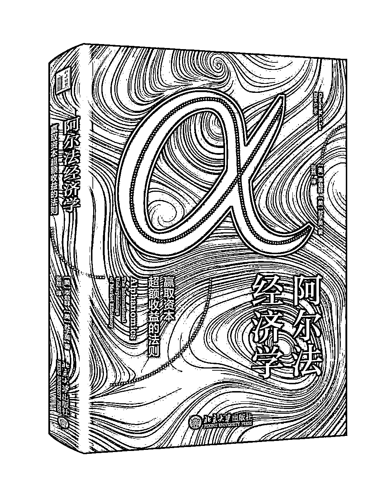

# 五百二十、献礼：阿尔法经济学（文末彩蛋）

> 原文：[`mp.weixin.qq.com/s?__biz=MzAxNTc0Mjg0Mg==&mid=2653292220&idx=1&sn=3146d85bda302011c9f00c20de6d1033&chksm=802dc4a9b75a4dbfb594a64ff47a34fb1f30fd6680f15c1e2fbb32545bf91806ebc3716f25c7&scene=27#wechat_redirect`](http://mp.weixin.qq.com/s?__biz=MzAxNTc0Mjg0Mg==&mid=2653292220&idx=1&sn=3146d85bda302011c9f00c20de6d1033&chksm=802dc4a9b75a4dbfb594a64ff47a34fb1f30fd6680f15c1e2fbb32545bf91806ebc3716f25c7&scene=27#wechat_redirect)

**标星★公众号     **爱你们♥

**近期原创文章：**

## ♥ [基于无监督学习的期权定价异常检测（代码+数据）](https://mp.weixin.qq.com/s?__biz=MzAxNTc0Mjg0Mg==&mid=2653290562&idx=1&sn=dee61b832e1aa2c062a96bb27621c29d&chksm=802dc257b75a4b41b5623ade23a7de86333bfd3b4299fb69922558b0cbafe4c930b5ef503d89&token=1298662931&lang=zh_CN&scene=21#wechat_redirect)

## ♥ [5 种机器学习算法在预测股价的应用（代码+数据）](https://mp.weixin.qq.com/s?__biz=MzAxNTc0Mjg0Mg==&mid=2653290588&idx=1&sn=1d0409ad212ea8627e5d5cedf61953ac&chksm=802dc249b75a4b5fa245433320a4cc9da1a2cceb22df6fb1a28e5b94ff038319ae4e7ec6941f&token=1298662931&lang=zh_CN&scene=21#wechat_redirect)

## ♥ [深入研读：利用 Twitter 情绪去预测股市](https://mp.weixin.qq.com/s?__biz=MzAxNTc0Mjg0Mg==&mid=2653290402&idx=1&sn=efda9ea106991f4f7ccabcae9d809e00&chksm=802e3db7b759b4a173dc8f2ab5c298ab3146bfd7dd5aca75929c74ecc999a53b195c16f19c71&token=1330520237&lang=zh_CN&scene=21#wechat_redirect)

## ♥ [Two Sigma 用新闻来预测股价走势，带你吊打 Kaggle](https://mp.weixin.qq.com/s?__biz=MzAxNTc0Mjg0Mg==&mid=2653290456&idx=1&sn=b8d2d8febc599742e43ea48e3c249323&chksm=802e3dcdb759b4db9279c689202101b6b154fb118a1c1be12b52e522e1a1d7944858dbd6637e&token=1330520237&lang=zh_CN&scene=21#wechat_redirect)

## ♥ [利用深度学习最新前沿预测股价走势](https://mp.weixin.qq.com/s?__biz=MzAxNTc0Mjg0Mg==&mid=2653290080&idx=1&sn=06c50cefe78a7b24c64c4fdb9739c7f3&chksm=802e3c75b759b563c01495d16a638a56ac7305fc324ee4917fd76c648f670b7f7276826bdaa8&token=770078636&lang=zh_CN&scene=21#wechat_redirect)

## ♥ [一位数据科学 PhD 眼中的算法交易](https://mp.weixin.qq.com/s?__biz=MzAxNTc0Mjg0Mg==&mid=2653290118&idx=1&sn=a261307470cf2f3e458ab4e7dc309179&chksm=802e3c93b759b585e079d3a797f512dfd0427ac02942339f4f1454bd368ba47be21cb52cf969&token=770078636&lang=zh_CN&scene=21#wechat_redirect)

## ♥ [基于 RNN 和 LSTM 的股市预测方法](https://mp.weixin.qq.com/s?__biz=MzAxNTc0Mjg0Mg==&mid=2653290481&idx=1&sn=f7360ea8554cc4f86fcc71315176b093&chksm=802e3de4b759b4f2235a0aeabb6e76b3e101ff09b9a2aa6fa67e6e824fc4274f68f4ae51af95&token=1865137106&lang=zh_CN&scene=21#wechat_redirect)

## ♥ [人工智能『AI』应用算法交易，7 个必踩的坑！](https://mp.weixin.qq.com/s?__biz=MzAxNTc0Mjg0Mg==&mid=2653289974&idx=1&sn=88f87cb64999d9406d7c618350aac35d&chksm=802e3fe3b759b6f5eca6e777364270cbaa0bf35e9a1535255be9751c3a77642676993a861132&token=770078636&lang=zh_CN&scene=21#wechat_redirect)

## ♥ [神经网络在算法交易上的应用系列（一）](https://mp.weixin.qq.com/s?__biz=MzAxNTc0Mjg0Mg==&mid=2653289962&idx=1&sn=5f5aa65ec00ce176501c85c7c106187d&chksm=802e3fffb759b6e9f2d4518f9d3755a68329c8753745333ef9d70ffd04bd088fd7b076318358&token=770078636&lang=zh_CN&scene=21#wechat_redirect)

## ♥ [预测股市 | 如何避免 p-Hacking，为什么你要看涨？](https://mp.weixin.qq.com/s?__biz=MzAxNTc0Mjg0Mg==&mid=2653289820&idx=1&sn=d3fee74ba1daab837433e4ef6b0ab4d9&chksm=802e3f49b759b65f422d20515942d5813aead73231da7d78e9f235bdb42386cf656079e69b8b&token=770078636&lang=zh_CN&scene=21#wechat_redirect)

## ♥ [如何鉴别那些用深度学习预测股价的花哨模型？](https://mp.weixin.qq.com/s?__biz=MzAxNTc0Mjg0Mg==&mid=2653290132&idx=1&sn=cbf1e2a4526e6e9305a6110c17063f46&chksm=802e3c81b759b597d3dd94b8008e150c90087567904a29c0c4b58d7be220a9ece2008956d5db&token=1266110554&lang=zh_CN&scene=21#wechat_redirect)

## ♥ [优化强化学习 Q-learning 算法进行股市](https://mp.weixin.qq.com/s?__biz=MzAxNTc0Mjg0Mg==&mid=2653290286&idx=1&sn=882d39a18018733b93c8c8eac385b515&chksm=802e3d3bb759b42d1fc849f96bf02ae87edf2eab01b0beecd9340112c7fb06b95cb2246d2429&token=1330520237&lang=zh_CN&scene=21#wechat_redirect)

**正文**

由北京大学光华管理学院张然老师课题组翻译出版的**《阿尔法经济学》**终于出版了。让我们一睹为快：

Charles Lee 教授的原作《Alphanomics: The Information Underpinnings of Market Efficiency》可谓是基本面量化投资领域的集大成者。但如何把原作者的深厚学养分享给中国的广大读者和投资者，是一个颇具挑战性的课题。有鉴于此，张然老师团队在翻译过程中倾注了大量心血，力求在更大范围内推广基本面量化和投资者行为领域的研究成果和先进理念。

**然然老师的话**

关于译作的述评，且听张然老师道来：

译者序

张然

还记得第一次见到 Charles Lee 教授是在 2007 年 9 月份。作为北京大学光华管理学院会计系的共同系主任，他从美国到访光华。记得第一次见到他，就感觉他非常平易近人。后来，由于工作的关系，接触越来越多，也越来越深深的佩服这样一位成就卓越，却同时谦逊低调的学者。Lee 教授用一篇篇文章向大众揭示人性的弱点和市场的局限，并且身体力行、用实际的投资和授课提升市场效率。知行合一，Lee 教授是我见过的做得最好的人。

在研究方面，Lee 教授在会计、金融和经济领域的顶级学术刊物上发表了大量关于量化投资、行为金融、和权益估值论文。1990-2018 年间，他在顶级学术期刊上一共发表了 47 篇论文，为相关领域做出了巨大贡献。在投资实践方面，他于 2004 年至 2008 年担任 Barclays Global Investors （BGI，现属 BlackRock 集团）权益研究全球主管（Global Head of Equity Research）和北美主动权益联合主管（Co-Head of North America Active Equities），在他任职期间，BGI 管理着超过 3000 亿美元的主动权益资产。

Lee 教授不仅研究卓越，他还将研究和投资实践带入课堂，教学成绩俨然。他在教学中，不仅能够总览全局，教给学生最有用的信息和思维习惯，而且经常能够把比较难的学术思想用简单的比喻解释清楚。比如，他最大的兴趣是钓鱼，一直喜欢大海。所以，他曾经形象地把股票价值比喻为海平面，并说道：“海并不总是平的，因此才有冲浪者的存在，但由于重力的作用，海总是在寻找着回归海平面。……这就像股票市场的价值和价格，价格并不总是等同于价值，所以才有套利者的存在，而价格最终会回归价值。”这些生动形象的比喻，让很多难以理解的道理变得浅显易懂。他在斯坦福大学长期开设 Alphanomics 课程，并把研究成果和投资实践带到自己的课堂中。该课程理论联系实际，广受学生好评，并获得 2017 年斯坦福大学 MBA 卓越教学奖和 2017 年美国会计学会教学创新奖（Teaching Innovation Award）。

自从认识他开始，他在各方面的成就和一言一行便激励着我，一点一滴向他看齐。他对我说过的一些话，也成为我的座右铭，时刻鞭策自己的成长。他曾经告诉我，“Rania, we are not going to last long, but our books and our papers will.” 他对自己的书和文章的要求也达到极致。本书出版之前，我曾经有幸与他合作过两篇文章，其中一篇发表在会计学顶尖期刊 The Accounting Review，另外一篇发表在金融学顶尖期刊 Journal of Financial Economics。这两篇文章合作的过程中，我一次次地被 Lee 教授独到的眼光，对文章大方向的精确指导，以及作为资深教授，依然俯身与我们一起研究文章细节而感动和激励。

2017 年暑假，我再次赴斯坦福大学，和 Charles Lee 教授进行合作研究。其间，拜访对冲股权基金公司时，其中一位在华尔街工作多年的对冲基金合伙人提到 Charles Lee 教授刚刚在美国出版的新书《Alphanomics》，赞不绝口，连称这本书是“A masterpiece”。几天后，我和 Lee 教授从旧金山一起到圣地亚哥参加美国会计学会年会，Lee 教授此次正是要去领取 Teaching Innovation Award，以表彰他在 Alphanomics 课程上的创新。在三天会议期间，我亲眼看到了作为斯坦福大学商学院讲席教授，他如何高效工作，并被他对工作的热爱所震撼。回程路上，我提出了将该书翻译成中文，在中国出版的想法。因为正是 Lee 教授将我带入了基本面量化投资的殿堂。而我了解，此时的中国，正要进入基本面量化投资的高速发展期，这本书无疑将对该领域的发展发挥巨大的推动作用。

真正进入书的翻译过程时，时常感觉“诚惶诚恐”，因为原书的语言非常美妙，我生怕由于翻译不到位，体现不出原意。另外，本书可以称为“文献的文献”，原书涉及 429 篇参考文献，可以说，本书是 400 多篇经典文献的精华总结。本书的很多段落写作时，原作者假设读者已经熟知这些经典文献，有时一个自然段可能就会总结归纳几篇文章的主要内容，信息量非常大。我们翻译的过程中，很多时候需要去翻阅这些文章的原文才能准确理解原作者想要表达的意思。在这些可能需要翻阅原文才能理解的地方，为了方便读者理解，我们尽可能添加译者注来说明问题。由于书中很多地方，每一段的信息量都很大，希望掌握这些知识的读者需要静下心来仔细阅读，有些段落可能仍旧需要阅读相关研究的原文才能真正理解。

翻译书的过程中，得到了不少学界和业界人士的帮助和支持。特别感谢平安资管首席投资官张一清博士，张博士曾经在 BGI、社保基金和中投公司工作，他非常认可学术对于投资的指导价值，欣然同意为本书推荐，并对本书在中国市场的传播提出了非常宝贵的意见。正是基于张博士的意见，我们在尽量尊重原稿的基础上，用更符合中文习惯的语言来体现原书的思想。特别感谢易方达基金指数与量化基金部总经理林飞博士，本书初稿完成后，他给出了很多修改意见，并从实务角度对内容给予建议。**感谢通联科技 CEO 王政博士，博时基金指数与量化部总经理黄瑞庆博士，基金经理桂征辉、林景艺，嘉实基金量化投资部总监刘斌博士，量信投资合伙人石川博士等**，各位从业界角度对初稿的宝贵意见，促使我们进一步修改更新，产生了现在的版本。**特别感谢中投公司汪荣飞博士，他一直致力于基本面量化投资的研究和实践，对本书若干章节的数次认真仔细修改，使得全书增色不少！**也正是荣飞说过的一句话：“Lee 教授发表过很多文章，但只写过这一本书，足以见其重要性。”让我对整个翻译过程力求做到最好，尽量精益求精，力争对得起原作者对本书倾注的心血。

在本书的翻译过程中，许多选修过“财务分析与量化投资”课程的同学参与了资料整理和审阅校订等工作。**在此，我们感谢这些同学：寇雨婷、杜宜学、何致远、沈铂涵、庞博琛**。我们同时感谢北京大学出版社李娟和黄玮婷两位编辑的审校和帮助。

最后，特别感谢 Charles Lee 教授，给我这个机会，把他的巨著带到中国市场。怀着一颗诚惶诚恐的心，希望这些工作能为中国证券市场的投资实践和效率提升做出一点贡献。

**彩蛋**

为了让大家第一时间能阅读到然然老师组织翻译的这边书籍。

**公众号特地免费送出 ****5 本**

获取方式很简单

在**写留言**处发表留言

**获得点赞前 5 的读者**

即可免费获赠此书

截止日期：**2019-05-22 18:00**

**届时，工作人员会联系五位读者微信，寄出此书**

*—End—*

量化投资与机器学习微信公众号，是业内垂直于**Quant**、**MFE**、**CST**等专业的主流自媒体。公众号拥有来自**公募、私募、券商、银行、海外**等众多圈内**10W+**关注者。每日发布行业前沿研究成果和最新资讯。

