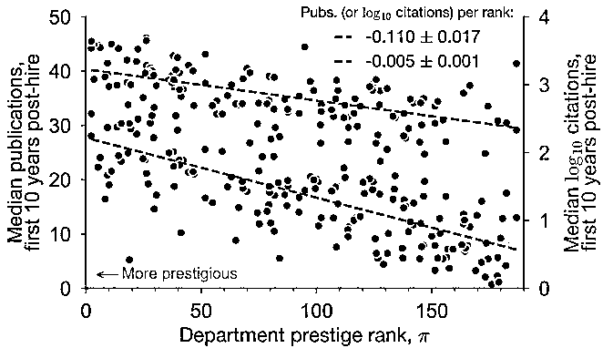
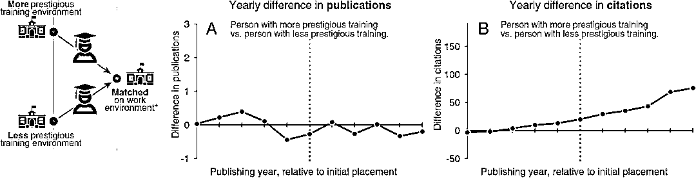
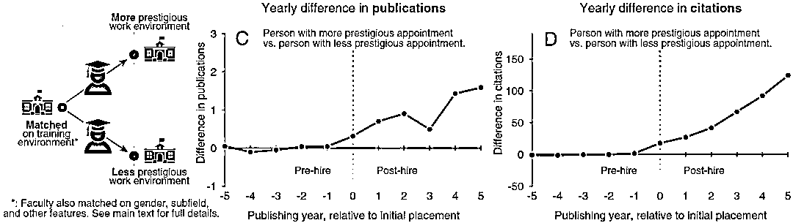

# 出身和平台哪个对学者更重要？二十万篇论文给你答案！

> 原文：[`mp.weixin.qq.com/s?__biz=MzAxNTc0Mjg0Mg==&mid=2653292213&idx=1&sn=98645a8b69f3bcc3daf533af11eba4ec&chksm=802dc4a0b75a4db68c1b62fbfbe6100ddd8394be2f8dc844cb9f0657e02f79eaa55e45594c65&scene=27#wechat_redirect`](http://mp.weixin.qq.com/s?__biz=MzAxNTc0Mjg0Mg==&mid=2653292213&idx=1&sn=98645a8b69f3bcc3daf533af11eba4ec&chksm=802dc4a0b75a4db68c1b62fbfbe6100ddd8394be2f8dc844cb9f0657e02f79eaa55e45594c65&scene=27#wechat_redirect)

**标星★公众号     **爱你们♥

编译：集智俱乐部

来源：Insidehighered

**近期原创文章：**

## ♥ [基于无监督学习的期权定价异常检测（代码+数据）](https://mp.weixin.qq.com/s?__biz=MzAxNTc0Mjg0Mg==&mid=2653290562&idx=1&sn=dee61b832e1aa2c062a96bb27621c29d&chksm=802dc257b75a4b41b5623ade23a7de86333bfd3b4299fb69922558b0cbafe4c930b5ef503d89&token=1298662931&lang=zh_CN&scene=21#wechat_redirect)

## ♥ [5 种机器学习算法在预测股价的应用（代码+数据）](https://mp.weixin.qq.com/s?__biz=MzAxNTc0Mjg0Mg==&mid=2653290588&idx=1&sn=1d0409ad212ea8627e5d5cedf61953ac&chksm=802dc249b75a4b5fa245433320a4cc9da1a2cceb22df6fb1a28e5b94ff038319ae4e7ec6941f&token=1298662931&lang=zh_CN&scene=21#wechat_redirect)

## ♥ [深入研读：利用 Twitter 情绪去预测股市](https://mp.weixin.qq.com/s?__biz=MzAxNTc0Mjg0Mg==&mid=2653290402&idx=1&sn=efda9ea106991f4f7ccabcae9d809e00&chksm=802e3db7b759b4a173dc8f2ab5c298ab3146bfd7dd5aca75929c74ecc999a53b195c16f19c71&token=1330520237&lang=zh_CN&scene=21#wechat_redirect)

## ♥ [Two Sigma 用新闻来预测股价走势，带你吊打 Kaggle](https://mp.weixin.qq.com/s?__biz=MzAxNTc0Mjg0Mg==&mid=2653290456&idx=1&sn=b8d2d8febc599742e43ea48e3c249323&chksm=802e3dcdb759b4db9279c689202101b6b154fb118a1c1be12b52e522e1a1d7944858dbd6637e&token=1330520237&lang=zh_CN&scene=21#wechat_redirect)

## ♥ [利用深度学习最新前沿预测股价走势](https://mp.weixin.qq.com/s?__biz=MzAxNTc0Mjg0Mg==&mid=2653290080&idx=1&sn=06c50cefe78a7b24c64c4fdb9739c7f3&chksm=802e3c75b759b563c01495d16a638a56ac7305fc324ee4917fd76c648f670b7f7276826bdaa8&token=770078636&lang=zh_CN&scene=21#wechat_redirect)

## ♥ [一位数据科学 PhD 眼中的算法交易](https://mp.weixin.qq.com/s?__biz=MzAxNTc0Mjg0Mg==&mid=2653290118&idx=1&sn=a261307470cf2f3e458ab4e7dc309179&chksm=802e3c93b759b585e079d3a797f512dfd0427ac02942339f4f1454bd368ba47be21cb52cf969&token=770078636&lang=zh_CN&scene=21#wechat_redirect)

## ♥ [基于 RNN 和 LSTM 的股市预测方法](https://mp.weixin.qq.com/s?__biz=MzAxNTc0Mjg0Mg==&mid=2653290481&idx=1&sn=f7360ea8554cc4f86fcc71315176b093&chksm=802e3de4b759b4f2235a0aeabb6e76b3e101ff09b9a2aa6fa67e6e824fc4274f68f4ae51af95&token=1865137106&lang=zh_CN&scene=21#wechat_redirect)

## ♥ [人工智能『AI』应用算法交易，7 个必踩的坑！](https://mp.weixin.qq.com/s?__biz=MzAxNTc0Mjg0Mg==&mid=2653289974&idx=1&sn=88f87cb64999d9406d7c618350aac35d&chksm=802e3fe3b759b6f5eca6e777364270cbaa0bf35e9a1535255be9751c3a77642676993a861132&token=770078636&lang=zh_CN&scene=21#wechat_redirect)

## ♥ [神经网络在算法交易上的应用系列（一）](https://mp.weixin.qq.com/s?__biz=MzAxNTc0Mjg0Mg==&mid=2653289962&idx=1&sn=5f5aa65ec00ce176501c85c7c106187d&chksm=802e3fffb759b6e9f2d4518f9d3755a68329c8753745333ef9d70ffd04bd088fd7b076318358&token=770078636&lang=zh_CN&scene=21#wechat_redirect)

## ♥ [预测股市 | 如何避免 p-Hacking，为什么你要看涨？](https://mp.weixin.qq.com/s?__biz=MzAxNTc0Mjg0Mg==&mid=2653289820&idx=1&sn=d3fee74ba1daab837433e4ef6b0ab4d9&chksm=802e3f49b759b65f422d20515942d5813aead73231da7d78e9f235bdb42386cf656079e69b8b&token=770078636&lang=zh_CN&scene=21#wechat_redirect)

## ♥ [如何鉴别那些用深度学习预测股价的花哨模型？](https://mp.weixin.qq.com/s?__biz=MzAxNTc0Mjg0Mg==&mid=2653290132&idx=1&sn=cbf1e2a4526e6e9305a6110c17063f46&chksm=802e3c81b759b597d3dd94b8008e150c90087567904a29c0c4b58d7be220a9ece2008956d5db&token=1266110554&lang=zh_CN&scene=21#wechat_redirect)

## ♥ [优化强化学习 Q-learning 算法进行股市](https://mp.weixin.qq.com/s?__biz=MzAxNTc0Mjg0Mg==&mid=2653290286&idx=1&sn=882d39a18018733b93c8c8eac385b515&chksm=802e3d3bb759b42d1fc849f96bf02ae87edf2eab01b0beecd9340112c7fb06b95cb2246d2429&token=1330520237&lang=zh_CN&scene=21#wechat_redirect)

**导语**

近日，来自科罗拉多大学的 Aaron Clauset  等研究者，在收集大量科研人员的数据后，对**“博士毕业院校的声望，能够代表科学家能力”**的假设提出来质疑，他们认为早期的学术训练更重要。

其实，2015 年科罗拉多大学博尔德 Samuel F. Way 等人就发现科研人员的工作机构比他们接受学术训练的机构影响更大。一个人博士学位的名气虽然可能在强烈预示着这个人有可能在哪里被聘为教授，但对于他的科学贡献方面能发挥的作用很有限。

**“学术谱系”并不能够主宰一切**

在 2015 年，曾有一项研究表明：科研领域普遍存在社会不公现象。依研究领域的区别，大约有 71%-86% 的教授（包括 tenured 和 tenure-track professors）出自 25% 的博士生培养机构。

研究报道：

*https://www.insidehighered.com/news/2015/02/13/study-suggests-insular-faculty-hiring-practices-elite-departments*

依照研究中给出的博士生培养项目排名情况，排名越靠上，不平等的境况就越极端。在每个学科领域中，前 10 名的培养项目比接下来的 10 名多培养了 1.6-3 倍的教授。11-20 名比接下来的 10 名多培养了 2.3-5.6 倍的教授。理论上，这表明这些培养项目的质量过硬。但批评人士认为这是由于这些优秀科研机构的“小圈子”招聘更加排外导致的。

不过，领导了这项研究的科罗拉多大学博尔德分校（University of Colorado at Boulder）的计算机科学家 Samuel F. Way、Aaron Clauset 等人表示，“**学术谱系”并不会主宰一切——至少从教授未来的科研效率来讲。**

研究者在发表在 Proceedings of the National Academy of Sciences 上的论文中表示：“我们的研究结果表明，能促进科研人员提高**学术效率（productivity，发表论文数量）**的不是他们接受学术训练的环境，而是他们从事科研工作的环境。”同时，现在和过去的工作地点都会影响**学术成就（prominence，论文被引数量）**。

也就是说，当谈到实际的科研产出的时候，**科研人员的工作机构比他们接受学术训练的机构影响更大。**

在这项新的研究中，研究者调查了供职于 205 个能授予博士学位的计算机系的 2453 名教授，并进一步，分析了他们的产出和成就数据。本研究主要关注一名博士被聘为教师的前后各五年的时间段。该研究涉及的教授共发表了 20 余万篇论文，总计 740 万次引用。

从图中我们可以看出，科研机构的声誉对计算机科学领域的科研人员学术效率和学术成就方面的影响。上图的横轴表示的是科研机构的声誉排名，排名越靠前，声誉就越高。左侧纵轴（黑色）表示的是科研人员被雇佣后的头十年发表论文的数量。右侧纵轴(红色)则表示论文的被引量（以 10 为底的对数）。

本实验在数据分析时采用配对（Matched-pairs）实验设计。与完全随机的实验设计相反，匹配对包括一个二值变量，并且将实验的匹配对排序分块。

对于科研人员的学术成就而言，从名校毕业的博士能够从就读阶段发表的论文中积累被引量。但是，在博士毕业走入教职岗位后，就读的学校的名声对发表论文的数量并无帮助。

根据研究者设定的参照对比试验，对于供职于名声相近的研究机构的科研人员而言，在名声更大的机构获得博士学位的科研人员在入职工作的前五年虽然并没有更高的科研产出，但是，平均来说，这些人会多收到 301 条论文引用。

相比较而言，对于那些接受了相似的科研训练、具备相似的科研产出和论文引用量的科研人员，工作找的好——供职机构声誉更好——的科研人员在工作的头五年内多完成了 5.1 篇论文。平均来说，供职机构更好的人写出对的论文也会多获得 344 条被引。

相比于在排名后 20% 的研究机构里工作的教授，在排名位于前 20% 的研究机构中，教授在工作的头五年会平均多发表了 17 篇论文，被引次数会多 824 次。

毕业院校对科研人员的影响（折线表示均值，阴影区域表示 95％ 置信区间）

在上图最左侧的示意图像的对比中我们能看到，毕业于不同院校的博士生，进入同一家科研机构工作（比配成对）。我们会发现**学术效率（productivity，发表论文数量）**并没有太大的差异；**学术成就（prominence，论文被引数量）**会受到读博学校的名气不同而带来一定的差异。

工作机构对科研人员的影响（折线表示均值，阴影区域表示 95％ 置信区间）

同理，我们从新的对比示意中得知，毕业于相同院校的博士生，进入了不同的科研机构工作。我们会发现学术效率会因为工作环境的不同而有巨大的差异，学术成就也会存在巨大差异。

科罗拉多博尔德分校的计算机科学博士后研究员 Samuel Way 是这篇论文的第一作者，Way 就是在这里获得博士学位的。根据他自己的说法，如果他和 MIT 等名校博士一起在计算机科学名校斯坦福当教授的话，那么他们的研究成果应该是一样的。

那么，为什么会这样呢？Way 和他的合作者——副教授 Aaron Clauset、博士生 Allison C. Morgan 和助理教授 Daniel B. Larremore ，他们都是博尔德分校的计算机科学家——想到了这可能与科研机构雇佣教授的标准有关，包括博士期间的论文产出、通过博士项目成为教授的期望、留聘产出高的教授。然而只有非常微弱的证据显示博士培养项目与科研效率有关联。

Way 等人的论文指出，**这个研究发现“对科学学（Science of Science）研究有重要影响，科学学研究通常会（隐式或显式地）假设精英主义主导着知识的发现”**。“以往的理论与模型不能很好地描述这里提到的环境机制（即科研环境对科研的影响），以及科研机构的名声对工作产出和工作成就的因果关系，故此这些理论模型是有不完整的。”

**环境机制不同程度的**

**适用于不同学科领域** 

这项研究的另外一个问题是，这个研究结果是否适用于其他学科？在 Way 和 Clauset 一封联合撰写的邮件中他们这样解释道：过去的研究工作（包括他们自己的）表明其他的大多数学科在教众员工的招募和论文产出方面遵循着相似的模式。“因此，我们有理由认为，**我们发现的环境机制同样适用于不同的学科领域。**”

他们认为，这个研究成果在其他学科领域的适用程度，“很可能取决于，他们在计算机科学领域中观察到的影响科研产出的机制是否也适用于其他领域。” 比如，一名学者的科研产出能力“很可能比计算机领域更受研究机构提供的资源的影响——比如，生物学家需要实验设备和超级计算机、历史学家需要图书馆，等等。学术指导和论文出版规范也非常重要，比如，博士生是否愿意和他们的指导教师合作完成论文。

所以，在哪里获得博士文凭这事还重要么？研究者认为是的。**因为一个人学位的声誉强烈预示着这个人有可能在哪里被聘为教授。**但是，Way 和 Clauset 表示，这其实提出了一个难题，究竟是什么决定着名牌科研院校的科研工作者的学术产出能力。

至于说，这对于科研机构招聘的影响，Way 和 Clauset 说，每个科研领域的教职岗位竞争都非常激烈。按照他们自己过去的研究结果，“大部分人能够足够幸运在不如自己读博士的学校那里获得一份教职岗位”。但是，这篇文章的研究成果表明，**一个人博士学位的名气“在预测他的科学贡献方面能发挥的作用很有限，甚至是在招聘阶段”**。

因为真正决定科研产出的因素还不清楚，二位研究者表示，未来的研究方向就是找出哪些是起到重要作用的特征。**初步看来，资源（比如研究生的数量）是能够决定科研产出的重要因素，至少计算机领域是这样的。**

翻译：Leo

审校：任晓龙

编辑：陈安林

原文链接：

https://www.insidehighered.com/news/2019/05/02/study-when-it-comes-research-output-where-phds-get-hired-matters-more-where-they

**MATLAB EXPO 2019 微信直播**

**免费！免费！免费！**

*—End—*

量化投资与机器学习微信公众号，是业内垂直于**Quant**、**MFE**、**CST**等专业的主流自媒体。公众号拥有来自**公募、私募、券商、银行、海外**等众多圈内**10W+**关注者。每日发布行业前沿研究成果和最新资讯。

