# 逆天！手写高数题，拍照自动求解

> 原文：[`mp.weixin.qq.com/s?__biz=MzAxNTc0Mjg0Mg==&mid=2653292207&idx=1&sn=7f6594deac65dacd55a27f47a30d29fc&chksm=802dc4bab75a4dacb182113583e1c5d11cc75376d9b2b9b5e371c1482ca55cf62ac7f6b8e7cc&scene=27#wechat_redirect`](http://mp.weixin.qq.com/s?__biz=MzAxNTc0Mjg0Mg==&mid=2653292207&idx=1&sn=7f6594deac65dacd55a27f47a30d29fc&chksm=802dc4bab75a4dacb182113583e1c5d11cc75376d9b2b9b5e371c1482ca55cf62ac7f6b8e7cc&scene=27#wechat_redirect)

**标星★公众号     **爱你们♥

作者：红色石头

来自：AI 有道

**近期原创文章：**

## ♥ [基于无监督学习的期权定价异常检测（代码+数据）](https://mp.weixin.qq.com/s?__biz=MzAxNTc0Mjg0Mg==&mid=2653290562&idx=1&sn=dee61b832e1aa2c062a96bb27621c29d&chksm=802dc257b75a4b41b5623ade23a7de86333bfd3b4299fb69922558b0cbafe4c930b5ef503d89&token=1298662931&lang=zh_CN&scene=21#wechat_redirect)

## ♥ [5 种机器学习算法在预测股价的应用（代码+数据）](https://mp.weixin.qq.com/s?__biz=MzAxNTc0Mjg0Mg==&mid=2653290588&idx=1&sn=1d0409ad212ea8627e5d5cedf61953ac&chksm=802dc249b75a4b5fa245433320a4cc9da1a2cceb22df6fb1a28e5b94ff038319ae4e7ec6941f&token=1298662931&lang=zh_CN&scene=21#wechat_redirect)

## ♥ [深入研读：利用 Twitter 情绪去预测股市](https://mp.weixin.qq.com/s?__biz=MzAxNTc0Mjg0Mg==&mid=2653290402&idx=1&sn=efda9ea106991f4f7ccabcae9d809e00&chksm=802e3db7b759b4a173dc8f2ab5c298ab3146bfd7dd5aca75929c74ecc999a53b195c16f19c71&token=1330520237&lang=zh_CN&scene=21#wechat_redirect)

## ♥ [Two Sigma 用新闻来预测股价走势，带你吊打 Kaggle](https://mp.weixin.qq.com/s?__biz=MzAxNTc0Mjg0Mg==&mid=2653290456&idx=1&sn=b8d2d8febc599742e43ea48e3c249323&chksm=802e3dcdb759b4db9279c689202101b6b154fb118a1c1be12b52e522e1a1d7944858dbd6637e&token=1330520237&lang=zh_CN&scene=21#wechat_redirect)

## ♥ [利用深度学习最新前沿预测股价走势](https://mp.weixin.qq.com/s?__biz=MzAxNTc0Mjg0Mg==&mid=2653290080&idx=1&sn=06c50cefe78a7b24c64c4fdb9739c7f3&chksm=802e3c75b759b563c01495d16a638a56ac7305fc324ee4917fd76c648f670b7f7276826bdaa8&token=770078636&lang=zh_CN&scene=21#wechat_redirect)

## ♥ [一位数据科学 PhD 眼中的算法交易](https://mp.weixin.qq.com/s?__biz=MzAxNTc0Mjg0Mg==&mid=2653290118&idx=1&sn=a261307470cf2f3e458ab4e7dc309179&chksm=802e3c93b759b585e079d3a797f512dfd0427ac02942339f4f1454bd368ba47be21cb52cf969&token=770078636&lang=zh_CN&scene=21#wechat_redirect)

## ♥ [基于 RNN 和 LSTM 的股市预测方法](https://mp.weixin.qq.com/s?__biz=MzAxNTc0Mjg0Mg==&mid=2653290481&idx=1&sn=f7360ea8554cc4f86fcc71315176b093&chksm=802e3de4b759b4f2235a0aeabb6e76b3e101ff09b9a2aa6fa67e6e824fc4274f68f4ae51af95&token=1865137106&lang=zh_CN&scene=21#wechat_redirect)

## ♥ [人工智能『AI』应用算法交易，7 个必踩的坑！](https://mp.weixin.qq.com/s?__biz=MzAxNTc0Mjg0Mg==&mid=2653289974&idx=1&sn=88f87cb64999d9406d7c618350aac35d&chksm=802e3fe3b759b6f5eca6e777364270cbaa0bf35e9a1535255be9751c3a77642676993a861132&token=770078636&lang=zh_CN&scene=21#wechat_redirect)

## ♥ [神经网络在算法交易上的应用系列（一）](https://mp.weixin.qq.com/s?__biz=MzAxNTc0Mjg0Mg==&mid=2653289962&idx=1&sn=5f5aa65ec00ce176501c85c7c106187d&chksm=802e3fffb759b6e9f2d4518f9d3755a68329c8753745333ef9d70ffd04bd088fd7b076318358&token=770078636&lang=zh_CN&scene=21#wechat_redirect)

## ♥ [预测股市 | 如何避免 p-Hacking，为什么你要看涨？](https://mp.weixin.qq.com/s?__biz=MzAxNTc0Mjg0Mg==&mid=2653289820&idx=1&sn=d3fee74ba1daab837433e4ef6b0ab4d9&chksm=802e3f49b759b65f422d20515942d5813aead73231da7d78e9f235bdb42386cf656079e69b8b&token=770078636&lang=zh_CN&scene=21#wechat_redirect)

## ♥ [如何鉴别那些用深度学习预测股价的花哨模型？](https://mp.weixin.qq.com/s?__biz=MzAxNTc0Mjg0Mg==&mid=2653290132&idx=1&sn=cbf1e2a4526e6e9305a6110c17063f46&chksm=802e3c81b759b597d3dd94b8008e150c90087567904a29c0c4b58d7be220a9ece2008956d5db&token=1266110554&lang=zh_CN&scene=21#wechat_redirect)

## ♥ [优化强化学习 Q-learning 算法进行股市](https://mp.weixin.qq.com/s?__biz=MzAxNTc0Mjg0Mg==&mid=2653290286&idx=1&sn=882d39a18018733b93c8c8eac385b515&chksm=802e3d3bb759b42d1fc849f96bf02ae87edf2eab01b0beecd9340112c7fb06b95cb2246d2429&token=1330520237&lang=zh_CN&scene=21#wechat_redirect)

**正文**

深度好玩！文章开始红色石头先在草稿纸上写一道高数微积分题目给大家看看如何求解：

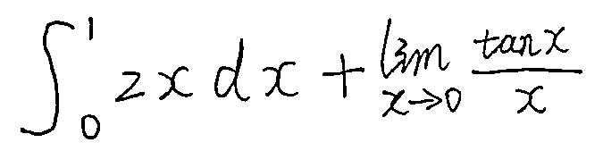

怎么算呢？趁着高数知识还没忘完，赶紧拿起纸演算起来。大部分人是这么做的。但是如果现在跟你说，可以用 AI 来做，你信吗？

现在就有这样一个 AI 程序，你只要轻松上传上面这张手写算术题，程序就能帮你自动分析，写出解题步骤和答案！你信吗？就像下面一样：

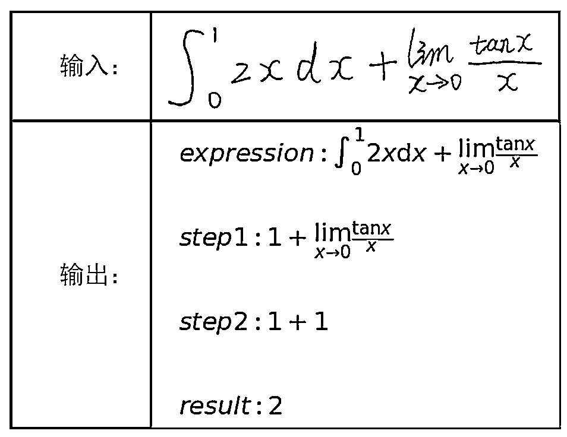

Amazing！有没有！今天就给大家介绍这个有趣的 mathAI 项目。它是一个拍照做题程序。输入一张包含数学计算题的图片，就会自动输出识别出的数学计算式以及计算结果。

**项目介绍**

该项目名为：mathAI，是一个自动计算手写公式的程序。作者是一名中山大学的学霸硕士小哥 Roujack，他的研究方向就是计算机视觉。 

整个程序使用 Python 实现，具体处理流程包括了图像预处理、字符识别、数学公式识别、数学公式语义理解、结果输出。

整个系统流程图如下：

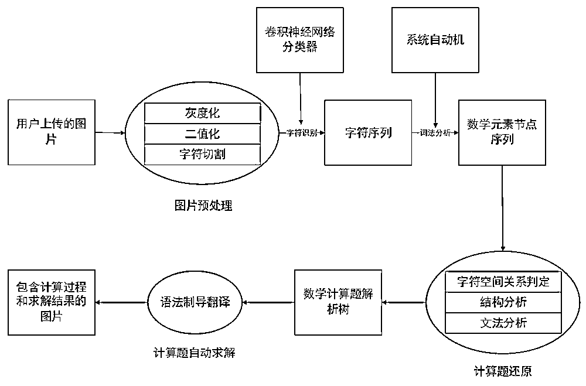

**1\. 预处理**

首先，需要对手写图片进行预处理。图片预处理以 OpenCV 作为主要工具。预处理的主要目的是把图片中的字符切割出来，同时避免无关变量对字符识别的影响。

预处理主要包括：灰度化、二值化、高斯滤波、字符切割与细化。

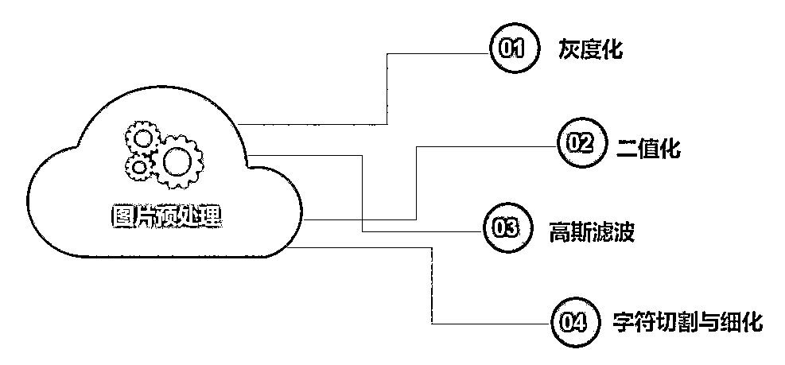

对图片预处理的效果如下图所示：

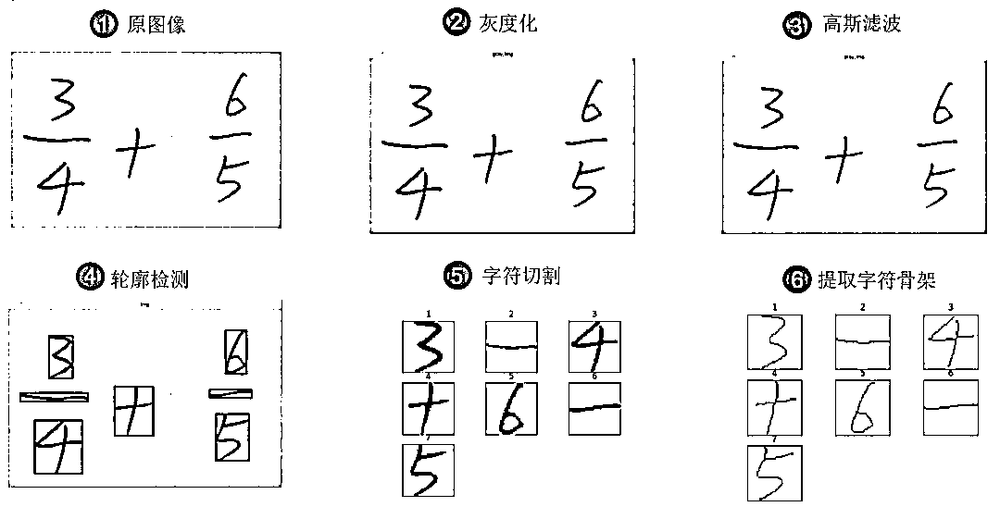

**2\. 字符识别**

预处理之后，下一步就是对字符进行识别。选择的模型是卷积神经网络 LeNet5，因为不需要提取字符特征值，而且图像识别精确度高。

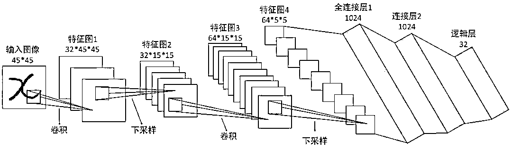

训练网络选用的数据集是国际数学公式识别比赛数据集（CROHME）。CROHME 数据集具有海量字符集图片，而且图片类型与实际输入非常相似。每种字符有 400 张图片，其中 60% 的图片用于训练，40% 的图片用于测试。

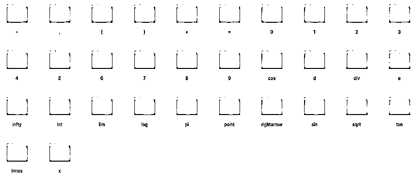

接下来就是结构分析和语义分析。

总的来说，对于数学公式的识别，主要是将识别出的独立的字符组织成计算机能够理解的数学公式（这里的数学公式就是纯字符的可求解的数学计算题）。大概的方法是使用编译原理的算符优先法和递归下降法进行实现。 然后根据属性文法的值传递思想，将数学公式的值计算出来。最后使用 Python 的 Matplotlib 库把计算过程和答案打印出来。

**实验结果**

模型训练完成之后，作者验证了字符识别的准确率： 

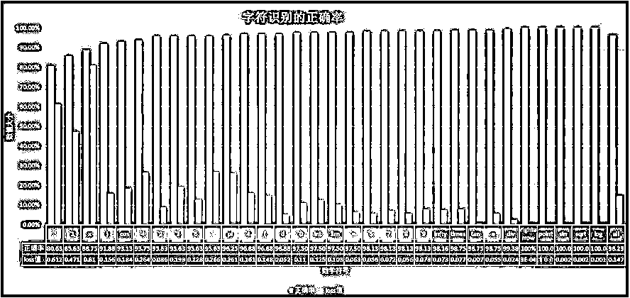

然后，作者对 160 道测试题进行测试，系统做对 127 道题目，正确率为 **79.38%**。可以说相当不错了！

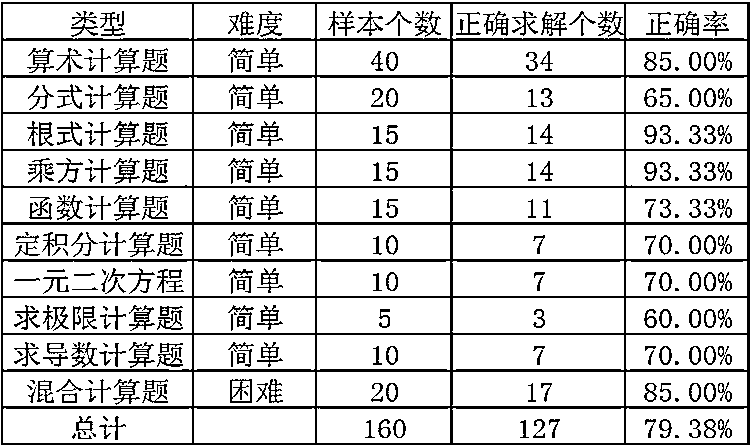

**项目开源**

真正令人激动是作者已将这个项目的源码发布在了 GitHub 上，供大家查看。开源地址为：

***https://github.com/Roujack/mathAI***

GitHub 上公开了系统代码。

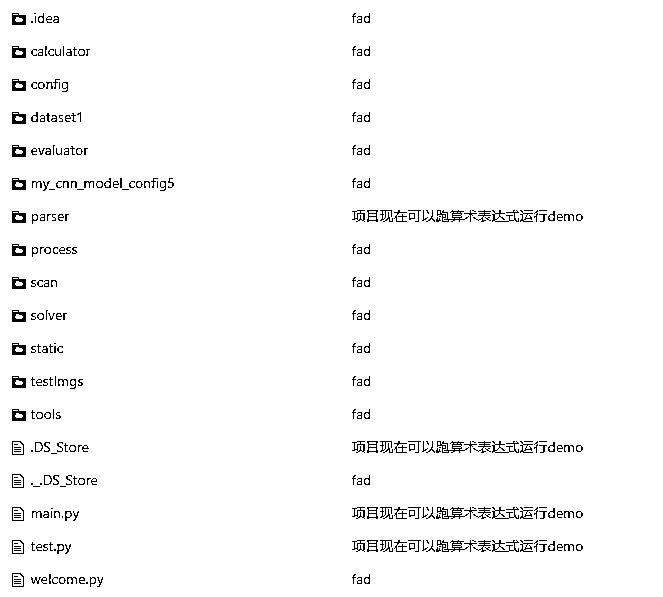

其实，这是一个半开源的项目，目前上传的版本只能处理较简单的一维算术表达式（如果想要识别更加复杂的表达式，可以参考数学公式识别的论文）。可以参考的代码是前面字符识别部分以及整个算法处理框架。

例如图像预处理代码：

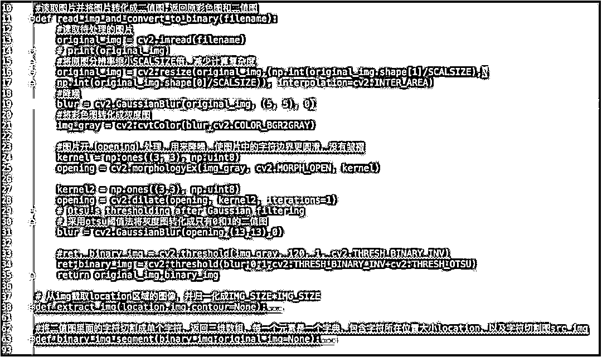

例如字符识别代码：

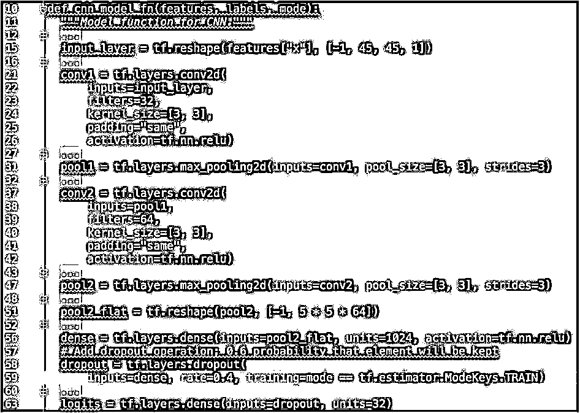

**运行程序**

要运行这个系统分为两种，一种是网页模式，一种是接口模式。 

**1\. 网页模式**

在项目的网页上，输入图片，即可获得处理结果。

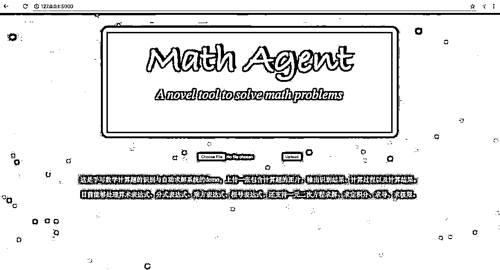

**2\. 接口模式**

项目有一个 solver 的 Python package。里面的 solve 方法封装了整个系统。其功能是输入一张图片路径，将输出计算题识别过程和计算结果。

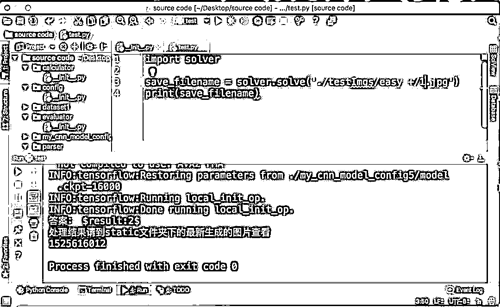

作者还专门录制了一个视频，讲解如何在网页模式上运行程序并验证正确率。视频放在下面，感兴趣的可以看一下。

[`v.qq.com/iframe/preview.html?width=500&height=375&auto=0&vid=u0871v81oin`](https://v.qq.com/iframe/preview.html?width=500&height=375&auto=0&vid=u0871v81oin)

**优点与缺点**

优点：这是一整套拍照做题的算法框架，同时能够处理多种多样的计算题，目前市面上还没有看到实现。OCR 技术如此成熟的今天字符识别已经不算有挑战的东西了。

缺点：字符空间关系判断只用了人类启发式规则，图像预处理不够鲁棒，数学公式的结构识别算法不够完美（可以考虑使用二维文法来做）。系统还有很大的提升空间。

总的来说，这个程序相对比较简单，能够实现一般的手写图片微积分高数题，较复杂的还不能实现。但是该项目确实是一个有意思的尝试，相信作者也会不断优化。有兴趣的可以看一下，试一试你手写的算术题，看看准确率如何。

**MATLAB EXPO 2019 微信直播**

**免费！免费！免费！**

*—End—*

量化投资与机器学习微信公众号，是业内垂直于**Quant**、**MFE**、**CST**等专业的主流自媒体。公众号拥有来自**公募、私募、券商、银行、海外**等众多圈内**10W+**关注者。每日发布行业前沿研究成果和最新资讯。

