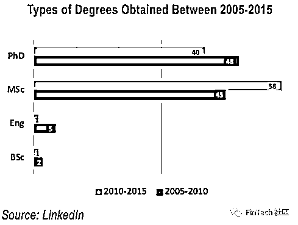
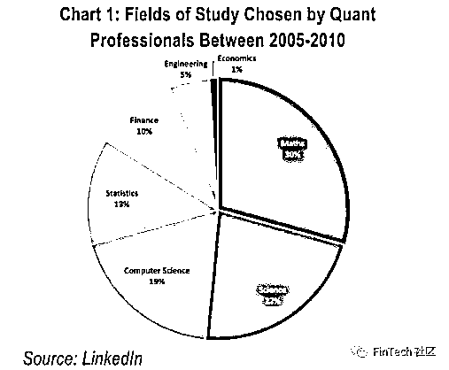
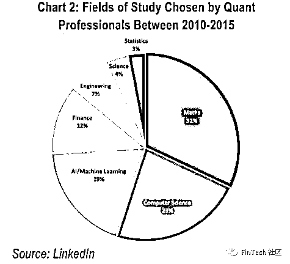

# 量化交易领域最缺的人才！

> 原文：[`mp.weixin.qq.com/s?__biz=MzAxNTc0Mjg0Mg==&mid=2653292198&idx=1&sn=e9964b25e260b70db1cd4ce9377e2966&chksm=802dc4b3b75a4da5d3e92890c2591adbb2a9b640c18be1e015f1e982d44879e6948ba32f017d&scene=27#wechat_redirect`](http://mp.weixin.qq.com/s?__biz=MzAxNTc0Mjg0Mg==&mid=2653292198&idx=1&sn=e9964b25e260b70db1cd4ce9377e2966&chksm=802dc4b3b75a4da5d3e92890c2591adbb2a9b640c18be1e015f1e982d44879e6948ba32f017d&scene=27#wechat_redirect)

**标星★公众号     **爱你们♥

**近期原创文章：**

## ♥ [基于无监督学习的期权定价异常检测（代码+数据）](https://mp.weixin.qq.com/s?__biz=MzAxNTc0Mjg0Mg==&mid=2653290562&idx=1&sn=dee61b832e1aa2c062a96bb27621c29d&chksm=802dc257b75a4b41b5623ade23a7de86333bfd3b4299fb69922558b0cbafe4c930b5ef503d89&token=1298662931&lang=zh_CN&scene=21#wechat_redirect)

## ♥ [5 种机器学习算法在预测股价的应用（代码+数据）](https://mp.weixin.qq.com/s?__biz=MzAxNTc0Mjg0Mg==&mid=2653290588&idx=1&sn=1d0409ad212ea8627e5d5cedf61953ac&chksm=802dc249b75a4b5fa245433320a4cc9da1a2cceb22df6fb1a28e5b94ff038319ae4e7ec6941f&token=1298662931&lang=zh_CN&scene=21#wechat_redirect)

## ♥ [深入研读：利用 Twitter 情绪去预测股市](https://mp.weixin.qq.com/s?__biz=MzAxNTc0Mjg0Mg==&mid=2653290402&idx=1&sn=efda9ea106991f4f7ccabcae9d809e00&chksm=802e3db7b759b4a173dc8f2ab5c298ab3146bfd7dd5aca75929c74ecc999a53b195c16f19c71&token=1330520237&lang=zh_CN&scene=21#wechat_redirect)

## ♥ [Two Sigma 用新闻来预测股价走势，带你吊打 Kaggle](https://mp.weixin.qq.com/s?__biz=MzAxNTc0Mjg0Mg==&mid=2653290456&idx=1&sn=b8d2d8febc599742e43ea48e3c249323&chksm=802e3dcdb759b4db9279c689202101b6b154fb118a1c1be12b52e522e1a1d7944858dbd6637e&token=1330520237&lang=zh_CN&scene=21#wechat_redirect)

## ♥ [利用深度学习最新前沿预测股价走势](https://mp.weixin.qq.com/s?__biz=MzAxNTc0Mjg0Mg==&mid=2653290080&idx=1&sn=06c50cefe78a7b24c64c4fdb9739c7f3&chksm=802e3c75b759b563c01495d16a638a56ac7305fc324ee4917fd76c648f670b7f7276826bdaa8&token=770078636&lang=zh_CN&scene=21#wechat_redirect)

## ♥ [一位数据科学 PhD 眼中的算法交易](https://mp.weixin.qq.com/s?__biz=MzAxNTc0Mjg0Mg==&mid=2653290118&idx=1&sn=a261307470cf2f3e458ab4e7dc309179&chksm=802e3c93b759b585e079d3a797f512dfd0427ac02942339f4f1454bd368ba47be21cb52cf969&token=770078636&lang=zh_CN&scene=21#wechat_redirect)

## ♥ [基于 RNN 和 LSTM 的股市预测方法](https://mp.weixin.qq.com/s?__biz=MzAxNTc0Mjg0Mg==&mid=2653290481&idx=1&sn=f7360ea8554cc4f86fcc71315176b093&chksm=802e3de4b759b4f2235a0aeabb6e76b3e101ff09b9a2aa6fa67e6e824fc4274f68f4ae51af95&token=1865137106&lang=zh_CN&scene=21#wechat_redirect)

## ♥ [人工智能『AI』应用算法交易，7 个必踩的坑！](https://mp.weixin.qq.com/s?__biz=MzAxNTc0Mjg0Mg==&mid=2653289974&idx=1&sn=88f87cb64999d9406d7c618350aac35d&chksm=802e3fe3b759b6f5eca6e777364270cbaa0bf35e9a1535255be9751c3a77642676993a861132&token=770078636&lang=zh_CN&scene=21#wechat_redirect)

## ♥ [神经网络在算法交易上的应用系列（一）](https://mp.weixin.qq.com/s?__biz=MzAxNTc0Mjg0Mg==&mid=2653289962&idx=1&sn=5f5aa65ec00ce176501c85c7c106187d&chksm=802e3fffb759b6e9f2d4518f9d3755a68329c8753745333ef9d70ffd04bd088fd7b076318358&token=770078636&lang=zh_CN&scene=21#wechat_redirect)

## ♥ [预测股市 | 如何避免 p-Hacking，为什么你要看涨？](https://mp.weixin.qq.com/s?__biz=MzAxNTc0Mjg0Mg==&mid=2653289820&idx=1&sn=d3fee74ba1daab837433e4ef6b0ab4d9&chksm=802e3f49b759b65f422d20515942d5813aead73231da7d78e9f235bdb42386cf656079e69b8b&token=770078636&lang=zh_CN&scene=21#wechat_redirect)

## ♥ [如何鉴别那些用深度学习预测股价的花哨模型？](https://mp.weixin.qq.com/s?__biz=MzAxNTc0Mjg0Mg==&mid=2653290132&idx=1&sn=cbf1e2a4526e6e9305a6110c17063f46&chksm=802e3c81b759b597d3dd94b8008e150c90087567904a29c0c4b58d7be220a9ece2008956d5db&token=1266110554&lang=zh_CN&scene=21#wechat_redirect)

## ♥ [优化强化学习 Q-learning 算法进行股市](https://mp.weixin.qq.com/s?__biz=MzAxNTc0Mjg0Mg==&mid=2653290286&idx=1&sn=882d39a18018733b93c8c8eac385b515&chksm=802e3d3bb759b42d1fc849f96bf02ae87edf2eab01b0beecd9340112c7fb06b95cb2246d2429&token=1330520237&lang=zh_CN&scene=21#wechat_redirect)

**缺我**

**言归正传**

如今，量化研究人员正在开发算法，利用机器学习，这些算法可以通过分析客户数据、识别特征，从而为客户推荐出最相关的产品/服务。今天这篇文章是关于量化交易领域的人才市场一些洞察述。

*   **最缺的人才：c++ developer**

*   **最有潜力的人才：量化研究-机器学习**

*   **新兴的人才：数据分析**

*   **竞争最激烈的职位：量化研究**

**正文**

在量化交易领域，研究和开发是行业存在的基础，已经有人做了大量工作来回答一些尚未解决的问题。在投资银行和对冲基金的语音交易平台上，你会发现交易者、结构者和开发量化模型的量化——对复杂的单纯期权和奇异衍生品合约交易、定价并进行风险管理。90 年代衍生产品定价专家的技能组合通常是拥有一个在顶尖院校的纯数学专业的博士学位，主修马尔可夫链模型、偏微分方程或蒙特卡罗建模。快进到今天，技能组合已有很大不同。**Quant 需要在计算金融领域有坚实的基础——这是一个软件工程和应用数学的结合。**

最近的一项研究证实了这一说法(见下图)；请注意，在 2005-2010 年间毕业的 Quant 占了所选定学位的毕业生的近 50%。相比之下，2010-2015 年下降了 18%。而且当你在不同时间区间之间比较科学硕士学位的流行性时，他们已经经历了一个向上的轨道，并且显著增长了 13%。**值得注意的是，人们越来越有兴趣雇佣在某一特定领域从事进一步研究并有实际工作经验的 Quant，而不是一个可能已经花了 8 年时间攻读哲学博士学位和博士后研究的 Quant。**对未来的雇员来说，实际工作经验比理论知识更有价值。也就是说，重要的是要认识到，**高度专业化的 Quant Researcher 总是会优先选择拥有博士学位的宽客作为技能提供者**，比如在无人监管的环境中进行独立研究和分析。

自 2008 年金融危机十年后，有证据表明，市场已经发生了变化，对风险的偏好在很大程度上降低了。曾经不知道或对理解他们正在买卖交易的复杂证券不感兴趣的客户现在更倾向于投资流动资产。这些奇异金融产品有成千上万的标的的产生高回报的高风险的奇异产品已经越来越不受欢迎，因此迫切需要对这类产品进行建模。**因此，流动性交易量的增加和流动性工具交易需求的增加是市场的大势所趋。**

**Quant 不再仅仅关注构建复杂的衍生产品定价模型；重点已经转移到改进现有模型和使用技术来创建工具——这些工具准确地代表了真实世界的风险/机遇以供交易者采取行动。因此，技能组合的转变已经转移到诸如计算金融、工程与计算机科学、模式识别和信号处理，以及人工智能和机器学习**。技术进步的副产品是可用的计算能力，这意味着跑一次包含大量市场数据的模拟，过去可能需要几个小时，现在可能只需要几分钟。缓慢、不可靠和过时技术的成本是生产率的障碍，因此，量化系统开发工程师的市场依然繁荣活跃。那些能够开发核心基础设施和生产系统的人会被给予很高的重视。这些系统可以有效计算千万衍生产品合约，并且能够研究剖析数字和作出有价值的分析报告。特别强调的是运用的语言是 C++，目前市场上，90%的对冲基金公司都在招聘 C++ Developer。但是能够达到要求的 C++ Developer 却不多。 

上面的图表说明了在未来教育中被选中的正在流行的研究领域里两类人员之间的差异，第一类是毕业于 2005-2010 年间，第二类是毕业于 2010-2015 年间。 在结果中有一些重大结论被发现：在两段时间年份中，**数学都是最流行的研究领域，毕竟这也是数量分析到如今经久不衰的基本原则。**但是，然而，显而易见的是，在同一时期，计算机科学的受欢迎程度上升了 4%，接近第二位。看来统计数据在排名中有所下降了 10%，并被机器学习所取代。机器学习占第二组的 19%。**有些人会认为机器学习是统计建模和应用于大数据集的计算机科学的混合体，这使得它在当今的行业中成为一个更相关的选择**。在此期间，金融和工程略有变化，而普通科学从图表[1]中的第二名上升到图表[2]的第四名，受欢迎程度下降了 18%。

**人才之战**

很明显，如今 Quant 的角色已经发生了变化，因此这个术语不再仅仅与忙于定价和在银行中做市商部门设计对冲策略的博士的形象联系在一起，也不是对冲基金或自营交易公司。金融服务的许多领域现在都可以找到 Quant，无论是在银行的风险部门——验证/审查定价模型；在零售银行预测客户拖欠贷款/抵押贷款的可能性；或者是为小型精品店客户开发第三方投资分析的 R&D 集团。因此，进入该行业的初级 Quant 有更广泛的职业选择。一次可以观察到的结果是通过提供一条更非传统的职业道路和一个完全不同的命题，无论大小，Fintech 公司在吸引 Quant 人才方面都取得了更大的成功——这种吸引力来自于一种企业家精神、协作精神和更少官僚制度环境。并且在某些情况下，你会拥有股权。  

**另一方面，有一种观点认为，没得到的一定是更好的。所以买方仍然被视为通往阿尔法和投资组合管理的大门。自营交易、无上限奖金诱惑仍然是业内最聪明、最有能力的人首选的目的地。更常见的情况是，趋势是从卖方到买方，或从买方到买方的单向流向。当然，钱会带来风险；基金表现不佳，或者雇佣你的投资组合经理损失惨重。**

**如何在新技术时代证明你的技能**

**要在竞争激烈的就业市场紧跟潮流，就必须保持技术精进，而且****编程是必须的****。**最受欢迎的技能是熟练使用 Python，因为它是一种用于脚本编写、原型制作和实现解决方案的开源语言。这是许多角色和企业的首选语言，以至于没有这种技术可能会成为吸引人才库中最顶尖人才或输给竞争对手的区别。Python 支持多重编程解析典范，包括面向对象、命令式、函数式和过程式。主要的商业利益是通过自动化简单但劳动密集型的过程来提高生产效率，将数据聚集到可视化工具中，以促进高效的决策制定。**但同时，如果公司业务对低延迟有要求，那么就需要 C++了，并且目前的市场情况是低延迟系统的 C****++ 人才少，职位多****。**

数据工程和大数据分析技能也同样不是一个“你拥有的话会不错”的技能，而应是必须有的前提条件，因为**很多面向金融领域的一系列决策/行为科学新问题需要数据驱动的方法**。理解替代数据集以复制真实世界的情景，为决策者、政策制定者和投资者提供具有竞争优势的洞察力。以算法交易为例；它使用具有复杂数学模型的大量历史数据来最大化投资组合回报。一家保险公司可能想分析从汽车里的黑匣子地理空间数据去估计投保人发生事故并索赔的可能性。通过基于数百个因素的分析、建模和预测结果，使用线性回归/时间序列分析/随机森林方法，对少数结果赋予权重，从而为保险费定价——是可能的。**从数据中发现的信号中提取价值的方法有很多，且围绕智能分析仍将是一个未来几年投资的重要领域。**

机器/深度学习也是市场上一个蓬勃发展的领域，供不应求。有一种想法是将复杂的方法，如神经网络、贝叶斯推理或自然语言处理[NLP]，应用于大型结构化和非结构化数据集，采用监督或无监督学习的选择。由于数据战持续不断，对这类技能的需求将会占上风，而这个领域的顶尖人才也会被标上最高的价码标签。尽管硅谷是全球公认的尖端技术和创新研发之都，也是业内一些最有才华人士的圣地，**但高频交易公司、电子交易流动性提供商和对冲基金都仍在招募机器学习，即使研发成本高，不仅仅需要具备专业的机器学习专业知识，还要精通统计，对金融知识熟悉，但是这是技术的未来，下一个技术时代。**

**如何进行人才布局**

我们预计，技术将成为在整个行业创造新角色的催化剂，即使是在人们最意想不到的领域，在这些领域，**量化研究和开发之间的界限将变得更加模糊。策略可以解释为优化、分析、风险管理和编程之间的交集**。在多数情况下，其任务是向交易平台提供可量化的价值。自动化被认为是最大的增长领域之一:在买方，越来越多的参与者转向系统交易；在卖方，交易台将缩减语音交易业务，并转向电子化。    

就业市场仍将是一个竞争激烈的环境。由于许多公司都寻求有着相同的技能组合的人才，因此它将创造一个出价最高者获胜的卖方市场。其他考虑因素是，**为了能够争夺到顶尖人才，企业必须提供智力刺激的工作——一个鼓励协作、问责制度以及自由表达想法的生态系统，以让员工觉得自己有能力做出改变。作为企业的领导者，在人才招募方面，薪资已经不是唯一人才考虑的因素了，具有前瞻性，有远见的人才招聘和科学的公司管理，为团队提供开拓前沿研究的机会才能从世界一流技术的进步中获得战略地位。 **

作者：Lucy Luo

来自：FinTech 社区

**MATLAB EXPO 2019 微信直播**

**免费！免费！免费！**

*—End—*

量化投资与机器学习微信公众号，是业内垂直于**Quant**、**MFE**、**CST**等专业的主流自媒体。公众号拥有来自**公募、私募、券商、银行、海外**等众多圈内**10W+**关注者。每日发布行业前沿研究成果和最新资讯。

