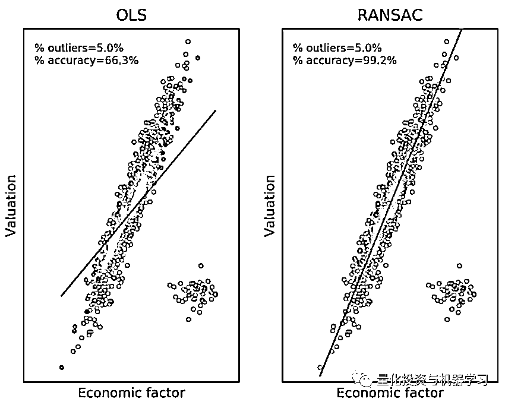

# AQR 最最最新 | 计量经济学应用投资失败的 7 个原因

> 原文：[`mp.weixin.qq.com/s?__biz=MzAxNTc0Mjg0Mg==&mid=2653292186&idx=1&sn=87501434ae16f29afffec19a6884ee8d&chksm=802dc48fb75a4d99e0172bf484cdbf6aee86e36a95037847fd9f070cbe7144b4617c2d1b0644&scene=27#wechat_redirect`](http://mp.weixin.qq.com/s?__biz=MzAxNTc0Mjg0Mg==&mid=2653292186&idx=1&sn=87501434ae16f29afffec19a6884ee8d&chksm=802dc48fb75a4d99e0172bf484cdbf6aee86e36a95037847fd9f070cbe7144b4617c2d1b0644&scene=27#wechat_redirect)

**标星★公众号     **爱你们♥

作者：Marcos López de Prado

编译：公众号编辑部

**近期原创文章：**

## ♥ [基于无监督学习的期权定价异常检测（代码+数据）](https://mp.weixin.qq.com/s?__biz=MzAxNTc0Mjg0Mg==&mid=2653290562&idx=1&sn=dee61b832e1aa2c062a96bb27621c29d&chksm=802dc257b75a4b41b5623ade23a7de86333bfd3b4299fb69922558b0cbafe4c930b5ef503d89&token=1298662931&lang=zh_CN&scene=21#wechat_redirect)

## ♥ [5 种机器学习算法在预测股价的应用（代码+数据）](https://mp.weixin.qq.com/s?__biz=MzAxNTc0Mjg0Mg==&mid=2653290588&idx=1&sn=1d0409ad212ea8627e5d5cedf61953ac&chksm=802dc249b75a4b5fa245433320a4cc9da1a2cceb22df6fb1a28e5b94ff038319ae4e7ec6941f&token=1298662931&lang=zh_CN&scene=21#wechat_redirect)

## ♥ [深入研读：利用 Twitter 情绪去预测股市](https://mp.weixin.qq.com/s?__biz=MzAxNTc0Mjg0Mg==&mid=2653290402&idx=1&sn=efda9ea106991f4f7ccabcae9d809e00&chksm=802e3db7b759b4a173dc8f2ab5c298ab3146bfd7dd5aca75929c74ecc999a53b195c16f19c71&token=1330520237&lang=zh_CN&scene=21#wechat_redirect)

## ♥ [Two Sigma 用新闻来预测股价走势，带你吊打 Kaggle](https://mp.weixin.qq.com/s?__biz=MzAxNTc0Mjg0Mg==&mid=2653290456&idx=1&sn=b8d2d8febc599742e43ea48e3c249323&chksm=802e3dcdb759b4db9279c689202101b6b154fb118a1c1be12b52e522e1a1d7944858dbd6637e&token=1330520237&lang=zh_CN&scene=21#wechat_redirect)

## ♥ [利用深度学习最新前沿预测股价走势](https://mp.weixin.qq.com/s?__biz=MzAxNTc0Mjg0Mg==&mid=2653290080&idx=1&sn=06c50cefe78a7b24c64c4fdb9739c7f3&chksm=802e3c75b759b563c01495d16a638a56ac7305fc324ee4917fd76c648f670b7f7276826bdaa8&token=770078636&lang=zh_CN&scene=21#wechat_redirect)

## ♥ [一位数据科学 PhD 眼中的算法交易](https://mp.weixin.qq.com/s?__biz=MzAxNTc0Mjg0Mg==&mid=2653290118&idx=1&sn=a261307470cf2f3e458ab4e7dc309179&chksm=802e3c93b759b585e079d3a797f512dfd0427ac02942339f4f1454bd368ba47be21cb52cf969&token=770078636&lang=zh_CN&scene=21#wechat_redirect)

## ♥ [基于 RNN 和 LSTM 的股市预测方法](https://mp.weixin.qq.com/s?__biz=MzAxNTc0Mjg0Mg==&mid=2653290481&idx=1&sn=f7360ea8554cc4f86fcc71315176b093&chksm=802e3de4b759b4f2235a0aeabb6e76b3e101ff09b9a2aa6fa67e6e824fc4274f68f4ae51af95&token=1865137106&lang=zh_CN&scene=21#wechat_redirect)

## ♥ [人工智能『AI』应用算法交易，7 个必踩的坑！](https://mp.weixin.qq.com/s?__biz=MzAxNTc0Mjg0Mg==&mid=2653289974&idx=1&sn=88f87cb64999d9406d7c618350aac35d&chksm=802e3fe3b759b6f5eca6e777364270cbaa0bf35e9a1535255be9751c3a77642676993a861132&token=770078636&lang=zh_CN&scene=21#wechat_redirect)

## ♥ [神经网络在算法交易上的应用系列（一）](https://mp.weixin.qq.com/s?__biz=MzAxNTc0Mjg0Mg==&mid=2653289962&idx=1&sn=5f5aa65ec00ce176501c85c7c106187d&chksm=802e3fffb759b6e9f2d4518f9d3755a68329c8753745333ef9d70ffd04bd088fd7b076318358&token=770078636&lang=zh_CN&scene=21#wechat_redirect)

## ♥ [预测股市 | 如何避免 p-Hacking，为什么你要看涨？](https://mp.weixin.qq.com/s?__biz=MzAxNTc0Mjg0Mg==&mid=2653289820&idx=1&sn=d3fee74ba1daab837433e4ef6b0ab4d9&chksm=802e3f49b759b65f422d20515942d5813aead73231da7d78e9f235bdb42386cf656079e69b8b&token=770078636&lang=zh_CN&scene=21#wechat_redirect)

## ♥ [如何鉴别那些用深度学习预测股价的花哨模型？](https://mp.weixin.qq.com/s?__biz=MzAxNTc0Mjg0Mg==&mid=2653290132&idx=1&sn=cbf1e2a4526e6e9305a6110c17063f46&chksm=802e3c81b759b597d3dd94b8008e150c90087567904a29c0c4b58d7be220a9ece2008956d5db&token=1266110554&lang=zh_CN&scene=21#wechat_redirect)

## ♥ [优化强化学习 Q-learning 算法进行股市](https://mp.weixin.qq.com/s?__biz=MzAxNTc0Mjg0Mg==&mid=2653290286&idx=1&sn=882d39a18018733b93c8c8eac385b515&chksm=802e3d3bb759b42d1fc849f96bf02ae87edf2eab01b0beecd9340112c7fb06b95cb2246d2429&token=1330520237&lang=zh_CN&scene=21#wechat_redirect)

大家之前一定看过我们发表的这篇文章：

[***机器学习应用量化投资失败的 7 个主要原因***](http://mp.weixin.qq.com/s?__biz=MzAxNTc0Mjg0Mg==&mid=2653286358&idx=1&sn=549e54a2a3b9607b18056463d90cd929&chksm=802e2dc3b759a4d5173bdb2f32801d79831cacf28d47c99f9c956fb42c039f6a23bb9cd98983&scene=21#wechat_redirect)

很多机构投资者、研究员与相关自媒体都转发和学习过此文。

近期，Marcos López de Prado 大神又发新作了，**公众号****以最快的速度拿到 pepper，以最快地的速度进行解读**。

话不多说，进入正题！

**文中涉及的所有参考论文**

**我们已全部下载**

**请在文末获取**

**什么是计量经济学？**

*“[T]he concept of multiple regression and the linear regression model in particular constitutes the underlying platform of most econometric modeling, even if the linear model itself is not ultimately used as the empirical specification.”*

*William Greene, Econometric Analysis (2012, p.7)*

至于其历史和学科介绍网上有很多，在此不再敖述。**计量经济学的停滞**

1、《科学网》报道，截至 2018 年 11 月，“经济学”和“统计与概率”交叉学科共发表了 13772 篇期刊文章。

2、在这些出版物中，**只有 89 篇文章（0.65％）**包含以下术语：

*   分类器，聚类，神经网络，机器学习

3、相比之下，在“生物学”和“统计与概率”交叉的 40283 篇文章中，**有 4049 篇（10.05%）**包含了上述任何一个术语。

4、在“化学、分析”和“统计与概率”交叉的 4994 篇文章中，共**有 766 篇（15.34％）**包含了上述任何一个术语。

**原因一：结构化数据**

**计量经济数据相对乏味**

1、信息最丰富的数据集**适用于机器学习，但不适用于计量经济学**。

*   **非结构化数据：**所有可用数据中只有不到 20％是结构化的。来自（IDC [2014]，https://www.emc.com/leadership/digital-universe/2014iview/index.htm）。

*   **高维数据集：**变量的数量往往超过观测值的数量。

*   **稀疏/噪声数据集：**每单位信号中有很大比例的零或噪声。

*   **等级关系：**经济系统往往涉及 agents 网络。

来自非结构性在线价格的通胀估计，可以准确预测美国的年度通胀数据

*来自：《THE BILLION PRICES PROJECT: USING ONLINE PRICES FOR MEASUREMENT AND RESEARCH》，**论文文末下载。*

2、标准计量经济学转换以牺牲平稳性为代价。具体详见：*《Advances in Financial Machine Learning: Lecture 2/10》，*论文文末下载。**

同时参考我们之前的一篇文章：[Advances in Financial Machine Learning 第二章解读](https://mp.weixin.qq.com/s?__biz=MzAxNTc0Mjg0Mg==&mid=2653292098&idx=1&sn=b48bfb2858fc3edb00679c95dacd146f&chksm=802dc457b75a4d41d5a2765a8824830d5a74210b0bafa0ac0fb2529980c912abfbb5a5068ba4&token=72305794&lang=zh_CN&scene=21#wechat_redirect)

**3、计量经济学方法有效地为无趣数据建模。**

非结构化数据示例：

在下面的图中，算法已经识别出与特斯拉相关的新闻文章。

*   **蓝色 bar：**每日统计文章总数。平均每天 458 篇，最多 5000 篇。

*   **绿色 bar：**每日统计表达积极情绪的文章数量。

*   **红色 bar：**每日统计表达负面情绪的文章数量。

即时的价格反应与强烈的情绪失衡同时发生。 尽管如此，在最初的突发新闻之后，似乎仍存在一些残余影响。 可以训练机器学习算法以识别价格何时对情绪不平衡最敏感。

**原因二：相关性/贝塔系数**

**金融相关性噪声很大**

1、计量经济学不包括对相关矩阵进行去噪和去音的方法。

2、因此，**大多数计量经济学研究得出的结论都是错误的，其依据是噪音，而不是信号！**

金融相关矩阵中包含的几乎所有特征值都与噪声有关，而与信号无关。计量经济学研究估计反映虚假关系的贝塔系数。

可以确定哪些特征值必须进行数值处理，以防止错误的发现，但这些方法很少用于计量经济学研究（N.B：收缩率无法区分信号和噪声）

# *来自：《Noise Dressing of Financial Correlation Matrices》，**论文文末下载。*

**相关性和异常值**

横截面研究对异常值的存在特别敏感。即使是很小比例的异常值也会导致很大比例的错误信号：应该卖出的买入，应该买入的卖出。

在这个图中，我们对证券的横截面进行回归，其中只有很小的百分比（仅 5％）是异常值：

*   红点是大票，但被错误地归类为小票。

*   绿色的点是小票，但被错误地归类为大票。

**只有 5%的异常值，横截面回归产生 34％的分类误差**。相比之下，**RANSAC 算法**的分类误差仅为 1%（大多为边界情况）。

RANSAC 算法论文，文末下载

相关性是衡量线性相关性的一个有用的方法，但它也有缺陷：

*   金融领域中的大多数相关性都是非线性的

*   相关性受到异常值的严重影响

*   相关性在多元正态分布之外的应用有限

*   相关性不模拟激活阈值和机制转换

线性关系

相关性约为 1，NMI 也非常高，约为 0.9。

非线性关系

尽管 x 和 y 之间有很强的相关性，但相关性约为 0。相比之下，NMI 仍然很高。

**原因三：方差判定和因果谬误**

1、计量经济学规范试图**adjudicate**{Xt,i}样本中{yt}的方差，同时控制 adjudicate 为{Zt,j}的方差。

2、这带来了两个问题：

*   样本内裁决对策略制定很少有用

*   模型需要判断控制变量的方差{Zt,j}

3、相比之下，机器学习方法尝试使用{Xt,i}**预测**{yt}在样本外，同时控制{Zt,j}（无论规范如何）

4、**回归是错误的投资工具：**计量经济学借用了生物学的工具包，在生物学中，样本外预测不是一个关键目标。

**因果谬误**

根据论文*《Regression and Causation: A Critical Examination of Six Econometrics Textbooks》**（文末下载论文）*发现：在最具影响力的计量经济学教材中，有六本出现了基本的数学和统计错误：

*   混淆了因果关系

*   混淆预测与因果关系

*   混淆因果关系与格兰杰因果关系（用词不当）

*   未能提供区分因果概念和统计概念的连贯数学符号

这种普遍的状态会导致虚假的因果关系声明，从而转化为错误的投资策略。

*“The introduction of graphical models and distinctcausal notation into elementary econometric textbooks has the potential of revitalizing economics education and* ***bringing next generation economists to par with modern methodologies*** *of modeling and inference.”*

**原因四：Specification-Interaction Search**

考虑典型的计量经济模型：

1、这要求研究人员立即获得两项：

*   预测变量：{𝑥1,𝑥2}

*   函数形式：典型的线性规范，具有乘法交互作用

**2、鉴于金融体系的复杂性，这些要求是不切实际的。**

3、即使研究人员能够猜出一个现象所涉及的相关变量是什么，往往也无法事先确定准确的功能形式，包括所有的交互作用（interaction effect）。

**虚假的计量经济学的结论**

考虑具有交互作用的简单流程生成的数据，例如：

假设我们得到了正确的变量，但是我们无法识别交互作用，而是进行了测试

预测和实现之间的关系只有 0.04，尽管我们已经提供了正确的变量模型(𝑥1,𝑥2)。

传统的计量经济学模型并不“学习”数据的结构。

**除非我们提供确切的（未知的）说明，否则我们将得出错误的结论。**

我们可以采用机器学习方法：通过引导估计 1000 个决策树，并形成一个集成预测。

和以前一样，我们没有告诉算法交互作用的存在。**与以前不同，该算法“学习”了所提供变量的正确模型规范。**

由于算法能够“学习”数据结构，而不是我们指导搜索，因此预测的𝑦𝑡和实际𝑦𝑡之间的样本外相关性上升到 0.98。

**原因五：p 值**

**在 p=0.05 时，大多数策略是错误的**

假设一个经过回测的策略，盈利的概率是 1%。

然后，在 5%的显著性和 80%的 power 的标准阈值下，研究员预计将在 1000 次试验中做出 58 项发现，其中 8 项为真阳性，50 项为假阳性。

在这种情况下，**p 值为 5%意味着至少 86%的发现是假的！**

**在实际中，金融中的错误发现率远高于 86％**，因为：

*   由于多次测试，familywise 的显著性水平远远大于 5%

*   由于竞争，发现新策略的概率低于 1%

*   策略的保质期很短。策略在几个月或几年之内不会保持 true

*   规范错误和其他违反假设的行为进一步增加了错误发现率

**计量经济学陷入了 p<0.05 的时代**

1、尽管金融经济学的大多数研究结果都依赖于 p<0.05 的论点：

*   p 值需要强有力的假设，如正确的规范，不相关的回归，遵循正态分布的白噪声残差等。

*   在多线性回归的一般情况下，p 值不能被鲁棒估计。

*   p 值评估不相关的概率，p[𝑋>𝑥|𝐻0]：

https://www.nature.com/news/scientific-method-statistical-errors-1.14700

*   我们真正关心的是 p[𝐻1|𝑋>𝑥]：

*https://royalsocietypublishing.org/doi/pdf/10.1098/rsos.140216*

**（文末下载论文）**

*   p 值评估样本内的显著性，而不是样本外。

2、通过 p 值发现的“统计显著”因素包括：

*   价值、动量、质量、规模、流动性、防御性等。

**对 p 值的滥用如此普遍，以至于美国统计协会（American Statistical Association）已经不鼓励将 p 值作为统计重要性的衡量标准（Wasserstein 等人[2019]）。**

*https://www.tandfonline.com/doi/pdf/10.1080/00031305.2019.1583913?needAccess=true&*

**（文末下载论文）**

使人们怀疑数十年的计量经济学研究：

**（文末下载论文）**

**p 值实验**

考虑一个包含 40 个特征的二元随机分类问题，其中 5 个特征是有用的，30 个特征是冗余的，5 个特征是噪声的。

1、**有用特征**（用“I_”前缀标记）：用来生成标签。

2、**冗余特征**（以“R_”前缀标记)：指通过向随机选择的有用特征添加高斯噪声而形成的特征。

**3、噪声特征**（用“N_”前缀标记）：那些不用于生成标签的特征。

水平条表示从 Logit 回归得到的 p 值，垂直虚线表示 5%的显著性水平。

**这些 p 值歪曲了基本事实：**

*   在 35 个非噪声特征中，只有 4 个被认为是重要的

*   噪声特征被评为相对重要

*   排名最不重要的 14 项特征中，没有噪声特征

**特征重要性的现代方法**

我们可以重复相同的实验，而不是计算 p 值，我们应用平均精度下降方法（MDA）：

1、在训练集上拟合机器学习算法，并估计样本外的准确性

2、一次改变一个变量，并重新估计样本外的准确度

3、通过改变每个变量来评估样本外精度的衰减

**MDA 结果与实际情况一致：**

*   MDA 总体上在分离噪声特征方面做得很好。噪声特征排在最后。

*   噪声特征在量级上也不重要，MDA 值基本为 0。

*   通过将相似的变量聚类（一种无监督学习方法），可以进一步改善结果。

**原因六：训练集过拟合**

1、统计模型可能在两方面过拟合：

*   **训练集过拟合**：规范非常灵活，可以解释噪声（而不是信号）

*   **测试集过拟合**：根据测试集性能来选择模型（同时隐藏了其他较差性能的模型）

2、计量经济学正在很大程度上无法解决和量化这两个问题。

相比之下，机器学习的研究员已经开发出方法来解决和量化这两种形式的过度拟合。

理想情况下，应该同时使用所有方法，而不是使用其中的一种。

**举例：集成学习 Bootstrap Aggregation**

1、选择一个子集的数据，通过随机抽样与其替换。 

2、将机器学习算法拟合到步骤 1。

3、使用步骤 2 对不包含在步骤 1 中的数据点进行预测（此预测中的误差称为 out of bag error）。

关于 out of bag error 这里有两个参考：

*https://stackoverflow.com/questions/18541923/what-is-out-of-bag-error-in-random-forests*

http://blog.sina.com.cn/s/blog_4c9dc2a10102vl24.html

4.、多次重复步骤 1—步骤 3

Bootstrap Aggregation（bagging）实现了两个目标：

1、减少预测误差的方差见上图。

2、如果单个估算器的准确度最低，**则组合预测的准确性超过了各个分类器的平均准确度。**

**原因七：测试集过拟合**

**金融公司如何进行研究**

1、假设你正在寻找一种投资策略。运行了多个计量经济学回归模型，并找到实现高夏普比率的结果，其中一些高于 3。

2、你把这些结果展示给你的老板，他决定在几周内用 Paper Trade 进行测试。幸运的是， Paper Trade 表现似乎与回测一致，因此准备拿这个模型进入实盘阶段。

3、给该策略分配了 1 亿美元，但不幸的是，不久后就出现了 20%的亏损。

4、策略永远不会像之前那样保持业绩，没有永远的圣杯！

**金融中最重要的环节**

看下图，y 轴显示给定试验次数（x 轴）的最大夏普比率(max {SR})的分布。

颜色越浅表示获得该结果的可能性越大，而指示线表示期望值。

例如，仅经过 1000 次回测（试验），**即使策略的真实夏普比率为 0**，预期的最大夏普比率(E[max{SR}])为 3.26 !

来自：《利用无监督学习方法检测虚假投资策略》，*（文末下载论文）。*

最好的回测结果不能代表基本事实（**选择性偏差**）。

将回测限制在一些规范内并不是一个解决方案。（**确认性偏差**）

**大多数计量经济学投资之所以失败，是因为资产管理公司和学术期刊无法控制选择性偏差和确认性偏差。**

**克服计量经济学的局限性**

金融公司和学术作者可以使他们的统计方法更加现代化。而且是可以实现的：计量经济学分析的每一步，都有一个对应的机器学习工具包。

**计量经济学应用量化投资案例**我们在网上找了很多。发现**Wind**有一个课程，系统的把计量经济学的概念、Python 应用和量化集合了起来，推荐大家收看。主要是**免费，**对用户比较友好！这是课程的视频：

这个课程的 notebook：**<<向左滑动>>**

学习地址：

**www.windquant.com**>>**学院**>>**中级课程**

**MATLAB EXPO 2019 微信直播**

**免费！免费！免费！**

**文中所有论文下载**

在**后台**输入（严格大小写）

***Econometric_LHTZ***

*—End—*

量化投资与机器学习微信公众号，是业内垂直于**Quant**、**MFE**、**CST**等专业的主流自媒体。公众号拥有来自**公募、私募、券商、银行、海外**等众多圈内**10W+**关注者。每日发布行业前沿研究成果和最新资讯。

