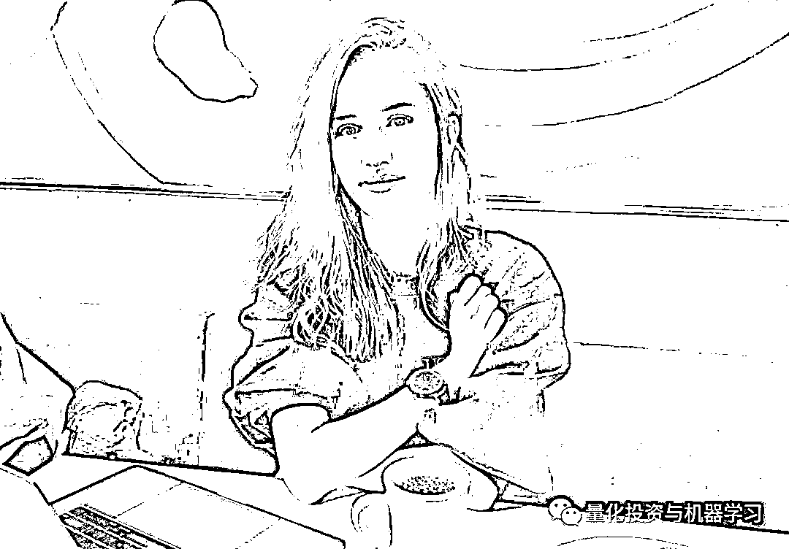
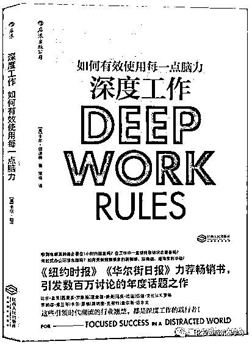

# 小姐姐的传奇蜕变！从丑小鸭到 Developer

> 原文：[`mp.weixin.qq.com/s?__biz=MzAxNTc0Mjg0Mg==&mid=2653292123&idx=1&sn=1f4ace1f06c01341bb94b3121354d225&chksm=802dc44eb75a4d582f45a94aa87107e92a2b2aefdfe2134001f2107170870e2e9ff14c6e6a8f&scene=27#wechat_redirect`](http://mp.weixin.qq.com/s?__biz=MzAxNTc0Mjg0Mg==&mid=2653292123&idx=1&sn=1f4ace1f06c01341bb94b3121354d225&chksm=802dc44eb75a4d582f45a94aa87107e92a2b2aefdfe2134001f2107170870e2e9ff14c6e6a8f&scene=27#wechat_redirect)

**标星★公众号     **爱你们♥

作者：Madison Kanna

编译：公众号编辑部

**近期原创文章：**

## ♥ [基于无监督学习的期权定价异常检测（代码+数据）](https://mp.weixin.qq.com/s?__biz=MzAxNTc0Mjg0Mg==&mid=2653290562&idx=1&sn=dee61b832e1aa2c062a96bb27621c29d&chksm=802dc257b75a4b41b5623ade23a7de86333bfd3b4299fb69922558b0cbafe4c930b5ef503d89&token=1298662931&lang=zh_CN&scene=21#wechat_redirect)

## ♥ [5 种机器学习算法在预测股价的应用（代码+数据）](https://mp.weixin.qq.com/s?__biz=MzAxNTc0Mjg0Mg==&mid=2653290588&idx=1&sn=1d0409ad212ea8627e5d5cedf61953ac&chksm=802dc249b75a4b5fa245433320a4cc9da1a2cceb22df6fb1a28e5b94ff038319ae4e7ec6941f&token=1298662931&lang=zh_CN&scene=21#wechat_redirect)

## ♥ [深入研读：利用 Twitter 情绪去预测股市](https://mp.weixin.qq.com/s?__biz=MzAxNTc0Mjg0Mg==&mid=2653290402&idx=1&sn=efda9ea106991f4f7ccabcae9d809e00&chksm=802e3db7b759b4a173dc8f2ab5c298ab3146bfd7dd5aca75929c74ecc999a53b195c16f19c71&token=1330520237&lang=zh_CN&scene=21#wechat_redirect)

## ♥ [Two Sigma 用新闻来预测股价走势，带你吊打 Kaggle](https://mp.weixin.qq.com/s?__biz=MzAxNTc0Mjg0Mg==&mid=2653290456&idx=1&sn=b8d2d8febc599742e43ea48e3c249323&chksm=802e3dcdb759b4db9279c689202101b6b154fb118a1c1be12b52e522e1a1d7944858dbd6637e&token=1330520237&lang=zh_CN&scene=21#wechat_redirect)

## ♥ [利用深度学习最新前沿预测股价走势](https://mp.weixin.qq.com/s?__biz=MzAxNTc0Mjg0Mg==&mid=2653290080&idx=1&sn=06c50cefe78a7b24c64c4fdb9739c7f3&chksm=802e3c75b759b563c01495d16a638a56ac7305fc324ee4917fd76c648f670b7f7276826bdaa8&token=770078636&lang=zh_CN&scene=21#wechat_redirect)

## ♥ [一位数据科学 PhD 眼中的算法交易](https://mp.weixin.qq.com/s?__biz=MzAxNTc0Mjg0Mg==&mid=2653290118&idx=1&sn=a261307470cf2f3e458ab4e7dc309179&chksm=802e3c93b759b585e079d3a797f512dfd0427ac02942339f4f1454bd368ba47be21cb52cf969&token=770078636&lang=zh_CN&scene=21#wechat_redirect)

## ♥ [基于 RNN 和 LSTM 的股市预测方法](https://mp.weixin.qq.com/s?__biz=MzAxNTc0Mjg0Mg==&mid=2653290481&idx=1&sn=f7360ea8554cc4f86fcc71315176b093&chksm=802e3de4b759b4f2235a0aeabb6e76b3e101ff09b9a2aa6fa67e6e824fc4274f68f4ae51af95&token=1865137106&lang=zh_CN&scene=21#wechat_redirect)

## ♥ [人工智能『AI』应用算法交易，7 个必踩的坑！](https://mp.weixin.qq.com/s?__biz=MzAxNTc0Mjg0Mg==&mid=2653289974&idx=1&sn=88f87cb64999d9406d7c618350aac35d&chksm=802e3fe3b759b6f5eca6e777364270cbaa0bf35e9a1535255be9751c3a77642676993a861132&token=770078636&lang=zh_CN&scene=21#wechat_redirect)

## ♥ [神经网络在算法交易上的应用系列（一）](https://mp.weixin.qq.com/s?__biz=MzAxNTc0Mjg0Mg==&mid=2653289962&idx=1&sn=5f5aa65ec00ce176501c85c7c106187d&chksm=802e3fffb759b6e9f2d4518f9d3755a68329c8753745333ef9d70ffd04bd088fd7b076318358&token=770078636&lang=zh_CN&scene=21#wechat_redirect)

## ♥ [预测股市 | 如何避免 p-Hacking，为什么你要看涨？](https://mp.weixin.qq.com/s?__biz=MzAxNTc0Mjg0Mg==&mid=2653289820&idx=1&sn=d3fee74ba1daab837433e4ef6b0ab4d9&chksm=802e3f49b759b65f422d20515942d5813aead73231da7d78e9f235bdb42386cf656079e69b8b&token=770078636&lang=zh_CN&scene=21#wechat_redirect)

## ♥ [如何鉴别那些用深度学习预测股价的花哨模型？](https://mp.weixin.qq.com/s?__biz=MzAxNTc0Mjg0Mg==&mid=2653290132&idx=1&sn=cbf1e2a4526e6e9305a6110c17063f46&chksm=802e3c81b759b597d3dd94b8008e150c90087567904a29c0c4b58d7be220a9ece2008956d5db&token=1266110554&lang=zh_CN&scene=21#wechat_redirect)

## ♥ [优化强化学习 Q-learning 算法进行股市](https://mp.weixin.qq.com/s?__biz=MzAxNTc0Mjg0Mg==&mid=2653290286&idx=1&sn=882d39a18018733b93c8c8eac385b515&chksm=802e3d3bb759b42d1fc849f96bf02ae87edf2eab01b0beecd9340112c7fb06b95cb2246d2429&token=1330520237&lang=zh_CN&scene=21#wechat_redirect)

**公众号献言**

所有的成功都是不断努力，不断的积累的结果。

**不要做语言的巨人，行动的矮子！**

作者：Madison Kanna

** 正文**

两年前，我就像你现在这样。

我想成为一名专业的程序员。但我不知道该怎么做。

我没有大学文凭，也没有编程经验，数学也很烂。

还有一个挥之不去的疑问：像我这样的人能成为一名 Developer 吗?

最后，我成功了。我有了梦寐以求的工作。 现在是一名软件 Developer。

经常有人问我是怎么做到的。

以下是我所做的**三件特别重要的事情**，帮助我从一个初学者变成了一名软件 Developer。

**建立自己的职业规划**

有抱负的开发人员犯的最大错误是他们没有计划。

当你没有规划时，你会感到迷茫。你可以学习编程，或者构建一两个项目。然后几个月过去了，你会想，我将来会成为一名开发人员吗？这一切都令人困惑。你不知道该走哪条路。

**▍解决方案**

建立一个路线图，**Now**。为你将来如何成为一名开发人员制定一个计划。

**▍第一步**

**参加编程训练营**or **参加在线课程**

对我来说，我决定不参加训练营。自学……

因为我是 homeschooled，所以我觉得自学很舒服，所以我决定自学各种在线课程，从**freeCodeCamp**到**Udacity**。

这种方法的成本远低于训练营，但它有一个缺点：我没有编程导师。从在线资源中学习意味着你不需要支付任何费用或很少，但正如我所发现的，你没有太多的支持。你会像我一样独自奋斗。

像我一样，人们喜欢从网上学习编程，但这并不总是最好的方法。**低成本是一个很大的好处，但要确保你能好好自学，并对自己负责**——在没有太多指导的情况下。

告诉我们：**自律、自觉**

训练营是昂贵的，但他们往往有更多的支持和责任。

仔细确定哪条路是最适合你的。

如果你不需要训练营就能学会编程，我建议你选择一个负担得起的在线项目，它至少要有一些指导和课程。Udacity 的 nanodegrees 和 Treehouses techdegrees 提供一些指导和代码审查。

如果你决定免费学习编程，freeCodeCamp 的课程非常棒，如果你参与到他们的社区中，你将会出类拔萃。

一旦你选择了你的道路，通过回答以下问题来完成你的规划图：

**1、我想成为全栈工程师、前端还是后端开发人员等等？**决定你学习的重点。知道你需要学习什么语言和库。

**2、我每周要学习多少小时，什么时候开始学习？**把一周的时间写出来，绝对不要错过学习的时间。

**3、我什么时候开始找工作？**为你的申请设定一个截止日期。

**4、我会放弃什么？**想象自己作为开发人员工作真是太棒了，但一旦真正成为以后，就意味着每天艰苦的工作。

要现实一点：看看你每周花些时间做些什么，然后放弃一件事。对我来说，我不愿意放弃和家人在一起的时间，但我决定放弃和朋友在一起。在大多数星期六，我不像往常那样和朋友们呆在一起，而是呆在家里编程。

在制定规划图时，请记住：与你所见过的许多营销宣传相反，**没有什么神奇的编程课、神奇的程序、神奇的训练营能让你成为 Developer**。很多人问我，我曾经学过什么在线课程来编程，就好像有一张 golden ticket 可以让你成为一名开发人员。

**没有！！！**

只有你自己才能成为一个 Developer！

你的勇气和决心会让你成功。但我也用了一种改变游戏规则的方法来学习编程，从而成为一名 Developer。

是什么呢?

**训练你的专注力**

**免费的编程课程千千万。**

**如果免费的编程课程那么容易。**

**为什么学习编程却那么难呢？**

**为什么成为一名开发人员如此困难?**

因为我们许多人不知道学习和掌握编程语言所需要的重要技能。这种技能被称为 **Deep Work**，由计算机科学家 Cal Newport 提出。

已经有中文版：

为了学习困难的东西，你必须长时间专注于此。这就是深度的工作。

但我们大多数人都没有做到这点，很少有人能够 Deep Work。

一旦明白了这一点，我们就会意识到，如果我能 Deep Work，我就能学到成为一名 Developer 所需知道的一些困难的内容。 

**当你坐下来写代码时，设置一个 90 分钟的计时器。在这段时间里，专注于你正在开发的应用程序或者你正在尝试解决的编程问题。不要玩手机、不要看抖音。当你发现自己在做白日梦时，请迅速将注意力转回到**编程**上。**

如果没有 Deep Work，我今天就不会成为一名 Developer。

**追逐你的好奇心**

当大多数人开始学习编程时，他们首先会开始学习他们“应该”知道的一些课程。

然后他们感到无聊。就像在学校里，你学习新东西只是因为你应该学习它们，但你不知道为什么你要学习它们。失去兴趣很容易。

要学习编程，找到在编程中令你着迷的一件事。找到一件能让你在周六晚上好奇去了解它的一件事。

《爱丽丝梦游仙境》里有一句台词让我铭记在心：

*She had never before seen a rabbit with either a waistcoat-pocket, or a watch to take out of it, and, burning with curiosity, she ran after it.*

在我的职业生涯中，我与许多高级开发人员一起工作，我意识到：**最好的程序员不必总是强迫自己学习更多。他们总是在学习。**因为像爱丽丝一样，他们充满了好奇心。

有些人试着用一种语言编程，却讨厌它，然后又学了另一种语言，并爱上了它。确保你尝试了不同的编程语言，并了解编程中的不同领域，以发现激发你好奇心的内容。

**如果你试着从不同的角度学习了几次编程，但仍然觉得自己在强迫自己，那么编程可能并不适合你**。

与大多数训练营的营销内容相反，对大多数人来说：

**在 3 个月内学会编程，然后马上获得 10 万美元的工作机会是不现实的。编程不是一种快速致富的方案**。

如果你对代码感到厌烦，就不要学代码，因为你会错过你真正的好奇心。然而，如果你对技术感兴趣而不是编程，那么你还可以学习其他相关的内容。

如果你对编程有好奇心，那就去追逐它。你越是追逐你的好奇心，你就拥有越多。当你追逐你的好奇心时，不要担心你来自哪里。不要担心你没有计算机科学学位或者你背后的原因。

**无论你的年龄、学历或经验如何，如果你喜欢编程并将学习作为你生活中的不可缺少的一部分，那么你就可以成为一名专业的 Developer。**

**MATLAB EXPO 2019 微信直播**

**免费****报名参加**

*—End—*

量化投资与机器学习微信公众号，是业内垂直于**Quant**、**MFE**、**CST**等专业的主流自媒体。公众号拥有来自**公募、私募、券商、银行、海外**等众多圈内**10W+**关注者。每日发布行业前沿研究成果和最新资讯。

