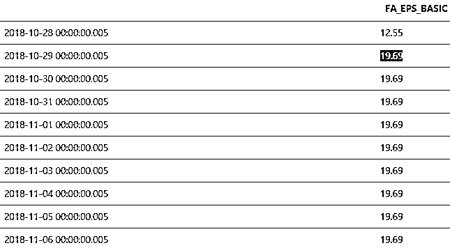
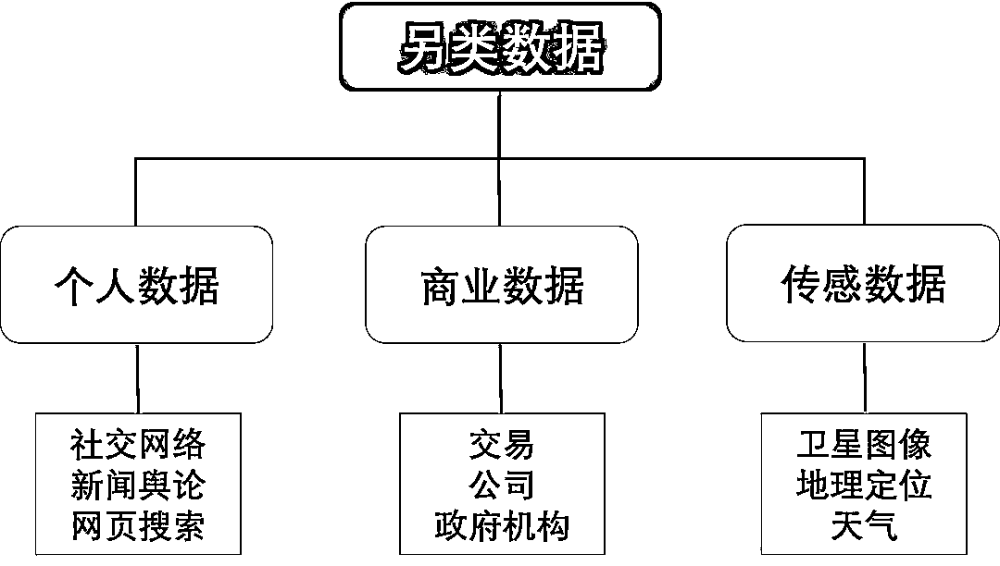

# 重磅来袭 | AFML 系列开启，我们相信会成为经典~

> 原文：[`mp.weixin.qq.com/s?__biz=MzAxNTc0Mjg0Mg==&mid=2653292098&idx=1&sn=b48bfb2858fc3edb00679c95dacd146f&chksm=802dc457b75a4d41d5a2765a8824830d5a74210b0bafa0ac0fb2529980c912abfbb5a5068ba4&scene=27#wechat_redirect`](http://mp.weixin.qq.com/s?__biz=MzAxNTc0Mjg0Mg==&mid=2653292098&idx=1&sn=b48bfb2858fc3edb00679c95dacd146f&chksm=802dc457b75a4d41d5a2765a8824830d5a74210b0bafa0ac0fb2529980c912abfbb5a5068ba4&scene=27#wechat_redirect)

**标星★公众号     **爱你们♥

作者：公众号与王的机器、还有合作者

**近期原创文章：**

## ♥ [基于无监督学习的期权定价异常检测（代码+数据）](https://mp.weixin.qq.com/s?__biz=MzAxNTc0Mjg0Mg==&mid=2653290562&idx=1&sn=dee61b832e1aa2c062a96bb27621c29d&chksm=802dc257b75a4b41b5623ade23a7de86333bfd3b4299fb69922558b0cbafe4c930b5ef503d89&token=1298662931&lang=zh_CN&scene=21#wechat_redirect)

## ♥ [5 种机器学习算法在预测股价的应用（代码+数据）](https://mp.weixin.qq.com/s?__biz=MzAxNTc0Mjg0Mg==&mid=2653290588&idx=1&sn=1d0409ad212ea8627e5d5cedf61953ac&chksm=802dc249b75a4b5fa245433320a4cc9da1a2cceb22df6fb1a28e5b94ff038319ae4e7ec6941f&token=1298662931&lang=zh_CN&scene=21#wechat_redirect)

## ♥ [深入研读：利用 Twitter 情绪去预测股市](https://mp.weixin.qq.com/s?__biz=MzAxNTc0Mjg0Mg==&mid=2653290402&idx=1&sn=efda9ea106991f4f7ccabcae9d809e00&chksm=802e3db7b759b4a173dc8f2ab5c298ab3146bfd7dd5aca75929c74ecc999a53b195c16f19c71&token=1330520237&lang=zh_CN&scene=21#wechat_redirect)

## ♥ [Two Sigma 用新闻来预测股价走势，带你吊打 Kaggle](https://mp.weixin.qq.com/s?__biz=MzAxNTc0Mjg0Mg==&mid=2653290456&idx=1&sn=b8d2d8febc599742e43ea48e3c249323&chksm=802e3dcdb759b4db9279c689202101b6b154fb118a1c1be12b52e522e1a1d7944858dbd6637e&token=1330520237&lang=zh_CN&scene=21#wechat_redirect)

## ♥ [利用深度学习最新前沿预测股价走势](https://mp.weixin.qq.com/s?__biz=MzAxNTc0Mjg0Mg==&mid=2653290080&idx=1&sn=06c50cefe78a7b24c64c4fdb9739c7f3&chksm=802e3c75b759b563c01495d16a638a56ac7305fc324ee4917fd76c648f670b7f7276826bdaa8&token=770078636&lang=zh_CN&scene=21#wechat_redirect)

## ♥ [一位数据科学 PhD 眼中的算法交易](https://mp.weixin.qq.com/s?__biz=MzAxNTc0Mjg0Mg==&mid=2653290118&idx=1&sn=a261307470cf2f3e458ab4e7dc309179&chksm=802e3c93b759b585e079d3a797f512dfd0427ac02942339f4f1454bd368ba47be21cb52cf969&token=770078636&lang=zh_CN&scene=21#wechat_redirect)

## ♥ [基于 RNN 和 LSTM 的股市预测方法](https://mp.weixin.qq.com/s?__biz=MzAxNTc0Mjg0Mg==&mid=2653290481&idx=1&sn=f7360ea8554cc4f86fcc71315176b093&chksm=802e3de4b759b4f2235a0aeabb6e76b3e101ff09b9a2aa6fa67e6e824fc4274f68f4ae51af95&token=1865137106&lang=zh_CN&scene=21#wechat_redirect)

## ♥ [人工智能『AI』应用算法交易，7 个必踩的坑！](https://mp.weixin.qq.com/s?__biz=MzAxNTc0Mjg0Mg==&mid=2653289974&idx=1&sn=88f87cb64999d9406d7c618350aac35d&chksm=802e3fe3b759b6f5eca6e777364270cbaa0bf35e9a1535255be9751c3a77642676993a861132&token=770078636&lang=zh_CN&scene=21#wechat_redirect)

## ♥ [神经网络在算法交易上的应用系列（一）](https://mp.weixin.qq.com/s?__biz=MzAxNTc0Mjg0Mg==&mid=2653289962&idx=1&sn=5f5aa65ec00ce176501c85c7c106187d&chksm=802e3fffb759b6e9f2d4518f9d3755a68329c8753745333ef9d70ffd04bd088fd7b076318358&token=770078636&lang=zh_CN&scene=21#wechat_redirect)

## ♥ [预测股市 | 如何避免 p-Hacking，为什么你要看涨？](https://mp.weixin.qq.com/s?__biz=MzAxNTc0Mjg0Mg==&mid=2653289820&idx=1&sn=d3fee74ba1daab837433e4ef6b0ab4d9&chksm=802e3f49b759b65f422d20515942d5813aead73231da7d78e9f235bdb42386cf656079e69b8b&token=770078636&lang=zh_CN&scene=21#wechat_redirect)

## ♥ [如何鉴别那些用深度学习预测股价的花哨模型？](https://mp.weixin.qq.com/s?__biz=MzAxNTc0Mjg0Mg==&mid=2653290132&idx=1&sn=cbf1e2a4526e6e9305a6110c17063f46&chksm=802e3c81b759b597d3dd94b8008e150c90087567904a29c0c4b58d7be220a9ece2008956d5db&token=1266110554&lang=zh_CN&scene=21#wechat_redirect)

## ♥ [优化强化学习 Q-learning 算法进行股市](https://mp.weixin.qq.com/s?__biz=MzAxNTc0Mjg0Mg==&mid=2653290286&idx=1&sn=882d39a18018733b93c8c8eac385b515&chksm=802e3d3bb759b42d1fc849f96bf02ae87edf2eab01b0beecd9340112c7fb06b95cb2246d2429&token=1330520237&lang=zh_CN&scene=21#wechat_redirect)

**声明**

**AFML 系列 **终于开始硬核将机器学习和量化投资结合在一起了，而且 Python 系列也派上用场了。
本系列内容，**『量化投资与机器学习』**公众号编辑部将与**『王的机器』**公众号密切合作，同时联合业界大佬共同一起，将这个系列出色完成！本系列内容所用全部数据来自**万矿**和**Quantopian**，一些高频交易的数据在用到时会注明。开篇由**『王的机器』**主理人圣元兄完成，部分内容由公众号完成。

**介绍**

数据越原始其含有的价值越高。被处理过的数据虽然用起来很方便，但当你使用时别人很可能已经使用过了。这句话也适用于金融数据 (financial data)。金融数据主要可分为四类，见下表总结。


接下来我们详细讨论它们的特征以及应用。

**基本面数据**

基本面数据 (Fundamental Data) 通常是会计数据  (accounting data)，包括资产 (assets)、负债 (liabilities)、销量 (sales) 和盈利 (earnings) 等等，来源于按季度发布的财务报告。

下图展示了苹果第二季度的财务报表中的部分基本面数据(销量、销售成本、运营费用等等)。


在使用基本面数据时需注意数据发布日期 (release date) 和季度报告截止日期 (quarter-end reporting period) 不一样！前者一般晚于后者 6 周，有时个股的发布日期各不相同。

以茅台 (600519.SH) 举例来看一段万矿 (WindQuant) 的代码：

```py
_, date = w.wsd( "600519.SH", "stm_issuingdate", 
                         "2018-01-01", "2019-03-31", 
                        "Period=Q;Days=Alldays;Fill=Previous", 
                        usedf=True )WTable(data = date).plot() 
```

这里 stm_issuingdate 代表「定期报告披露日期」。关于代码里的 wsd 的相关知识，请参考[Pandas 上](http://mp.weixin.qq.com/s?__biz=MzIzMjY0MjE1MA==&mid=2247486680&idx=1&sn=ee79e798cb2c00ff4dd02609ca9c494d&chksm=e8908fd1dfe706c71f998ceec4e8c6a44a76778b8382313a5f773319765e8b1116bf3dbbeeec&scene=21#wechat_redirect)。


对茅台 2018 年第一季度 (Q2) 来说，发布日期 (2018-08-02) 才是最重要的日期，因为只有发布之后大家才知道基本面数据值 (比如每股收益 EPS)，用报告截止日期 (2018-06-30) 就会引进前视偏差 (look-ahead bias)，因此在 2018-06-30 那天数据没有发布给大众，大众根本不知道 Q2 的 EPS 是多少。

万矿是取每个季度最后一天作为报告期，2018 年的报告期设置分别为

*   一季报：2018-03-31

*   半年报：2018-06-30

*   三季报：2018-09-30

*   年报：2018-12-31

下图展示了茅台 2018 年到 2019 年 Q1 的数据发布日期和报告截止日期。


用万矿来查看茅台 2018-06-30 的 EPS 值。

```py
_, df = w.wsd( "600519.SH",
                     "eps_basic_is",
                     "2018-01-01", "2019-03-31",
                     "Days=Alldays;rptType=1", 
                     usedf=True )
WTable(data = df).plot()
```

这里 eps_basic_is 代表「基本每股收益」。


我们可以看到 2018-06-30 对应 eps_basic_is 的值为 12.55。由上面日期对比图可知，这个 12.55 的 EPS 应该在 2019-08-02 才发布。因此推断出 2018-06-30 这天的 12.55 是从 2019-08-02 那天回填 (backfill) 得到的。

**知识点**

公司披露年报或季报经常会在第一次披露之后发布多个修订版本，对原本缺失的一些数据进行回填。

继续深挖验证我们的推断。用万矿来查看 2018-08-02 (Q2 数据的发布日) 的 EPS 值。这时 wsd 函数中用参数 fa_eps_basic 而不是用 eps_basic_is，fa_eps_basic 代表「基本每股收益 _PIT」。用万矿里的 API 选出 fa_eps_basic 即可，操作非常简单如下屏所示。


上图操作完成之后，查看茅台 2018-06-30 的 EPS_PIT 值 (用的 fa_eps_basic) 的代码自动生成出来。

```py
_, df = w.wsd( "600519.SH",
                     "fa_eps_basic", 
                    "2018-01-01", "2019-03-31", 
                    "Days=Alldays;rptType=1", 
                    usedf=True )
WTable(data = df).plot() 
```

PIT 全称是 point-in-time，没有找到很好的中文翻译，就理解成「数据发布的时点」吧。 

从下图发现 2018-08-02 的 EPS 值为 12.55，可以确定 2018-06-30 的 EPS 值是回填得来的。




此外，我们还发现 12.55 对应的**起始日 2018-08-02** 和**终止日 2018-10-28**，它们不正是 **Q2 的发布日期**和 **Q3 的发布日期前一天**吗？下图就是 2018 Q2 到 Q3 的 PIT 数据。


由于 12.55 是 Q2 截止日 2018-06-30 时 EPS 的值，但是在 Q2 发布日 2018-08-02 才公布于众，直到 2018-10-28。后一天 2018-10-29 是 Q3 截止日 2018-09-30 时 EPS 的发布日，那么 EPS 也会被更新。

下图给出了一年的 PIT 数据。


使用 PIT 数据可以避免「前视偏差」，自己收集 PIT 的数据太过繁琐，而购买提供 PIT 的数据商又太过昂贵。万矿做得真心不错，免费提供 PIT 数据。

* * *

国内有万矿，国外有 Quantopian，下面截屏**蓝色高亮**那部分说的就是 Quantopian 也考虑了 PIT 而消除了「前视偏差」。


在 Quantopian 用代码看看 Facebook 的基本面数据发布日期 (file_date) 和报告截止日期 (period_ending_date)。关于代码里的 Pipeline 相关知识，请参考[张量 101](http://mp.weixin.qq.com/s?__biz=MzIzMjY0MjE1MA==&mid=2247486127&idx=1&sn=8cabe246d1699f8b64a45c8937d6f694&chksm=e89089a6dfe700b0887a7abd512ba284697aa84e423e7dacb5e6fe68572cc8baf14ed41d535b&scene=21#wechat_redirect)。


DataFrame 的前五行是 2018 年 1 月 2 日到 8 日的数据要看 2017-09-30 (Q3) 的数据，而其发布日是 2017-11-02。

DataFrame 的后五行意思是 2018 年 12 月 24 日到 31 日的数据要看 2018-09-30 (Q3) 的数据，而其发布日是 2018-10-31。

总结：基本面数据频率低，监管严，易获得，价值可被挖掘的差不多，通常是把基本面数据和其它类数据一起使用。

**市场数据**

**市场数据 (Market Data)** 包含交易所有类型产品时收集到的数据，包括现货价格 (spot price)、期货价格 (futures price)、利率 (interest rate)、汇率 (exchange rate)、波动率 (volatility)、成交量 (volume) 等等。 

在交易中，市场数据以限价定单簿 (limitorder book, LOB) 的形式呈现。每个市场参与者都可从中看到订单信息 (order information)。

以阿里巴巴股票 (BABA) 为例的 LOB 如下图所示。


在 LOB 中，卖家看 Bid，买家看 Ask。LOB 里面有四个重要参数，合称为最佳买卖报价 (Best Bid and Offer, BBO)，分别是

*   买价 (bid price)：卖家可以卖到的最高价 (160 美元)

*   买量 (bid quantity)：卖家可以卖的数量 (500 股)

*   卖价 (ask price)：买家可以买到的最低价 (161 美元)

*   卖量 (ask quantity)：买家可以买的数量 (600 股)

在每个时点 LOB 可以显示三种不同层次的信息。

**L1 信息**

如果只看 BABA 的最佳买卖价 (Best Bid and Offer, BBO)，那么它是一维数据 (price)，通常称为 Level 1 (L1) 信息。


卖家可以从市场中以 160 美元卖出 500 股，买家可以从市场中以 161 美元买进 600 股。

**L2 信息**

如果还看 BABA 的非最佳买卖价 (Not Best Bid and Offer, NBBO)，那么它是二维数据 (price+depth)，通常称为 Level 2 (L2) 信息。


卖家可以从市场中以 160 美元卖出 500 股，吃完最佳买价 (hitting the bid) 之后，卖家可以**继续**从市场中以 159 美元卖出 550 股…

买家可以从市场中以 161 美元买进 600 股，吃完最佳卖价(lifting the offer) 之后，买家可以**继续**从市场中以 162 美元买进 800 股…

**L3 信息**

如果在一个价位上，还想区分不同人下单的量 (比如 600 股有 200 是我下的，400 是小明下的，我比小明先下单)，那么它是三维数据(price+depth+size)，通常称为 Level 3 (L3) 信息。


通常数据商提供的是像金融信息交换协议 (Financial Information eXchange, FIX) 类似的原始数据，可以搭建出每个时点的交易账簿 (order book)，更精确点的描述是限价定单簿 (limit order book, LOB)。

CME Globex 是世界上第一个期货电子交易系统，下图是 Globex 里 FIX  的数据结构说明。


从上面表格可看出：

*   第 1 行显示价格的层位(为构建 L2 信息)

*   第 2 行显示信息发送时间

*   第 3-4 行显示买价和买量

*   第 5-6 行显示卖价和卖量

*   第 7 行显示数据更新状态，0 代表插入新信息，1 代表更新现有信息；2 代表删除老信息

*   第 8 行显示某层价位的订单数 (为构建 L3 信息)

等等。。。

用第 1 到 9 行的信息可以从 FIX 表格重建 L3 的 LOB。

*   side S - 分买入 (bid) 和卖出 (ask)

*   class – 包含价格 (price) 和成交量 (size)

*   price level M - LOB 的深度

伪代码如下：


而第 7 行和 10 到 15 行用来做交易匹配 (trade matching) 的。

总结：基本面数据相比，市场数据更规范，而且频率更高，数据量更大，处理起来也更困难，但是价值更大。

**分析数据**

类比金融产品的原生资产和衍生品的关系，**分析数据 (Analytics Data)** 是原始数据的衍生品，即由原始数据加工得来的。原始数据可以是基本面数据和市场数据，甚至还可以是下节讨论的另类数据。 

我们可用

*   销量、成本、运营费用等「基本面数据」来评估一个公司的盈利能力和运营质量，并推荐买卖其股票

*   限价定单簿和交易信息等「市场数据」来预测冰山单 (icerberg order) 的大小和概率

*   新闻舆情、财报公告、卫星图像等「另类数据」来做情感分析 (sentiment analysis) 和经营预测

下图总结各类原始数据和对应的分析数据。


使用「分析数据」有利有弊

*   优点是特征和信号已经从原始数据中提取出来，使用起来方便

*   缺点是价格昂贵，而且处理方法不透明 (opaque) 也可能存有偏差 (bias)

**另类数据**

**另类数据 (Alternative Data)** 包括传统数据之外的新的数据，主要成分如下图。 



**个人数据**

个人数据 (Individual Data) 是由个人网上行为产生的，它还可细分为

*   社交网络数据 (social media data): Twitter, LinkedIn, 微信

*   新闻舆论数据 (news & reviews data): 新闻、产品舆论

*   网页搜索数据 (web search data): 谷歌搜索、百度搜索、邮件

案例：

*   **iSentium** 提供交易股票时用到的 Twitter 上的情绪数据指标

*   **RavenPack** 提供交易债券、外汇和股票时用到的新闻情绪数据指标

**商业数据**

商业数据 (Business Process Data) 是由商业流程产生的，它还可细分为

*   交易数据 (transcation data): 主要是消费者交易数据 (Square,Intuit, Xero 等)

*   公司数据 (corporate data): 主要是行业数据 (AROQ, Edmunds, SNL Financial, Smith Travel 等)

*   政府机构数据 (government agency data): 国际级别(IMF, WTO, World Bank)，国家级别(美联储, 人民央行)

案例

*   **Eagle Alpha** 提供交易个股时用到的用户电子邮件收据。

**传感数据**

传感数据 (Sensor Data) 是由手机、无人机、卫星上的传感器产生的，它还可细分为

*   卫星图像数据 (satellites images data): 卫星、无人机

*   地理定位数据 (geolocation data): GPS、手机 APP

*   天气数据 (weather data)

案例：

*   **Advan Research** 提供交易个股时用手机记录的地理位置数据 (根据人流量预测零售)

*   **RSMetrics** 提供交易个股时用无人机拍的停车场和仓库图像数据 (根据车位占满率预测员工)

使用「另类数据」有利有弊

*   优点是没被处理过，也没有为其他使用者提供，因此有很高的价值等待发掘，深度学习里的「计算机视觉」和「自然语言处理」的技术可以用来处理图像和文本数据

*   缺点是「获取昂贵」和「隐私忧患」

**总结**

金融市场数据可分四类，基本面数据、交易数据、分析数据和另类数据。 

前三类属于结构性数据 (structured data)，即可以用二维数据表 (excel, DataFrame 等) 储存的；而最后的另类数据属于非结构性数据(unstructured data)，在使用前通常要转换成结构性数据。

*   处理「基本面数据」最容易 (人人可做)，但剩余可发掘的价值也不太搞了。

*   处理「另类数据」最困难 (鲜有人做)，一旦你做了对你的价值是唯一的。

有价值的东西做起来从来不容易，如果太容易，大概率没什么价值。有人开玩笑说，如果一套数据集让数据科学家处理起来时很头疼，这套数据集很可能价值很高。 

下期内容讲如何对数据采样 。Stay Tuned！

*—End—*

量化投资与机器学习微信公众号，是业内垂直于**Quant**、**MFE**、**CST**等专业的主流自媒体。公众号拥有来自**公募、私募、券商、银行、海外**等众多圈内**10W+**关注者。每日发布行业前沿研究成果和最新资讯。

