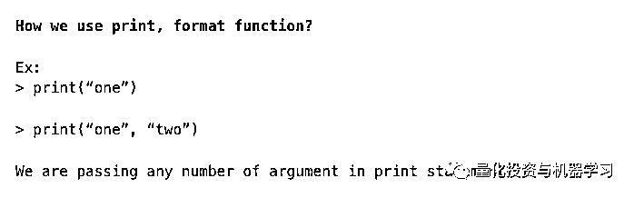
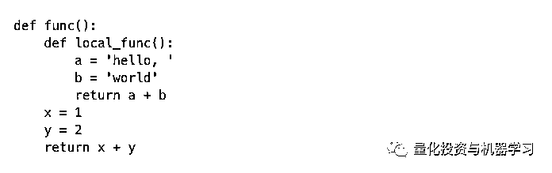
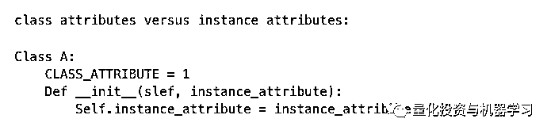
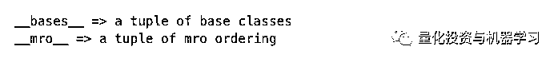

# 作为 Python 中级程序员，有句话不知当讲不当讲 (￣へ￣)

> 原文：[`mp.weixin.qq.com/s?__biz=MzAxNTc0Mjg0Mg==&mid=2653292086&idx=1&sn=b90c35151b9292c7c46a3ed879030147&chksm=802dc423b75a4d356a29ec722fbf76a5d304bedaa4871f111dfb2a7c57389716a251a956223e&scene=27#wechat_redirect`](http://mp.weixin.qq.com/s?__biz=MzAxNTc0Mjg0Mg==&mid=2653292086&idx=1&sn=b90c35151b9292c7c46a3ed879030147&chksm=802dc423b75a4d356a29ec722fbf76a5d304bedaa4871f111dfb2a7c57389716a251a956223e&scene=27#wechat_redirect)

**标星★公众号     **爱你们♥

作者：Pulkit Agrawa

编译：公众号编辑部

**近期原创文章：**

## ♥ [基于无监督学习的期权定价异常检测（代码+数据）](https://mp.weixin.qq.com/s?__biz=MzAxNTc0Mjg0Mg==&mid=2653290562&idx=1&sn=dee61b832e1aa2c062a96bb27621c29d&chksm=802dc257b75a4b41b5623ade23a7de86333bfd3b4299fb69922558b0cbafe4c930b5ef503d89&token=1298662931&lang=zh_CN&scene=21#wechat_redirect)

## ♥ [5 种机器学习算法在预测股价的应用（代码+数据）](https://mp.weixin.qq.com/s?__biz=MzAxNTc0Mjg0Mg==&mid=2653290588&idx=1&sn=1d0409ad212ea8627e5d5cedf61953ac&chksm=802dc249b75a4b5fa245433320a4cc9da1a2cceb22df6fb1a28e5b94ff038319ae4e7ec6941f&token=1298662931&lang=zh_CN&scene=21#wechat_redirect)

## ♥ [深入研读：利用 Twitter 情绪去预测股市](https://mp.weixin.qq.com/s?__biz=MzAxNTc0Mjg0Mg==&mid=2653290402&idx=1&sn=efda9ea106991f4f7ccabcae9d809e00&chksm=802e3db7b759b4a173dc8f2ab5c298ab3146bfd7dd5aca75929c74ecc999a53b195c16f19c71&token=1330520237&lang=zh_CN&scene=21#wechat_redirect)

## ♥ [Two Sigma 用新闻来预测股价走势，带你吊打 Kaggle](https://mp.weixin.qq.com/s?__biz=MzAxNTc0Mjg0Mg==&mid=2653290456&idx=1&sn=b8d2d8febc599742e43ea48e3c249323&chksm=802e3dcdb759b4db9279c689202101b6b154fb118a1c1be12b52e522e1a1d7944858dbd6637e&token=1330520237&lang=zh_CN&scene=21#wechat_redirect)

## ♥ [利用深度学习最新前沿预测股价走势](https://mp.weixin.qq.com/s?__biz=MzAxNTc0Mjg0Mg==&mid=2653290080&idx=1&sn=06c50cefe78a7b24c64c4fdb9739c7f3&chksm=802e3c75b759b563c01495d16a638a56ac7305fc324ee4917fd76c648f670b7f7276826bdaa8&token=770078636&lang=zh_CN&scene=21#wechat_redirect)

## ♥ [一位数据科学 PhD 眼中的算法交易](https://mp.weixin.qq.com/s?__biz=MzAxNTc0Mjg0Mg==&mid=2653290118&idx=1&sn=a261307470cf2f3e458ab4e7dc309179&chksm=802e3c93b759b585e079d3a797f512dfd0427ac02942339f4f1454bd368ba47be21cb52cf969&token=770078636&lang=zh_CN&scene=21#wechat_redirect)

## ♥ [基于 RNN 和 LSTM 的股市预测方法](https://mp.weixin.qq.com/s?__biz=MzAxNTc0Mjg0Mg==&mid=2653290481&idx=1&sn=f7360ea8554cc4f86fcc71315176b093&chksm=802e3de4b759b4f2235a0aeabb6e76b3e101ff09b9a2aa6fa67e6e824fc4274f68f4ae51af95&token=1865137106&lang=zh_CN&scene=21#wechat_redirect)

## ♥ [人工智能『AI』应用算法交易，7 个必踩的坑！](https://mp.weixin.qq.com/s?__biz=MzAxNTc0Mjg0Mg==&mid=2653289974&idx=1&sn=88f87cb64999d9406d7c618350aac35d&chksm=802e3fe3b759b6f5eca6e777364270cbaa0bf35e9a1535255be9751c3a77642676993a861132&token=770078636&lang=zh_CN&scene=21#wechat_redirect)

## ♥ [神经网络在算法交易上的应用系列（一）](https://mp.weixin.qq.com/s?__biz=MzAxNTc0Mjg0Mg==&mid=2653289962&idx=1&sn=5f5aa65ec00ce176501c85c7c106187d&chksm=802e3fffb759b6e9f2d4518f9d3755a68329c8753745333ef9d70ffd04bd088fd7b076318358&token=770078636&lang=zh_CN&scene=21#wechat_redirect)

## ♥ [预测股市 | 如何避免 p-Hacking，为什么你要看涨？](https://mp.weixin.qq.com/s?__biz=MzAxNTc0Mjg0Mg==&mid=2653289820&idx=1&sn=d3fee74ba1daab837433e4ef6b0ab4d9&chksm=802e3f49b759b65f422d20515942d5813aead73231da7d78e9f235bdb42386cf656079e69b8b&token=770078636&lang=zh_CN&scene=21#wechat_redirect)

## ♥ [如何鉴别那些用深度学习预测股价的花哨模型？](https://mp.weixin.qq.com/s?__biz=MzAxNTc0Mjg0Mg==&mid=2653290132&idx=1&sn=cbf1e2a4526e6e9305a6110c17063f46&chksm=802e3c81b759b597d3dd94b8008e150c90087567904a29c0c4b58d7be220a9ece2008956d5db&token=1266110554&lang=zh_CN&scene=21#wechat_redirect)

## ♥ [优化强化学习 Q-learning 算法进行股市](https://mp.weixin.qq.com/s?__biz=MzAxNTc0Mjg0Mg==&mid=2653290286&idx=1&sn=882d39a18018733b93c8c8eac385b515&chksm=802e3d3bb759b42d1fc849f96bf02ae87edf2eab01b0beecd9340112c7fb06b95cb2246d2429&token=1330520237&lang=zh_CN&scene=21#wechat_redirect)

**祝妈妈们节日快乐！**

***这句话里有 10 个问题***

**Python 中都是对象吗?**

字符串是对象。列表对象。函数对象。甚至模块也是对象。任何东西都是一个对象，因为它可以赋值给一个变量或作为参数传递给一个函数。 

任何可以（合法地）放在等号右边的东西都是（或创建）Python 中的对象。

**对象：**

1、ID

2、值（可变的或不可变的）

**可变的：**当更改项目时，ID 仍然是相同的。比如：字典、列表。

**不可变的：**字符串、整数、元组。

**推导式**

Comprehension——用于创建集合和可迭代对象的简写语法。

**▍列表推导式**

**▍集合推导式**

****▍字典推导式****

******▍Generator 推导式******

************▍ If-clause 推导式************

******************▍多重推导式******************

************************************▍嵌套推导式************************************

**扩展关键字参数**

在 Python 中调用函数时，通常必须在使用关键字参数和位置参数之间进行选择。 关键字参数通常可用于使函数调用更加明确。当我们使用关键字参数时：我们通常可以省略具有默认值的参数。

**扩展形式参数语法：**

**扩展参数的数据类型：**

**扩展实参语法：**

**闭包和装饰器**

在开始闭包之前，我们先了解一下 local 函数：

*   适用于特殊的、一次性的功能

*   使得代码具有组织性和可读性

*   类似于 lambdas，但更为一般

*   可能包含多个表达式

*   可能包含 statements

********************▍**********************LEGB 含义解释**

*   L-Local(function)：函数内的名字空间

*   E-Enclosing function locals：外部嵌套函数的名字空间(例如 closure)

*   G-Global(module)：函数定义所在模块（文件）的名字空间

*   B-Builtin(Python)：Python 内置模块的名字空间

Python 的命名空间是一个字典，字典内保存了变量名称与对象之间的映射关系，因此，查找变量名就是在命名空间字典中查找键-值对。

Python 有多个命名空间，因此，需要有规则来规定，按照怎样的顺序来查找命名空间，LEGB 就是用来规定命名空间查找顺序的规则。

> LEGB 规定了查找一个名称的顺序为**：local-->enclosing function locals-->global-->builtin**（局部变量———闭包空间———全局变量———内建模块内置）

**▍Returning Function** 

**▍闭包**

维持对早期范围对象的引用。

我们可以使用 _closure__ 来验证函数是否为闭包。

**一个函数和它的环境变量合在一起，就构成了一个闭包（closure）**。在 Python 中，所谓的闭包是一个包含有环境变量取值的函数对象。环境变量取值被保存在函数对象的 __closure__ 属性中。比如下面的代码：

__closure__ 里包含了一个元组。这个元组中的每个元素是 cell 类型的对象。我们看到第一个 cell 包含的就是整数 15，也就是我们创建闭包时的环境变量 b 的取值。

下面看一个闭包的实际例子：

这个例子中，函数 line 与环境变量 a,b 构成闭包。在创建闭包的时候，我们通过 line_conf 的参数 a,b 说明了这两个环境变量的取值，这样，我们就确定了函数的最终形式(y = x + 1 和 y = 4x + 5)。我们只需要变换参数 a,b，就可以获得不同的直线表达函数。由此，我们可以看到，闭包也具有提高代码可复用性的作用。

如果没有闭包，我们需要每次创建直线函数的时候同时说明 a,b,x。这样，我们就需要更多的参数传递，也减少了代码的可移植性。利用闭包，我们实际上创建了泛函。line 函数定义一种广泛意义的函数。这个函数的一些方面已经确定(必须是直线)，但另一些方面(比如 a 和 b 参数待定)。随后，我们根据 line_conf 传递来的参数，通过闭包的形式，将最终函数确定下来。

**一个函数闭包**是一个函数和一个引用集合的组合，这个引用集合指向这个函数被定义的作用域的变量。后者通常指向一个引用环境（referencing environment），这使得函数能够在它被定义的区域之外执行。在 Python 中，这个引用环境被存储在一个 cell 的 tuple 中。你能够通过 func_closure 或 Python 3 中的 __closure__ 属性访问它。要铭记的一点是引用及是引用，而不是对象的深度拷贝。当然了，对于不可变对象而言，这并不是问题，然而对可变对象(list)这点就必须注意。请注意函数在定义的地方也有 __globals__ 字段来存储全局引用环境。

**▍装饰器**

装饰器是这样一种设计模式：如果一个类希望添加其他类的一些功能，而不希望通过继承或是直接修改源代码实现，那么可以使用装饰器模式。简单来说 Python 中的装饰器就是指某些函数或其他可调用对象，以函数或类作为可选输入参数，然后返回函数或类的形式。

简单地说，decorator 就像一个 wrapper 一样，在函数执行之前或者之后修改该函数的行为，而无需修改函数本身的代码，这也是修饰器名称的来由。

**生成器和迭代协议**

****▍**Iterable**：可以将对象传递给内置的 iter()函数来获得迭代器。

****▍**Iterator**：可以将对象传递给内置的 next()函数来获取下一项。

  **▍生成器**

Python 生成器是创建迭代器的一种简单方法。上面提到的都由 Python 中的生成器自动处理的。

生成器是一个函数，它返回一个对象（迭代器），我们可以遍历该对象（每次一个值）。

如果一个函数包含至少一个**yield**语句，则它将成为生成器函数。

不同之处在于，虽然 return 语句完全终止了一个函数，但是 yield 语句暂停保存函数的所有状态，然后在后续调用时继续执行。

为什么在 Python 中使用生成器？

*   Easy to Implement

*   Memory Efficient

*   Represent Infinite Stream

*   Pipelining Generators

**上下文管理器**

****▍**ContextManager**：上下文管理器就是实现了上下文管理协议的对象。主要用于保存和恢复各种全局状态，关闭文件等，上下文管理器本身就是一种装饰器。

****▍**__enter__ ()**

*   在进入 with-statement 主体之前调用

*   返回绑定到变量的值

*   可以返回任何类型的值

*   通常返回上下文管理器本身

****▍**__exit__()**

当语句体退出时调用

__exit__(self, exc_type, exc_val, exc_tb)

**@staticmethod、 @classmethod**

如果需要访问函数中的类属性，请使用@classmethod。

如果不需要使用 cls 对象，则使用@static method。

与其他语言不同，Python 中的静态方法可以在子类中重写。

**继承和封装**

****▍**继承**

继承是一个类获取另一个类的属性的机制。例如，一个孩子继承了他/她父母的特点。通过继承，我们可以重用现有类的字段和方法。因此，继承促进了可重用性，并且是 OOPs 的一个重要概念。

**▍单继承**

子类将具有基类的所有功能，还可以修改和增强。

子类初始化器希望调用基类初始化器，以使整个对象被初始化。

调用其他类初始化器：

1、其他语言自动调用 base class 初始化器

2、Python 像对待其他方法一样处理 _init__()

3、base class _init__()在被覆盖时不会被调用

4、使用 super()调用 base class _init__()

isinstance(instance, class)：确定对象是否具有指定的类型。

**Issubclass**(subclass，base class)：确定一个类型是否是其他类型的子类。

**▍多继承**

即子类有多个父类，并且具有它们的特征：

Python 如何知道应该调用哪个 base class 函数？

Python 使用方法解析 Order 和 super 来做到这一点。

**方法解析顺序**

确定方法名称查找的顺序

1、通常称为“MRO”

2、方法可以在多个地方定义

3、MRO 是继承图的排序

****▍封装****

**Python 包和程序设计**

**Sys.path** Python 搜索模块的目录列表。

**PYTHONPATH** 添加到 sys.path 的环境变量列表路径。

1、包是包含其他模块的模块。

2、包通常实现为包含特殊 _init__.py 文件的目录。

3、导入包时执行 __init__.py 文件。

4\. 包可以包含自己实现的子包。这些子包本身是用目录中的 __init__.py 文件实现的。

5、包的模块对象具有 __path__ 属性。

**绝对导入**：使用模块完整路径的导入。比如 import a，Python 会在 sys.path 里寻找所有名为 a 的顶层模块。

**相对导入**：使用相同包中模块的相对路径的导入。比如一个 package 下有 a.py 和 b.py 两个文件，在 a.py 里 from . import b 即是相对导入 b.py。

**__all__**：是一个字符串 list，用来定义模块中对于 from XXX import *时要对外导出的符号，即要暴露的借口，但它只对 import *起作用，对 from XXX import XXX 不起作用。

*来自：https://medium.com/@agrawal.pulkit1994*

*—End—*

量化投资与机器学习微信公众号，是业内垂直于**Quant**、**MFE**、**CST**等专业的主流自媒体。公众号拥有来自**公募、私募、券商、银行、海外**等众多圈内**10W+**关注者。每日发布行业前沿研究成果和最新资讯。

