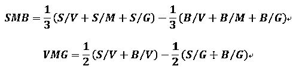
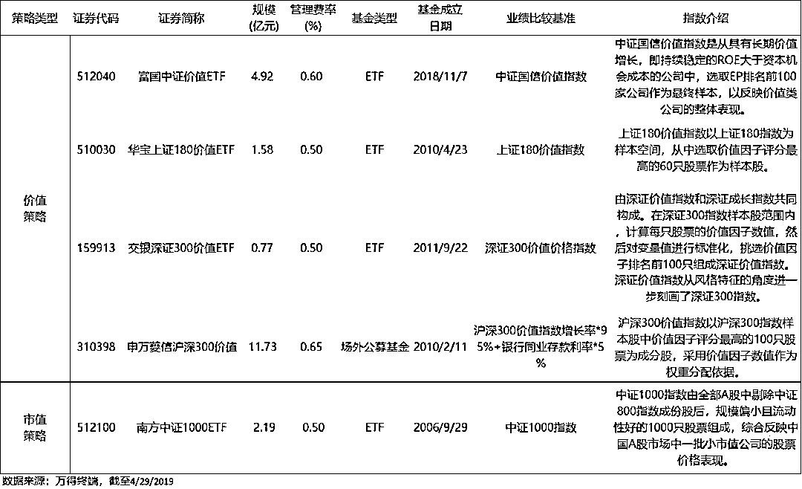

# 中国版四因子模型，加入情绪指标，6 不 6？

> 原文：[`mp.weixin.qq.com/s?__biz=MzAxNTc0Mjg0Mg==&mid=2653292042&idx=1&sn=0e08a6db598698d914540b06adebb6c2&chksm=802dc41fb75a4d09184f51613f0d2a4551954272282b2add050b42c776214373a349231a8667&scene=27#wechat_redirect`](http://mp.weixin.qq.com/s?__biz=MzAxNTc0Mjg0Mg==&mid=2653292042&idx=1&sn=0e08a6db598698d914540b06adebb6c2&chksm=802dc41fb75a4d09184f51613f0d2a4551954272282b2add050b42c776214373a349231a8667&scene=27#wechat_redirect)

**标星★公众号     **爱你们♥

作者：李冠希

来自：新全球资产配置

**近期原创文章：**

## ♥ [基于无监督学习的期权定价异常检测（代码+数据）](https://mp.weixin.qq.com/s?__biz=MzAxNTc0Mjg0Mg==&mid=2653290562&idx=1&sn=dee61b832e1aa2c062a96bb27621c29d&chksm=802dc257b75a4b41b5623ade23a7de86333bfd3b4299fb69922558b0cbafe4c930b5ef503d89&token=1298662931&lang=zh_CN&scene=21#wechat_redirect)

## ♥ [5 种机器学习算法在预测股价的应用（代码+数据）](https://mp.weixin.qq.com/s?__biz=MzAxNTc0Mjg0Mg==&mid=2653290588&idx=1&sn=1d0409ad212ea8627e5d5cedf61953ac&chksm=802dc249b75a4b5fa245433320a4cc9da1a2cceb22df6fb1a28e5b94ff038319ae4e7ec6941f&token=1298662931&lang=zh_CN&scene=21#wechat_redirect)

## ♥ [深入研读：利用 Twitter 情绪去预测股市](https://mp.weixin.qq.com/s?__biz=MzAxNTc0Mjg0Mg==&mid=2653290402&idx=1&sn=efda9ea106991f4f7ccabcae9d809e00&chksm=802e3db7b759b4a173dc8f2ab5c298ab3146bfd7dd5aca75929c74ecc999a53b195c16f19c71&token=1330520237&lang=zh_CN&scene=21#wechat_redirect)

## ♥ [Two Sigma 用新闻来预测股价走势，带你吊打 Kaggle](https://mp.weixin.qq.com/s?__biz=MzAxNTc0Mjg0Mg==&mid=2653290456&idx=1&sn=b8d2d8febc599742e43ea48e3c249323&chksm=802e3dcdb759b4db9279c689202101b6b154fb118a1c1be12b52e522e1a1d7944858dbd6637e&token=1330520237&lang=zh_CN&scene=21#wechat_redirect)

## ♥ [利用深度学习最新前沿预测股价走势](https://mp.weixin.qq.com/s?__biz=MzAxNTc0Mjg0Mg==&mid=2653290080&idx=1&sn=06c50cefe78a7b24c64c4fdb9739c7f3&chksm=802e3c75b759b563c01495d16a638a56ac7305fc324ee4917fd76c648f670b7f7276826bdaa8&token=770078636&lang=zh_CN&scene=21#wechat_redirect)

## ♥ [一位数据科学 PhD 眼中的算法交易](https://mp.weixin.qq.com/s?__biz=MzAxNTc0Mjg0Mg==&mid=2653290118&idx=1&sn=a261307470cf2f3e458ab4e7dc309179&chksm=802e3c93b759b585e079d3a797f512dfd0427ac02942339f4f1454bd368ba47be21cb52cf969&token=770078636&lang=zh_CN&scene=21#wechat_redirect)

## ♥ [基于 RNN 和 LSTM 的股市预测方法](https://mp.weixin.qq.com/s?__biz=MzAxNTc0Mjg0Mg==&mid=2653290481&idx=1&sn=f7360ea8554cc4f86fcc71315176b093&chksm=802e3de4b759b4f2235a0aeabb6e76b3e101ff09b9a2aa6fa67e6e824fc4274f68f4ae51af95&token=1865137106&lang=zh_CN&scene=21#wechat_redirect)

## ♥ [人工智能『AI』应用算法交易，7 个必踩的坑！](https://mp.weixin.qq.com/s?__biz=MzAxNTc0Mjg0Mg==&mid=2653289974&idx=1&sn=88f87cb64999d9406d7c618350aac35d&chksm=802e3fe3b759b6f5eca6e777364270cbaa0bf35e9a1535255be9751c3a77642676993a861132&token=770078636&lang=zh_CN&scene=21#wechat_redirect)

## ♥ [神经网络在算法交易上的应用系列（一）](https://mp.weixin.qq.com/s?__biz=MzAxNTc0Mjg0Mg==&mid=2653289962&idx=1&sn=5f5aa65ec00ce176501c85c7c106187d&chksm=802e3fffb759b6e9f2d4518f9d3755a68329c8753745333ef9d70ffd04bd088fd7b076318358&token=770078636&lang=zh_CN&scene=21#wechat_redirect)

## ♥ [预测股市 | 如何避免 p-Hacking，为什么你要看涨？](https://mp.weixin.qq.com/s?__biz=MzAxNTc0Mjg0Mg==&mid=2653289820&idx=1&sn=d3fee74ba1daab837433e4ef6b0ab4d9&chksm=802e3f49b759b65f422d20515942d5813aead73231da7d78e9f235bdb42386cf656079e69b8b&token=770078636&lang=zh_CN&scene=21#wechat_redirect)

## ♥ [如何鉴别那些用深度学习预测股价的花哨模型？](https://mp.weixin.qq.com/s?__biz=MzAxNTc0Mjg0Mg==&mid=2653290132&idx=1&sn=cbf1e2a4526e6e9305a6110c17063f46&chksm=802e3c81b759b597d3dd94b8008e150c90087567904a29c0c4b58d7be220a9ece2008956d5db&token=1266110554&lang=zh_CN&scene=21#wechat_redirect)

## ♥ [优化强化学习 Q-learning 算法进行股市](https://mp.weixin.qq.com/s?__biz=MzAxNTc0Mjg0Mg==&mid=2653290286&idx=1&sn=882d39a18018733b93c8c8eac385b515&chksm=802e3d3bb759b42d1fc849f96bf02ae87edf2eab01b0beecd9340112c7fb06b95cb2246d2429&token=1330520237&lang=zh_CN&scene=21#wechat_redirect)

**正文**

**股票投资组合的收益率由何种因素决定？**这个经典的问题，驱使着一代又一代的金融大师们，持续地对股票市场进行研究。最早的资本资产定价模型(CAPM 模型)其实在 1961 年就有了雏形。

从 CAPM(Treynor, Sharpe, Linter, and Mossin)，FF-3(Fama and French)，Carhart-4(Fama, French, and Carhart)，FF-5(Fama and French)，到 q⁵ model(Hou, Mo, Xue, and Zhang)，用来检验和被检验的模型层出不穷：从单纯考虑市场风险因素，发展到综合考虑公司的各方面，包括规模、成长性、股票流动性、动量效应和盈利能力等；从简单的单因素模型，发展到了多因子模型。

后继者 Fama and French 就是在 CAPM 的基础上发现：在美国股市中，除了市场 β 值之外，【规模与账面市值比】也能解释股票平均收益率在横截面上的变动；股票平均收益率不但与规模负相关(规模效应) ，而且与账面市值比正相关( 账面市值比效应) 。

为了解释【股票平均收益率的规模效应】与【账面市值比效应】， Fama and French 提出三因子模型 ：

其中：**RMRF =  E(Rm) - rf；SMB = 小市值 - 大市值，市值因子；HML = 高价值 - 低价值，价值因子**。(市场因子 RMRF 是市场收益率 Rm 与无风险利率 rf 之差；规模因子 SMB 是【小规模股票组合】与【大规模股票组合】的平均收益率之差；账面市值比因子 HML 是【高账面市值比(价值型) 股票组合】与【低账面市值比( 成长型) 股票组合】的平均收益率之差。)

Fama-French 的三因子模型深入人心，无论是在学术界还是投资界，都得到广泛的应用，被奉为因子投资的开山鼻祖。特别是美国市场，三因子模型被广泛地应用于收益率预测、风险管理、基金业绩评价等各个方面。

Griffin(2002)用【日本、英国和加拿大】的数据检验了三因子模型，发现模型能够有效地解释【股票组合回报的差异】。在很多发达国家和地区的实践中，Fama 三因子模型的解释力度一度高达 95%。

下图是【美国高价值】和【国际高价值】的小盘股的收益率数据，它们的年化收益率都远高于本土的股票指数。由此可见，市值因子和价值因子在择股中都是有用的。

数据来源：French Data Library. 美国高价值小盘：value-weight，6 Portfolios Formed on Size and Book-to-Market (2 x 3)；国际高价值小盘：value-weight，“6 Global ex US Portfolios Formed on Size and Book-to-Market (2 x 3).

不过相比西方，中国证券市场晚出现了 100 多年，在充满中国特色的神奇 A 股市场中，Size（小市值跑赢大市值）、Value（低估值跑赢高估值）这两个因子是否具有同样的“威力”呢，还有什么特殊因子值得发掘？本文基于三因子模型的逻辑，对此展开探究。

*   中国 A 股市场的特殊之处

*   数据选取

*   如何量化中国市场的价值因子

*   中国版三因子模型 CH-3

*   CH-3 的解释力度如何

*   引入情绪指标的 CH-4 模型

*   自己动手，丰衣足食

我们文章的分析是基于 Liu, Stambaugh and Yuan 2013 的《Size and Value in China》，十分感谢作者的辛勤劳动。石博士也写过一篇《[中国版的 Fama-French 三因子模型，了解一下？](https://mp.weixin.qq.com/s?__biz=MzIyMDEwNDk1Mg==&mid=2650878502&idx=1&sn=e5392a24b5cd00ece3caacc633de6df5&scene=21#wechat_redirect)》，大家可以品鉴一下。

> *We construct size and value factors in China. The size factor excludes the smallest 30% of firms ... The value factor ... which subsumes the book-to-market ratio in capturing all Chinese value effects. Our three-factor model strongly dominates ... the Fama and French (1993) procedure in China. ... our model explains most reported Chinese anomalies, ....*Size and Value in China (Liu, Stambaugh and Yuan 2013)

**中国 A 股市场的特殊之处**

资本资产定价模型的解释能力与资本市场发展水平相关。资本资产定价模型大多【以美国成熟市场的股票数据为样本】来分析的。在新兴资本市场里，投资者交易理念、信息环境等，与成熟股票市场存在较大差异，它们会通过交易过程影响资产定价机制。所以，中国市场里的一些异象并不能很好地被三因子模型解释。

其中首要的一点就是：中国的“壳污染”。

由于特殊的国情，中国 IPO 的过程十分复杂且漫长，总共涉及 7 个行政步骤和 3 个审批部门，还有着很低甚至为 0 的通过率。所以，拟上市企业要想过关斩将极其不易。此现象催生了一种特殊的兼并模式——reverse merges（反向收购）：拟上市的大公司，通过收购一家已上市的“壳公司”，再反向收购大公司原本的资产和业务，最后达到上市的目的。

这个过程被称为“借壳上市”。顺丰借壳鼎泰新材上市就是类似的案例。**所以在 A 股市场中，很多市值很小的公司存在着“壳价值”，会使股价和收益与其公司的经营情况脱钩。**这些因果关系不明了的公司数据会影响回测的准确性。

因此要减少壳污染带来的干扰，在对中国版模型的测试数据中，我们要剔除 A 股市值最小的 30%的股票，因为其股价包含了太多“壳价值”的干扰。这些被剔除的股票，约占全市场总市值的 7%。

**数据选取**

我们所有测试数据全部来自**Wind**，时间截取期间为：2000 年 1 月 1 日至 2016 年 12 月 31 日，包含所有中国大陆 A 股市场的股票数据。隔壁家小朋友或许会问：为什么要选取 2000 年以后的数据呢？咱们大 A 股不是 90 年代初就已经存在了吗？原因有二：

第一，2000 年之前，中国的会计制度还不完善，上市公司的财务数据没有可比性；第二， 测试需要一定样本数据量，而 2000 年之前的上市公司数量太少，不满足测试要求。

**如何量化中国市场的价值因子**

原文作者在中国三因子模型中构建价值因子的过程，遵循了 Fama 和 French(1992, 1993)的两项研究序列确立的路径。

当年 Fama French 构建三因子模型的第一步，是在一组价值因子候选比率中，选出具有最强价值效应的估值比率。他们分别测试了 EP(Earning-to-Price)、BM(Book-to-Market)和 AM(Assets-to-Market)三个 value 指标。经过测试，BM 表现出最强的价值效应。基于这一结果，Fama 和 French(1993)在随后的研究中，选取了 BM 指标来构建价值因子(HML)。

同样地，针对中国市场价值因子研究，作者也先对价值指标做了回归测试，看看哪个更适合中国市场。但在价值指标选取上稍做了一点点改变：除了 EP、BM、AM 这三个指标，还增加了 CP(Cash flow-to- Price)指标，共用了四个指标来测试中国的价值因子。在细节处理上，则与 Fama 和 French(1992)大致相同：对 BM 和 AM 取对数，对 EP 作非负处理(EP+)，对选择出来的 CP 指标也做了非负处理(CP+)。

统计结果如下表所示：

来源：Size and Value in China (Liu, Stambaugn and Yuan 2013)

当我们从第(4)列看到第(7)列：将每一价值指标单独纳入其自身回归的结果，四种价值指标都显示出对回报率的显著解释力(顺利得不可思议)。但是，当我们看到第(8)列时，即将四种价值指标同时纳入回归的结果：EP+的 t 统计量为 4.38，而 logBM、logAM 和 CP+的 t 统计量仅为 1.31、0.99 和 1.35。这说明，除 EP+以外，其余三个指标都对回报率没有足够的解释力。

综上，经过统计测试，EP 是中国市场衡量价值因子效果最好的指标，原文中也因此选取 EP 作为价值因子来测试。

**中国版三因子模型 CH-3**

根据中国特色及以上测试结果，作者对 Fama French 的三因子模型的构建方法在局部上做出了调整。数据选取中，剔除后 30%的数据样本，以减少“壳公司”的影响；用公司市价作为市值因子；用 EP(Earning-to-Price)作为价值因子。之后对数据“动刀”的过程，就和经典的 FF-3 一样了：

（1）按一定的分位点，将样本数据分成六块。具体如下图所示：

（2）通过市值加权，构建新的 SMB(Small - Big)和 VMG(Value - Growth)。公式如下：

（3）将新的 SMB、VMG 带入，就得到了 CH-3 模型，即【中国版的三因子模型】：

这个加了标签的 CH-3 模型，相比的经典的三因子模型，在中国是否更有【用武之地】呢？作者把 CH-3 和 FF-3 模型做了个对比，用 BM(Book-to-Market)量化 value 因子，构建出 FFSMB 和 FFHML 两个因子。然后用两种方法检验 FF-3 模型和 CH-3 模型，看看哪种模型对中国 A 股更有解释力。结果如下图显示：

来源：Size and Value in China (Liu, Stambaugn and Yuan 2013)

用 SMB 和 VMG 解释 FF-3 模型的两因子(FFSMB 和 FFHML)，同时也用 FFSMB 和 FFHML 来解释 CH-3 的因子(SMB 和 VMG)。统计结果发现：CH-3 可以解释 FF-3 中的因子，反之却不可以(上图中-0.04 和 0.34 的 alpha 代表 CH-3 可以解释 FF-3）。然后再用 GRS test 检验两个模型的相互解释力度，结果与前者一样。**可见，在中国 A 股市场中，CH-3 模型比经典的 FF-3 更加符合国情。**那么接下来，我们看看 CH-3 在中国用武之地有多广。

**CH-3 的解释力度如何**

随着经济快速发展，中国资本市场的地位不断提高。不过作为新兴市场国家，中国资本市场的发展也存在固有的缺陷与特点。因此越来越多的学者开始研究中国市场，包括其中存在的异象。若这些异象能够被学者们研究的模型所解释，说明模型对于该市场是具有参考价值的。

金融异象，一般指金融市场中资产的【实际收益】偏离【资本资产定价模型和有效市场假说】的异常现象，这些异象会影响市场的效率。市场主要异象包括以下九大类：Size(市值)、Value(价值)、Profitability(盈利)、Volatility(波动)、Reversal(反转)和 Turnover(换手)、Investment(投资)、Accruals(应收和应付)和 Liquidity(流动性)。

**作者通过 CAPM-alpha 发现了中国市场样本的十个异象，并用 unconditional sort 和 size-neutral sort 两种方式构建异象因子，然后看模型是否能有效地解释这些因子。**这里我们以 value(EP)为栗子，先给大家介绍以上两种构建异象因子的过程。

unconditional sort：将全体股票按照 EP 从小到大排序，等分成十份。最多最高 EP 的一组(高价值)，按市值加权买入；做空最低 EP 的一组(低价值)，按市值加权卖出；得到异象因子 value(EP)。

size-neutral sort：先将股票按 size 大小分成十份；然后在每一份中，再按 EP 从小到大分成十组；将每一份中的最高的 EP 组合起来，按照市值加权做多，将每一份中最低的 EP 组合起来，按市值加权做空，得到异象因子 value(EP)。

接下来就是把 CH-3 和 FF-3 这两个模型，套用在这些异象因子上，看看解释力度孰优孰劣。**结果是：CH-3 可以解释 10 个异象因子中的 8 个，而 FF-3 只能解释其中的 2 个**。其中 CH-3 无法解释的两个异象因子为：reversal(反转)和 turnover(换手)。

来源：Size and Value in China (Liu, Stambaugn and Yuan 2013)

通过以上结果我们可以看出：在 A 股市场，“中国化”的 CH-3 模型比经典的 FF-3 模型的解释力度更高，可以解释 A 股市场更多的异象。不过，CH-3 模型还是无法解释 reversal(反转)和 turnover(换手)，这两个异常回归后的 alpha 仍然大于 1，这意味着 CH-3 模型是有 bug 的，其有效性可能会受到这两个捉摸不定的因素的严重影响。于是针对该问题，作者根据 A 股市场特点，对模型做出了进一步改进。

**引入情绪性指标的 CH-4 模型**

大家都知道中国股市散户多。我们看下数据：欧美香港散户交易市值比例约为 20-30%，而 A 股散户交易市值比例高达 80-90%。深交所发布的《2018 年度投资者状况调查报告》显示，在**中国，非理性投资行为依然普遍，特别是交易频率过高、不重视交易止损。**

数据显示，市场一周内交易若干次的比例达 46.4%，一月内交易 1-2 次的比例达 31.9%。另一方面，A 股市场缺乏做空工具，做空门槛较高且受到限制，缺乏制衡机制，也容易导致不理性的追涨。而这些本质上，还是由于中国市场发展不够成熟、监管存在缺陷、信息不对称，使投资者存在显著的羊群行为。

散户心态图

考虑到以上问题，作者在 CH-3 模型基础上，引入了第四个因子：情绪性指标(turnover-factor)：

作者认为，股票换手率过高，是因为散户们缺乏做空工具，导致不理性追涨，而股价终将回归理性。所以，应该买入目前悲观的、低换手的股票，卖出目前乐观的、高换手的股票。**于是作者构建了换手率因子 PMO（Pessimistic minus Optimistic），把投资者情绪影响考虑了进来。其核心逻辑是：低换手率的因子比高换手率的因子能获得更高的收益。**

构建 PMO 的过程与构建 CH-3 中的 value 因子的方式类似，构建过程如下图所示：

 

根据 Fama French(2015)的思想，加入换手因子(turnover factor)后，size 因子会有一定变化(要注意这些细节，一点点改变可能对模型结果造成极大的影响，如同蝴蝶效应)，所以模型取【换手因子的 SMB】和【价值因子的 SMB】的平均值，作为最后的市值因子 SMB：

 

**加入 PMO，更新 SMB 后，新的中国四因子模型 CH-4 诞生了。**

最后，我们用之前提到的十个异象来检验模型。结果显示：CH-4 对 A 股的解释力度更强，所有异象都无法显著拒绝 alpha 为 0 的假设。见下图，CH-4 可以解释全部异象：

来源：Size and Value in China (Liu, Stambaugn and Yuan 2013)

**自己动手，丰衣足食**

作为市场的一员，深感 A 股的变幻莫测，CH-4 模型真如上文所述的有效吗？看得再多不如亲自实践一下。下面我们根据文章中的思想，构建一个简单的中国四因子模型，回测看看模型的效果到底如何吧。 

回测周期：2000 年 1 月至 2019 年 3 月。其中，2007 年之前的数据来源自**Wind**，2007 年之后的数据来自通联数据。Value 因子用公司 EP(TTM)，Size 因子用公司市值，turnover 因子用 20 日平均换手率除以 240 日平均换手率。

根据 CH-4 模型，且考虑到中国缺乏做空工具，我们仅做 buy and hold（买入持有，不做空）。简单说，就是根据 size、value 和 turnover 的大小排序，**筛选出小市值、高价值和低换手的股票，构成投资组合。**

举个栗子：如果因子优先顺序为 size>value>turnover。那么首先剔除 A 股市值排在末尾 30%的上市公司。在剩下 70%的股票池中，按市值大小等分成 5 份，取最小的一份；在这一份中按照 EP 大小再等分五份，取 EP 最大的一份；然后按照换手率的大小再分五份，取换手率最小的一份。最后，用市值加权组成最终的投资组合。

我们按照以上策略，三个因子，总共六个优先顺序，从 2000 年 1 月开始，每 6 个月调仓一次。每次调仓时，剔除部分停牌时间过长的股票、上市不足一个月的新股；回测忽略所有交易费用和摩擦成本。

结果如下表所示：

回测结果分析：

1、**无论因子如何组合排序，该因子策略都远远跑赢大盘上证综指**。从上表可以看出，在近 20 年间里，上证只有大约 4%的年化收益率，而四因子策略，最低也有 12.08%。但相比上证综指，因子策略的波动性更大（30%以上的波动率），最大回撤和大盘也相似（70%左右）。

2、**市值、价值和换手因子的筛选顺序不同，对结果有很大影响**。举个栗子：如果筛选的优先顺序为：市值->换手->价值，那么组合平均年化收益率为 19%，夏普比率为 0.62；但如果优先顺序为：价值->市值->换手，那么组合的年化收益率为 12.08%，夏普比率为 0.46。

我们通过这个简单的测试可以看出，四因子策略在中国 A 股市场是有优势的，能大幅领先市场指数。就影响回报的因子优先级顺序而言，小市值最重要，换手率次之，价值排最后。不过简单的多头策略，无法降低市场风险，波动率和回撤都和市场风险一致，算是一种指数增强的办法。

**写在最后**

**市值因子和价值因子在中国同样重要，但由于国情的特殊性，A 股市场并不能简单地用经典的 Fama-French 三因子模型来解释和应用。**其中的重要原因是，中国市场有严格的 IPO 机制，因此很多想上市的公司便想走快速通道——“借壳上市”。

这些被收购的壳公司往往业务停滞或基本没有经营业务、规模也不大，但仍具有巨大的虚拟价值，也就是壳资源。公司完成并购后，就会导致那些小市值上市公司存在巨大的“壳价值”。买这些壳公司就像买中国本土的拆迁概念房，很容易暴富，也很容易一文不值。所以样本基础是有区别的，得剔除末尾 30%的这些飘忽不定的小市值公司数据。

**EP 指标比 BP 指标更适合解释中国市场中的价值因子。**文中根据 EP 指标构建出的中国版三因子模型 CH-3，比经典 FF-3 更适合中国市场。不过，CH-3 模型虽然可以解释中国市场中存在的大部分异象，但仍无法解释反转和换手。于是作者根据中国市场多散户的特点，引入情绪性指标，构建 PMO 因子，组成了新 CH-4，即中国四因子模型。经过检验，该模型比 CH-3 有更强的解释力度。这说明在中国市场，考虑公司盈利能力、投资者行为因素是十分必要的。

既然加入接中国地气的因子，模型解释力度和回测业绩都得到提高。那么，**如****果普通投资者想通过投资 Smartbeta 因子获得超额收益，应该怎么做呢？**

其实对于大多数普通投资者，很难执行一个像【市值因子+情绪因子】的股票组合，不仅缺乏数据而且也没有精力。这里，就需要合理地利用公募基金产品了。在大中国市场上，SmartBeta 和因子 ETF 其实不少，以下我们选取了几只价值策略和市值策略的 ETF 给大家一个粗略的概念，但具体怎么投资还得细细品味和研究了。

*—End—*

量化投资与机器学习微信公众号，是业内垂直于**Quant**、**MFE**、**CST**等专业的主流自媒体。公众号拥有来自**公募、私募、券商、银行、海外**等众多圈内**10W+**关注者。每日发布行业前沿研究成果和最新资讯。

