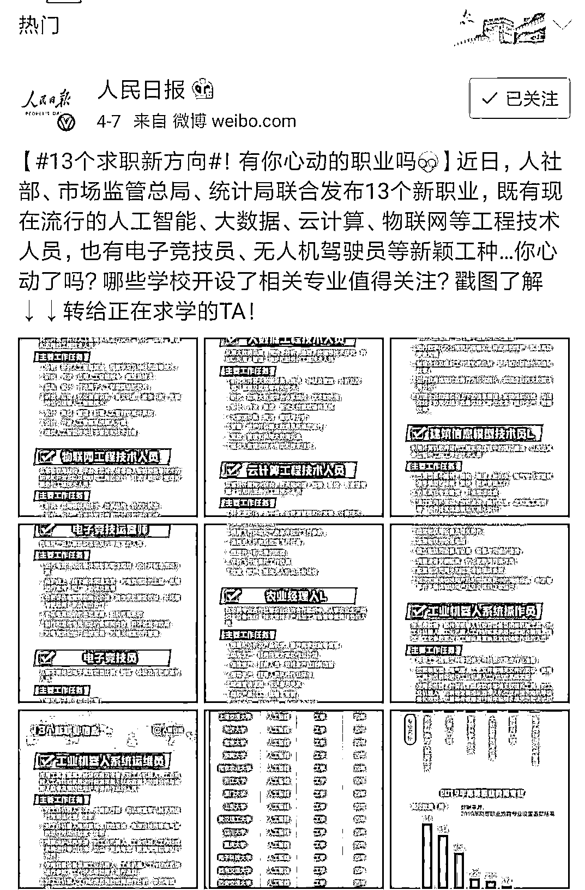
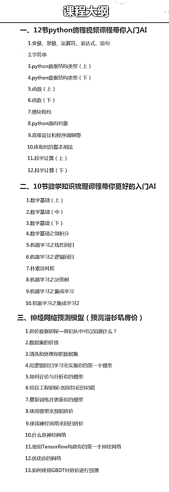

# 廖雪峰的人工智能课程，终终终于免费了！！！

> 原文：[`mp.weixin.qq.com/s?__biz=MzAxNTc0Mjg0Mg==&mid=2653292026&idx=1&sn=0c79a45ff325adb435672c08dd9d7bec&chksm=802dc7efb75a4ef9864d9add865bb673d7585c94aa471f94f219ccbf714da33bf8b090de3fa4&scene=27#wechat_redirect`](http://mp.weixin.qq.com/s?__biz=MzAxNTc0Mjg0Mg==&mid=2653292026&idx=1&sn=0c79a45ff325adb435672c08dd9d7bec&chksm=802dc7efb75a4ef9864d9add865bb673d7585c94aa471f94f219ccbf714da33bf8b090de3fa4&scene=27#wechat_redirect)

**标星★公众号     **爱你们♥

2019 随着我国人工智能技术相关产业的快速推进，人工智能相关行业的职业需求存在着巨大的缺口。

图片来源：微博

**人工智能已从“概念炒作”真正进入“实际应用”阶段。**

随着企业，尤其是一线互联网公司的招聘要求越来越高，AI 岗位掌握哪些技能才能更受青睐？

**1、掌握一种编程工具（语言），例如：进入人工智能必学的 Python；**

**2、掌握经典机器学习理论与基本算法；**

**3、有了基础理论知识后，便可以尝试最为前沿的 AI 技能——机器学习和深度学习。**

未来 AI 人工智能的发展势不可挡，无论人们对 AI 抱何种态度，都不要抵触对新领域的了解和学习；**只有把握行业发展的最新潮流，才能为自己寻找到更合适的定位和更好的发展轨迹。**

鉴于此，我向大家推荐一个牛逼的老师：有着**Python 教父**之称的**廖雪峰**老师，更是畅销书《Spring 2.0 核心技术与最佳实践》的作者。

**廖雪峰老师**：**曾任职西门子、摩托罗拉、火币网等知名公司高级技术专家；其官方博客是很多技术人常用的参考教程，日访问量达**5 万+**。**

廖老师带领其官方团队耗时半年精心打造出了一版价值 2980 元的人工智能入门课程**，视频是廖老师的团队专门为想要自学人工智能的小伙伴录的，**非常适合想要能真正的入门和深入学习人工智能这门核心技术需求的人。

最最最重要的是这套价值 2980 元的课程可以**免费领取啦，限时 500****名**，可以说是市面上最良心的人工智能入门课程，所以诚心推荐给大家！

**此套人工智能入门课程有如下特点：**

**1、**python 编程+数学部分+项目实战=60 小时课程**，每天学习 1 小时，2 个月成功入门 AI;**

**2、中科院博士 + 清华博士后双博讲解(廖雪峰老师邀请);**

**3、所有案例都基于商业项目改编;**

人工智能入门课程内容如下（**共 35 个知识点，市面上最良心的人工智能入门课程**）

以上的课程是廖雪锋老师团队精心设计的价值 2980 元的人工智能入门课程，对以上课程感兴趣的小伙伴可以添加**廖雪峰老师助理微信**，限时**5****00**名免费领取。

**长按识别**下面二维码，添加**廖老师助手的微信**，**免费领取课程哦**！

**长按识别**下面二维码

添加小助理，免费领取

**本公众号粉丝专享福利**

**（立即扫码，免费领取）**

**友情提示：**这套视频由廖雪峰老师团队倾力打造，不仅有理论，更包含了廖雪峰老师多年开发经验总结的案例讲解，希望你领到资料之后能认真学习！