# 最新 | 用深度强化学习打造不亏钱的交易机器人（附代码）

> 原文：[`mp.weixin.qq.com/s?__biz=MzAxNTc0Mjg0Mg==&mid=2653292021&idx=1&sn=a9cbc37fd50d917df61728eee0a109db&chksm=802dc7e0b75a4ef6937f4e73bd561362d4baa6219e948fc5211e1071c50925cd69925fb1850e&scene=27#wechat_redirect`](http://mp.weixin.qq.com/s?__biz=MzAxNTc0Mjg0Mg==&mid=2653292021&idx=1&sn=a9cbc37fd50d917df61728eee0a109db&chksm=802dc7e0b75a4ef6937f4e73bd561362d4baa6219e948fc5211e1071c50925cd69925fb1850e&scene=27#wechat_redirect)

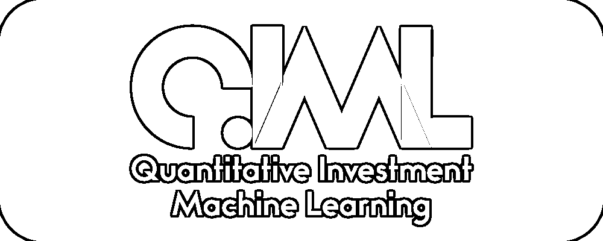**标星★公众号     **爱你们♥

作者：Adam King

编译：公众号海外编辑部

**近期原创文章：**

## ♥ [基于无监督学习的期权定价异常检测（代码+数据）](https://mp.weixin.qq.com/s?__biz=MzAxNTc0Mjg0Mg==&mid=2653290562&idx=1&sn=dee61b832e1aa2c062a96bb27621c29d&chksm=802dc257b75a4b41b5623ade23a7de86333bfd3b4299fb69922558b0cbafe4c930b5ef503d89&token=1298662931&lang=zh_CN&scene=21#wechat_redirect)

## ♥ [5 种机器学习算法在预测股价的应用（代码+数据）](https://mp.weixin.qq.com/s?__biz=MzAxNTc0Mjg0Mg==&mid=2653290588&idx=1&sn=1d0409ad212ea8627e5d5cedf61953ac&chksm=802dc249b75a4b5fa245433320a4cc9da1a2cceb22df6fb1a28e5b94ff038319ae4e7ec6941f&token=1298662931&lang=zh_CN&scene=21#wechat_redirect)

## ♥ [深入研读：利用 Twitter 情绪去预测股市](https://mp.weixin.qq.com/s?__biz=MzAxNTc0Mjg0Mg==&mid=2653290402&idx=1&sn=efda9ea106991f4f7ccabcae9d809e00&chksm=802e3db7b759b4a173dc8f2ab5c298ab3146bfd7dd5aca75929c74ecc999a53b195c16f19c71&token=1330520237&lang=zh_CN&scene=21#wechat_redirect)

## ♥ [Two Sigma 用新闻来预测股价走势，带你吊打 Kaggle](https://mp.weixin.qq.com/s?__biz=MzAxNTc0Mjg0Mg==&mid=2653290456&idx=1&sn=b8d2d8febc599742e43ea48e3c249323&chksm=802e3dcdb759b4db9279c689202101b6b154fb118a1c1be12b52e522e1a1d7944858dbd6637e&token=1330520237&lang=zh_CN&scene=21#wechat_redirect)

## ♥ [利用深度学习最新前沿预测股价走势](https://mp.weixin.qq.com/s?__biz=MzAxNTc0Mjg0Mg==&mid=2653290080&idx=1&sn=06c50cefe78a7b24c64c4fdb9739c7f3&chksm=802e3c75b759b563c01495d16a638a56ac7305fc324ee4917fd76c648f670b7f7276826bdaa8&token=770078636&lang=zh_CN&scene=21#wechat_redirect)

## ♥ [一位数据科学 PhD 眼中的算法交易](https://mp.weixin.qq.com/s?__biz=MzAxNTc0Mjg0Mg==&mid=2653290118&idx=1&sn=a261307470cf2f3e458ab4e7dc309179&chksm=802e3c93b759b585e079d3a797f512dfd0427ac02942339f4f1454bd368ba47be21cb52cf969&token=770078636&lang=zh_CN&scene=21#wechat_redirect)

## ♥ [基于 RNN 和 LSTM 的股市预测方法](https://mp.weixin.qq.com/s?__biz=MzAxNTc0Mjg0Mg==&mid=2653290481&idx=1&sn=f7360ea8554cc4f86fcc71315176b093&chksm=802e3de4b759b4f2235a0aeabb6e76b3e101ff09b9a2aa6fa67e6e824fc4274f68f4ae51af95&token=1865137106&lang=zh_CN&scene=21#wechat_redirect)

## ♥ [人工智能『AI』应用算法交易，7 个必踩的坑！](https://mp.weixin.qq.com/s?__biz=MzAxNTc0Mjg0Mg==&mid=2653289974&idx=1&sn=88f87cb64999d9406d7c618350aac35d&chksm=802e3fe3b759b6f5eca6e777364270cbaa0bf35e9a1535255be9751c3a77642676993a861132&token=770078636&lang=zh_CN&scene=21#wechat_redirect)

## ♥ [神经网络在算法交易上的应用系列（一）](https://mp.weixin.qq.com/s?__biz=MzAxNTc0Mjg0Mg==&mid=2653289962&idx=1&sn=5f5aa65ec00ce176501c85c7c106187d&chksm=802e3fffb759b6e9f2d4518f9d3755a68329c8753745333ef9d70ffd04bd088fd7b076318358&token=770078636&lang=zh_CN&scene=21#wechat_redirect)

## ♥ [预测股市 | 如何避免 p-Hacking，为什么你要看涨？](https://mp.weixin.qq.com/s?__biz=MzAxNTc0Mjg0Mg==&mid=2653289820&idx=1&sn=d3fee74ba1daab837433e4ef6b0ab4d9&chksm=802e3f49b759b65f422d20515942d5813aead73231da7d78e9f235bdb42386cf656079e69b8b&token=770078636&lang=zh_CN&scene=21#wechat_redirect)

## ♥ [如何鉴别那些用深度学习预测股价的花哨模型？](https://mp.weixin.qq.com/s?__biz=MzAxNTc0Mjg0Mg==&mid=2653290132&idx=1&sn=cbf1e2a4526e6e9305a6110c17063f46&chksm=802e3c81b759b597d3dd94b8008e150c90087567904a29c0c4b58d7be220a9ece2008956d5db&token=1266110554&lang=zh_CN&scene=21#wechat_redirect)

## ♥ [优化强化学习 Q-learning 算法进行股市](https://mp.weixin.qq.com/s?__biz=MzAxNTc0Mjg0Mg==&mid=2653290286&idx=1&sn=882d39a18018733b93c8c8eac385b515&chksm=802e3d3bb759b42d1fc849f96bf02ae87edf2eab01b0beecd9340112c7fb06b95cb2246d2429&token=1330520237&lang=zh_CN&scene=21#wechat_redirect)

**前言**

在本文中，我们将创建深度强化学习 agents，学习如何通过比特币交易赚钱。在本文中，我们将使用 OpenAI 的 gym 和来自 stable-baselines 库的 PPOagent，这是 OpenAI baselines 库的一个分支。

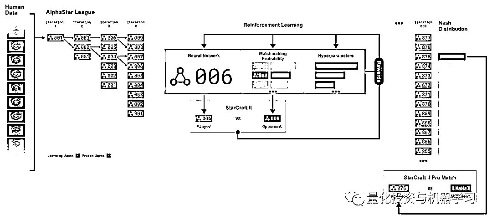

十分感谢**OpenAI**和**DeepMind**在过去几年为深度学习研究人员提供的开源软件。

正如 Teddy Roosevelt 所说：

> *Nothing worth having comes easy.*

所以，与其学习如何交易自己，不如制造一个机器人来为我们做这件事。本文的标的将应用在**比特币**上。

**获取全部代码，见文末**

**正文**

本文中，我们将使用 Zielak 生成的 Kaggle 数据集。.csv 数据文件在这里下载： 

*https://www.kaggle.com/mczielinski/bitcoin-historical-data*

首先，让我们导入所有必要的库。

接下来，让我们为环境创建类。我们将需要传入一个 pandas dataframe，以及一个可选的 initial_balance 和一个 l ookback_window_size，它将指示 agent 在过去的每一步将观察多少时间步长。我们将把每笔交易的佣金默认为 0.075%，即 Bitmex 的当前利率，把 serial 参数默认为 false，这意味着我们的 dataframe 将在默认情况下以随机切片的形式遍历。

我们还在数据帧上调用 dropna() 和 r eset_index() 来首先删除任何带有 NaN 值的行，然后重置 frame 的索引，因为我们已经删除了数据。

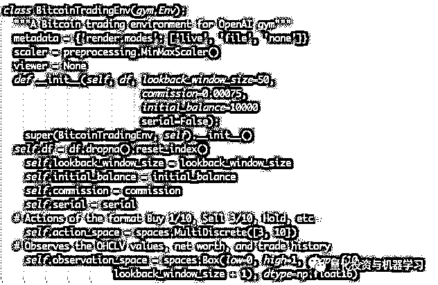

这里的 action_space 表示为一个由 3 个选项组成的离散集合（买进、卖出或持有）和另一个由 10 个数量组成的离散集合（1/10、2/10、3/10，等等）。当购买操作被选中时，我们将购买 amount * self.balance 平衡 BTC 值。对于卖出操作，我们将卖出 amount * self.btc_held 持有 BTC 的价值。当然，hold 动作将忽略数量，什么也不做。

我们的 observation_space 被定义为 0 到 1 之间的连续浮点数集，其大小为(10, lookback_window_size + 1)。+1 表示当前的时间步长。对于窗口中的每个时间步长，我们将观察 OHCLV 值、我们的净资产、BTC 买卖的金额以及在这些 BTC 上花费或收到的总额。

接下来，我们需要编写 reset 方法来初始化环境。

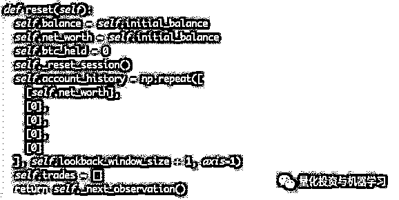

这里我们同时使用 self._reset_session 和 self._next_observation，让我们来定义它们。

**交易时段**

我们环境的一个重要部分是交易时段的概念。如果我们将这个 agent 部署到外部，我们可能永远不会一次运行它超过几个月。 出于这个原因，我们将限制 self.df 中连续 frames 的数量，我们的 agent 将连续看到这些帧 frames。

在我们的 _reset_session 方法中，我们首先将 current_step 重置为 0。接下来，我们将 steps_left 设置为一个介于 1 和 MAX_TRADING_SESSION 之间的随机数，现在我们将在代码最前面定义这个随机数。

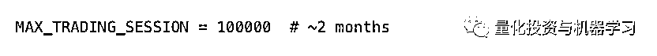

接下来，如果我们连续遍历 frame，我们将设置要遍历的整个 frame，否则我们将 frame_start 设置为 self.df 中的随机点，并创建一个名为 active_df 的新数 frame，它只是一个切片 self.df 从 frame_start 到 frame_start + steps_left 。

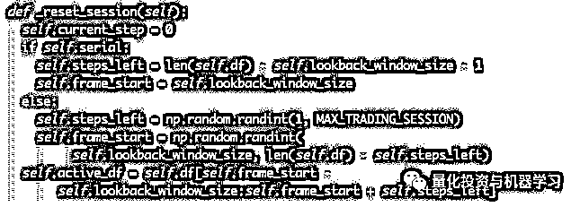

在随机切片中遍历 dataframe 的一个不好的地方是，当经过长时间的训练，我们的 agent 将有更多独特的数据可用。例如，如果我们只以串行方式遍历 dataframe（即从 0 到 len(df) 的顺序），那么我们只会拥有与 dataframe 中相同数量的惟一数据点。我们的观测空间甚至只能在每一个时间步长上呈现出离散的状态。

然而，通过随机遍历 dataframe 的各个部分，我们通过为初始数据集中的每个时间步创建更有趣的帐户余额、所进行的交易和以前看到的价格行为组合，本质上生成了更独特的数据点。

在重置串行环境后的时间步骤 10 中，我们的 agent 将始终在 dataframe 中的同一时间内，并且在每个时间步骤中有 3 个选择：买进、卖出或持有。对于这三个选项中的每一个，都需要另外一种选择：10%、20%、……或者 100%。这意味着我们的代理可以经历任何(1⁰³)¹⁰总状态，总共 1⁰³⁰可能的独特体验。

现在考虑随机切片的环境。在第 10 步时，我们的 agent 可以位于 dataframe 中的任何 len(df) 时间步长。给定在每个时间步骤做出的相同选择，这意味着该代理可以在相同的 10 个时间步骤中经历任何 len (df)³⁰ 可能的唯一状态。

虽然这可能会给大型数据集增加相当多的噪音，但我们认为它应该允许 agent 从我们有限的数据量中学到更多。我们仍将以串行方式遍历测试数据集，以便更准确地理解算法对新颖申万、看似“实时”数据的有用性。

**Agent Eyes**

它通常有助于可视化环境的观察空间，以便了解你的 agent 将使用哪些类型的特征。例如，下面是使用 OpenCV 呈现的观察空间的可视化。 

OpenCV visualization of the environment’s observation space

图像中的每一行代表我们的 observation_space 中的一行。 前 4 行类似频率的红线代表 OHCL 数据，正下方的虚假橙色和黄色点代表成交量。 下方波动的蓝色条形是 agent 的净值，而下方的较轻的条形代表 agent 的交易。

我们将定义 _next_observation 方法，将观察到的数据从 0 缩放到 1。

***It’s important to only scale the data the agent has observed so far to prevent look-ahead biases.***

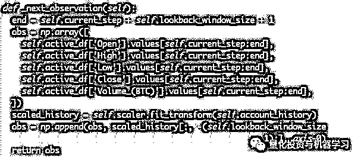

**采取行动**

现在我们已经建立了我们的观察空间，是时候编写我们的 step 函数了，然后，执行 agent 的指定操作。当我们当前交易时段的 self.steps_left == 0 时，我们将出售所持有的任何 BTC，并调用 _reset_session()。否则，我们将 reward 设置为当前的净资产，并且只有当我们的钱用完时才将 done 设置为 True。 

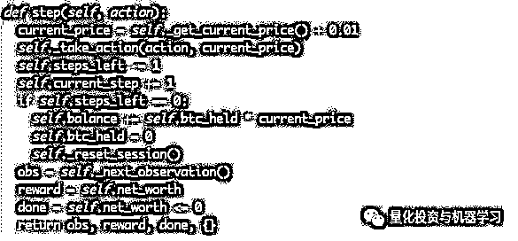

采取行动与 current_price、确定指定的操作以及买卖指定数量的 BTC 一样简单。让我们快速编写 _take_action，以便测试我们的环境。

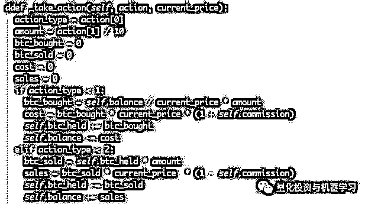

最后，用同样的方法，我们将把交易附加到 self.trades 和更新我们的净值和帐户历史。

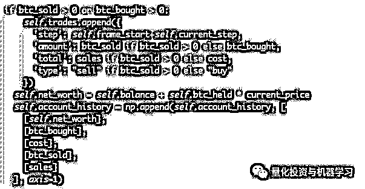

我们的 agent 现在可以启动一个新环境，遍历该环境，并采取影响该环境的操作。是时候看他们交易了。

**交易机器人**

我们的 render 方法可以像调用 print(self.net_worth) 这样简单，但这并不有趣。相反，我们将绘制一个简单的烛台图表。

我们将使用 StockTradingGraph.py 中的代码，并利用它来呈现我们的比特币环境。

我们要做的第一个改变是将 self.df ['Date'] 更新到 self.df ['Timestamp']。并删除所有对 date2num 的调用，因为我们的日期已经采用 unix 时间戳格式。接下来，在我们的 render 方法中，我们将更新日期标签，以打印我们可读的日期，而不是数字。

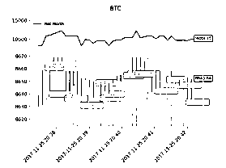

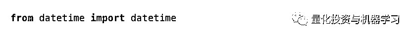

首先，导入 datetime 库，然后使用 utcfromtimestamp 方法从每个时间戳获取 UTC 字符串，并使用 strftime 将字符串格式化为 Y-m-d H:M 格式。

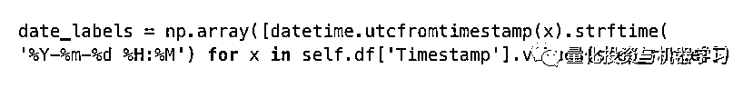

最后，我们将 self.df df['Volume'] 更改为 self.df['Volume_(BTC)'] 来匹配我们的数据集。回到 BitcoinTradingEnv 中，我们现在可以编写渲染方法来显示图形。

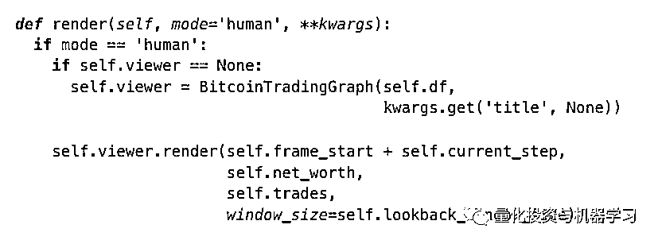

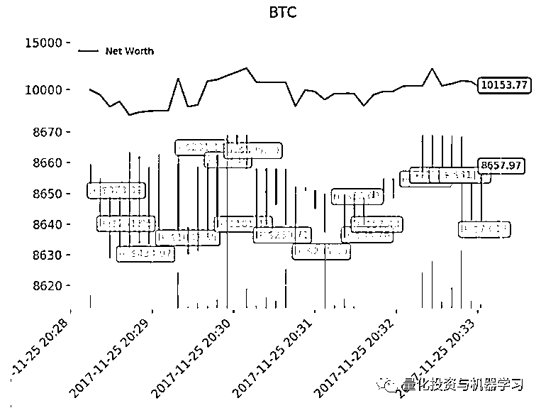

绿色表示 BTC 买入，红色表示卖出。右上角的白色标签是 agent 当前的净资产，右下角的标签是比特币当前的价格。现在，是时候训练我们的 agent 了，看看我们能赚多少钱!

**训练时间**

一种常见的交叉验证形式称为 k-fold 验证，在这种验证中，将数据分成 k 个相等的组，逐个单独将一个组作为测试组，并使用其余的数据作为训练组。然而，**时间序列数据高度依赖于时间，这意味着以后的数据高度依赖于以前的数据**。所以 k-fold 行不通，因为我们的 agent 会在交易之前从未来的数据中学习，这是一个不公平的优势。 

**当应用于时间序列数据时，同样的缺陷也适用于大多数其他交叉验证策略**。因此，我们只需要从整个 dataframe 中取一小部分作为训练集，从 frame 的开始到任意索引，然后使用其余的数据作为测试集。

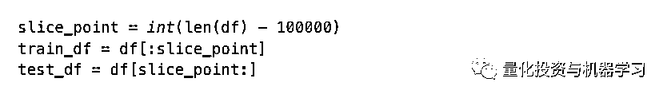

接下来，由于我们的环境只设置为处理单个 dataframe，所以我们将创建两个环境，一个用于训练数据，一个用于测试数据。

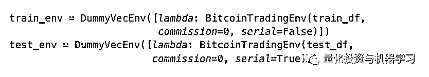

现在，训练我们的模型就像用我们的环境创建一个代理并调用 model.learn 一样简单。

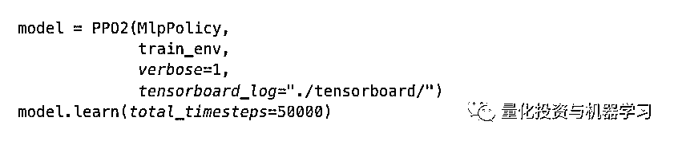

 在这里，我们使用了 tensorboard，这样我们就可以很容易地可视化我们的 tensorflow 图，并查看关于代理的一些量化指标。例如，这里有一张图表，显示了许多 agent 在 20 万步以上的时间内获得的 rewards：

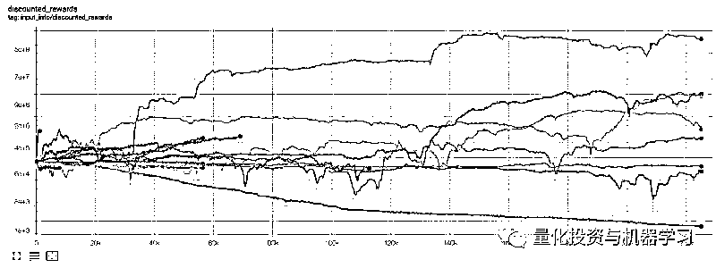

看来我们的 agent 非常赚钱！我们最好的 agent 甚至能够在 20 万步的过程中使他的余额增加 1000 倍，而其余的平均至少增加了 30 倍！

就在这个时候，我们意识到环境中存在一个 bug……在修复了这个 bug 之后，下面是新的图：

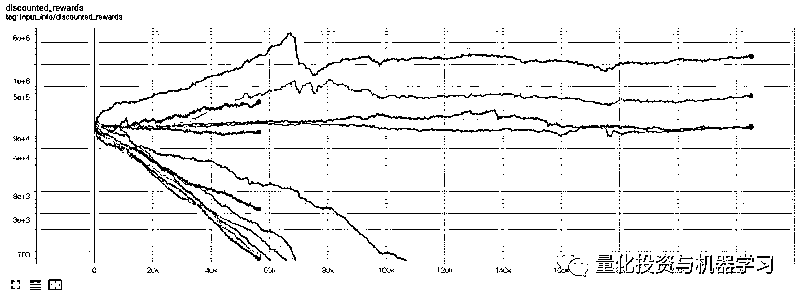

正如你所看到的，我们的一些 agent 做得很好，而其余的人都破产了。然而，表现良好的 agent 最多能够将初始余额提高 10 倍甚至 60 倍。我们必须承认，**所有盈利的 agent 都是在没有佣金的环境下接受训练和测试的**，所以我们的 agent 想要赚到真正的钱还是完全不现实的。

让我们在测试环境中测试我们的 agent（使用他们从未见过的新数据），看看他们学习如何交易比特币。

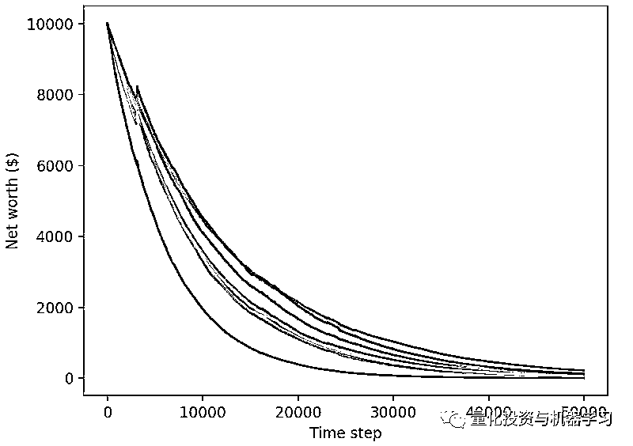

显然，我们还有很多工作要做。通过简单转换我们的模型使用 stable-baseline A2C，而不是当前 PPO2 agent，我们可以大大提高我们在此数据集上的性能。最后，根据 Sean O'Gorman 的建议，我们可以略微更新我们的奖励功能，以便我们奖励净值增加，而不仅仅是实现高净值并留在那里。

仅这两个变化就极大地提高了相同数据集上的性能，正如你在下面看到的，我们最终能够在训练集之外的新数据上实现盈利。

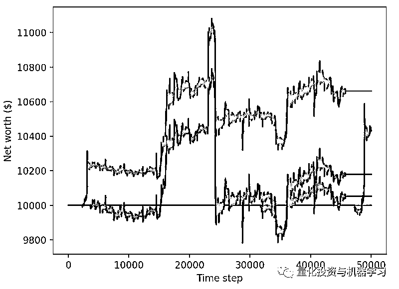

我们可以做得更好。为了改善这些结果，我们需要优化超参数，并对 agent 进行更长时间的训练。

在后续的文章中，我们将使用**贝叶斯优化**来为我们的问题空间划分最佳超参数，并为使用 CUDA 对 GPU 进行训练/测试准备环境。

推荐一篇文章：*https://arxiv.org/pdf/1807.02811.pdf*

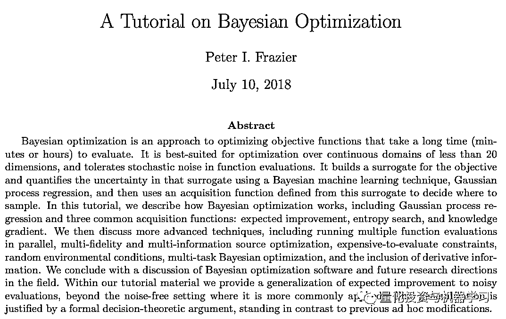

**结论**

虽然我们还没有完全成功地利用新数据打造出一个盈利的比特币交易机器人，但我们已经比当初设定目标时更接近目标了。下一次，我们将确保我们的 agent 能够从测试数据上赚钱，而不仅仅是训练数据。

*原文：*

*https://towardsdatascience.com/creating-bitcoin-trading-bots-that-dont-lose-money*

**推荐阅读**

[01、经过多年交易之后你应该学到的东西（深度分享）](https://mp.weixin.qq.com/s?__biz=MzAxNTc0Mjg0Mg==&mid=2653289074&idx=1&sn=e859d363eef9249236244466a1af41b6&chksm=802e3867b759b1717f77e07a51ee5671e8115130c66562577280ba1243cba08218add04f1f00&token=449379994&lang=zh_CN&scene=21#wechat_redirect)

[02、监督学习标签在股市中的应用（代码+书籍）](https://mp.weixin.qq.com/s?__biz=MzAxNTc0Mjg0Mg==&mid=2653289050&idx=1&sn=60043a5c95b877dd329a5fd150ddacc4&chksm=802e384fb759b1598e500087374772059aa21b31ae104b3dca04331cf4b63a233c5e04c1945a&token=449379994&lang=zh_CN&scene=21#wechat_redirect)

[03、全球投行顶尖机器学习团队全面分析](https://mp.weixin.qq.com/s?__biz=MzAxNTc0Mjg0Mg==&mid=2653289018&idx=1&sn=8c411f676c2c0d92b0dd218f041bee4b&chksm=802e382fb759b139ffebf633ac14cdd0f21938e4613fe632d5d9231dab3d2aca95a11628378a&token=449379994&lang=zh_CN&scene=21#wechat_redirect)

[04、使用 Tensorflow 预测股票市场变动](https://mp.weixin.qq.com/s?__biz=MzAxNTc0Mjg0Mg==&mid=2653289014&idx=1&sn=3762d405e332c599a21b48a7dc4df587&chksm=802e3823b759b135928d55044c2729aea9690f86752b680eb973d1a376dc53cfa18287d0060b&token=449379994&lang=zh_CN&scene=21#wechat_redirect)

[05、使用 LSTM 预测股票市场基于 Tensorflow](https://mp.weixin.qq.com/s?__biz=MzAxNTc0Mjg0Mg==&mid=2653289238&idx=1&sn=3144f5792f84455dd53c27a78e8a316c&chksm=802e3903b759b015da88acde4fcbc8547ab3e6acbb5a0897404bbefe1d8a414265d5d5766ee4&token=2020206794&lang=zh_CN&scene=21#wechat_redirect)

[06、美丽的回测——教你定量计算过拟合概率](https://mp.weixin.qq.com/s?__biz=MzAxNTc0Mjg0Mg==&mid=2653289314&idx=1&sn=87c5a12b23a875966db7be50d11f09cd&chksm=802e3977b759b061675d1988168c1fec06c602e8583fbcc9b76f87008e0c10b702acc85467a0&token=1972390229&lang=zh_CN&scene=21#wechat_redirect)

[07、利用动态深度学习预测金融时间序列基于 Python](https://mp.weixin.qq.com/s?__biz=MzAxNTc0Mjg0Mg==&mid=2653289347&idx=1&sn=bf5d7899bc4a854d4ba9046fdc6fe0d6&chksm=802e3996b759b080287213840987bb0a0c02e4e1d4d7aae23f10a225a92ef6dd922d8006123d&token=290397496&lang=zh_CN&scene=21#wechat_redirect)

[08、Facebook 开源神器 Prophet 预测时间序列基于 Python](https://mp.weixin.qq.com/s?__biz=MzAxNTc0Mjg0Mg==&mid=2653289394&idx=1&sn=24a836136d730aa268605628e683d629&chksm=802e39a7b759b0b1dcf7aaa560699130a907716b71fc9c45ff0e5d236c5ae8ef80ebdb09dbb6&token=290397496&lang=zh_CN&scene=21#wechat_redirect)

[09、Facebook 开源神器 Prophet 预测股市行情基于 Python](https://mp.weixin.qq.com/s?__biz=MzAxNTc0Mjg0Mg==&mid=2653289437&idx=1&sn=f0dca7da8e69e7ba736992cb3d034ce7&chksm=802e39c8b759b0de5bce401c580623d0729ecca69d13926479d36e19aff8c9c9e8a20265afff&token=290397496&lang=zh_CN&scene=21#wechat_redirect)

[10、2018 第三季度最受欢迎的券商金工研报前 50（附下载）](https://mp.weixin.qq.com/s?__biz=MzAxNTc0Mjg0Mg==&mid=2653289358&idx=1&sn=db6e8ab85b08f6e67790ec0e401e586e&chksm=802e399bb759b08d6eec855f9901ea856d0da68c7425cba62791b8948da6ad761a3d88543dad&token=290397496&lang=zh_CN&scene=21#wechat_redirect)

[11、实战交易策略的精髓（公众号深度呈现）](https://mp.weixin.qq.com/s?__biz=MzAxNTc0Mjg0Mg==&mid=2653289447&idx=1&sn=f2948715bf82569a6556d518e56c1f9e&chksm=802e39f2b759b0e4502d1aaac562b87789573b55c76b3c85897d8c9d88dbf9a0b7ee34d86a4e&token=290397496&lang=zh_CN&scene=21#wechat_redirect)

[12、Markowitz 有效边界和投资组合优化基于 Python](https://mp.weixin.qq.com/s?__biz=MzAxNTc0Mjg0Mg==&mid=2653289478&idx=1&sn=f8e01a641be021993d8ef2d84e94a299&chksm=802e3e13b759b7055cf27a280c672371008a5564c97c658eee89ce8481396a28d254836ff9af&token=290397496&lang=zh_CN&scene=21#wechat_redirect)

[13、使用 LSTM 模型预测股价基于 Keras](https://mp.weixin.qq.com/s?__biz=MzAxNTc0Mjg0Mg==&mid=2653289495&idx=1&sn=c4eeaa2e9f9c10995be9ea0c56d29ba7&chksm=802e3e02b759b7148227675c23c403fb9a543b733e3d27fa237b53840e030bf387a473d83e3c&token=1260956004&lang=zh_CN&scene=21#wechat_redirect)

[14、量化金融导论 1：资产收益的程式化介绍基于 Python](https://mp.weixin.qq.com/s?__biz=MzAxNTc0Mjg0Mg==&mid=2653289507&idx=1&sn=f0ca71aa07531bbbdbd33213f0bab89f&chksm=802e3e36b759b720138b3b17a4dd0e198e054b9de29a038fdd50805f824effa55831111ad026&token=1936245282&lang=zh_CN&scene=21#wechat_redirect)

[15、预测股市崩盘基于统计机器学习与神经网络（Python+文档）](https://mp.weixin.qq.com/s?__biz=MzAxNTc0Mjg0Mg==&mid=2653289533&idx=1&sn=4ef964834e84a9995111bb057b0fc5dd&chksm=802e3e28b759b73e0618eb1262c53aa0601fbf5805525a7c7ff40dc3db62c7704496611bdbf1&token=1950551577&lang=zh_CN&scene=21#wechat_redirect)

[16、实现最优投资组合有效前沿基于 Python（附代码）](https://mp.weixin.qq.com/s?__biz=MzAxNTc0Mjg0Mg==&mid=2653289609&idx=1&sn=c7f0b3e47025862d10bb53b6ab88bcda&chksm=802e3e9cb759b78abf6b8b049c59bf18ccfb2ead7580d1f557d36de2292f59dcbd94dcd41910&token=2085008037&lang=zh_CN&scene=21#wechat_redirect)

[17、精心为大家整理了一些超级棒的机器学习资料（附链接）](https://mp.weixin.qq.com/s?__biz=MzAxNTc0Mjg0Mg==&mid=2653289615&idx=1&sn=1cdc89afb997d0c580bf0cef296d946c&chksm=802e3e9ab759b78ce9f0cd152a680d4a413d6c8dcb02a7a296f4091993a7e4137e7520394575&token=2085008037&lang=zh_CN&scene=21#wechat_redirect)

[18、海量 Wind 数据，与全网用户零距离邂逅！](https://mp.weixin.qq.com/s?__biz=MzAxNTc0Mjg0Mg==&mid=2653289623&idx=1&sn=28a3600fd7a72d7be00b066ca0f98244&chksm=802e3e82b759b7943f43a4f6ef4a91e4153fa6b8210de9590235fa8ee66eb9811ce177054dbc&token=1389401983&lang=zh_CN&scene=21#wechat_redirect)

[19、机器学习、深度学习、量化金融、Python 等最新书籍汇总下载](https://mp.weixin.qq.com/s?__biz=MzAxNTc0Mjg0Mg==&mid=2653289640&idx=1&sn=34e94fcbe99052b8e7381ecc48a36dc0&chksm=802e3ebdb759b7ab897cd329a680715b6f8294e63550ddf0c57b9e1320b2b7d1408c6fdca0c7&token=1389401983&lang=zh_CN&scene=21#wechat_redirect)

[20、各大卖方 2019 年 A 股策略报告，都是有故事的人！](https://mp.weixin.qq.com/s?__biz=MzAxNTc0Mjg0Mg==&mid=2653289725&idx=1&sn=4b65cd1fb8331438e4c0b3d0eae6b51f&chksm=802e3ee8b759b7fe1b94e84d54cc23b0ab05853d5cd227812574b350e9fc2cce9e5f1bc6cb7a&token=1389401983&lang=zh_CN&scene=21#wechat_redirect)

**如何获取代码**

在**后台**输入（严格大小写）

***Trader-RL***

*—End—*

量化投资与机器学习微信公众号，是业内垂直于**Quant**、**MFE**、**CST**等专业的主流自媒体。公众号拥有来自**公募、私募、券商、银行、海外**等众多圈内**10W+**关注者。每日发布行业前沿研究成果和最新资讯。

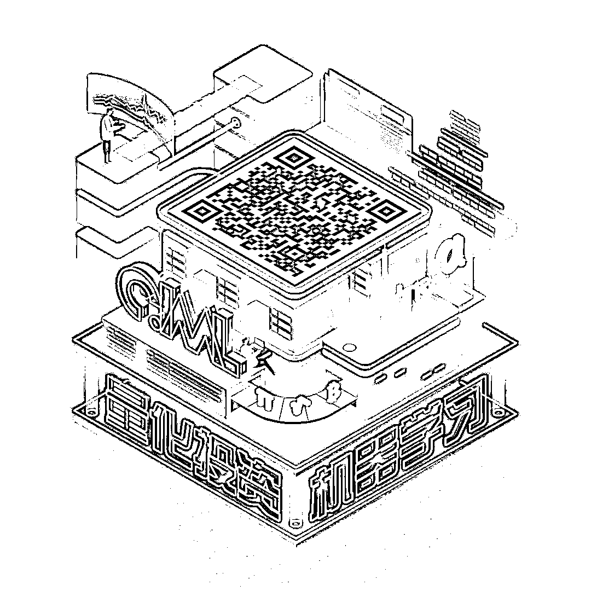