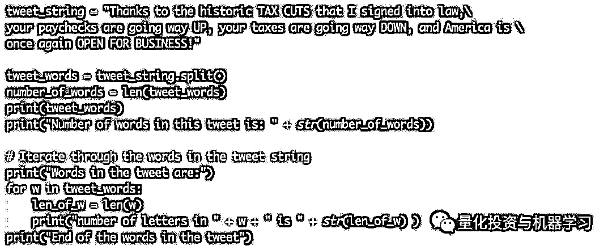
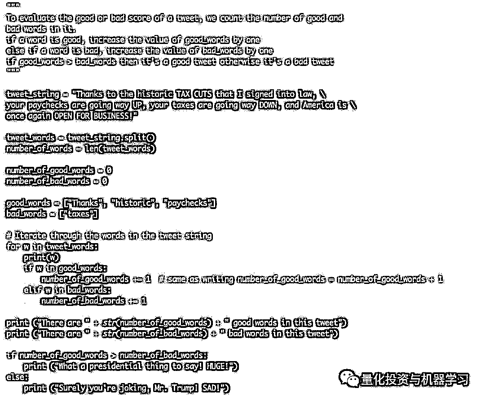
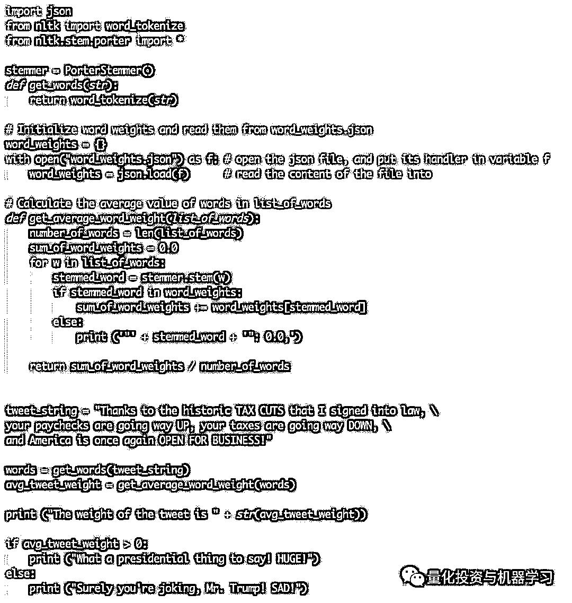
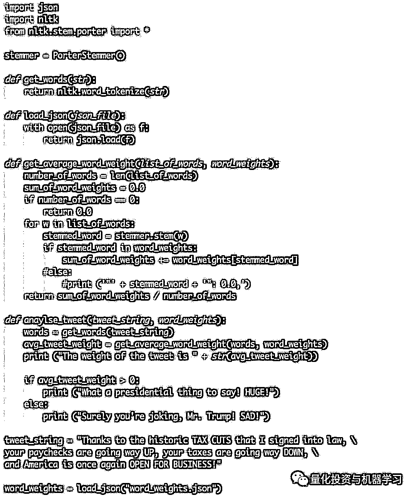
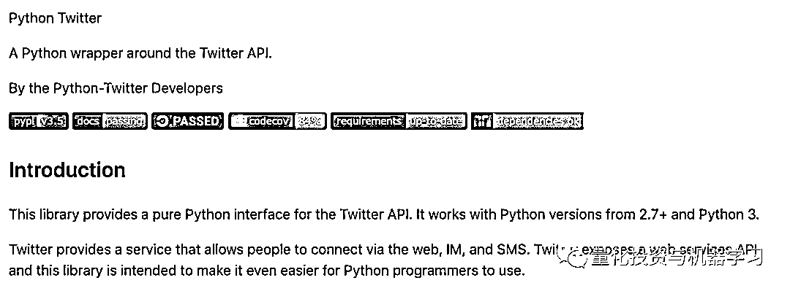
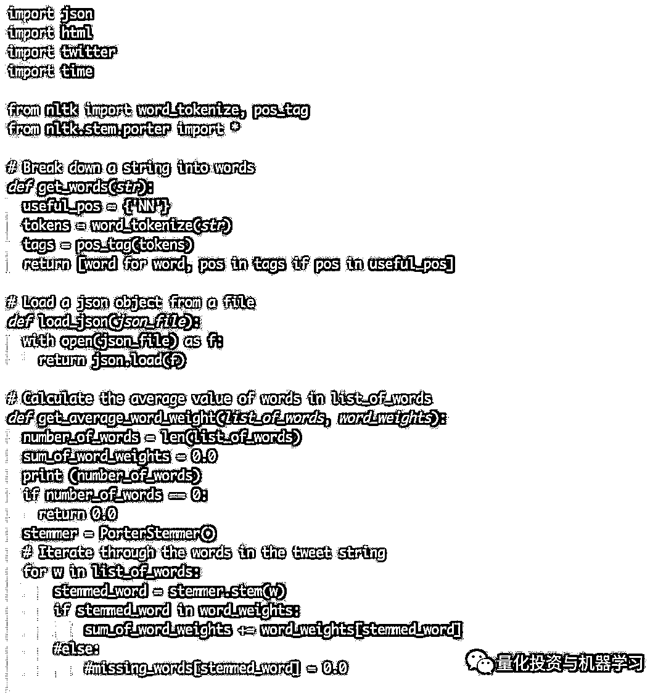
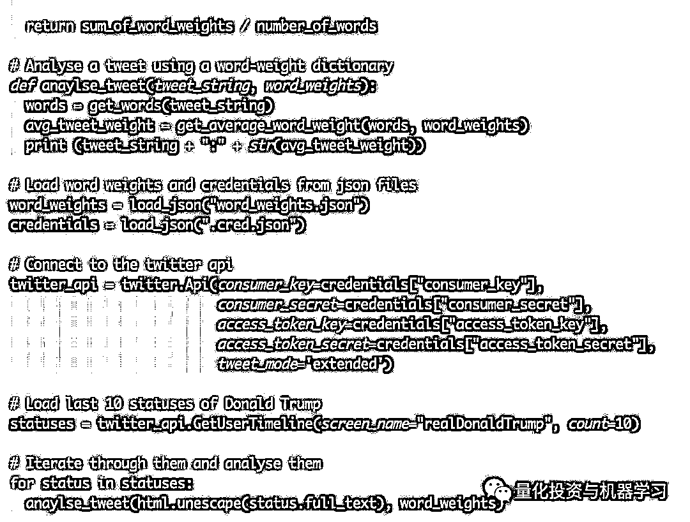

# 拿起 Python，防御特朗普的 Twitter！

> 原文：[`mp.weixin.qq.com/s?__biz=MzAxNTc0Mjg0Mg==&mid=2653291977&idx=1&sn=01f146e9a88bf130ca1b479573e6d158&chksm=802dc7dcb75a4ecadfdbdace877ed948f56b72bc160952fd1e4bcde27260f823c999a65a0d6d&scene=27#wechat_redirect`](http://mp.weixin.qq.com/s?__biz=MzAxNTc0Mjg0Mg==&mid=2653291977&idx=1&sn=01f146e9a88bf130ca1b479573e6d158&chksm=802dc7dcb75a4ecadfdbdace877ed948f56b72bc160952fd1e4bcde27260f823c999a65a0d6d&scene=27#wechat_redirect)

**标星★公众号     **爱你们♥

作者：Ali Alavi、Yumi、Sara Robinson

编译：公众号进行了全面整理

**近期原创文章：**

## ♥ [基于无监督学习的期权定价异常检测（代码+数据）](https://mp.weixin.qq.com/s?__biz=MzAxNTc0Mjg0Mg==&mid=2653290562&idx=1&sn=dee61b832e1aa2c062a96bb27621c29d&chksm=802dc257b75a4b41b5623ade23a7de86333bfd3b4299fb69922558b0cbafe4c930b5ef503d89&token=1298662931&lang=zh_CN&scene=21#wechat_redirect)

## ♥ [5 种机器学习算法在预测股价的应用（代码+数据）](https://mp.weixin.qq.com/s?__biz=MzAxNTc0Mjg0Mg==&mid=2653290588&idx=1&sn=1d0409ad212ea8627e5d5cedf61953ac&chksm=802dc249b75a4b5fa245433320a4cc9da1a2cceb22df6fb1a28e5b94ff038319ae4e7ec6941f&token=1298662931&lang=zh_CN&scene=21#wechat_redirect)

## ♥ [深入研读：利用 Twitter 情绪去预测股市](https://mp.weixin.qq.com/s?__biz=MzAxNTc0Mjg0Mg==&mid=2653290402&idx=1&sn=efda9ea106991f4f7ccabcae9d809e00&chksm=802e3db7b759b4a173dc8f2ab5c298ab3146bfd7dd5aca75929c74ecc999a53b195c16f19c71&token=1330520237&lang=zh_CN&scene=21#wechat_redirect)

## ♥ [Two Sigma 用新闻来预测股价走势，带你吊打 Kaggle](https://mp.weixin.qq.com/s?__biz=MzAxNTc0Mjg0Mg==&mid=2653290456&idx=1&sn=b8d2d8febc599742e43ea48e3c249323&chksm=802e3dcdb759b4db9279c689202101b6b154fb118a1c1be12b52e522e1a1d7944858dbd6637e&token=1330520237&lang=zh_CN&scene=21#wechat_redirect)

## ♥ [利用深度学习最新前沿预测股价走势](https://mp.weixin.qq.com/s?__biz=MzAxNTc0Mjg0Mg==&mid=2653290080&idx=1&sn=06c50cefe78a7b24c64c4fdb9739c7f3&chksm=802e3c75b759b563c01495d16a638a56ac7305fc324ee4917fd76c648f670b7f7276826bdaa8&token=770078636&lang=zh_CN&scene=21#wechat_redirect)

## ♥ [一位数据科学 PhD 眼中的算法交易](https://mp.weixin.qq.com/s?__biz=MzAxNTc0Mjg0Mg==&mid=2653290118&idx=1&sn=a261307470cf2f3e458ab4e7dc309179&chksm=802e3c93b759b585e079d3a797f512dfd0427ac02942339f4f1454bd368ba47be21cb52cf969&token=770078636&lang=zh_CN&scene=21#wechat_redirect)

## ♥ [基于 RNN 和 LSTM 的股市预测方法](https://mp.weixin.qq.com/s?__biz=MzAxNTc0Mjg0Mg==&mid=2653290481&idx=1&sn=f7360ea8554cc4f86fcc71315176b093&chksm=802e3de4b759b4f2235a0aeabb6e76b3e101ff09b9a2aa6fa67e6e824fc4274f68f4ae51af95&token=1865137106&lang=zh_CN&scene=21#wechat_redirect)

## ♥ [人工智能『AI』应用算法交易，7 个必踩的坑！](https://mp.weixin.qq.com/s?__biz=MzAxNTc0Mjg0Mg==&mid=2653289974&idx=1&sn=88f87cb64999d9406d7c618350aac35d&chksm=802e3fe3b759b6f5eca6e777364270cbaa0bf35e9a1535255be9751c3a77642676993a861132&token=770078636&lang=zh_CN&scene=21#wechat_redirect)

## ♥ [神经网络在算法交易上的应用系列（一）](https://mp.weixin.qq.com/s?__biz=MzAxNTc0Mjg0Mg==&mid=2653289962&idx=1&sn=5f5aa65ec00ce176501c85c7c106187d&chksm=802e3fffb759b6e9f2d4518f9d3755a68329c8753745333ef9d70ffd04bd088fd7b076318358&token=770078636&lang=zh_CN&scene=21#wechat_redirect)

## ♥ [预测股市 | 如何避免 p-Hacking，为什么你要看涨？](https://mp.weixin.qq.com/s?__biz=MzAxNTc0Mjg0Mg==&mid=2653289820&idx=1&sn=d3fee74ba1daab837433e4ef6b0ab4d9&chksm=802e3f49b759b65f422d20515942d5813aead73231da7d78e9f235bdb42386cf656079e69b8b&token=770078636&lang=zh_CN&scene=21#wechat_redirect)

## ♥ [如何鉴别那些用深度学习预测股价的花哨模型？](https://mp.weixin.qq.com/s?__biz=MzAxNTc0Mjg0Mg==&mid=2653290132&idx=1&sn=cbf1e2a4526e6e9305a6110c17063f46&chksm=802e3c81b759b597d3dd94b8008e150c90087567904a29c0c4b58d7be220a9ece2008956d5db&token=1266110554&lang=zh_CN&scene=21#wechat_redirect)

## ♥ [优化强化学习 Q-learning 算法进行股市](https://mp.weixin.qq.com/s?__biz=MzAxNTc0Mjg0Mg==&mid=2653290286&idx=1&sn=882d39a18018733b93c8c8eac385b515&chksm=802e3d3bb759b42d1fc849f96bf02ae87edf2eab01b0beecd9340112c7fb06b95cb2246d2429&token=1330520237&lang=zh_CN&scene=21#wechat_redirect)


刚刚巴菲特开完股东大会，特朗普又在 Twitter 来了一出。让股票市场跌宕起伏。


这也诞生了一个新词：

**一推就倒**

▍形容一条 Twitter 就吓得屁滚尿流，崩溃倒下的东西，多用于股市。

接下来我们就应用技术手段，基于 Python，建立一个工具，可以阅读和分析川普的 Twitter。然后判断每条特定的 Twitter 是否具有川普本人的性格。

同时我们还结合了其他的方法，包括**Deep Learning**、**Machine Learning**、**NLP、LSTM**等基于**Python**、**Keras**等。

**万字干货**

**对川普的 Twitter 做个全面分析！**

让大家以后面对川普冷不丁的 Twitter 有所准备！

**分析一**

**步骤一**

为了简单起见，我们将每条 Twitter 分解成单词。



如你所见，我们手动复制了 Trump 的一条 Twitter，将其分配给一个变量，并使用 split()方法将其分解为单词。split()返回一个列表，我们称之为 tweet_words。我们可以使用 len 函数计算列表中的项数。在第 4 行和第 5 行中，我们打印前面步骤的结果。注意第 5 行中的 str 函数。为什么在那里?

最后，在第 9 行中，我们循环遍历 tweet_words：也就是说，我们逐个遍历 tweet_words 项，将其存储在 w 中，然后在第 10 行和第 11 行处理 w。所以，第 10 行和第 11 行被执行了很多次，每一次都有不同的 w 值。你应该能够说出第 10 行和第 11 行是做什么的。

将此代码保存为 first.py。如果你使用 Mac 或 Linux，请转到终端，在保存文件的文件夹中，输入 python3.6 first.py，然后按 Enter 键。在 Windows 上，您需要在命令提示符下键入 py first.py。

**步骤二**

在这里，我们尝试改进我们的代码，这样我们就可以知道一条 Twitter 是“坏”还是“好”。 

这里的想法是创建两个由好词和坏词组成的列表，并根据它们从这些列表中包含的词数增加或减少推文的值。 



因此，在第 16 行和第 17 行中，我们初始化了两个值，每个值表示一条 Twitter 中好词和坏词的数量。在第 19 行和第 20 行中，我们创建了好单词和坏单词的列表。当然，这些都是非常主观的列表，所以请根据你自己的个人意见随意更改这些列表。

在第 21 行，我们逐个检查了 Twitter 中的每个单词。在第 22 行打印之后，我们检查这个单词是否存在于 good_words 或 bad_words 中，并分别增加 number_of_good_words 或 number_of_bad_words。如你所见，要检查列表中是否存在项，可以使用 in 关键字。

另外，请注意 if 的语法：你需要在条件后面输入 colon (:) 。而且，在 if 中应该执行的所有代码都应该缩进。

**步骤三**

到目前为止，我们的假设是，词语不是好就是坏。但在现实世界中，词语的权重各不相同：awesome 比 alright 好，bad 比 terrible 好。到目前为止，我们的代码还没有考虑到这一点。 

为了解决这个问题，我们使用名为字典的 Python 数据结构。字典是一个条目列表，每个条目都有一个键和一个值。我们将这些项称为键值对。因此，字典是键值对的列表（有时称为键值存储）。

我们可以通过在花括号中放入 key:values 列表来定义字典。请看下面的代码：


正如你所看到的，我们只使用了一个字典。给不好的词一个负的权重，好的词一个正的权重。确保值在-1.0 和+1.0 之间。稍后，我们使用 word_weights 字典检查其中是否存在单词，并计算分配给单词的值。这与我们在前面的代码中所做的非常相似。

这段代码的另一个改进是它的结构更好：我们尝试将代码的不同逻辑部分分离到不同的函数中。函数是用 def 关键字定义的，后跟着一个函数名，后面跟着圆括号中的零个或多个参数。

**步骤四**

我们的代码中仍然存在一些明显的缺陷。例如，我们可以假设一个名词，无论是单数还是复数，都具有相同的值。例如，单词 **tax **和 **taxes **被解释为两个不同的单词，这意味着我们的字典中需要有两个不同的条目，每个条目对应一个。为了避免这种冗余，我们可以尝试对 Twitter 中的单词进行词干处理，这意味着尝试将每个单词转换为其词根。例如，tax 和 taxes 都将被纳入 tax。 

这是一个非常复杂的任务：**自然语言非常复杂**，构建一个 stemmer 需要花费大量的时间和精力。此外，这些任务以前也做过。那么，为什么要重新发明轮子，尤其是如此复杂的一个？相反，我们将使用其他程序员编写的代码，并将其打包到名为 NLTK 的 Python 模块中。

**安装 NLTK**

我们可以在命令行中运行 pip install nltk 来安装 NLTK。但是，这将尝试在我们的系统上全局安装模块。这并不好：我们的系统上可能有使用相同模块的程序，安装相同模块的新版本可能会带来问题。此外，如果我们可以将所有模块安装在代码所在的同一目录中，则只需复制该目录并在不同的机器上运行。 

因此，我们从创建一个虚拟环境开始。

首先，确保与代码所在的文件夹相同。然后在终端中输入以下内容：


如果你在 Windows 上，在命令提示符中输入以下内容：


这将在当前文件夹中创建 Python 的本地副本及其所需的所有工具。

现在，需要告诉你的系统使用 Python 的这个本地副本。在 Mac 或 Linux 上，使用以下命令：


Windows：


如果所有操作都正确，应该会看到命令提示符发生了更改。最有可能的是，您应该在命令行的开头看到(env)。

我们使用 pip 命令安装 Python 包。但是首先，让我们运行以下命令来确保我们使用的是最新版本的 pip：


当你使用 Mac 时，要确保运行以下命令：


现在，你可以使用 pip 命令安全地安装 NLTK：


最后，运行 Python 解释器，运行 Python（如果是在 Windows 上，则运行 py），并在解释器中输入以下命令：


应该会弹出一个窗口。 选择包含**popular**标识符的项目，然后单击 download。这将下载 popularNLTK 模块使用的所有必要数据。


现在我们已经安装了 NLTK，让我们在代码中使用它。

**使用 NLTK**

为了使用 Python 中的模块，我们需要首先导入它。在第 11 行，我们告诉 Python 要使用函数 word_tokenize，在第 12 行中，我们说要使用 nltk.stem.porter 模块中的所有内容。 

在第 14 行中，我们使用 PorterStemmer 创建了一个 stemmer 对象，在第 18 行中，我们使用 word_tokenize 而不是 split 来以更智能的方式将 Twitter 分解为单词。

最后，在第 31 行，我们使用了 stemmer.stem 查找单词的词干，并将其存储在 stemmed_word 中。其余的代码与前面的代码非常相似。


你应该记得，我们在第 20 到 24 行中使用了一个词对词的字典。在我们的程序中有这么长的单词列表是一种不好的做法。想想看，当我们决定更改单词到值的字典时（比如添加一个单词或更改一个单词的权重），我们需要打开并编辑代码。这是有问题的，因为：

1、我们可能会错误地更改代码的其他部分。

2、添加的单词越多，代码的可读性就越差。

3、不同的人使用相同的代码可能想要定义不同的字典（例如，不同的语言、不同的权重……），如果不更改代码，他们就无法做到这一点。

由于这些（以及更多）原因，我们需要将数据从代码中分离出来。换句话说，我们需要将字典保存在单独的文件中，然后将其加载到程序中。

文件有不同的格式，这说明数据是如何存储在文件中的。例如，JPEG、GIF、PNG 和 BMP 都是不同的图像格式，用于说明如何在文件中存储图像。XLS 和 CSV 也是在文件中存储表格数据的两种格式。

在本例中，我们希望存储键值数据结构。JSON 数据格式是存储这类数据最常用的数据格式。下面是一个 JSON 文件的例子：


正如你所看到的，它看起来就像一个 Python 字典。因此，继续创建一个新文件，并将其命名为“word_weight .json”。


现在，我们需要做的就是告诉 Python 将这个文件加载到 word_weights 中。

**打开文件**

为了打开文件，我们使用 open 函数。它打开一个文件并返回一个 file 对象，该对象允许我们对文件执行操作。每当我们打开一个文件，我们需要关闭它。这确保文件对象上的所有操作都被刷新到文件。

在这里，我们希望加载文件内容并将其分配给一个变量。我们知道文件的内容是 JSON 格式。所以我们需要做的就是导入 Python 的 json 模块，并将它的 load 函数应用到我们的 file 对象上：


但明确使用 close 可能会有问题：在大型程序中，很容易忘记关闭文件，而并且可能会发生关闭在一个块内部，而这个块一直没有执行（例如 if）。

为了避免这些问题，我们可以使用 with 关键字。负责关闭文件。 


因此，当代码退出 with 块时，使用 with 打开的文件将自动关闭。确保在处理文件时始终使用 with 编码模式。很容易忘记关闭文件，这可能会带来许多问题。



 我们可以进一步改进这段代码，将加载 JSON 文件和分析 Twitter 转换为两个函数。



现在，我们的程序所做的就是分配一个 Twitter 字符串，加载一个单词权重字典，并使用加载的字典分析该 Twitter 字符串。

**从 Twitter 读取推文**

为了从 Twitter 读取数据，我们需要访问它的 API（应用程序编程接口）。API 是应用程序的接口，开发人员可以使用它访问应用程序的功能和数据。

通常，Twitter、Facebook 等公司允许开发人员通过 API 访问用户数据。但是， 你可能知道，用户数据对这些公司非常有价值。此外，当涉及到用户数据时，许多安全和隐私问题就会出现。因此，这些公司希望跟踪、验证和限制开发人员及其应用程序对其 API 的访问。

因此，如果您想访问 Twitter 数据，首先需要登录 Twitter（如果您没有 Twitter 帐户，则需要登录），然后访问 https://apps.twitter.com/。单击 Create New App 按钮，填写表单，然后单击 Create your Twitter Application 按钮。

在新页面中，选择 API Keys 选项卡，并单击 Create my access token 按钮。将生成一对新的访问令牌，即 Access 令牌密钥。。将这些值与 API 密钥和 API 密钥一起复制。

现在，启动终端或命令提示符，转到工作目录，然后激活虚拟环境（提醒：如果你在 Mac / Linux 上运行.env / bin / activate，如果你在 Windows 上运行 env / Scripts / activate ）。现在，使用 pip 安装 python-twitter 包：


这将安装一个 popular 包，用于在 Python 中使用 Twitter API。

***https://github.com/bear/python-twitter***



现在，让我们快速测试一下我们的设置。

通过输入 Python 来运行 python 解释器（如果在 Windows 上，则输入 py）。输入以下内容，并使用上一步复制的值替换你的：

_consumer_key、YOUR_CONSUMER_SECRET、YOUR_ACCESS_TOKEN 和 YOUR_ACCESS_TOKEN_SECRET：


我们还可以使用 GetUserTimeline 方法 Twitter API 获取用户的 tweet。例如，要想**获取川普的最后一条推文**，只需使用以下内容：


这将为我们提供一个包含一个项目的列表，其中包含关于川普最后一条推文的信息。我们可以得到关于 Twitter 的不同信息。例如：last_tweet.full_text 将提供他最后一条推文的全文。

利用我们获得的关于 Twitter API 的知识，我们现在可以更改代码来从 Twitter 加载推文字符串。

  

当然，如前所述，在代码中存储数据是一种不好的做法。当这些数据涉及某种秘密时，情况就更糟了。但是我们知道怎么正确地做。我们从.cred.json 加载 Twitter 凭据。只需创建一个新的 JSON 文件，将密钥和秘密存储在字典中，并将其保存为.cred.json：


许多推文包含非字母字符。例如，一条推文可能包含&、>或<。这样的字符被 Twitter 转义。这意味着 Twitter 将这些字符转换为 html 安全字符。

例如，像 Me & my best friend <3 这样的推文被转换为 Me &amp; my best friend &lt;3。为了将其转换回原来的表示形式，我们需要使用 html 模块中的**unescape**函数取消对推文的转义。

试着运行这段代码。你应该能够判断特朗普最新的推文是否是他的风格。

**先听首歌，让我们开始下面另一个分析。**

**分析二**

**前言**

先看看下面三篇文章：

*1、https://machinelearningmastery.com/develop-word-based-neural-language-models-python-keras/*

*2、https://blog.keras.io/using-pre-trained-word-embeddings-in-a-keras-model.html*

*3、https://machinelearningmastery.com/text-generation-lstm-recurrent-neural-networks-python-keras/*

我们使用川普的最新约 3000 条推文来训练模型。

2.7.13 |Anaconda 4.3.1 (64-bit)

[GCC 4.4.7 20120313 (Red Hat 4.4.7-1)]

Using TensorFlow backend.

keras 2.0.6

```py
tensorflow 1.2.1numpy 1.11.31.2.1

**从一个例子说起**

**单字输入单字输出模型**  

第一个训练数据是一个由 11 个单词和三个感叹号组成的句子。我们将使用这句话创建一个简单的 LSTM 模型。模型应该能够过度拟合并复制这个句子！


首先创建 Tokenizer 对象。Tokenizer 在 word 和 idnex 之间创建映射。映射记录在字典中：key = words, value = index。字典可以通过“tokenizer.word_index”访问字典。

*   word_index 删除特殊字符，例如…或!

*   所有的单词都转换成小写字母。

*   索引从'1'而不是 0 开始！


分词器。texts_to_sequences 将字符串转换为索引列表。索引来自 tokenizer.word_index。你可以看到索引是按照句子中出现的单词的顺序排列的。


将词汇表大小定义为唯一单词的数量+ 1。这个 vocab_size 用于定义要预测的类的数量。加 1 必须包含“0”类。word_index.values()没有使用 0 定义单词。因此，因此我们可以将此类 0 用于占位符类（即填充类）。


准备好训练数据 X, y，当我们创建一个单词输入一个单词输出模型时：

*   X.shape =（句子中的 N 个单词 -  1,1）

*   y.shape =（句子中的 N 个单词 -  1,1）


((11,), (11,))

注意，num_class 被设置为 vocab_size，即 N 个唯一单词+ 1。y 的打印表明，在第 0 列和第 1 列中没有包含索引的行。 这是因为：

*   在我们原来的句子“data”中没有属于 class 0 的单词。

*   索引为 1 的单词出现在句首，因此它不会出现在目标 y 中。


**定义模型和训练数据**

模型很简单；一个嵌入层，接着是一个 LSTM 层，然后是前馈神经网络层。 

Word embeddings 是一种自然语言处理技术，旨在将每个词的语义映射到一个几何空间。

**参数**

*   嵌入层：对于每个单词，创建一个长度为 10 的连续向量来表示它自己

*   130 个参数= "vocab_size" x 10

*   LSTM 层：10 个隐藏单元，每个单元有 4 个门

*   840 个参数= 10 个隐藏 LSTM untis 4（3 个门和 1 个状态）（（10 个输入+ 1 个偏置）+ 10 个隐藏的 LSTM untis）

*   前馈层：

*   143 个参数=（10 个隐藏的 LSTM 单位+ 1 个偏差）x 13 个类


训练结果表明，该模型能较好地预测训练语句的准确性。


现在检查一下我们的模型能否正确生成训练过的句子。生成一个以“I”开头的 13 个单词的句子。它成功地生成了原句。原来的句子有 12 个单词，所以在“yes”之后预测的第 13 个单词可以是任何单词。在这种情况下，yes 之后的单词被预测为 to。但是如果你用不同的初始值训练，这个值就会改变。


看一下前面那个单词的概率分布。


除“yes”外，所有单词的附加概率分布都有较大的峰值，其他地方的概率分布比较平缓。峰位于下一个单词。例如，单词“deep”之后的概率分布峰值出现在“learning”。然而，“yes”之后单词的概率分布是相当平坦的。


**训练一个 NLP 模型基于川普 Twitter**

在前面的例子中，我们只有一个句子来训练模型。我现在将使用大约 3000 条来自川普的推文来训练一个深度学习模型。

**数据**


让我们从 dataframe 中随机选择的 10 条推文。它显示推文包含许多仅出现一次的术语或对预测不感兴趣的术语。 所以我们先清理文本。


推文清洁技巧：

*   删除引号

*   理想情况下，我想把“and“当作一个单词来对待。然而，我们发现 Tokenizer 并不总是将这些单词视为单个单词。

*   删除 URL. #和@。其中大多数只出现一次。因此，包含 URL 大大降低了模型在 valdiation 集上的性能。


我们发现这些清理对于创建有意义的模型非常重要。不进行清洗，模型的训练精度提高不超过 0.05。我们试图通过大幅增加模型的复杂性来解决这个问题，但是并不是很成功。**似乎删除不经常出现的单词是非常有用的方法。**

这是有道理的，因为删除这些不常出现的单词会使 Tokenizer.word_index 的大小减少 20％以上（1  -  5689/7300）。

现在，我们创建一个单词和索引之间的映射。Tokenizer 很好地过滤特殊字符。


使用 Tokenizer 的单词索引字典，只用单词 indecies 表示每个句子。 让我们看看句子是如何用单词 indecies 表示的。


*   重构句子数据

*   目前每一行都是一个句子

*   我们将改变它，以便每行对应一个单词进行预测，如果有两个句子““Make America Great Again”和“Thanks United States”，这将创建 5 行："- - Make America", "- Make America Great", "Make America Great Again", "- - Thanks United", "- Thanks United States"。

*   将句子分为训练和测试数据集。

*   确保来自同一原始语句的任何子句都能进入相同的数据集。


Total Sequences: 50854

序列长度因数据而异。我们加“0”使每个句子相同。

将目标变量转换为一个独热编码向量。


**训练模型**

通过增加密集嵌入向量的维数，增加 LSTM 中隐藏单元的数量，使模型比之前的例子更加复杂。 

训练精度不断提高，但验证精度没有明显提高。考虑到训练数据量小，这是合理的；模型过度拟合。


···

验证准确性和训练准确性


利用主成分分析法对词向量的维数进行降维处理，并在二维空间中对其进行可视化处理。


**Observations**

*   kim, saudi, radical, differently

*   north, south

*   estimates, statistically

*   knives, dialogs

*   independent, united

*   thank, honor


输入一个词，看后面 AI 会生成什么。

1、当“Make America”作为前两个词出现时，人工智能几乎总是预测“再次伟大”作为下一个词。 

2、当提供“North”时，下一个单词几乎总是“Korea”，后面通常是一些否定句。

3、以“Omaga is”开头的句子往往具有负面含义。


**在来听首歌**

**分析三**

我们还将特朗普和希拉里的推文与自然语言处理进行比较

我们分析了 9 月 9 日至 10 日有关两位候选人的 30 万条推文的数据。

**推文中以希拉里或特朗普为主题的最常用形容词**


**推文中以希拉里或特朗普为主题的热门动词**


**最常用的表情**


**使用什么工具分析？**

**Twitter 流媒体 API：**获取所有选举推文（https://developer.twitter.com/en/docs）


**云自然语言 API：**解析推文并获取语法数据（https://cloud.google.com/natural-language/）


**BigQuery：**分析推文语法数据（https://cloud.google.com/bigquery/）


**Tableau 和一些 JavaScript 技巧：**数据可视化（https://www.tableau.com/solutions/google）


使用带有 Node.js 的 Twitter 流媒体 API 对提到希拉里或特朗普的推文进行了流媒体处理。


一旦我们收到一条推文，我们就把它发送到自然语言 API 进行语法分析。

**Cloud Natural Language API：解析推文**

新的 Cloud Natural Language API 有三种方法——语法注释、实体和情感分析。这里我们将重点介绍语法注释，语法注释响应提供关于句子结构和每个单词的词性的详细信息。推文常常缺少标点符号，语法上也不总是正确的，但是 NL API 仍然能够解析它们并提取语法数据。举个例子，这是发布的 30 万条 tweet 中的一条

https://www.newsweek.com/trump-lone-holdout-pence-releases-tax-returns-497244） 

*Donald Trump is the lone holdout as VP nominee Mike Pence releases his tax returns — Newsweek*

这里是从该 API 发回的语法数据可视化：


API 的 JSON 响应提供了上面依赖关系解析树中显示的所有数据。它为句子中的每个标记返回一个对象（标记是一个单词或标点符号）。下面是上面例子中一个令牌的 JSON 响应示例，在本例中是单词“release”：


让我们分解一下响应：tag 告诉我们“release”是一个动词。label 告诉我们这个单词在上下文中所扮演的角色。这里是 ADVCL，它代表状语从句修饰语。headTokenIndex 指示指向此标记的弧在依赖关系解析树中的位置，每个标记作为一个索引。引理是单词的根形式，如果要计算单词出现的次数并希望合并重复的单词，这是非常有用的（请注意，“releases” is “release”)。

下面是我们对 NL API 的请求：


现在我们已经将所有语法数据都作为 JSON，有无数种方法可以分析它。我们没有在 tweet 出现时进行分析，而是决定将每条 tweet 插入到一个 BigQuery 表中，然后找出如何分析它。

**BigQuery：分析推文中的语言趋势**

我们创建了一个包含所有 tweet 的 BigQuery 表，然后运行一些 SQL 查询来查找语言趋势。下面是 BigQuery 表的模式：


我们使用 google-cloud npm 包将每条推文插入到表格中，只需要几行 JavaScript 代码：


表中的 token 列是一个巨大的 JSON 字符串。幸运的是，BigQuery 支持用户定义的函数（UDF），它允许你编写 JavaScript 函数来解析表中的数据。

*https://cloud.google.com/bigquery/user-defined-functions*


为了识别形容词，我们查找 NL API 返回的所有标记，其中 ADJ 作为它们的 partOfSpeech 标记。但我并不想要所有收集到的推文中的形容词，我们只想要希拉里或特朗普作为句子主语的推文中的形容词。NL API 使使用 NSUBJ（(nominal subject）标签过滤符合此标准的推文变得很容易。

*https://medium.com/google-cloud/comparing-tweets-about-trump-hillary-with-natural-language-processing-a0064e949666*


以上是完整的查询（UDF 内联）——它计算了所有以希拉里或特朗普为名义主语的推文中的形容词。

为了统计表情符号，我们修改了我的 UDF，查找所有 partOfSpeech 标记为 X（表示外文字符）的标记，并使用正则表达式提取所有表情符号字符：

*https://github.com/mathiasbynens/emoji-regex*


输出：


**数据可视化**

BigQuery 与 Tableau、data Studio 和 Apache Zeppelin 等数据可视化工具很棒。将 BigQuery 表连接到 Tableau 来创建上面所示的条形图。Tableau 允许你根据正在处理的数据类型创建各种不同的图表。下面是一个饼状图，显示了我们收集到的推文中的前 10 个标签（小写字母以消除重复）： 


为了创建表情包标签云，我们从表情包查询中下载了 JSON：


使用这个方便的 JavaScript 库生成 word 云。*https://github.com/lucaong/jQCloud*

**接下来是什么?**

开始使用自然语言 API：在浏览器中试用它，深入文档，或者查看这些博客文章以获取更多信息。 

*1、**https://cloud.google.com/natural-language/#nl_demo_section*

*2、**https://cloud.google.com/natural-language/docs/*

从 BigQuery 开始：跟随 Web UI 快速入门，或者查看 Felipe Hoffa 的任何中等文章。

*3、https://cloud.google.com/bigquery/quickstart-web-ui*

**分析四**

**文本挖掘特朗普**

一个 kaggle 的例子，写的也很棒，建议大家去看原文哦！


部分内容展示：

**川普用词最多的**


**川普的 bigrams**


**其他**


*地址：*

*https://www.kaggle.com/erikbruin/text-mining-the-clinton-and-trump-election-tweets*

**推荐阅读**

[01、经过多年交易之后你应该学到的东西（深度分享）](https://mp.weixin.qq.com/s?__biz=MzAxNTc0Mjg0Mg==&mid=2653289074&idx=1&sn=e859d363eef9249236244466a1af41b6&chksm=802e3867b759b1717f77e07a51ee5671e8115130c66562577280ba1243cba08218add04f1f00&token=449379994&lang=zh_CN&scene=21#wechat_redirect)

[02、监督学习标签在股市中的应用（代码+书籍）](https://mp.weixin.qq.com/s?__biz=MzAxNTc0Mjg0Mg==&mid=2653289050&idx=1&sn=60043a5c95b877dd329a5fd150ddacc4&chksm=802e384fb759b1598e500087374772059aa21b31ae104b3dca04331cf4b63a233c5e04c1945a&token=449379994&lang=zh_CN&scene=21#wechat_redirect)

[03、全球投行顶尖机器学习团队全面分析](https://mp.weixin.qq.com/s?__biz=MzAxNTc0Mjg0Mg==&mid=2653289018&idx=1&sn=8c411f676c2c0d92b0dd218f041bee4b&chksm=802e382fb759b139ffebf633ac14cdd0f21938e4613fe632d5d9231dab3d2aca95a11628378a&token=449379994&lang=zh_CN&scene=21#wechat_redirect)

[04、使用 Tensorflow 预测股票市场变动](https://mp.weixin.qq.com/s?__biz=MzAxNTc0Mjg0Mg==&mid=2653289014&idx=1&sn=3762d405e332c599a21b48a7dc4df587&chksm=802e3823b759b135928d55044c2729aea9690f86752b680eb973d1a376dc53cfa18287d0060b&token=449379994&lang=zh_CN&scene=21#wechat_redirect)

[05、使用 LSTM 预测股票市场基于 Tensorflow](https://mp.weixin.qq.com/s?__biz=MzAxNTc0Mjg0Mg==&mid=2653289238&idx=1&sn=3144f5792f84455dd53c27a78e8a316c&chksm=802e3903b759b015da88acde4fcbc8547ab3e6acbb5a0897404bbefe1d8a414265d5d5766ee4&token=2020206794&lang=zh_CN&scene=21#wechat_redirect)

[06、美丽的回测——教你定量计算过拟合概率](https://mp.weixin.qq.com/s?__biz=MzAxNTc0Mjg0Mg==&mid=2653289314&idx=1&sn=87c5a12b23a875966db7be50d11f09cd&chksm=802e3977b759b061675d1988168c1fec06c602e8583fbcc9b76f87008e0c10b702acc85467a0&token=1972390229&lang=zh_CN&scene=21#wechat_redirect)

[07、利用动态深度学习预测金融时间序列基于 Python](https://mp.weixin.qq.com/s?__biz=MzAxNTc0Mjg0Mg==&mid=2653289347&idx=1&sn=bf5d7899bc4a854d4ba9046fdc6fe0d6&chksm=802e3996b759b080287213840987bb0a0c02e4e1d4d7aae23f10a225a92ef6dd922d8006123d&token=290397496&lang=zh_CN&scene=21#wechat_redirect)

[08、Facebook 开源神器 Prophet 预测时间序列基于 Python](https://mp.weixin.qq.com/s?__biz=MzAxNTc0Mjg0Mg==&mid=2653289394&idx=1&sn=24a836136d730aa268605628e683d629&chksm=802e39a7b759b0b1dcf7aaa560699130a907716b71fc9c45ff0e5d236c5ae8ef80ebdb09dbb6&token=290397496&lang=zh_CN&scene=21#wechat_redirect)

[09、Facebook 开源神器 Prophet 预测股市行情基于 Python](https://mp.weixin.qq.com/s?__biz=MzAxNTc0Mjg0Mg==&mid=2653289437&idx=1&sn=f0dca7da8e69e7ba736992cb3d034ce7&chksm=802e39c8b759b0de5bce401c580623d0729ecca69d13926479d36e19aff8c9c9e8a20265afff&token=290397496&lang=zh_CN&scene=21#wechat_redirect)

[10、2018 第三季度最受欢迎的券商金工研报前 50（附下载）](https://mp.weixin.qq.com/s?__biz=MzAxNTc0Mjg0Mg==&mid=2653289358&idx=1&sn=db6e8ab85b08f6e67790ec0e401e586e&chksm=802e399bb759b08d6eec855f9901ea856d0da68c7425cba62791b8948da6ad761a3d88543dad&token=290397496&lang=zh_CN&scene=21#wechat_redirect)

[11、实战交易策略的精髓（公众号深度呈现）](https://mp.weixin.qq.com/s?__biz=MzAxNTc0Mjg0Mg==&mid=2653289447&idx=1&sn=f2948715bf82569a6556d518e56c1f9e&chksm=802e39f2b759b0e4502d1aaac562b87789573b55c76b3c85897d8c9d88dbf9a0b7ee34d86a4e&token=290397496&lang=zh_CN&scene=21#wechat_redirect)

[12、Markowitz 有效边界和投资组合优化基于 Python](https://mp.weixin.qq.com/s?__biz=MzAxNTc0Mjg0Mg==&mid=2653289478&idx=1&sn=f8e01a641be021993d8ef2d84e94a299&chksm=802e3e13b759b7055cf27a280c672371008a5564c97c658eee89ce8481396a28d254836ff9af&token=290397496&lang=zh_CN&scene=21#wechat_redirect)

[13、使用 LSTM 模型预测股价基于 Keras](https://mp.weixin.qq.com/s?__biz=MzAxNTc0Mjg0Mg==&mid=2653289495&idx=1&sn=c4eeaa2e9f9c10995be9ea0c56d29ba7&chksm=802e3e02b759b7148227675c23c403fb9a543b733e3d27fa237b53840e030bf387a473d83e3c&token=1260956004&lang=zh_CN&scene=21#wechat_redirect)

[14、量化金融导论 1：资产收益的程式化介绍基于 Python](https://mp.weixin.qq.com/s?__biz=MzAxNTc0Mjg0Mg==&mid=2653289507&idx=1&sn=f0ca71aa07531bbbdbd33213f0bab89f&chksm=802e3e36b759b720138b3b17a4dd0e198e054b9de29a038fdd50805f824effa55831111ad026&token=1936245282&lang=zh_CN&scene=21#wechat_redirect)

[15、预测股市崩盘基于统计机器学习与神经网络（Python+文档）](https://mp.weixin.qq.com/s?__biz=MzAxNTc0Mjg0Mg==&mid=2653289533&idx=1&sn=4ef964834e84a9995111bb057b0fc5dd&chksm=802e3e28b759b73e0618eb1262c53aa0601fbf5805525a7c7ff40dc3db62c7704496611bdbf1&token=1950551577&lang=zh_CN&scene=21#wechat_redirect)

[16、实现最优投资组合有效前沿基于 Python（附代码）](https://mp.weixin.qq.com/s?__biz=MzAxNTc0Mjg0Mg==&mid=2653289609&idx=1&sn=c7f0b3e47025862d10bb53b6ab88bcda&chksm=802e3e9cb759b78abf6b8b049c59bf18ccfb2ead7580d1f557d36de2292f59dcbd94dcd41910&token=2085008037&lang=zh_CN&scene=21#wechat_redirect)

[17、精心为大家整理了一些超级棒的机器学习资料（附链接）](https://mp.weixin.qq.com/s?__biz=MzAxNTc0Mjg0Mg==&mid=2653289615&idx=1&sn=1cdc89afb997d0c580bf0cef296d946c&chksm=802e3e9ab759b78ce9f0cd152a680d4a413d6c8dcb02a7a296f4091993a7e4137e7520394575&token=2085008037&lang=zh_CN&scene=21#wechat_redirect)

[18、海量 Wind 数据，与全网用户零距离邂逅！](https://mp.weixin.qq.com/s?__biz=MzAxNTc0Mjg0Mg==&mid=2653289623&idx=1&sn=28a3600fd7a72d7be00b066ca0f98244&chksm=802e3e82b759b7943f43a4f6ef4a91e4153fa6b8210de9590235fa8ee66eb9811ce177054dbc&token=1389401983&lang=zh_CN&scene=21#wechat_redirect)

[19、机器学习、深度学习、量化金融、Python 等最新书籍汇总下载](https://mp.weixin.qq.com/s?__biz=MzAxNTc0Mjg0Mg==&mid=2653289640&idx=1&sn=34e94fcbe99052b8e7381ecc48a36dc0&chksm=802e3ebdb759b7ab897cd329a680715b6f8294e63550ddf0c57b9e1320b2b7d1408c6fdca0c7&token=1389401983&lang=zh_CN&scene=21#wechat_redirect)

[20、各大卖方 2019 年 A 股策略报告，都是有故事的人！](https://mp.weixin.qq.com/s?__biz=MzAxNTc0Mjg0Mg==&mid=2653289725&idx=1&sn=4b65cd1fb8331438e4c0b3d0eae6b51f&chksm=802e3ee8b759b7fe1b94e84d54cc23b0ab05853d5cd227812574b350e9fc2cce9e5f1bc6cb7a&token=1389401983&lang=zh_CN&scene=21#wechat_redirect)

**如何获取代码**

在**后台**输入（严格大小写）

***川普***

*—End—*

量化投资与机器学习微信公众号，是业内垂直于**Quant**、**MFE**、**CST**等专业的主流自媒体。公众号拥有来自**公募、私募、券商、银行、海外**等众多圈内**10W+**关注者。每日发布行业前沿研究成果和最新资讯。


```