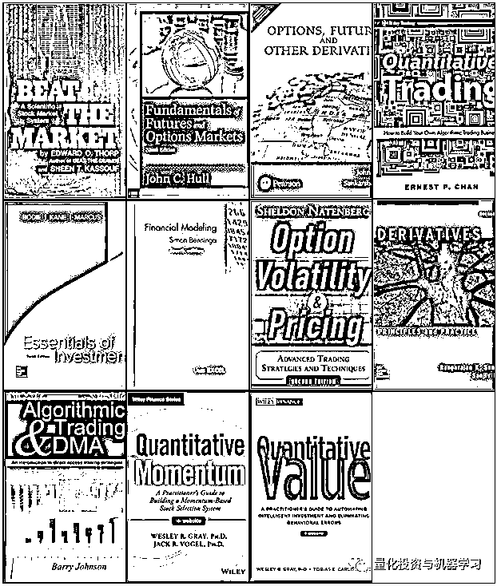
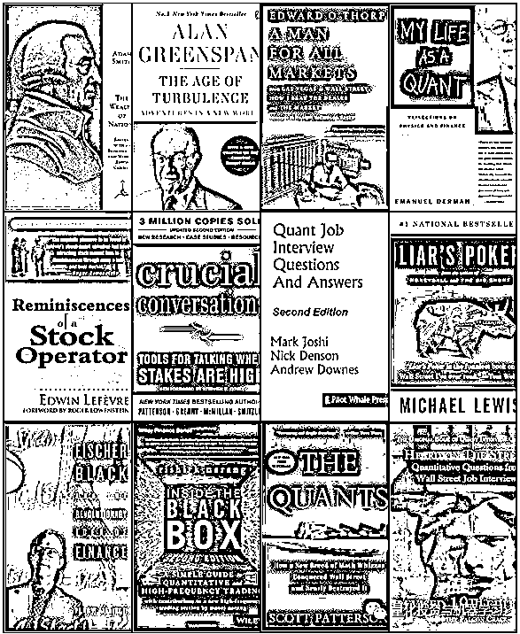
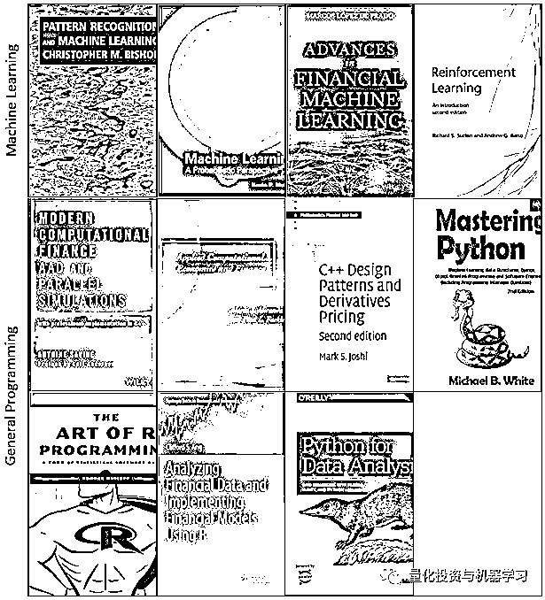
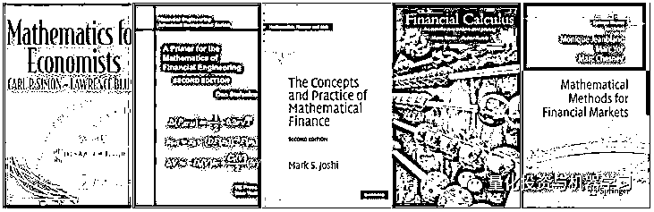
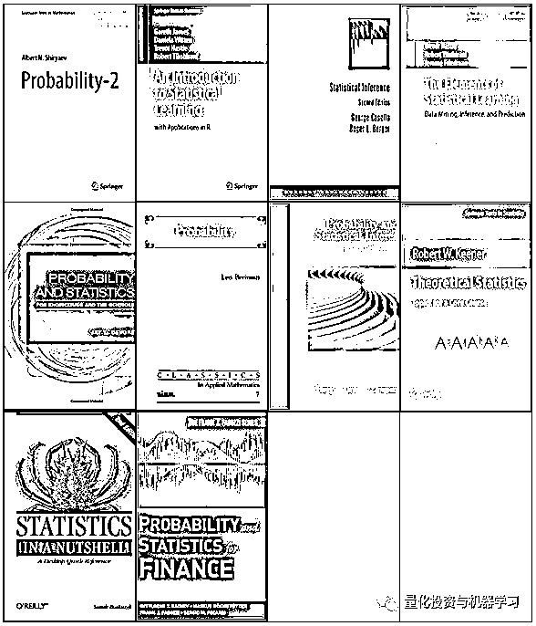
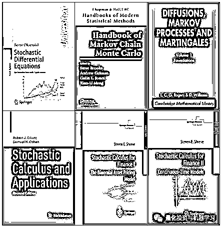
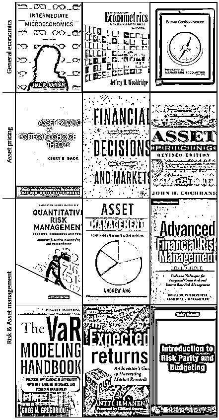
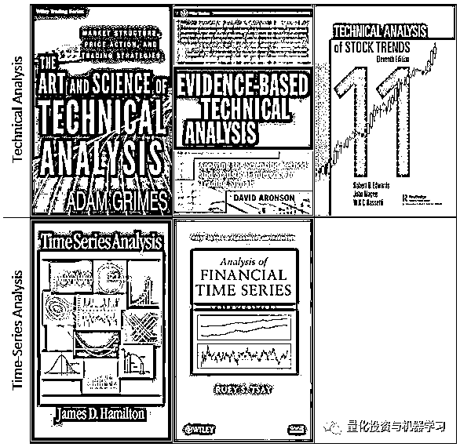

# 吐血干货 | 量化、算法、机器学习交易书单完整目录

> 原文：[`mp.weixin.qq.com/s?__biz=MzAxNTc0Mjg0Mg==&mid=2653291871&idx=1&sn=9d88e9fb99a2f9353e1b44af7e18c0dc&chksm=802dc74ab75a4e5cec2e64c71242ae46d151990566dd10aeefbfc5c0f871631e6acb18b136ab&scene=27#wechat_redirect`](http://mp.weixin.qq.com/s?__biz=MzAxNTc0Mjg0Mg==&mid=2653291871&idx=1&sn=9d88e9fb99a2f9353e1b44af7e18c0dc&chksm=802dc74ab75a4e5cec2e64c71242ae46d151990566dd10aeefbfc5c0f871631e6acb18b136ab&scene=27#wechat_redirect)

**标星★公众号     **爱你们♥

作者：Peter Nistrup

**近期原创文章：**

## ♥ [基于无监督学习的期权定价异常检测（代码+数据）](https://mp.weixin.qq.com/s?__biz=MzAxNTc0Mjg0Mg==&mid=2653290562&idx=1&sn=dee61b832e1aa2c062a96bb27621c29d&chksm=802dc257b75a4b41b5623ade23a7de86333bfd3b4299fb69922558b0cbafe4c930b5ef503d89&token=1298662931&lang=zh_CN&scene=21#wechat_redirect)

## ♥ [5 种机器学习算法在预测股价的应用（代码+数据）](https://mp.weixin.qq.com/s?__biz=MzAxNTc0Mjg0Mg==&mid=2653290588&idx=1&sn=1d0409ad212ea8627e5d5cedf61953ac&chksm=802dc249b75a4b5fa245433320a4cc9da1a2cceb22df6fb1a28e5b94ff038319ae4e7ec6941f&token=1298662931&lang=zh_CN&scene=21#wechat_redirect)

## ♥ [深入研读：利用 Twitter 情绪去预测股市](https://mp.weixin.qq.com/s?__biz=MzAxNTc0Mjg0Mg==&mid=2653290402&idx=1&sn=efda9ea106991f4f7ccabcae9d809e00&chksm=802e3db7b759b4a173dc8f2ab5c298ab3146bfd7dd5aca75929c74ecc999a53b195c16f19c71&token=1330520237&lang=zh_CN&scene=21#wechat_redirect)

## ♥ [Two Sigma 用新闻来预测股价走势，带你吊打 Kaggle](https://mp.weixin.qq.com/s?__biz=MzAxNTc0Mjg0Mg==&mid=2653290456&idx=1&sn=b8d2d8febc599742e43ea48e3c249323&chksm=802e3dcdb759b4db9279c689202101b6b154fb118a1c1be12b52e522e1a1d7944858dbd6637e&token=1330520237&lang=zh_CN&scene=21#wechat_redirect)

## ♥ [利用深度学习最新前沿预测股价走势](https://mp.weixin.qq.com/s?__biz=MzAxNTc0Mjg0Mg==&mid=2653290080&idx=1&sn=06c50cefe78a7b24c64c4fdb9739c7f3&chksm=802e3c75b759b563c01495d16a638a56ac7305fc324ee4917fd76c648f670b7f7276826bdaa8&token=770078636&lang=zh_CN&scene=21#wechat_redirect)

## ♥ [一位数据科学 PhD 眼中的算法交易](https://mp.weixin.qq.com/s?__biz=MzAxNTc0Mjg0Mg==&mid=2653290118&idx=1&sn=a261307470cf2f3e458ab4e7dc309179&chksm=802e3c93b759b585e079d3a797f512dfd0427ac02942339f4f1454bd368ba47be21cb52cf969&token=770078636&lang=zh_CN&scene=21#wechat_redirect)

## ♥ [基于 RNN 和 LSTM 的股市预测方法](https://mp.weixin.qq.com/s?__biz=MzAxNTc0Mjg0Mg==&mid=2653290481&idx=1&sn=f7360ea8554cc4f86fcc71315176b093&chksm=802e3de4b759b4f2235a0aeabb6e76b3e101ff09b9a2aa6fa67e6e824fc4274f68f4ae51af95&token=1865137106&lang=zh_CN&scene=21#wechat_redirect)

## ♥ [人工智能『AI』应用算法交易，7 个必踩的坑！](https://mp.weixin.qq.com/s?__biz=MzAxNTc0Mjg0Mg==&mid=2653289974&idx=1&sn=88f87cb64999d9406d7c618350aac35d&chksm=802e3fe3b759b6f5eca6e777364270cbaa0bf35e9a1535255be9751c3a77642676993a861132&token=770078636&lang=zh_CN&scene=21#wechat_redirect)

## ♥ [神经网络在算法交易上的应用系列（一）](https://mp.weixin.qq.com/s?__biz=MzAxNTc0Mjg0Mg==&mid=2653289962&idx=1&sn=5f5aa65ec00ce176501c85c7c106187d&chksm=802e3fffb759b6e9f2d4518f9d3755a68329c8753745333ef9d70ffd04bd088fd7b076318358&token=770078636&lang=zh_CN&scene=21#wechat_redirect)

## ♥ [预测股市 | 如何避免 p-Hacking，为什么你要看涨？](https://mp.weixin.qq.com/s?__biz=MzAxNTc0Mjg0Mg==&mid=2653289820&idx=1&sn=d3fee74ba1daab837433e4ef6b0ab4d9&chksm=802e3f49b759b65f422d20515942d5813aead73231da7d78e9f235bdb42386cf656079e69b8b&token=770078636&lang=zh_CN&scene=21#wechat_redirect)

## ♥ [如何鉴别那些用深度学习预测股价的花哨模型？](https://mp.weixin.qq.com/s?__biz=MzAxNTc0Mjg0Mg==&mid=2653290132&idx=1&sn=cbf1e2a4526e6e9305a6110c17063f46&chksm=802e3c81b759b597d3dd94b8008e150c90087567904a29c0c4b58d7be220a9ece2008956d5db&token=1266110554&lang=zh_CN&scene=21#wechat_redirect)

## ♥ [优化强化学习 Q-learning 算法进行股市](https://mp.weixin.qq.com/s?__biz=MzAxNTc0Mjg0Mg==&mid=2653290286&idx=1&sn=882d39a18018733b93c8c8eac385b515&chksm=802e3d3bb759b42d1fc849f96bf02ae87edf2eab01b0beecd9340112c7fb06b95cb2246d2429&token=1330520237&lang=zh_CN&scene=21#wechat_redirect)

**正文**

## 这是一个很长的书单（100 本+）

> *“You wont become an algorithmic genius savant extraordinaire philanthropist billionaire overnight.”*

如果你全身心投入，你就会离实现财务自由的梦想越来越近。 

有些书的内容是重叠的，所以你应该自己研究哪些书更适合你的思维方式和当前的技能。

由以下几类构成：

*   一般阅读

*   轻松阅读

*   编程

*   数学

*   经济学与金融学

*   技术类与时间序列分析

*   其他

*   衍生品

**基础**

**轻松阅读**

**编程-机器学习**

特别是 Python、R 和 C++。

**数学-统计与概率、随机过程等**

**经济学和金融学**

**技术和时间序列分析**

**其他**

*   Security Analysis by Benjamin Graham, David Dodd, Warren Buffett

*   The (Mis)Behavior of Markets by Benoît B. Mandelbrot, Richard L.

*   Damodaran on Valuation by Damodaran Aswath

*   Models Behaving Badly by Emanuel Derman

*   Trading Systems by Emilio Tomasini

*   Business Cycles and Equilibrium by Fischer Black

*   Dual Momentum Investing by Gary Antonacci

*   The Problem with HFT by Haim Bodek

*   The Econometrics of Financial Markets by John Y., Wen-C. Lo, Archie C.

*   Building Winning Algorithmic Trading Systems by Kevin Davey

*   Trading and Exchanges by Larry Harris

*   Martingale Methods in Financial Modelling by Marek M., Marek R.

*   Dynamic Hedging: Managing Vanilla and Exotic Options by Nassim N.

*   Financial Modelling With Jump Processes by Rama C. & Peter T.

*   The Evaluation and Optimization of Trading Strategies by Robert P.

*   Fundamentals of Corporate Finance by Stephen A., Randolph W & more

*   Arbitrage Theory in Continuous Time by Tomas Björk

*   Trade Your Way to Financial Freedom by Van K. Tharp

**衍生品**

#### **Equity derivatives**

*   The Volatility Surface by Jim Gatheral

*   Stochastic Volatility Modeling by Lorenzo Bergomi

*   Equity Hybrid Derivatives by Marcus Overhaus et al.

#### **FX derivatives**

*   FX Options and Smile Risk by Antonio Castagna

*   Foreign Exchange Option Pricing by Iain J. Clark FX

*   FX Options and Structured Products by Uwe Wystup

#### **Commodity derivatives**

*   Energy and Power Risk Management by Alexander E.

*   Commodities and Commodity Derivatives by Helyette Geman

*   Commodity Option Pricing by Iain J. Clark

#### **Interest rate derivatives**

*   Interest Rate Models — Theory and Practice by Damiano B. & Fabio M.

*   Pricing and Trading Interest Rate Derivatives by J. H. M. Darbyshire

*   Interest Rate Modeling I, II & III by Leif Andersen & Vladimir Piterbarg

*   Interest Rate Option Models by Rebonato

#### **Credit derivatives**

*   Modelling Single-name and Multi-name Credit Derivatives by Dominic

*   Credit Risk — Modeling, Valuation & Hedging by Tomasz R. & Marek R.

**XVA**

*   XVA: Credit, Funding and Capital Valuation Adjustments by Andrew G.

*   Counterparty Credit Risk, Collateral and Funding by Damiano Brigo

*—End—*

量化投资与机器学习微信公众号，是业内垂直于**Quant**、**MFE**、**CST**等专业的主流自媒体。公众号拥有来自**公募、私募、券商、银行、海外**等众多圈内**10W+**关注者。每日发布行业前沿研究成果和最新资讯。

